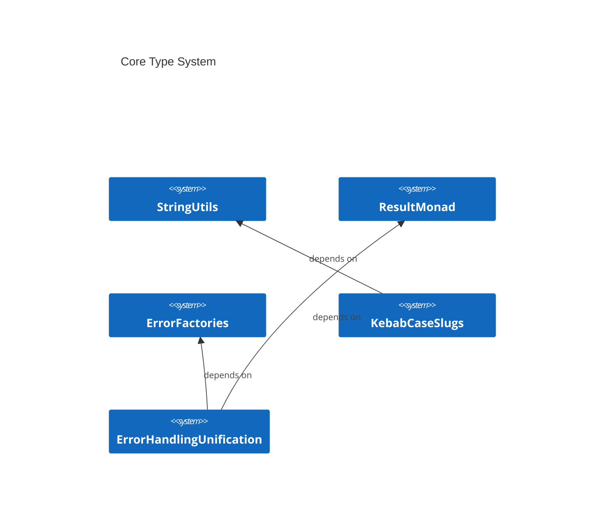
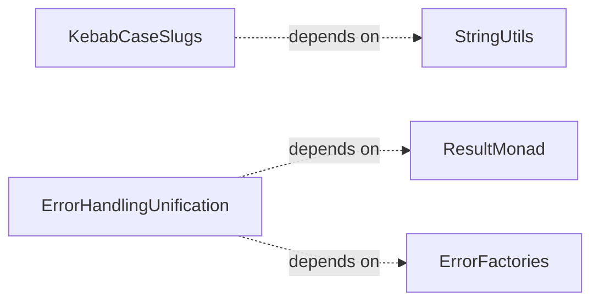

# CoreTypes Overview

**Purpose:** CoreTypes product area overview
**Detail Level:** Full reference

---

**What foundational types exist?** CoreTypes provides the foundational type system used across all other areas. Three pillars enforce discipline at compile time: the Result monad replaces try/catch with explicit error handling — functions return `Result.ok(value)` or `Result.err(error)` instead of throwing. The DocError discriminated union provides structured error context with type, file, line, and reason fields, enabling exhaustive pattern matching in error handlers. Branded types create nominal typing from structural TypeScript — `PatternId`, `CategoryName`, and `SourceFilePath` are compile-time distinct despite all being strings. String utilities handle slugification and case conversion with acronym-aware title casing.

## Key Invariants

- Result over try/catch: All functions return `Result<T, E>` instead of throwing. Compile-time verification that errors are handled. `isOk`/`isErr` type guards enable safe narrowing
- DocError discriminated union: 12 structured error types with `type` discriminator field. `isDocError` type guard for safe classification. Specialized union aliases (`ScanError`, `ExtractionError`) scope error handling per operation
- Branded nominal types: `Branded<T, Brand>` creates compile-time distinct types from structural TypeScript. Prevents mixing `PatternId` with `CategoryName` even though both are `string` at runtime
- String transformation consistency: `slugify` produces URL-safe identifiers, `camelCaseToTitleCase` preserves acronyms (e.g., "APIEndpoint" becomes "API Endpoint"), `toKebabCase` handles consecutive uppercase correctly

---

## Contents

- [Key Invariants](#key-invariants)
- [Core Type System](#core-type-system)
- [Error Handling Flow](#error-handling-flow)
- [API Types](#api-types)
- [Business Rules](#business-rules)

---

## Core Type System

Scoped architecture diagram showing component relationships:



---

## Error Handling Flow

Scoped architecture diagram showing component relationships:



---

## API Types

### BaseDocError (interface)

```typescript
/**
 * Base error interface for all documentation errors
 *
 */
```

```typescript
interface BaseDocError {
  /** Error type discriminator for pattern matching */
  readonly type: string;
  /** Human-readable error message */
  readonly message: string;
}
```

| Property | Description                                   |
| -------- | --------------------------------------------- |
| type     | Error type discriminator for pattern matching |
| message  | Human-readable error message                  |

### Result (type)

```typescript
/**
 * Result type representing either success (Ok) or failure (Err)
 *
 * @typeParam T - The success value type
 * @typeParam E - The error type (defaults to Error)
 */
```

```typescript
type Result<T, E = Error> = Ok<T> | Err<E>;
```

### DocError (type)

```typescript
/**
 * Discriminated union of all possible errors
 *
 * **Benefits**:
 * - Exhaustive pattern matching in switch statements
 * - Type narrowing based on `type` field
 * - Compile-time verification of error handling
 *
 */
```

```typescript
type DocError =
  | FileSystemError
  | FileParseError
  | DirectiveValidationError
  | PatternValidationError
  | RegistryValidationError
  | MarkdownGenerationError
  | FileWriteError
  | FeatureParseError
  | ConfigError
  | ProcessMetadataValidationError
  | DeliverableValidationError
  | GherkinPatternValidationError;
```

---

## Business Rules

9 patterns, 34 rules with invariants (34 total)

### Deliverable Status Taxonomy Testing

| Rule                                                                        | Invariant                                                                                                                           | Rationale                                                                                                                                                    |
| --------------------------------------------------------------------------- | ----------------------------------------------------------------------------------------------------------------------------------- | ------------------------------------------------------------------------------------------------------------------------------------------------------------ |
| isDeliverableStatusTerminal identifies terminal statuses for DoD validation | Only complete, n/a, and superseded are terminal. Deferred is NOT terminal because it implies unfinished work that should block DoD. | Marking a pattern as completed when deliverables are merely deferred creates a hard-locked state with incomplete work, violating delivery process integrity. |
| Status predicates classify individual deliverable states                    | isDeliverableStatusComplete, isDeliverableStatusInProgress, and isDeliverableStatusPending each match exactly one status value.     | Single-value predicates provide type-safe branching for consumers that need to distinguish specific states rather than terminal vs non-terminal groupings.   |
| getDeliverableStatusEmoji returns display emoji for all statuses            | getDeliverableStatusEmoji returns a non-empty string for all 6 canonical statuses. No status value is unmapped.                     | Missing emoji mappings would cause empty display cells in generated documentation tables, breaking visual consistency.                                       |

### Error Factories

| Rule                                                                          | Invariant                                                                                                                                                                | Rationale                                                                                                                                                                            |
| ----------------------------------------------------------------------------- | ------------------------------------------------------------------------------------------------------------------------------------------------------------------------ | ------------------------------------------------------------------------------------------------------------------------------------------------------------------------------------ |
| createFileSystemError produces discriminated FILE_SYSTEM_ERROR types          | Every FileSystemError must have type "FILE_SYSTEM_ERROR", the source file path, a reason enum value, and a human-readable message derived from the reason.               | File system errors are the most common failure mode in the scanner; discriminated types enable exhaustive switch/case handling in error recovery paths.                              |
| createDirectiveValidationError formats file location with line number         | Every DirectiveValidationError must include the source file path, line number, and reason, with the message formatted as "file:line" for IDE-clickable error output.     | The "file:line" format enables click-to-navigate in IDEs and terminals, turning validation errors into actionable links rather than requiring manual file/line lookup.               |
| createPatternValidationError captures pattern identity and validation details | Every PatternValidationError must include the pattern name, source file path, and reason, with an optional array of specific validation errors for detailed diagnostics. | Pattern names appear across many source files; without the pattern name and file path in the error, developers cannot locate which annotation triggered the validation failure.      |
| createProcessMetadataValidationError validates Gherkin process metadata       | Every ProcessMetadataValidationError must include the feature file path and a reason describing which metadata field failed validation.                                  | Process metadata (status, phase, deliverables) drives FSM validation and documentation generation; silent metadata errors propagate incorrect state across all downstream consumers. |
| createDeliverableValidationError tracks deliverable-specific failures         | Every DeliverableValidationError must include the feature file path and reason, with optional deliverableName for pinpointing which deliverable failed validation.       | Features often contain multiple deliverables; without the deliverable name in the error, developers must manually inspect the entire Background table to find the failing row.       |

### Error Handling Unification

| Rule                                                           | Invariant                                                                                                                                          | Rationale                                                                                                                                                                               |
| -------------------------------------------------------------- | -------------------------------------------------------------------------------------------------------------------------------------------------- | --------------------------------------------------------------------------------------------------------------------------------------------------------------------------------------- |
| isDocError type guard classifies errors correctly              | isDocError must return true for valid DocError instances and false for non-DocError values including null and undefined.                           | Without a reliable type guard, error handlers cannot safely narrow unknown caught values to DocError, forcing unsafe casts or redundant field checks at every catch site.               |
| formatDocError produces structured human-readable output       | formatDocError must include all context fields (error type, file path, line number) and render validation errors when present on pattern errors.   | Omitting context fields forces developers to cross-reference logs with source files manually; including all fields in a single formatted message makes errors actionable on first read. |
| Gherkin extractor collects errors without console side effects | Extraction errors must include structured context (file path, pattern name, validation errors) and must never use console.warn to report warnings. | console.warn bypasses error collection, making warnings invisible to callers and untestable. Structured error objects enable programmatic handling across all consumers.                |
| CLI error handler formats unknown errors gracefully            | Unknown error values (non-DocError, non-Error) must be formatted as "Error: {value}" strings for safe display without crashing.                    | CLI commands can receive arbitrary thrown values (strings, numbers, objects); coercing them to a safe string prevents the error handler itself from crashing on unexpected types.       |

### File Cache Testing

| Rule                                            | Invariant                                                                                                                                             | Rationale                                                                                                                             |
| ----------------------------------------------- | ----------------------------------------------------------------------------------------------------------------------------------------------------- | ------------------------------------------------------------------------------------------------------------------------------------- |
| Store and retrieve round-trip preserves content | Content stored via set is returned identically by get. No transformation or encoding occurs.                                                          | File content must survive caching verbatim; any mutation would cause extraction to produce different results on cache hits vs misses. |
| has checks membership without affecting stats   | has returns true for cached paths and false for uncached paths. It does not increment hit or miss counters.                                           | has is used for guard checks before get; double-counting would inflate stats and misrepresent actual cache effectiveness.             |
| Stats track hits and misses accurately          | Every get call increments either hits or misses. hitRate is computed as (hits / total) \* 100 with a zero-division guard returning 0 when total is 0. | Accurate stats enable performance analysis of generation runs; incorrect counts would lead to wrong caching decisions.                |
| Clear resets cache and stats                    | clear removes all cached entries and resets hit/miss counters to zero.                                                                                | Per-run scoping requires a clean slate; stale entries from a previous run would cause the extractor to use outdated content.          |

### Kebab Case Slugs

| Rule                                  | Invariant                                                                                                                                                     | Rationale                                                                                                                                                                     |
| ------------------------------------- | ------------------------------------------------------------------------------------------------------------------------------------------------------------- | ----------------------------------------------------------------------------------------------------------------------------------------------------------------------------- |
| CamelCase names convert to kebab-case | CamelCase pattern names must be split at word boundaries and joined with hyphens in lowercase.                                                                | Generated file names and URL fragments must be human-readable and URL-safe; unsplit CamelCase produces opaque slugs that are difficult to scan in directory listings.         |
| Edge cases are handled correctly      | Slug generation must handle special characters, consecutive separators, and leading/trailing hyphens without producing invalid slugs.                         | Unhandled edge cases produce malformed file names (double hyphens, leading dashes) that break cross-platform path resolution and make generated links inconsistent.           |
| Requirements include phase prefix     | Requirement slugs must be prefixed with "phase-NN-" where NN is the zero-padded phase number, defaulting to "00" when no phase is assigned.                   | Phase prefixes enable lexicographic sorting of requirement files by delivery order, so directory listings naturally reflect the roadmap sequence.                             |
| Phase slugs use kebab-case for names  | Phase slugs must combine a zero-padded phase number with the kebab-case name in the format "phase-NN-name", defaulting to "unnamed" when no name is provided. | A consistent "phase-NN-name" format ensures phase files sort numerically and remain identifiable even when the phase number alone would be ambiguous across roadmap versions. |

### Normalized Status Testing

| Rule                                                   | Invariant                                                                                                                                                             | Rationale                                                                                                                                               |
| ------------------------------------------------------ | --------------------------------------------------------------------------------------------------------------------------------------------------------------------- | ------------------------------------------------------------------------------------------------------------------------------------------------------- |
| normalizeStatus maps raw FSM states to display buckets | normalizeStatus must map every raw FSM status to exactly one of three display buckets: completed, active, or planned. Unknown or undefined inputs default to planned. | UI and generated documentation need a simplified status model; the raw 4-state FSM is an implementation detail that should not leak into display logic. |
| Pattern status predicates check normalized state       | isPatternComplete, isPatternActive, and isPatternPlanned are mutually exclusive for any given status input. Exactly one returns true.                                 | Consumers branch on these predicates; overlapping true values would cause double-rendering or contradictory UI states.                                  |

### Result Monad

| Rule                                                          | Invariant                                                                                                                                                         | Rationale                                                                                                                                                                                |
| ------------------------------------------------------------- | ----------------------------------------------------------------------------------------------------------------------------------------------------------------- | ---------------------------------------------------------------------------------------------------------------------------------------------------------------------------------------- |
| Result.ok wraps values into success results                   | Result.ok always produces a result where isOk is true, regardless of the wrapped value type (primitives, objects, null, undefined).                               | Consumers rely on isOk to branch logic; if Result.ok could produce an ambiguous state, every call site would need defensive checks beyond the type guard.                                |
| Result.err wraps values into error results                    | Result.err always produces a result where isErr is true, supporting Error instances, strings, and structured objects as error values.                             | Supporting multiple error value types allows callers to propagate rich context (structured objects) or simple messages (strings) without forcing a single error representation.          |
| Type guards distinguish success from error results            | isOk and isErr are mutually exclusive: exactly one returns true for any Result value.                                                                             | If both guards could return true (or both false), TypeScript type narrowing would break, leaving the value/error branch unreachable or unsound.                                          |
| unwrap extracts the value or throws the error                 | unwrap on a success result returns the value; unwrap on an error result always throws an Error instance (wrapping non-Error values for stack trace preservation). | Wrapping non-Error values in Error instances ensures stack traces are always available for debugging, preventing the loss of call-site context when string or object errors are thrown.  |
| unwrapOr extracts the value or returns a default              | unwrapOr on a success result returns the contained value (ignoring the default); on an error result it returns the provided default value.                        | Providing a safe fallback path avoids forcing callers to handle errors explicitly when a sensible default exists, reducing boilerplate in non-critical error recovery.                   |
| map transforms the success value without affecting errors     | map applies the transformation function only to success results; error results pass through unchanged. Multiple maps can be chained.                              | Skipping the transformation on error results enables chained pipelines to short-circuit on the first failure without requiring explicit error checks at each step.                       |
| mapErr transforms the error value without affecting successes | mapErr applies the transformation function only to error results; success results pass through unchanged. Error types can be converted.                           | Allowing error-type conversion at boundaries (e.g., low-level I/O errors to domain errors) keeps success paths untouched and preserves the original value through error-handling layers. |

### String Utils

| Rule                                           | Invariant                                                                                                                        | Rationale                                                                                                                                                         |
| ---------------------------------------------- | -------------------------------------------------------------------------------------------------------------------------------- | ----------------------------------------------------------------------------------------------------------------------------------------------------------------- |
| slugify generates URL-safe slugs               | slugify must produce lowercase, alphanumeric, hyphen-only strings with no leading/trailing hyphens.                              | URL slugs appear in file paths and links across all generated documentation; inconsistent slugification would break cross-references.                             |
| camelCaseToTitleCase generates readable titles | camelCaseToTitleCase must insert spaces at camelCase boundaries and preserve known acronyms (HTTP, XML, API, DoD, AST, GraphQL). | Pattern names stored as PascalCase identifiers appear as human-readable titles in generated documentation; incorrect splitting would produce unreadable headings. |

### Tag Registry Builder Testing

| Rule                                               | Invariant                                                                                                                                                  | Rationale                                                                                                                                                                      |
| -------------------------------------------------- | ---------------------------------------------------------------------------------------------------------------------------------------------------------- | ------------------------------------------------------------------------------------------------------------------------------------------------------------------------------ |
| buildRegistry returns a well-formed TagRegistry    | buildRegistry always returns a TagRegistry with version, categories, metadataTags, aggregationTags, formatOptions, tagPrefix, and fileOptInTag properties. | All downstream consumers (scanner, extractor, validator) depend on registry structure. A malformed registry would cause silent extraction failures across the entire pipeline. |
| Metadata tags have correct configuration           | The pattern tag is required, the status tag has a default value, and tags with transforms apply them correctly.                                            | Misconfigured tag metadata would cause the extractor to skip required fields or apply wrong defaults, producing silently corrupt patterns.                                     |
| Registry includes standard prefixes and opt-in tag | tagPrefix is the standard annotation prefix and fileOptInTag is the bare opt-in marker. These are non-empty strings.                                       | Changing these values without updating all annotated files would break scanner opt-in detection across the entire monorepo.                                                    |

---
