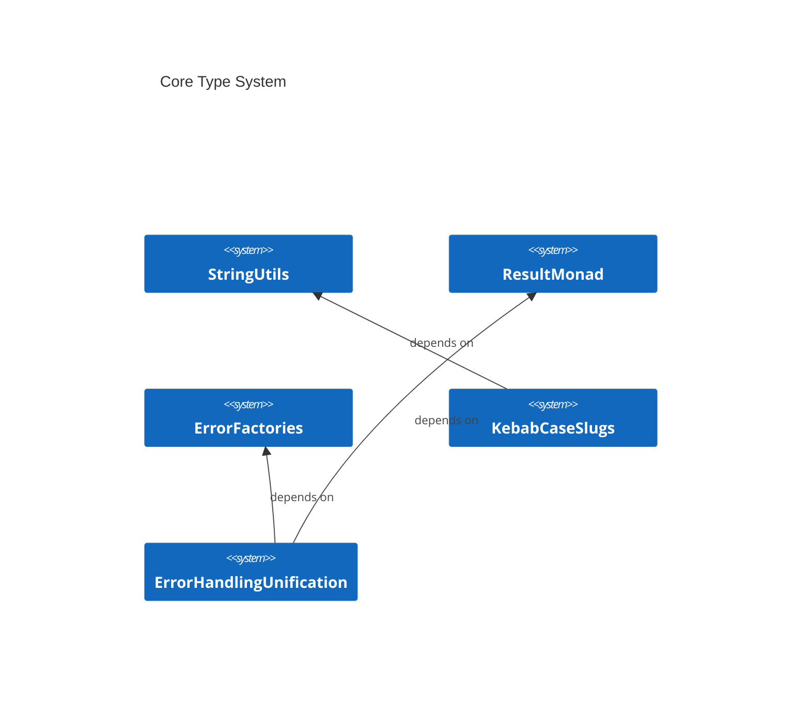
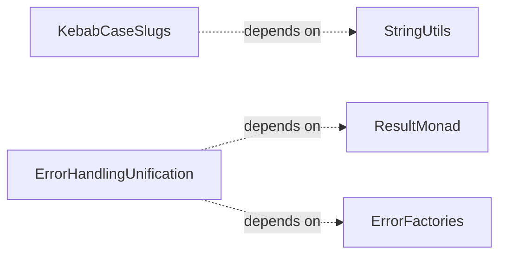

# CoreTypes Overview

**Purpose:** CoreTypes product area overview
**Detail Level:** Full reference

---

**What foundational types exist?** CoreTypes provides the foundational type system used across all other areas. Three pillars enforce discipline at compile time: the Result monad replaces try/catch with explicit error handling — functions return `Result.ok(value)` or `Result.err(error)` instead of throwing. The DocError discriminated union provides structured error context with type, file, line, and reason fields, enabling exhaustive pattern matching in error handlers. Branded types create nominal typing from structural TypeScript — `PatternId`, `CategoryName`, and `SourceFilePath` are compile-time distinct despite all being strings. String utilities handle slugification and case conversion with acronym-aware title casing.

## Key Invariants

- Result over try/catch: All functions return `Result<T, E>` instead of throwing. Compile-time verification that errors are handled. `isOk`/`isErr` type guards enable safe narrowing
- DocError discriminated union: 12 structured error types with `type` discriminator field. `isDocError` type guard for safe classification. Specialized union aliases (`ScanError`, `ExtractionError`) scope error handling per operation
- Branded nominal types: `Branded<T, Brand>` creates compile-time distinct types from structural TypeScript. Prevents mixing `PatternId` with `CategoryName` even though both are `string` at runtime
- String transformation consistency: `slugify` produces URL-safe identifiers, `camelCaseToTitleCase` preserves acronyms (e.g., "APIEndpoint" becomes "API Endpoint"), `toKebabCase` handles consecutive uppercase correctly

---

## Core Type System

Scoped architecture diagram showing component relationships:



---

## Error Handling Flow

Scoped architecture diagram showing component relationships:



---

## API Types

### BaseDocError (interface)

```typescript
/**
 * Base error interface for all documentation errors
 *
 */
```

```typescript
interface BaseDocError {
  /** Error type discriminator for pattern matching */
  readonly type: string;
  /** Human-readable error message */
  readonly message: string;
}
```

| Property | Description                                   |
| -------- | --------------------------------------------- |
| type     | Error type discriminator for pattern matching |
| message  | Human-readable error message                  |

### Result (type)

```typescript
/**
 * Result type representing either success (Ok) or failure (Err)
 *
 * @typeParam T - The success value type
 * @typeParam E - The error type (defaults to Error)
 */
```

```typescript
type Result<T, E = Error> = Ok<T> | Err<E>;
```

### DocError (type)

```typescript
/**
 * Discriminated union of all possible errors
 *
 * **Benefits**:
 * - Exhaustive pattern matching in switch statements
 * - Type narrowing based on `type` field
 * - Compile-time verification of error handling
 *
 */
```

```typescript
type DocError =
  | FileSystemError
  | FileParseError
  | DirectiveValidationError
  | PatternValidationError
  | RegistryValidationError
  | MarkdownGenerationError
  | FileWriteError
  | FeatureParseError
  | ConfigError
  | ProcessMetadataValidationError
  | DeliverableValidationError
  | GherkinPatternValidationError;
```

---

## Behavior Specifications

### ResultMonadTypes

[View ResultMonadTypes source](src/types/result.ts)

## Result Monad - Type Definitions

Explicit error handling via discriminated union.
Functions return `Result.ok(value)` or `Result.err(error)` instead of throwing.

### ErrorFactoryTypes

[View ErrorFactoryTypes source](src/types/errors.ts)

## Error Factories - Type Definitions

Structured, discriminated error types with factory functions.
Each error type has a unique `type` discriminator for exhaustive pattern matching.

### StringUtils

[View StringUtils source](tests/features/utils/string-utils.feature)

String utilities provide consistent text transformations across the codebase.
These functions handle URL slugification and case conversion with proper
handling of edge cases like acronyms and special characters.

**Covered functions:**

- `slugify` - Convert text to URL-safe slugs (lowercase, alphanumeric, hyphens)
- `camelCaseToTitleCase` - Convert CamelCase to "Title Case" with spaces

**Note:** `toKebabCase` is already tested in kebab-case-slugs.feature

#### slugify generates URL-safe slugs

**Invariant:** slugify must produce lowercase, alphanumeric, hyphen-only strings with no leading/trailing hyphens.

**Rationale:** URL slugs appear in file paths and links across all generated documentation; inconsistent slugification would break cross-references.

**Verified by:**

- slugify converts text to URL-safe format
- slugify handles empty-ish input
- slugify handles single word

#### camelCaseToTitleCase generates readable titles

**Invariant:** camelCaseToTitleCase must insert spaces at camelCase boundaries and preserve known acronyms (HTTP, XML, API, DoD, AST, GraphQL).

**Rationale:** Pattern names stored as PascalCase identifiers appear as human-readable titles in generated documentation; incorrect splitting would produce unreadable headings.

**Verified by:**

- camelCaseToTitleCase converts to title case
- camelCaseToTitleCase handles all-uppercase acronym
- camelCaseToTitleCase handles lowercase word

### ResultMonad

[View ResultMonad source](tests/features/types/result-monad.feature)

The Result type provides explicit error handling via a discriminated union.
This eliminates thrown exceptions in favor of type-safe error propagation.

**Why Result over try/catch:**

- Compile-time verification that errors are handled
- Type narrowing via isOk/isErr guards
- Chainable transformations via map/mapErr
- No hidden control flow from thrown exceptions

<details>
<summary>Result.ok wraps values into success results (4 scenarios)</summary>

#### Result.ok wraps values into success results

**Invariant:** Result.ok always produces a result where isOk is true, regardless of the wrapped value type (primitives, objects, null, undefined).

**Verified by:**

- Result.ok wraps a primitive value
- Result.ok wraps an object value
- Result.ok wraps null value
- Result.ok wraps undefined value

</details>

<details>
<summary>Result.err wraps values into error results (3 scenarios)</summary>

#### Result.err wraps values into error results

**Invariant:** Result.err always produces a result where isErr is true, supporting Error instances, strings, and structured objects as error values.

**Verified by:**

- Result.err wraps an Error instance
- Result.err wraps a string error
- Result.err wraps a structured error object

</details>

<details>
<summary>Type guards distinguish success from error results (2 scenarios)</summary>

#### Type guards distinguish success from error results

**Invariant:** isOk and isErr are mutually exclusive: exactly one returns true for any Result value.

**Verified by:**

- Type guards correctly identify success results
- Type guards correctly identify error results

</details>

<details>
<summary>unwrap extracts the value or throws the error (4 scenarios)</summary>

#### unwrap extracts the value or throws the error

**Invariant:** unwrap on a success result returns the value; unwrap on an error result always throws an Error instance (wrapping non-Error values for stack trace preservation).

**Verified by:**

- unwrap extracts value from success result
- unwrap throws the Error from error result
- unwrap wraps non-Error in Error for proper stack trace
- unwrap serializes object error to JSON in message

</details>

<details>
<summary>unwrapOr extracts the value or returns a default (3 scenarios)</summary>

#### unwrapOr extracts the value or returns a default

**Invariant:** unwrapOr on a success result returns the contained value (ignoring the default); on an error result it returns the provided default value.

**Verified by:**

- unwrapOr returns value from success result
- unwrapOr returns default from error result
- unwrapOr returns numeric default from error result

</details>

<details>
<summary>map transforms the success value without affecting errors (3 scenarios)</summary>

#### map transforms the success value without affecting errors

**Invariant:** map applies the transformation function only to success results; error results pass through unchanged. Multiple maps can be chained.

**Verified by:**

- map transforms success value
- map passes through error unchanged
- map chains multiple transformations

</details>

<details>
<summary>mapErr transforms the error value without affecting successes (3 scenarios)</summary>

#### mapErr transforms the error value without affecting successes

**Invariant:** mapErr applies the transformation function only to error results; success results pass through unchanged. Error types can be converted.

**Verified by:**

- mapErr transforms error value
- mapErr passes through success unchanged
- mapErr converts error type

</details>

### ErrorFactories

[View ErrorFactories source](tests/features/types/error-factories.feature)

Error factories create structured, discriminated error types with consistent
message formatting. Each error type has a unique discriminator for exhaustive
pattern matching in switch statements.

**Why typed errors matter:**

- Compile-time exhaustiveness checking in error handlers
- Consistent message formatting across the codebase
- Structured data for logging and reporting
- Type narrowing via discriminator field

<details>
<summary>createFileSystemError produces discriminated FILE_SYSTEM_ERROR types (3 scenarios)</summary>

#### createFileSystemError produces discriminated FILE_SYSTEM_ERROR types

**Invariant:** Every FileSystemError must have type "FILE_SYSTEM_ERROR", the source file path, a reason enum value, and a human-readable message derived from the reason.

**Rationale:** File system errors are the most common failure mode in the scanner; discriminated types enable exhaustive switch/case handling in error recovery paths.

**Verified by:**

- createFileSystemError generates correct message for each reason
- createFileSystemError includes optional originalError
- createFileSystemError omits originalError when not provided

</details>

<details>
<summary>createDirectiveValidationError formats file location with line number (3 scenarios)</summary>

#### createDirectiveValidationError formats file location with line number

**Invariant:** Every DirectiveValidationError must include the source file path, line number, and reason, with the message formatted as "file:line" for IDE-clickable error output.

**Verified by:**

- createDirectiveValidationError includes line number in message
- createDirectiveValidationError includes optional directive snippet
- createDirectiveValidationError omits directive when not provided

</details>

<details>
<summary>createPatternValidationError captures pattern identity and validation details (3 scenarios)</summary>

#### createPatternValidationError captures pattern identity and validation details

**Invariant:** Every PatternValidationError must include the pattern name, source file path, and reason, with an optional array of specific validation errors for detailed diagnostics.

**Verified by:**

- createPatternValidationError formats pattern name and file
- createPatternValidationError includes validation errors array
- createPatternValidationError omits validationErrors when not provided

</details>

<details>
<summary>createProcessMetadataValidationError validates Gherkin process metadata (2 scenarios)</summary>

#### createProcessMetadataValidationError validates Gherkin process metadata

**Invariant:** Every ProcessMetadataValidationError must include the feature file path and a reason describing which metadata field failed validation.

**Verified by:**

- createProcessMetadataValidationError formats file and reason
- createProcessMetadataValidationError includes readonly validation errors

</details>

<details>
<summary>createDeliverableValidationError tracks deliverable-specific failures (4 scenarios)</summary>

#### createDeliverableValidationError tracks deliverable-specific failures

**Invariant:** Every DeliverableValidationError must include the feature file path and reason, with optional deliverableName for pinpointing which deliverable failed validation.

**Verified by:**

- createDeliverableValidationError formats file and reason
- createDeliverableValidationError includes optional deliverableName
- createDeliverableValidationError omits deliverableName when not provided
- createDeliverableValidationError includes validation errors

</details>

### KebabCaseSlugs

[View KebabCaseSlugs source](tests/features/behavior/kebab-case-slugs.feature)

As a documentation generator
I need to generate readable, URL-safe slugs from pattern names
So that generated file names are discoverable and human-friendly

The slug generation must handle:

- CamelCase patterns like "DeciderPattern" → "decider-pattern"
- Consecutive uppercase like "APIEndpoint" → "api-endpoint"
- Numbers in names like "OAuth2Flow" → "o-auth-2-flow"
- Special characters removal
- Proper phase prefixing for requirements

<details>
<summary>CamelCase names convert to kebab-case (1 scenarios)</summary>

#### CamelCase names convert to kebab-case

**Invariant:** CamelCase pattern names must be split at word boundaries and joined with hyphens in lowercase.

**Verified by:**

- Convert pattern names to readable slugs

</details>

<details>
<summary>Edge cases are handled correctly (1 scenarios)</summary>

#### Edge cases are handled correctly

**Invariant:** Slug generation must handle special characters, consecutive separators, and leading/trailing hyphens without producing invalid slugs.

**Verified by:**

- Handle edge cases in slug generation

</details>

<details>
<summary>Requirements include phase prefix (2 scenarios)</summary>

#### Requirements include phase prefix

**Invariant:** Requirement slugs must be prefixed with "phase-NN-" where NN is the zero-padded phase number, defaulting to "00" when no phase is assigned.

**Verified by:**

- Requirement slugs include phase number
- Requirement without phase uses phase 00

</details>

<details>
<summary>Phase slugs use kebab-case for names (2 scenarios)</summary>

#### Phase slugs use kebab-case for names

**Invariant:** Phase slugs must combine a zero-padded phase number with the kebab-case name in the format "phase-NN-name", defaulting to "unnamed" when no name is provided.

**Verified by:**

- Phase slugs combine number and kebab-case name
- Phase without name uses "unnamed"

</details>

### ErrorHandlingUnification

[View ErrorHandlingUnification source](tests/features/behavior/error-handling.feature)

All CLI commands and extractors should use the DocError discriminated
union pattern for consistent, structured error handling.

**Problem:**

- Raw errors lack context (no file path, line number, or pattern name)
- Inconsistent error formats across CLI, scanner, and extractor
- console.warn bypasses error collection, losing validation warnings
- Unknown errors produce unhelpful messages

**Solution:**

- DocError discriminated union with structured context (type, file, line, reason)
- isDocError type guard for safe error classification
- formatDocError for human-readable output with all context fields
- Error collection pattern that captures warnings without console output

<details>
<summary>isDocError type guard classifies errors correctly (3 scenarios)</summary>

#### isDocError type guard classifies errors correctly

**Invariant:** isDocError must return true for valid DocError instances and false for non-DocError values including null and undefined.

**Verified by:**

- isDocError detects valid DocError instances
- isDocError rejects non-DocError objects
- isDocError rejects null and undefined

</details>

<details>
<summary>formatDocError produces structured human-readable output (2 scenarios)</summary>

#### formatDocError produces structured human-readable output

**Invariant:** formatDocError must include all context fields (error type, file path, line number) and render validation errors when present on pattern errors.

**Verified by:**

- formatDocError includes structured context
- formatDocError includes validation errors for pattern errors

</details>

<details>
<summary>Gherkin extractor collects errors without console side effects (3 scenarios)</summary>

#### Gherkin extractor collects errors without console side effects

**Invariant:** Extraction errors must include structured context (file path, pattern name, validation errors) and must never use console.warn to report warnings.

**Rationale:** console.warn bypasses error collection, making warnings invisible to callers and untestable. Structured error objects enable programmatic handling across all consumers.

**Verified by:**

- Errors include structured context
- No console.warn bypasses error collection
- Skip feature files without @libar-docs opt-in

</details>

<details>
<summary>CLI error handler formats unknown errors gracefully (1 scenarios)</summary>

#### CLI error handler formats unknown errors gracefully

**Invariant:** Unknown error values (non-DocError, non-Error) must be formatted as "Error: {value}" strings for safe display without crashing.

**Verified by:**

- handleCliError formats unknown errors

</details>

---
