# DataAPI Overview

**Purpose:** DataAPI product area overview
**Detail Level:** Full reference

---

**How do I query process state?** The Data API provides direct terminal access to delivery process state. It replaces reading generated markdown or launching explore agents — targeted queries use 5-10x less context. The `context` command assembles curated bundles tailored to session type (planning, design, implement).

## Key Invariants

- One-command context assembly: `context <pattern> --session <type>` returns metadata + file paths + dependency status + architecture position in ~1.5KB
- Session type tailoring: `planning` (~500B, brief + deps), `design` (~1.5KB, spec + stubs + deps), `implement` (deliverables + FSM + tests)
- Direct API queries replace doc reading: JSON output is 5-10x smaller than generated docs

---

## DataAPI Components

Scoped architecture diagram showing component relationships:

```mermaid
graph TB
    subgraph api["Api"]
        MasterDataset[/"MasterDataset"/]
        PatternSummarizerImpl("PatternSummarizerImpl")
        ScopeValidatorImpl("ScopeValidatorImpl")
        ProcessStateAPI("ProcessStateAPI")
        PatternHelpers["PatternHelpers"]
        HandoffGeneratorImpl("HandoffGeneratorImpl")
        FuzzyMatcherImpl("FuzzyMatcherImpl")
        CoverageAnalyzerImpl("CoverageAnalyzerImpl")
        ContextFormatterImpl("ContextFormatterImpl")
        ContextAssemblerImpl("ContextAssemblerImpl")
        ArchQueriesImpl("ArchQueriesImpl")
    end
    subgraph cli["Cli"]
        ProcessAPICLIImpl("ProcessAPICLIImpl")
        OutputPipelineImpl("OutputPipelineImpl")
    end
    subgraph related["Related"]
        Pattern_Scanner["Pattern Scanner"]:::neighbor
        StubResolverImpl["StubResolverImpl"]:::neighbor
        FSMValidator["FSMValidator"]:::neighbor
        ProcessStateAPICLI["ProcessStateAPICLI"]:::neighbor
        PhaseStateMachineValidation["PhaseStateMachineValidation"]:::neighbor
        DataAPIDesignSessionSupport["DataAPIDesignSessionSupport"]:::neighbor
        DataAPIOutputShaping["DataAPIOutputShaping"]:::neighbor
        DataAPIContextAssembly["DataAPIContextAssembly"]:::neighbor
        DataAPIArchitectureQueries["DataAPIArchitectureQueries"]:::neighbor
    end
    ProcessAPICLIImpl -->|uses| ProcessStateAPI
    ProcessAPICLIImpl -->|uses| MasterDataset
    ProcessAPICLIImpl -->|uses| Pattern_Scanner
    ProcessAPICLIImpl -->|uses| PatternSummarizerImpl
    ProcessAPICLIImpl -->|uses| FuzzyMatcherImpl
    ProcessAPICLIImpl -->|uses| OutputPipelineImpl
    ProcessAPICLIImpl ..->|implements| ProcessStateAPICLI
    OutputPipelineImpl -->|uses| PatternSummarizerImpl
    OutputPipelineImpl ..->|implements| DataAPIOutputShaping
    PatternSummarizerImpl -->|uses| ProcessStateAPI
    PatternSummarizerImpl ..->|implements| DataAPIOutputShaping
    ScopeValidatorImpl -->|uses| ProcessStateAPI
    ScopeValidatorImpl -->|uses| MasterDataset
    ScopeValidatorImpl -->|uses| StubResolverImpl
    ScopeValidatorImpl ..->|implements| DataAPIDesignSessionSupport
    ProcessStateAPI -->|uses| MasterDataset
    ProcessStateAPI -->|uses| FSMValidator
    ProcessStateAPI ..->|implements| PhaseStateMachineValidation
    PatternHelpers ..->|implements| DataAPIOutputShaping
    HandoffGeneratorImpl -->|uses| ProcessStateAPI
    HandoffGeneratorImpl -->|uses| MasterDataset
    HandoffGeneratorImpl -->|uses| ContextFormatterImpl
    HandoffGeneratorImpl ..->|implements| DataAPIDesignSessionSupport
    FuzzyMatcherImpl ..->|implements| DataAPIOutputShaping
    CoverageAnalyzerImpl -->|uses| Pattern_Scanner
    CoverageAnalyzerImpl -->|uses| MasterDataset
    CoverageAnalyzerImpl ..->|implements| DataAPIArchitectureQueries
    ContextFormatterImpl -->|uses| ContextAssemblerImpl
    ContextFormatterImpl ..->|implements| DataAPIContextAssembly
    ContextAssemblerImpl -->|uses| ProcessStateAPI
    ContextAssemblerImpl -->|uses| MasterDataset
    ContextAssemblerImpl -->|uses| PatternSummarizerImpl
    ContextAssemblerImpl -->|uses| FuzzyMatcherImpl
    ContextAssemblerImpl -->|uses| StubResolverImpl
    ContextAssemblerImpl ..->|implements| DataAPIContextAssembly
    ArchQueriesImpl -->|uses| ProcessStateAPI
    ArchQueriesImpl -->|uses| MasterDataset
    ArchQueriesImpl ..->|implements| DataAPIArchitectureQueries
    StubResolverImpl -->|uses| ProcessStateAPI
    FSMValidator ..->|implements| PhaseStateMachineValidation
    DataAPIDesignSessionSupport -.->|depends on| DataAPIContextAssembly
    DataAPIContextAssembly -.->|depends on| DataAPIOutputShaping
    DataAPIArchitectureQueries -.->|depends on| DataAPIOutputShaping
    classDef neighbor stroke-dasharray: 5 5
```



---

## API Types

### MasterDatasetSchema (const)

```typescript
/**
 * Master Dataset - Unified view of all extracted patterns
 *
 * Contains raw patterns plus pre-computed views and statistics.
 * This is the primary data structure passed to generators and sections.
 */
```

```typescript
MasterDatasetSchema = z.object({
  // ─────────────────────────────────────────────────────────────────────────
  // Raw Data
  // ─────────────────────────────────────────────────────────────────────────

  /** All extracted patterns (both TypeScript and Gherkin) */
  patterns: z.array(ExtractedPatternSchema),

  /** Tag registry for category lookups */
  tagRegistry: TagRegistrySchema,

  // Note: workflow is not in the Zod schema because LoadedWorkflow contains Maps
  // (statusMap, phaseMap) which are not JSON-serializable. When workflow access
  // is needed, get it from SectionContext/GeneratorContext instead.

  // ─────────────────────────────────────────────────────────────────────────
  // Pre-computed Views
  // ─────────────────────────────────────────────────────────────────────────

  /** Patterns grouped by normalized status */
  byStatus: StatusGroupsSchema,

  /** Patterns grouped by phase number (sorted ascending) */
  byPhase: z.array(PhaseGroupSchema),

  /** Patterns grouped by quarter (e.g., "Q4-2024") */
  byQuarter: z.record(z.string(), z.array(ExtractedPatternSchema)),

  /** Patterns grouped by category */
  byCategory: z.record(z.string(), z.array(ExtractedPatternSchema)),

  /** Patterns grouped by source type */
  bySource: SourceViewsSchema,

  // ─────────────────────────────────────────────────────────────────────────
  // Aggregate Statistics
  // ─────────────────────────────────────────────────────────────────────────

  /** Overall status counts */
  counts: StatusCountsSchema,

  /** Number of distinct phases */
  phaseCount: z.number().int().nonnegative(),

  /** Number of distinct categories */
  categoryCount: z.number().int().nonnegative(),

  // ─────────────────────────────────────────────────────────────────────────
  // Relationship Data (optional)
  // ─────────────────────────────────────────────────────────────────────────

  /** Optional relationship index for dependency graph */
  relationshipIndex: z.record(z.string(), RelationshipEntrySchema).optional(),

  // ─────────────────────────────────────────────────────────────────────────
  // Architecture Data (optional)
  // ─────────────────────────────────────────────────────────────────────────

  /** Optional architecture index for diagram generation */
  archIndex: ArchIndexSchema.optional(),
});
```

### StatusGroupsSchema (const)

```typescript
/**
 * Status-based grouping of patterns
 *
 * Patterns are normalized to three canonical states:
 * - completed: implemented, completed
 * - active: active, partial, in-progress
 * - planned: roadmap, planned, undefined
 */
```

```typescript
StatusGroupsSchema = z.object({
  /** Patterns with status 'completed' or 'implemented' */
  completed: z.array(ExtractedPatternSchema),

  /** Patterns with status 'active', 'partial', or 'in-progress' */
  active: z.array(ExtractedPatternSchema),

  /** Patterns with status 'roadmap', 'planned', or undefined */
  planned: z.array(ExtractedPatternSchema),
});
```

### StatusCountsSchema (const)

```typescript
/**
 * Status counts for aggregate statistics
 */
```

```typescript
StatusCountsSchema = z.object({
  /** Number of completed patterns */
  completed: z.number().int().nonnegative(),

  /** Number of active patterns */
  active: z.number().int().nonnegative(),

  /** Number of planned patterns */
  planned: z.number().int().nonnegative(),

  /** Total number of patterns */
  total: z.number().int().nonnegative(),
});
```

### PhaseGroupSchema (const)

```typescript
/**
 * Phase grouping with patterns and counts
 *
 * Groups patterns by their phase number, with pre-computed
 * status counts for each phase.
 */
```

```typescript
PhaseGroupSchema = z.object({
  /** Phase number (e.g., 1, 2, 3, 14, 39) */
  phaseNumber: z.number().int(),

  /** Optional phase name from workflow config */
  phaseName: z.string().optional(),

  /** Patterns in this phase */
  patterns: z.array(ExtractedPatternSchema),

  /** Pre-computed status counts for this phase */
  counts: StatusCountsSchema,
});
```

### SourceViewsSchema (const)

```typescript
/**
 * Source-based views for different data origins
 */
```

```typescript
SourceViewsSchema = z.object({
  /** Patterns from TypeScript files (.ts) */
  typescript: z.array(ExtractedPatternSchema),

  /** Patterns from Gherkin feature files (.feature) */
  gherkin: z.array(ExtractedPatternSchema),

  /** Patterns with phase metadata (roadmap items) */
  roadmap: z.array(ExtractedPatternSchema),

  /** Patterns with PRD metadata (productArea, userRole, businessValue) */
  prd: z.array(ExtractedPatternSchema),
});
```

### RelationshipEntrySchema (const)

```typescript
/**
 * Relationship index for dependency tracking
 *
 * Maps pattern names to their relationship metadata.
 */
```

```typescript
RelationshipEntrySchema = z.object({
  /** Patterns this pattern uses (from @libar-docs-uses) */
  uses: z.array(z.string()),

  /** Patterns that use this pattern (from @libar-docs-used-by) */
  usedBy: z.array(z.string()),

  /** Patterns this pattern depends on (from @libar-docs-depends-on) */
  dependsOn: z.array(z.string()),

  /** Patterns this pattern enables (from @libar-docs-enables) */
  enables: z.array(z.string()),

  // UML-inspired relationship fields (PatternRelationshipModel)
  /** Patterns this item implements (realization relationship) */
  implementsPatterns: z.array(z.string()),

  /** Files/patterns that implement this pattern (computed inverse with file paths) */
  implementedBy: z.array(ImplementationRefSchema),

  /** Pattern this extends (generalization relationship) */
  extendsPattern: z.string().optional(),

  /** Patterns that extend this pattern (computed inverse) */
  extendedBy: z.array(z.string()),

  /** Related patterns for cross-reference without dependency (from @libar-docs-see-also tag) */
  seeAlso: z.array(z.string()),

  /** File paths to implementation APIs (from @libar-docs-api-ref tag) */
  apiRef: z.array(z.string()),
});
```

### ArchIndexSchema (const)

```typescript
/**
 * Architecture index for diagram generation
 *
 * Groups patterns by architectural metadata for rendering component diagrams.
 */
```

```typescript
ArchIndexSchema = z.object({
  /** Patterns grouped by arch-role (bounded-context, projection, saga, etc.) */
  byRole: z.record(z.string(), z.array(ExtractedPatternSchema)),

  /** Patterns grouped by arch-context (orders, inventory, etc.) */
  byContext: z.record(z.string(), z.array(ExtractedPatternSchema)),

  /** Patterns grouped by arch-layer (domain, application, infrastructure) */
  byLayer: z.record(z.string(), z.array(ExtractedPatternSchema)),

  /** Patterns grouped by include tag (cross-cutting content routing and diagram scoping) */
  byView: z.record(z.string(), z.array(ExtractedPatternSchema)),

  /** Patterns with any architecture metadata (for diagram generation) */
  all: z.array(ExtractedPatternSchema),
});
```

---

## Behavior Specifications

### RulesQueryModule

[View RulesQueryModule source](src/api/rules-query.ts)

## RulesQueryModule - Business Rules Domain Query

Pure query function for business rules extracted from Gherkin Rule: blocks.
Groups rules by product area, phase, and feature pattern.

Target: src/api/rules-query.ts
See: DD-4 (ProcessAPILayeredExtraction)

### PipelineFactory

[View PipelineFactory source](src/generators/pipeline/build-pipeline.ts)

## PipelineFactory - Shared Pipeline Orchestration

Shared factory that executes the 8-step scan-extract-merge-transform pipeline.
Replaces inline pipeline orchestration in CLI consumers.

Target: src/generators/pipeline/build-pipeline.ts
See: ADR-006 (Single Read Model Architecture)
See: DD-1, DD-2 (ProcessAPILayeredExtraction)

### ProcessStateAPIRelationshipQueries

[View ProcessStateAPIRelationshipQueries source](delivery-process/specs/process-state-api-relationship-queries.feature)

**Problem:** ProcessStateAPI currently supports dependency queries (`uses`, `usedBy`, `dependsOn`,
`enables`) but lacks implementation relationship queries. Claude Code cannot ask "what code
implements this pattern?" or "what pattern does this file implement?"

**Solution:** Extend ProcessStateAPI with relationship query methods that leverage the new
`implements`/`extends` tags from PatternRelationshipModel:

- Bidirectional traceability: spec → code and code → spec
- Inheritance hierarchy navigation: base → specializations
- Implementation discovery: pattern → implementing files

**Business Value:**
| Benefit | How |
| Reduced context usage | Query exact relationships vs reading multiple files |
| Faster exploration | "Show implementations" in one call vs grep + read |
| Accurate traceability | Real-time from source annotations, not stale docs |

<details>
<summary>API provides implementation relationship queries (3 scenarios)</summary>

#### API provides implementation relationship queries

**Invariant:** Every pattern with `implementedBy` entries is discoverable via the API.

**Rationale:** Claude Code needs to navigate from abstract patterns to concrete code. Without this, exploration requires manual grep + file reading, wasting context tokens.

| Query                        | Returns                             | Use Case                                     |
| ---------------------------- | ----------------------------------- | -------------------------------------------- |
| getImplementations(pattern)  | File paths implementing the pattern | "Show me the code for EventStoreDurability"  |
| getImplementedPatterns(file) | Patterns the file implements        | "What patterns does outbox.ts implement?"    |
| hasImplementations(pattern)  | boolean                             | Filter patterns with/without implementations |

**Verified by:**

- Query implementations for a pattern
- Query implemented patterns for a file
- Query implementations for pattern with none
- Query implementations for pattern
- Query implemented patterns for file

</details>

<details>
<summary>API provides inheritance hierarchy queries (3 scenarios)</summary>

#### API provides inheritance hierarchy queries

**Invariant:** Pattern inheritance chains are fully navigable in both directions.

**Rationale:** Patterns form specialization hierarchies (e.g., ReactiveProjections extends ProjectionCategories). Claude Code needs to understand what specializes a base pattern and what a specialized pattern inherits from.

| Query                        | Returns                        | Use Case                                      |
| ---------------------------- | ------------------------------ | --------------------------------------------- |
| getExtensions(pattern)       | Patterns extending this one    | "What specializes ProjectionCategories?"      |
| getBasePattern(pattern)      | Pattern this extends (or null) | "What does ReactiveProjections inherit from?" |
| getInheritanceChain(pattern) | Full chain to root             | "Show full hierarchy for CachedProjections"   |

**Verified by:**

- Query extensions for a base pattern
- Query base pattern
- Full inheritance chain
- Query extensions

</details>

<details>
<summary>API provides combined relationship views (2 scenarios)</summary>

#### API provides combined relationship views

**Invariant:** All relationship types are accessible through a unified interface.

**Rationale:** Claude Code often needs the complete picture: dependencies AND implementations AND inheritance. A single call reduces round-trips and context switching.

**Verified by:**

- Get all relationships for a pattern
- Filter patterns by relationship existence
- Get all relationships
- Filter by relationship type

</details>

<details>
<summary>API supports bidirectional traceability queries (2 scenarios)</summary>

#### API supports bidirectional traceability queries

**Invariant:** Navigation from spec to code and code to spec is symmetric.

**Rationale:** Traceability is bidirectional by definition. If a spec links to code, the code should link back to the spec. The API should surface broken links.

| Query                          | Returns                                     | Use Case                        |
| ------------------------------ | ------------------------------------------- | ------------------------------- |
| getTraceabilityStatus(pattern) | {hasSpecs, hasImplementations, isSymmetric} | Audit traceability completeness |
| getBrokenLinks()               | Patterns with asymmetric traceability       | Find missing back-links         |

**Verified by:**

- Check traceability status for well-linked pattern
- Detect broken traceability links
- Check traceability status
- Detect broken links

</details>

### ProcessStateAPICLI

[View ProcessStateAPICLI source](delivery-process/specs/process-state-api-cli.feature)

**Problem:**
The ProcessStateAPI provides 27 typed query methods for efficient state queries, but
Claude Code sessions cannot use it directly:

- Import paths require built packages with correct ESM resolution
- No CLI command exposes the API for shell invocation
- Current workaround requires regenerating markdown docs and reading them
- Documentation claims API is "directly usable" but practical usage is blocked

**Solution:**
Add a CLI command `pnpm process:query` that exposes key ProcessStateAPI methods:

- `--status active|roadmap|completed` - Filter patterns by status
- `--phase N` - Get patterns in specific phase
- `--progress` - Show completion percentage and counts
- `--current-work` - Show active patterns (shorthand for --status active)
- `--roadmap-items` - Show available items (roadmap + deferred)
- `--format text|json` - Output format (default: text, json for AI parsing)

**Business Value:**
| Benefit | Impact |
| AI-native planning | Claude Code can query state in one command vs reading markdown |
| Reduced context usage | JSON output is 5-10x smaller than generated docs |
| Real-time accuracy | Queries source directly, no stale documentation |
| Session efficiency | "What's next?" answered in 100ms vs 10s regeneration |
| Completes API promise | Makes CLAUDE.md documentation accurate |

<details>
<summary>CLI supports status-based pattern queries (3 scenarios)</summary>

#### CLI supports status-based pattern queries

**Invariant:** Every ProcessStateAPI status query method is accessible via CLI.

**Rationale:** The most common planning question is "what's the current state?" Status queries (active, roadmap, completed) answer this directly without reading docs. Without CLI access, Claude Code must regenerate markdown and parse unstructured text.

| Flag               | API Method             | Use Case                 |
| ------------------ | ---------------------- | ------------------------ |
| --status active    | getCurrentWork()       | "What am I working on?"  |
| --status roadmap   | getRoadmapItems()      | "What can I start next?" |
| --status completed | getRecentlyCompleted() | "What's done recently?"  |
| --current-work     | getCurrentWork()       | Shorthand for active     |
| --roadmap-items    | getRoadmapItems()      | Shorthand for roadmap    |

**Verified by:**

- Query active patterns
- Query roadmap items
- Query completed patterns with limit

</details>

<details>
<summary>CLI supports phase-based queries (3 scenarios)</summary>

#### CLI supports phase-based queries

**Invariant:** Patterns can be filtered by phase number.

**Rationale:** Phase 18 (Event Durability) is the current focus per roadmap priorities. Quick phase queries help assess progress and remaining work within a phase. Phase-based planning is the primary organization method for roadmap work.

| Flag                 | API Method            | Use Case                      |
| -------------------- | --------------------- | ----------------------------- |
| --phase N            | getPatternsByPhase(N) | "What's in Phase 18?"         |
| --phase N --progress | getPhaseProgress(N)   | "How complete is Phase 18?"   |
| --phases             | getAllPhases()        | "List all phases with counts" |

**Verified by:**

- Query patterns in a specific phase
- Query phase progress
- List all phases

</details>

<details>
<summary>CLI provides progress summary queries (2 scenarios)</summary>

#### CLI provides progress summary queries

**Invariant:** Overall and per-phase progress is queryable in a single command.

**Rationale:** Planning sessions need quick answers to "where are we?" without reading the full PATTERNS.md generated file. Progress metrics drive prioritization and help identify where to focus effort.

| Flag           | API Method                                    | Use Case                  |
| -------------- | --------------------------------------------- | ------------------------- |
| --progress     | getStatusCounts() + getCompletionPercentage() | Overall progress          |
| --distribution | getStatusDistribution()                       | Detailed status breakdown |

**Verified by:**

- Overall progress summary
- Status distribution with percentages

</details>

<details>
<summary>CLI supports multiple output formats (3 scenarios)</summary>

#### CLI supports multiple output formats

**Invariant:** JSON output is parseable by AI agents without transformation.

**Rationale:** Claude Code can parse JSON directly. Text format is for human reading. JSON format enables scripting and integration with other tools. The primary use case is AI agent parsing where structured output reduces context and errors.

| Flag          | Output                | Use Case                    |
| ------------- | --------------------- | --------------------------- |
| --format text | Human-readable tables | Terminal usage              |
| --format json | Structured JSON       | AI agent parsing, scripting |

**Verified by:**

- JSON output format
- Text output format (default)
- Invalid format flag

</details>

<details>
<summary>CLI supports individual pattern lookup (3 scenarios)</summary>

#### CLI supports individual pattern lookup

**Invariant:** Any pattern can be queried by name with full details.

**Rationale:** During implementation, Claude Code needs to check specific pattern status, deliverables, and dependencies without reading the full spec file. Pattern lookup is essential for focused implementation work.

| Flag                          | API Method                   | Use Case                    |
| ----------------------------- | ---------------------------- | --------------------------- |
| --pattern NAME                | getPattern(name)             | "Show DCB pattern details"  |
| --pattern NAME --deliverables | getPatternDeliverables(name) | "What needs to be built?"   |
| --pattern NAME --deps         | getPatternDependencies(name) | "What does this depend on?" |

**Verified by:**

- Lookup pattern by name
- Query pattern deliverables
- Pattern not found

</details>

<details>
<summary>CLI provides discoverable help (2 scenarios)</summary>

#### CLI provides discoverable help

**Invariant:** All flags are documented via --help with examples.

**Rationale:** Claude Code can read --help output to understand available queries without needing external documentation. Self-documenting CLIs reduce the need for Claude Code to read additional context files.

**Verified by:**

- Help output shows all flags
- Help shows examples

</details>

### ProcessAPILayeredExtraction

[View ProcessAPILayeredExtraction source](delivery-process/specs/process-api-layered-extraction.feature)

**Problem:**
`process-api.ts` is 1,700 lines containing two remaining architectural
violations of ADR-006:

1. **Parallel Pipeline**: `buildPipeline()` (lines 488-561) wires the
   same 8-step scan-extract-transform sequence that `validate-patterns.ts`
   and `orchestrator.ts` also wire independently. Three consumers, three
   copies of identical pipeline orchestration code.

2. **Inline Domain Logic**: `handleRules()` (lines 1096-1279, 184 lines)
   builds nested `Map` hierarchies (area -> phase -> feature -> rules),
   parses business rule annotations via codec-layer imports
   (`parseBusinessRuleAnnotations`, `deduplicateScenarioNames`), and
   computes aggregate statistics. This is query logic that belongs in the
   API layer, not the CLI file.

Most subcommand handlers already delegate correctly. Of the 16 handlers
in process-api.ts, 13 are thin wrappers over `src/api/` modules:

| Handler | Delegates To |
| handleStatus | ProcessStateAPI methods |
| handleQuery | Dynamic API method dispatch |
| handlePattern | ProcessStateAPI methods |
| handleList | output-pipeline.ts |
| handleSearch | fuzzy-match.ts, pattern-helpers.ts |
| handleStubs | stub-resolver.ts |
| handleDecisions | stub-resolver.ts, pattern-helpers.ts |
| handlePdr | stub-resolver.ts |
| handleContext | context-assembler.ts, context-formatter.ts |
| handleFiles | context-assembler.ts, context-formatter.ts |
| handleDepTreeCmd | context-assembler.ts, context-formatter.ts |
| handleOverviewCmd | context-assembler.ts, context-formatter.ts |
| handleScopeValidate | scope-validator.ts |

The remaining violations are:

| Handler | Issue | Lines |
| handleRules | Inline domain logic: nested Maps, codec imports | 184 |
| handleArch | Partial: 6 sub-handlers delegate, 3 have trivial inline projections | 121 |
| buildPipeline | Parallel Pipeline: duplicates 8-step sequence | 74 |

**Solution:**
Extract the two remaining violations into their proper layers:

| Layer | Extraction | Location |
| Pipeline Factory | Shared scan-extract-transform sequence from buildPipeline | src/generators/pipeline/build-pipeline.ts |
| Query Handler | Business rules domain logic from handleRules | src/api/rules-query.ts |

The CLI retains its routing responsibility: parse args, call pipeline
factory, route subcommand to API module, format output.

**Design Decisions:**

DD-1: Pipeline factory location and return type.
Location: `src/generators/pipeline/build-pipeline.ts`, re-exported from
`src/generators/pipeline/index.ts`. The factory returns
`Result<PipelineResult, PipelineError>` so each consumer can map errors
to its own strategy (process-api calls `process.exit(1)`,
validate-patterns throws, orchestrator returns `Result.err()`).
`PipelineResult` contains `{ dataset: RuntimeMasterDataset, validation:
  ValidationSummary }`. The `TagRegistry` is accessible via
`dataset.tagRegistry` and does not need a separate field.

DD-2: Merge conflict strategy as a pipeline option.
The factory accepts `mergeConflictStrategy: 'fatal' | 'concatenate'`.
`'fatal'` returns `Result.err()` on conflicts (process-api behavior).
`'concatenate'` falls back to `[...ts, ...gherkin]` (validate-patterns
behavior per DD-1 in ValidatorReadModelConsolidation). This is the most
significant semantic difference between consumers.

DD-3: Factory interface designed for future orchestrator migration.
The `PipelineOptions` interface includes `exclude`, `contextInferenceRules`,
and `includeValidation` fields that orchestrator.ts needs. However, the
actual orchestrator migration is deferred to a follow-up spec. The
orchestrator has 155 lines of pipeline with structured warning collection
(scan errors, extraction errors, Gherkin parse errors as
`GenerationWarning[]`). Integrating this into the factory adds risk to a
first extraction. This spec migrates process-api.ts and
validate-patterns.ts only.

DD-4: handleRules domain logic extracts to `src/api/rules-query.ts`.
The new module exports `queryBusinessRules(dataset: RuntimeMasterDataset,
  filters: RulesFilters): RulesQueryResult`. The `RulesFilters` interface,
`RuleOutput` interface, and all nested Map construction move to this module.
The `parseBusinessRuleAnnotations` and `deduplicateScenarioNames` imports
move from CLI to API layer, which is the correct placement per ADR-006.
The CLI handler becomes: parse filters from args, call
`queryBusinessRules`, apply output modifiers, return.

DD-5: handleStubs, handleDecisions, handlePdr already delegate correctly.
These handlers are thin CLI wrappers over `stub-resolver.ts` functions
(`findStubPatterns`, `resolveStubs`, `groupStubsByPattern`,
`extractDecisionItems`, `findPdrReferences`). The residual CLI code is
argument parsing and error formatting, which is CLI-shell responsibility.
No extraction needed. The original deliverables are marked n/a.

DD-6: handleArch inline logic stays in CLI.
The `roles`, `context`, and `layer` listing sub-handlers have 3-5 line
`.map()` projections over `archIndex` pre-computed views. These are trivial
view formatting, not domain logic. The `dangling`, `orphans`, `blocking`,
`neighborhood`, `compare`, and `coverage` sub-handlers already delegate
to `arch-queries.ts` and `context-assembler.ts`. Extracting 3-line `.map()`
calls would add indirection with no architectural benefit.

DD-7: validate-patterns.ts partially adopts the pipeline factory.
The factory replaces the MasterDataset construction pipeline (steps 1-8).
DoD validation and anti-pattern detection remain as direct stage-1
consumers using raw scanned files (`scanResult.value.files`,
`gherkinScanResult.value.files`). This is correct per ADR-006: the
exception for `lint-patterns.ts` ("pure stage-1 consumer, no
relationships, no cross-source resolution, direct scanner consumption is
correct") applies equally to DoD validation (checking deliverable
completeness on raw Gherkin) and anti-pattern detection (checking tag
placement on raw scanned files).

DD-8: Line count invariant replaced with qualitative criterion.
The original 500-line target for process-api.ts is unrealistic. After
extracting buildPipeline (74 lines) and handleRules (184 lines), the
file is ~1,400 lines. The remaining code is legitimate CLI responsibility:
parseArgs (134), showHelp (143), routeSubcommand (96), main (59), 13 thin
delegation handlers (~350), config defaults (50), types (60), imports (120).
Reaching 500 lines would require extracting arg parsing and help text to
separate files, which is file hygiene, not architectural layering.
The invariant becomes: no Map/Set construction in handler functions, each
domain query delegates to an `src/api/` module.

**Implementation Order:**

| Step | What | Verification |
| 1 | Create src/generators/pipeline/build-pipeline.ts with PipelineOptions and factory | pnpm typecheck |
| 2 | Export from src/generators/pipeline/index.ts barrel | pnpm typecheck |
| 3 | Migrate process-api.ts buildPipeline to factory call | pnpm typecheck, pnpm process:query -- overview |
| 4 | Remove unused scanner/extractor imports from process-api.ts | pnpm lint |
| 5 | Migrate validate-patterns.ts MasterDataset pipeline to factory call | pnpm validate:patterns (0 errors, 0 warnings) |
| 6 | Create src/api/rules-query.ts with queryBusinessRules | pnpm typecheck |
| 7 | Slim handleRules in process-api.ts to thin delegation | pnpm process:query -- rules |
| 8 | Export from src/api/index.ts barrel | pnpm typecheck |
| 9 | Full verification | pnpm build, pnpm test, pnpm lint, pnpm validate:patterns |

**Files Modified:**

| File | Change | Lines Affected |
| src/generators/pipeline/build-pipeline.ts | NEW: shared pipeline factory | +~100 |
| src/generators/pipeline/index.ts | Add re-export of build-pipeline | +2 |
| src/api/rules-query.ts | NEW: business rules query from handleRules | +~200 |
| src/api/index.ts | Add re-exports for rules-query | +5 |
| src/cli/process-api.ts | Replace buildPipeline + handleRules with delegations | -~280 net |
| src/cli/validate-patterns.ts | Replace MasterDataset pipeline with factory call | -~30 net |

**What does NOT change:**

- parseArgs(), showHelp(), routeSubcommand(), main() (CLI shell)
- handleArch inline logic (trivial projections per DD-6)
- handleStubs/handleDecisions/handlePdr (already delegate per DD-5)
- generateEmptyHint (UX concern, correctly in CLI)
- DoD validation and anti-pattern detection in validate-patterns.ts (stage-1 consumers per DD-7)
- orchestrator.ts pipeline wiring (deferred per DD-3)
- parseListFilters, parseRulesFilters (arg parsing, not domain logic)
- ValidationIssue, ValidationSummary, ValidateCLIConfig (stable API in validate-patterns)

<details>
<summary>CLI file contains only routing, no domain logic (2 scenarios)</summary>

#### CLI file contains only routing, no domain logic

**Invariant:** `process-api.ts` parses arguments, calls the pipeline factory for the MasterDataset, routes subcommands to API modules, and formats output. It does not build Maps, filter patterns, group data, or resolve relationships. Thin view projections (3-5 line `.map()` calls over pre-computed archIndex views) are acceptable as formatting.

**Rationale:** Domain logic in the CLI file is only accessible via the command line. Extracting it to `src/api/` makes it programmatically testable, reusable by future consumers (MCP server, watch mode), and aligned with the feature-consumption layer defined in ADR-006.

**Verified by:**

- No domain data structures in handlers
- All domain queries delegate

</details>

<details>
<summary>Pipeline factory is shared across CLI consumers (2 scenarios)</summary>

#### Pipeline factory is shared across CLI consumers

**Invariant:** The scan-extract-transform sequence is defined once in `src/generators/pipeline/build-pipeline.ts`. CLI consumers that need a MasterDataset call the factory rather than wiring the pipeline independently. The factory accepts `mergeConflictStrategy` to handle behavioral differences between consumers.

**Rationale:** Three consumers (process-api, validate-patterns, orchestrator) independently wire the same 8-step sequence: loadConfig, scanPatterns, extractPatterns, scanGherkinFiles, extractPatternsFromGherkin, mergePatterns, computeHierarchyChildren, transformToMasterDataset. The only semantic difference is merge-conflict handling (fatal vs concatenate). This is a Parallel Pipeline anti-pattern per ADR-006.

**Verified by:**

- CLI consumers use factory
- Orchestrator migration deferred

</details>

<details>
<summary>Domain logic lives in API modules (2 scenarios)</summary>

#### Domain logic lives in API modules

**Invariant:** Query logic that operates on MasterDataset lives in `src/api/` modules. The `rules-query.ts` module provides business rules querying with the same grouping logic that was inline in handleRules: filter by product area and pattern, group by area -> phase -> feature -> rules, parse annotations, compute totals.

**Rationale:** `handleRules` is 184 lines with 5 Map/Set constructions, codec-layer imports (`parseBusinessRuleAnnotations`, `deduplicateScenarioNames`), and a complex 3-level grouping algorithm. This is the last significant inline domain logic in process-api.ts. Moving it to `src/api/` follows the same pattern as the 12 existing API modules (context-assembler, arch-queries, scope-validator, etc.).

**Verified by:**

- rules-query module exports
- handleRules slim wrapper

</details>

<details>
<summary>Pipeline factory returns Result for consumer-owned error handling (2 scenarios)</summary>

#### Pipeline factory returns Result for consumer-owned error handling

**Invariant:** The factory returns `Result<PipelineResult, PipelineError>` rather than throwing or calling `process.exit()`. Each consumer maps the error to its own strategy: process-api.ts calls `process.exit(1)`, validate-patterns.ts throws, and orchestrator.ts (future) returns `Result.err()`.

**Rationale:** The current `buildPipeline()` in process-api.ts calls `process.exit(1)` on errors, making it non-reusable. The factory must work across consumers with different error handling models. The Result monad is the project's established pattern for this (see `src/types/result.ts`).

**Verified by:**

- Factory uses Result monad
- Full verification passes

</details>

### DataAPIStubIntegration

[View DataAPIStubIntegration source](delivery-process/specs/data-api-stub-integration.feature)

**Problem:**
Design sessions produce code stubs in `delivery-process/stubs/` with rich
metadata: `@target` (destination file path), `@since` (design session ID),
`@see` (PDR references), and `AD-N` numbered decisions. But 14 of 22 stubs
lack the libar-docs opt-in marker, making them invisible to the scanner pipeline.
The 8 stubs that ARE scanned silently drop the target and see annotations because
they are not prefixed with the libar-docs namespace.

This means: the richest source of design context (stubs with architectural
decisions, target paths, and session provenance) is invisible to the API.

**Solution:**
A two-phase integration approach:

1. **Phase A (Annotation):** Add the libar-docs opt-in + implements tag to
   the 14 non-annotated stubs. This makes them scannable with zero pipeline changes.
2. **Phase B (Taxonomy):** Register libar-docs-target and libar-docs-since
   as new taxonomy tags. Rename existing `@target` and `@since` annotations in
   all stubs. This gives structured access to stub-specific metadata.

3. **Phase C (Commands):** Add query commands:

- `stubs [pattern]` lists design stubs with target paths
- `decisions [pattern]` surfaces PDR references and AD-N items
- `pdr <number>` finds all patterns referencing a specific PDR

**Business Value:**
| Benefit | Impact |
| 14 invisible stubs become visible | Full design context available to API |
| Target path tracking | Know where stubs will be implemented |
| Design decision queries | Surface AD-N decisions for review |
| PDR cross-referencing | Find all patterns related to a decision |

<details>
<summary>All stubs are visible to the scanner pipeline (3 scenarios)</summary>

#### All stubs are visible to the scanner pipeline

**Invariant:** Every stub file in `delivery-process/stubs/` has `@libar-docs` opt-in and `@libar-docs-implements` linking it to its parent pattern.

**Rationale:** The scanner requires `@libar-docs` opt-in marker to include a file. Without it, stubs are invisible regardless of other annotations. The `@libar-docs-implements` tag creates the bidirectional link: spec defines the pattern (via `@libar-docs-pattern`), stub implements it. Per PDR-009, stubs must NOT use `@libar-docs-pattern` -- that belongs to the feature file.

**Boundary note:** Phase A (annotating stubs with libar-docs opt-in and
libar-docs-implements tags) is consumer-side work done in each consuming repo.
Package.json scan paths (`-i 'delivery-process/stubs/**/*.ts'`) are already
pre-configured in 15 scripts. This spec covers Phase B: taxonomy tag
registration (libar-docs-target, libar-docs-since) and CLI query subcommands.

**Verified by:**

- Annotated stubs are discoverable by the scanner
- Stub target path is extracted as structured field
- Stub without libar-docs opt-in is invisible to scanner
- All stubs scanned
- Stub metadata extracted

</details>

<details>
<summary>Stubs subcommand lists design stubs with implementation status (4 scenarios)</summary>

#### Stubs subcommand lists design stubs with implementation status

**Invariant:** `stubs` returns stub files with their target paths, design session origins, and whether the target file already exists.

**Rationale:** Before implementation, agents need to know: which stubs exist for a pattern, where they should be moved to, and which have already been implemented. The stub-to-implementation resolver compares `@libar-docs-target` paths against actual files to determine status.

**Output per stub:**

| Field        | Source                                |
| ------------ | ------------------------------------- |
| Stub file    | Pattern filePath                      |
| Target       | @libar-docs-target value              |
| Implemented? | Target file exists?                   |
| Since        | @libar-docs-since (design session ID) |
| Pattern      | @libar-docs-implements value          |

**Verified by:**

- List all stubs with implementation status
- List stubs for a specific pattern
- Filter unresolved stubs
- Stubs for nonexistent pattern returns empty result
- List all stubs
- List stubs for pattern
- Filter unresolved

</details>

<details>
<summary>Decisions and PDR commands surface design rationale (3 scenarios)</summary>

#### Decisions and PDR commands surface design rationale

**Invariant:** Design decisions (AD-N items) and PDR references from stub annotations are queryable by pattern name or PDR number.

**Rationale:** Design sessions produce numbered decisions (AD-1, AD-2, etc.) and reference PDR decision records (see PDR-012). When reviewing designs or starting implementation, agents need to find these decisions without reading every stub file manually.

**decisions output:**

    **pdr output:**

```text
Pattern: AgentCommandInfrastructure
    Source: DS-4 (stubs/agent-command-routing/)
    Decisions:
      AD-1: Unified action model (PDR-011)
      AD-5: Router maps command types to orchestrator (PDR-012)
    PDRs referenced: PDR-011, PDR-012
```

```text
PDR-012: Agent Command Routing
    Referenced by:
      AgentCommandInfrastructure (5 stubs)
      CommandRouter (spec)
    Decision file: decisions/pdr-012-agent-command-routing.feature
```

**Verified by:**

- Query design decisions for a pattern
- Cross-reference a PDR number
- PDR query for nonexistent number returns empty
- Decisions for pattern
- PDR cross-reference

</details>

### DataAPIDesignSessionSupport

[View DataAPIDesignSessionSupport source](delivery-process/specs/data-api-session-support.feature)

**Problem:**
Starting a design or implementation session requires manually compiling
elaborate context prompts. For example, DS-3 (LLM Integration) needs:

- The spec to design against (agent-llm-integration.feature)
- Dependency stubs from DS-1 and DS-2 (action-handler, event-subscription, schema)
- Consumer specs for outside-in validation (churn-risk, admin-frontend)
- Existing infrastructure (CommandOrchestrator, EventBus)
- Dependency chain status and design decisions from prior sessions

This manual compilation takes 10-15 minutes per session start and is
error-prone (missing dependencies, stale context). Multi-session work
requires handoff documentation that is also manually maintained.

**Solution:**
Add session workflow commands that automate two critical session moments:

1. **Pre-flight check:** `scope-validate <pattern>` verifies implementation readiness
2. **Session end:** `handoff [--pattern X]` generates handoff documentation

Session context assembly (the "session start" moment) lives in DataAPIContextAssembly
via `context <pattern> --session design|implement|planning`. This spec focuses on
the validation and handoff capabilities that build on top of context assembly.

**Business Value:**
| Benefit | Impact |
| 10-15 min session start -> 1 command | Eliminates manual context compilation |
| Pre-flight catches blockers early | No wasted sessions on unready patterns |
| Automated handoff | Consistent multi-session state tracking |

#### Scope-validate checks implementation prerequisites before session start

**Invariant:** Scope validation surfaces all blocking conditions before committing to a session, preventing wasted effort on unready patterns.

**Rationale:** Starting implementation on a pattern with incomplete dependencies wastes an entire session. Starting a design session without prior session deliverables means working with incomplete context. Pre-flight validation catches these issues in seconds rather than discovering them mid-session.

**Validation checklist:**

| Check                                | Required For | Source                   |
| ------------------------------------ | ------------ | ------------------------ |
| Dependencies completed               | implement    | dependsOn chain status   |
| Stubs from dependency sessions exist | design       | implementedBy lookup     |
| Deliverables defined                 | implement    | Background table in spec |
| FSM allows transition to active      | implement    | isValidTransition()      |
| Design decisions recorded            | implement    | PDR references in stubs  |
| Executable specs location set        | implement    | @executable-specs tag    |

**Verified by:**

- All scope validation checks pass
- Dependency blocker detected
- FSM transition blocker detected
- All checks pass
- FSM blocker detected

#### Handoff generates compact session state summary for multi-session work

**Invariant:** Handoff documentation captures everything the next session needs to continue work without context loss.

**Rationale:** Multi-session work (common for design phases spanning DS-1 through DS-7) requires state transfer between sessions. Without automated handoff, critical information is lost: what was completed, what's in progress, what blockers were discovered, and what should happen next. Manual handoff documentation is inconsistent and often forgotten.

**Handoff output:**

| Section                 | Source                                                    |
| ----------------------- | --------------------------------------------------------- |
| Session summary         | Pattern name, session type, date                          |
| Completed               | Deliverables with status "complete"                       |
| In progress             | Deliverables with status not "complete" and not "pending" |
| Files modified          | Git diff file list (if available)                         |
| Discovered items        | @discovered-gap, @discovered-improvement tags             |
| Blockers                | Incomplete dependencies, open questions                   |
| Next session priorities | Remaining deliverables, suggested order                   |

**Verified by:**

- Generate handoff for in-progress pattern
- Handoff captures discovered items
- Handoff for in-progress pattern
- Handoff with discoveries

### DataAPIRelationshipGraph

[View DataAPIRelationshipGraph source](delivery-process/specs/data-api-relationship-graph.feature)

**Problem:**
The current API provides flat relationship lookups (`getPatternDependencies`,
`getPatternRelationships`) but no recursive traversal, impact analysis, or
graph health checks. Agents cannot answer "if I change X, what breaks?",
"what's the path from A to B?", or "which patterns have broken references?"
without manual multi-step exploration.

**Solution:**
Add graph query commands that operate on the full relationship graph:

1. `graph <pattern> [--depth N] [--direction up|down|both]` for recursive traversal
2. `graph impact <pattern>` for transitive dependent analysis
3. `graph path <from> <to>` for finding relationship chains
4. `graph dangling` for broken reference detection
5. `graph orphans` for isolated pattern detection
6. `graph blocking` for blocked chain visualization

**Business Value:**
| Benefit | Impact |
| Impact analysis | Know change blast radius before modifying |
| Dangling references | Detect annotation errors automatically |
| Blocking chains | Understand what prevents progress |
| Path finding | Discover non-obvious relationships |

**Relationship to ProcessStateAPIRelationshipQueries:**
This spec supersedes the earlier ProcessStateAPIRelationshipQueries spec,
which focused on implementation/inheritance convenience methods. The
underlying data is available via getPatternRelationships(). This spec
adds graph-level operations that traverse relationships recursively.

<details>
<summary>Graph command traverses relationships recursively with configurable depth (2 scenarios)</summary>

#### Graph command traverses relationships recursively with configurable depth

**Invariant:** Graph traversal walks both planning relationships (`dependsOn`, `enables`) and implementation relationships (`uses`, `usedBy`) with cycle detection to prevent infinite loops.

**Rationale:** Flat lookups show direct connections. Recursive traversal shows the full picture: transitive dependencies, indirect consumers, and the complete chain from root to leaf. Depth limiting prevents overwhelming output on deeply connected graphs.

**Verified by:**

- Recursive graph traversal
- Bidirectional traversal with depth limit
- Recursive traversal
- Depth limiting
- Direction filtering

</details>

<details>
<summary>Impact analysis shows transitive dependents of a pattern (2 scenarios)</summary>

#### Impact analysis shows transitive dependents of a pattern

**Invariant:** Impact analysis answers "if I change X, what else is affected?" by walking `usedBy` + `enables` recursively.

**Rationale:** Before modifying a completed pattern (which requires unlock), understanding the blast radius prevents unintended breakage. Impact analysis is the reverse of dependency traversal -- it looks forward, not backward.

**Verified by:**

- Impact analysis shows transitive dependents
- Impact analysis for leaf pattern
- Impact with transitive dependents
- Impact with no dependents

</details>

<details>
<summary>Path finding discovers relationship chains between two patterns (2 scenarios)</summary>

#### Path finding discovers relationship chains between two patterns

**Invariant:** Path finding returns the shortest chain of relationships connecting two patterns, or indicates no path exists. Traversal considers all relationship types (uses, usedBy, dependsOn, enables).

**Rationale:** Understanding how two seemingly unrelated patterns connect helps agents assess indirect dependencies before making changes. When pattern A and pattern D are connected through B and C, modifying A requires understanding that chain.

**Verified by:**

- Find path between connected patterns
- No path between disconnected patterns
- Path between connected patterns

</details>

<details>
<summary>Graph health commands detect broken references and isolated patterns (3 scenarios)</summary>

#### Graph health commands detect broken references and isolated patterns

**Invariant:** Dangling references (pattern names in `uses`/`dependsOn` that don't match any pattern definition) are detectable. Orphan patterns (no relationships at all) are identifiable.

**Rationale:** The MasterDataset transformer already computes dangling references during Pass 3 (relationship resolution) but does not expose them via the API. Orphan patterns indicate missing annotations. Both are data quality signals that improve over time with attention.

**Verified by:**

- Detect dangling references
- Detect orphan patterns
- Show blocking chains
- Dangling reference detection
- Orphan detection
- Blocking chains

</details>

### DataAPIPlatformIntegration

[View DataAPIPlatformIntegration source](delivery-process/specs/data-api-platform-integration.feature)

**Problem:**
The process-api CLI requires subprocess invocation for every query, adding
shell overhead and preventing stateful interaction. Claude Code's native tool
integration mechanism is Model Context Protocol (MCP), which the process API
does not support. Additionally, in the monorepo context, queries must specify
input paths for each package manually -- there is no cross-package view or
package-scoped filtering.

**Solution:**
Two integration capabilities:

1. **MCP Server Mode** -- Expose ProcessStateAPI as an MCP server that Claude
   Code connects to directly. Eliminates CLI overhead and enables stateful
   queries (pipeline loaded once, multiple queries without re-scanning).
2. **Monorepo Support** -- Cross-package dependency views, package-scoped
   filtering, multi-package presets, and per-package coverage reports.

**Business Value:**
| Benefit | Impact |
| MCP integration | Claude Code calls API as native tool |
| Stateful queries | No re-scanning between calls |
| Cross-package views | Understand monorepo-wide dependencies |
| Package-scoped queries | Focus on specific packages |

<details>
<summary>ProcessStateAPI is accessible as an MCP server for Claude Code (3 scenarios)</summary>

#### ProcessStateAPI is accessible as an MCP server for Claude Code

**Invariant:** The MCP server exposes all ProcessStateAPI methods as MCP tools with typed input/output schemas. The pipeline is loaded once on server start and refreshed on source file changes.

**Rationale:** MCP is Claude Code's native tool integration protocol. An MCP server eliminates the CLI subprocess overhead (2-5s per query) and enables Claude Code to call process queries as naturally as it calls other tools. Stateful operation means the pipeline loads once and serves many queries.

**MCP configuration:**

```text
// .mcp.json or claude_desktop_config.json
    {
      "mcpServers": {
        "delivery-process": {
          "command": "npx",
          "args": ["tsx", "src/mcp/server.ts", "--input", "src/**/*.ts", ...]
        }
      }
    }
```

**Verified by:**

- MCP server exposes ProcessStateAPI tools
- MCP tool invocation returns structured result
- MCP tool invocation with invalid parameters returns error
- MCP server starts
- MCP tool invocation
- Auto-refresh on change

</details>

<details>
<summary>Process state can be auto-generated as CLAUDE.md context sections (3 scenarios)</summary>

#### Process state can be auto-generated as CLAUDE.md context sections

**Invariant:** Generated CLAUDE.md sections are additive layers that provide pattern metadata, relationships, and reading lists for specific scopes.

**Rationale:** CLAUDE.md is the primary mechanism for providing persistent context to Claude Code sessions. Auto-generating CLAUDE.md sections from process state ensures the context is always fresh and consistent with the source annotations. This applies the "code-first documentation" principle to AI context itself.

**Verified by:**

- Generate CLAUDE.md context layer for bounded context
- Context layer reflects current process state
- Context layer for bounded context with no annotations
- Generate context layer
- Context layer is up-to-date

</details>

<details>
<summary>Cross-package views show dependencies spanning multiple packages (3 scenarios)</summary>

#### Cross-package views show dependencies spanning multiple packages

**Invariant:** Cross-package queries aggregate patterns from multiple input sources and resolve cross-package relationships.

**Rationale:** In the monorepo, patterns in `platform-core` are used by patterns in `platform-bc`, which are used by the example app. Understanding these cross-package dependencies is essential for release planning and impact analysis. Currently each package must be queried independently with separate input globs.

**Verified by:**

- Cross-package dependency view
- Package-scoped query filtering
- Query for non-existent package returns empty result
- Package-scoped filtering

</details>

<details>
<summary>Process validation integrates with git hooks and file watching (3 scenarios)</summary>

#### Process validation integrates with git hooks and file watching

**Invariant:** Pre-commit hooks validate annotation consistency. Watch mode re-generates docs on source changes.

**Rationale:** Git hooks catch annotation errors at commit time (e.g., new `uses` reference to non-existent pattern, invalid `arch-role` value, stub `@target` to non-existent directory). Watch mode enables live documentation regeneration during implementation sessions.

**Verified by:**

- Pre-commit validates annotation consistency
- Watch mode re-generates on file change
- Pre-commit on clean commit with no annotation changes
- Pre-commit annotation validation
- Watch mode re-generation

</details>

### DataAPIOutputShaping

[View DataAPIOutputShaping source](delivery-process/specs/data-api-output-shaping.feature)

**Problem:**
The ProcessStateAPI CLI returns raw `ExtractedPattern` objects via `JSON.stringify`.
List queries (e.g., `getCurrentWork`) produce ~594KB of JSON because each pattern
includes full `directive` (raw JSDoc AST), `code` (source text), and dozens of
empty/null fields. AI agents waste context tokens parsing verbose output that is
99% noise. There is no way to request compact summaries, filter fields, or get
counts without downloading the full dataset.

**Solution:**
Add an output shaping pipeline that transforms raw API responses into compact,
AI-optimized formats:

1. `summarizePattern()` projects patterns to ~100 bytes (vs ~3.5KB raw)
2. Global output modifiers: `--names-only`, `--count`, `--fields`
3. Format control: `--format compact|json` with empty field stripping
4. `list` subcommand with composable filters (`--status`, `--phase`, `--category`)
5. `search` subcommand with fuzzy pattern name matching
6. CLI ergonomics: config file defaults, `-f` shorthand, pnpm banner fix

**Business Value:**
| Benefit | Impact |
| 594KB to 4KB list output | 99% context reduction for list queries |
| Fuzzy matching | Eliminates agent retry loops on typos |
| Config defaults | No more repeating --input and --features paths |
| Composable filters | One command replaces multiple API method calls |

<details>
<summary>List queries return compact pattern summaries by default (4 scenarios)</summary>

#### List queries return compact pattern summaries by default

**Invariant:** List-returning API methods produce summaries, not full ExtractedPattern objects, unless `--full` is explicitly requested.

**Rationale:** The single biggest usability problem. `getCurrentWork` returns 3 active patterns at ~3.5KB each = 10.5KB. Summarized: ~300 bytes total. The `directive` field (raw JSDoc AST) and `code` field (full source) are almost never needed for list queries. AI agents need name, status, category, phase, and file path -- nothing more.

**Summary projection fields:**

| Field       | Source              | Size      |
| ----------- | ------------------- | --------- |
| patternName | pattern.patternName | ~30 chars |
| status      | pattern.status      | ~8 chars  |
| category    | pattern.categories  | ~15 chars |
| phase       | pattern.phase       | ~3 chars  |
| file        | pattern.filePath    | ~40 chars |
| source      | pattern.source      | ~7 chars  |

**Verified by:**

- List queries return compact summaries
- Full flag returns complete patterns
- Single pattern detail is unaffected
- Full flag combined with names-only is rejected
- List returns summaries
- Full flag returns raw patterns
- Pattern detail unchanged

</details>

<details>
<summary>Global output modifier flags apply to any list-returning command (4 scenarios)</summary>

#### Global output modifier flags apply to any list-returning command

**Invariant:** Output modifiers are composable and apply uniformly across all list-returning subcommands and query methods.

**Rationale:** AI agents frequently need just pattern names (for further queries), just counts (for progress checks), or specific fields (for focused analysis). These are post-processing transforms that should work with any data source.

**Modifier flags:**

| Flag                 | Effect                        | Example Output                   |
| -------------------- | ----------------------------- | -------------------------------- |
| --names-only         | Array of pattern name strings | ["OrderSaga", "EventStore"]      |
| --count              | Single integer                | 6                                |
| --fields name,status | Selected fields only          | [{"name":"X","status":"active"}] |

**Verified by:**

- Names-only output for list queries
- Count output for list queries
- Field selection for list queries
- Invalid field name in field selection is rejected
- Names-only output
- Count output
- Field selection

</details>

<details>
<summary>Output format is configurable with typed response envelope (3 scenarios)</summary>

#### Output format is configurable with typed response envelope

**Invariant:** All CLI output uses the QueryResult envelope for success/error discrimination. The compact format strips empty and null fields.

**Rationale:** The existing `QueryResult<T>` types (`QuerySuccess`, `QueryError`) are defined in `src/api/types.ts` but not wired into the CLI output. Agents cannot distinguish success from error without try/catch on JSON parsing. Empty arrays, null values, and empty strings add noise to every response.

**Envelope structure:**

| Field    | Type    | Purpose                                   |
| -------- | ------- | ----------------------------------------- |
| success  | boolean | Discriminator for success/error           |
| data     | T       | The query result                          |
| metadata | object  | Pattern count, timestamp, pipeline health |
| error    | string  | Error message (only on failure)           |

**Verified by:**

- Successful query returns typed envelope
- Failed query returns error envelope
- Compact format strips empty fields
- Success envelope
- Error envelope
- Compact format strips nulls

</details>

<details>
<summary>List subcommand provides composable filters and fuzzy search (5 scenarios)</summary>

#### List subcommand provides composable filters and fuzzy search

**Invariant:** The `list` subcommand replaces the need to call specific `getPatternsByX` methods. Filters are composable via AND logic. The `query` subcommand remains available for programmatic/raw access.

**Rationale:** Currently, filtering by status AND category requires calling `getPatternsByCategory` then manually filtering by status. A single `list` command with composable filters eliminates multi-step queries. Fuzzy search reduces agent retry loops when pattern names are approximate.

**Filter flags:**

| Flag       | Filters by   | Example               |
| ---------- | ------------ | --------------------- |
| --status   | FSM status   | --status active       |
| --phase    | Phase number | --phase 22            |
| --category | Category tag | --category projection |
| --source   | Source type  | --source gherkin      |
| --limit N  | Max results  | --limit 10            |
| --offset N | Skip results | --offset 5            |

**Verified by:**

- List with single filter
- List with composed filters
- Search with fuzzy matching
- Pagination with limit and offset
- Search with no results returns empty with suggestion
- Single filter
- Composed filters
- Fuzzy search
- Pagination

</details>

<details>
<summary>CLI provides ergonomic defaults and helpful error messages (3 scenarios)</summary>

#### CLI provides ergonomic defaults and helpful error messages

**Invariant:** Common operations require minimal flags. Pattern name typos produce actionable suggestions. Empty results explain why.

**Rationale:** Every extra flag and every retry loop costs AI agent context tokens. Config file defaults eliminate repetitive path arguments. Fuzzy matching with suggestions prevents the common "Pattern not found" → retry → still not found loop. Empty result hints guide agents toward productive queries.

**Ergonomic features:**

| Feature         | Before                                             | After                                                           |
| --------------- | -------------------------------------------------- | --------------------------------------------------------------- |
| Config defaults | --input 'src/\*_/_.ts' --features '...' every time | Read from config file                                           |
| -f shorthand    | --features 'specs/\*.feature'                      | -f 'specs/\*.feature'                                           |
| pnpm banner     | Breaks JSON piping                                 | Clean stdout                                                    |
| Did-you-mean    | "Pattern not found" (dead end)                     | "Did you mean: AgentCommandInfrastructure?"                     |
| Empty hints     | [] (no context)                                    | "No active patterns. 3 are roadmap. Try: list --status roadmap" |

**Verified by:**

- Config file provides default input paths
- Fuzzy pattern name suggestion on not-found
- Empty result provides contextual hint
- Config file resolution
- Fuzzy suggestions
- Empty result hints

</details>

### DataAPIContextAssembly

[View DataAPIContextAssembly source](delivery-process/specs/data-api-context-assembly.feature)

**Problem:**
Starting a Claude Code design or implementation session requires assembling
30-100KB of curated, multi-source context from hundreds of annotated files.
Today this requires either manual context compilation by the user or 5-10
explore agents burning context and time. The delivery-process pipeline already
has rich data (MasterDataset with archIndex, relationshipIndex, byPhase,
byStatus views) but no command combines data from multiple indexes around
a focal pattern into a compact, session-oriented context bundle.

**Solution:**
Add context assembly subcommands that answer "what should I read next?"
rather than "what data exists?":

1. `context <pattern>` assembles metadata + spec path + stub paths +
   dependency chain + related patterns into ~1.5KB of file paths
2. `files <pattern>` returns only file paths organized by relevance
3. `dep-tree <pattern>` walks dependency chains recursively with status
4. `overview` gives executive project summary
5. Session type tailoring via `--session planning|design|implement`

Implementation readiness checks (`scope-validate`) live in DataAPIDesignSessionSupport.

**Business Value:**
| Benefit | Impact |
| Replace 5-10 explore agents | One command provides curated context |
| 1.5KB vs 100KB context | 98% reduction in context assembly tokens |
| Session-type tailoring | Right context for the right workflow |
| Dependency chain visibility | Know blocking status before starting |

<details>
<summary>Context command assembles curated context for a single pattern (4 scenarios)</summary>

#### Context command assembles curated context for a single pattern

**Invariant:** Given a pattern name, `context` returns everything needed to start working on that pattern: metadata, file locations, dependency status, and architecture position -- in ~1.5KB of structured text.

**Rationale:** This is the core value proposition. The command crosses five gaps simultaneously: it assembles data from multiple MasterDataset indexes, shapes it compactly, resolves file paths from pattern names, discovers stubs by convention, and tailors output by session type.

**Assembly steps:** 1. Find pattern in MasterDataset via `getPattern()` 2. Resolve spec file from `pattern.filePath` 3. Find stubs via `implementedBy` in relationshipIndex 4. Walk `dependsOn` chain with status for each dependency 5. Find consumers via `usedBy` 6. Get architecture neighborhood from `archIndex.byContext` 7. Resolve all references to file paths 8. Format as structured text sections

    **Session type tailoring:**

| Session   | Includes                                       | Typical Size |
| --------- | ---------------------------------------------- | ------------ |
| planning  | Brief + deps + status                          | ~500 bytes   |
| design    | Spec + stubs + deps + architecture + consumers | ~1.5KB       |
| implement | Spec + stubs + deliverables + FSM + tests      | ~1KB         |

**Verified by:**

- Assemble design session context
- Assemble planning session context
- Assemble implementation session context
- Context for nonexistent pattern returns error with suggestion
- Design session context
- Planning session context
- Implementation context

</details>

<details>
<summary>Files command returns only file paths organized by relevance (3 scenarios)</summary>

#### Files command returns only file paths organized by relevance

**Invariant:** `files` returns the most token-efficient output possible -- just file paths that Claude Code can read directly.

**Rationale:** Most context tokens are spent reading actual files, not metadata. The `files` command tells Claude Code _which_ files to read, organized by importance. Claude Code then reads what it needs. This is more efficient than `context` when the agent already knows the pattern and just needs the file list.

**Organization:**

| Section                  | Contents                               |
| ------------------------ | -------------------------------------- |
| Primary                  | Spec file, stub files                  |
| Dependencies (completed) | Implementation files of completed deps |
| Dependencies (roadmap)   | Spec files of incomplete deps          |
| Architecture neighbors   | Same-context patterns                  |

**Verified by:**

- File reading list with related patterns
- File reading list without related patterns
- Files for pattern with no resolvable paths returns minimal output
- Files with related patterns
- Files without related

</details>

<details>
<summary>Dep-tree command shows recursive dependency chain with status (3 scenarios)</summary>

#### Dep-tree command shows recursive dependency chain with status

**Invariant:** The dependency tree walks both `dependsOn`/`enables` (planning) and `uses`/`usedBy` (implementation) relationships with configurable depth.

**Rationale:** Before starting work on a pattern, agents need to know the full dependency chain: what must be complete first, what this unblocks, and where the current pattern sits in the sequence. A tree visualization with status markers makes blocking relationships immediately visible.

**Output format:**

```text
AgentAsBoundedContext (22, completed)
      -> AgentBCComponentIsolation (22a, completed)
           -> AgentLLMIntegration (22b, roadmap)
                -> [*] AgentCommandInfrastructure (22c, roadmap) <- YOU ARE HERE
                     -> AgentChurnRiskCompletion (22d, roadmap)
```

**Verified by:**

- Dependency tree with status markers
- Dependency tree with depth limit
- Dependency tree handles circular dependencies safely
- Dep-tree with status
- Dep-tree with depth limit

</details>

<details>
<summary>Context command supports multiple patterns with merged output (2 scenarios)</summary>

#### Context command supports multiple patterns with merged output

**Invariant:** Multi-pattern context deduplicates shared dependencies and highlights overlap between patterns.

**Rationale:** Design sessions often span multiple related patterns (e.g., reviewing DS-2 through DS-5 together). Separate `context` calls would duplicate shared dependencies. Merged context shows the union of all dependencies with overlap analysis.

**Verified by:**

- Multi-pattern context merges dependencies
- Multi-pattern context with one invalid name reports error
- Multi-pattern context

</details>

<details>
<summary>Overview provides executive project summary (2 scenarios)</summary>

#### Overview provides executive project summary

**Invariant:** `overview` returns project-wide health in one command.

**Rationale:** Planning sessions start with "where are we?" This command answers that question without needing to run multiple queries and mentally aggregate results. Implementation readiness checks for specific patterns live in DataAPIDesignSessionSupport's `scope-validate` command.

**Overview output** (uses normalizeStatus display aliases: planned = roadmap + deferred):

| Section       | Content                                             |
| ------------- | --------------------------------------------------- |
| Progress      | N patterns (X completed, Y active, Z planned) = P%  |
| Active phases | Currently in-progress phases with pattern counts    |
| Blocking      | Patterns that cannot proceed due to incomplete deps |

**Verified by:**

- Executive overview
- Overview with empty pipeline returns zero-state summary

</details>

### DataAPICLIErgonomics

[View DataAPICLIErgonomics source](delivery-process/specs/data-api-cli-ergonomics.feature)

**Problem:**
The process-api CLI runs the full pipeline (scan, extract, transform) on every
invocation, taking 2-5 seconds. During design sessions with 10-20 queries, this
adds up to 1-2 minutes of waiting. There is no way to keep the pipeline loaded
between queries. Per-subcommand help is missing -- `process-api context --help`
does not work. FSM-only queries (like `isValidTransition`) run the full pipeline
even though FSM rules are static.

**Solution:**
Add performance and ergonomic improvements:

1. **Pipeline caching** -- Cache MasterDataset to temp file with mtime invalidation
2. **REPL mode** -- `process-api repl` keeps pipeline loaded for interactive queries
3. **FSM short-circuit** -- FSM queries skip the scan pipeline entirely
4. **Per-subcommand help** -- `process-api <subcommand> --help` with examples
5. **Dry-run mode** -- `--dry-run` shows what would be scanned without running
6. **Validation summary** -- Include pipeline health in response metadata

**Business Value:**
| Benefit | Impact |
| Cached queries | 2-5s to <100ms for repeated queries |
| REPL mode | Interactive exploration during sessions |
| FSM short-circuit | Instant transition checks |
| Per-subcommand help | Self-documenting for AI agents |

<details>
<summary>MasterDataset is cached between invocations with file-change invalidation (2 scenarios)</summary>

#### MasterDataset is cached between invocations with file-change invalidation

**Invariant:** Cache is automatically invalidated when any source file (TypeScript or Gherkin) has a modification time newer than the cache.

**Rationale:** The pipeline (scan -> extract -> transform) runs fresh on every invocation (~2-5 seconds). Most queries during a session don't need fresh data -- the source files haven't changed between queries. Caching the MasterDataset to a temp file with file-modification-time invalidation makes subsequent queries instant while ensuring staleness is impossible.

**Verified by:**

- Second query uses cached dataset
- Cache invalidated on source file change
- Cache hit on unchanged files
- Cache invalidation on file change

</details>

<details>
<summary>REPL mode keeps pipeline loaded for interactive multi-query sessions (2 scenarios)</summary>

#### REPL mode keeps pipeline loaded for interactive multi-query sessions

**Invariant:** REPL mode loads the pipeline once and accepts multiple queries on stdin, with optional tab completion for pattern names and subcommands.

**Rationale:** Design sessions often involve 10-20 exploratory queries in sequence (check status, look up pattern, check deps, look up another pattern). REPL mode eliminates per-query pipeline overhead entirely.

**Verified by:**

- REPL accepts multiple queries
- REPL reloads on source change notification
- REPL multi-query session
- REPL with reload

</details>

<details>
<summary>Per-subcommand help and diagnostic modes aid discoverability (3 scenarios)</summary>

#### Per-subcommand help and diagnostic modes aid discoverability

**Invariant:** Every subcommand supports `--help` with usage, flags, and examples. Dry-run shows pipeline scope without executing.

**Rationale:** AI agents read `--help` output to discover available commands and flags. Without per-subcommand help, agents must read external documentation. Dry-run mode helps diagnose "why no patterns found?" issues by showing what would be scanned.

**Verified by:**

- Per-subcommand help output
- Dry-run shows pipeline scope
- Validation summary in response metadata
- Subcommand help
- Dry-run output
- Validation summary

</details>

### DataAPIArchitectureQueries

[View DataAPIArchitectureQueries source](delivery-process/specs/data-api-architecture-queries.feature)

**Problem:**
The current `arch` subcommand provides basic queries (roles, context, layer, graph)
but lacks deeper analysis needed for design sessions: pattern neighborhoods (what's
directly connected), cross-context comparison, annotation coverage gaps, and
taxonomy discovery. Agents exploring architecture must make multiple queries and
mentally assemble the picture, wasting context tokens.

**Solution:**
Extend the `arch` subcommand and add new discovery commands:

1. `arch neighborhood <pattern>` shows 1-hop relationships (direct uses/usedBy)
2. `arch compare <ctx1> <ctx2>` shows shared deps and integration points
3. `arch coverage` reports annotation completeness with gaps
4. `tags` lists all tags in use with counts
5. `sources` shows file inventory by type
6. `unannotated [--path glob]` finds files without the libar-docs opt-in marker

**Business Value:**
| Benefit | Impact |
| Pattern neighborhoods | Understand local architecture in one call |
| Coverage gaps | Find unannotated files that need attention |
| Taxonomy discovery | Know what tags and categories are available |
| Cross-context analysis | Compare bounded contexts for integration |

<details>
<summary>Arch subcommand provides neighborhood and comparison views (3 scenarios)</summary>

#### Arch subcommand provides neighborhood and comparison views

**Invariant:** Architecture queries resolve pattern names to concrete relationships and file paths, not just abstract names.

**Rationale:** The current `arch graph <pattern>` returns dependency and relationship names but not the full picture of what surrounds a pattern. Design sessions need to understand: "If I'm working on X, what else is directly connected?" and "How do contexts A and B relate?"

**Neighborhood output:**

| Section      | Content                                       |
| ------------ | --------------------------------------------- |
| Triggered by | Patterns whose `usedBy` includes this pattern |
| Uses         | Patterns this calls directly                  |
| Used by      | Patterns that call this directly              |
| Same context | Sibling patterns in the same bounded context  |

**Verified by:**

- Pattern neighborhood shows direct connections
- Cross-context comparison
- Neighborhood for nonexistent pattern returns error
- Neighborhood view

</details>

<details>
<summary>Coverage analysis reports annotation completeness with gaps (3 scenarios)</summary>

#### Coverage analysis reports annotation completeness with gaps

**Invariant:** Coverage reports identify unannotated files that should have the libar-docs opt-in marker based on their location and content.

**Rationale:** Annotation completeness directly impacts the quality of all generated documentation and API queries. Files without the opt-in marker are invisible to the pipeline. Coverage gaps mean missing patterns in the registry, incomplete dependency graphs, and blind spots in architecture views.

**Coverage output:**

| Metric                  | Source                                  |
| ----------------------- | --------------------------------------- |
| Annotated files         | Files with libar-docs opt-in            |
| Total scannable files   | All .ts files in input globs            |
| Coverage percentage     | annotated / total                       |
| Missing files           | Scannable files without annotations     |
| Unused roles/categories | Values defined in taxonomy but not used |

**Verified by:**

- Architecture coverage report
- Find unannotated files with path filter
- Coverage with no scannable files returns zero coverage
- Coverage report
- Unannotated file discovery

</details>

<details>
<summary>Tags and sources commands provide taxonomy and inventory views (3 scenarios)</summary>

#### Tags and sources commands provide taxonomy and inventory views

**Invariant:** All tag values in use are discoverable without reading configuration files. Source file inventory shows the full scope of annotated and scanned content.

**Rationale:** Agents frequently need to know "what categories exist?" or "how many feature files are there?" without reading taxonomy configuration. These are meta-queries about the annotation system itself, essential for writing new annotations correctly and understanding scope.

**Tags output:**

    **Sources output:**

| Tag                 | Count | Example Values                        |
| ------------------- | ----- | ------------------------------------- |
| libar-docs-status   | 69    | completed(36), roadmap(30), active(3) |
| libar-docs-category | 41    | projection(6), saga(4), handler(5)    |

| Source Type             | Count | Location Pattern        |
| ----------------------- | ----- | ----------------------- |
| TypeScript (annotated)  | 47    | src/\*_/_.ts            |
| Gherkin (feature files) | 37    | specs/\*_/_.feature     |
| Stub files              | 22    | stubs/\*_/_.ts          |
| Decision files          | 13    | decisions/\*_/_.feature |

**Verified by:**

- List all tags with usage counts
- Source file inventory
- Tags listing with no patterns returns empty report
- Tags listing
- Sources inventory

</details>

### PDR001SessionWorkflowCommands

[View PDR001SessionWorkflowCommands source](delivery-process/decisions/pdr-001-session-workflow-commands.feature)

**Context:**
DataAPIDesignSessionSupport adds `scope-validate` (pre-flight session
readiness check) and `handoff` (session-end state summary) CLI subcommands.
Seven design decisions affect how these commands behave.

**Decision:**
Seven design decisions (DD-1 through DD-7) captured as Rules below.

<details>
<summary>DD-1 - Text output with section markers</summary>

#### DD-1 - Text output with section markers

Both scope-validate and handoff return string from the router, using
=== SECTION === markers. Follows the dual output path where text
commands bypass JSON.stringify.

</details>

<details>
<summary>DD-2 - Git integration is opt-in via --git flag</summary>

#### DD-2 - Git integration is opt-in via --git flag

The handoff command accepts an optional --git flag. The CLI handler
calls git diff and passes file list to the pure generator function.
No shell dependency in domain logic.

</details>

<details>
<summary>DD-3 - Session type inferred from FSM status</summary>

#### DD-3 - Session type inferred from FSM status

Handoff infers session type from pattern's current FSM status.
An explicit --session flag overrides inference.

| Status    | Inferred Session |
| --------- | ---------------- |
| roadmap   | design           |
| active    | implement        |
| completed | review           |
| deferred  | design           |

</details>

<details>
<summary>DD-4 - Severity levels match Process Guard model</summary>

#### DD-4 - Severity levels match Process Guard model

Scope validation uses three severity levels:

    The --strict flag promotes WARN to BLOCKED.

| Severity | Meaning                   |
| -------- | ------------------------- |
| PASS     | Check passed              |
| BLOCKED  | Hard prerequisite missing |
| WARN     | Recommendation not met    |

</details>

<details>
<summary>DD-5 - Current date only for handoff</summary>

#### DD-5 - Current date only for handoff

Handoff always uses the current date. No --date flag.

</details>

<details>
<summary>DD-6 - Both positional and flag forms for scope type</summary>

#### DD-6 - Both positional and flag forms for scope type

scope-validate accepts scope type as both positional argument
and --type flag.

</details>

<details>
<summary>DD-7 - Co-located formatter functions (2 scenarios)</summary>

#### DD-7 - Co-located formatter functions

Each module (scope-validator.ts, handoff-generator.ts) exports
both the data builder and the text formatter. Simpler than the
context-assembler/context-formatter split.

**Verified by:**

- scope-validate outputs structured text
- Active pattern infers implement session

</details>

### ValidatePatternsCli

[View ValidatePatternsCli source](tests/features/cli/validate-patterns.feature)

Command-line interface for cross-validating TypeScript patterns vs Gherkin feature files.

<details>
<summary>CLI displays help and version information (4 scenarios)</summary>

#### CLI displays help and version information

**Invariant:** The --help/-h and --version/-v flags must produce usage/version output and exit successfully without requiring other arguments.

**Rationale:** Help and version are universal CLI conventions — both short and long flag forms must work for discoverability and scripting compatibility.

**Verified by:**

- Display help with --help flag
- Display help with -h flag
- Display version with --version flag
- Display version with -v flag

</details>

<details>
<summary>CLI requires input and feature patterns (2 scenarios)</summary>

#### CLI requires input and feature patterns

**Invariant:** The validate-patterns CLI must fail with clear errors when either --input or --features flags are missing.

**Rationale:** Cross-source validation requires both TypeScript and Gherkin inputs — running with only one source would produce incomplete validation that misses cross-source mismatches.

**Verified by:**

- Fail without --input flag
- Fail without --features flag

</details>

<details>
<summary>CLI validates patterns across TypeScript and Gherkin sources (3 scenarios)</summary>

#### CLI validates patterns across TypeScript and Gherkin sources

**Invariant:** The validator must detect mismatches between TypeScript and Gherkin sources including phase and status discrepancies.

**Rationale:** Dual-source architecture requires consistency — a pattern with status "active" in TypeScript but "roadmap" in Gherkin creates conflicting truth and broken reports.

**Verified by:**

- Validation passes for matching patterns
- Detect phase mismatch between sources
- Detect status mismatch between sources

</details>

<details>
<summary>CLI supports multiple output formats (2 scenarios)</summary>

#### CLI supports multiple output formats

**Invariant:** The CLI must support JSON and pretty (human-readable) output formats, with pretty as the default.

**Rationale:** Pretty format serves interactive use while JSON format enables CI/CD pipeline integration and programmatic consumption of validation results.

**Verified by:**

- JSON output format
- Pretty output format is default

</details>

<details>
<summary>Strict mode treats warnings as errors (2 scenarios)</summary>

#### Strict mode treats warnings as errors

**Invariant:** When --strict is enabled, warnings must be promoted to errors causing a non-zero exit code (exit 2); without --strict, warnings must not cause failure.

**Rationale:** CI pipelines need strict enforcement while local development benefits from lenient mode — the flag lets teams choose their enforcement level.

**Verified by:**

- Strict mode exits with code 2 on warnings
- Non-strict mode passes with warnings

</details>

<details>
<summary>CLI warns about unknown flags (1 scenarios)</summary>

#### CLI warns about unknown flags

**Invariant:** Unrecognized CLI flags must produce a warning message but allow execution to continue.

**Rationale:** Pattern validation is non-destructive — warning without failing is more user-friendly than hard errors for minor flag typos, while still surfacing the issue.

**Verified by:**

- Warn on unknown flag but continue

</details>

### ProcessApiCli

[View ProcessApiCli source](tests/features/cli/process-api.feature)

Command-line interface for querying delivery process state via ProcessStateAPI.

<details>
<summary>CLI displays help and version information (3 scenarios)</summary>

#### CLI displays help and version information

**Verified by:**

- Display help with --help flag
- Display version with -v flag
- No subcommand shows help

</details>

<details>
<summary>CLI requires input flag for subcommands (2 scenarios)</summary>

#### CLI requires input flag for subcommands

**Verified by:**

- Fail without --input flag when running status
- Reject unknown options

</details>

<details>
<summary>CLI status subcommand shows delivery state (1 scenarios)</summary>

#### CLI status subcommand shows delivery state

**Verified by:**

- Status shows counts and completion percentage

</details>

<details>
<summary>CLI query subcommand executes API methods (3 scenarios)</summary>

#### CLI query subcommand executes API methods

**Verified by:**

- Query getStatusCounts returns count object
- Query isValidTransition with arguments
- Unknown API method shows error

</details>

<details>
<summary>CLI pattern subcommand shows pattern detail (2 scenarios)</summary>

#### CLI pattern subcommand shows pattern detail

**Verified by:**

- Pattern lookup returns full detail
- Pattern not found shows error

</details>

<details>
<summary>CLI arch subcommand queries architecture (3 scenarios)</summary>

#### CLI arch subcommand queries architecture

**Verified by:**

- Arch roles lists roles with counts
- Arch context filters to bounded context
- Arch layer lists layers with counts

</details>

<details>
<summary>CLI shows errors for missing subcommand arguments (3 scenarios)</summary>

#### CLI shows errors for missing subcommand arguments

**Verified by:**

- Query without method name shows error
- Pattern without name shows error
- Unknown subcommand shows error

</details>

<details>
<summary>CLI handles argument edge cases (2 scenarios)</summary>

#### CLI handles argument edge cases

**Verified by:**

- Integer arguments are coerced for phase queries
- Double-dash separator is handled gracefully

</details>

<details>
<summary>CLI list subcommand filters patterns (2 scenarios)</summary>

#### CLI list subcommand filters patterns

**Verified by:**

- List all patterns returns JSON array
- List with invalid phase shows error

</details>

<details>
<summary>CLI search subcommand finds patterns by fuzzy match (2 scenarios)</summary>

#### CLI search subcommand finds patterns by fuzzy match

**Verified by:**

- Search returns matching patterns
- Search without query shows error

</details>

<details>
<summary>CLI context assembly subcommands return text output (4 scenarios)</summary>

#### CLI context assembly subcommands return text output

**Verified by:**

- Context returns curated text bundle
- Context without pattern name shows error
- Overview returns executive summary text
- Dep-tree returns dependency tree text

</details>

<details>
<summary>CLI tags and sources subcommands return JSON (2 scenarios)</summary>

#### CLI tags and sources subcommands return JSON

**Verified by:**

- Tags returns tag usage counts
- Sources returns file inventory

</details>

<details>
<summary>CLI extended arch subcommands query architecture relationships (3 scenarios)</summary>

#### CLI extended arch subcommands query architecture relationships

**Verified by:**

- Arch neighborhood returns pattern relationships
- Arch compare returns context comparison
- Arch coverage returns annotation coverage

</details>

<details>
<summary>CLI unannotated subcommand finds files without annotations (1 scenarios)</summary>

#### CLI unannotated subcommand finds files without annotations

**Verified by:**

- Unannotated finds files missing libar-docs marker

</details>

<details>
<summary>Output modifiers work when placed after the subcommand (3 scenarios)</summary>

#### Output modifiers work when placed after the subcommand

**Invariant:** Output modifiers (--count, --names-only, --fields) produce identical results regardless of position relative to the subcommand and its filters.

**Rationale:** Users should not need to memorize argument ordering rules; the CLI should be forgiving.

**Verified by:**

- Count modifier after list subcommand returns count
- Names-only modifier after list subcommand returns names
- Count modifier combined with list filter

</details>

<details>
<summary>CLI arch health subcommands detect graph quality issues (3 scenarios)</summary>

#### CLI arch health subcommands detect graph quality issues

**Invariant:** Health subcommands (dangling, orphans, blocking) operate on the relationship index, not the architecture index, and return results without requiring arch annotations.

**Rationale:** Graph quality issues (broken references, isolated patterns, blocked dependencies) are relationship-level concerns that should be queryable even when no architecture metadata exists.

**Verified by:**

- Arch dangling returns broken references
- Arch orphans returns isolated patterns
- Arch blocking returns blocked patterns

</details>

<details>
<summary>CLI rules subcommand queries business rules and invariants (9 scenarios)</summary>

#### CLI rules subcommand queries business rules and invariants

**Invariant:** The rules subcommand returns structured business rules extracted from Gherkin Rule: blocks, grouped by product area and phase, with parsed invariant and rationale annotations.

**Rationale:** Live business rule queries replace static generated markdown, enabling on-demand filtering by product area, pattern, and invariant presence.

**Verified by:**

- Rules returns business rules from feature files
- Rules filters by product area
- Rules with count modifier returns totals
- Rules with names-only returns flat array
- Rules filters by pattern name
- Rules with only-invariants excludes rules without invariants
- Rules product area filter excludes non-matching areas
- Rules for non-existent product area returns hint
- Rules combines product area and only-invariants filters

</details>

### LintProcessCli

[View LintProcessCli source](tests/features/cli/lint-process.feature)

Command-line interface for validating changes against delivery process rules.

<details>
<summary>CLI displays help and version information (4 scenarios)</summary>

#### CLI displays help and version information

**Invariant:** The --help/-h and --version/-v flags must produce usage/version output and exit successfully without requiring other arguments.

**Rationale:** Help and version are universal CLI conventions — both short and long flag forms must work for discoverability and scripting compatibility.

**Verified by:**

- Display help with --help flag
- Display help with -h flag
- Display version with --version flag
- Display version with -v flag

</details>

<details>
<summary>CLI requires git repository for validation (2 scenarios)</summary>

#### CLI requires git repository for validation

**Invariant:** The lint-process CLI must fail with a clear error when run outside a git repository in both staged and all modes.

**Rationale:** Process guard validation depends on git diff for change detection — running without git produces undefined behavior rather than useful validation results.

**Verified by:**

- Fail without git repository in staged mode
- Fail without git repository in all mode

</details>

<details>
<summary>CLI validates file mode input (3 scenarios)</summary>

#### CLI validates file mode input

**Invariant:** In file mode, the CLI must require at least one file path via positional argument or --file flag, and fail with a clear error when none is provided.

**Rationale:** File mode is for targeted validation of specific files — accepting zero files would silently produce a "no violations" result that falsely implies the files are valid.

**Verified by:**

- Fail when files mode has no files
- Accept file via positional argument
- Accept file via --file flag

</details>

<details>
<summary>CLI handles no changes gracefully (1 scenarios)</summary>

#### CLI handles no changes gracefully

**Invariant:** When no relevant changes are detected (empty diff), the CLI must exit successfully with a zero exit code.

**Rationale:** No changes means no violations are possible — failing on empty diffs would break CI pipelines on commits that only modify non-spec files.

**Verified by:**

- No changes detected exits successfully

</details>

<details>
<summary>CLI supports multiple output formats (2 scenarios)</summary>

#### CLI supports multiple output formats

**Invariant:** The CLI must support JSON and pretty (human-readable) output formats, with pretty as the default.

**Rationale:** Pretty format serves interactive pre-commit use while JSON format enables CI/CD pipeline integration and automated violation processing.

**Verified by:**

- JSON output format
- Pretty output format is default

</details>

<details>
<summary>CLI supports debug options (1 scenarios)</summary>

#### CLI supports debug options

**Invariant:** The --show-state flag must display the derived process state (FSM states, protection levels, deliverables) without affecting validation behavior.

**Rationale:** Process guard decisions are derived from complex state — exposing the intermediate state helps developers understand why a specific validation passed or failed.

**Verified by:**

- Show state flag displays derived state

</details>

<details>
<summary>CLI warns about unknown flags (1 scenarios)</summary>

#### CLI warns about unknown flags

**Invariant:** Unrecognized CLI flags must produce a warning message but allow execution to continue.

**Rationale:** Process validation is critical-path at commit time — hard-failing on a typo in an optional flag would block commits unnecessarily when the core validation would succeed.

**Verified by:**

- Warn on unknown flag but continue

</details>

### LintPatternsCli

[View LintPatternsCli source](tests/features/cli/lint-patterns.feature)

Command-line interface for validating pattern annotation quality.

<details>
<summary>CLI displays help and version information (2 scenarios)</summary>

#### CLI displays help and version information

**Invariant:** The --help and -v flags must produce usage/version output and exit successfully without requiring other arguments.

**Rationale:** Help and version are universal CLI conventions — they must work standalone so users can discover usage without reading external documentation.

**Verified by:**

- Display help with --help flag
- Display version with -v flag

</details>

<details>
<summary>CLI requires input patterns (1 scenarios)</summary>

#### CLI requires input patterns

**Invariant:** The lint-patterns CLI must fail with a clear error when the --input flag is not provided.

**Rationale:** Without input paths, the linter has nothing to validate — failing early prevents confusing "no violations" output that falsely implies clean annotations.

**Verified by:**

- Fail without --input flag

</details>

<details>
<summary>Lint passes for valid patterns (1 scenarios)</summary>

#### Lint passes for valid patterns

**Invariant:** Fully annotated patterns with all required tags must pass linting with zero violations.

**Rationale:** False positives erode developer trust in the linter — valid annotations must always pass to maintain the tool's credibility.

**Verified by:**

- Lint passes for complete annotations

</details>

<details>
<summary>Lint detects violations in incomplete patterns (1 scenarios)</summary>

#### Lint detects violations in incomplete patterns

**Invariant:** Patterns with missing or incomplete annotations must produce specific violation reports identifying what is missing.

**Rationale:** Actionable violation messages guide developers to fix annotations — generic "lint failed" messages without specifics waste debugging time.

**Verified by:**

- Report violations for incomplete annotations

</details>

<details>
<summary>CLI supports multiple output formats (2 scenarios)</summary>

#### CLI supports multiple output formats

**Invariant:** The CLI must support JSON and pretty (human-readable) output formats, with pretty as the default.

**Rationale:** Pretty format serves interactive use while JSON format enables CI/CD pipeline integration and programmatic consumption of lint results.

**Verified by:**

- JSON output format
- Pretty output format is default

</details>

<details>
<summary>Strict mode treats warnings as errors (2 scenarios)</summary>

#### Strict mode treats warnings as errors

**Invariant:** When --strict is enabled, warnings must be promoted to errors causing a non-zero exit code; without --strict, warnings must not cause failure.

**Rationale:** CI pipelines need strict enforcement while local development benefits from lenient mode — the flag lets teams choose their enforcement level.

**Verified by:**

- Strict mode fails on warnings
- Non-strict mode passes with warnings

</details>

### GenerateTagTaxonomyCli

[View GenerateTagTaxonomyCli source](tests/features/cli/generate-tag-taxonomy.feature)

Command-line interface for generating TAG_TAXONOMY.md from tag registry configuration.

<details>
<summary>CLI displays help and version information (4 scenarios)</summary>

#### CLI displays help and version information

**Invariant:** The --help/-h and --version/-v flags must produce usage/version output and exit successfully without requiring other arguments.

**Rationale:** Help and version are universal CLI conventions — both short and long flag forms must work for discoverability and scripting compatibility.

**Verified by:**

- Display help with --help flag
- Display help with -h flag
- Display version with --version flag
- Display version with -v flag

</details>

<details>
<summary>CLI generates taxonomy at specified output path (3 scenarios)</summary>

#### CLI generates taxonomy at specified output path

**Invariant:** The taxonomy generator must write output to the specified path, creating parent directories if they do not exist, and defaulting to a standard path when no output is specified.

**Rationale:** Flexible output paths support both default conventions and custom layouts — auto-creating directories prevents "ENOENT" errors on first run.

**Verified by:**

- Generate taxonomy at default path
- Generate taxonomy at custom output path
- Create output directory if missing

</details>

<details>
<summary>CLI respects overwrite flag for existing files (3 scenarios)</summary>

#### CLI respects overwrite flag for existing files

**Invariant:** The CLI must refuse to overwrite existing output files unless the --overwrite or -f flag is explicitly provided.

**Rationale:** Overwrite protection prevents accidental destruction of hand-edited taxonomy files — requiring an explicit flag makes destructive operations intentional.

**Verified by:**

- Fail when output file exists without --overwrite
- Overwrite existing file with -f flag
- Overwrite existing file with --overwrite flag

</details>

<details>
<summary>Generated taxonomy contains expected sections (2 scenarios)</summary>

#### Generated taxonomy contains expected sections

**Invariant:** The generated taxonomy file must include category documentation and statistics sections reflecting the configured tag registry.

**Rationale:** The taxonomy is a reference document — incomplete output missing categories or statistics would leave developers without the information they need to annotate correctly.

**Verified by:**

- Generated file contains category documentation
- Generated file reports statistics

</details>

<details>
<summary>CLI warns about unknown flags (1 scenarios)</summary>

#### CLI warns about unknown flags

**Invariant:** Unrecognized CLI flags must produce a warning message but allow execution to continue.

**Rationale:** Taxonomy generation is non-destructive — warning without failing is more user-friendly than hard errors for minor flag typos, while still surfacing the issue.

**Verified by:**

- Warn on unknown flag but continue

</details>

### GenerateDocsCli

[View GenerateDocsCli source](tests/features/cli/generate-docs.feature)

Command-line interface for generating documentation from annotated TypeScript.

<details>
<summary>CLI displays help and version information (2 scenarios)</summary>

#### CLI displays help and version information

**Invariant:** The --help and -v flags must produce usage/version output and exit successfully without requiring other arguments.

**Rationale:** Help and version are universal CLI conventions — they must work standalone so users can discover usage without reading external documentation.

**Verified by:**

- Display help with --help flag
- Display version with -v flag

</details>

<details>
<summary>CLI requires input patterns (1 scenarios)</summary>

#### CLI requires input patterns

**Invariant:** The generate-docs CLI must fail with a clear error when the --input flag is not provided.

**Rationale:** Without input source paths, the generator has nothing to scan — failing early with a clear message prevents confusing "no patterns found" errors downstream.

**Verified by:**

- Fail without --input flag

</details>

<details>
<summary>CLI lists available generators (1 scenarios)</summary>

#### CLI lists available generators

**Invariant:** The --list-generators flag must display all registered generator names without performing any generation.

**Rationale:** Users need to discover available generators before specifying --generator — listing them avoids trial-and-error with invalid generator names.

**Verified by:**

- List generators with --list-generators

</details>

<details>
<summary>CLI generates documentation from source files (2 scenarios)</summary>

#### CLI generates documentation from source files

**Invariant:** Given valid input patterns and a generator name, the CLI must scan sources, extract patterns, and produce markdown output files.

**Rationale:** This is the core pipeline — the CLI is the primary entry point for transforming annotated source code into generated documentation.

**Verified by:**

- Generate patterns documentation
- Use default generator (patterns) when not specified

</details>

<details>
<summary>CLI rejects unknown options (1 scenarios)</summary>

#### CLI rejects unknown options

**Invariant:** Unrecognized CLI flags must cause an error with a descriptive message rather than being silently ignored.

**Rationale:** Silent flag ignoring hides typos and misconfigurations — users typing --ouput instead of --output would get unexpected default behavior without realizing their flag was ignored.

**Verified by:**

- Unknown option causes error

</details>

### ProcessStateAPITesting

[View ProcessStateAPITesting source](tests/features/api/process-state-api.feature)

Programmatic interface for querying delivery process state.
Designed for Claude Code integration and tool automation.

**Problem:**

- Markdown generation is not ideal for programmatic access
- Claude Code needs structured data to answer process questions
- Multiple queries require redundant parsing of MasterDataset

**Solution:**

- ProcessStateAPI wraps MasterDataset with typed query methods
- Returns structured data suitable for programmatic consumption
- Integrates FSM validation for transition checks

<details>
<summary>Status queries return correct patterns (6 scenarios)</summary>

#### Status queries return correct patterns

**Invariant:** Status queries must correctly filter by both normalized status (planned = roadmap + deferred) and FSM status (exact match).

**Rationale:** The two-domain status convention requires separate query methods — mixing them produces incorrect filtered results.

**Verified by:**

- Get patterns by normalized status
- Get patterns by FSM status
- Get current work returns active patterns
- Get roadmap items returns roadmap and deferred
- Get status counts
- Get completion percentage

</details>

<details>
<summary>Phase queries return correct phase data (4 scenarios)</summary>

#### Phase queries return correct phase data

**Invariant:** Phase queries must return only patterns in the requested phase, with accurate progress counts and completion percentage.

**Rationale:** Phase-level queries power the roadmap and session planning views — incorrect counts cascade into wrong progress percentages.

**Verified by:**

- Get patterns by phase
- Get phase progress
- Get nonexistent phase returns undefined
- Get active phases

</details>

<details>
<summary>FSM queries expose transition validation (4 scenarios)</summary>

#### FSM queries expose transition validation

**Invariant:** FSM queries must validate transitions against the PDR-005 state machine and expose protection levels per status.

**Rationale:** Programmatic FSM access enables tooling to enforce delivery process rules without reimplementing the state machine.

**Verified by:**

- Check valid transition
- Check invalid transition
- Get valid transitions from status
- Get protection info

</details>

<details>
<summary>Pattern queries find and retrieve pattern data (4 scenarios)</summary>

#### Pattern queries find and retrieve pattern data

**Invariant:** Pattern lookup must be case-insensitive by name, and category queries must return only patterns with the requested category.

**Rationale:** Case-insensitive search reduces friction in CLI and AI agent usage where exact casing is often unknown.

**Verified by:**

- Find pattern by name (case insensitive)
- Find nonexistent pattern returns undefined
- Get patterns by category
- Get all categories with counts

</details>

<details>
<summary>Timeline queries group patterns by time (3 scenarios)</summary>

#### Timeline queries group patterns by time

**Invariant:** Quarter queries must correctly filter by quarter string, and recently completed must be sorted by date descending with limit.

**Rationale:** Timeline grouping enables quarterly reporting and session context — recent completions show delivery momentum.

**Verified by:**

- Get patterns by quarter
- Get all quarters
- Get recently completed sorted by date

</details>

### StubTaxonomyTagTests

[View StubTaxonomyTagTests source](tests/features/api/stub-integration/taxonomy-tags.feature)

**Problem:**
Stub metadata (target path, design session) was stored as plain text
in JSDoc descriptions, invisible to structured queries.

**Solution:**
Register libar-docs-target and libar-docs-since as taxonomy tags
so they flow through the extraction pipeline as structured fields.

#### Taxonomy tags are registered in the registry

**Invariant:** The target and since stub metadata tags must be registered in the tag registry as recognized taxonomy entries.

**Rationale:** Unregistered tags would be flagged as unknown by the linter — registration ensures stub metadata tags pass validation alongside standard annotation tags.

**Verified by:**

- Target and since tags exist in registry

#### Tags are part of the stub metadata group

**Invariant:** The target and since tags must be grouped under the stub metadata domain in the built registry.

**Rationale:** Domain grouping enables the taxonomy codec to render stub metadata tags in their own section — ungrouped tags would be lost in the "Other" category.

**Verified by:**

- Built registry groups target and since as stub tags

### StubResolverTests

[View StubResolverTests source](tests/features/api/stub-integration/stub-resolver.feature)

**Problem:**
Design session stubs need structured discovery and resolution
to determine which stubs have been implemented and which remain.

**Solution:**
StubResolver functions identify, resolve, and group stubs from
the MasterDataset with filesystem existence checks.

<details>
<summary>Stubs are identified by path or target metadata (2 scenarios)</summary>

#### Stubs are identified by path or target metadata

**Invariant:** A pattern must be identified as a stub if it resides in the stubs directory OR has a targetPath metadata field.

**Rationale:** Dual identification supports both convention-based (directory) and metadata-based (targetPath) stub detection — relying on only one would miss stubs organized differently.

**Verified by:**

- Patterns in stubs directory are identified as stubs
- Patterns with targetPath are identified as stubs

</details>

<details>
<summary>Stubs are resolved against the filesystem (2 scenarios)</summary>

#### Stubs are resolved against the filesystem

**Invariant:** Resolved stubs must show whether their target file exists on the filesystem and must be grouped by the pattern they implement.

**Rationale:** Target existence status tells developers whether a stub has been implemented — grouping by pattern enables the "stubs --unresolved" command to show per-pattern implementation gaps.

**Verified by:**

- Resolved stubs show target existence status
- Stubs are grouped by implementing pattern

</details>

<details>
<summary>Decision items are extracted from descriptions (3 scenarios)</summary>

#### Decision items are extracted from descriptions

**Invariant:** AD-N formatted items must be extracted from pattern description text, with empty descriptions returning no items and malformed items being skipped.

**Rationale:** Decision items (AD-1, AD-2, etc.) link stubs to architectural decisions — extracting them enables traceability from code stubs back to the design rationale.

**Verified by:**

- AD-N items are extracted from description text
- Empty description returns no decision items
- Malformed AD items are skipped

</details>

<details>
<summary>PDR references are found across patterns (2 scenarios)</summary>

#### PDR references are found across patterns

**Invariant:** The resolver must find all patterns that reference a given PDR identifier, returning empty results when no references exist.

**Rationale:** PDR cross-referencing enables impact analysis — knowing which patterns reference a decision helps assess the blast radius of changing that decision.

**Verified by:**

- Patterns referencing a PDR are found
- No references returns empty result

</details>

### ScopeValidatorTests

[View ScopeValidatorTests source](tests/features/api/session-support/scope-validator.feature)

**Problem:**
Starting an implementation or design session without checking prerequisites
wastes time when blockers are discovered mid-session.

**Solution:**
ScopeValidator runs composable checks and aggregates results into a verdict
(ready, blocked, or warnings) before a session starts.

<details>
<summary>Implementation scope validation checks all prerequisites (7 scenarios)</summary>

#### Implementation scope validation checks all prerequisites

**Invariant:** Implementation scope validation must check FSM transition validity, dependency completeness, PDR references, and deliverable presence, with strict mode promoting warnings to blockers.

**Rationale:** Starting implementation without passing scope validation wastes an entire session — the validator catches all known blockers before any code is written.

**Verified by:**

- All implementation checks pass
- Incomplete dependency blocks implementation
- FSM transition from completed blocks implementation
- Missing PDR references produce WARN
- No deliverables blocks implementation
- Strict mode promotes WARN to BLOCKED
- Pattern not found throws error

</details>

<details>
<summary>Design scope validation checks dependency stubs (2 scenarios)</summary>

#### Design scope validation checks dependency stubs

**Invariant:** Design scope validation must verify that dependencies have corresponding code stubs, producing warnings when stubs are missing.

**Rationale:** Design sessions that reference unstubbed dependencies cannot produce actionable interfaces — stub presence indicates the dependency's API surface is at least sketched.

**Verified by:**

- Design session with no dependencies passes
- Design session with dependencies lacking stubs produces WARN

</details>

<details>
<summary>Formatter produces structured text output (3 scenarios)</summary>

#### Formatter produces structured text output

**Invariant:** The scope validator formatter must produce structured text with ADR-008 markers, showing verdict text for warnings and blocker details for blocked verdicts.

**Rationale:** Structured formatter output enables the CLI to display verdicts consistently — unstructured output would vary by validation type and be hard to parse.

**Verified by:**

- Formatter produces markers per ADR-008
- Formatter shows warnings verdict text
- Formatter shows blocker details for blocked verdict

</details>

### HandoffGeneratorTests

[View HandoffGeneratorTests source](tests/features/api/session-support/handoff-generator.feature)

**Problem:**
Multi-session work loses critical state between sessions when handoff
documentation is manual or forgotten.

**Solution:**
HandoffGenerator assembles a structured handoff document from ProcessStateAPI
and MasterDataset, capturing completed work, remaining items, discovered
issues, and next-session priorities.

#### Handoff generates compact session state summary

**Invariant:** The handoff generator must produce a compact session state summary including pattern status, discovered items, inferred session type, modified files, and dependency blockers, throwing an error for unknown patterns.

**Rationale:** Handoff documents are the bridge between multi-session work — without compact state capture, the next session starts from scratch instead of resuming where the previous one left off.

**Verified by:**

- Generate handoff for in-progress pattern
- Handoff captures discovered items
- Session type is inferred from status
- Completed pattern infers review session type
- Deferred pattern infers design session type
- Files modified section included when provided
- Blockers section shows incomplete dependencies
- Pattern not found throws error

#### Formatter produces structured text output

**Invariant:** The handoff formatter must produce structured text output with ADR-008 section markers for machine-parseable session state.

**Rationale:** ADR-008 markers enable the context assembler to parse handoff output programmatically — unstructured text would require fragile regex parsing.

**Verified by:**

- Handoff formatter produces markers per ADR-008

### ContextFormatterTests

[View ContextFormatterTests source](tests/features/api/context-assembly/context-formatter.feature)

Tests for formatContextBundle(), formatDepTree(), formatFileReadingList(),
and formatOverview() plain text rendering functions.

<details>
<summary>formatContextBundle renders section markers (2 scenarios)</summary>

#### formatContextBundle renders section markers

**Invariant:** The context formatter must render section markers for all populated sections in a context bundle, with design bundles rendering all sections and implement bundles focusing on deliverables and FSM.

**Rationale:** Section markers enable structured parsing of context output — without them, AI consumers cannot reliably extract specific sections from the formatted bundle.

**Verified by:**

- Design bundle renders all populated sections
- Implement bundle renders deliverables and FSM

</details>

<details>
<summary>formatDepTree renders indented tree (1 scenarios)</summary>

#### formatDepTree renders indented tree

**Invariant:** The dependency tree formatter must render with indentation arrows and a focal pattern marker to visually distinguish the target pattern from its dependencies.

**Rationale:** Visual hierarchy in the dependency tree makes dependency chains scannable at a glance — flat output would require mental parsing to understand depth and relationships.

**Verified by:**

- Tree renders with arrows and focal marker

</details>

<details>
<summary>formatOverview renders progress summary (1 scenarios)</summary>

#### formatOverview renders progress summary

**Invariant:** The overview formatter must render a progress summary line showing completion metrics for the project.

**Rationale:** The progress line is the first thing developers see when starting a session — it provides immediate project health awareness without requiring detailed exploration.

**Verified by:**

- Overview renders progress line

</details>

<details>
<summary>formatFileReadingList renders categorized file paths (2 scenarios)</summary>

#### formatFileReadingList renders categorized file paths

**Invariant:** The file reading list formatter must categorize paths into primary and dependency sections, producing minimal output when the list is empty.

**Rationale:** Categorized file lists tell developers which files to read first (primary) versus reference (dependency) — uncategorized lists waste time on low-priority files.

**Verified by:**

- File list renders primary and dependency sections
- Empty file reading list renders minimal output

</details>

### ContextAssemblerTests

[View ContextAssemblerTests source](tests/features/api/context-assembly/context-assembler.feature)

Tests for assembleContext(), buildDepTree(), buildFileReadingList(), and
buildOverview() pure functions that operate on MasterDataset.

<details>
<summary>assembleContext produces session-tailored context bundles (7 scenarios)</summary>

#### assembleContext produces session-tailored context bundles

**Invariant:** Each session type (design/planning/implement) must include exactly the context sections defined by its profile — no more, no less.

**Rationale:** Over-fetching wastes AI context window tokens; under-fetching causes the agent to make uninformed decisions.

**Verified by:**

- Design session includes stubs, consumers, and architecture
- Planning session includes only metadata and dependencies
- Implement session includes deliverables and FSM
- Multi-pattern context merges metadata from both patterns
- Pattern not found returns error with suggestion
- Description preserves Problem and Solution structure
- Solution text with inline bold is not truncated
- Design session includes stubs
- consumers
- and architecture

</details>

<details>
<summary>buildDepTree walks dependency chains with cycle detection (4 scenarios)</summary>

#### buildDepTree walks dependency chains with cycle detection

**Invariant:** The dependency tree must walk the full chain up to the depth limit, mark the focal node, and terminate safely on circular references.

**Rationale:** Dependency chains reveal implementation prerequisites — cycles and infinite recursion would crash the CLI.

**Verified by:**

- Dependency tree shows chain with status markers
- Depth limit truncates branches
- Circular dependencies are handled safely
- Standalone pattern returns single-node tree

</details>

<details>
<summary>buildOverview provides executive project summary (2 scenarios)</summary>

#### buildOverview provides executive project summary

**Invariant:** The overview must include progress counts (completed/active/planned), active phase listing, and blocking dependencies.

**Rationale:** The overview is the first command in every session start recipe — it must provide a complete project health snapshot.

**Verified by:**

- Overview shows progress, active phases, and blocking
- Empty dataset returns zero-state overview
- Overview shows progress
- active phases
- and blocking

</details>

<details>
<summary>buildFileReadingList returns paths by relevance (3 scenarios)</summary>

#### buildFileReadingList returns paths by relevance

**Invariant:** Primary files (spec, implementation) must always be included; related files (dependency implementations) are included only when requested.

**Rationale:** File reading lists power the "what to read" guidance — relevance sorting ensures the most important files are read first within token budgets.

**Verified by:**

- File list includes primary and related files
- File list includes implementation files for completed dependencies
- File list without related returns only primary

</details>

### PatternSummarizeTests

[View PatternSummarizeTests source](tests/features/api/output-shaping/summarize.feature)

Validates that summarizePattern() projects ExtractedPattern (~3.5KB) to
PatternSummary (~100 bytes) with the correct 6 fields.

#### summarizePattern projects to compact summary

**Invariant:** summarizePattern must project a full pattern object to a compact summary containing exactly 6 fields, using the patternName tag over the name field when available and omitting undefined optional fields.

**Rationale:** Compact summaries reduce token usage by 80-90% compared to full patterns — they provide enough context for navigation without overwhelming AI context windows.

**Verified by:**

- Summary includes all 6 fields for a TypeScript pattern
- Summary includes all 6 fields for a Gherkin pattern
- Summary uses patternName tag over name field
- Summary omits undefined optional fields

#### summarizePatterns batch processes arrays

**Invariant:** summarizePatterns must batch-process an array of patterns, returning a correctly-sized array of compact summaries.

**Rationale:** Batch processing avoids N individual function calls — the API frequently needs to summarize all patterns matching a query in a single operation.

**Verified by:**

- Batch summarization returns correct count

### PatternHelpersTests

[View PatternHelpersTests source](tests/features/api/output-shaping/pattern-helpers.feature)

<details>
<summary>getPatternName uses patternName tag when available (2 scenarios)</summary>

#### getPatternName uses patternName tag when available

**Invariant:** getPatternName must return the patternName tag value when set, falling back to the pattern's name field when the tag is absent.

**Rationale:** The patternName tag allows human-friendly display names — without the fallback, patterns missing the tag would display as undefined.

**Verified by:**

- Returns patternName when set
- Falls back to name when patternName is absent

</details>

<details>
<summary>findPatternByName performs case-insensitive matching (3 scenarios)</summary>

#### findPatternByName performs case-insensitive matching

**Invariant:** findPatternByName must match pattern names case-insensitively, returning undefined when no match exists.

**Rationale:** Case-insensitive matching prevents frustrating "not found" errors when developers type "processguard" instead of "ProcessGuard" — both clearly refer to the same pattern.

**Verified by:**

- Exact case match
- Case-insensitive match
- No match returns undefined

</details>

<details>
<summary>getRelationships looks up with case-insensitive fallback (3 scenarios)</summary>

#### getRelationships looks up with case-insensitive fallback

**Invariant:** getRelationships must first try exact key lookup in the relationship index, then fall back to case-insensitive matching, returning undefined when no match exists.

**Rationale:** Exact-first with case-insensitive fallback balances performance (O(1) exact lookup) with usability (tolerates case mismatches in cross-references).

**Verified by:**

- Exact key match in relationship index
- Case-insensitive fallback match
- Missing relationship index returns undefined

</details>

<details>
<summary>suggestPattern provides fuzzy suggestions (2 scenarios)</summary>

#### suggestPattern provides fuzzy suggestions

**Invariant:** suggestPattern must return fuzzy match suggestions for close pattern names, returning empty results when no close match exists.

**Rationale:** Fuzzy suggestions power "did you mean?" UX in the CLI — without them, typos produce unhelpful "pattern not found" messages.

**Verified by:**

- Suggests close match
- No close match returns empty

</details>

### OutputPipelineTests

[View OutputPipelineTests source](tests/features/api/output-shaping/output-pipeline.feature)

Validates the output pipeline transforms: summarization, modifiers,
list filters, empty stripping, and format output.

<details>
<summary>Output modifiers apply with correct precedence (7 scenarios)</summary>

#### Output modifiers apply with correct precedence

**Invariant:** Output modifiers (count, names-only, fields, full) must apply to pattern arrays with correct precedence, passing scalar inputs through unchanged, with summaries as the default mode.

**Rationale:** Predictable modifier behavior enables composable CLI queries — unexpected precedence or scalar handling would produce confusing output for piped commands.

**Verified by:**

- Default mode returns summaries for pattern arrays
- Count modifier returns integer
- Names-only modifier returns string array
- Fields modifier picks specific fields
- Full modifier bypasses summarization
- Scalar input passes through unchanged
- Fields with single field returns objects with one key

</details>

<details>
<summary>Modifier conflicts are rejected (4 scenarios)</summary>

#### Modifier conflicts are rejected

**Invariant:** Mutually exclusive modifier combinations (full+names-only, full+count, full+fields) and invalid field names must be rejected with clear error messages.

**Rationale:** Conflicting modifiers produce ambiguous intent — rejecting early with a clear message is better than silently picking one modifier and ignoring the other.

**Verified by:**

- Full combined with names-only is rejected
- Full combined with count is rejected
- Full combined with fields is rejected
- Invalid field name is rejected

</details>

<details>
<summary>List filters compose via AND logic (4 scenarios)</summary>

#### List filters compose via AND logic

**Invariant:** Multiple list filters (status, category) must compose via AND logic, with pagination (limit/offset) applied after filtering and empty results for out-of-range offsets.

**Rationale:** AND composition is the intuitive default for filters — "status=active AND category=core" should narrow results, not widen them via OR logic.

**Verified by:**

- Filter by status returns matching patterns
- Filter by status and category narrows results
- Pagination with limit and offset
- Offset beyond array length returns empty results

</details>

<details>
<summary>Empty stripping removes noise (1 scenarios)</summary>

#### Empty stripping removes noise

**Invariant:** Null and empty values must be stripped from output objects to reduce noise in API responses.

**Rationale:** Empty fields in pattern summaries create visual clutter and waste tokens in AI context windows — stripping them keeps output focused on meaningful data.

**Verified by:**

- Null and empty values are stripped

</details>

### FuzzyMatchTests

[View FuzzyMatchTests source](tests/features/api/output-shaping/fuzzy-match.feature)

Validates tiered fuzzy matching: exact > prefix > substring > Levenshtein.

<details>
<summary>Fuzzy matching uses tiered scoring (8 scenarios)</summary>

#### Fuzzy matching uses tiered scoring

**Invariant:** Pattern matching must use a tiered scoring system: exact match (1.0) > prefix match (0.9) > substring match (0.7) > Levenshtein distance, with results sorted by score descending and case-insensitive matching.

**Rationale:** Tiered scoring ensures the most intuitive match wins — an exact match should always rank above a substring match, preventing surprising suggestions for common pattern names.

**Verified by:**

- Exact match scores 1.0
- Exact match is case-insensitive
- Prefix match scores 0.9
- Substring match scores 0.7
- Levenshtein match for close typos
- Results are sorted by score descending
- Empty query matches all patterns as prefix
- No candidate patterns returns no results

</details>

<details>
<summary>findBestMatch returns single suggestion (2 scenarios)</summary>

#### findBestMatch returns single suggestion

**Invariant:** findBestMatch must return the single highest-scoring match above the threshold, or undefined when no match exceeds the threshold.

**Rationale:** A single best suggestion simplifies "did you mean?" prompts in the CLI — returning multiple matches would require additional UI to disambiguate.

**Verified by:**

- Best match returns suggestion above threshold
- No match returns undefined when below threshold

</details>

<details>
<summary>Levenshtein distance computation (2 scenarios)</summary>

#### Levenshtein distance computation

**Invariant:** The Levenshtein distance function must correctly compute edit distance between strings, returning 0 for identical strings.

**Rationale:** Levenshtein distance is the fallback matching tier — incorrect distance computation would produce wrong fuzzy match scores for typo correction.

**Verified by:**

- Identical strings have distance 0
- Single character difference

</details>

### ArchQueriesTest

[View ArchQueriesTest source](tests/features/api/architecture-queries/arch-queries.feature)

<details>
<summary>Neighborhood and comparison views (3 scenarios)</summary>

#### Neighborhood and comparison views

**Invariant:** The architecture query API must provide pattern neighborhood views (direct connections) and cross-context comparison views (shared/unique dependencies), returning undefined for nonexistent patterns.

**Rationale:** Neighborhood and comparison views are the primary navigation tools for understanding architecture — without them, developers must manually trace relationship chains across files.

**Verified by:**

- Pattern neighborhood shows direct connections
- Cross-context comparison shows shared and unique dependencies
- Neighborhood for nonexistent pattern returns undefined

</details>

<details>
<summary>Taxonomy discovery via tags and sources (3 scenarios)</summary>

#### Taxonomy discovery via tags and sources

**Invariant:** The API must aggregate tag values with counts across all patterns and categorize source files by type, returning empty reports when no patterns match.

**Rationale:** Tag aggregation reveals annotation coverage gaps and source inventory helps teams understand their codebase composition — both are essential for project health monitoring.

**Verified by:**

- Tag aggregation counts values across patterns
- Source inventory categorizes files by type
- Tags with no patterns returns empty report

</details>

<details>
<summary>Coverage analysis reports annotation completeness (4 scenarios)</summary>

#### Coverage analysis reports annotation completeness

**Invariant:** Coverage analysis must detect unused taxonomy entries, cross-context integration points, and include all relationship types (implements, dependsOn, enables) in neighborhood views.

**Rationale:** Unused taxonomy entries indicate dead configuration while missing relationship types produce incomplete architecture views — both degrade the reliability of generated documentation.

**Verified by:**

- Unused taxonomy detection
- Cross-context comparison with integration points
- Neighborhood includes implements relationships
- Neighborhood includes dependsOn and enables relationships

</details>

---
