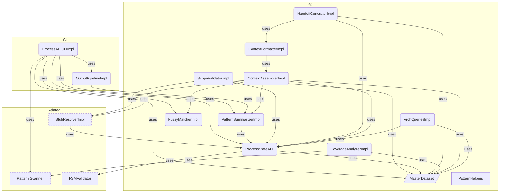

# DataAPI Overview

**Purpose:** DataAPI product area overview
**Detail Level:** Full reference

---

**How do I query process state?** The Data API provides direct terminal access to delivery process state. It replaces reading generated markdown or launching explore agents — targeted queries use 5-10x less context. The `context` command assembles curated bundles tailored to session type (planning, design, implement).

## Key Invariants

- One-command context assembly: `context <pattern> --session <type>` returns metadata + file paths + dependency status + architecture position in ~1.5KB
- Session type tailoring: `planning` (~500B, brief + deps), `design` (~1.5KB, spec + stubs + deps), `implement` (deliverables + FSM + tests)
- Direct API queries replace doc reading: JSON output is 5-10x smaller than generated docs

---

## DataAPI Components

Scoped architecture diagram showing component relationships:



---

## API Types

### MasterDatasetSchema (const)

```typescript
/**
 * Master Dataset - Unified view of all extracted patterns
 *
 * Contains raw patterns plus pre-computed views and statistics.
 * This is the primary data structure passed to generators and sections.
 */
```

```typescript
MasterDatasetSchema = z.object({
  // ─────────────────────────────────────────────────────────────────────────
  // Raw Data
  // ─────────────────────────────────────────────────────────────────────────

  /** All extracted patterns (both TypeScript and Gherkin) */
  patterns: z.array(ExtractedPatternSchema),

  /** Tag registry for category lookups */
  tagRegistry: TagRegistrySchema,

  // Note: workflow is not in the Zod schema because LoadedWorkflow contains Maps
  // (statusMap, phaseMap) which are not JSON-serializable. When workflow access
  // is needed, get it from SectionContext/GeneratorContext instead.

  // ─────────────────────────────────────────────────────────────────────────
  // Pre-computed Views
  // ─────────────────────────────────────────────────────────────────────────

  /** Patterns grouped by normalized status */
  byStatus: StatusGroupsSchema,

  /** Patterns grouped by phase number (sorted ascending) */
  byPhase: z.array(PhaseGroupSchema),

  /** Patterns grouped by quarter (e.g., "Q4-2024") */
  byQuarter: z.record(z.string(), z.array(ExtractedPatternSchema)),

  /** Patterns grouped by category */
  byCategory: z.record(z.string(), z.array(ExtractedPatternSchema)),

  /** Patterns grouped by source type */
  bySource: SourceViewsSchema,

  // ─────────────────────────────────────────────────────────────────────────
  // Aggregate Statistics
  // ─────────────────────────────────────────────────────────────────────────

  /** Overall status counts */
  counts: StatusCountsSchema,

  /** Number of distinct phases */
  phaseCount: z.number().int().nonnegative(),

  /** Number of distinct categories */
  categoryCount: z.number().int().nonnegative(),

  // ─────────────────────────────────────────────────────────────────────────
  // Relationship Data (optional)
  // ─────────────────────────────────────────────────────────────────────────

  /** Optional relationship index for dependency graph */
  relationshipIndex: z.record(z.string(), RelationshipEntrySchema).optional(),

  // ─────────────────────────────────────────────────────────────────────────
  // Architecture Data (optional)
  // ─────────────────────────────────────────────────────────────────────────

  /** Optional architecture index for diagram generation */
  archIndex: ArchIndexSchema.optional(),
});
```

### StatusGroupsSchema (const)

```typescript
/**
 * Status-based grouping of patterns
 *
 * Patterns are normalized to three canonical states:
 * - completed: implemented, completed
 * - active: active, partial, in-progress
 * - planned: roadmap, planned, undefined
 */
```

```typescript
StatusGroupsSchema = z.object({
  /** Patterns with status 'completed' or 'implemented' */
  completed: z.array(ExtractedPatternSchema),

  /** Patterns with status 'active', 'partial', or 'in-progress' */
  active: z.array(ExtractedPatternSchema),

  /** Patterns with status 'roadmap', 'planned', or undefined */
  planned: z.array(ExtractedPatternSchema),
});
```

### StatusCountsSchema (const)

```typescript
/**
 * Status counts for aggregate statistics
 */
```

```typescript
StatusCountsSchema = z.object({
  /** Number of completed patterns */
  completed: z.number().int().nonnegative(),

  /** Number of active patterns */
  active: z.number().int().nonnegative(),

  /** Number of planned patterns */
  planned: z.number().int().nonnegative(),

  /** Total number of patterns */
  total: z.number().int().nonnegative(),
});
```

### PhaseGroupSchema (const)

```typescript
/**
 * Phase grouping with patterns and counts
 *
 * Groups patterns by their phase number, with pre-computed
 * status counts for each phase.
 */
```

```typescript
PhaseGroupSchema = z.object({
  /** Phase number (e.g., 1, 2, 3, 14, 39) */
  phaseNumber: z.number().int(),

  /** Optional phase name from workflow config */
  phaseName: z.string().optional(),

  /** Patterns in this phase */
  patterns: z.array(ExtractedPatternSchema),

  /** Pre-computed status counts for this phase */
  counts: StatusCountsSchema,
});
```

### SourceViewsSchema (const)

```typescript
/**
 * Source-based views for different data origins
 */
```

```typescript
SourceViewsSchema = z.object({
  /** Patterns from TypeScript files (.ts) */
  typescript: z.array(ExtractedPatternSchema),

  /** Patterns from Gherkin feature files (.feature) */
  gherkin: z.array(ExtractedPatternSchema),

  /** Patterns with phase metadata (roadmap items) */
  roadmap: z.array(ExtractedPatternSchema),

  /** Patterns with PRD metadata (productArea, userRole, businessValue) */
  prd: z.array(ExtractedPatternSchema),
});
```

### RelationshipEntrySchema (const)

```typescript
/**
 * Relationship index for dependency tracking
 *
 * Maps pattern names to their relationship metadata.
 */
```

```typescript
RelationshipEntrySchema = z.object({
  /** Patterns this pattern uses (from @libar-docs-uses) */
  uses: z.array(z.string()),

  /** Patterns that use this pattern (from @libar-docs-used-by) */
  usedBy: z.array(z.string()),

  /** Patterns this pattern depends on (from @libar-docs-depends-on) */
  dependsOn: z.array(z.string()),

  /** Patterns this pattern enables (from @libar-docs-enables) */
  enables: z.array(z.string()),

  // UML-inspired relationship fields (PatternRelationshipModel)
  /** Patterns this item implements (realization relationship) */
  implementsPatterns: z.array(z.string()),

  /** Files/patterns that implement this pattern (computed inverse with file paths) */
  implementedBy: z.array(ImplementationRefSchema),

  /** Pattern this extends (generalization relationship) */
  extendsPattern: z.string().optional(),

  /** Patterns that extend this pattern (computed inverse) */
  extendedBy: z.array(z.string()),

  /** Related patterns for cross-reference without dependency (from @libar-docs-see-also tag) */
  seeAlso: z.array(z.string()),

  /** File paths to implementation APIs (from @libar-docs-api-ref tag) */
  apiRef: z.array(z.string()),
});
```

### ArchIndexSchema (const)

```typescript
/**
 * Architecture index for diagram generation
 *
 * Groups patterns by architectural metadata for rendering component diagrams.
 */
```

```typescript
ArchIndexSchema = z.object({
  /** Patterns grouped by arch-role (bounded-context, projection, saga, etc.) */
  byRole: z.record(z.string(), z.array(ExtractedPatternSchema)),

  /** Patterns grouped by arch-context (orders, inventory, etc.) */
  byContext: z.record(z.string(), z.array(ExtractedPatternSchema)),

  /** Patterns grouped by arch-layer (domain, application, infrastructure) */
  byLayer: z.record(z.string(), z.array(ExtractedPatternSchema)),

  /** Patterns grouped by include tag (cross-cutting content routing and diagram scoping) */
  byView: z.record(z.string(), z.array(ExtractedPatternSchema)),

  /** Patterns with any architecture metadata (for diagram generation) */
  all: z.array(ExtractedPatternSchema),
});
```

---

## Behavior Specifications

### ProcessStateAPITesting

[View ProcessStateAPITesting source](tests/features/api/process-state-api.feature)

Programmatic interface for querying delivery process state.
Designed for Claude Code integration and tool automation.

**Problem:**

- Markdown generation is not ideal for programmatic access
- Claude Code needs structured data to answer process questions
- Multiple queries require redundant parsing of MasterDataset

**Solution:**

- ProcessStateAPI wraps MasterDataset with typed query methods
- Returns structured data suitable for programmatic consumption
- Integrates FSM validation for transition checks

<details>
<summary>Status queries return correct patterns (6 scenarios)</summary>

#### Status queries return correct patterns

**Verified by:**

- Get patterns by normalized status
- Get patterns by FSM status
- Get current work returns active patterns
- Get roadmap items returns roadmap and deferred
- Get status counts
- Get completion percentage

</details>

<details>
<summary>Phase queries return correct phase data (4 scenarios)</summary>

#### Phase queries return correct phase data

**Verified by:**

- Get patterns by phase
- Get phase progress
- Get nonexistent phase returns undefined
- Get active phases

</details>

<details>
<summary>FSM queries expose transition validation (4 scenarios)</summary>

#### FSM queries expose transition validation

**Verified by:**

- Check valid transition
- Check invalid transition
- Get valid transitions from status
- Get protection info

</details>

<details>
<summary>Pattern queries find and retrieve pattern data (4 scenarios)</summary>

#### Pattern queries find and retrieve pattern data

**Verified by:**

- Find pattern by name (case insensitive)
- Find nonexistent pattern returns undefined
- Get patterns by category
- Get all categories with counts

</details>

<details>
<summary>Timeline queries group patterns by time (3 scenarios)</summary>

#### Timeline queries group patterns by time

**Verified by:**

- Get patterns by quarter
- Get all quarters
- Get recently completed sorted by date

</details>

### ValidatePatternsCli

[View ValidatePatternsCli source](tests/features/cli/validate-patterns.feature)

Command-line interface for cross-validating TypeScript patterns vs Gherkin feature files.

<details>
<summary>CLI displays help and version information (4 scenarios)</summary>

#### CLI displays help and version information

**Verified by:**

- Display help with --help flag
- Display help with -h flag
- Display version with --version flag
- Display version with -v flag

</details>

<details>
<summary>CLI requires input and feature patterns (2 scenarios)</summary>

#### CLI requires input and feature patterns

**Verified by:**

- Fail without --input flag
- Fail without --features flag

</details>

<details>
<summary>CLI validates patterns across TypeScript and Gherkin sources (3 scenarios)</summary>

#### CLI validates patterns across TypeScript and Gherkin sources

**Verified by:**

- Validation passes for matching patterns
- Detect phase mismatch between sources
- Detect status mismatch between sources

</details>

<details>
<summary>CLI supports multiple output formats (2 scenarios)</summary>

#### CLI supports multiple output formats

**Verified by:**

- JSON output format
- Pretty output format is default

</details>

<details>
<summary>Strict mode treats warnings as errors (2 scenarios)</summary>

#### Strict mode treats warnings as errors

**Verified by:**

- Strict mode exits with code 2 on warnings
- Non-strict mode passes with warnings

</details>

<details>
<summary>CLI warns about unknown flags (1 scenarios)</summary>

#### CLI warns about unknown flags

**Verified by:**

- Warn on unknown flag but continue

</details>

### ProcessApiCli

[View ProcessApiCli source](tests/features/cli/process-api.feature)

Command-line interface for querying delivery process state via ProcessStateAPI.

<details>
<summary>CLI displays help and version information (3 scenarios)</summary>

#### CLI displays help and version information

**Verified by:**

- Display help with --help flag
- Display version with -v flag
- No subcommand shows help

</details>

<details>
<summary>CLI requires input flag for subcommands (2 scenarios)</summary>

#### CLI requires input flag for subcommands

**Verified by:**

- Fail without --input flag when running status
- Reject unknown options

</details>

<details>
<summary>CLI status subcommand shows delivery state (1 scenarios)</summary>

#### CLI status subcommand shows delivery state

**Verified by:**

- Status shows counts and completion percentage

</details>

<details>
<summary>CLI query subcommand executes API methods (3 scenarios)</summary>

#### CLI query subcommand executes API methods

**Verified by:**

- Query getStatusCounts returns count object
- Query isValidTransition with arguments
- Unknown API method shows error

</details>

<details>
<summary>CLI pattern subcommand shows pattern detail (2 scenarios)</summary>

#### CLI pattern subcommand shows pattern detail

**Verified by:**

- Pattern lookup returns full detail
- Pattern not found shows error

</details>

<details>
<summary>CLI arch subcommand queries architecture (3 scenarios)</summary>

#### CLI arch subcommand queries architecture

**Verified by:**

- Arch roles lists roles with counts
- Arch context filters to bounded context
- Arch layer lists layers with counts

</details>

<details>
<summary>CLI shows errors for missing subcommand arguments (3 scenarios)</summary>

#### CLI shows errors for missing subcommand arguments

**Verified by:**

- Query without method name shows error
- Pattern without name shows error
- Unknown subcommand shows error

</details>

<details>
<summary>CLI handles argument edge cases (2 scenarios)</summary>

#### CLI handles argument edge cases

**Verified by:**

- Integer arguments are coerced for phase queries
- Double-dash separator is handled gracefully

</details>

<details>
<summary>CLI list subcommand filters patterns (2 scenarios)</summary>

#### CLI list subcommand filters patterns

**Verified by:**

- List all patterns returns JSON array
- List with invalid phase shows error

</details>

<details>
<summary>CLI search subcommand finds patterns by fuzzy match (2 scenarios)</summary>

#### CLI search subcommand finds patterns by fuzzy match

**Verified by:**

- Search returns matching patterns
- Search without query shows error

</details>

<details>
<summary>CLI context assembly subcommands return text output (4 scenarios)</summary>

#### CLI context assembly subcommands return text output

**Verified by:**

- Context returns curated text bundle
- Context without pattern name shows error
- Overview returns executive summary text
- Dep-tree returns dependency tree text

</details>

<details>
<summary>CLI tags and sources subcommands return JSON (2 scenarios)</summary>

#### CLI tags and sources subcommands return JSON

**Verified by:**

- Tags returns tag usage counts
- Sources returns file inventory

</details>

<details>
<summary>CLI extended arch subcommands query architecture relationships (3 scenarios)</summary>

#### CLI extended arch subcommands query architecture relationships

**Verified by:**

- Arch neighborhood returns pattern relationships
- Arch compare returns context comparison
- Arch coverage returns annotation coverage

</details>

<details>
<summary>CLI unannotated subcommand finds files without annotations (1 scenarios)</summary>

#### CLI unannotated subcommand finds files without annotations

**Verified by:**

- Unannotated finds files missing libar-docs marker

</details>

<details>
<summary>Output modifiers work when placed after the subcommand (3 scenarios)</summary>

#### Output modifiers work when placed after the subcommand

**Invariant:** Output modifiers (--count, --names-only, --fields) produce identical results regardless of position relative to the subcommand and its filters.

**Rationale:** Users should not need to memorize argument ordering rules; the CLI should be forgiving.

**Verified by:**

- Count modifier after list subcommand returns count
- Names-only modifier after list subcommand returns names
- Count modifier combined with list filter

</details>

<details>
<summary>CLI arch health subcommands detect graph quality issues (3 scenarios)</summary>

#### CLI arch health subcommands detect graph quality issues

**Invariant:** Health subcommands (dangling, orphans, blocking) operate on the relationship index, not the architecture index, and return results without requiring arch annotations.

**Rationale:** Graph quality issues (broken references, isolated patterns, blocked dependencies) are relationship-level concerns that should be queryable even when no architecture metadata exists.

**Verified by:**

- Arch dangling returns broken references
- Arch orphans returns isolated patterns
- Arch blocking returns blocked patterns

</details>

### LintProcessCli

[View LintProcessCli source](tests/features/cli/lint-process.feature)

Command-line interface for validating changes against delivery process rules.

<details>
<summary>CLI displays help and version information (4 scenarios)</summary>

#### CLI displays help and version information

**Verified by:**

- Display help with --help flag
- Display help with -h flag
- Display version with --version flag
- Display version with -v flag

</details>

<details>
<summary>CLI requires git repository for validation (2 scenarios)</summary>

#### CLI requires git repository for validation

**Verified by:**

- Fail without git repository in staged mode
- Fail without git repository in all mode

</details>

<details>
<summary>CLI validates file mode input (3 scenarios)</summary>

#### CLI validates file mode input

**Verified by:**

- Fail when files mode has no files
- Accept file via positional argument
- Accept file via --file flag

</details>

<details>
<summary>CLI handles no changes gracefully (1 scenarios)</summary>

#### CLI handles no changes gracefully

**Verified by:**

- No changes detected exits successfully

</details>

<details>
<summary>CLI supports multiple output formats (2 scenarios)</summary>

#### CLI supports multiple output formats

**Verified by:**

- JSON output format
- Pretty output format is default

</details>

<details>
<summary>CLI supports debug options (1 scenarios)</summary>

#### CLI supports debug options

**Verified by:**

- Show state flag displays derived state

</details>

<details>
<summary>CLI warns about unknown flags (1 scenarios)</summary>

#### CLI warns about unknown flags

**Verified by:**

- Warn on unknown flag but continue

</details>

### LintPatternsCli

[View LintPatternsCli source](tests/features/cli/lint-patterns.feature)

Command-line interface for validating pattern annotation quality.

<details>
<summary>CLI displays help and version information (2 scenarios)</summary>

#### CLI displays help and version information

**Verified by:**

- Display help with --help flag
- Display version with -v flag

</details>

<details>
<summary>CLI requires input patterns (1 scenarios)</summary>

#### CLI requires input patterns

**Verified by:**

- Fail without --input flag

</details>

<details>
<summary>Lint passes for valid patterns (1 scenarios)</summary>

#### Lint passes for valid patterns

**Verified by:**

- Lint passes for complete annotations

</details>

<details>
<summary>Lint detects violations in incomplete patterns (1 scenarios)</summary>

#### Lint detects violations in incomplete patterns

**Verified by:**

- Report violations for incomplete annotations

</details>

<details>
<summary>CLI supports multiple output formats (2 scenarios)</summary>

#### CLI supports multiple output formats

**Verified by:**

- JSON output format
- Pretty output format is default

</details>

<details>
<summary>Strict mode treats warnings as errors (2 scenarios)</summary>

#### Strict mode treats warnings as errors

**Verified by:**

- Strict mode fails on warnings
- Non-strict mode passes with warnings

</details>

### GenerateTagTaxonomyCli

[View GenerateTagTaxonomyCli source](tests/features/cli/generate-tag-taxonomy.feature)

Command-line interface for generating TAG_TAXONOMY.md from tag registry configuration.

<details>
<summary>CLI displays help and version information (4 scenarios)</summary>

#### CLI displays help and version information

**Verified by:**

- Display help with --help flag
- Display help with -h flag
- Display version with --version flag
- Display version with -v flag

</details>

<details>
<summary>CLI generates taxonomy at specified output path (3 scenarios)</summary>

#### CLI generates taxonomy at specified output path

**Verified by:**

- Generate taxonomy at default path
- Generate taxonomy at custom output path
- Create output directory if missing

</details>

<details>
<summary>CLI respects overwrite flag for existing files (3 scenarios)</summary>

#### CLI respects overwrite flag for existing files

**Verified by:**

- Fail when output file exists without --overwrite
- Overwrite existing file with -f flag
- Overwrite existing file with --overwrite flag

</details>

<details>
<summary>Generated taxonomy contains expected sections (2 scenarios)</summary>

#### Generated taxonomy contains expected sections

**Verified by:**

- Generated file contains category documentation
- Generated file reports statistics

</details>

<details>
<summary>CLI warns about unknown flags (1 scenarios)</summary>

#### CLI warns about unknown flags

**Verified by:**

- Warn on unknown flag but continue

</details>

### GenerateDocsCli

[View GenerateDocsCli source](tests/features/cli/generate-docs.feature)

Command-line interface for generating documentation from annotated TypeScript.

<details>
<summary>CLI displays help and version information (2 scenarios)</summary>

#### CLI displays help and version information

**Verified by:**

- Display help with --help flag
- Display version with -v flag

</details>

<details>
<summary>CLI requires input patterns (1 scenarios)</summary>

#### CLI requires input patterns

**Verified by:**

- Fail without --input flag

</details>

<details>
<summary>CLI lists available generators (1 scenarios)</summary>

#### CLI lists available generators

**Verified by:**

- List generators with --list-generators

</details>

<details>
<summary>CLI generates documentation from source files (2 scenarios)</summary>

#### CLI generates documentation from source files

**Verified by:**

- Generate patterns documentation
- Use default generator (patterns) when not specified

</details>

<details>
<summary>CLI rejects unknown options (1 scenarios)</summary>

#### CLI rejects unknown options

**Verified by:**

- Unknown option causes error

</details>

### ScopeValidatorTests

[View ScopeValidatorTests source](tests/features/api/session-support/scope-validator.feature)

**Problem:**
Starting an implementation or design session without checking prerequisites
wastes time when blockers are discovered mid-session.

**Solution:**
ScopeValidator runs composable checks and aggregates results into a verdict
(ready, blocked, or warnings) before a session starts.

<details>
<summary>Implementation scope validation checks all prerequisites (7 scenarios)</summary>

#### Implementation scope validation checks all prerequisites

**Verified by:**

- All implementation checks pass
- Incomplete dependency blocks implementation
- FSM transition from completed blocks implementation
- Missing PDR references produce WARN
- No deliverables blocks implementation
- Strict mode promotes WARN to BLOCKED
- Pattern not found throws error

</details>

<details>
<summary>Design scope validation checks dependency stubs (2 scenarios)</summary>

#### Design scope validation checks dependency stubs

**Verified by:**

- Design session with no dependencies passes
- Design session with dependencies lacking stubs produces WARN

</details>

<details>
<summary>Formatter produces structured text output (3 scenarios)</summary>

#### Formatter produces structured text output

**Verified by:**

- Formatter produces markers per ADR-008
- Formatter shows warnings verdict text
- Formatter shows blocker details for blocked verdict

</details>

### HandoffGeneratorTests

[View HandoffGeneratorTests source](tests/features/api/session-support/handoff-generator.feature)

**Problem:**
Multi-session work loses critical state between sessions when handoff
documentation is manual or forgotten.

**Solution:**
HandoffGenerator assembles a structured handoff document from ProcessStateAPI
and MasterDataset, capturing completed work, remaining items, discovered
issues, and next-session priorities.

#### Handoff generates compact session state summary

**Verified by:**

- Generate handoff for in-progress pattern
- Handoff captures discovered items
- Session type is inferred from status
- Completed pattern infers review session type
- Deferred pattern infers design session type
- Files modified section included when provided
- Blockers section shows incomplete dependencies
- Pattern not found throws error

#### Formatter produces structured text output

**Verified by:**

- Handoff formatter produces markers per ADR-008

### StubTaxonomyTagTests

[View StubTaxonomyTagTests source](tests/features/api/stub-integration/taxonomy-tags.feature)

**Problem:**
Stub metadata (target path, design session) was stored as plain text
in JSDoc descriptions, invisible to structured queries.

**Solution:**
Register libar-docs-target and libar-docs-since as taxonomy tags
so they flow through the extraction pipeline as structured fields.

#### Taxonomy tags are registered in the registry

**Verified by:**

- Target and since tags exist in registry

#### Tags are part of the stub metadata group

**Verified by:**

- Built registry groups target and since as stub tags

### StubResolverTests

[View StubResolverTests source](tests/features/api/stub-integration/stub-resolver.feature)

**Problem:**
Design session stubs need structured discovery and resolution
to determine which stubs have been implemented and which remain.

**Solution:**
StubResolver functions identify, resolve, and group stubs from
the MasterDataset with filesystem existence checks.

<details>
<summary>Stubs are identified by path or target metadata (2 scenarios)</summary>

#### Stubs are identified by path or target metadata

**Verified by:**

- Patterns in stubs directory are identified as stubs
- Patterns with targetPath are identified as stubs

</details>

<details>
<summary>Stubs are resolved against the filesystem (2 scenarios)</summary>

#### Stubs are resolved against the filesystem

**Verified by:**

- Resolved stubs show target existence status
- Stubs are grouped by implementing pattern

</details>

<details>
<summary>Decision items are extracted from descriptions (3 scenarios)</summary>

#### Decision items are extracted from descriptions

**Verified by:**

- AD-N items are extracted from description text
- Empty description returns no decision items
- Malformed AD items are skipped

</details>

<details>
<summary>PDR references are found across patterns (2 scenarios)</summary>

#### PDR references are found across patterns

**Verified by:**

- Patterns referencing a PDR are found
- No references returns empty result

</details>

### PatternSummarizeTests

[View PatternSummarizeTests source](tests/features/api/output-shaping/summarize.feature)

Validates that summarizePattern() projects ExtractedPattern (~3.5KB) to
PatternSummary (~100 bytes) with the correct 6 fields.

#### summarizePattern projects to compact summary

**Verified by:**

- Summary includes all 6 fields for a TypeScript pattern
- Summary includes all 6 fields for a Gherkin pattern
- Summary uses patternName tag over name field
- Summary omits undefined optional fields

#### summarizePatterns batch processes arrays

**Verified by:**

- Batch summarization returns correct count

### PatternHelpersTests

[View PatternHelpersTests source](tests/features/api/output-shaping/pattern-helpers.feature)

<details>
<summary>getPatternName uses patternName tag when available (2 scenarios)</summary>

#### getPatternName uses patternName tag when available

**Verified by:**

- Returns patternName when set
- Falls back to name when patternName is absent

</details>

<details>
<summary>findPatternByName performs case-insensitive matching (3 scenarios)</summary>

#### findPatternByName performs case-insensitive matching

**Verified by:**

- Exact case match
- Case-insensitive match
- No match returns undefined

</details>

<details>
<summary>getRelationships looks up with case-insensitive fallback (3 scenarios)</summary>

#### getRelationships looks up with case-insensitive fallback

**Verified by:**

- Exact key match in relationship index
- Case-insensitive fallback match
- Missing relationship index returns undefined

</details>

<details>
<summary>suggestPattern provides fuzzy suggestions (2 scenarios)</summary>

#### suggestPattern provides fuzzy suggestions

**Verified by:**

- Suggests close match
- No close match returns empty

</details>

### OutputPipelineTests

[View OutputPipelineTests source](tests/features/api/output-shaping/output-pipeline.feature)

Validates the output pipeline transforms: summarization, modifiers,
list filters, empty stripping, and format output.

<details>
<summary>Output modifiers apply with correct precedence (7 scenarios)</summary>

#### Output modifiers apply with correct precedence

**Verified by:**

- Default mode returns summaries for pattern arrays
- Count modifier returns integer
- Names-only modifier returns string array
- Fields modifier picks specific fields
- Full modifier bypasses summarization
- Scalar input passes through unchanged
- Fields with single field returns objects with one key

</details>

<details>
<summary>Modifier conflicts are rejected (4 scenarios)</summary>

#### Modifier conflicts are rejected

**Verified by:**

- Full combined with names-only is rejected
- Full combined with count is rejected
- Full combined with fields is rejected
- Invalid field name is rejected

</details>

<details>
<summary>List filters compose via AND logic (4 scenarios)</summary>

#### List filters compose via AND logic

**Verified by:**

- Filter by status returns matching patterns
- Filter by status and category narrows results
- Pagination with limit and offset
- Offset beyond array length returns empty results

</details>

<details>
<summary>Empty stripping removes noise (1 scenarios)</summary>

#### Empty stripping removes noise

**Verified by:**

- Null and empty values are stripped

</details>

### FuzzyMatchTests

[View FuzzyMatchTests source](tests/features/api/output-shaping/fuzzy-match.feature)

Validates tiered fuzzy matching: exact > prefix > substring > Levenshtein.

<details>
<summary>Fuzzy matching uses tiered scoring (8 scenarios)</summary>

#### Fuzzy matching uses tiered scoring

**Verified by:**

- Exact match scores 1.0
- Exact match is case-insensitive
- Prefix match scores 0.9
- Substring match scores 0.7
- Levenshtein match for close typos
- Results are sorted by score descending
- Empty query matches all patterns as prefix
- No candidate patterns returns no results

</details>

<details>
<summary>findBestMatch returns single suggestion (2 scenarios)</summary>

#### findBestMatch returns single suggestion

**Verified by:**

- Best match returns suggestion above threshold
- No match returns undefined when below threshold

</details>

<details>
<summary>Levenshtein distance computation (2 scenarios)</summary>

#### Levenshtein distance computation

**Verified by:**

- Identical strings have distance 0
- Single character difference

</details>

### ContextFormatterTests

[View ContextFormatterTests source](tests/features/api/context-assembly/context-formatter.feature)

Tests for formatContextBundle(), formatDepTree(), formatFileReadingList(),
and formatOverview() plain text rendering functions.

<details>
<summary>formatContextBundle renders section markers (2 scenarios)</summary>

#### formatContextBundle renders section markers

**Verified by:**

- Design bundle renders all populated sections
- Implement bundle renders deliverables and FSM

</details>

<details>
<summary>formatDepTree renders indented tree (1 scenarios)</summary>

#### formatDepTree renders indented tree

**Verified by:**

- Tree renders with arrows and focal marker

</details>

<details>
<summary>formatOverview renders progress summary (1 scenarios)</summary>

#### formatOverview renders progress summary

**Verified by:**

- Overview renders progress line

</details>

<details>
<summary>formatFileReadingList renders categorized file paths (2 scenarios)</summary>

#### formatFileReadingList renders categorized file paths

**Verified by:**

- File list renders primary and dependency sections
- Empty file reading list renders minimal output

</details>

### ContextAssemblerTests

[View ContextAssemblerTests source](tests/features/api/context-assembly/context-assembler.feature)

Tests for assembleContext(), buildDepTree(), buildFileReadingList(), and
buildOverview() pure functions that operate on MasterDataset.

<details>
<summary>assembleContext produces session-tailored context bundles (7 scenarios)</summary>

#### assembleContext produces session-tailored context bundles

**Verified by:**

- Design session includes stubs, consumers, and architecture
- Planning session includes only metadata and dependencies
- Implement session includes deliverables and FSM
- Multi-pattern context merges metadata from both patterns
- Pattern not found returns error with suggestion
- Description preserves Problem and Solution structure
- Solution text with inline bold is not truncated

</details>

<details>
<summary>buildDepTree walks dependency chains with cycle detection (4 scenarios)</summary>

#### buildDepTree walks dependency chains with cycle detection

**Verified by:**

- Dependency tree shows chain with status markers
- Depth limit truncates branches
- Circular dependencies are handled safely
- Standalone pattern returns single-node tree

</details>

<details>
<summary>buildOverview provides executive project summary (2 scenarios)</summary>

#### buildOverview provides executive project summary

**Verified by:**

- Overview shows progress, active phases, and blocking
- Empty dataset returns zero-state overview

</details>

<details>
<summary>buildFileReadingList returns paths by relevance (3 scenarios)</summary>

#### buildFileReadingList returns paths by relevance

**Verified by:**

- File list includes primary and related files
- File list includes implementation files for completed dependencies
- File list without related returns only primary

</details>

### ArchQueriesTest

[View ArchQueriesTest source](tests/features/api/architecture-queries/arch-queries.feature)

<details>
<summary>Neighborhood and comparison views (3 scenarios)</summary>

#### Neighborhood and comparison views

**Verified by:**

- Pattern neighborhood shows direct connections
- Cross-context comparison shows shared and unique dependencies
- Neighborhood for nonexistent pattern returns undefined

</details>

<details>
<summary>Taxonomy discovery via tags and sources (3 scenarios)</summary>

#### Taxonomy discovery via tags and sources

**Verified by:**

- Tag aggregation counts values across patterns
- Source inventory categorizes files by type
- Tags with no patterns returns empty report

</details>

<details>
<summary>Coverage analysis reports annotation completeness (4 scenarios)</summary>

#### Coverage analysis reports annotation completeness

**Verified by:**

- Unused taxonomy detection
- Cross-context comparison with integration points
- Neighborhood includes implements relationships
- Neighborhood includes dependsOn and enables relationships

</details>

---
