# DataAPI Overview

**Purpose:** DataAPI product area overview
**Detail Level:** Full reference

---

**How do I query process state?** The Data API provides direct terminal access to delivery process state. It replaces reading generated markdown or launching explore agents — targeted queries use 5-10x less context. The `context` command assembles curated bundles tailored to session type (planning, design, implement).

## Key Invariants

- One-command context assembly: `context <pattern> --session <type>` returns metadata + file paths + dependency status + architecture position in ~1.5KB
- Session type tailoring: `planning` (~500B, brief + deps), `design` (~1.5KB, spec + stubs + deps), `implement` (deliverables + FSM + tests)
- Direct API queries replace doc reading: JSON output is 5-10x smaller than generated docs

---

## Contents

- [Key Invariants](#key-invariants)
- [Shared Pipeline Factory Responsibilities](#shared-pipeline-factory-responsibilities)
- [8-Step Dataset Build Flow](#8-step-dataset-build-flow)
- [Consumer Architecture and PipelineOptions Differentiation](#consumer-architecture-and-pipelineoptions-differentiation)
- [DataAPI Components](#dataapi-components)
- [API Types](#api-types)
- [Business Rules](#business-rules)

---

## Shared Pipeline Factory Responsibilities

**Invariant:** `buildMasterDataset()` is the shared factory for Steps 1-8 of the architecture pipeline and returns `Result<PipelineResult, PipelineError>` without process-level side effects.

**Rationale:** Centralizing scan/extract/merge/transform flow prevents divergence between CLI consumers and preserves a single ADR-006 read-model path.

---

## 8-Step Dataset Build Flow

The factory owns: configuration load, TypeScript scan + extraction, Gherkin scan +
extraction, merge conflict handling, hierarchy child derivation, workflow load,
and `transformToMasterDataset` with validation summary.

---

## Consumer Architecture and PipelineOptions Differentiation

Three consumers share this factory: `process-api`, `validate-patterns`, and the
generation orchestrator. `PipelineOptions` differentiates behavior by
`mergeConflictStrategy` (`fatal` vs `concatenate`), `includeValidation` toggles,
and `failOnScanErrors` policy without forking pipeline logic.

### When to Use

- Any consumer needs a MasterDataset without rewriting scan/extract/merge flow
- CLI consumers require differentiated conflict strategy and validation behavior
- Orchestrator needs a shared steps 1-8 implementation before codec/file execution

---

## DataAPI Components

Scoped architecture diagram showing component relationships:

```mermaid
graph TB
    subgraph api["Api"]
        MasterDataset[/"MasterDataset"/]
        PatternSummarizerImpl("PatternSummarizerImpl")
        ScopeValidatorImpl("ScopeValidatorImpl")
        ProcessStateAPI("ProcessStateAPI")
        PatternHelpers["PatternHelpers"]
        HandoffGeneratorImpl("HandoffGeneratorImpl")
        FuzzyMatcherImpl("FuzzyMatcherImpl")
        CoverageAnalyzerImpl("CoverageAnalyzerImpl")
        ContextFormatterImpl("ContextFormatterImpl")
        ContextAssemblerImpl("ContextAssemblerImpl")
        ArchQueriesImpl("ArchQueriesImpl")
    end
    subgraph cli["Cli"]
        ReplMode("ReplMode")
        ProcessAPICLIImpl("ProcessAPICLIImpl")
        OutputPipelineImpl("OutputPipelineImpl")
        DatasetCache[/"DatasetCache"/]
        CLISchema["CLISchema"]
    end
    subgraph related["Related"]
        WorkflowConfigSchema["WorkflowConfigSchema"]:::neighbor
        Pattern_Scanner["Pattern Scanner"]:::neighbor
        StubResolverImpl["StubResolverImpl"]:::neighbor
        RulesQueryModule["RulesQueryModule"]:::neighbor
        FSMValidator["FSMValidator"]:::neighbor
        PipelineFactory["PipelineFactory"]:::neighbor
        ProcessStateAPICLI["ProcessStateAPICLI"]:::neighbor
        ProcessApiHybridGeneration["ProcessApiHybridGeneration"]:::neighbor
        PhaseStateMachineValidation["PhaseStateMachineValidation"]:::neighbor
        DataAPIDesignSessionSupport["DataAPIDesignSessionSupport"]:::neighbor
        DataAPIOutputShaping["DataAPIOutputShaping"]:::neighbor
        DataAPIContextAssembly["DataAPIContextAssembly"]:::neighbor
        DataAPICLIErgonomics["DataAPICLIErgonomics"]:::neighbor
        DataAPIArchitectureQueries["DataAPIArchitectureQueries"]:::neighbor
    end
    ReplMode -->|uses| PipelineFactory
    ReplMode -->|uses| ProcessStateAPI
    ReplMode ..->|implements| DataAPICLIErgonomics
    ProcessAPICLIImpl -->|uses| ProcessStateAPI
    ProcessAPICLIImpl -->|uses| MasterDataset
    ProcessAPICLIImpl -->|uses| PipelineFactory
    ProcessAPICLIImpl -->|uses| RulesQueryModule
    ProcessAPICLIImpl -->|uses| PatternSummarizerImpl
    ProcessAPICLIImpl -->|uses| FuzzyMatcherImpl
    ProcessAPICLIImpl -->|uses| OutputPipelineImpl
    ProcessAPICLIImpl ..->|implements| ProcessStateAPICLI
    OutputPipelineImpl -->|uses| PatternSummarizerImpl
    OutputPipelineImpl ..->|implements| DataAPIOutputShaping
    DatasetCache -->|uses| PipelineFactory
    DatasetCache -->|uses| WorkflowConfigSchema
    DatasetCache ..->|implements| DataAPICLIErgonomics
    CLISchema ..->|implements| ProcessApiHybridGeneration
    PatternSummarizerImpl -->|uses| ProcessStateAPI
    PatternSummarizerImpl ..->|implements| DataAPIOutputShaping
    ScopeValidatorImpl -->|uses| ProcessStateAPI
    ScopeValidatorImpl -->|uses| MasterDataset
    ScopeValidatorImpl -->|uses| StubResolverImpl
    ScopeValidatorImpl ..->|implements| DataAPIDesignSessionSupport
    ProcessStateAPI -->|uses| MasterDataset
    ProcessStateAPI -->|uses| FSMValidator
    ProcessStateAPI ..->|implements| PhaseStateMachineValidation
    PatternHelpers ..->|implements| DataAPIOutputShaping
    HandoffGeneratorImpl -->|uses| ProcessStateAPI
    HandoffGeneratorImpl -->|uses| MasterDataset
    HandoffGeneratorImpl -->|uses| ContextFormatterImpl
    HandoffGeneratorImpl ..->|implements| DataAPIDesignSessionSupport
    FuzzyMatcherImpl ..->|implements| DataAPIOutputShaping
    CoverageAnalyzerImpl -->|uses| Pattern_Scanner
    CoverageAnalyzerImpl -->|uses| MasterDataset
    CoverageAnalyzerImpl ..->|implements| DataAPIArchitectureQueries
    ContextFormatterImpl -->|uses| ContextAssemblerImpl
    ContextFormatterImpl ..->|implements| DataAPIContextAssembly
    ContextAssemblerImpl -->|uses| ProcessStateAPI
    ContextAssemblerImpl -->|uses| MasterDataset
    ContextAssemblerImpl -->|uses| PatternSummarizerImpl
    ContextAssemblerImpl -->|uses| FuzzyMatcherImpl
    ContextAssemblerImpl -->|uses| StubResolverImpl
    ContextAssemblerImpl ..->|implements| DataAPIContextAssembly
    ArchQueriesImpl -->|uses| ProcessStateAPI
    ArchQueriesImpl -->|uses| MasterDataset
    ArchQueriesImpl ..->|implements| DataAPIArchitectureQueries
    StubResolverImpl -->|uses| ProcessStateAPI
    FSMValidator ..->|implements| PhaseStateMachineValidation
    PipelineFactory -->|uses| MasterDataset
    DataAPIDesignSessionSupport -.->|depends on| DataAPIContextAssembly
    DataAPIContextAssembly -.->|depends on| DataAPIOutputShaping
    DataAPIArchitectureQueries -.->|depends on| DataAPIOutputShaping
    classDef neighbor stroke-dasharray: 5 5
```



---

## API Types

### PipelineOptions (interface)

```typescript
/**
 * Options for building a MasterDataset via the shared pipeline.
 *
 * DD-1: Factory lives at src/generators/pipeline/build-pipeline.ts.
 * DD-2: mergeConflictStrategy controls per-consumer conflict handling.
 * DD-3: exclude, contextInferenceRules support future orchestrator
 *        migration without breaking changes.
 *
 */
```

```typescript
interface PipelineOptions {
  readonly input: readonly string[];
  readonly features: readonly string[];
  readonly baseDir: string;
  readonly mergeConflictStrategy: 'fatal' | 'concatenate';
  readonly exclude?: readonly string[];
  readonly workflowPath?: string;
  readonly contextInferenceRules?: readonly ContextInferenceRule[];
  /** DD-3: When false, skip validation pass (default true). */
  readonly includeValidation?: boolean;
  /** DD-5: When true, return error on individual scan failures (default false). */
  readonly failOnScanErrors?: boolean;
}
```

| Property          | Description                                                                |
| ----------------- | -------------------------------------------------------------------------- |
| includeValidation | DD-3: When false, skip validation pass (default true).                     |
| failOnScanErrors  | DD-5: When true, return error on individual scan failures (default false). |

### PipelineResult (interface)

```typescript
/**
 * Successful pipeline result containing the dataset and validation summary.
 *
 */
```

```typescript
interface PipelineResult {
  readonly dataset: RuntimeMasterDataset;
  readonly validation: ValidationSummary;
  readonly warnings: readonly PipelineWarning[];
  readonly scanMetadata: ScanMetadata;
}
```

### MasterDatasetSchema (const)

```typescript
/**
 * Master Dataset - Unified view of all extracted patterns
 *
 * Contains raw patterns plus pre-computed views and statistics.
 * This is the primary data structure passed to generators and sections.
 *
 */
```

```typescript
MasterDatasetSchema = z.object({
  // ─────────────────────────────────────────────────────────────────────────
  // Raw Data
  // ─────────────────────────────────────────────────────────────────────────

  /** All extracted patterns (both TypeScript and Gherkin) */
  patterns: z.array(ExtractedPatternSchema),

  /** Tag registry for category lookups */
  tagRegistry: TagRegistrySchema,

  // Note: workflow is not in the Zod schema because LoadedWorkflow contains Maps
  // (statusMap, phaseMap) which are not JSON-serializable. When workflow access
  // is needed, get it from SectionContext/GeneratorContext instead.

  // ─────────────────────────────────────────────────────────────────────────
  // Pre-computed Views
  // ─────────────────────────────────────────────────────────────────────────

  /** Patterns grouped by normalized status */
  byStatus: StatusGroupsSchema,

  /** Patterns grouped by phase number (sorted ascending) */
  byPhase: z.array(PhaseGroupSchema),

  /** Patterns grouped by quarter (e.g., "Q4-2024") */
  byQuarter: z.record(z.string(), z.array(ExtractedPatternSchema)),

  /** Patterns grouped by category */
  byCategory: z.record(z.string(), z.array(ExtractedPatternSchema)),

  /** Patterns grouped by source type */
  bySource: SourceViewsSchema,

  /** Patterns grouped by product area (for O(1) product area lookups) */
  byProductArea: z.record(z.string(), z.array(ExtractedPatternSchema)),

  // ─────────────────────────────────────────────────────────────────────────
  // Aggregate Statistics
  // ─────────────────────────────────────────────────────────────────────────

  /** Overall status counts */
  counts: StatusCountsSchema,

  /** Number of distinct phases */
  phaseCount: z.number().int().nonnegative(),

  /** Number of distinct categories */
  categoryCount: z.number().int().nonnegative(),

  // ─────────────────────────────────────────────────────────────────────────
  // Relationship Data (optional)
  // ─────────────────────────────────────────────────────────────────────────

  /** Optional relationship index for dependency graph */
  relationshipIndex: z.record(z.string(), RelationshipEntrySchema).optional(),

  // ─────────────────────────────────────────────────────────────────────────
  // Architecture Data (optional)
  // ─────────────────────────────────────────────────────────────────────────

  /** Optional architecture index for diagram generation */
  archIndex: ArchIndexSchema.optional(),

  // ─────────────────────────────────────────────────────────────────────────
  // Sequence Data (optional)
  // ─────────────────────────────────────────────────────────────────────────

  /** Optional sequence index for design review diagram generation */
  sequenceIndex: SequenceIndexSchema.optional(),
});
```

### StatusGroupsSchema (const)

```typescript
/**
 * Status-based grouping of patterns
 *
 * Patterns are normalized to three canonical states:
 * - completed: implemented, completed
 * - active: active, partial, in-progress
 * - planned: roadmap, planned, undefined
 *
 */
```

```typescript
StatusGroupsSchema = z.object({
  /** Patterns with status 'completed' or 'implemented' */
  completed: z.array(ExtractedPatternSchema),

  /** Patterns with status 'active', 'partial', or 'in-progress' */
  active: z.array(ExtractedPatternSchema),

  /** Patterns with status 'roadmap', 'planned', or undefined */
  planned: z.array(ExtractedPatternSchema),
});
```

### StatusCountsSchema (const)

```typescript
/**
 * Status counts for aggregate statistics
 *
 */
```

```typescript
StatusCountsSchema = z.object({
  /** Number of completed patterns */
  completed: z.number().int().nonnegative(),

  /** Number of active patterns */
  active: z.number().int().nonnegative(),

  /** Number of planned patterns */
  planned: z.number().int().nonnegative(),

  /** Total number of patterns */
  total: z.number().int().nonnegative(),
});
```

### PhaseGroupSchema (const)

```typescript
/**
 * Phase grouping with patterns and counts
 *
 * Groups patterns by their phase number, with pre-computed
 * status counts for each phase.
 *
 */
```

```typescript
PhaseGroupSchema = z.object({
  /** Phase number (e.g., 1, 2, 3, 14, 39) */
  phaseNumber: z.number().int(),

  /** Optional phase name from workflow config */
  phaseName: z.string().optional(),

  /** Patterns in this phase */
  patterns: z.array(ExtractedPatternSchema),

  /** Pre-computed status counts for this phase */
  counts: StatusCountsSchema,
});
```

### SourceViewsSchema (const)

```typescript
/**
 * Source-based views for different data origins
 *
 */
```

```typescript
SourceViewsSchema = z.object({
  /** Patterns from TypeScript files (.ts) */
  typescript: z.array(ExtractedPatternSchema),

  /** Patterns from Gherkin feature files (.feature) */
  gherkin: z.array(ExtractedPatternSchema),

  /** Patterns with phase metadata (roadmap items) */
  roadmap: z.array(ExtractedPatternSchema),

  /** Patterns with PRD metadata (productArea, userRole, businessValue) */
  prd: z.array(ExtractedPatternSchema),
});
```

### RelationshipEntrySchema (const)

```typescript
/**
 * Relationship index for dependency tracking
 *
 * Maps pattern names to their relationship metadata.
 *
 */
```

```typescript
RelationshipEntrySchema = z.object({
  /** Patterns this pattern uses (from @libar-docs-uses) */
  uses: z.array(z.string()),

  /** Patterns that use this pattern (from @libar-docs-used-by) */
  usedBy: z.array(z.string()),

  /** Patterns this pattern depends on (from @libar-docs-depends-on) */
  dependsOn: z.array(z.string()),

  /** Patterns this pattern enables (from @libar-docs-enables) */
  enables: z.array(z.string()),

  // UML-inspired relationship fields (PatternRelationshipModel)
  /** Patterns this item implements (realization relationship) */
  implementsPatterns: z.array(z.string()),

  /** Files/patterns that implement this pattern (computed inverse with file paths) */
  implementedBy: z.array(ImplementationRefSchema),

  /** Pattern this extends (generalization relationship) */
  extendsPattern: z.string().optional(),

  /** Patterns that extend this pattern (computed inverse) */
  extendedBy: z.array(z.string()),

  /** Related patterns for cross-reference without dependency (from @libar-docs-see-also tag) */
  seeAlso: z.array(z.string()),

  /** File paths to implementation APIs (from @libar-docs-api-ref tag) */
  apiRef: z.array(z.string()),
});
```

### ArchIndexSchema (const)

```typescript
/**
 * Architecture index for diagram generation
 *
 * Groups patterns by architectural metadata for rendering component diagrams.
 */
```

```typescript
ArchIndexSchema = z.object({
  /** Patterns grouped by arch-role (bounded-context, projection, saga, etc.) */
  byRole: z.record(z.string(), z.array(ExtractedPatternSchema)),

  /** Patterns grouped by arch-context (orders, inventory, etc.) */
  byContext: z.record(z.string(), z.array(ExtractedPatternSchema)),

  /** Patterns grouped by arch-layer (domain, application, infrastructure) */
  byLayer: z.record(z.string(), z.array(ExtractedPatternSchema)),

  /** Patterns grouped by include tag (cross-cutting content routing and diagram scoping) */
  byView: z.record(z.string(), z.array(ExtractedPatternSchema)),

  /** Patterns with any architecture metadata (for diagram generation) */
  all: z.array(ExtractedPatternSchema),
});
```

---

## Business Rules

39 patterns, 151 rules with invariants (151 total)

### Arch Queries Test

| Rule                                              | Invariant                                                                                                                                                                                              | Rationale                                                                                                                                                                             |
| ------------------------------------------------- | ------------------------------------------------------------------------------------------------------------------------------------------------------------------------------------------------------ | ------------------------------------------------------------------------------------------------------------------------------------------------------------------------------------- |
| Neighborhood and comparison views                 | The architecture query API must provide pattern neighborhood views (direct connections) and cross-context comparison views (shared/unique dependencies), returning undefined for nonexistent patterns. | Neighborhood and comparison views are the primary navigation tools for understanding architecture — without them, developers must manually trace relationship chains across files.    |
| Taxonomy discovery via tags and sources           | The API must aggregate tag values with counts across all patterns and categorize source files by type, returning empty reports when no patterns match.                                                 | Tag aggregation reveals annotation coverage gaps and source inventory helps teams understand their codebase composition — both are essential for project health monitoring.           |
| Coverage analysis reports annotation completeness | Coverage analysis must detect unused taxonomy entries, cross-context integration points, and include all relationship types (implements, dependsOn, enables) in neighborhood views.                    | Unused taxonomy entries indicate dead configuration while missing relationship types produce incomplete architecture views — both degrade the reliability of generated documentation. |

### Context Assembler Tests

| Rule                                                      | Invariant                                                                                                                                  | Rationale                                                                                                                                      |
| --------------------------------------------------------- | ------------------------------------------------------------------------------------------------------------------------------------------ | ---------------------------------------------------------------------------------------------------------------------------------------------- |
| assembleContext produces session-tailored context bundles | Each session type (design/planning/implement) must include exactly the context sections defined by its profile — no more, no less.         | Over-fetching wastes AI context window tokens; under-fetching causes the agent to make uninformed decisions.                                   |
| buildDepTree walks dependency chains with cycle detection | The dependency tree must walk the full chain up to the depth limit, mark the focal node, and terminate safely on circular references.      | Dependency chains reveal implementation prerequisites — cycles and infinite recursion would crash the CLI.                                     |
| buildOverview provides executive project summary          | The overview must include progress counts (completed/active/planned), active phase listing, and blocking dependencies.                     | The overview is the first command in every session start recipe — it must provide a complete project health snapshot.                          |
| buildFileReadingList returns paths by relevance           | Primary files (spec, implementation) must always be included; related files (dependency implementations) are included only when requested. | File reading lists power the "what to read" guidance — relevance sorting ensures the most important files are read first within token budgets. |

### Context Formatter Tests

| Rule                                                 | Invariant                                                                                                                                                                                            | Rationale                                                                                                                                                               |
| ---------------------------------------------------- | ---------------------------------------------------------------------------------------------------------------------------------------------------------------------------------------------------- | ----------------------------------------------------------------------------------------------------------------------------------------------------------------------- |
| formatContextBundle renders section markers          | The context formatter must render section markers for all populated sections in a context bundle, with design bundles rendering all sections and implement bundles focusing on deliverables and FSM. | Section markers enable structured parsing of context output — without them, AI consumers cannot reliably extract specific sections from the formatted bundle.           |
| formatDepTree renders indented tree                  | The dependency tree formatter must render with indentation arrows and a focal pattern marker to visually distinguish the target pattern from its dependencies.                                       | Visual hierarchy in the dependency tree makes dependency chains scannable at a glance — flat output would require mental parsing to understand depth and relationships. |
| formatOverview renders progress summary              | The overview formatter must render a progress summary line showing completion metrics for the project.                                                                                               | The progress line is the first thing developers see when starting a session — it provides immediate project health awareness without requiring detailed exploration.    |
| formatFileReadingList renders categorized file paths | The file reading list formatter must categorize paths into primary and dependency sections, producing minimal output when the list is empty.                                                         | Categorized file lists tell developers which files to read first (primary) versus reference (dependency) — uncategorized lists waste time on low-priority files.        |

### Data API Architecture Queries

| Rule                                                           | Invariant                                                                                                                                                | Rationale                                                                                                                                                                                                                                                                                     |
| -------------------------------------------------------------- | -------------------------------------------------------------------------------------------------------------------------------------------------------- | --------------------------------------------------------------------------------------------------------------------------------------------------------------------------------------------------------------------------------------------------------------------------------------------- |
| Arch subcommand provides neighborhood and comparison views     | Architecture queries resolve pattern names to concrete relationships and file paths, not just abstract names.                                            | The current `arch graph <pattern>` returns dependency and relationship names but not the full picture of what surrounds a pattern. Design sessions need to understand: "If I'm working on X, what else is directly connected?" and "How do contexts A and B relate?"                          |
| Coverage analysis reports annotation completeness with gaps    | Coverage reports identify unannotated files that should have the libar-docs opt-in marker based on their location and content.                           | Annotation completeness directly impacts the quality of all generated documentation and API queries. Files without the opt-in marker are invisible to the pipeline. Coverage gaps mean missing patterns in the registry, incomplete dependency graphs, and blind spots in architecture views. |
| Tags and sources commands provide taxonomy and inventory views | All tag values in use are discoverable without reading configuration files. Source file inventory shows the full scope of annotated and scanned content. | Agents frequently need to know "what categories exist?" or "how many feature files are there?" without reading taxonomy configuration. These are meta-queries about the annotation system itself, essential for writing new annotations correctly and understanding scope.                    |

### Data API CLI Ergonomics

| Rule                                                                      | Invariant                                                                                                                                | Rationale                                                                                                                                                                                                                                                                                                                                                      |
| ------------------------------------------------------------------------- | ---------------------------------------------------------------------------------------------------------------------------------------- | -------------------------------------------------------------------------------------------------------------------------------------------------------------------------------------------------------------------------------------------------------------------------------------------------------------------------------------------------------------- |
| MasterDataset is cached between invocations with file-change invalidation | Cache is automatically invalidated when any source file (TypeScript or Gherkin) has a modification time newer than the cache.            | The pipeline (scan -> extract -> transform) runs fresh on every invocation (~2-5 seconds). Most queries during a session don't need fresh data -- the source files haven't changed between queries. Caching the MasterDataset to a temp file with file-modification-time invalidation makes subsequent queries instant while ensuring staleness is impossible. |
| REPL mode keeps pipeline loaded for interactive multi-query sessions      | REPL mode loads the pipeline once and accepts multiple queries on stdin, with optional tab completion for pattern names and subcommands. | Design sessions often involve 10-20 exploratory queries in sequence (check status, look up pattern, check deps, look up another pattern). REPL mode eliminates per-query pipeline overhead entirely.                                                                                                                                                           |
| Per-subcommand help and diagnostic modes aid discoverability              | Every subcommand supports `--help` with usage, flags, and examples. Dry-run shows pipeline scope without executing.                      | AI agents read `--help` output to discover available commands and flags. Without per-subcommand help, agents must read external documentation. Dry-run mode helps diagnose "why no patterns found?" issues by showing what would be scanned.                                                                                                                   |

### Data API Context Assembly

| Rule                                                           | Invariant                                                                                                                                                                                           | Rationale                                                                                                                                                                                                                                                                                                  |
| -------------------------------------------------------------- | --------------------------------------------------------------------------------------------------------------------------------------------------------------------------------------------------- | ---------------------------------------------------------------------------------------------------------------------------------------------------------------------------------------------------------------------------------------------------------------------------------------------------------- |
| Context command assembles curated context for a single pattern | Given a pattern name, `context` returns everything needed to start working on that pattern: metadata, file locations, dependency status, and architecture position -- in ~1.5KB of structured text. | This is the core value proposition. The command crosses five gaps simultaneously: it assembles data from multiple MasterDataset indexes, shapes it compactly, resolves file paths from pattern names, discovers stubs by convention, and tailors output by session type.                                   |
| Files command returns only file paths organized by relevance   | `files` returns the most token-efficient output possible -- just file paths that Claude Code can read directly.                                                                                     | Most context tokens are spent reading actual files, not metadata. The `files` command tells Claude Code _which_ files to read, organized by importance. Claude Code then reads what it needs. This is more efficient than `context` when the agent already knows the pattern and just needs the file list. |
| Dep-tree command shows recursive dependency chain with status  | The dependency tree walks both `dependsOn`/`enables` (planning) and `uses`/`usedBy` (implementation) relationships with configurable depth.                                                         | Before starting work on a pattern, agents need to know the full dependency chain: what must be complete first, what this unblocks, and where the current pattern sits in the sequence. A tree visualization with status markers makes blocking relationships immediately visible.                          |
| Context command supports multiple patterns with merged output  | Multi-pattern context deduplicates shared dependencies and highlights overlap between patterns.                                                                                                     | Design sessions often span multiple related patterns (e.g., reviewing DS-2 through DS-5 together). Separate `context` calls would duplicate shared dependencies. Merged context shows the union of all dependencies with overlap analysis.                                                                 |
| Overview provides executive project summary                    | `overview` returns project-wide health in one command.                                                                                                                                              | Planning sessions start with "where are we?" This command answers that question without needing to run multiple queries and mentally aggregate results. Implementation readiness checks for specific patterns live in DataAPIDesignSessionSupport's `scope-validate` command.                              |

### Data API Design Session Support

| Rule                                                                    | Invariant                                                                                                                       | Rationale                                                                                                                                                                                                                                                                                                                                         |
| ----------------------------------------------------------------------- | ------------------------------------------------------------------------------------------------------------------------------- | ------------------------------------------------------------------------------------------------------------------------------------------------------------------------------------------------------------------------------------------------------------------------------------------------------------------------------------------------- |
| Scope-validate checks implementation prerequisites before session start | Scope validation surfaces all blocking conditions before committing to a session, preventing wasted effort on unready patterns. | Starting implementation on a pattern with incomplete dependencies wastes an entire session. Starting a design session without prior session deliverables means working with incomplete context. Pre-flight validation catches these issues in seconds rather than discovering them mid-session.                                                   |
| Handoff generates compact session state summary for multi-session work  | Handoff documentation captures everything the next session needs to continue work without context loss.                         | Multi-session work (common for design phases spanning DS-1 through DS-7) requires state transfer between sessions. Without automated handoff, critical information is lost: what was completed, what's in progress, what blockers were discovered, and what should happen next. Manual handoff documentation is inconsistent and often forgotten. |

### Data API Output Shaping

| Rule                                                             | Invariant                                                                                                                                                                                      | Rationale                                                                                                                                                                                                                                                                                                                           |
| ---------------------------------------------------------------- | ---------------------------------------------------------------------------------------------------------------------------------------------------------------------------------------------- | ----------------------------------------------------------------------------------------------------------------------------------------------------------------------------------------------------------------------------------------------------------------------------------------------------------------------------------- |
| List queries return compact pattern summaries by default         | List-returning API methods produce summaries, not full ExtractedPattern objects, unless `--full` is explicitly requested.                                                                      | The single biggest usability problem. `getCurrentWork` returns 3 active patterns at ~3.5KB each = 10.5KB. Summarized: ~300 bytes total. The `directive` field (raw JSDoc AST) and `code` field (full source) are almost never needed for list queries. AI agents need name, status, category, phase, and file path -- nothing more. |
| Global output modifier flags apply to any list-returning command | Output modifiers are composable and apply uniformly across all list-returning subcommands and query methods.                                                                                   | AI agents frequently need just pattern names (for further queries), just counts (for progress checks), or specific fields (for focused analysis). These are post-processing transforms that should work with any data source.                                                                                                       |
| Output format is configurable with typed response envelope       | All CLI output uses the QueryResult envelope for success/error discrimination. The compact format strips empty and null fields.                                                                | The existing `QueryResult<T>` types (`QuerySuccess`, `QueryError`) are defined in `src/api/types.ts` but not wired into the CLI output. Agents cannot distinguish success from error without try/catch on JSON parsing. Empty arrays, null values, and empty strings add noise to every response.                                   |
| List subcommand provides composable filters and fuzzy search     | The `list` subcommand replaces the need to call specific `getPatternsByX` methods. Filters are composable via AND logic. The `query` subcommand remains available for programmatic/raw access. | Currently, filtering by status AND category requires calling `getPatternsByCategory` then manually filtering by status. A single `list` command with composable filters eliminates multi-step queries. Fuzzy search reduces agent retry loops when pattern names are approximate.                                                   |
| CLI provides ergonomic defaults and helpful error messages       | Common operations require minimal flags. Pattern name typos produce actionable suggestions. Empty results explain why.                                                                         | Every extra flag and every retry loop costs AI agent context tokens. Config file defaults eliminate repetitive path arguments. Fuzzy matching with suggestions prevents the common "Pattern not found" → retry → still not found loop. Empty result hints guide agents toward productive queries.                                   |

### Data API Platform Integration

| Rule                                                              | Invariant                                                                                                                                                                          | Rationale                                                                                                                                                                                                                                                                                                      |
| ----------------------------------------------------------------- | ---------------------------------------------------------------------------------------------------------------------------------------------------------------------------------- | -------------------------------------------------------------------------------------------------------------------------------------------------------------------------------------------------------------------------------------------------------------------------------------------------------------- |
| ProcessStateAPI is accessible as an MCP server for Claude Code    | The MCP server exposes all ProcessStateAPI methods as MCP tools with typed input/output schemas. The pipeline is loaded once on server start and refreshed on source file changes. | MCP is Claude Code's native tool integration protocol. An MCP server eliminates the CLI subprocess overhead (2-5s per query) and enables Claude Code to call process queries as naturally as it calls other tools. Stateful operation means the pipeline loads once and serves many queries.                   |
| Process state can be auto-generated as CLAUDE.md context sections | Generated CLAUDE.md sections are additive layers that provide pattern metadata, relationships, and reading lists for specific scopes.                                              | CLAUDE.md is the primary mechanism for providing persistent context to Claude Code sessions. Auto-generating CLAUDE.md sections from process state ensures the context is always fresh and consistent with the source annotations. This applies the "code-first documentation" principle to AI context itself. |
| Cross-package views show dependencies spanning multiple packages  | Cross-package queries aggregate patterns from multiple input sources and resolve cross-package relationships.                                                                      | In the monorepo, patterns in `platform-core` are used by patterns in `platform-bc`, which are used by the example app. Understanding these cross-package dependencies is essential for release planning and impact analysis. Currently each package must be queried independently with separate input globs.   |
| Process validation integrates with git hooks and file watching    | Pre-commit hooks validate annotation consistency. Watch mode re-generates docs on source changes.                                                                                  | Git hooks catch annotation errors at commit time (e.g., new `uses` reference to non-existent pattern, invalid `arch-role` value, stub `@target` to non-existent directory). Watch mode enables live documentation regeneration during implementation sessions.                                                 |

### Data API Relationship Graph

| Rule                                                                      | Invariant                                                                                                                                                                                     | Rationale                                                                                                                                                                                                                                                           |
| ------------------------------------------------------------------------- | --------------------------------------------------------------------------------------------------------------------------------------------------------------------------------------------- | ------------------------------------------------------------------------------------------------------------------------------------------------------------------------------------------------------------------------------------------------------------------- |
| Graph command traverses relationships recursively with configurable depth | Graph traversal walks both planning relationships (`dependsOn`, `enables`) and implementation relationships (`uses`, `usedBy`) with cycle detection to prevent infinite loops.                | Flat lookups show direct connections. Recursive traversal shows the full picture: transitive dependencies, indirect consumers, and the complete chain from root to leaf. Depth limiting prevents overwhelming output on deeply connected graphs.                    |
| Impact analysis shows transitive dependents of a pattern                  | Impact analysis answers "if I change X, what else is affected?" by walking `usedBy` + `enables` recursively.                                                                                  | Before modifying a completed pattern (which requires unlock), understanding the blast radius prevents unintended breakage. Impact analysis is the reverse of dependency traversal -- it looks forward, not backward.                                                |
| Path finding discovers relationship chains between two patterns           | Path finding returns the shortest chain of relationships connecting two patterns, or indicates no path exists. Traversal considers all relationship types (uses, usedBy, dependsOn, enables). | Understanding how two seemingly unrelated patterns connect helps agents assess indirect dependencies before making changes. When pattern A and pattern D are connected through B and C, modifying A requires understanding that chain.                              |
| Graph health commands detect broken references and isolated patterns      | Dangling references (pattern names in `uses`/`dependsOn` that don't match any pattern definition) are detectable. Orphan patterns (no relationships at all) are identifiable.                 | The MasterDataset transformer already computes dangling references during Pass 3 (relationship resolution) but does not expose them via the API. Orphan patterns indicate missing annotations. Both are data quality signals that improve over time with attention. |

### Data API Stub Integration

| Rule                                                           | Invariant                                                                                                                            | Rationale                                                                                                                                                                                                                                                                                                                                                                  |
| -------------------------------------------------------------- | ------------------------------------------------------------------------------------------------------------------------------------ | -------------------------------------------------------------------------------------------------------------------------------------------------------------------------------------------------------------------------------------------------------------------------------------------------------------------------------------------------------------------------- |
| All stubs are visible to the scanner pipeline                  | Every stub file in `delivery-process/stubs/` has `@libar-docs` opt-in and `@libar-docs-implements` linking it to its parent pattern. | The scanner requires `@libar-docs` opt-in marker to include a file. Without it, stubs are invisible regardless of other annotations. The `@libar-docs-implements` tag creates the bidirectional link: spec defines the pattern (via `@libar-docs-pattern`), stub implements it. Per PDR-009, stubs must NOT use `@libar-docs-pattern` -- that belongs to the feature file. |
| Stubs subcommand lists design stubs with implementation status | `stubs` returns stub files with their target paths, design session origins, and whether the target file already exists.              | Before implementation, agents need to know: which stubs exist for a pattern, where they should be moved to, and which have already been implemented. The stub-to-implementation resolver compares `@libar-docs-target` paths against actual files to determine status.                                                                                                     |
| Decisions and PDR commands surface design rationale            | Design decisions (AD-N items) and PDR references from stub annotations are queryable by pattern name or PDR number.                  | Design sessions produce numbered decisions (AD-1, AD-2, etc.) and reference PDR decision records (see PDR-012). When reviewing designs or starting implementation, agents need to find these decisions without reading every stub file manually.                                                                                                                           |

### Fuzzy Match Tests

| Rule                                    | Invariant                                                                                                                                                                                                        | Rationale                                                                                                                                                                     |
| --------------------------------------- | ---------------------------------------------------------------------------------------------------------------------------------------------------------------------------------------------------------------- | ----------------------------------------------------------------------------------------------------------------------------------------------------------------------------- |
| Fuzzy matching uses tiered scoring      | Pattern matching must use a tiered scoring system: exact match (1.0) > prefix match (0.9) > substring match (0.7) > Levenshtein distance, with results sorted by score descending and case-insensitive matching. | Tiered scoring ensures the most intuitive match wins — an exact match should always rank above a substring match, preventing surprising suggestions for common pattern names. |
| findBestMatch returns single suggestion | findBestMatch must return the single highest-scoring match above the threshold, or undefined when no match exceeds the threshold.                                                                                | A single best suggestion simplifies "did you mean?" prompts in the CLI — returning multiple matches would require additional UI to disambiguate.                              |
| Levenshtein distance computation        | The Levenshtein distance function must correctly compute edit distance between strings, returning 0 for identical strings.                                                                                       | Levenshtein distance is the fallback matching tier — incorrect distance computation would produce wrong fuzzy match scores for typo correction.                               |

### Generate Docs Cli

| Rule                                          | Invariant                                                                                                                        | Rationale                                                                                                                                                                         |
| --------------------------------------------- | -------------------------------------------------------------------------------------------------------------------------------- | --------------------------------------------------------------------------------------------------------------------------------------------------------------------------------- |
| CLI displays help and version information     | The --help and -v flags must produce usage/version output and exit successfully without requiring other arguments.               | Help and version are universal CLI conventions — they must work standalone so users can discover usage without reading external documentation.                                    |
| CLI requires input patterns                   | The generate-docs CLI must fail with a clear error when the --input flag is not provided.                                        | Without input source paths, the generator has nothing to scan — failing early with a clear message prevents confusing "no patterns found" errors downstream.                      |
| CLI lists available generators                | The --list-generators flag must display all registered generator names without performing any generation.                        | Users need to discover available generators before specifying --generator — listing them avoids trial-and-error with invalid generator names.                                     |
| CLI generates documentation from source files | Given valid input patterns and a generator name, the CLI must scan sources, extract patterns, and produce markdown output files. | This is the core pipeline — the CLI is the primary entry point for transforming annotated source code into generated documentation.                                               |
| CLI rejects unknown options                   | Unrecognized CLI flags must cause an error with a descriptive message rather than being silently ignored.                        | Silent flag ignoring hides typos and misconfigurations — users typing --ouput instead of --output would get unexpected default behavior without realizing their flag was ignored. |

### Generate Tag Taxonomy Cli

| Rule                                            | Invariant                                                                                                                                                                        | Rationale                                                                                                                                                                 |
| ----------------------------------------------- | -------------------------------------------------------------------------------------------------------------------------------------------------------------------------------- | ------------------------------------------------------------------------------------------------------------------------------------------------------------------------- |
| CLI displays help and version information       | The --help/-h and --version/-v flags must produce usage/version output and exit successfully without requiring other arguments.                                                  | Help and version are universal CLI conventions — both short and long flag forms must work for discoverability and scripting compatibility.                                |
| CLI generates taxonomy at specified output path | The taxonomy generator must write output to the specified path, creating parent directories if they do not exist, and defaulting to a standard path when no output is specified. | Flexible output paths support both default conventions and custom layouts — auto-creating directories prevents "ENOENT" errors on first run.                              |
| CLI respects overwrite flag for existing files  | The CLI must refuse to overwrite existing output files unless the --overwrite or -f flag is explicitly provided.                                                                 | Overwrite protection prevents accidental destruction of hand-edited taxonomy files — requiring an explicit flag makes destructive operations intentional.                 |
| Generated taxonomy contains expected sections   | The generated taxonomy file must include category documentation and statistics sections reflecting the configured tag registry.                                                  | The taxonomy is a reference document — incomplete output missing categories or statistics would leave developers without the information they need to annotate correctly. |
| CLI warns about unknown flags                   | Unrecognized CLI flags must produce a warning message but allow execution to continue.                                                                                           | Taxonomy generation is non-destructive — warning without failing is more user-friendly than hard errors for minor flag typos, while still surfacing the issue.            |

### Handoff Generator Tests

| Rule                                            | Invariant                                                                                                                                                                                                              | Rationale                                                                                                                                                                              |
| ----------------------------------------------- | ---------------------------------------------------------------------------------------------------------------------------------------------------------------------------------------------------------------------- | -------------------------------------------------------------------------------------------------------------------------------------------------------------------------------------- |
| Handoff generates compact session state summary | The handoff generator must produce a compact session state summary including pattern status, discovered items, inferred session type, modified files, and dependency blockers, throwing an error for unknown patterns. | Handoff documents are the bridge between multi-session work — without compact state capture, the next session starts from scratch instead of resuming where the previous one left off. |
| Formatter produces structured text output       | The handoff formatter must produce structured text output with ADR-008 section markers for machine-parseable session state.                                                                                            | ADR-008 markers enable the context assembler to parse handoff output programmatically — unstructured text would require fragile regex parsing.                                         |

### Lint Patterns Cli

| Rule                                           | Invariant                                                                                                                                      | Rationale                                                                                                                                                 |
| ---------------------------------------------- | ---------------------------------------------------------------------------------------------------------------------------------------------- | --------------------------------------------------------------------------------------------------------------------------------------------------------- |
| CLI displays help and version information      | The --help and -v flags must produce usage/version output and exit successfully without requiring other arguments.                             | Help and version are universal CLI conventions — they must work standalone so users can discover usage without reading external documentation.            |
| CLI requires input patterns                    | The lint-patterns CLI must fail with a clear error when the --input flag is not provided.                                                      | Without input paths, the linter has nothing to validate — failing early prevents confusing "no violations" output that falsely implies clean annotations. |
| Lint passes for valid patterns                 | Fully annotated patterns with all required tags must pass linting with zero violations.                                                        | False positives erode developer trust in the linter — valid annotations must always pass to maintain the tool's credibility.                              |
| Lint detects violations in incomplete patterns | Patterns with missing or incomplete annotations must produce specific violation reports identifying what is missing.                           | Actionable violation messages guide developers to fix annotations — generic "lint failed" messages without specifics waste debugging time.                |
| CLI supports multiple output formats           | The CLI must support JSON and pretty (human-readable) output formats, with pretty as the default.                                              | Pretty format serves interactive use while JSON format enables CI/CD pipeline integration and programmatic consumption of lint results.                   |
| Strict mode treats warnings as errors          | When --strict is enabled, warnings must be promoted to errors causing a non-zero exit code; without --strict, warnings must not cause failure. | CI pipelines need strict enforcement while local development benefits from lenient mode — the flag lets teams choose their enforcement level.             |

### Lint Process Cli

| Rule                                       | Invariant                                                                                                                                            | Rationale                                                                                                                                                                 |
| ------------------------------------------ | ---------------------------------------------------------------------------------------------------------------------------------------------------- | ------------------------------------------------------------------------------------------------------------------------------------------------------------------------- |
| CLI displays help and version information  | The --help/-h and --version/-v flags must produce usage/version output and exit successfully without requiring other arguments.                      | Help and version are universal CLI conventions — both short and long flag forms must work for discoverability and scripting compatibility.                                |
| CLI requires git repository for validation | The lint-process CLI must fail with a clear error when run outside a git repository in both staged and all modes.                                    | Process guard validation depends on git diff for change detection — running without git produces undefined behavior rather than useful validation results.                |
| CLI validates file mode input              | In file mode, the CLI must require at least one file path via positional argument or --file flag, and fail with a clear error when none is provided. | File mode is for targeted validation of specific files — accepting zero files would silently produce a "no violations" result that falsely implies the files are valid.   |
| CLI handles no changes gracefully          | When no relevant changes are detected (empty diff), the CLI must exit successfully with a zero exit code.                                            | No changes means no violations are possible — failing on empty diffs would break CI pipelines on commits that only modify non-spec files.                                 |
| CLI supports multiple output formats       | The CLI must support JSON and pretty (human-readable) output formats, with pretty as the default.                                                    | Pretty format serves interactive pre-commit use while JSON format enables CI/CD pipeline integration and automated violation processing.                                  |
| CLI supports debug options                 | The --show-state flag must display the derived process state (FSM states, protection levels, deliverables) without affecting validation behavior.    | Process guard decisions are derived from complex state — exposing the intermediate state helps developers understand why a specific validation passed or failed.          |
| CLI warns about unknown flags              | Unrecognized CLI flags must produce a warning message but allow execution to continue.                                                               | Process validation is critical-path at commit time — hard-failing on a typo in an optional flag would block commits unnecessarily when the core validation would succeed. |

### MCP Server Integration

| Rule                                                                    | Invariant                                                                                                                                                                                                                | Rationale                                                                                                                                                                                                                                                                               |
| ----------------------------------------------------------------------- | ------------------------------------------------------------------------------------------------------------------------------------------------------------------------------------------------------------------------ | --------------------------------------------------------------------------------------------------------------------------------------------------------------------------------------------------------------------------------------------------------------------------------------- |
| MCP server starts via stdio transport and manages its own lifecycle     | The MCP server communicates over stdio using JSON-RPC. It builds the pipeline once during initialization, then enters a request-response loop. No non-MCP output is written to stdout (no console.log, no pnpm banners). | MCP defines stdio as the standard transport for local tool servers. Claude Code spawns the process and communicates over stdin/stdout pipes. Any extraneous stdout output corrupts the JSON-RPC stream. Loading the pipeline during initialization ensures the first tool call is fast. |
| ProcessStateAPI methods and CLI subcommands are registered as MCP tools | Every CLI subcommand is registered as an MCP tool with a JSON Schema describing its input parameters. Tool names use snake*case with a "dp*" prefix to avoid collisions with other MCP servers.                          | MCP tools are the unit of interaction. Each tool needs a name, description (for LLM tool selection), and JSON Schema for input validation. The "dp\_" prefix prevents collisions in multi-server setups.                                                                                |
| MasterDataset is loaded once and reused across all tool invocations     | The pipeline runs exactly once during server initialization. All subsequent tool calls read from in-memory MasterDataset. A manual rebuild can be triggered via a "dp_rebuild" tool.                                     | The pipeline costs 2-5 seconds. Running it per tool call negates MCP benefits. Pre-computed views provide O(1) access ideal for a query server.                                                                                                                                         |
| Source file changes trigger automatic dataset rebuild with debouncing   | When --watch is enabled, changes to source files trigger an automatic pipeline rebuild. Multiple rapid changes are debounced into a single rebuild (default 500ms window).                                               | During implementation sessions, source files change frequently. Without auto-rebuild, agents must manually call dp_rebuild. Debouncing prevents redundant rebuilds during rapid-fire saves.                                                                                             |
| MCP server is configurable via standard client configuration            | The server works with .mcp.json (Claude Code), claude_desktop_config.json (Claude Desktop), and any MCP client. It accepts --input, --features, --base-dir args and auto-detects delivery-process.config.ts.             | MCP clients discover servers through configuration files. The server must work with sensible defaults (config auto-detection) while supporting explicit overrides for monorepo setups.                                                                                                  |

### Output Pipeline Tests

| Rule                                           | Invariant                                                                                                                                                                             | Rationale                                                                                                                                                  |
| ---------------------------------------------- | ------------------------------------------------------------------------------------------------------------------------------------------------------------------------------------- | ---------------------------------------------------------------------------------------------------------------------------------------------------------- |
| Output modifiers apply with correct precedence | Output modifiers (count, names-only, fields, full) must apply to pattern arrays with correct precedence, passing scalar inputs through unchanged, with summaries as the default mode. | Predictable modifier behavior enables composable CLI queries — unexpected precedence or scalar handling would produce confusing output for piped commands. |
| Modifier conflicts are rejected                | Mutually exclusive modifier combinations (full+names-only, full+count, full+fields) and invalid field names must be rejected with clear error messages.                               | Conflicting modifiers produce ambiguous intent — rejecting early with a clear message is better than silently picking one modifier and ignoring the other. |
| List filters compose via AND logic             | Multiple list filters (status, category) must compose via AND logic, with pagination (limit/offset) applied after filtering and empty results for out-of-range offsets.               | AND composition is the intuitive default for filters — "status=active AND category=core" should narrow results, not widen them via OR logic.               |
| Empty stripping removes noise                  | Null and empty values must be stripped from output objects to reduce noise in API responses.                                                                                          | Empty fields in pattern summaries create visual clutter and waste tokens in AI context windows — stripping them keeps output focused on meaningful data.   |

### Pattern Helpers Tests

| Rule                                                     | Invariant                                                                                                                                                          | Rationale                                                                                                                                                                 |
| -------------------------------------------------------- | ------------------------------------------------------------------------------------------------------------------------------------------------------------------ | ------------------------------------------------------------------------------------------------------------------------------------------------------------------------- |
| getPatternName uses patternName tag when available       | getPatternName must return the patternName tag value when set, falling back to the pattern's name field when the tag is absent.                                    | The patternName tag allows human-friendly display names — without the fallback, patterns missing the tag would display as undefined.                                      |
| findPatternByName performs case-insensitive matching     | findPatternByName must match pattern names case-insensitively, returning undefined when no match exists.                                                           | Case-insensitive matching prevents frustrating "not found" errors when developers type "processguard" instead of "ProcessGuard" — both clearly refer to the same pattern. |
| getRelationships looks up with case-insensitive fallback | getRelationships must first try exact key lookup in the relationship index, then fall back to case-insensitive matching, returning undefined when no match exists. | Exact-first with case-insensitive fallback balances performance (O(1) exact lookup) with usability (tolerates case mismatches in cross-references).                       |
| suggestPattern provides fuzzy suggestions                | suggestPattern must return fuzzy match suggestions for close pattern names, returning empty results when no close match exists.                                    | Fuzzy suggestions power "did you mean?" UX in the CLI — without them, typos produce unhelpful "pattern not found" messages.                                               |

### Pattern Summarize Tests

| Rule                                         | Invariant                                                                                                                                                                                                  | Rationale                                                                                                                                                      |
| -------------------------------------------- | ---------------------------------------------------------------------------------------------------------------------------------------------------------------------------------------------------------- | -------------------------------------------------------------------------------------------------------------------------------------------------------------- |
| summarizePattern projects to compact summary | summarizePattern must project a full pattern object to a compact summary containing exactly 6 fields, using the patternName tag over the name field when available and omitting undefined optional fields. | Compact summaries reduce token usage by 80-90% compared to full patterns — they provide enough context for navigation without overwhelming AI context windows. |
| summarizePatterns batch processes arrays     | summarizePatterns must batch-process an array of patterns, returning a correctly-sized array of compact summaries.                                                                                         | Batch processing avoids N individual function calls — the API frequently needs to summarize all patterns matching a query in a single operation.               |

### PDR 001 Session Workflow Commands

| Rule                                                 | Invariant                                                                                                    | Rationale                                                                                                                                   |
| ---------------------------------------------------- | ------------------------------------------------------------------------------------------------------------ | ------------------------------------------------------------------------------------------------------------------------------------------- |
| DD-1 - Text output with section markers              | scope-validate and handoff must return plain text with === SECTION === markers, never JSON.                  | Inconsistent output formats force consumers to detect and branch on format type, breaking the dual output path contract.                    |
| DD-2 - Git integration is opt-in via --git flag      | Domain logic must never invoke shell commands or depend on git directly.                                     | Shell dependencies in domain logic make functions untestable without git fixtures and break deterministic behavior.                         |
| DD-3 - Session type inferred from FSM status         | Every FSM status must map to exactly one default session type, overridable by an explicit --session flag.    | Ambiguous or missing inference forces users to always specify --session manually, defeating the ergonomic benefit of status-based defaults. |
| DD-4 - Severity levels match Process Guard model     | Scope validation must use exactly three severity levels (PASS, BLOCKED, WARN) consistent with Process Guard. | Divergent severity models cause confusion when the same violation appears in both systems with different severity classifications.          |
| DD-5 - Current date only for handoff                 | Handoff must always use the current system date with no override mechanism.                                  | A --date flag enables backdating handoff timestamps, which breaks audit trail integrity for multi-session work.                             |
| DD-6 - Both positional and flag forms for scope type | scope-validate must accept scope type as both a positional argument and a --type flag.                       | Supporting only one form creates inconsistency with CLI conventions and forces users to remember which form each subcommand uses.           |
| DD-7 - Co-located formatter functions                | Each module must export both its data builder and text formatter as co-located functions.                    | Splitting builder and formatter across files increases coupling surface and makes it harder to trace data flow through the module.          |

### Process Api Cli Cache

| Rule                                        | Invariant                                                                                                                                                                 | Rationale                                                                                                                                                                                    |
| ------------------------------------------- | ------------------------------------------------------------------------------------------------------------------------------------------------------------------------- | -------------------------------------------------------------------------------------------------------------------------------------------------------------------------------------------- |
| MasterDataset is cached between invocations | When source files have not changed between CLI invocations, the second invocation must use the cached MasterDataset and report cache.hit as true with reduced pipelineMs. | The pipeline rebuild costs 2-5 seconds per invocation. Caching eliminates this cost for repeated queries against unchanged sources, which is the common case during interactive AI sessions. |

### Process Api Cli Core

| Rule                                              | Invariant                                                                                                                | Rationale                                                                                                                                                       |
| ------------------------------------------------- | ------------------------------------------------------------------------------------------------------------------------ | --------------------------------------------------------------------------------------------------------------------------------------------------------------- |
| CLI displays help and version information         | The CLI must always provide discoverable usage and version information via standard flags.                               | Without accessible help and version output, users cannot self-serve CLI usage or report issues with a specific version.                                         |
| CLI requires input flag for subcommands           | Every data-querying subcommand must receive an explicit `--input` glob specifying the source files to scan.              | Without an input source, the pipeline has no files to scan and would produce empty or misleading results instead of a clear error.                              |
| CLI status subcommand shows delivery state        | The status subcommand must return structured JSON containing delivery progress derived from the MasterDataset.           | Consumers depend on machine-readable status output for scripting and CI integration; unstructured output breaks downstream automation.                          |
| CLI query subcommand executes API methods         | The query subcommand must dispatch to any public Data API method by name and pass positional arguments through.          | The CLI is the primary interface for ad-hoc queries; failing to resolve a valid method name or its arguments silently drops the user's request.                 |
| CLI pattern subcommand shows pattern detail       | The pattern subcommand must return the full JSON detail for an exact pattern name match, or a clear error if not found.  | Pattern lookup is the primary debugging tool for annotation issues; ambiguous or silent failures waste investigation time.                                      |
| CLI arch subcommand queries architecture          | The arch subcommand must expose role, bounded context, and layer queries over the MasterDataset's architecture metadata. | Architecture queries replace manual exploration of annotated sources; missing or incorrect results lead to wrong structural assumptions during design sessions. |
| CLI shows errors for missing subcommand arguments | Subcommands that require arguments must reject invocations with missing arguments and display usage guidance.            | Silent acceptance of incomplete input would produce confusing pipeline errors instead of actionable feedback at the CLI boundary.                               |
| CLI handles argument edge cases                   | The CLI must gracefully handle non-standard argument forms including numeric coercion and the `--` pnpm separator.       | Real-world invocations via pnpm pass `--` separators and numeric strings; mishandling these causes silent data loss or crashes in automated workflows.          |

### Process Api Cli Dry Run

| Rule                                            | Invariant                                                                                                                                                                                         | Rationale                                                                                                                                                                                                       |
| ----------------------------------------------- | ------------------------------------------------------------------------------------------------------------------------------------------------------------------------------------------------- | --------------------------------------------------------------------------------------------------------------------------------------------------------------------------------------------------------------- |
| Dry-run shows pipeline scope without processing | The --dry-run flag must display file counts, config status, and cache status without executing the pipeline. Output must contain the DRY RUN marker and must not contain a JSON success envelope. | Dry-run enables users to verify their input patterns resolve to expected files before committing to the 2-5s pipeline cost, which is especially valuable when debugging glob patterns or config auto-detection. |

### Process Api Cli Help

| Rule                                      | Invariant                                                                                                                                                                                            | Rationale                                                                                                                                                 |
| ----------------------------------------- | ---------------------------------------------------------------------------------------------------------------------------------------------------------------------------------------------------- | --------------------------------------------------------------------------------------------------------------------------------------------------------- |
| Per-subcommand help shows usage and flags | Running any subcommand with --help must display usage information specific to that subcommand, including applicable flags and examples. Unknown subcommands must fall back to a descriptive message. | Per-subcommand help replaces the need to scroll through full --help output and provides contextual guidance for subcommand-specific flags like --session. |

### Process Api Cli Metadata

| Rule                                          | Invariant                                                                                                                                                                                                 | Rationale                                                                                                                                                                            |
| --------------------------------------------- | --------------------------------------------------------------------------------------------------------------------------------------------------------------------------------------------------------- | ------------------------------------------------------------------------------------------------------------------------------------------------------------------------------------ |
| Response metadata includes validation summary | Every JSON response envelope must include a metadata.validation object with danglingReferenceCount, malformedPatternCount, unknownStatusCount, and warningCount fields, plus a numeric pipelineMs timing. | Consumers use validation counts to detect annotation quality degradation without running a separate validation pass. Pipeline timing enables performance regression detection in CI. |

### Process Api Cli Modifiers And Rules

| Rule                                                       | Invariant                                                                                                                                                                       | Rationale                                                                                                                                                                             |
| ---------------------------------------------------------- | ------------------------------------------------------------------------------------------------------------------------------------------------------------------------------- | ------------------------------------------------------------------------------------------------------------------------------------------------------------------------------------- |
| Output modifiers work when placed after the subcommand     | Output modifiers (--count, --names-only, --fields) produce identical results regardless of position relative to the subcommand and its filters.                                 | Users should not need to memorize argument ordering rules; the CLI should be forgiving.                                                                                               |
| CLI arch health subcommands detect graph quality issues    | Health subcommands (dangling, orphans, blocking) operate on the relationship index, not the architecture index, and return results without requiring arch annotations.          | Graph quality issues (broken references, isolated patterns, blocked dependencies) are relationship-level concerns that should be queryable even when no architecture metadata exists. |
| CLI rules subcommand queries business rules and invariants | The rules subcommand returns structured business rules extracted from Gherkin Rule: blocks, grouped by product area and phase, with parsed invariant and rationale annotations. | Live business rule queries replace static generated markdown, enabling on-demand filtering by product area, pattern, and invariant presence.                                          |

### Process Api Cli Repl

| Rule                                                         | Invariant                                                                                                         | Rationale                                                                                                                 |
| ------------------------------------------------------------ | ----------------------------------------------------------------------------------------------------------------- | ------------------------------------------------------------------------------------------------------------------------- |
| REPL mode accepts multiple queries on a single pipeline load | REPL mode loads the pipeline once and accepts multiple queries on stdin, eliminating per-query pipeline overhead. | Design sessions involve 10-20 exploratory queries in sequence. REPL mode eliminates per-query pipeline overhead entirely. |
| REPL reload rebuilds the pipeline from fresh sources         | The reload command rebuilds the pipeline from fresh sources and subsequent queries use the new dataset.           | During implementation sessions, source files change frequently. Reload allows refreshing without restarting the REPL.     |

### Process Api Cli Subcommands

| Rule                                                           | Invariant                                                                                                                                                                                           | Rationale                                                                                                                                                                      |
| -------------------------------------------------------------- | --------------------------------------------------------------------------------------------------------------------------------------------------------------------------------------------------- | ------------------------------------------------------------------------------------------------------------------------------------------------------------------------------ |
| CLI list subcommand filters patterns                           | The list subcommand must return a valid JSON result for valid filters and a non-zero exit code with a descriptive error for invalid filters.                                                        | Consumers parse list output programmatically; malformed JSON or silent failures cause downstream tooling to break without diagnosis.                                           |
| CLI search subcommand finds patterns by fuzzy match            | The search subcommand must require a query argument and return only patterns whose names match the query.                                                                                           | Missing query validation would produce unfiltered result sets, defeating the purpose of search and wasting context budget in AI sessions.                                      |
| CLI context assembly subcommands return text output            | Context assembly subcommands (context, overview, dep-tree) must produce non-empty human-readable text containing the requested pattern or summary, and require a pattern argument where applicable. | These subcommands replace manual file reads in AI sessions; empty or off-target output forces expensive explore-agent fallbacks that consume 5-10x more context.               |
| CLI tags and sources subcommands return JSON                   | The tags and sources subcommands must return valid JSON with the expected top-level structure (data key for tags, array for sources).                                                               | Annotation exploration depends on machine-parseable output; invalid JSON prevents automated enrichment workflows from detecting unannotated files and tag gaps.                |
| CLI extended arch subcommands query architecture relationships | Extended arch subcommands (neighborhood, compare, coverage) must return valid JSON reflecting the actual architecture relationships present in the scanned sources.                                 | Architecture queries drive design-session decisions; stale or structurally invalid output leads to incorrect dependency analysis and missed coupling between bounded contexts. |
| CLI unannotated subcommand finds files without annotations     | The unannotated subcommand must return valid JSON listing every TypeScript file that lacks the `@libar-docs` opt-in marker.                                                                         | Files missing the opt-in marker are invisible to the scanner; without this subcommand, unannotated files silently drop out of generated documentation and validation.          |

### Process API Layered Extraction

| Rule                                                              | Invariant                                                                                                                                                                                                                                                                                                                                  | Rationale                                                                                                                                                                                                                                                                                                                                                                                                     |
| ----------------------------------------------------------------- | ------------------------------------------------------------------------------------------------------------------------------------------------------------------------------------------------------------------------------------------------------------------------------------------------------------------------------------------ | ------------------------------------------------------------------------------------------------------------------------------------------------------------------------------------------------------------------------------------------------------------------------------------------------------------------------------------------------------------------------------------------------------------- |
| CLI file contains only routing, no domain logic                   | `process-api.ts` parses arguments, calls the pipeline factory for the MasterDataset, routes subcommands to API modules, and formats output. It does not build Maps, filter patterns, group data, or resolve relationships. Thin view projections (3-5 line `.map()` calls over pre-computed archIndex views) are acceptable as formatting. | Domain logic in the CLI file is only accessible via the command line. Extracting it to `src/api/` makes it programmatically testable, reusable by future consumers (MCP server, watch mode), and aligned with the feature-consumption layer defined in ADR-006.                                                                                                                                               |
| Pipeline factory is shared across CLI consumers                   | The scan-extract-transform sequence is defined once in `src/generators/pipeline/build-pipeline.ts`. CLI consumers that need a MasterDataset call the factory rather than wiring the pipeline independently. The factory accepts `mergeConflictStrategy` to handle behavioral differences between consumers.                                | Three consumers (process-api, validate-patterns, orchestrator) independently wire the same 8-step sequence: loadConfig, scanPatterns, extractPatterns, scanGherkinFiles, extractPatternsFromGherkin, mergePatterns, computeHierarchyChildren, transformToMasterDataset. The only semantic difference is merge-conflict handling (fatal vs concatenate). This is a Parallel Pipeline anti-pattern per ADR-006. |
| Domain logic lives in API modules                                 | Query logic that operates on MasterDataset lives in `src/api/` modules. The `rules-query.ts` module provides business rules querying with the same grouping logic that was inline in handleRules: filter by product area and pattern, group by area -> phase -> feature -> rules, parse annotations, compute totals.                       | `handleRules` is 184 lines with 5 Map/Set constructions, codec-layer imports (`parseBusinessRuleAnnotations`, `deduplicateScenarioNames`), and a complex 3-level grouping algorithm. This is the last significant inline domain logic in process-api.ts. Moving it to `src/api/` follows the same pattern as the 12 existing API modules (context-assembler, arch-queries, scope-validator, etc.).            |
| Pipeline factory returns Result for consumer-owned error handling | The factory returns `Result<PipelineResult, PipelineError>` rather than throwing or calling `process.exit()`. Each consumer maps the error to its own strategy: process-api.ts calls `process.exit(1)`, validate-patterns.ts throws, and orchestrator.ts (future) returns `Result.err()`.                                                  | The current `buildPipeline()` in process-api.ts calls `process.exit(1)` on errors, making it non-reusable. The factory must work across consumers with different error handling models. The Result monad is the project's established pattern for this (see `src/types/result.ts`).                                                                                                                           |
| End-to-end verification confirms behavioral equivalence           | After extraction, all CLI commands produce identical output to pre-refactor behavior with zero build, test, lint, and validation errors.                                                                                                                                                                                                   | The refactor must not change observable behavior. Full CLI verification confirms the extraction is a pure refactor.                                                                                                                                                                                                                                                                                           |

### Process Api Reference Tests

| Rule                                                       | Invariant                                                                                                                           | Rationale |
| ---------------------------------------------------------- | ----------------------------------------------------------------------------------------------------------------------------------- | --------- |
| Generated reference file contains all three table sections | PROCESS-API-REFERENCE.md contains Global Options, Output Modifiers, and List Filters tables generated from the CLI schema.          |           |
| CLI schema stays in sync with parser                       | Every flag recognized by parseArgs() has a corresponding entry in the CLI schema. A missing schema entry means the sync test fails. |           |
| showHelp output reflects CLI schema                        | The help text rendered by showHelp() includes all options from the CLI schema, formatted for terminal display.                      |           |

### Process State API CLI

| Rule                                      | Invariant                                                        | Rationale                                                                                                                                                                                                                                     |
| ----------------------------------------- | ---------------------------------------------------------------- | --------------------------------------------------------------------------------------------------------------------------------------------------------------------------------------------------------------------------------------------- |
| CLI supports status-based pattern queries | Every ProcessStateAPI status query method is accessible via CLI. | The most common planning question is "what's the current state?" Status queries (active, roadmap, completed) answer this directly without reading docs. Without CLI access, Claude Code must regenerate markdown and parse unstructured text. |
| CLI supports phase-based queries          | Patterns can be filtered by phase number.                        | Phase 18 (Event Durability) is the current focus per roadmap priorities. Quick phase queries help assess progress and remaining work within a phase. Phase-based planning is the primary organization method for roadmap work.                |
| CLI provides progress summary queries     | Overall and per-phase progress is queryable in a single command. | Planning sessions need quick answers to "where are we?" without reading the full PATTERNS.md generated file. Progress metrics drive prioritization and help identify where to focus effort.                                                   |
| CLI supports multiple output formats      | JSON output is parseable by AI agents without transformation.    | Claude Code can parse JSON directly. Text format is for human reading. JSON format enables scripting and integration with other tools. The primary use case is AI agent parsing where structured output reduces context and errors.           |
| CLI supports individual pattern lookup    | Any pattern can be queried by name with full details.            | During implementation, Claude Code needs to check specific pattern status, deliverables, and dependencies without reading the full spec file. Pattern lookup is essential for focused implementation work.                                    |
| CLI provides discoverable help            | All flags are documented via --help with examples.               | Claude Code can read --help output to understand available queries without needing external documentation. Self-documenting CLIs reduce the need for Claude Code to read additional context files.                                            |

### Process State API Relationship Queries

| Rule                                             | Invariant                                                               | Rationale                                                                                                                                                                                                        |
| ------------------------------------------------ | ----------------------------------------------------------------------- | ---------------------------------------------------------------------------------------------------------------------------------------------------------------------------------------------------------------- |
| API provides implementation relationship queries | Every pattern with `implementedBy` entries is discoverable via the API. | Claude Code needs to navigate from abstract patterns to concrete code. Without this, exploration requires manual grep + file reading, wasting context tokens.                                                    |
| API provides inheritance hierarchy queries       | Pattern inheritance chains are fully navigable in both directions.      | Patterns form specialization hierarchies (e.g., ReactiveProjections extends ProjectionCategories). Claude Code needs to understand what specializes a base pattern and what a specialized pattern inherits from. |
| API provides combined relationship views         | All relationship types are accessible through a unified interface.      | Claude Code often needs the complete picture: dependencies AND implementations AND inheritance. A single call reduces round-trips and context switching.                                                         |
| API supports bidirectional traceability queries  | Navigation from spec to code and code to spec is symmetric.             | Traceability is bidirectional by definition. If a spec links to code, the code should link back to the spec. The API should surface broken links.                                                                |

### Process State API Testing

| Rule                                           | Invariant                                                                                                                     | Rationale                                                                                                                    |
| ---------------------------------------------- | ----------------------------------------------------------------------------------------------------------------------------- | ---------------------------------------------------------------------------------------------------------------------------- |
| Status queries return correct patterns         | Status queries must correctly filter by both normalized status (planned = roadmap + deferred) and FSM status (exact match).   | The two-domain status convention requires separate query methods — mixing them produces incorrect filtered results.          |
| Phase queries return correct phase data        | Phase queries must return only patterns in the requested phase, with accurate progress counts and completion percentage.      | Phase-level queries power the roadmap and session planning views — incorrect counts cascade into wrong progress percentages. |
| FSM queries expose transition validation       | FSM queries must validate transitions against the PDR-005 state machine and expose protection levels per status.              | Programmatic FSM access enables tooling to enforce delivery process rules without reimplementing the state machine.          |
| Pattern queries find and retrieve pattern data | Pattern lookup must be case-insensitive by name, and category queries must return only patterns with the requested category.  | Case-insensitive search reduces friction in CLI and AI agent usage where exact casing is often unknown.                      |
| Timeline queries group patterns by time        | Quarter queries must correctly filter by quarter string, and recently completed must be sorted by date descending with limit. | Timeline grouping enables quarterly reporting and session context — recent completions show delivery momentum.               |

### Scope Validator Tests

| Rule                                                     | Invariant                                                                                                                                                                               | Rationale                                                                                                                                                               |
| -------------------------------------------------------- | --------------------------------------------------------------------------------------------------------------------------------------------------------------------------------------- | ----------------------------------------------------------------------------------------------------------------------------------------------------------------------- |
| Implementation scope validation checks all prerequisites | Implementation scope validation must check FSM transition validity, dependency completeness, PDR references, and deliverable presence, with strict mode promoting warnings to blockers. | Starting implementation without passing scope validation wastes an entire session — the validator catches all known blockers before any code is written.                |
| Design scope validation checks dependency stubs          | Design scope validation must verify that dependencies have corresponding code stubs, producing warnings when stubs are missing.                                                         | Design sessions that reference unstubbed dependencies cannot produce actionable interfaces — stub presence indicates the dependency's API surface is at least sketched. |
| Formatter produces structured text output                | The scope validator formatter must produce structured text with ADR-008 markers, showing verdict text for warnings and blocker details for blocked verdicts.                            | Structured formatter output enables the CLI to display verdicts consistently — unstructured output would vary by validation type and be hard to parse.                  |

### Stub Resolver Tests

| Rule                                            | Invariant                                                                                                                                           | Rationale                                                                                                                                                                            |
| ----------------------------------------------- | --------------------------------------------------------------------------------------------------------------------------------------------------- | ------------------------------------------------------------------------------------------------------------------------------------------------------------------------------------ |
| Stubs are identified by path or target metadata | A pattern must be identified as a stub if it resides in the stubs directory OR has a targetPath metadata field.                                     | Dual identification supports both convention-based (directory) and metadata-based (targetPath) stub detection — relying on only one would miss stubs organized differently.          |
| Stubs are resolved against the filesystem       | Resolved stubs must show whether their target file exists on the filesystem and must be grouped by the pattern they implement.                      | Target existence status tells developers whether a stub has been implemented — grouping by pattern enables the "stubs --unresolved" command to show per-pattern implementation gaps. |
| Decision items are extracted from descriptions  | AD-N formatted items must be extracted from pattern description text, with empty descriptions returning no items and malformed items being skipped. | Decision items (AD-1, AD-2, etc.) link stubs to architectural decisions — extracting them enables traceability from code stubs back to the design rationale.                         |
| PDR references are found across patterns        | The resolver must find all patterns that reference a given PDR identifier, returning empty results when no references exist.                        | PDR cross-referencing enables impact analysis — knowing which patterns reference a decision helps assess the blast radius of changing that decision.                                 |

### Stub Taxonomy Tag Tests

| Rule                                         | Invariant                                                                                                      | Rationale                                                                                                                                                 |
| -------------------------------------------- | -------------------------------------------------------------------------------------------------------------- | --------------------------------------------------------------------------------------------------------------------------------------------------------- |
| Taxonomy tags are registered in the registry | The target and since stub metadata tags must be registered in the tag registry as recognized taxonomy entries. | Unregistered tags would be flagged as unknown by the linter — registration ensures stub metadata tags pass validation alongside standard annotation tags. |
| Tags are part of the stub metadata group     | The target and since tags must be grouped under the stub metadata domain in the built registry.                | Domain grouping enables the taxonomy codec to render stub metadata tags in their own section — ungrouped tags would be lost in the "Other" category.      |

### Validate Patterns Cli

| Rule                                                         | Invariant                                                                                                                                               | Rationale                                                                                                                                                                   |
| ------------------------------------------------------------ | ------------------------------------------------------------------------------------------------------------------------------------------------------- | --------------------------------------------------------------------------------------------------------------------------------------------------------------------------- |
| CLI displays help and version information                    | The --help/-h and --version/-v flags must produce usage/version output and exit successfully without requiring other arguments.                         | Help and version are universal CLI conventions — both short and long flag forms must work for discoverability and scripting compatibility.                                  |
| CLI requires input and feature patterns                      | The validate-patterns CLI must fail with clear errors when either --input or --features flags are missing.                                              | Cross-source validation requires both TypeScript and Gherkin inputs — running with only one source would produce incomplete validation that misses cross-source mismatches. |
| CLI validates patterns across TypeScript and Gherkin sources | The validator must detect mismatches between TypeScript and Gherkin sources including phase and status discrepancies.                                   | Dual-source architecture requires consistency — a pattern with status "active" in TypeScript but "roadmap" in Gherkin creates conflicting truth and broken reports.         |
| CLI supports multiple output formats                         | The CLI must support JSON and pretty (human-readable) output formats, with pretty as the default.                                                       | Pretty format serves interactive use while JSON format enables CI/CD pipeline integration and programmatic consumption of validation results.                               |
| Strict mode treats warnings as errors                        | When --strict is enabled, warnings must be promoted to errors causing a non-zero exit code (exit 2); without --strict, warnings must not cause failure. | CI pipelines need strict enforcement while local development benefits from lenient mode — the flag lets teams choose their enforcement level.                               |
| CLI warns about unknown flags                                | Unrecognized CLI flags must produce a warning message but allow execution to continue.                                                                  | Pattern validation is non-destructive — warning without failing is more user-friendly than hard errors for minor flag typos, while still surfacing the issue.               |

---
