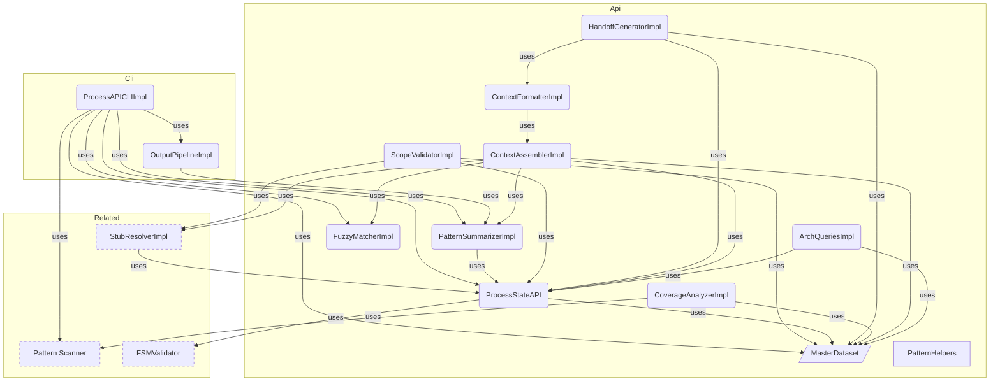

# DataAPI Overview

**Purpose:** DataAPI product area overview
**Detail Level:** Full reference

---

**How do I query process state?** The Data API provides direct terminal access to delivery process state. It replaces reading generated markdown or launching explore agents — targeted queries use 5-10x less context. The `context` command assembles curated bundles tailored to session type (planning, design, implement).

## Key Invariants

- One-command context assembly: `context <pattern> --session <type>` returns metadata + file paths + dependency status + architecture position in ~1.5KB
- Session type tailoring: `planning` (~500B, brief + deps), `design` (~1.5KB, spec + stubs + deps), `implement` (deliverables + FSM + tests)
- Direct API queries replace doc reading: JSON output is 5-10x smaller than generated docs

---

## DataAPI Components

Scoped architecture diagram showing component relationships:



---

## API Types

### MasterDatasetSchema (const)

```typescript
/**
 * Master Dataset - Unified view of all extracted patterns
 *
 * Contains raw patterns plus pre-computed views and statistics.
 * This is the primary data structure passed to generators and sections.
 */
```

```typescript
MasterDatasetSchema = z.object({
  // ─────────────────────────────────────────────────────────────────────────
  // Raw Data
  // ─────────────────────────────────────────────────────────────────────────

  /** All extracted patterns (both TypeScript and Gherkin) */
  patterns: z.array(ExtractedPatternSchema),

  /** Tag registry for category lookups */
  tagRegistry: TagRegistrySchema,

  // Note: workflow is not in the Zod schema because LoadedWorkflow contains Maps
  // (statusMap, phaseMap) which are not JSON-serializable. When workflow access
  // is needed, get it from SectionContext/GeneratorContext instead.

  // ─────────────────────────────────────────────────────────────────────────
  // Pre-computed Views
  // ─────────────────────────────────────────────────────────────────────────

  /** Patterns grouped by normalized status */
  byStatus: StatusGroupsSchema,

  /** Patterns grouped by phase number (sorted ascending) */
  byPhase: z.array(PhaseGroupSchema),

  /** Patterns grouped by quarter (e.g., "Q4-2024") */
  byQuarter: z.record(z.string(), z.array(ExtractedPatternSchema)),

  /** Patterns grouped by category */
  byCategory: z.record(z.string(), z.array(ExtractedPatternSchema)),

  /** Patterns grouped by source type */
  bySource: SourceViewsSchema,

  // ─────────────────────────────────────────────────────────────────────────
  // Aggregate Statistics
  // ─────────────────────────────────────────────────────────────────────────

  /** Overall status counts */
  counts: StatusCountsSchema,

  /** Number of distinct phases */
  phaseCount: z.number().int().nonnegative(),

  /** Number of distinct categories */
  categoryCount: z.number().int().nonnegative(),

  // ─────────────────────────────────────────────────────────────────────────
  // Relationship Data (optional)
  // ─────────────────────────────────────────────────────────────────────────

  /** Optional relationship index for dependency graph */
  relationshipIndex: z.record(z.string(), RelationshipEntrySchema).optional(),

  // ─────────────────────────────────────────────────────────────────────────
  // Architecture Data (optional)
  // ─────────────────────────────────────────────────────────────────────────

  /** Optional architecture index for diagram generation */
  archIndex: ArchIndexSchema.optional(),
});
```

### StatusGroupsSchema (const)

```typescript
/**
 * Status-based grouping of patterns
 *
 * Patterns are normalized to three canonical states:
 * - completed: implemented, completed
 * - active: active, partial, in-progress
 * - planned: roadmap, planned, undefined
 */
```

```typescript
StatusGroupsSchema = z.object({
  /** Patterns with status 'completed' or 'implemented' */
  completed: z.array(ExtractedPatternSchema),

  /** Patterns with status 'active', 'partial', or 'in-progress' */
  active: z.array(ExtractedPatternSchema),

  /** Patterns with status 'roadmap', 'planned', or undefined */
  planned: z.array(ExtractedPatternSchema),
});
```

### StatusCountsSchema (const)

```typescript
/**
 * Status counts for aggregate statistics
 */
```

```typescript
StatusCountsSchema = z.object({
  /** Number of completed patterns */
  completed: z.number().int().nonnegative(),

  /** Number of active patterns */
  active: z.number().int().nonnegative(),

  /** Number of planned patterns */
  planned: z.number().int().nonnegative(),

  /** Total number of patterns */
  total: z.number().int().nonnegative(),
});
```

### PhaseGroupSchema (const)

```typescript
/**
 * Phase grouping with patterns and counts
 *
 * Groups patterns by their phase number, with pre-computed
 * status counts for each phase.
 */
```

```typescript
PhaseGroupSchema = z.object({
  /** Phase number (e.g., 1, 2, 3, 14, 39) */
  phaseNumber: z.number().int(),

  /** Optional phase name from workflow config */
  phaseName: z.string().optional(),

  /** Patterns in this phase */
  patterns: z.array(ExtractedPatternSchema),

  /** Pre-computed status counts for this phase */
  counts: StatusCountsSchema,
});
```

### SourceViewsSchema (const)

```typescript
/**
 * Source-based views for different data origins
 */
```

```typescript
SourceViewsSchema = z.object({
  /** Patterns from TypeScript files (.ts) */
  typescript: z.array(ExtractedPatternSchema),

  /** Patterns from Gherkin feature files (.feature) */
  gherkin: z.array(ExtractedPatternSchema),

  /** Patterns with phase metadata (roadmap items) */
  roadmap: z.array(ExtractedPatternSchema),

  /** Patterns with PRD metadata (productArea, userRole, businessValue) */
  prd: z.array(ExtractedPatternSchema),
});
```

### RelationshipEntrySchema (const)

```typescript
/**
 * Relationship index for dependency tracking
 *
 * Maps pattern names to their relationship metadata.
 */
```

```typescript
RelationshipEntrySchema = z.object({
  /** Patterns this pattern uses (from @libar-docs-uses) */
  uses: z.array(z.string()),

  /** Patterns that use this pattern (from @libar-docs-used-by) */
  usedBy: z.array(z.string()),

  /** Patterns this pattern depends on (from @libar-docs-depends-on) */
  dependsOn: z.array(z.string()),

  /** Patterns this pattern enables (from @libar-docs-enables) */
  enables: z.array(z.string()),

  // UML-inspired relationship fields (PatternRelationshipModel)
  /** Patterns this item implements (realization relationship) */
  implementsPatterns: z.array(z.string()),

  /** Files/patterns that implement this pattern (computed inverse with file paths) */
  implementedBy: z.array(ImplementationRefSchema),

  /** Pattern this extends (generalization relationship) */
  extendsPattern: z.string().optional(),

  /** Patterns that extend this pattern (computed inverse) */
  extendedBy: z.array(z.string()),

  /** Related patterns for cross-reference without dependency (from @libar-docs-see-also tag) */
  seeAlso: z.array(z.string()),

  /** File paths to implementation APIs (from @libar-docs-api-ref tag) */
  apiRef: z.array(z.string()),
});
```

### ArchIndexSchema (const)

```typescript
/**
 * Architecture index for diagram generation
 *
 * Groups patterns by architectural metadata for rendering component diagrams.
 */
```

```typescript
ArchIndexSchema = z.object({
  /** Patterns grouped by arch-role (bounded-context, projection, saga, etc.) */
  byRole: z.record(z.string(), z.array(ExtractedPatternSchema)),

  /** Patterns grouped by arch-context (orders, inventory, etc.) */
  byContext: z.record(z.string(), z.array(ExtractedPatternSchema)),

  /** Patterns grouped by arch-layer (domain, application, infrastructure) */
  byLayer: z.record(z.string(), z.array(ExtractedPatternSchema)),

  /** Patterns grouped by include tag (cross-cutting content routing and diagram scoping) */
  byView: z.record(z.string(), z.array(ExtractedPatternSchema)),

  /** Patterns with any architecture metadata (for diagram generation) */
  all: z.array(ExtractedPatternSchema),
});
```

---

## Behavior Specifications

### ValidatePatternsCli

[View ValidatePatternsCli source](tests/features/cli/validate-patterns.feature)

Command-line interface for cross-validating TypeScript patterns vs Gherkin feature files.

<details>
<summary>CLI displays help and version information (4 scenarios)</summary>

#### CLI displays help and version information

**Invariant:** The --help/-h and --version/-v flags must produce usage/version output and exit successfully without requiring other arguments.

**Rationale:** Help and version are universal CLI conventions — both short and long flag forms must work for discoverability and scripting compatibility.

**Verified by:**

- Display help with --help flag
- Display help with -h flag
- Display version with --version flag
- Display version with -v flag

</details>

<details>
<summary>CLI requires input and feature patterns (2 scenarios)</summary>

#### CLI requires input and feature patterns

**Invariant:** The validate-patterns CLI must fail with clear errors when either --input or --features flags are missing.

**Rationale:** Cross-source validation requires both TypeScript and Gherkin inputs — running with only one source would produce incomplete validation that misses cross-source mismatches.

**Verified by:**

- Fail without --input flag
- Fail without --features flag

</details>

<details>
<summary>CLI validates patterns across TypeScript and Gherkin sources (3 scenarios)</summary>

#### CLI validates patterns across TypeScript and Gherkin sources

**Invariant:** The validator must detect mismatches between TypeScript and Gherkin sources including phase and status discrepancies.

**Rationale:** Dual-source architecture requires consistency — a pattern with status "active" in TypeScript but "roadmap" in Gherkin creates conflicting truth and broken reports.

**Verified by:**

- Validation passes for matching patterns
- Detect phase mismatch between sources
- Detect status mismatch between sources

</details>

<details>
<summary>CLI supports multiple output formats (2 scenarios)</summary>

#### CLI supports multiple output formats

**Invariant:** The CLI must support JSON and pretty (human-readable) output formats, with pretty as the default.

**Rationale:** Pretty format serves interactive use while JSON format enables CI/CD pipeline integration and programmatic consumption of validation results.

**Verified by:**

- JSON output format
- Pretty output format is default

</details>

<details>
<summary>Strict mode treats warnings as errors (2 scenarios)</summary>

#### Strict mode treats warnings as errors

**Invariant:** When --strict is enabled, warnings must be promoted to errors causing a non-zero exit code (exit 2); without --strict, warnings must not cause failure.

**Rationale:** CI pipelines need strict enforcement while local development benefits from lenient mode — the flag lets teams choose their enforcement level.

**Verified by:**

- Strict mode exits with code 2 on warnings
- Non-strict mode passes with warnings

</details>

<details>
<summary>CLI warns about unknown flags (1 scenarios)</summary>

#### CLI warns about unknown flags

**Invariant:** Unrecognized CLI flags must produce a warning message but allow execution to continue.

**Rationale:** Pattern validation is non-destructive — warning without failing is more user-friendly than hard errors for minor flag typos, while still surfacing the issue.

**Verified by:**

- Warn on unknown flag but continue

</details>

### ProcessApiCli

[View ProcessApiCli source](tests/features/cli/process-api.feature)

Command-line interface for querying delivery process state via ProcessStateAPI.

<details>
<summary>CLI displays help and version information (3 scenarios)</summary>

#### CLI displays help and version information

**Verified by:**

- Display help with --help flag
- Display version with -v flag
- No subcommand shows help

</details>

<details>
<summary>CLI requires input flag for subcommands (2 scenarios)</summary>

#### CLI requires input flag for subcommands

**Verified by:**

- Fail without --input flag when running status
- Reject unknown options

</details>

<details>
<summary>CLI status subcommand shows delivery state (1 scenarios)</summary>

#### CLI status subcommand shows delivery state

**Verified by:**

- Status shows counts and completion percentage

</details>

<details>
<summary>CLI query subcommand executes API methods (3 scenarios)</summary>

#### CLI query subcommand executes API methods

**Verified by:**

- Query getStatusCounts returns count object
- Query isValidTransition with arguments
- Unknown API method shows error

</details>

<details>
<summary>CLI pattern subcommand shows pattern detail (2 scenarios)</summary>

#### CLI pattern subcommand shows pattern detail

**Verified by:**

- Pattern lookup returns full detail
- Pattern not found shows error

</details>

<details>
<summary>CLI arch subcommand queries architecture (3 scenarios)</summary>

#### CLI arch subcommand queries architecture

**Verified by:**

- Arch roles lists roles with counts
- Arch context filters to bounded context
- Arch layer lists layers with counts

</details>

<details>
<summary>CLI shows errors for missing subcommand arguments (3 scenarios)</summary>

#### CLI shows errors for missing subcommand arguments

**Verified by:**

- Query without method name shows error
- Pattern without name shows error
- Unknown subcommand shows error

</details>

<details>
<summary>CLI handles argument edge cases (2 scenarios)</summary>

#### CLI handles argument edge cases

**Verified by:**

- Integer arguments are coerced for phase queries
- Double-dash separator is handled gracefully

</details>

<details>
<summary>CLI list subcommand filters patterns (2 scenarios)</summary>

#### CLI list subcommand filters patterns

**Verified by:**

- List all patterns returns JSON array
- List with invalid phase shows error

</details>

<details>
<summary>CLI search subcommand finds patterns by fuzzy match (2 scenarios)</summary>

#### CLI search subcommand finds patterns by fuzzy match

**Verified by:**

- Search returns matching patterns
- Search without query shows error

</details>

<details>
<summary>CLI context assembly subcommands return text output (4 scenarios)</summary>

#### CLI context assembly subcommands return text output

**Verified by:**

- Context returns curated text bundle
- Context without pattern name shows error
- Overview returns executive summary text
- Dep-tree returns dependency tree text

</details>

<details>
<summary>CLI tags and sources subcommands return JSON (2 scenarios)</summary>

#### CLI tags and sources subcommands return JSON

**Verified by:**

- Tags returns tag usage counts
- Sources returns file inventory

</details>

<details>
<summary>CLI extended arch subcommands query architecture relationships (3 scenarios)</summary>

#### CLI extended arch subcommands query architecture relationships

**Verified by:**

- Arch neighborhood returns pattern relationships
- Arch compare returns context comparison
- Arch coverage returns annotation coverage

</details>

<details>
<summary>CLI unannotated subcommand finds files without annotations (1 scenarios)</summary>

#### CLI unannotated subcommand finds files without annotations

**Verified by:**

- Unannotated finds files missing libar-docs marker

</details>

<details>
<summary>Output modifiers work when placed after the subcommand (3 scenarios)</summary>

#### Output modifiers work when placed after the subcommand

**Invariant:** Output modifiers (--count, --names-only, --fields) produce identical results regardless of position relative to the subcommand and its filters.

**Rationale:** Users should not need to memorize argument ordering rules; the CLI should be forgiving.

**Verified by:**

- Count modifier after list subcommand returns count
- Names-only modifier after list subcommand returns names
- Count modifier combined with list filter

</details>

<details>
<summary>CLI arch health subcommands detect graph quality issues (3 scenarios)</summary>

#### CLI arch health subcommands detect graph quality issues

**Invariant:** Health subcommands (dangling, orphans, blocking) operate on the relationship index, not the architecture index, and return results without requiring arch annotations.

**Rationale:** Graph quality issues (broken references, isolated patterns, blocked dependencies) are relationship-level concerns that should be queryable even when no architecture metadata exists.

**Verified by:**

- Arch dangling returns broken references
- Arch orphans returns isolated patterns
- Arch blocking returns blocked patterns

</details>

### LintProcessCli

[View LintProcessCli source](tests/features/cli/lint-process.feature)

Command-line interface for validating changes against delivery process rules.

<details>
<summary>CLI displays help and version information (4 scenarios)</summary>

#### CLI displays help and version information

**Invariant:** The --help/-h and --version/-v flags must produce usage/version output and exit successfully without requiring other arguments.

**Rationale:** Help and version are universal CLI conventions — both short and long flag forms must work for discoverability and scripting compatibility.

**Verified by:**

- Display help with --help flag
- Display help with -h flag
- Display version with --version flag
- Display version with -v flag

</details>

<details>
<summary>CLI requires git repository for validation (2 scenarios)</summary>

#### CLI requires git repository for validation

**Invariant:** The lint-process CLI must fail with a clear error when run outside a git repository in both staged and all modes.

**Rationale:** Process guard validation depends on git diff for change detection — running without git produces undefined behavior rather than useful validation results.

**Verified by:**

- Fail without git repository in staged mode
- Fail without git repository in all mode

</details>

<details>
<summary>CLI validates file mode input (3 scenarios)</summary>

#### CLI validates file mode input

**Invariant:** In file mode, the CLI must require at least one file path via positional argument or --file flag, and fail with a clear error when none is provided.

**Rationale:** File mode is for targeted validation of specific files — accepting zero files would silently produce a "no violations" result that falsely implies the files are valid.

**Verified by:**

- Fail when files mode has no files
- Accept file via positional argument
- Accept file via --file flag

</details>

<details>
<summary>CLI handles no changes gracefully (1 scenarios)</summary>

#### CLI handles no changes gracefully

**Invariant:** When no relevant changes are detected (empty diff), the CLI must exit successfully with a zero exit code.

**Rationale:** No changes means no violations are possible — failing on empty diffs would break CI pipelines on commits that only modify non-spec files.

**Verified by:**

- No changes detected exits successfully

</details>

<details>
<summary>CLI supports multiple output formats (2 scenarios)</summary>

#### CLI supports multiple output formats

**Invariant:** The CLI must support JSON and pretty (human-readable) output formats, with pretty as the default.

**Rationale:** Pretty format serves interactive pre-commit use while JSON format enables CI/CD pipeline integration and automated violation processing.

**Verified by:**

- JSON output format
- Pretty output format is default

</details>

<details>
<summary>CLI supports debug options (1 scenarios)</summary>

#### CLI supports debug options

**Invariant:** The --show-state flag must display the derived process state (FSM states, protection levels, deliverables) without affecting validation behavior.

**Rationale:** Process guard decisions are derived from complex state — exposing the intermediate state helps developers understand why a specific validation passed or failed.

**Verified by:**

- Show state flag displays derived state

</details>

<details>
<summary>CLI warns about unknown flags (1 scenarios)</summary>

#### CLI warns about unknown flags

**Invariant:** Unrecognized CLI flags must produce a warning message but allow execution to continue.

**Rationale:** Process validation is critical-path at commit time — hard-failing on a typo in an optional flag would block commits unnecessarily when the core validation would succeed.

**Verified by:**

- Warn on unknown flag but continue

</details>

### LintPatternsCli

[View LintPatternsCli source](tests/features/cli/lint-patterns.feature)

Command-line interface for validating pattern annotation quality.

<details>
<summary>CLI displays help and version information (2 scenarios)</summary>

#### CLI displays help and version information

**Invariant:** The --help and -v flags must produce usage/version output and exit successfully without requiring other arguments.

**Rationale:** Help and version are universal CLI conventions — they must work standalone so users can discover usage without reading external documentation.

**Verified by:**

- Display help with --help flag
- Display version with -v flag

</details>

<details>
<summary>CLI requires input patterns (1 scenarios)</summary>

#### CLI requires input patterns

**Invariant:** The lint-patterns CLI must fail with a clear error when the --input flag is not provided.

**Rationale:** Without input paths, the linter has nothing to validate — failing early prevents confusing "no violations" output that falsely implies clean annotations.

**Verified by:**

- Fail without --input flag

</details>

<details>
<summary>Lint passes for valid patterns (1 scenarios)</summary>

#### Lint passes for valid patterns

**Invariant:** Fully annotated patterns with all required tags must pass linting with zero violations.

**Rationale:** False positives erode developer trust in the linter — valid annotations must always pass to maintain the tool's credibility.

**Verified by:**

- Lint passes for complete annotations

</details>

<details>
<summary>Lint detects violations in incomplete patterns (1 scenarios)</summary>

#### Lint detects violations in incomplete patterns

**Invariant:** Patterns with missing or incomplete annotations must produce specific violation reports identifying what is missing.

**Rationale:** Actionable violation messages guide developers to fix annotations — generic "lint failed" messages without specifics waste debugging time.

**Verified by:**

- Report violations for incomplete annotations

</details>

<details>
<summary>CLI supports multiple output formats (2 scenarios)</summary>

#### CLI supports multiple output formats

**Invariant:** The CLI must support JSON and pretty (human-readable) output formats, with pretty as the default.

**Rationale:** Pretty format serves interactive use while JSON format enables CI/CD pipeline integration and programmatic consumption of lint results.

**Verified by:**

- JSON output format
- Pretty output format is default

</details>

<details>
<summary>Strict mode treats warnings as errors (2 scenarios)</summary>

#### Strict mode treats warnings as errors

**Invariant:** When --strict is enabled, warnings must be promoted to errors causing a non-zero exit code; without --strict, warnings must not cause failure.

**Rationale:** CI pipelines need strict enforcement while local development benefits from lenient mode — the flag lets teams choose their enforcement level.

**Verified by:**

- Strict mode fails on warnings
- Non-strict mode passes with warnings

</details>

### GenerateTagTaxonomyCli

[View GenerateTagTaxonomyCli source](tests/features/cli/generate-tag-taxonomy.feature)

Command-line interface for generating TAG_TAXONOMY.md from tag registry configuration.

<details>
<summary>CLI displays help and version information (4 scenarios)</summary>

#### CLI displays help and version information

**Invariant:** The --help/-h and --version/-v flags must produce usage/version output and exit successfully without requiring other arguments.

**Rationale:** Help and version are universal CLI conventions — both short and long flag forms must work for discoverability and scripting compatibility.

**Verified by:**

- Display help with --help flag
- Display help with -h flag
- Display version with --version flag
- Display version with -v flag

</details>

<details>
<summary>CLI generates taxonomy at specified output path (3 scenarios)</summary>

#### CLI generates taxonomy at specified output path

**Invariant:** The taxonomy generator must write output to the specified path, creating parent directories if they do not exist, and defaulting to a standard path when no output is specified.

**Rationale:** Flexible output paths support both default conventions and custom layouts — auto-creating directories prevents "ENOENT" errors on first run.

**Verified by:**

- Generate taxonomy at default path
- Generate taxonomy at custom output path
- Create output directory if missing

</details>

<details>
<summary>CLI respects overwrite flag for existing files (3 scenarios)</summary>

#### CLI respects overwrite flag for existing files

**Invariant:** The CLI must refuse to overwrite existing output files unless the --overwrite or -f flag is explicitly provided.

**Rationale:** Overwrite protection prevents accidental destruction of hand-edited taxonomy files — requiring an explicit flag makes destructive operations intentional.

**Verified by:**

- Fail when output file exists without --overwrite
- Overwrite existing file with -f flag
- Overwrite existing file with --overwrite flag

</details>

<details>
<summary>Generated taxonomy contains expected sections (2 scenarios)</summary>

#### Generated taxonomy contains expected sections

**Invariant:** The generated taxonomy file must include category documentation and statistics sections reflecting the configured tag registry.

**Rationale:** The taxonomy is a reference document — incomplete output missing categories or statistics would leave developers without the information they need to annotate correctly.

**Verified by:**

- Generated file contains category documentation
- Generated file reports statistics

</details>

<details>
<summary>CLI warns about unknown flags (1 scenarios)</summary>

#### CLI warns about unknown flags

**Invariant:** Unrecognized CLI flags must produce a warning message but allow execution to continue.

**Rationale:** Taxonomy generation is non-destructive — warning without failing is more user-friendly than hard errors for minor flag typos, while still surfacing the issue.

**Verified by:**

- Warn on unknown flag but continue

</details>

### GenerateDocsCli

[View GenerateDocsCli source](tests/features/cli/generate-docs.feature)

Command-line interface for generating documentation from annotated TypeScript.

<details>
<summary>CLI displays help and version information (2 scenarios)</summary>

#### CLI displays help and version information

**Invariant:** The --help and -v flags must produce usage/version output and exit successfully without requiring other arguments.

**Rationale:** Help and version are universal CLI conventions — they must work standalone so users can discover usage without reading external documentation.

**Verified by:**

- Display help with --help flag
- Display version with -v flag

</details>

<details>
<summary>CLI requires input patterns (1 scenarios)</summary>

#### CLI requires input patterns

**Invariant:** The generate-docs CLI must fail with a clear error when the --input flag is not provided.

**Rationale:** Without input source paths, the generator has nothing to scan — failing early with a clear message prevents confusing "no patterns found" errors downstream.

**Verified by:**

- Fail without --input flag

</details>

<details>
<summary>CLI lists available generators (1 scenarios)</summary>

#### CLI lists available generators

**Invariant:** The --list-generators flag must display all registered generator names without performing any generation.

**Rationale:** Users need to discover available generators before specifying --generator — listing them avoids trial-and-error with invalid generator names.

**Verified by:**

- List generators with --list-generators

</details>

<details>
<summary>CLI generates documentation from source files (2 scenarios)</summary>

#### CLI generates documentation from source files

**Invariant:** Given valid input patterns and a generator name, the CLI must scan sources, extract patterns, and produce markdown output files.

**Rationale:** This is the core pipeline — the CLI is the primary entry point for transforming annotated source code into generated documentation.

**Verified by:**

- Generate patterns documentation
- Use default generator (patterns) when not specified

</details>

<details>
<summary>CLI rejects unknown options (1 scenarios)</summary>

#### CLI rejects unknown options

**Invariant:** Unrecognized CLI flags must cause an error with a descriptive message rather than being silently ignored.

**Rationale:** Silent flag ignoring hides typos and misconfigurations — users typing --ouput instead of --output would get unexpected default behavior without realizing their flag was ignored.

**Verified by:**

- Unknown option causes error

</details>

### ProcessStateAPITesting

[View ProcessStateAPITesting source](tests/features/api/process-state-api.feature)

Programmatic interface for querying delivery process state.
Designed for Claude Code integration and tool automation.

**Problem:**

- Markdown generation is not ideal for programmatic access
- Claude Code needs structured data to answer process questions
- Multiple queries require redundant parsing of MasterDataset

**Solution:**

- ProcessStateAPI wraps MasterDataset with typed query methods
- Returns structured data suitable for programmatic consumption
- Integrates FSM validation for transition checks

<details>
<summary>Status queries return correct patterns (6 scenarios)</summary>

#### Status queries return correct patterns

**Invariant:** Status queries must correctly filter by both normalized status (planned = roadmap + deferred) and FSM status (exact match).

**Rationale:** The two-domain status convention requires separate query methods — mixing them produces incorrect filtered results.

**Verified by:**

- Get patterns by normalized status
- Get patterns by FSM status
- Get current work returns active patterns
- Get roadmap items returns roadmap and deferred
- Get status counts
- Get completion percentage

</details>

<details>
<summary>Phase queries return correct phase data (4 scenarios)</summary>

#### Phase queries return correct phase data

**Invariant:** Phase queries must return only patterns in the requested phase, with accurate progress counts and completion percentage.

**Rationale:** Phase-level queries power the roadmap and session planning views — incorrect counts cascade into wrong progress percentages.

**Verified by:**

- Get patterns by phase
- Get phase progress
- Get nonexistent phase returns undefined
- Get active phases

</details>

<details>
<summary>FSM queries expose transition validation (4 scenarios)</summary>

#### FSM queries expose transition validation

**Invariant:** FSM queries must validate transitions against the PDR-005 state machine and expose protection levels per status.

**Rationale:** Programmatic FSM access enables tooling to enforce delivery process rules without reimplementing the state machine.

**Verified by:**

- Check valid transition
- Check invalid transition
- Get valid transitions from status
- Get protection info

</details>

<details>
<summary>Pattern queries find and retrieve pattern data (4 scenarios)</summary>

#### Pattern queries find and retrieve pattern data

**Invariant:** Pattern lookup must be case-insensitive by name, and category queries must return only patterns with the requested category.

**Rationale:** Case-insensitive search reduces friction in CLI and AI agent usage where exact casing is often unknown.

**Verified by:**

- Find pattern by name (case insensitive)
- Find nonexistent pattern returns undefined
- Get patterns by category
- Get all categories with counts

</details>

<details>
<summary>Timeline queries group patterns by time (3 scenarios)</summary>

#### Timeline queries group patterns by time

**Invariant:** Quarter queries must correctly filter by quarter string, and recently completed must be sorted by date descending with limit.

**Rationale:** Timeline grouping enables quarterly reporting and session context — recent completions show delivery momentum.

**Verified by:**

- Get patterns by quarter
- Get all quarters
- Get recently completed sorted by date

</details>

### PatternSummarizeTests

[View PatternSummarizeTests source](tests/features/api/output-shaping/summarize.feature)

Validates that summarizePattern() projects ExtractedPattern (~3.5KB) to
PatternSummary (~100 bytes) with the correct 6 fields.

#### summarizePattern projects to compact summary

**Invariant:** summarizePattern must project a full pattern object to a compact summary containing exactly 6 fields, using the patternName tag over the name field when available and omitting undefined optional fields.

**Rationale:** Compact summaries reduce token usage by 80-90% compared to full patterns — they provide enough context for navigation without overwhelming AI context windows.

**Verified by:**

- Summary includes all 6 fields for a TypeScript pattern
- Summary includes all 6 fields for a Gherkin pattern
- Summary uses patternName tag over name field
- Summary omits undefined optional fields

#### summarizePatterns batch processes arrays

**Invariant:** summarizePatterns must batch-process an array of patterns, returning a correctly-sized array of compact summaries.

**Rationale:** Batch processing avoids N individual function calls — the API frequently needs to summarize all patterns matching a query in a single operation.

**Verified by:**

- Batch summarization returns correct count

### PatternHelpersTests

[View PatternHelpersTests source](tests/features/api/output-shaping/pattern-helpers.feature)

<details>
<summary>getPatternName uses patternName tag when available (2 scenarios)</summary>

#### getPatternName uses patternName tag when available

**Invariant:** getPatternName must return the patternName tag value when set, falling back to the pattern's name field when the tag is absent.

**Rationale:** The patternName tag allows human-friendly display names — without the fallback, patterns missing the tag would display as undefined.

**Verified by:**

- Returns patternName when set
- Falls back to name when patternName is absent

</details>

<details>
<summary>findPatternByName performs case-insensitive matching (3 scenarios)</summary>

#### findPatternByName performs case-insensitive matching

**Invariant:** findPatternByName must match pattern names case-insensitively, returning undefined when no match exists.

**Rationale:** Case-insensitive matching prevents frustrating "not found" errors when developers type "processguard" instead of "ProcessGuard" — both clearly refer to the same pattern.

**Verified by:**

- Exact case match
- Case-insensitive match
- No match returns undefined

</details>

<details>
<summary>getRelationships looks up with case-insensitive fallback (3 scenarios)</summary>

#### getRelationships looks up with case-insensitive fallback

**Invariant:** getRelationships must first try exact key lookup in the relationship index, then fall back to case-insensitive matching, returning undefined when no match exists.

**Rationale:** Exact-first with case-insensitive fallback balances performance (O(1) exact lookup) with usability (tolerates case mismatches in cross-references).

**Verified by:**

- Exact key match in relationship index
- Case-insensitive fallback match
- Missing relationship index returns undefined

</details>

<details>
<summary>suggestPattern provides fuzzy suggestions (2 scenarios)</summary>

#### suggestPattern provides fuzzy suggestions

**Invariant:** suggestPattern must return fuzzy match suggestions for close pattern names, returning empty results when no close match exists.

**Rationale:** Fuzzy suggestions power "did you mean?" UX in the CLI — without them, typos produce unhelpful "pattern not found" messages.

**Verified by:**

- Suggests close match
- No close match returns empty

</details>

### OutputPipelineTests

[View OutputPipelineTests source](tests/features/api/output-shaping/output-pipeline.feature)

Validates the output pipeline transforms: summarization, modifiers,
list filters, empty stripping, and format output.

<details>
<summary>Output modifiers apply with correct precedence (7 scenarios)</summary>

#### Output modifiers apply with correct precedence

**Invariant:** Output modifiers (count, names-only, fields, full) must apply to pattern arrays with correct precedence, passing scalar inputs through unchanged, with summaries as the default mode.

**Rationale:** Predictable modifier behavior enables composable CLI queries — unexpected precedence or scalar handling would produce confusing output for piped commands.

**Verified by:**

- Default mode returns summaries for pattern arrays
- Count modifier returns integer
- Names-only modifier returns string array
- Fields modifier picks specific fields
- Full modifier bypasses summarization
- Scalar input passes through unchanged
- Fields with single field returns objects with one key

</details>

<details>
<summary>Modifier conflicts are rejected (4 scenarios)</summary>

#### Modifier conflicts are rejected

**Invariant:** Mutually exclusive modifier combinations (full+names-only, full+count, full+fields) and invalid field names must be rejected with clear error messages.

**Rationale:** Conflicting modifiers produce ambiguous intent — rejecting early with a clear message is better than silently picking one modifier and ignoring the other.

**Verified by:**

- Full combined with names-only is rejected
- Full combined with count is rejected
- Full combined with fields is rejected
- Invalid field name is rejected

</details>

<details>
<summary>List filters compose via AND logic (4 scenarios)</summary>

#### List filters compose via AND logic

**Invariant:** Multiple list filters (status, category) must compose via AND logic, with pagination (limit/offset) applied after filtering and empty results for out-of-range offsets.

**Rationale:** AND composition is the intuitive default for filters — "status=active AND category=core" should narrow results, not widen them via OR logic.

**Verified by:**

- Filter by status returns matching patterns
- Filter by status and category narrows results
- Pagination with limit and offset
- Offset beyond array length returns empty results

</details>

<details>
<summary>Empty stripping removes noise (1 scenarios)</summary>

#### Empty stripping removes noise

**Invariant:** Null and empty values must be stripped from output objects to reduce noise in API responses.

**Rationale:** Empty fields in pattern summaries create visual clutter and waste tokens in AI context windows — stripping them keeps output focused on meaningful data.

**Verified by:**

- Null and empty values are stripped

</details>

### FuzzyMatchTests

[View FuzzyMatchTests source](tests/features/api/output-shaping/fuzzy-match.feature)

Validates tiered fuzzy matching: exact > prefix > substring > Levenshtein.

<details>
<summary>Fuzzy matching uses tiered scoring (8 scenarios)</summary>

#### Fuzzy matching uses tiered scoring

**Invariant:** Pattern matching must use a tiered scoring system: exact match (1.0) > prefix match (0.9) > substring match (0.7) > Levenshtein distance, with results sorted by score descending and case-insensitive matching.

**Rationale:** Tiered scoring ensures the most intuitive match wins — an exact match should always rank above a substring match, preventing surprising suggestions for common pattern names.

**Verified by:**

- Exact match scores 1.0
- Exact match is case-insensitive
- Prefix match scores 0.9
- Substring match scores 0.7
- Levenshtein match for close typos
- Results are sorted by score descending
- Empty query matches all patterns as prefix
- No candidate patterns returns no results

</details>

<details>
<summary>findBestMatch returns single suggestion (2 scenarios)</summary>

#### findBestMatch returns single suggestion

**Invariant:** findBestMatch must return the single highest-scoring match above the threshold, or undefined when no match exceeds the threshold.

**Rationale:** A single best suggestion simplifies "did you mean?" prompts in the CLI — returning multiple matches would require additional UI to disambiguate.

**Verified by:**

- Best match returns suggestion above threshold
- No match returns undefined when below threshold

</details>

<details>
<summary>Levenshtein distance computation (2 scenarios)</summary>

#### Levenshtein distance computation

**Invariant:** The Levenshtein distance function must correctly compute edit distance between strings, returning 0 for identical strings.

**Rationale:** Levenshtein distance is the fallback matching tier — incorrect distance computation would produce wrong fuzzy match scores for typo correction.

**Verified by:**

- Identical strings have distance 0
- Single character difference

</details>

### ContextFormatterTests

[View ContextFormatterTests source](tests/features/api/context-assembly/context-formatter.feature)

Tests for formatContextBundle(), formatDepTree(), formatFileReadingList(),
and formatOverview() plain text rendering functions.

<details>
<summary>formatContextBundle renders section markers (2 scenarios)</summary>

#### formatContextBundle renders section markers

**Invariant:** The context formatter must render section markers for all populated sections in a context bundle, with design bundles rendering all sections and implement bundles focusing on deliverables and FSM.

**Rationale:** Section markers enable structured parsing of context output — without them, AI consumers cannot reliably extract specific sections from the formatted bundle.

**Verified by:**

- Design bundle renders all populated sections
- Implement bundle renders deliverables and FSM

</details>

<details>
<summary>formatDepTree renders indented tree (1 scenarios)</summary>

#### formatDepTree renders indented tree

**Invariant:** The dependency tree formatter must render with indentation arrows and a focal pattern marker to visually distinguish the target pattern from its dependencies.

**Rationale:** Visual hierarchy in the dependency tree makes dependency chains scannable at a glance — flat output would require mental parsing to understand depth and relationships.

**Verified by:**

- Tree renders with arrows and focal marker

</details>

<details>
<summary>formatOverview renders progress summary (1 scenarios)</summary>

#### formatOverview renders progress summary

**Invariant:** The overview formatter must render a progress summary line showing completion metrics for the project.

**Rationale:** The progress line is the first thing developers see when starting a session — it provides immediate project health awareness without requiring detailed exploration.

**Verified by:**

- Overview renders progress line

</details>

<details>
<summary>formatFileReadingList renders categorized file paths (2 scenarios)</summary>

#### formatFileReadingList renders categorized file paths

**Invariant:** The file reading list formatter must categorize paths into primary and dependency sections, producing minimal output when the list is empty.

**Rationale:** Categorized file lists tell developers which files to read first (primary) versus reference (dependency) — uncategorized lists waste time on low-priority files.

**Verified by:**

- File list renders primary and dependency sections
- Empty file reading list renders minimal output

</details>

### ContextAssemblerTests

[View ContextAssemblerTests source](tests/features/api/context-assembly/context-assembler.feature)

Tests for assembleContext(), buildDepTree(), buildFileReadingList(), and
buildOverview() pure functions that operate on MasterDataset.

<details>
<summary>assembleContext produces session-tailored context bundles (7 scenarios)</summary>

#### assembleContext produces session-tailored context bundles

**Invariant:** Each session type (design/planning/implement) must include exactly the context sections defined by its profile — no more, no less.

**Rationale:** Over-fetching wastes AI context window tokens; under-fetching causes the agent to make uninformed decisions.

**Verified by:**

- Design session includes stubs, consumers, and architecture
- Planning session includes only metadata and dependencies
- Implement session includes deliverables and FSM
- Multi-pattern context merges metadata from both patterns
- Pattern not found returns error with suggestion
- Description preserves Problem and Solution structure
- Solution text with inline bold is not truncated
- Design session includes stubs
- consumers
- and architecture

</details>

<details>
<summary>buildDepTree walks dependency chains with cycle detection (4 scenarios)</summary>

#### buildDepTree walks dependency chains with cycle detection

**Invariant:** The dependency tree must walk the full chain up to the depth limit, mark the focal node, and terminate safely on circular references.

**Rationale:** Dependency chains reveal implementation prerequisites — cycles and infinite recursion would crash the CLI.

**Verified by:**

- Dependency tree shows chain with status markers
- Depth limit truncates branches
- Circular dependencies are handled safely
- Standalone pattern returns single-node tree

</details>

<details>
<summary>buildOverview provides executive project summary (2 scenarios)</summary>

#### buildOverview provides executive project summary

**Invariant:** The overview must include progress counts (completed/active/planned), active phase listing, and blocking dependencies.

**Rationale:** The overview is the first command in every session start recipe — it must provide a complete project health snapshot.

**Verified by:**

- Overview shows progress, active phases, and blocking
- Empty dataset returns zero-state overview
- Overview shows progress
- active phases
- and blocking

</details>

<details>
<summary>buildFileReadingList returns paths by relevance (3 scenarios)</summary>

#### buildFileReadingList returns paths by relevance

**Invariant:** Primary files (spec, implementation) must always be included; related files (dependency implementations) are included only when requested.

**Rationale:** File reading lists power the "what to read" guidance — relevance sorting ensures the most important files are read first within token budgets.

**Verified by:**

- File list includes primary and related files
- File list includes implementation files for completed dependencies
- File list without related returns only primary

</details>

### StubTaxonomyTagTests

[View StubTaxonomyTagTests source](tests/features/api/stub-integration/taxonomy-tags.feature)

**Problem:**
Stub metadata (target path, design session) was stored as plain text
in JSDoc descriptions, invisible to structured queries.

**Solution:**
Register libar-docs-target and libar-docs-since as taxonomy tags
so they flow through the extraction pipeline as structured fields.

#### Taxonomy tags are registered in the registry

**Invariant:** The target and since stub metadata tags must be registered in the tag registry as recognized taxonomy entries.

**Rationale:** Unregistered tags would be flagged as unknown by the linter — registration ensures stub metadata tags pass validation alongside standard annotation tags.

**Verified by:**

- Target and since tags exist in registry

#### Tags are part of the stub metadata group

**Invariant:** The target and since tags must be grouped under the stub metadata domain in the built registry.

**Rationale:** Domain grouping enables the taxonomy codec to render stub metadata tags in their own section — ungrouped tags would be lost in the "Other" category.

**Verified by:**

- Built registry groups target and since as stub tags

### StubResolverTests

[View StubResolverTests source](tests/features/api/stub-integration/stub-resolver.feature)

**Problem:**
Design session stubs need structured discovery and resolution
to determine which stubs have been implemented and which remain.

**Solution:**
StubResolver functions identify, resolve, and group stubs from
the MasterDataset with filesystem existence checks.

<details>
<summary>Stubs are identified by path or target metadata (2 scenarios)</summary>

#### Stubs are identified by path or target metadata

**Invariant:** A pattern must be identified as a stub if it resides in the stubs directory OR has a targetPath metadata field.

**Rationale:** Dual identification supports both convention-based (directory) and metadata-based (targetPath) stub detection — relying on only one would miss stubs organized differently.

**Verified by:**

- Patterns in stubs directory are identified as stubs
- Patterns with targetPath are identified as stubs

</details>

<details>
<summary>Stubs are resolved against the filesystem (2 scenarios)</summary>

#### Stubs are resolved against the filesystem

**Invariant:** Resolved stubs must show whether their target file exists on the filesystem and must be grouped by the pattern they implement.

**Rationale:** Target existence status tells developers whether a stub has been implemented — grouping by pattern enables the "stubs --unresolved" command to show per-pattern implementation gaps.

**Verified by:**

- Resolved stubs show target existence status
- Stubs are grouped by implementing pattern

</details>

<details>
<summary>Decision items are extracted from descriptions (3 scenarios)</summary>

#### Decision items are extracted from descriptions

**Invariant:** AD-N formatted items must be extracted from pattern description text, with empty descriptions returning no items and malformed items being skipped.

**Rationale:** Decision items (AD-1, AD-2, etc.) link stubs to architectural decisions — extracting them enables traceability from code stubs back to the design rationale.

**Verified by:**

- AD-N items are extracted from description text
- Empty description returns no decision items
- Malformed AD items are skipped

</details>

<details>
<summary>PDR references are found across patterns (2 scenarios)</summary>

#### PDR references are found across patterns

**Invariant:** The resolver must find all patterns that reference a given PDR identifier, returning empty results when no references exist.

**Rationale:** PDR cross-referencing enables impact analysis — knowing which patterns reference a decision helps assess the blast radius of changing that decision.

**Verified by:**

- Patterns referencing a PDR are found
- No references returns empty result

</details>

### ScopeValidatorTests

[View ScopeValidatorTests source](tests/features/api/session-support/scope-validator.feature)

**Problem:**
Starting an implementation or design session without checking prerequisites
wastes time when blockers are discovered mid-session.

**Solution:**
ScopeValidator runs composable checks and aggregates results into a verdict
(ready, blocked, or warnings) before a session starts.

<details>
<summary>Implementation scope validation checks all prerequisites (7 scenarios)</summary>

#### Implementation scope validation checks all prerequisites

**Invariant:** Implementation scope validation must check FSM transition validity, dependency completeness, PDR references, and deliverable presence, with strict mode promoting warnings to blockers.

**Rationale:** Starting implementation without passing scope validation wastes an entire session — the validator catches all known blockers before any code is written.

**Verified by:**

- All implementation checks pass
- Incomplete dependency blocks implementation
- FSM transition from completed blocks implementation
- Missing PDR references produce WARN
- No deliverables blocks implementation
- Strict mode promotes WARN to BLOCKED
- Pattern not found throws error

</details>

<details>
<summary>Design scope validation checks dependency stubs (2 scenarios)</summary>

#### Design scope validation checks dependency stubs

**Invariant:** Design scope validation must verify that dependencies have corresponding code stubs, producing warnings when stubs are missing.

**Rationale:** Design sessions that reference unstubbed dependencies cannot produce actionable interfaces — stub presence indicates the dependency's API surface is at least sketched.

**Verified by:**

- Design session with no dependencies passes
- Design session with dependencies lacking stubs produces WARN

</details>

<details>
<summary>Formatter produces structured text output (3 scenarios)</summary>

#### Formatter produces structured text output

**Invariant:** The scope validator formatter must produce structured text with ADR-008 markers, showing verdict text for warnings and blocker details for blocked verdicts.

**Rationale:** Structured formatter output enables the CLI to display verdicts consistently — unstructured output would vary by validation type and be hard to parse.

**Verified by:**

- Formatter produces markers per ADR-008
- Formatter shows warnings verdict text
- Formatter shows blocker details for blocked verdict

</details>

### HandoffGeneratorTests

[View HandoffGeneratorTests source](tests/features/api/session-support/handoff-generator.feature)

**Problem:**
Multi-session work loses critical state between sessions when handoff
documentation is manual or forgotten.

**Solution:**
HandoffGenerator assembles a structured handoff document from ProcessStateAPI
and MasterDataset, capturing completed work, remaining items, discovered
issues, and next-session priorities.

#### Handoff generates compact session state summary

**Invariant:** The handoff generator must produce a compact session state summary including pattern status, discovered items, inferred session type, modified files, and dependency blockers, throwing an error for unknown patterns.

**Rationale:** Handoff documents are the bridge between multi-session work — without compact state capture, the next session starts from scratch instead of resuming where the previous one left off.

**Verified by:**

- Generate handoff for in-progress pattern
- Handoff captures discovered items
- Session type is inferred from status
- Completed pattern infers review session type
- Deferred pattern infers design session type
- Files modified section included when provided
- Blockers section shows incomplete dependencies
- Pattern not found throws error

#### Formatter produces structured text output

**Invariant:** The handoff formatter must produce structured text output with ADR-008 section markers for machine-parseable session state.

**Rationale:** ADR-008 markers enable the context assembler to parse handoff output programmatically — unstructured text would require fragile regex parsing.

**Verified by:**

- Handoff formatter produces markers per ADR-008

### ArchQueriesTest

[View ArchQueriesTest source](tests/features/api/architecture-queries/arch-queries.feature)

<details>
<summary>Neighborhood and comparison views (3 scenarios)</summary>

#### Neighborhood and comparison views

**Invariant:** The architecture query API must provide pattern neighborhood views (direct connections) and cross-context comparison views (shared/unique dependencies), returning undefined for nonexistent patterns.

**Rationale:** Neighborhood and comparison views are the primary navigation tools for understanding architecture — without them, developers must manually trace relationship chains across files.

**Verified by:**

- Pattern neighborhood shows direct connections
- Cross-context comparison shows shared and unique dependencies
- Neighborhood for nonexistent pattern returns undefined

</details>

<details>
<summary>Taxonomy discovery via tags and sources (3 scenarios)</summary>

#### Taxonomy discovery via tags and sources

**Invariant:** The API must aggregate tag values with counts across all patterns and categorize source files by type, returning empty reports when no patterns match.

**Rationale:** Tag aggregation reveals annotation coverage gaps and source inventory helps teams understand their codebase composition — both are essential for project health monitoring.

**Verified by:**

- Tag aggregation counts values across patterns
- Source inventory categorizes files by type
- Tags with no patterns returns empty report

</details>

<details>
<summary>Coverage analysis reports annotation completeness (4 scenarios)</summary>

#### Coverage analysis reports annotation completeness

**Invariant:** Coverage analysis must detect unused taxonomy entries, cross-context integration points, and include all relationship types (implements, dependsOn, enables) in neighborhood views.

**Rationale:** Unused taxonomy entries indicate dead configuration while missing relationship types produce incomplete architecture views — both degrade the reliability of generated documentation.

**Verified by:**

- Unused taxonomy detection
- Cross-context comparison with integration points
- Neighborhood includes implements relationships
- Neighborhood includes dependsOn and enables relationships

</details>

---
