# Generation Overview

**Purpose:** Generation product area overview
**Detail Level:** Full reference

---

**How does code become docs?** The generation pipeline transforms annotated source code into markdown documents through a four-stage architecture: Scanner discovers files, Extractor produces `ExtractedPattern` objects, Transformer builds MasterDataset with pre-computed views, and Codecs render to markdown via RenderableDocument IR. Nine specialized codecs handle reference docs, planning, session, reporting, timeline, ADRs, business rules, taxonomy, and composite output — each supporting three detail levels (detailed, standard, summary). The Orchestrator runs generators in registration order, producing both detailed `docs-live/` references and compact `_claude-md/` summaries.

### Pipeline Stages

| Stage       | Module                     | Responsibility                                                  |
| ----------- | -------------------------- | --------------------------------------------------------------- |
| Scanner     | `src/scanner/`             | File discovery, AST parsing, opt-in via `@libar-docs`           |
| Extractor   | `src/extractor/`           | Pattern extraction from TypeScript JSDoc and Gherkin tags       |
| Transformer | `src/generators/pipeline/` | MasterDataset with pre-computed views for O(1) access (ADR-006) |
| Codec       | `src/renderable/`          | Pure functions: MasterDataset → RenderableDocument → Markdown   |

### Codec Inventory

| Codec                  | Purpose                                                        |
| ---------------------- | -------------------------------------------------------------- |
| ReferenceDocumentCodec | Conventions, diagrams, shapes, behaviors (4-layer composition) |
| PlanningCodec          | Roadmap and remaining work                                     |
| SessionCodec           | Current work and session findings                              |
| ReportingCodec         | Changelog                                                      |
| TimelineCodec          | Timeline and traceability                                      |
| RequirementsAdrCodec   | ADR generation                                                 |
| BusinessRulesCodec     | Gherkin rule extraction                                        |
| TaxonomyCodec          | Tag registry docs                                              |
| CompositeCodec         | Composes multiple codecs into a single document                |

## Key Invariants

- Codec purity: Every codec is a pure function (dataset in, document out). No side effects, no filesystem access. Same input always produces same output
- Single read model (ADR-006): All codecs consume MasterDataset. No codec reads raw scanner/extractor output. Anti-patterns: Parallel Pipeline, Lossy Local Type, Re-derived Relationship
- Progressive disclosure: Every document renders at three detail levels (detailed, standard, summary) from the same codec. Summary feeds `_claude-md/` modules; detailed feeds `docs-live/reference/`
- Config-driven generation: A single `ReferenceDocConfig` produces a complete document. Content sources compose in fixed order: conventions, diagrams, shapes, behaviors
- RenderableDocument IR: Codecs express intent ("this is a table"), the renderer handles syntax ("pipe-delimited markdown"). Switching output format requires only a new renderer
- Composition order: Reference docs compose four content layers in fixed order. Product area docs compose five layers: intro, conventions, diagrams, shapes, business rules
- Shape extraction: TypeScript shapes (`interface`, `type`, `enum`, `function`, `const`) are extracted by declaration-level `@libar-docs-shape` tags. Shapes include source text, JSDoc, type parameters, and property documentation
- Generator registration: Generators self-register via `registerGenerator()`. The orchestrator runs them in registration order. Each generator owns its output files and codec configuration

---

## Contents

- [Key Invariants](#key-invariants)
- [Generation Components](#generation-components)
- [API Types](#api-types)
- [Business Rules](#business-rules)

---

## Generation Components

Scoped architecture diagram showing component relationships:

```mermaid
graph TB
    subgraph generator["Generator"]
        GitModule["GitModule"]
        GitHelpers["GitHelpers"]
        GitBranchDiff["GitBranchDiff"]
        SourceMapper[/"SourceMapper"/]
        Documentation_Generation_Orchestrator("Documentation Generation Orchestrator")
        ProcessApiReferenceGenerator["ProcessApiReferenceGenerator"]
        DesignReviewGenerator("DesignReviewGenerator")
        DecisionDocGenerator("DecisionDocGenerator")
        CliRecipeGenerator["CliRecipeGenerator"]
        TransformTypes["TransformTypes"]
        TransformDataset("TransformDataset")
        SequenceTransformUtils("SequenceTransformUtils")
        RelationshipResolver("RelationshipResolver")
        ContextInferenceImpl["ContextInferenceImpl"]
    end
    subgraph renderer["Renderer"]
        loadPreambleFromMarkdown___Shared_Markdown_to_SectionBlock_Parser["loadPreambleFromMarkdown — Shared Markdown-to-SectionBlock Parser"]
        PatternsCodec[("PatternsCodec")]
        MermaidDiagramUtils["MermaidDiagramUtils"]
        DesignReviewCodec[("DesignReviewCodec")]
        DecisionDocCodec[("DecisionDocCodec")]
        CompositeCodec[("CompositeCodec")]
        ArchitectureCodec[("ArchitectureCodec")]
    end
    subgraph related["Related"]
        MasterDataset["MasterDataset"]:::neighbor
        Pattern_Scanner["Pattern Scanner"]:::neighbor
        GherkinASTParser["GherkinASTParser"]:::neighbor
        PatternHelpers["PatternHelpers"]:::neighbor
        ShapeExtractor["ShapeExtractor"]:::neighbor
        ReferenceDocShowcase["ReferenceDocShowcase"]:::neighbor
        ProcessApiHybridGeneration["ProcessApiHybridGeneration"]:::neighbor
        ProceduralGuideCodec["ProceduralGuideCodec"]:::neighbor
        PatternRelationshipModel["PatternRelationshipModel"]:::neighbor
        DesignReviewGeneration["DesignReviewGeneration"]:::neighbor
        CliRecipeCodec["CliRecipeCodec"]:::neighbor
        ContextInference["ContextInference"]:::neighbor
    end
    loadPreambleFromMarkdown___Shared_Markdown_to_SectionBlock_Parser ..->|implements| ProceduralGuideCodec
    GitModule -->|uses| GitBranchDiff
    GitModule -->|uses| GitHelpers
    SourceMapper -.->|depends on| DecisionDocCodec
    SourceMapper -.->|depends on| ShapeExtractor
    SourceMapper -.->|depends on| GherkinASTParser
    Documentation_Generation_Orchestrator -->|uses| Pattern_Scanner
    PatternsCodec ..->|implements| PatternRelationshipModel
    DesignReviewCodec -->|uses| MasterDataset
    DesignReviewCodec -->|uses| MermaidDiagramUtils
    DesignReviewCodec ..->|implements| DesignReviewGeneration
    CompositeCodec ..->|implements| ReferenceDocShowcase
    ArchitectureCodec -->|uses| MasterDataset
    ProcessApiReferenceGenerator ..->|implements| ProcessApiHybridGeneration
    DesignReviewGenerator -->|uses| DesignReviewCodec
    DesignReviewGenerator -->|uses| MasterDataset
    DesignReviewGenerator ..->|implements| DesignReviewGeneration
    DecisionDocGenerator -.->|depends on| DecisionDocCodec
    DecisionDocGenerator -.->|depends on| SourceMapper
    CliRecipeGenerator ..->|implements| CliRecipeCodec
    TransformTypes -->|uses| MasterDataset
    TransformDataset -->|uses| MasterDataset
    TransformDataset ..->|implements| PatternRelationshipModel
    SequenceTransformUtils -->|uses| MasterDataset
    SequenceTransformUtils ..->|implements| DesignReviewGeneration
    RelationshipResolver -->|uses| PatternHelpers
    ContextInferenceImpl ..->|implements| ContextInference
    DesignReviewGeneration -.->|depends on| MermaidDiagramUtils
    CliRecipeCodec -.->|depends on| ProcessApiHybridGeneration
    classDef neighbor stroke-dasharray: 5 5
```



---

## API Types

### RuntimeMasterDataset (interface)

```typescript
/**
 * Runtime MasterDataset with optional workflow
 *
 * Extends the Zod-compatible MasterDataset with workflow reference.
 * LoadedWorkflow contains Maps which aren't JSON-serializable,
 * so it's kept separate from the Zod schema.
 *
 */
```

```typescript
interface RuntimeMasterDataset extends MasterDataset {
  /** Optional workflow configuration (not serializable) */
  readonly workflow?: LoadedWorkflow;
}
```

| Property | Description                                        |
| -------- | -------------------------------------------------- |
| workflow | Optional workflow configuration (not serializable) |

### RawDataset (interface)

```typescript
/**
 * Raw input data for transformation
 *
 */
```

```typescript
interface RawDataset {
  /** Extracted patterns from TypeScript and/or Gherkin sources */
  readonly patterns: readonly ExtractedPattern[];

  /** Tag registry for category lookups */
  readonly tagRegistry: TagRegistry;

  /** Optional workflow configuration for phase names (can be undefined) */
  readonly workflow?: LoadedWorkflow | undefined;

  /** Optional rules for inferring bounded context from file paths */
  readonly contextInferenceRules?: readonly ContextInferenceRule[] | undefined;
}
```

| Property              | Description                                                        |
| --------------------- | ------------------------------------------------------------------ |
| patterns              | Extracted patterns from TypeScript and/or Gherkin sources          |
| tagRegistry           | Tag registry for category lookups                                  |
| workflow              | Optional workflow configuration for phase names (can be undefined) |
| contextInferenceRules | Optional rules for inferring bounded context from file paths       |

### RenderableDocument (type)

```typescript
type RenderableDocument = {
  title: string;
  purpose?: string;
  detailLevel?: string;
  sections: SectionBlock[];
  additionalFiles?: Record<string, RenderableDocument>;
};
```

### SectionBlock (type)

```typescript
type SectionBlock =
  | HeadingBlock
  | ParagraphBlock
  | SeparatorBlock
  | TableBlock
  | ListBlock
  | CodeBlock
  | MermaidBlock
  | CollapsibleBlock
  | LinkOutBlock;
```

### HeadingBlock (type)

```typescript
type HeadingBlock = z.infer<typeof HeadingBlockSchema>;
```

### TableBlock (type)

```typescript
type TableBlock = z.infer<typeof TableBlockSchema>;
```

### ListBlock (type)

```typescript
type ListBlock = z.infer<typeof ListBlockSchema>;
```

### CodeBlock (type)

```typescript
type CodeBlock = z.infer<typeof CodeBlockSchema>;
```

### MermaidBlock (type)

```typescript
type MermaidBlock = z.infer<typeof MermaidBlockSchema>;
```

### CollapsibleBlock (type)

```typescript
type CollapsibleBlock = {
  type: 'collapsible';
  summary: string;
  content: SectionBlock[];
};
```

### transformToMasterDataset (function)

```typescript
/**
 * Transform raw extracted data into a MasterDataset with all pre-computed views.
 *
 * This is a ONE-PASS transformation that computes:
 * - Status-based groupings (completed/active/planned)
 * - Phase-based groupings with counts
 * - Quarter-based groupings for timeline views
 * - Category-based groupings for taxonomy
 * - Source-based views (TypeScript vs Gherkin, roadmap, PRD)
 * - Aggregate statistics (counts, phase count, category count)
 * - Optional relationship index
 *
 * For backward compatibility, this function returns just the dataset.
 * Use `transformToMasterDatasetWithValidation` to get validation summary.
 *
 * @param raw - Raw dataset with patterns, registry, and optional workflow
 * @returns MasterDataset with all pre-computed views
 */
```

```typescript
function transformToMasterDataset(raw: RawDataset): RuntimeMasterDataset;
```

| Parameter | Type | Description                                                |
| --------- | ---- | ---------------------------------------------------------- |
| raw       |      | Raw dataset with patterns, registry, and optional workflow |

**Returns:** MasterDataset with all pre-computed views

---

## Business Rules

92 patterns, 442 rules with invariants (443 total)

### ADR 005 Codec Based Markdown Rendering

| Rule                                                              | Invariant                                                                                                                                                                                                                                                                                                                       | Rationale                                                                                                                                                                                                                                                                                                                                                                                                                                                                                                                                                                                                                                                                                                                                                                                                                                                                                                                                                                                                                     |
| ----------------------------------------------------------------- | ------------------------------------------------------------------------------------------------------------------------------------------------------------------------------------------------------------------------------------------------------------------------------------------------------------------------------- | ----------------------------------------------------------------------------------------------------------------------------------------------------------------------------------------------------------------------------------------------------------------------------------------------------------------------------------------------------------------------------------------------------------------------------------------------------------------------------------------------------------------------------------------------------------------------------------------------------------------------------------------------------------------------------------------------------------------------------------------------------------------------------------------------------------------------------------------------------------------------------------------------------------------------------------------------------------------------------------------------------------------------------- |
| Codecs implement a decode-only contract                           | Every codec is a pure function that accepts a MasterDataset and returns a RenderableDocument. Codecs do not perform side effects, do not write files, and do not access the filesystem. The codec contract is decode-only because the transformation is one-directional: structured data becomes a document, never the reverse. | Pure functions are deterministic and trivially testable. For the same MasterDataset, a codec always produces the same RenderableDocument. This makes snapshot testing reliable and enables codec output comparison across versions.                                                                                                                                                                                                                                                                                                                                                                                                                                                                                                                                                                                                                                                                                                                                                                                           |
| RenderableDocument is a typed intermediate representation         | RenderableDocument contains a title, an ordered array of SectionBlock elements, and an optional record of additional files. Each SectionBlock is a discriminated union: heading, paragraph, table, code, list, separator, or metaRow. The renderer consumes this IR without needing to know which codec produced it.            | A typed IR decouples codecs from rendering. Codecs express intent ("this is a table with these rows") and the renderer handles syntax ("pipe-delimited markdown with separator row"). This means switching output format (e.g., HTML instead of markdown) requires only a new renderer, not changes to every codec.                                                                                                                                                                                                                                                                                                                                                                                                                                                                                                                                                                                                                                                                                                           |
| CompositeCodec assembles documents from child codecs              | CompositeCodec accepts an array of child codecs and produces a single RenderableDocument by concatenating their sections. Child codec order determines section order in the output. Separators are inserted between children by default.                                                                                        | Reference documents combine content from multiple domains (patterns, conventions, shapes, diagrams). Rather than building a monolithic codec that knows about all content types, CompositeCodec lets each domain own its codec and composes them declaratively.                                                                                                                                                                                                                                                                                                                                                                                                                                                                                                                                                                                                                                                                                                                                                               |
| ADR content comes from both Feature description and Rule prefixes | ADR structured content (Context, Decision, Consequences) can appear in two locations within a feature file. Both sources must be rendered. Silently dropping either source causes content loss.                                                                                                                                 | Early ADRs used name prefixes like "Context - ..." and "Decision - ..." on Rule blocks to structure content. Later ADRs placed Context, Decision, and Consequences as bold-annotated prose in the Feature description, reserving Rule: blocks for invariants and design rules. Both conventions are valid. The ADR codec must handle both because the codebase contains ADRs authored in each style. The Feature description lives in pattern.directive.description. If the codec only renders Rules (via partitionRulesByPrefix), then Feature description content is silently dropped -- no error, no warning. This caused confusion across two repos where ADR content appeared in the feature file but was missing from generated docs. The fix renders pattern.directive.description in buildSingleAdrDocument between the Overview metadata table and the partitioned Rules section, using renderFeatureDescription() which walks content linearly and handles prose, tables, and DocStrings with correct interleaving. |
| The markdown renderer is codec-agnostic                           | The renderer accepts any RenderableDocument regardless of which codec produced it. Rendering depends only on block types, not on document origin. This enables testing codecs and renderers independently.                                                                                                                      | If the renderer knew about specific codecs, adding a new codec would require renderer changes. By operating purely on the SectionBlock discriminated union, the renderer is closed for modification but open for extension via new block types.                                                                                                                                                                                                                                                                                                                                                                                                                                                                                                                                                                                                                                                                                                                                                                               |

### ADR 006 Single Read Model Architecture

| Rule                                                      | Invariant                                                                                                                                                                                                                                                                  | Rationale                                                                                                                                                                        |
| --------------------------------------------------------- | -------------------------------------------------------------------------------------------------------------------------------------------------------------------------------------------------------------------------------------------------------------------------- | -------------------------------------------------------------------------------------------------------------------------------------------------------------------------------- |
| All feature consumers query the read model, not raw state | Code that needs pattern relationships, status groupings, cross-source resolution, or dependency information consumes the MasterDataset. Direct scanner/extractor imports are permitted only in pipeline orchestration code that builds the MasterDataset.                  | Bypassing the read model forces consumers to re-derive data that the MasterDataset already computes, creating duplicate logic and divergent behavior when the pipeline evolves.  |
| No lossy local types                                      | Consumers do not define local DTOs that duplicate and discard fields from ExtractedPattern. If a consumer needs a subset, the type system provides the projection — not a hand-written extraction function that becomes a barrier between the consumer and canonical data. | Lossy local types silently drop fields that later become needed, causing bugs that only surface when new MasterDataset capabilities are added and the local type lacks them.     |
| Relationship resolution is computed once                  | Forward relationships (uses, dependsOn, implementsPatterns) and reverse lookups (usedBy, implementedBy, extendedBy) are computed in `transformToMasterDataset()`. No consumer re-derives these from raw pattern arrays or scanned file tags.                               | Re-deriving relationships in consumers duplicates the resolution logic and risks inconsistency when different consumers implement subtly different traversal or filtering rules. |
| Three named anti-patterns                                 | These are recognized violations, serving as review criteria for new code and refactoring targets for existing code.                                                                                                                                                        | Without named anti-patterns, violations appear as one-off style issues rather than systematic architectural drift, making them harder to detect and communicate in code review.  |

### Arch Generator Registration

| Rule                                                         | Invariant                                                                                                                                       | Rationale                                                                                                                                                          |
| ------------------------------------------------------------ | ----------------------------------------------------------------------------------------------------------------------------------------------- | ------------------------------------------------------------------------------------------------------------------------------------------------------------------ |
| Architecture generator is registered in the registry         | The generator registry must contain an "architecture" generator entry available for CLI invocation.                                             | Without a registered entry, the CLI cannot discover or invoke architecture diagram generation.                                                                     |
| Architecture generator produces component diagram by default | Running the architecture generator without diagram type options must produce a component diagram with bounded context subgraphs.                | A sensible default prevents users from needing to specify options for the most common use case.                                                                    |
| Architecture generator supports diagram type options         | The architecture generator must accept a diagram type option that selects between component and layered diagram output.                         | Different architectural perspectives (bounded context vs. layer hierarchy) require different diagram types, and the user must be able to select which to generate. |
| Architecture generator supports context filtering            | When context filtering is applied, the generated diagram must include only patterns from the specified bounded contexts and exclude all others. | Without filtering, large monorepos would produce unreadable diagrams with dozens of bounded contexts; filtering enables focused per-context views.                 |

### Arch Index Dataset

| Rule                                                   | Invariant                                                                                                         | Rationale                                                                                                                                                    |
| ------------------------------------------------------ | ----------------------------------------------------------------------------------------------------------------- | ------------------------------------------------------------------------------------------------------------------------------------------------------------ |
| archIndex groups patterns by arch-role                 | Every pattern with an arch-role tag must appear in the archIndex.byRole map under its role key.                   | Diagram generators need O(1) lookup of patterns by role to render role-based groupings efficiently.                                                          |
| archIndex groups patterns by arch-context              | Every pattern with an arch-context tag must appear in the archIndex.byContext map under its context key.          | Component diagrams render bounded context subgraphs and need patterns grouped by context.                                                                    |
| archIndex groups patterns by arch-layer                | Every pattern with an arch-layer tag must appear in the archIndex.byLayer map under its layer key.                | Layered diagrams render layer subgraphs and need patterns grouped by architectural layer.                                                                    |
| archIndex.all contains all patterns with any arch tag  | archIndex.all must contain exactly the set of patterns that have at least one arch tag (role, context, or layer). | Consumers iterating over all architectural patterns need a single canonical list; omitting partially-tagged patterns would silently drop them from diagrams. |
| Patterns without arch tags are excluded from archIndex | Patterns lacking all three arch tags (role, context, layer) must not appear in any archIndex view.                | Including non-architectural patterns would pollute diagrams with irrelevant components.                                                                      |

### Architecture Diagram Advanced

| Rule                                                         | Invariant                                                                                                                                              | Rationale                                                                                                                                         |
| ------------------------------------------------------------ | ------------------------------------------------------------------------------------------------------------------------------------------------------ | ------------------------------------------------------------------------------------------------------------------------------------------------- |
| Layered diagrams group patterns by architectural layer       | Layered diagrams must render patterns grouped by architectural layer (domain, application, infrastructure) with top-to-bottom flow.                    | Layered architecture visualization shows dependency direction - domain at top, infrastructure at bottom - following conventional layer ordering.  |
| Architecture generator is registered with generator registry | An "architecture" generator must be registered with the generator registry to enable `pnpm docs:architecture` via the existing `generate-docs.js` CLI. | The delivery-process uses a generator registry pattern. New generators register with the orchestrator rather than creating separate CLI commands. |
| Sequence diagrams render interaction flows                   | Sequence diagrams must render interaction flows (command flow, saga flow) showing step-by-step message passing between components.                     | Component diagrams show structure but not behavior. Sequence diagrams show runtime flow - essential for understanding command/saga execution.     |

### Architecture Diagram Core

| Rule                                                  | Invariant                                                                                                                                            | Rationale                                                                                                                                                                                  |
| ----------------------------------------------------- | ---------------------------------------------------------------------------------------------------------------------------------------------------- | ------------------------------------------------------------------------------------------------------------------------------------------------------------------------------------------ |
| Architecture tags exist in the tag registry           | Three architecture-specific tags (`arch-role`, `arch-context`, `arch-layer`) must exist in the tag registry with correct format and enum values.     | Architecture diagram generation requires metadata to classify source files into diagram components. Standard tag infrastructure enables consistent extraction via the existing AST parser. |
| AST parser extracts architecture tags from TypeScript | The AST parser must extract `arch-role`, `arch-context`, and `arch-layer` tags from TypeScript JSDoc comments into DocDirective objects.             | Source code annotations are the single source of truth for architectural metadata. Parser must extract them alongside existing pattern metadata.                                           |
| MasterDataset builds archIndex during transformation  | The `transformToMasterDataset` function must build an `archIndex` that groups patterns by role, context, and layer for efficient diagram generation. | Single-pass extraction during dataset transformation avoids expensive re-traversal. Index structure enables O(1) lookup by each dimension.                                                 |
| Component diagrams group patterns by bounded context  | Component diagrams must render patterns as nodes grouped into bounded context subgraphs, with relationship arrows using UML-inspired styles.         | Component diagrams visualize system architecture showing how bounded contexts isolate components. Subgraphs enforce visual separation.                                                     |

### Architecture Doc Refactoring

| Rule                                                                            | Invariant                                                                                                                                                                                                                                                                                                                                                                                                                                                                                                                                                                                                                                                                                                                                                                                                           | Rationale                                                                                                                                                                                                                                                                                                                                                                                                                                                                                                    |
| ------------------------------------------------------------------------------- | ------------------------------------------------------------------------------------------------------------------------------------------------------------------------------------------------------------------------------------------------------------------------------------------------------------------------------------------------------------------------------------------------------------------------------------------------------------------------------------------------------------------------------------------------------------------------------------------------------------------------------------------------------------------------------------------------------------------------------------------------------------------------------------------------------------------- | ------------------------------------------------------------------------------------------------------------------------------------------------------------------------------------------------------------------------------------------------------------------------------------------------------------------------------------------------------------------------------------------------------------------------------------------------------------------------------------------------------------ |
| Convention-tagged JSDoc produces machine-extractable codec documentation        | Every codec source file annotated with `@libar-docs-convention<br>    codec-registry` must have structured JSDoc following the machine-extractable format. The convention extractor splits multi-codec files by `## Heading` into separate convention rules, each rendered as its own section in the generated reference document.                                                                                                                                                                                                                                                                                                                                                                                                                                                                                  | DD-1: Convention tag approach over dedicated codec. Rather than creating a new "codec inventory" codec that enumerates codecs from source, the existing convention-tag mechanism is reused. Each codec file's JSDoc is treated as convention rules tagged with `codec-registry`. This avoids new codec infrastructure and leverages the proven convention extractor path. The reference codec already handles 4-layer composition, so convention tags slot into the existing Layer 1 (conventions) position. |
| Machine-extractable JSDoc format follows structured heading convention          | DD-2: Multi-codec JSDoc splitting uses one `## Heading` per codec per file. Each heading block contains structured fields in a fixed order: `**Purpose:**` one-liner, `**Output Files:**` file paths, options table with Type/Default/Description columns, `**When to Use:**` bullet list, and `**Factory Pattern:**` code example. Fields are optional -- codecs without options omit the table, codecs without factory patterns omit the code block.                                                                                                                                                                                                                                                                                                                                                              | The convention extractor uses `## ` heading regex to split descriptions into rules. Without this structure, a file like `session.ts` (3 codecs) would produce a single undifferentiated blob. The heading text becomes the convention rule title in the generated reference. The fixed field order ensures consistent rendering across all 20+ codec entries.                                                                                                                                                |
| Heading match in convention extractor handles whitespace correctly              | The convention extractor's heading parser uses `matchEnd` (the character position after the full regex match) rather than `indexOf('\n',<br>    heading.index)` to calculate where content starts after a heading. This prevents the `\s*` prefix in the heading regex from consuming leading newlines, which would cause `heading.index` to point to those newlines instead of the heading text.                                                                                                                                                                                                                                                                                                                                                                                                                   | Discovered during Phase 2 implementation. The heading regex `/^\s*##\s+(.+)$/gm` matches headings with optional leading whitespace. When a heading has leading newlines, `heading.index` points to the first newline (part of the `\s*` match), not the `##` character. Using `indexOf('\n', heading.index)` then finds the newline BEFORE the heading, producing content that includes the heading text itself. The fix uses the regex match's end position directly.                                       |
| Section disposition follows content-type routing                                | DD-3: Each ARCHITECTURE.md section is routed based on content type. Three routing strategies apply: (1) product area absorption -- sections describing a specific pipeline stage move to the corresponding product area document where they get live diagrams and relationship graphs; (2) generated shapes -- sections documenting TypeScript interfaces move to generated shape reference docs; (3) generated diagrams -- ASCII/text data flow diagrams are replaced by live Mermaid diagrams generated from architecture annotations.                                                                                                                                                                                                                                                                            | The routing heuristic is: if a generated equivalent already exists, replace with pointer; if content is convention-taggable in source files, tag and generate; if editorial content that cannot be expressed as annotations, retain. This ensures each section lands in the location with the best maintenance model for its content type.                                                                                                                                                                   |
| Product area absorption validates content coverage before pointer replacement   | DD-4: Product area absorption replaces ARCHITECTURE.md sections with pointers only when the target product area document already covers the equivalent content. Three sections route to product areas: Configuration Architecture (L70-139) to CONFIGURATION.md, Source Systems (L585-692) to ANNOTATION.md, and Workflow Integration (L959-1068) to PROCESS.md. Annotation format examples from Source Systems merge into the Four-Stage Pipeline retained section rather than being lost. Workflow API code examples are dropped -- Claude reads source files directly.                                                                                                                                                                                                                                           | Product area documents are generated from annotated source code and already contain live diagrams, relationship graphs, and API types. Absorbing manual Architecture sections into these generated docs eliminates drift while preserving the content in a maintained location. The key test is: does the product area doc cover the same technical facts? If yes, the manual section becomes a 4-line pointer.                                                                                              |
| MasterDataset shapes generate a dedicated ARCHITECTURE-TYPES reference document | DD-6: A new ReferenceDocConfig produces ARCHITECTURE-TYPES.md using shapeSelectors with group master-dataset to extract MasterDataset schema types, RuntimeMasterDataset, RawDataset, PipelineOptions, and PipelineResult. Source files tagged with libar-docs-shape master-dataset and libar-docs-include master-dataset contribute shapes to the reference doc. The Unified Transformation section (L345-478) is replaced with a condensed narrative (~15 lines) and pointer to ARCHITECTURE-TYPES.md.                                                                                                                                                                                                                                                                                                            | The MasterDataset is the central data structure -- the sole read model per ADR-006. It deserves dedicated reference doc treatment alongside ARCHITECTURE-CODECS.md. Shape extraction from TypeScript declarations provides exact type signatures that stay in sync with code, unlike the manual schema table in ARCHITECTURE.md.                                                                                                                                                                             |
| Pipeline architecture convention content replaces ASCII data flow diagrams      | DD-7: The Data Flow Diagrams section (L774-957) contains 4 ASCII diagrams totaling ~183 lines. These are replaced using a hybrid approach: convention tag pipeline-architecture (already registered, currently unused) on orchestrator.ts and build-pipeline.ts produces prose descriptions of pipeline steps and consumer architecture. A new master-dataset-views hardcoded diagram source generates a Mermaid fan-out diagram showing dataset view relationships. DD-8: Both convention content and diagram source are configured on the ARCHITECTURE-TYPES.md ReferenceDocConfig, keeping all architecture reference content in one generated document.                                                                                                                                                         | ASCII diagrams cannot be generated from code annotations. The hybrid approach maximizes generated coverage: convention-tagged JSDoc captures the narrative (pipeline steps, ADR-006 consumer pattern) while the hardcoded diagram source produces visual Mermaid output. Using the already-registered pipeline-architecture convention tag avoids new taxonomy entries.                                                                                                                                      |
| Usefulness-driven editorial trimming targets Claude as primary consumer         | DD-9: ARCHITECTURE.md serves Claude (primary audience) and human developers (secondary). Content retained must answer architectural "why" and "how things connect" questions. Content available via source file reads or generated reference documents is removed. Post-decomposition target: ~320 lines (~75% reduction from 1,287 lines). Sections dropped entirely: Programmatic Usage (L1070-1125) and Extending the System (L1127-1194) -- Claude reads source files directly and infers extension patterns from existing codec implementations. DD-5: Key Design Patterns section (L693-772) trimmed from ~80 to ~15 lines: Result Monad becomes a pointer to CORE-TYPES.md, Schema-First Validation becomes a 3-line summary with source pointer, Tag Registry becomes a 4-line summary with source pointer. | Claude has direct access to source files and generated reference docs. Duplicating this content in ARCHITECTURE.md wastes context window tokens. The remaining editorial sections (Executive Summary, Four-Stage Pipeline, Codec Architecture, Progressive Disclosure) provide the mental model and architectural "why" that cannot be inferred from code alone.                                                                                                                                             |

### Architecture Doc Refactoring Testing

| Rule                                                                  | Invariant                                                                                                                                                                                                               | Rationale                                                                                                                                                                                                                                      |
| --------------------------------------------------------------------- | ----------------------------------------------------------------------------------------------------------------------------------------------------------------------------------------------------------------------- | ---------------------------------------------------------------------------------------------------------------------------------------------------------------------------------------------------------------------------------------------- |
| Product area sections coexist with generated documents                | Each architecture section in docs/ARCHITECTURE.md has a corresponding generated document in docs-live/product-areas/ covering equivalent content from annotated sources.                                                | Manual and generated docs must coexist during the transition period. Generated docs prove that annotated sources produce equivalent coverage before manual sections are deprecated.                                                            |
| Four-Stage Pipeline section retains annotation format examples        | The Four-Stage Pipeline section contains annotation format examples (e.g., @libar-docs-shape, extract-shapes) and appears before the Source Systems section in document order.                                          | Annotation format examples in the pipeline section demonstrate the source-first architecture. Their ordering establishes the conceptual flow: pipeline stages first, then the source systems that feed them.                                   |
| Convention extraction produces ARCHITECTURE-CODECS reference document | The ARCHITECTURE-CODECS.md reference document is generated from convention-tagged JSDoc in codec source files and contains structured sections for each codec with output file references.                              | Codec documentation must stay synchronized with source code. Convention extraction from JSDoc ensures the reference document reflects actual codec implementations rather than manually maintained descriptions that drift.                    |
| Full sections coexist with generated equivalents in docs-live         | Major sections of ARCHITECTURE.md (Unified Transformation, Data Flow Diagrams, Quick Reference) are retained alongside their generated equivalents in docs-live/reference/.                                             | Generated reference documents (ARCHITECTURE-TYPES.md, ARCHITECTURE-CODECS.md) provide exhaustive type and codec listings, but the manual sections offer architectural narrative and design rationale that generated docs cannot yet replicate. |
| MasterDataset shapes appear in ARCHITECTURE-TYPES reference           | The ARCHITECTURE-TYPES.md reference document contains core MasterDataset types (MasterDataset, RuntimeMasterDataset, RawDataset) and pipeline types (PipelineOptions, PipelineResult) extracted from shape annotations. | Type shapes are the structural backbone of the pipeline. Generating their documentation from annotations ensures the reference always matches the actual TypeScript interfaces, eliminating manual drift.                                      |
| Pipeline architecture convention appears in generated reference       | Source files in the pipeline layer (orchestrator.ts, build-pipeline.ts) carry the pipeline-architecture convention tag, enabling convention extraction into the ARCHITECTURE-TYPES reference document.                  | Convention tags on pipeline source files are the mechanism that feeds content into generated reference docs. Without these tags, the architecture reference would have no source material to extract.                                          |
| Full ARCHITECTURE.md retains all sections with substantial content    | ARCHITECTURE.md retains all major sections (Programmatic Usage, Extending the System, Key Design Patterns) with substantial content and remains under 1700 lines as a comprehensive reference.                          | These sections contain editorial content (usage examples, extension guides, design pattern explanations) that cannot be generated from annotations. They remain manual until procedural guide codecs can replicate their depth.                |

### Arch Tag Extraction

| Rule                                                         | Invariant                                                                                                                       | Rationale                                                                                                                                    |
| ------------------------------------------------------------ | ------------------------------------------------------------------------------------------------------------------------------- | -------------------------------------------------------------------------------------------------------------------------------------------- |
| arch-role tag is defined in the registry                     | The tag registry must contain an arch-role tag with enum format and all valid architectural role values.                        | Without a registry-defined arch-role tag, the extractor cannot validate role values and diagrams may render invalid roles.                   |
| arch-context tag is defined in the registry                  | The tag registry must contain an arch-context tag with value format for free-form bounded context names.                        | Without a registry-defined arch-context tag, bounded context groupings cannot be validated and diagrams may contain arbitrary context names. |
| arch-layer tag is defined in the registry                    | The tag registry must contain an arch-layer tag with enum format and exactly three values: domain, application, infrastructure. | Allowing arbitrary layer values would break the fixed Clean Architecture ordering that layered diagrams depend on.                           |
| AST parser extracts arch-role from TypeScript annotations    | The AST parser must extract the arch-role value from JSDoc annotations and populate the directive's archRole field.             | If arch-role is not extracted, patterns cannot be classified by architectural role and diagram node styling is lost.                         |
| AST parser extracts arch-context from TypeScript annotations | The AST parser must extract the arch-context value from JSDoc annotations and populate the directive's archContext field.       | If arch-context is not extracted, component diagrams cannot group patterns into bounded context subgraphs.                                   |
| AST parser extracts arch-layer from TypeScript annotations   | The AST parser must extract the arch-layer value from JSDoc annotations and populate the directive's archLayer field.           | If arch-layer is not extracted, layered diagrams cannot group patterns into domain/application/infrastructure subgraphs.                     |
| AST parser handles multiple arch tags together               | When a JSDoc block contains arch-role, arch-context, and arch-layer tags, all three must be extracted into the directive.       | Partial extraction would cause components to be missing from role, context, or layer groupings depending on which tag was dropped.           |
| Missing arch tags yield undefined values                     | Arch tag fields absent from a JSDoc block must be undefined in the extracted directive, not null or empty string.               | Downstream consumers distinguish between "not annotated" (undefined) and "annotated with empty value" to avoid rendering ghost nodes.        |

### Business Rules Document Codec

| Rule                                                           | Invariant                                                                                                                                                           | Rationale                                                                                                                                           |
| -------------------------------------------------------------- | ------------------------------------------------------------------------------------------------------------------------------------------------------------------- | --------------------------------------------------------------------------------------------------------------------------------------------------- |
| Extracts Rule blocks with Invariant and Rationale              | Annotated Rule blocks must have their Invariant, Rationale, and Verified-by fields faithfully extracted and rendered.                                               | These structured annotations are the primary content of business rules documentation; losing them silently produces incomplete output.              |
| Organizes rules by product area and phase                      | Rules must be grouped by product area and ordered by phase number within each group.                                                                                | Ungrouped or misordered rules make it impossible to find domain-specific constraints or understand their delivery sequence.                         |
| Summary mode generates compact output                          | Summary mode must produce only a statistics line and omit all detailed rule headings and content.                                                                   | AI context windows have strict token limits; including full detail in summary mode wastes context budget and degrades session quality.              |
| Preserves code examples and tables in detailed mode            | Code examples must appear only in detailed mode and must be excluded from standard mode output.                                                                     | Code blocks in standard mode clutter the overview and push important rule summaries out of view; detailed mode is the opt-in path for full content. |
| Generates scenario traceability links                          | Verification links must include the source file path so readers can locate the verifying scenario.                                                                  | Links without file paths are unresolvable, breaking the traceability chain between business rules and their executable specifications.              |
| Progressive disclosure generates detail files per product area | Each product area with rules must produce a separate detail file, and the main document must link to all detail files via an index table.                           | A single monolithic document becomes unnavigable at scale; progressive disclosure lets readers drill into only the product area they need.          |
| Empty rules show placeholder instead of blank content          | Rules with no invariant, description, or scenarios must render a placeholder message; rules with scenarios but no invariant must show the verified-by list instead. | Blank rule sections are indistinguishable from rendering bugs; explicit placeholders signal intentional incompleteness versus broken extraction.    |
| Rules always render flat for full visibility                   | Rule output must never use collapsible blocks regardless of rule count; all rule headings must be directly visible.                                                 | Business rules are compliance-critical content; hiding them behind collapsible sections risks rules being overlooked during review.                 |
| Source file shown as filename text                             | Source file references must render as plain filename text, not as markdown links.                                                                                   | Markdown links to local file paths break in every viewer except the local filesystem, producing dead links that erode trust in the documentation.   |
| Verified-by renders as checkbox list at standard level         | Verified-by must render as a checkbox list of scenario names, with duplicate names deduplicated.                                                                    | Duplicate entries inflate the checklist and mislead reviewers into thinking more verification exists than actually does.                            |
| Feature names are humanized from camelCase pattern names       | CamelCase pattern names must be converted to space-separated headings with trailing "Testing" suffixes stripped.                                                    | Raw camelCase names are unreadable in documentation headings, and "Testing" suffixes leak implementation concerns into user-facing output.          |

### Business Rules Generator

| Rule                                              | Invariant                                                                                                                           | Rationale                                                                                                                                                          |
| ------------------------------------------------- | ----------------------------------------------------------------------------------------------------------------------------------- | ------------------------------------------------------------------------------------------------------------------------------------------------------------------ |
| Extracts Rule blocks with Invariant and Rationale | Every `Rule:` block with `**Invariant:**` annotation must be extracted. Rules without annotations are included with rule name only. | Business rules are the core domain constraints. Extracting them separately from acceptance criteria creates a focused reference document for domain understanding. |
| Organizes rules by domain category and phase      | Rules are grouped first by domain category (from `@libar-docs-*` flags), then by phase number for temporal ordering.                | Domain-organized documentation helps stakeholders find rules relevant to their area of concern without scanning all rules.                                         |
| Preserves code examples and comparison tables     | DocStrings (`"""typescript`) and tables in Rule descriptions are rendered in the business rules document.                           | Code examples and tables provide concrete understanding of abstract rules. Removing them loses critical context.                                                   |
| Generates scenario traceability links             | Each rule's `**Verified by:**` section generates links to the scenarios that verify the rule.                                       | Traceability enables audit compliance and helps developers find relevant tests when modifying rules.                                                               |

### Claude Module Generation

| Rule                                                            | Invariant                                                                                                                                                                                                                                                | Rationale                                                                                                                                                                                                       |
| --------------------------------------------------------------- | -------------------------------------------------------------------------------------------------------------------------------------------------------------------------------------------------------------------------------------------------------- | --------------------------------------------------------------------------------------------------------------------------------------------------------------------------------------------------------------- |
| Claude module tags exist in the tag registry                    | Three claude-specific tags (`claude-module`, `claude-section`, `claude-tags`) must exist in the tag registry with correct format and values.                                                                                                             | Module generation requires metadata to determine output path, section placement, and variation filtering. Standard tag infrastructure enables consistent extraction via the existing Gherkin parser.            |
| Gherkin parser extracts claude module tags from feature files   | The Gherkin extractor must extract `claude-module`, `claude-section`, and `claude-tags` from feature file tags into ExtractedPattern objects.                                                                                                            | Behavior specs are the source of truth for CLAUDE.md module content. Parser must extract module metadata alongside existing pattern metadata.                                                                   |
| Module content is extracted from feature file structure         | The codec extracts content from Rule blocks and Scenario Outline Examples only. Feature descriptions (Problem/Solution preamble) are skipped because they contain meta-documentation about why the spec exists, not operational content for AI sessions. | Behavior specs contain well-structured, prescriptive content in Rule blocks. Feature descriptions waste context in compact AI modules — the invariants and rationale in Rule blocks are the actionable content. |
| ClaudeModuleCodec produces compact markdown modules             | The codec transforms patterns with claude tags into markdown files suitable for the `_claude-md/` directory structure.                                                                                                                                   | CLAUDE.md modules must be compact and actionable. The codec produces ready-to-use markdown without truncation (let modular-claude-md handle token budget warnings).                                             |
| Claude module generator writes files to correct locations       | The generator must write module files to `{outputDir}/{section}/{module}.md` based on the `claude-section` and `claude-module` tags.                                                                                                                     | Output path structure must match modular-claude-md expectations. The `claude-section` determines the subdirectory, `claude-module` determines filename.                                                         |
| Claude module generator is registered with generator registry   | A "claude-modules" generator must be registered with the generator registry to enable `pnpm docs:claude-modules` via the existing CLI.                                                                                                                   | Consistent with architecture-diagram-generation pattern. New generators register with the orchestrator rather than creating separate commands.                                                                  |
| Same source generates detailed docs with progressive disclosure | When running with `detailLevel: "detailed"`, the codec produces expanded documentation including all Rule content, code examples, and scenario details.                                                                                                  | Single source generates both compact modules (AI context) and detailed docs (human reference). Progressive disclosure is already a codec capability.                                                            |

### Cli Recipe Codec

| Rule                                                            | Invariant                                                                                                                                                                                                                                                                                                                                                                                                                                                                                                                                                                                                     | Rationale                                                                                                                                                                                                                                                                                                                                                                                                                                                                                                                                                                                                      |
| --------------------------------------------------------------- | ------------------------------------------------------------------------------------------------------------------------------------------------------------------------------------------------------------------------------------------------------------------------------------------------------------------------------------------------------------------------------------------------------------------------------------------------------------------------------------------------------------------------------------------------------------------------------------------------------------- | -------------------------------------------------------------------------------------------------------------------------------------------------------------------------------------------------------------------------------------------------------------------------------------------------------------------------------------------------------------------------------------------------------------------------------------------------------------------------------------------------------------------------------------------------------------------------------------------------------------- |
| CLI recipes are a separate generator from reference tables      | The `CliRecipeGenerator` is a standalone sibling to `ProcessApiReferenceGenerator`, not an extension of it. Both implement `DocumentGenerator`, both consume `CLI_SCHEMA` directly, and both produce independent `OutputFile[]` via the standard orchestrator write path. The recipe generator produces `docs-live/reference/PROCESS-API-RECIPES.md` while the reference generator produces `docs-live/reference/PROCESS-API-REFERENCE.md`.                                                                                                                                                                   | Reference tables and recipe guides serve different audiences and change at different cadences. Reference tables change when CLI flags are added or removed. Recipes change when workflow recommendations evolve. Coupling them in one generator would force both to change together and make the generator responsible for two distinct content types. ProcessApiReferenceGenerator is already completed and tested (Phase 43) -- extending it risks regressions. Two small standalone generators are easier to test and maintain than one large one.                                                          |
| Recipe content uses a structured schema extension               | `CLI_SCHEMA` is extended with a `recipes` field containing `RecipeGroup[]`. Each `RecipeGroup` has a title, optional description, and an array of `RecipeExample` objects. Each `RecipeExample` has a title, a purpose description, an array of RecipeStep entries (each with a command string and optional comment), and an optional expected output block. The schema extension is additive -- existing `CLIOptionGroup` types are unchanged.                                                                                                                                                               | Recipes are multi-command sequences ("run these 3 commands in order") with explanatory context. They do not fit into `CLIOptionGroup` which models individual flags. A separate `RecipeGroup[]` keeps the schema type-safe and makes recipes independently testable. Static expected output strings in the schema are deterministic -- no build-time CLI execution needed.                                                                                                                                                                                                                                     |
| Narrative prose uses preamble mechanism                         | Editorial content that cannot be derived from the CLI schema -- specifically "Why Use This" motivational prose, the Quick Start example with output, and the session type decision tree -- uses a preamble mechanism in the generator configuration. Preamble content is manually authored in `delivery-process.config.ts` as structured section data and appears before all generated recipe content in the output file.                                                                                                                                                                                     | The "Why Use This" section explains the value proposition of the Data API CLI with a comparison table (CLI vs reading markdown). This is editorial judgment, not derivable from command metadata. The Quick Start shows a specific 3-command workflow with example terminal output. The session decision tree maps cognitive states ("Starting to code?") to session types. None of these have a source annotation -- they are instructional content authored for human understanding. The preamble mechanism exists precisely for this (proven by DocsConsolidationStrategy Phase 2 preamble implementation). |
| Generated recipe file complements manual PROCESS-API.md         | After this pattern completes, `docs/PROCESS-API.md` is trimmed to a slim editorial introduction (~30 lines) containing the document title, a one-paragraph purpose statement, and links to both generated files: `docs-live/reference/PROCESS-API-REFERENCE.md` (option tables from Phase 43) and `docs-live/reference/PROCESS-API-RECIPES.md` (recipes and narratives from this pattern). The manual file retains the JSON Envelope, Exit Codes, and JSON Piping sections (~40 lines) which are operational reference unlikely to drift. All other prose sections are replaced by the generated recipe file. | Phase 43 established the hybrid pattern: keep editorial prose in the manual file, extract derivable content to generated files. This pattern extends the hybrid by recognizing that recipe content IS derivable from a structured schema. The ~460 lines of command descriptions, example output, and recipe blocks can be maintained as schema data rather than freeform markdown. What remains in the manual file (~70 lines total) is true operational reference (JSON envelope format, exit codes, piping tips) that changes rarely and has no schema source.                                              |
| Command narrative descriptions are sourced from schema metadata | Each command group in the generated recipe file includes a narrative description sourced from the CLI schema, not hardcoded in the generator. The existing `CLIOptionGroup.description` and `CLIOptionGroup.postNote` fields carry per-group narrative text. For command groups not currently in CLI_SCHEMA (Session Workflow Commands, Pattern Discovery, Architecture Queries, Metadata and Inventory), new `CommandGroup` entries are added to the schema with title, description, and per-command narrative metadata.                                                                                     | The manual PROCESS-API.md contains narrative descriptions for each command ("Highest-impact command. Pre-flight readiness check that prevents wasted sessions.") that are valuable developer context. Hardcoding these in the generator would create a second maintenance location. Placing them in CLI_SCHEMA co-locates command metadata (what the command does) with command definition (what flags it accepts), following the same single-source-of-truth principle that drove Phase 43.                                                                                                                   |

### Codec Based Generator Testing

| Rule                                                     | Invariant                                                                                                                            | Rationale                                                                                                                    |
| -------------------------------------------------------- | ------------------------------------------------------------------------------------------------------------------------------------ | ---------------------------------------------------------------------------------------------------------------------------- |
| CodecBasedGenerator adapts codecs to generator interface | CodecBasedGenerator delegates document generation to the underlying codec and surfaces codec errors through the generator interface. | The adapter pattern enables codec-based rendering to integrate with the existing orchestrator without modifying either side. |

### Codec Behavior Testing

| Rule                                                     | Invariant                                                                                                  | Rationale                                                                                                                                  |
| -------------------------------------------------------- | ---------------------------------------------------------------------------------------------------------- | ------------------------------------------------------------------------------------------------------------------------------------------ |
| Timeline codecs group patterns by phase and status       | Roadmap shows planned work, Milestones shows completed work, CurrentWork shows active patterns only.       | Mixing statuses across timeline views would bury actionable information and make it impossible to distinguish planned from delivered work. |
| Session codecs provide working context for AI sessions   | SessionContext shows active patterns with deliverables. RemainingWork aggregates incomplete work by phase. | AI sessions without curated context waste tokens on irrelevant patterns, and unaggregated remaining work obscures project health.          |
| Requirements codec produces PRD-style documentation      | Features include problem, solution, business value. Acceptance criteria are formatted with bold keywords.  | Omitting problem/solution context produces specs that lack justification, and unformatted acceptance criteria are difficult to scan.       |
| Reporting codecs support release management and auditing | Changelog follows Keep a Changelog format. Traceability maps rules to scenarios.                           | Non-standard changelog formats break tooling that parses release notes, and unmapped rules represent unverified business constraints.      |
| Planning codecs support implementation sessions          | Planning checklist includes DoD items. Session plan shows implementation steps.                            | Missing DoD items in checklists allow incomplete patterns to pass validation, and sessions without implementation steps lose focus.        |

### Codec Driven Reference Generation

| Rule                                                                | Invariant                                                                                                                                                                                                                                                      | Rationale                                                                                                                                                                                                                                                 |
| ------------------------------------------------------------------- | -------------------------------------------------------------------------------------------------------------------------------------------------------------------------------------------------------------------------------------------------------------- | --------------------------------------------------------------------------------------------------------------------------------------------------------------------------------------------------------------------------------------------------------- |
| Config-driven codec replaces per-document recipe features           | A single `ReferenceDocConfig` object is sufficient to produce a complete reference document. No per-document codec subclass or recipe feature is required.                                                                                                     | The codec composition logic is identical across all reference documents. Only the content sources differ. Extracting this into a config-driven factory eliminates N duplicated recipe features and makes adding new documents a one-line config addition. |
| Four content sources compose in AD-5 order                          | Reference documents always compose content in this order: conventions, then scoped diagrams, then shapes, then behaviors. Empty sources are omitted without placeholder sections.                                                                              | AD-5 established that conceptual context (conventions and architectural diagrams) should precede implementation details (shapes and behaviors). This reading order helps developers understand the "why" before the "what".                               |
| Detail level controls output density                                | Three detail levels produce progressively more content from the same config. Summary: type tables only, no diagrams, no narrative. Standard: narrative and code examples, no rationale. Detailed: full rationale, property documentation, and scoped diagrams. | AI context windows need compact summaries. Human readers need full documentation. The same config serves both audiences by parameterizing the detail level at generation time.                                                                            |
| Generator registration produces paired detailed and summary outputs | Each ReferenceDocConfig produces exactly two generators (detailed for `docs/`, summary for `_claude-md/`) plus a meta-generator that invokes all pairs. Total: N configs x 2 + 1 = 2N + 1 generators.                                                          | Every reference document needs both a human-readable detailed version and an AI-optimized compact version. The meta-generator enables `pnpm docs:all` to produce every reference document in one pass.                                                    |

### Component Diagram Generation

| Rule                                                    | Invariant                                                                                                                                     | Rationale                                                                                                                                             |
| ------------------------------------------------------- | --------------------------------------------------------------------------------------------------------------------------------------------- | ----------------------------------------------------------------------------------------------------------------------------------------------------- |
| Component diagrams group patterns by bounded context    | Each distinct arch-context value must produce exactly one Mermaid subgraph containing all patterns with that context.                         | Without subgraph grouping, the visual relationship between components and their bounded context is lost, making the diagram structurally meaningless. |
| Context-less patterns go to Shared Infrastructure       | Patterns without an arch-context value must be placed in a "Shared Infrastructure" subgraph, never omitted from the diagram.                  | Cross-cutting infrastructure components (event bus, logger) belong to no bounded context but must still appear in the diagram.                        |
| Relationship types render with distinct arrow styles    | Each relationship type must render with its designated Mermaid arrow style: uses (-->), depends-on (-.->), implements (..->), extends (-->>). | Distinct arrow styles convey dependency semantics visually; conflating them loses architectural information.                                          |
| Arrows only connect annotated components                | Relationship arrows must only be rendered when both source and target patterns exist in the architecture index.                               | Rendering an arrow to a non-existent node would produce invalid Mermaid syntax or dangling references.                                                |
| Component diagram includes summary section              | The generated component diagram document must include an Overview section with component count and bounded context count.                     | Without summary counts, readers cannot quickly assess diagram scope or detect missing components.                                                     |
| Component diagram includes legend when enabled          | When the legend is enabled, the document must include a Legend section explaining relationship arrow styles.                                  | Without a legend, readers cannot distinguish uses, depends-on, implements, and extends arrows, making relationship semantics ambiguous.               |
| Component diagram includes inventory table when enabled | When the inventory is enabled, the document must include a Component Inventory table with Component, Context, Role, and Layer columns.        | The inventory provides a searchable, text-based alternative to the visual diagram for tooling and accessibility.                                      |
| Empty architecture data shows guidance message          | When no patterns have architecture annotations, the document must display a guidance message explaining how to add arch tags.                 | An empty diagram with no explanation would be confusing; guidance helps users onboard to the annotation system.                                       |

### Composite Codec Testing

| Rule                                                      | Invariant                                                                                                                               | Rationale                                                                                                                                                                      |
| --------------------------------------------------------- | --------------------------------------------------------------------------------------------------------------------------------------- | ------------------------------------------------------------------------------------------------------------------------------------------------------------------------------ |
| CompositeCodec concatenates sections in codec array order | Sections from child codecs appear in the composite output in the same order as the codecs array.                                        | Non-deterministic section ordering would make generated documents unstable across runs, breaking diff-based review workflows.                                                  |
| Separators between codec outputs are configurable         | By default, a separator block is inserted between each child codec's sections. When separateSections is false, no separators are added. | Without configurable separators, consumers cannot control visual grouping — some documents need clear boundaries between codec outputs while others need seamless flow.        |
| additionalFiles merge with last-wins semantics            | additionalFiles from all children are merged into a single record. When keys collide, the later codec's value wins.                     | Silently dropping colliding keys would lose content without warning, while throwing on collision would prevent composing codecs that intentionally override shared file paths. |
| composeDocuments works at document level without codecs   | composeDocuments accepts RenderableDocument array and produces a composed RenderableDocument without requiring codecs.                  | Requiring a full codec instance for simple document merging would force unnecessary schema definitions when callers already hold pre-rendered documents.                       |
| Empty codec outputs are handled gracefully                | Codecs producing empty sections arrays contribute nothing to the output. No separator is emitted for empty outputs.                     | Emitting separators around empty sections would produce orphaned dividers in the generated markdown, creating visual noise with no content between them.                       |

### Content Deduplication

| Rule                                                | Invariant                                                                   | Rationale                                                                          |
| --------------------------------------------------- | --------------------------------------------------------------------------- | ---------------------------------------------------------------------------------- |
| Duplicate detection uses content fingerprinting     | Content with identical normalized text must produce identical fingerprints. | Fingerprinting enables efficient duplicate detection without full text comparison. |
| Duplicates are merged based on source priority      | Higher-priority sources take precedence when merging duplicate content.     | TypeScript sources have richer JSDoc; feature files provide behavioral context.    |
| Section order is preserved after deduplication      | Section order matches the source mapping table order after deduplication.   | Predictable ordering ensures consistent documentation structure.                   |
| Deduplicator integrates with source mapper pipeline | Deduplication runs after extraction and before document assembly.           | All content must be extracted before duplicates can be identified.                 |

### Convention Extractor Testing

| Rule                                                         | Invariant                                                                                                                                        | Rationale                                                                                                                                                    |
| ------------------------------------------------------------ | ------------------------------------------------------------------------------------------------------------------------------------------------ | ------------------------------------------------------------------------------------------------------------------------------------------------------------ |
| Empty and missing inputs produce empty results               | Extraction with no tags or no matching patterns always produces an empty result.                                                                 | Callers must be able to distinguish "no conventions found" from errors without special-casing nulls or exceptions.                                           |
| Convention bundles are extracted from matching patterns      | Each unique convention tag produces exactly one bundle, and patterns sharing a tag are merged into that bundle.                                  | Without tag-based grouping and merging, convention content would be fragmented across duplicates, making downstream rendering unreliable.                    |
| Structured content is extracted from rule descriptions       | Invariant, rationale, and table content embedded in rule descriptions must be extracted as structured metadata, not raw text.                    | Downstream renderers depend on structured fields to produce consistent documentation; unstructured text would require re-parsing at every consumption point. |
| Code examples in rule descriptions are preserved             | Fenced code blocks (including Mermaid diagrams) in rule descriptions must be extracted as typed code examples and never discarded.               | Losing code examples during extraction would silently degrade generated documentation, removing diagrams and samples authors intended to publish.            |
| TypeScript JSDoc conventions are extracted alongside Gherkin | TypeScript JSDoc and Gherkin convention sources sharing the same tag must merge into a single bundle with all rules preserved from both sources. | Conventions are defined across both TypeScript and Gherkin; failing to merge them would split a single logical convention into incomplete fragments.         |

### Cross Cutting Document Inclusion

| Rule                                                | Invariant                                                                                                                                                                                                                                                                                                                                                                  | Rationale                                                                                                                                                                                                                                                                                                                                                        |
| --------------------------------------------------- | -------------------------------------------------------------------------------------------------------------------------------------------------------------------------------------------------------------------------------------------------------------------------------------------------------------------------------------------------------------------------- | ---------------------------------------------------------------------------------------------------------------------------------------------------------------------------------------------------------------------------------------------------------------------------------------------------------------------------------------------------------------- |
| Include tag routes content to named documents       | A pattern or shape with libar-docs-include:X appears in any reference document whose includeTags contains X. The tag is CSV, so libar-docs-include:X,Y routes the item to both document X and document Y. This is additive -- the item also appears in any document whose existing selectors (conventionTags, behaviorCategories, shapeSelectors) would already select it. | Content-to-document is a many-to-many relationship. A type definition may be relevant to an architecture overview, a configuration guide, and an AI context section. The include tag expresses this routing at the source, next to the code, without requiring the document configs to enumerate every item by name.                                             |
| Include tag scopes diagrams (replaces arch-view)    | DiagramScope.include matches patterns whose libar-docs-include values contain the specified scope value. This is the same field that existed as archView -- renamed for consistency with the general-purpose include tag. Patterns with libar-docs-include:pipeline-stages appear in any DiagramScope with include: pipeline-stages.                                       | The experimental arch-view tag was diagram-specific routing under a misleading name. Renaming to include unifies the vocabulary: one tag, two consumption points (diagram scoping via DiagramScope.include, content routing via ReferenceDocConfig.includeTags).                                                                                                 |
| Shapes use include tag for document routing         | A declaration tagged with both libar-docs-shape and libar-docs-include has its include values stored on the ExtractedShape. The reference codec uses these values alongside shapeSelectors for shape filtering. A shape with libar-docs-include:X appears in any document whose includeTags contains X, regardless of whether the shape matches any shapeSelector.         | Shape extraction (via libar-docs-shape) and document routing (via libar-docs-include) are orthogonal concerns. A shape must be extracted before it can be routed. The shape tag triggers extraction; the include tag controls which documents render it. This separation allows one shape to appear in multiple documents without needing multiple group values. |
| Conventions use include tag for selective inclusion | A decision record or convention pattern with libar-docs-include:X appears in a reference document whose includeTags contains X. This allows selecting a single convention rule for a focused document without pulling all conventions matching a broad conventionTag.                                                                                                      | Convention content is currently selected by conventionTags, which pulls all decision records tagged with a given convention value. For showcase documents or focused guides, this is too coarse. The include tag enables cherry-picking individual conventions alongside broad tag-based selection.                                                              |

### Decision Doc Codec Testing

| Rule                                                    | Invariant                                                                                                                                                                                            | Rationale                                                                                                                                                                         |
| ------------------------------------------------------- | ---------------------------------------------------------------------------------------------------------------------------------------------------------------------------------------------------- | --------------------------------------------------------------------------------------------------------------------------------------------------------------------------------- |
| Rule blocks are partitioned by semantic prefix          | Decision document rules must be partitioned into ADR sections based on their semantic prefix (e.g., "Decision:", "Context:", "Consequence:"), with non-standard rules placed in an "other" category. | Semantic partitioning produces structured ADR output that follows the standard ADR format — unpartitioned rules would generate a flat, unnavigable document.                      |
| DocStrings are extracted with language tags             | DocStrings within rule descriptions must be extracted preserving their language tag (e.g., typescript, bash), defaulting to "text" when no language is specified.                                    | Language tags enable syntax highlighting in generated markdown code blocks — losing the tag produces unformatted code that is harder to read.                                     |
| Source mapping tables are parsed from rule descriptions | Markdown tables in rule descriptions with source mapping columns must be parsed into structured data, returning empty arrays when no table is present.                                               | Source mapping tables drive the extraction pipeline — they define which files to read and what content to extract for each decision section.                                      |
| Self-reference markers are correctly detected           | The "THIS DECISION" marker must be recognized as a self-reference to the current decision document, with optional rule name qualifiers parsed correctly.                                             | Self-references enable decisions to extract content from their own rules — misdetecting them would trigger file-system lookups for a non-existent "THIS DECISION" file.           |
| Extraction methods are normalized to known types        | Extraction method strings from source mapping tables must be normalized to canonical method names for dispatcher routing.                                                                            | Users may write extraction methods in various formats (e.g., "Decision rule description", "extract-shapes") — normalization ensures consistent dispatch regardless of formatting. |
| Complete decision documents are parsed with all content | A complete decision document must be parseable into its constituent parts including rules, DocStrings, source mappings, and self-references in a single parse operation.                             | Complete parsing validates that all codec features compose correctly — partial parsing could miss interactions between features.                                                  |
| Rules can be found by name with partial matching        | Rules must be findable by exact name match or partial (substring) name match, returning undefined when no match exists.                                                                              | Partial matching supports flexible cross-references between decisions — requiring exact matches would make references brittle to minor naming changes.                            |

### Decision Doc Generator Testing

| Rule                                              | Invariant                                                                                                                                                                | Rationale                                                                                                                                                                       |
| ------------------------------------------------- | ------------------------------------------------------------------------------------------------------------------------------------------------------------------------ | ------------------------------------------------------------------------------------------------------------------------------------------------------------------------------- |
| Output paths are determined from pattern metadata | Output file paths must be derived from pattern metadata using kebab-case conversion of the pattern name, with configurable section prefixes.                             | Consistent path derivation ensures generated files are predictable and linkable — ad-hoc paths would break cross-document references.                                           |
| Compact output includes only essential content    | Compact output mode must include only essential decision content (type shapes, key constraints) while excluding full descriptions and verbose sections.                  | Compact output is designed for AI context windows where token budget is limited — including full descriptions would negate the space savings.                                   |
| Detailed output includes full content             | Detailed output mode must include all decision content including full descriptions, consequences, and DocStrings rendered as code blocks.                                | Detailed output serves as the complete human reference — omitting any section would force readers to consult source files for the full picture.                                 |
| Multi-level generation produces both outputs      | The generator must produce both compact and detailed output files from a single generation run, using the pattern name or patternName tag as the identifier.             | Both output levels serve different audiences (AI vs human) — generating them together ensures consistency and eliminates the risk of one becoming stale.                        |
| Generator is registered with the registry         | The decision document generator must be registered with the generator registry under a canonical name and must filter input patterns to only those with source mappings. | Registry registration enables discovery via --list-generators — filtering to source-mapped patterns prevents empty output for patterns without decision metadata.               |
| Source mappings are executed during generation    | Source mapping tables must be executed during generation to extract content from referenced files, with missing files reported as validation errors.                     | Source mappings are the bridge between decision specs and implementation — unexecuted mappings produce empty sections, while silent missing-file errors hide broken references. |

### Dedent Helper

| Rule                                        | Invariant                                                                                                                               | Rationale                                                                                                                                            |
| ------------------------------------------- | --------------------------------------------------------------------------------------------------------------------------------------- | ---------------------------------------------------------------------------------------------------------------------------------------------------- |
| Tabs are normalized to spaces before dedent | Tab characters must be converted to spaces before calculating the minimum indentation level.                                            | Mixing tabs and spaces produces incorrect indentation calculations — normalizing first ensures consistent dedent depth.                              |
| Empty lines are handled correctly           | Empty lines (including lines with only whitespace) must not affect the minimum indentation calculation and must be preserved in output. | Counting whitespace-only lines as indented content would inflate the minimum indentation, causing non-empty lines to retain unwanted leading spaces. |
| Single line input is handled                | Single-line input must have its leading whitespace removed without errors or unexpected transformations.                                | Failing or returning empty output on single-line input would break callers that extract individual lines from multi-line DocStrings.                 |
| Unicode whitespace is handled               | Non-breaking spaces and other Unicode whitespace characters must be treated as content, not as indentation to be removed.               | Stripping Unicode whitespace as indentation would corrupt intentional formatting in source code and documentation content.                           |
| Relative indentation is preserved           | After removing the common leading whitespace, the relative indentation between lines must remain unchanged.                             | Altering relative indentation would break the syntactic structure of extracted code blocks, making them unparseable or semantically incorrect.       |

### Description Header Normalization

| Rule                                                   | Invariant                                                                                                                                        | Rationale                                                                                                                                                                                     |
| ------------------------------------------------------ | ------------------------------------------------------------------------------------------------------------------------------------------------ | --------------------------------------------------------------------------------------------------------------------------------------------------------------------------------------------- |
| Leading headers are stripped from pattern descriptions | Markdown headers at the start of a pattern description are removed before rendering to prevent duplicate headings under the Description section. | The codec already emits a "## Description" header; preserving the source header would create a redundant or conflicting heading hierarchy.                                                    |
| Edge cases are handled correctly                       | Header stripping handles degenerate inputs (header-only, whitespace-only, mid-description headers) without data loss or rendering errors.        | Patterns with unusual descriptions (header-only stubs, whitespace padding) are common in early roadmap stages; crashing on these would block documentation generation for the entire dataset. |
| stripLeadingHeaders removes only leading headers       | The helper function strips only headers that appear before any non-header content; headers occurring after body text are preserved.              | Mid-description headers are intentional structural elements authored by the user; stripping them would silently destroy document structure.                                                   |

### Description Quality Foundation

| Rule                                                                   | Invariant                                                                                                              | Rationale                                                                                                                                                    |
| ---------------------------------------------------------------------- | ---------------------------------------------------------------------------------------------------------------------- | ------------------------------------------------------------------------------------------------------------------------------------------------------------ |
| Behavior files are verified during pattern extraction                  | Every timeline pattern must report whether its corresponding behavior file exists.                                     | Without verification at extraction time, traceability reports would silently include broken references to non-existent behavior files.                       |
| Traceability coverage reports verified and unverified behavior files   | Coverage reports must distinguish between patterns with verified behavior files and those without.                     | Conflating verified and unverified coverage would overstate test confidence, hiding gaps that should be addressed before release.                            |
| Pattern names are transformed to human-readable display names          | Display names must convert CamelCase to title case, handle consecutive capitals, and respect explicit title overrides. | CamelCase identifiers are unreadable in generated documentation; human-readable names are essential for non-developer consumers of pattern registries.       |
| PRD acceptance criteria are formatted with numbering and bold keywords | PRD output must number acceptance criteria and bold Given/When/Then keywords when steps are enabled.                   | Unnumbered criteria are difficult to reference in reviews; unformatted step keywords blend into prose, making scenarios harder to parse visually.            |
| Business values are formatted for human readability                    | Hyphenated business value tags must be converted to space-separated readable text in all output contexts.              | Raw hyphenated tags like "enable-rich-prd" are annotation artifacts; displaying them verbatim in generated docs confuses readers expecting natural language. |

### Design Review Generation

| Rule                                                                | Invariant                                                                                                                                                                                                                                                              | Rationale                                                                                                                                                                                                          |
| ------------------------------------------------------------------- | ---------------------------------------------------------------------------------------------------------------------------------------------------------------------------------------------------------------------------------------------------------------------- | ------------------------------------------------------------------------------------------------------------------------------------------------------------------------------------------------------------------ |
| SequenceIndex pre-computes ordered steps from rule-level tags       | The MasterDataset sequenceIndex contains one entry per pattern that has libar-docs-sequence-orchestrator and at least one rule with libar-docs-sequence-step. Steps are sorted by stepNumber. Participants are deduplicated and ordered with orchestrator first.       | Pre-computing in the transform pass avoids repeated parsing in the codec. ADR-006 mandates the MasterDataset as the sole read model. Downstream consumers (codec, process API) read structured data, not raw tags. |
| DesignReviewCodec generates sequence diagrams from ordered steps    | The sequence diagram contains participants derived from sequence-module tags, Note blocks from Rule names, call arrows from Input/Output markers, and alt blocks from sequence-error scenarios. Participant order follows step order with User and orchestrator first. | Sequence diagrams verify interaction ordering and error handling completeness. Auto-generation ensures diagrams stay synchronized with spec annotations. Manual diagrams drift within days of a spec edit.         |
| DesignReviewCodec generates component diagrams from data flow types | The component diagram groups modules into subgraphs by shared Input type, renders distinct Output types as hexagon nodes with field lists, and draws directed edges showing data flow through the orchestrator. No circular edges exist in the generated diagram.      | Component diagrams verify unidirectional data flow and interface completeness. Type hexagon nodes make the central contracts visible, informing stub creation with exact field lists.                              |
| Process API exposes sequence data via subcommand                    | The sequence subcommand with no args lists all patterns with sequence annotations. With a pattern name, it returns the full SequenceIndexEntry including steps, participants, and data flow types.                                                                     | The Process API is the primary query interface for AI sessions. Exposing sequence data enables design review analysis without regenerating the full document or reading generated markdown.                        |

### Design Review Generation Tests

| Rule                                                                       | Invariant                                                                                                                                                                                              | Rationale                                                                                                                                                                 |
| -------------------------------------------------------------------------- | ------------------------------------------------------------------------------------------------------------------------------------------------------------------------------------------------------ | ------------------------------------------------------------------------------------------------------------------------------------------------------------------------- |
| SequenceIndex pre-computes ordered steps from annotated rules              | buildSequenceIndexEntry produces a SequenceIndexEntry with steps sorted by stepNumber, participants deduplicated with orchestrator first, and data flow types collected from Input/Output annotations. | Pre-computing in the transform pass avoids repeated parsing in the codec. ADR-006 mandates the MasterDataset as the sole read model.                                      |
| Participants are deduplicated with orchestrator first                      | The participants array starts with the orchestrator, followed by module names in first-appearance step order, with no duplicates.                                                                      | Sequence diagram participant declarations must be ordered and unique. The orchestrator is always the first participant as the entry point.                                |
| Data flow types are extracted from Input and Output annotations            | The dataFlowTypes array contains distinct type names parsed from Input and Output annotation strings using the "TypeName -- fields" format.                                                            | Data flow types are used by the component diagram to render hexagon nodes and by the type definitions table to show producers and consumers.                              |
| DesignReviewCodec produces sequence diagram with correct participant count | The rendered sequence diagram participant list includes User plus all participants from the SequenceIndexEntry. The count equals 1 (User) plus the number of unique participants.                      | Correct participant count proves the codec reads SequenceIndex data correctly and maps it to Mermaid syntax.                                                              |
| Error scenarios produce alt blocks in sequence diagrams                    | Each error scenario name from a step's errorScenarios array produces an alt block in the Mermaid sequence diagram with the scenario name as the condition text.                                        | Alt blocks make error handling visible in the sequence diagram, enabling design review verification of error path completeness.                                           |
| Component diagram groups modules by shared input type                      | Contiguous steps sharing the same Input type annotation are grouped into a single subgraph in the component diagram. Non-contiguous steps with the same input become separate subgraphs.               | Grouping by input type reveals natural phase boundaries in the orchestration flow, making data flow architecture visible.                                                 |
| Component diagram module nodes are scoped per phase                        | Repeated modules in non-contiguous phases render with distinct Mermaid node IDs, while repeated use of the same module inside one phase reuses a single declaration.                                   | Mermaid node IDs are global across the diagram. Reusing raw module IDs causes later phases to collapse into earlier declarations and misrepresent the orchestration flow. |
| Type hexagons show field definitions from Output annotations               | Output annotations with the "TypeName -- field1, field2" format produce hexagon nodes in the component diagram containing the type name and field names separated by newlines.                         | Type hexagons make central data contracts visible, enabling design reviewers to verify interface completeness.                                                            |
| Mermaid-sensitive text is escaped across rendered labels                   | Participant aliases, subgraph labels, type hexagon text, and edge labels escape Mermaid-sensitive characters such as quotes, pipes, and comment markers before rendering.                              | Design review diagrams are generated directly from annotations. Valid annotation text must not break Mermaid parsing when rendered into different label positions.        |
| Design questions table includes auto-computed metrics                      | The Design Questions section contains a table with auto-computed step count, type count, and error path count drawn from the SequenceIndexEntry data.                                                  | Auto-computed metrics reduce manual counting during design reviews and highlight coverage gaps (e.g., 0 error paths).                                                     |
| Invalid sequence annotations are skipped with validation warnings          | Patterns with ambiguous sequence-step numbering or empty sequence-module tags are excluded from sequenceIndex and reported through malformedPatterns.                                                  | Design reviews should never render misleading diagrams from malformed annotations. The transform pass is the correct place to validate and suppress bad sequence entries. |
| Process API sequence lookup resolves pattern names case-insensitively      | The sequence subcommand resolves pattern names with the same case-insensitive matching behavior as other pattern-oriented process-api queries.                                                         | Design review consumers should not need exact display-name casing when querying sequence data from the CLI.                                                               |

### Design Review Generator Lifecycle Tests

| Rule                                                    | Invariant                                                                                                                                                              | Rationale                                                                                                                                              |
| ------------------------------------------------------- | ---------------------------------------------------------------------------------------------------------------------------------------------------------------------- | ------------------------------------------------------------------------------------------------------------------------------------------------------ |
| Orphaned design review files are scheduled for deletion | Existing markdown files in design-reviews/ that no longer map to the current sequenceIndex must be returned in filesToDelete, while current patterns remain preserved. | Renaming or removing sequence-annotated patterns otherwise leaves stale design review documents behind, which misleads readers and downstream tooling. |

### Doc Generation Proof Of Concept

| Rule                                                                               | Invariant                                                                                                                              | Rationale                                                                                                                                               |
| ---------------------------------------------------------------------------------- | -------------------------------------------------------------------------------------------------------------------------------------- | ------------------------------------------------------------------------------------------------------------------------------------------------------- |
| Context - Manual documentation maintenance does not scale                          | Documentation must be generated from annotated source code, never manually maintained as a separate artifact.                          | Manual documentation drifts from source as the codebase evolves, creating stale references that mislead both humans and AI coding sessions.             |
| Decision - Decisions own convention content and durable context, code owns details | Each content type (intro/rationale, rules/examples, API types) is owned by exactly one source type (decision, behavior spec, or code). | Shared ownership leads to conflicting updates and ambiguous authority over what the "correct" version is.                                               |
| Proof of Concept - Self-documentation validates the pattern                        | The documentation generation pattern must be validated by generating documentation about itself from its own annotated sources.        | A self-referential proof of concept exposes extraction gaps and source mapping issues that synthetic test data would miss.                              |
| Expected Output - Compact claude module structure                                  | Compact output must contain only essential tables and type names, with no JSDoc comments or implementation details.                    | AI context windows are finite; including non-essential content displaces actionable information and degrades session effectiveness.                     |
| Consequences - Durable sources with clear ownership boundaries                     | Decision documents remain the authoritative source for intro, rationale, and convention content until explicitly superseded.           | Without durable ownership, documentation sections lose their authoritative source and degrade into unattributed prose that no one updates.              |
| Consequences - Design stubs live in stubs, not src                                 | Pre-implementation design stubs must reside in `delivery-process/stubs/`, never in `src/`.                                             | Stubs in `src/` require ESLint exceptions, create confusion between production and design code, and risk accidental imports of unimplemented functions. |
| Decision - Source mapping table parsing and extraction method dispatch             | The source mapping table in a decision document defines how documentation sections are assembled from multiple source files.           | Without a declarative mapping, generators must hard-code source-to-section relationships, making the system brittle to new document types.              |

### Docs Consolidation Strategy

| Rule                                                    | Invariant                                                                                                                                                                                                                                                                                                                                                                                                                                                                                   | Rationale                                                                                                                                                                                                                                                                                                                                                                                                                                                        |
| ------------------------------------------------------- | ------------------------------------------------------------------------------------------------------------------------------------------------------------------------------------------------------------------------------------------------------------------------------------------------------------------------------------------------------------------------------------------------------------------------------------------------------------------------------------------- | ---------------------------------------------------------------------------------------------------------------------------------------------------------------------------------------------------------------------------------------------------------------------------------------------------------------------------------------------------------------------------------------------------------------------------------------------------------------- |
| Convention tags are the primary consolidation mechanism | Each consolidation phase follows the same pattern: register a convention tag value in `src/taxonomy/conventions.ts`, annotate source files with `@libar-docs-convention` tags using structured JSDoc, add a `ReferenceDocConfig` entry in `delivery-process.config.ts`, and replace the manual doc section with a pointer to the generated reference document.                                                                                                                              | Convention-tagged annotations are the only sustainable way to keep docs in sync with implementation. The reference codec (`createReferenceCodec`) already handles the 4-layer composition so each phase only needs annotation work and config — no new codec infrastructure required.                                                                                                                                                                            |
| Preamble preserves editorial context in generated docs  | `ReferenceDocConfig.preamble` accepts `readonly SectionBlock[]` that are prepended before all generated content. Preamble sections appear in both detailed and summary (claude-md) outputs, followed by a separator. A config without preamble produces no extra separator or empty sections.                                                                                                                                                                                               | Not all documentation content can be extracted from code annotations. Introductory prose, cross-cutting context, and reading guides require human authorship. The preamble provides a designated place for this content within the generated document structure, avoiding a separate hand-maintained file.                                                                                                                                                       |
| Each consolidation phase is independently deliverable   | Each phase can be implemented and validated independently. A phase is complete when: the manual doc section has been replaced with a pointer to the generated equivalent, `pnpm docs:all` produces the generated output without errors, and the generated content covers the replaced manual content. No phase requires another uncompleted phase to function.                                                                                                                              | Independent phases allow incremental consolidation without blocking on the full initiative. Each merged PR reduces manual maintenance immediately. Phase ordering in the plan is a suggested sequence (simplest first), not a dependency chain.                                                                                                                                                                                                                  |
| Manual docs retain editorial and tutorial content       | Documents containing philosophy (METHODOLOGY.md) remain fully manual with no generated equivalent (~238 lines). Documents that were originally manual but now have generated equivalents or have been restructured (SESSION-GUIDES.md, GHERKIN-PATTERNS.md, PROCESS-API.md) retain their editorial content as preamble within generated outputs. PUBLISHING.md was relocated to MAINTAINERS.md at the repository root.                                                                      | The consolidation targets sections most likely to drift when code changes: reference tables, codec listings, validation rules, API types. Editorial content changes at a different cadence and requires human judgment to update. Forcing this into annotations would produce worse documentation. Documents that transitioned to hybrid generation preserve their editorial voice via preamble while keeping reference content in sync with source annotations. |
| Audience alignment determines document location         | Each document lives in the location matching its primary audience: `docs/` (deployed to libar.dev) for content that serves package users and developers; repo root for GitHub-visible metadata (CONTRIBUTING.md, SECURITY.md, MAINTAINERS.md); CLAUDE.md for AI session context. A document appearing in docs/ must be useful to a developer or user visiting the website — maintainer-only operational procedures (npm publishing workflow, GitHub Actions setup) belong at the repo root. | The audit found PUBLISHING.md (maintainer-only) in docs/ alongside user-facing guides. SESSION-GUIDES.md (AI session procedures) duplicates CLAUDE.md with 95% overlap. Audience mismatches increase website noise for users and create drift risk when the same content lives in two locations.                                                                                                                                                                 |

### Docs Live Consolidation

| Rule                                                                  | Invariant                                                                                                                                                                                                                                                                                                                                                             | Rationale                                                                                                                                                                                                                                                                                                     |
| --------------------------------------------------------------------- | --------------------------------------------------------------------------------------------------------------------------------------------------------------------------------------------------------------------------------------------------------------------------------------------------------------------------------------------------------------------- | ------------------------------------------------------------------------------------------------------------------------------------------------------------------------------------------------------------------------------------------------------------------------------------------------------------- |
| docs-live/ is the single directory for website-published content      | Every file appearing on `libar.dev` or referenced by CLAUDE.md comes from `docs-live/`. No production reference document is published from `docs-generated/`. The `docs-generated/` directory contains no production reference content after `docs:all` runs. Business-rules, taxonomy, and validation-rules output to `docs-live/` alongside other reference docs.   | DD-1: Splitting production output across two directories creates ambiguity about where authoritative content lives. Website configuration, CLAUDE.md path references, and team navigation all benefit from a single source directory. `docs-generated/` name signals "build cache", not "publishable output". |
| Architecture reference compacts generate under docs-live/\_claude-md/ | Architecture reference summary files live under `docs-live/_claude-md/architecture/`. Architecture-scoped compacts (architecture-codecs, architecture-types) move from `docs-generated/_claude-md/architecture/` to `docs-live/_claude-md/architecture/`. This consolidation does not affect the separate claude-modules output at the repository root `_claude-md/`. | DD-2: `_claude-md/` compact versions are the Claude consumption contract — agents read compacts, not full product area docs. Having compacts split across two directories (docs-generated/ and docs-live/) means Claude sessions following "read from docs-live/" miss the architecture compacts entirely.    |

### Documentation Orchestrator

| Rule                                                            | Invariant                                                                                                                                                | Rationale                                                                                                                            |
| --------------------------------------------------------------- | -------------------------------------------------------------------------------------------------------------------------------------------------------- | ------------------------------------------------------------------------------------------------------------------------------------ |
| Orchestrator coordinates full documentation generation pipeline | Non-overlapping patterns from TypeScript and Gherkin sources must merge into a unified dataset; overlapping pattern names must fail with conflict error. | Silent merging of conflicting patterns would produce incorrect documentation — fail-fast ensures data integrity across the pipeline. |

### Enhanced Index Generation

| Rule                                                               | Invariant                                                                                                                                                                                                                                                                                                                                                                                                                                                                                                                                            | Rationale                                                                                                                                                                                                                                                                                                                                                                                                                                                                                                                                                             |
| ------------------------------------------------------------------ | ---------------------------------------------------------------------------------------------------------------------------------------------------------------------------------------------------------------------------------------------------------------------------------------------------------------------------------------------------------------------------------------------------------------------------------------------------------------------------------------------------------------------------------------------------- | --------------------------------------------------------------------------------------------------------------------------------------------------------------------------------------------------------------------------------------------------------------------------------------------------------------------------------------------------------------------------------------------------------------------------------------------------------------------------------------------------------------------------------------------------------------------- |
| IndexCodec composes generated statistics with editorial navigation | The IndexCodec generates document listings and pattern statistics from MasterDataset pre-computed views (`byCategory`, `byPhase`, `byProductArea`, `byStatus`), while audience reading paths, the document roles matrix, and the quick finder table use the `ReferenceDocConfig.preamble` mechanism as manually authored `SectionBlock[]`. The codec does not hardcode document metadata -- all statistics are derived from the dataset at generation time. Editorial content changes at authorial cadence via config edits, not code changes.       | Approximately 40% of INDEX.md content (product area lists, file inventories, pattern statistics, phase progress) is directly derivable from MasterDataset views and drifts when patterns change status or new patterns are added. The remaining 60% (audience paths, document roles, quick finder) requires human editorial judgment about which documents serve which readers. The preamble mechanism cleanly separates these two content types within a single generated output, as proven by CodecDrivenReferenceGeneration and DocsConsolidationStrategy Phase 2. |
| Audience reading paths are first-class sections                    | Three audience profiles exist in the generated index: New User, Developer/AI, and Team Lead/CI. Each profile has a curated reading order that lists documents in recommended sequence with a one-line description of what each document provides for that audience. Reading paths appear prominently after the quick navigation table and before the auto-generated statistics sections. The reading paths are sourced from preamble, not derived from pattern metadata.                                                                             | The manual INDEX.md reading orders are consistently cited as the most useful navigation aid by developers onboarding to the project. A flat alphabetical file listing (as in the current docs-live/INDEX.md) forces readers to guess which documents are relevant to their role. Audience-specific paths reduce time-to-relevance from minutes of scanning to seconds of following a curated sequence. This content is inherently editorial -- no annotation can express "read this third because it builds on concepts from document two."                           |
| Index unifies manual and generated doc listings                    | The generated index covers both `docs/` (manual reference documents) and `docs-live/` (generated reference documents) in a single unified navigation structure. Documents are organized by topic or audience, not by source directory. The reader does not need to know whether a document is manually authored or auto-generated. Each document entry includes its title, a brief description, and its primary audience. The directory source (docs/ or docs-live/) appears only in the link path, not as a section heading or organizational axis. | The current documentation set splits across two directories for implementation reasons (manual vs generated), but this split is meaningless to readers. A developer looking for architecture documentation should find one entry, not separate entries under "Manual Docs" and "Generated Docs" sections. The unified listing follows the same principle as a library catalog -- books are organized by subject, not by whether they were hand-typeset or digitally printed.                                                                                          |
| Document metadata drives auto-generated sections                   | Pattern counts per product area, phase progress summaries, and product area coverage percentages are derived from MasterDataset pre-computed views at generation time. The IndexCodec accesses `dataset.byProductArea` for area statistics, `dataset.byStatus` for status distribution, and `dataset.byPhase` for phase ordering. No statistics are hardcoded in the codec or config. When a pattern changes status or a new pattern is added, regenerating the index reflects the change without any manual update.                                 | The manual INDEX.md has no statistics section because maintaining accurate counts manually is unsustainable across 196+ patterns. The MasterDataset pre-computed views provide O(1) access to grouped pattern data. Surfacing these statistics in the index gives readers an at-a-glance project health overview (how many patterns per area, what percentage are completed, which phases are active) that was previously only available via the Process Data API CLI.                                                                                                |

### Error Guide Codec

| Rule                                                                   | Invariant                                                                                                                                                                                                                                                                                                                                                                                                                                                       | Rationale                                                                                                                                                                                                                                                                                                                                                                                                    |
| ---------------------------------------------------------------------- | --------------------------------------------------------------------------------------------------------------------------------------------------------------------------------------------------------------------------------------------------------------------------------------------------------------------------------------------------------------------------------------------------------------------------------------------------------------- | ------------------------------------------------------------------------------------------------------------------------------------------------------------------------------------------------------------------------------------------------------------------------------------------------------------------------------------------------------------------------------------------------------------ |
| Error guide extends the existing ValidationRulesCodec                  | Error diagnosis guide content is produced by enhancing the existing `ValidationRulesCodec` and its `RULE_DEFINITIONS` constant, not by creating a parallel codec. The enhanced codec adds fix rationale, alternative approaches, and integration context to the existing error catalog, FSM transitions, and protection level detail files. A separate `ErrorGuideCodec` class is not created.                                                                  | `ValidationRulesCodec` already owns `RULE_DEFINITIONS` with error codes, causes, and fixes. It generates `error-catalog.md`, `fsm-transitions.md`, and `protection-levels.md`. Creating a parallel codec would duplicate RULE_DEFINITIONS access and fragment validation documentation across two codecs. Extending the existing codec keeps all validation reference content in one place.                  |
| Each error code has fix rationale explaining why the rule exists       | Every error code in the generated output includes not just a fix command but a "why this rule exists" rationale. The rationale is sourced from `@libar-docs-convention:process-guard-errors` JSDoc annotations on the error-handling code in `src/lint/process-guard/`. The `RuleDefinition` interface is extended with a `rationale` field, or rationale is composed from convention-extracted content.                                                        | The existing `error-catalog.md` tells developers what to do (fix command) but not why the rule exists. Without rationale, developers reach for escape hatches instead of understanding the workflow constraint. PROCESS-GUARD.md includes rationale like "Prevents scope creep during implementation. Plan fully before starting; implement what was planned." -- this must survive in the generated output. |
| Preamble carries integration content that cannot come from annotations | Pre-commit setup instructions (Husky configuration, package.json scripts), CI pipeline patterns, programmatic API examples, and the Decider pattern architecture diagram use the `ReferenceDocConfig.preamble` mechanism. These are `SectionBlock[]` defined in the config entry, prepended before all generated content. Preamble content is manually authored and changes at editorial cadence, not code cadence.                                             | Integration recipes (Husky hook setup, CI YAML patterns, API usage examples) are not extractable from source annotations because they describe how external systems consume Process Guard, not how Process Guard is implemented. The preamble mechanism exists precisely for this: editorial prose that lives in the config, not in a separate manual file, and appears in the generated output.             |
| Convention tags source error context from annotated lint code          | Error-handling code in `src/lint/process-guard/` is annotated with `@libar-docs-convention:process-guard-errors` using structured JSDoc that includes rationale, alternative approaches, and common mistake patterns. The convention tag value `process-guard-errors` is registered in `src/taxonomy/conventions.ts` in the `CONVENTION_VALUES` array. The `createReferenceCodec` factory extracts this content via the existing convention extractor pipeline. | Convention-tagged annotations on the error-handling code co-locate rationale with implementation. When a developer changes an error rule in the decider, the convention JSDoc is right there -- they update both in the same commit. This is the same pattern used by `codec-registry`, `pipeline-architecture`, and `taxonomy-rules` convention tags, all proven by CodecDrivenReferenceGeneration.         |

### Extract Summary

| Rule                                                           | Invariant                                                                                                                                                                                                         | Rationale                                                                                                                                                    |
| -------------------------------------------------------------- | ----------------------------------------------------------------------------------------------------------------------------------------------------------------------------------------------------------------- | ------------------------------------------------------------------------------------------------------------------------------------------------------------ |
| Single-line descriptions are returned as-is when complete      | A single-line description that ends with sentence-ending punctuation is returned verbatim; one without gets an appended ellipsis.                                                                                 | Summaries appear in pattern tables where readers expect grammatically complete text; an ellipsis signals intentional truncation rather than a rendering bug. |
| Multi-line descriptions are combined until sentence ending     | Lines are concatenated until a sentence-ending punctuation mark is found or the character limit is reached, whichever comes first.                                                                                | Splitting at arbitrary line breaks produces sentence fragments that lose meaning; combining until a natural boundary preserves semantic completeness.        |
| Long descriptions are truncated at sentence or word boundaries | Summaries exceeding the character limit are truncated at the nearest sentence boundary if possible, otherwise at a word boundary with an appended ellipsis.                                                       | Sentence-boundary truncation preserves semantic completeness; word-boundary fallback avoids mid-word breaks.                                                 |
| Tautological and header lines are skipped                      | Lines that merely repeat the pattern name or consist only of a section header label (e.g., "Problem:", "Solution:") are skipped; the summary begins with the first substantive line.                              | Tautological opening lines waste the limited summary space without adding information.                                                                       |
| Edge cases are handled gracefully                              | Degenerate inputs (empty strings, markdown-only content, bold markers) produce valid output without errors: empty input yields empty string, formatting is stripped, and multiple sentence endings use the first. | Summary extraction runs on every pattern in the dataset; an unhandled edge case would crash the entire documentation generation pipeline.                    |

### Generated Doc Quality

| Rule                                                                      | Invariant                                                                                                                                                                                                                                                                                                                                                                                                                  | Rationale                                                                                                                                                                                                                                                                                                                                                               |
| ------------------------------------------------------------------------- | -------------------------------------------------------------------------------------------------------------------------------------------------------------------------------------------------------------------------------------------------------------------------------------------------------------------------------------------------------------------------------------------------------------------------- | ----------------------------------------------------------------------------------------------------------------------------------------------------------------------------------------------------------------------------------------------------------------------------------------------------------------------------------------------------------------------- |
| Behavior-specs renderer does not duplicate convention table content       | When the reference codec renders a convention rule that contains a table, the table appears exactly once in the output: in the main convention section. The behavior-specs (expanded rule detail) section shows only the Invariant, Rationale, and Verified-by metadata — not the table body. A convention section with N tables produces exactly N table instances in the generated document, regardless of detail level. | DD-4: The current renderer re-includes the full convention table when rendering the expanded rule detail section. For REFERENCE-SAMPLE.md with 5 canonical value tables, this produces 500+ lines of exact duplication. Agents consuming this file waste context on content they already parsed. Human readers see the same table twice in the same scroll view.        |
| Compact \_claude-md/ files are self-sufficient for their product area     | Each product area compact (`_claude-md/<area>/<area>-overview.md`) is self-sufficient as a standalone context file — an agent reading only the compact can answer: what does this area do, what are its key patterns, what are its invariants, and what files to read for details. Minimum target: 4 KB. The Generation compact is a specific gap: 1.4 KB for an area with 20+ codecs and the entire rendering pipeline.   | DD-2: `_claude-md/` compacts are the Claude consumption contract. A 1.4 KB compact for the largest product area (233 KB) means agents have no usable summary context for Generation. They fall back to reading the full file or hallucinating based on names alone. The contract requires each compact to be a genuine summary, not a stub.                             |
| ARCHITECTURE-TYPES.md leads with type definitions, not convention content | ARCHITECTURE-TYPES.md opens with the MasterDataset type definitions section before any pipeline-architecture convention content. An agent querying "what is MasterDataset" finds the type definition within the first 30 lines. The pipeline-architecture convention prose (orchestrator responsibilities, pipeline steps) follows the type definitions section.                                                           | The file is named ARCHITECTURE-TYPES — type definitions are the primary content. The pipeline-architecture convention content was added as a secondary layer. Current output opens with orchestrator prose, burying the type definitions that both Claude and human developers are most likely seeking. Section ordering in ReferenceDocConfig determines render order. |

### Generated Doc Quality Tests

| Rule                                                                | Invariant                                                                                                                        | Rationale                                                                        |
| ------------------------------------------------------------------- | -------------------------------------------------------------------------------------------------------------------------------- | -------------------------------------------------------------------------------- |
| Behavior-specs renderer does not duplicate convention table content | Convention tables appear exactly once in the output — in the convention section. The behavior-specs section shows only metadata. | DD-4: Duplicate tables waste 500+ lines and agent context tokens.                |
| ARCHITECTURE-TYPES leads with type definitions                      | When shapesFirst is true, shapes render before conventions.                                                                      | ARCHITECTURE-TYPES.md should open with type definitions, not orchestrator prose. |
| Product area docs have a generated table of contents                | Product area docs with 3+ H2 headings include a Contents section with anchor links.                                              | Large product area docs need browser-navigable TOC for human developers.         |
| Generation compact is self-sufficient                               | The Generation compact contains codec inventory and pipeline summary at 4+ KB.                                                   | DD-2: A 1.4 KB compact for the largest area means agents have no usable summary. |

### Generator Infrastructure Testing

| Rule                                                            | Invariant                                                                                                                   | Rationale                                                                                                                                  |
| --------------------------------------------------------------- | --------------------------------------------------------------------------------------------------------------------------- | ------------------------------------------------------------------------------------------------------------------------------------------ |
| Orchestrator coordinates full documentation generation pipeline | Orchestrator merges TypeScript and Gherkin patterns, handles conflicts, and produces requested document types.              | Without centralized orchestration, consumers would wire pipelines independently, leading to inconsistent merging and silent data loss.     |
| Registry manages generator registration and retrieval           | Registry prevents duplicate names, returns undefined for unknown generators, and lists available generators alphabetically. | Duplicate registrations would silently overwrite generators, causing unpredictable output depending on registration order.                 |
| CodecBasedGenerator adapts codecs to generator interface        | Generator delegates to underlying codec for transformation. Missing MasterDataset produces descriptive error.               | If the adapter silently proceeds without a MasterDataset, codecs receive undefined input and produce corrupt or empty documents.           |
| Orchestrator supports PR changes generation options             | PR changes can filter by git diff, changed files, or release version.                                                       | Without filtering, PR documentation would include all patterns in the dataset, making change review noisy and hiding actual modifications. |

### Generator Registry Testing

| Rule                                                  | Invariant                                                                                                                            | Rationale                                                                                                                                     |
| ----------------------------------------------------- | ------------------------------------------------------------------------------------------------------------------------------------ | --------------------------------------------------------------------------------------------------------------------------------------------- |
| Registry manages generator registration and retrieval | Each generator name is unique within the registry; duplicate registration is rejected and lookup of unknown names returns undefined. | Allowing duplicate names would silently overwrite an existing generator, causing previously registered behavior to disappear without warning. |

### Gherkin Patterns Restructure

| Rule                                            | Invariant                                                                                | Rationale                                                                                                                                                                                                                                                                                                                                               |
| ----------------------------------------------- | ---------------------------------------------------------------------------------------- | ------------------------------------------------------------------------------------------------------------------------------------------------------------------------------------------------------------------------------------------------------------------------------------------------------------------------------------------------------- |
| Step Linting content belongs in VALIDATION.md   | All validation tooling reference content lives in VALIDATION.md.                         | VALIDATION.md already documents lint-patterns, lint-process, and validate-patterns. Step Linting is a fourth quality tool in the same family — it must follow the same pattern. Redirecting from VALIDATION.md to GHERKIN-PATTERNS.md for lint rules breaks the principle that VALIDATION.md is the single place to find quality tooling documentation. |
| GHERKIN-PATTERNS.md remains the authoring guide | GHERKIN-PATTERNS.md covers only Gherkin writing patterns, not tooling reference.         | The writing guide is useful during spec authoring. Quality tool reference is useful during CI setup and debugging. Mixing them forces authors to scroll past 148 lines of tooling reference they do not need during writing, and forces CI engineers to look in the wrong file for lint rule documentation.                                             |
| INDEX.md reflects current document structure    | INDEX.md section tables and line counts must be updated when content moves between docs. | INDEX.md serves as the navigation hub for all documentation. Stale line counts and missing section entries cause developers to land in the wrong part of a document or miss content entirely. Both GHERKIN-PATTERNS.md and VALIDATION.md entries must reflect the restructure.                                                                          |

### Git Branch Diff Testing

| Rule                                                    | Invariant                                                                                              | Rationale                                                                                                                                                       |
| ------------------------------------------------------- | ------------------------------------------------------------------------------------------------------ | --------------------------------------------------------------------------------------------------------------------------------------------------------------- |
| getChangedFilesList returns only existing changed files | Modified and added files are returned, while deleted tracked files are excluded from the final list.   | PR-scoped generation only needs files that still exist on the current branch; including deleted paths would force consumers to chase files that cannot be read. |
| Paths with spaces are preserved                         | A filename containing spaces is returned as the exact original path, not split into multiple tokens.   | Whitespace splitting corrupts file paths and breaks PR-scoped generation in repositories with descriptive filenames.                                            |
| NUL-delimited rename and copy statuses use the new path | Rename and copy statuses with similarity scores must record the current path, not the old/source path. | Git emits statuses like R100 and C087 in real diffs; parsing the wrong side of the pair causes generators to scope output to stale paths.                       |

### Implementation Link Path Normalization

| Rule                                                       | Invariant                                                                                                                            | Rationale                                                                                                                                         |
| ---------------------------------------------------------- | ------------------------------------------------------------------------------------------------------------------------------------ | ------------------------------------------------------------------------------------------------------------------------------------------------- |
| Repository prefixes are stripped from implementation paths | Implementation file paths must not contain repository-level prefixes like "libar-platform/" or "monorepo/".                          | Generated links are relative to the output directory; repository prefixes produce broken paths.                                                   |
| All implementation links in a pattern are normalized       | Every implementation link in a pattern document must have its path normalized, regardless of how many implementations exist.         | A single un-normalized link in a multi-implementation pattern produces a broken reference that undermines trust in the entire generated document. |
| normalizeImplPath strips known prefixes                    | normalizeImplPath removes only recognized repository prefixes from the start of a path and leaves all other path segments unchanged. | Over-stripping would corrupt legitimate path segments that happen to match a prefix name, producing silent broken links.                          |

### Layered Diagram Generation

| Rule                                                    | Invariant                                                                                                                             | Rationale                                                                                                                                  |
| ------------------------------------------------------- | ------------------------------------------------------------------------------------------------------------------------------------- | ------------------------------------------------------------------------------------------------------------------------------------------ |
| Layered diagrams group patterns by arch-layer           | Each distinct arch-layer value must produce exactly one Mermaid subgraph containing all patterns with that layer.                     | Without layer subgraphs, the Clean Architecture boundary between domain, application, and infrastructure is not visually enforced.         |
| Layer order is domain to infrastructure (top to bottom) | Layer subgraphs must be rendered in Clean Architecture order: domain first, then application, then infrastructure.                    | The visual order reflects the dependency rule where outer layers depend on inner layers; reversing it would misrepresent the architecture. |
| Context labels included in layered diagram nodes        | Each node in a layered diagram must include its bounded context name as a label, since context is not conveyed by subgraph grouping.  | Layered diagrams group by layer, not context, so the context label is the only way to identify which bounded context a node belongs to.    |
| Patterns without layer go to Other subgraph             | Patterns that have arch-role or arch-context but no arch-layer must be placed in an "Other" subgraph, never omitted from the diagram. | Omitting unlayered patterns would silently hide architectural components; the "Other" group makes their missing classification visible.    |
| Layered diagram includes summary section                | The generated layered diagram document must include an Overview section with annotated source file count.                             | Without summary counts, readers cannot assess diagram completeness or detect missing annotated sources.                                    |

### Load Preamble Parser

| Rule                                                  | Invariant                                                                                                                                             | Rationale                                                                                                                                                        |
| ----------------------------------------------------- | ----------------------------------------------------------------------------------------------------------------------------------------------------- | ---------------------------------------------------------------------------------------------------------------------------------------------------------------- |
| Headings are parsed into HeadingBlock                 | Lines starting with 1-6 hash characters followed by a space produce HeadingBlock with the correct level and text.                                     | Headings are the primary structural element in preamble markdown and must map exactly to HeadingBlock level values.                                              |
| Paragraphs are parsed into ParagraphBlock             | Consecutive non-empty, non-construct lines produce a single ParagraphBlock with lines joined by spaces.                                               | Multi-line paragraphs in markdown are a single logical block separated by blank lines.                                                                           |
| Separators are parsed into SeparatorBlock             | Lines matching exactly three or more dashes, asterisks, or underscores produce SeparatorBlock.                                                        | Horizontal rules serve as visual separators in preamble content and must be faithfully represented.                                                              |
| Tables are parsed into TableBlock                     | A line starting with pipe followed by a separator row produces TableBlock with columns from the header and rows from subsequent pipe-delimited lines. | Tables are heavily used in preamble content for structured reference data and must preserve column names and cell values exactly.                                |
| Unordered lists are parsed into ListBlock             | Lines starting with dash-space or asterisk-space produce ListBlock with ordered=false and string items.                                               | Unordered lists are common in preamble content for enumerating capabilities or constraints.                                                                      |
| Ordered lists are parsed into ListBlock               | Lines starting with a digit followed by period-space produce ListBlock with ordered=true.                                                             | Ordered lists represent sequential steps in procedural guides and must preserve ordering semantics.                                                              |
| Code blocks are parsed into CodeBlock                 | Fenced code blocks with a language info string produce CodeBlock with the language and content fields.                                                | Code examples in preamble content must preserve the language annotation for syntax highlighting in generated docs.                                               |
| Mermaid blocks are parsed into MermaidBlock           | Code fences with the info string "mermaid" produce MermaidBlock instead of CodeBlock.                                                                 | Mermaid diagrams have a dedicated SectionBlock type for specialized rendering in generated docs.                                                                 |
| Mixed content produces correct block sequence         | A markdown document with multiple construct types produces blocks in document order with correct types.                                               | Preamble files combine headings, paragraphs, code blocks, and tables in sequence. The parser must handle transitions between all state machine states correctly. |
| Bold and inline formatting is preserved in paragraphs | Inline markdown formatting such as bold, italic, and code spans are preserved as-is in ParagraphBlock text.                                           | The parser produces structural blocks. Inline formatting is the responsibility of the markdown renderer, not the block parser.                                   |

### Mermaid Relationship Rendering

| Rule                                              | Invariant                                                                                                                               | Rationale                                                                                                                 |
| ------------------------------------------------- | --------------------------------------------------------------------------------------------------------------------------------------- | ------------------------------------------------------------------------------------------------------------------------- |
| Each relationship type has a distinct arrow style | Each relationship type (uses, depends-on, implements, extends) must render with a unique, visually distinguishable arrow style.         | Identical arrow styles would make relationship semantics indistinguishable in generated diagrams.                         |
| Pattern names are sanitized for Mermaid node IDs  | Pattern names must be transformed into valid Mermaid node IDs by replacing special characters (dots, hyphens, spaces) with underscores. | Unsanitized names containing dots, hyphens, or spaces produce invalid Mermaid syntax that fails to render.                |
| All relationship types appear in single graph     | The generated Mermaid graph must combine all relationship types (uses, depends-on, implements, extends) into a single top-down graph.   | Splitting relationship types into separate graphs would fragment the dependency picture and hide cross-type interactions. |

### Orchestrator Pipeline Factory Migration

| Rule                                                    | Invariant                                                                                                                                                                                                                                                                                                        | Rationale                                                                                                                                                                                                                                                                                                                                                                    |
| ------------------------------------------------------- | ---------------------------------------------------------------------------------------------------------------------------------------------------------------------------------------------------------------------------------------------------------------------------------------------------------------- | ---------------------------------------------------------------------------------------------------------------------------------------------------------------------------------------------------------------------------------------------------------------------------------------------------------------------------------------------------------------------------- |
| Orchestrator delegates pipeline to factory              | `generateDocumentation()` calls `buildMasterDataset()` for the scan-extract-merge-transform sequence. It does not import from `scanner/` or `extractor/` for pipeline orchestration. Direct imports are permitted only for types used in GenerateResult (e.g., `ExtractedPattern`).                              | The orchestrator is the original host of the inline pipeline. After this migration, the pipeline factory is the sole definition of the 8-step sequence. Any future changes to pipeline steps (adding caching, parallel scanning, incremental extraction) happen in one place and all consumers benefit.                                                                      |
| mergePatterns lives in pipeline module                  | The `mergePatterns()` function lives in `src/generators/pipeline/merge-patterns.ts` as a pipeline step. It is not defined in consumer code (orchestrator or CLI files).                                                                                                                                          | `mergePatterns` is step 5 of the 8-step pipeline. It was defined in orchestrator.ts for historical reasons (the orchestrator was the first pipeline host). Now that the pipeline factory exists, the function belongs alongside other pipeline steps (scan, extract, transform). The public API re-export in `generators/index.ts` preserves backward compatibility.         |
| Factory provides structured warnings for all consumers  | `PipelineResult.warnings` contains typed warning objects with `type`, `message`, optional `count`, and optional `details` (file, line, column, message). Consumers that need granular diagnostics (orchestrator) use the full structure. Consumers that need simple messages (process-api) read `.message` only. | The orchestrator collects scan errors, skipped directives, extraction errors, and Gherkin parse errors as structured `GenerationWarning` objects. The factory must provide equivalent structure to eliminate the orchestrator's need to run the pipeline directly. The `PipelineWarning` type is structurally similar to `GenerationWarning` to minimize mapping complexity. |
| Pipeline factory supports partial success mode          | When `failOnScanErrors` is false, the factory captures scan errors and extraction errors as warnings and continues with successfully processed files. When true (default), the factory returns `Result.err` on the first scan failure.                                                                           | The orchestrator treats scan errors as non-fatal warnings — documentation generation should succeed for all scannable files even if some files have syntax errors. The process-api treats scan errors as fatal because the query layer requires a complete dataset. The factory must support both strategies via configuration.                                              |
| End-to-end verification confirms behavioral equivalence | After migration, all CLI commands and doc generation produce identical output to pre-refactor behavior.                                                                                                                                                                                                          | The migration must not change observable behavior for any consumer. Full verification confirms the factory migration is a pure refactor.                                                                                                                                                                                                                                     |

### Patterns Codec Testing

| Rule                                                                  | Invariant                                                                                                                                                                                                       | Rationale                                                                                                                                                       |
| --------------------------------------------------------------------- | --------------------------------------------------------------------------------------------------------------------------------------------------------------------------------------------------------------- | --------------------------------------------------------------------------------------------------------------------------------------------------------------- |
| Document structure includes progress tracking and category navigation | Every decoded document must contain a title, purpose, Progress section with status counts, and category navigation regardless of dataset size.                                                                  | The PATTERNS.md is the primary entry point for understanding project scope; incomplete structure would leave consumers without context.                         |
| Pattern table presents all patterns sorted by status then name        | The pattern table must include every pattern in the dataset with columns for Pattern, Category, Status, and Description, sorted by status priority (completed first) then alphabetically by name.               | Consistent ordering allows quick scanning of project progress; completed patterns at top confirm done work, while roadmap items at bottom show remaining scope. |
| Category sections group patterns by domain                            | Each category in the dataset must produce an H3 section listing its patterns, and the filterCategories option must restrict output to only the specified categories.                                            | Without category grouping, consumers must scan the entire flat pattern list to find domain-relevant patterns; filtering avoids noise in focused documentation.  |
| Dependency graph visualizes pattern relationships                     | A Mermaid dependency graph must be included when pattern relationships exist and the includeDependencyGraph option is not disabled; it must be omitted when no relationships exist or when explicitly disabled. | Dependency relationships are invisible in flat pattern lists; the graph reveals implementation ordering and coupling that affects planning decisions.           |
| Detail file generation creates per-pattern pages                      | When generateDetailFiles is enabled, each pattern must produce an individual markdown file at patterns/{slug}.md containing an Overview section; when disabled, no additional files must be generated.          | Detail files enable deep-linking into specific patterns from the main registry while keeping the index document scannable.                                      |

### Planning Codec Testing

| Rule                                                        | Invariant                                                                                                                                       | Rationale                                                                                                           |
| ----------------------------------------------------------- | ----------------------------------------------------------------------------------------------------------------------------------------------- | ------------------------------------------------------------------------------------------------------------------- |
| PlanningChecklistCodec prepares for implementation sessions | The checklist must include pre-planning questions, definition of done with deliverables, and dependency status for all actionable phases.       | Implementation sessions fail without upfront preparation — the checklist surfaces blockers before work begins.      |
| SessionPlanCodec generates implementation plans             | The plan must include status summary, implementation approach from use cases, deliverables with status, and acceptance criteria from scenarios. | A structured implementation plan ensures all deliverables and acceptance criteria are visible before coding starts. |
| SessionFindingsCodec captures retrospective discoveries     | Findings must be categorized into gaps, improvements, risks, and learnings with per-type counts in the summary.                                 | Retrospective findings drive continuous improvement — categorization enables prioritized follow-up across sessions. |

### Poc Integration

| Rule                                              | Invariant                                                                                                                                            | Rationale                                                                                                                                                 |
| ------------------------------------------------- | ---------------------------------------------------------------------------------------------------------------------------------------------------- | --------------------------------------------------------------------------------------------------------------------------------------------------------- |
| POC decision document is parsed correctly         | The real POC decision document (Process Guard) must be parseable by the codec, extracting all source mappings with their extraction types.           | Integration testing against the actual POC document validates that the codec works with real-world content, not just synthetic test data.                 |
| Self-references extract content from POC decision | THIS DECISION self-references in the POC document must successfully extract Context rules, Decision rules, and DocStrings from the document itself.  | Self-references are the most common extraction type in decision docs — they must work correctly for the POC to demonstrate the end-to-end pipeline.       |
| TypeScript shapes are extracted from real files   | The source mapper must successfully extract type shapes and patterns from real TypeScript source files referenced in the POC document.               | TypeScript extraction is the primary mechanism for pulling implementation details into decision docs — it must work with actual project files.            |
| Behavior spec content is extracted correctly      | The source mapper must successfully extract Rule blocks and ScenarioOutline Examples from real Gherkin feature files referenced in the POC document. | Behavior spec extraction bridges decision documents to executable specifications — incorrect extraction would misrepresent the verified behavior.         |
| JSDoc sections are extracted from CLI files       | The source mapper must successfully extract JSDoc comment sections from real TypeScript CLI files referenced in the POC document.                    | CLI documentation often lives in JSDoc comments — extracting them into decision docs avoids duplicating CLI usage information manually.                   |
| All source mappings execute successfully          | All source mappings defined in the POC decision document must execute without errors, producing non-empty extraction results.                        | End-to-end execution validates that all extraction types work with real files — a single failing mapping would produce incomplete decision documentation. |
| Compact output generates correctly                | The compact output for the POC document must generate successfully and contain all essential sections defined by the compact format.                 | Compact output is the AI-facing artifact — verifying it against the real POC ensures the format serves its purpose of providing concise decision context. |
| Detailed output generates correctly               | The detailed output for the POC document must generate successfully and contain all sections including full content from source mappings.            | Detailed output is the human-facing artifact — verifying it against the real POC ensures no content is lost in the generation pipeline.                   |
| Generated output matches quality expectations     | The generated output structure must match the expected target format, with complete validation rules and properly structured sections.               | Quality assertions catch regressions in output formatting — structural drift in generated documents would degrade their usefulness as references.         |

### Pr Changes Codec Options Testing

| Rule                                                                              | Invariant                                                                                                                                                                                                                                                 | Rationale                                                                                                                                                                                                          |
| --------------------------------------------------------------------------------- | --------------------------------------------------------------------------------------------------------------------------------------------------------------------------------------------------------------------------------------------------------- | ------------------------------------------------------------------------------------------------------------------------------------------------------------------------------------------------------------------ |
| PrChangesCodec generates review checklist when includeReviewChecklist is enabled  | When includeReviewChecklist is enabled, the codec must generate a "Review Checklist" section with standard items and context-sensitive items based on pattern state (completed, active, dependencies, deliverables). When disabled, no checklist appears. | A context-sensitive checklist prevents reviewers from missing state-specific concerns (e.g., verifying completed patterns still work, or that dependencies are satisfied) that a static checklist would not cover. |
| PrChangesCodec generates dependencies section when includeDependencies is enabled | When includeDependencies is enabled and patterns have dependency relationships, the codec must render a "Dependencies" section with "Depends On" and "Enables" subsections. When no dependencies exist or the option is disabled, the section is omitted. | Dependency visibility in PR reviews prevents merging changes that break upstream or downstream patterns, which would otherwise only surface during integration.                                                    |
| PrChangesCodec filters patterns by changedFiles                                   | When changedFiles filter is set, only patterns whose source files match (including partial directory path matches) are included in the output.                                                                                                            | Filtering by changed files scopes the PR document to only the patterns actually touched, preventing reviewers from wading through unrelated patterns.                                                              |
| PrChangesCodec filters patterns by releaseFilter                                  | When releaseFilter is set, only patterns with deliverables matching the specified release version are included.                                                                                                                                           | Release filtering isolates the patterns scheduled for a specific version, enabling targeted release reviews without noise from other versions' deliverables.                                                       |
| PrChangesCodec uses OR logic for combined filters                                 | When both changedFiles and releaseFilter are set, patterns matching either criterion are included (OR logic), and patterns matching both criteria appear only once (no duplicates).                                                                       | OR logic maximizes PR coverage — a change may affect files not yet assigned to a release, or a release may include patterns from unchanged files.                                                                  |
| PrChangesCodec only includes active and completed patterns                        | The codec must exclude roadmap and deferred patterns, including only active and completed patterns in the PR changes output.                                                                                                                              | PR changes reflect work that is in progress or done — roadmap and deferred patterns have no code changes to review.                                                                                                |

### Pr Changes Codec Rendering Testing

| Rule                                                                    | Invariant                                                                                                                                             | Rationale                                                                                                                                                                      |
| ----------------------------------------------------------------------- | ----------------------------------------------------------------------------------------------------------------------------------------------------- | ------------------------------------------------------------------------------------------------------------------------------------------------------------------------------ |
| PrChangesCodec handles empty results gracefully                         | When no patterns match the applied filters, the codec must produce a valid document with a "No Changes" section describing which filters were active. | Reviewers need to distinguish "nothing matched" from "codec error" and understand why no patterns appear.                                                                      |
| PrChangesCodec generates summary with filter information                | Every PR changes document must contain a Summary section with pattern counts and active filter information.                                           | Without a summary, reviewers must scan the entire document to understand the scope and filtering context of the PR changes.                                                    |
| PrChangesCodec groups changes by phase when sortBy is "phase"           | When sortBy is "phase" (the default), patterns must be grouped under phase headings in ascending phase order.                                         | Phase grouping aligns PR changes with the delivery roadmap, letting reviewers verify that changes belong to the expected implementation phase.                                 |
| PrChangesCodec groups changes by priority when sortBy is "priority"     | When sortBy is "priority", patterns must be grouped under High/Medium/Low priority headings with correct pattern assignment.                          | Priority grouping lets reviewers focus on high-impact changes first, ensuring critical patterns receive the most review attention.                                             |
| PrChangesCodec shows flat list when sortBy is "workflow"                | When sortBy is "workflow", patterns must be rendered as a flat list without phase or priority grouping.                                               | Workflow sorting presents patterns in review order without structural grouping, suited for quick PR reviews.                                                                   |
| PrChangesCodec renders pattern details with metadata and description    | Each pattern entry must include a metadata table (status, phase, business value when available) and description text.                                 | Metadata and description provide the context reviewers need to evaluate whether a pattern's implementation aligns with its stated purpose and delivery status.                 |
| PrChangesCodec renders deliverables when includeDeliverables is enabled | Deliverables are only rendered when includeDeliverables is enabled, and when releaseFilter is set, only deliverables matching that release are shown. | Deliverables add bulk to the PR document; gating them behind a flag keeps default output concise, while release filtering prevents reviewers from seeing unrelated work items. |
| PrChangesCodec renders acceptance criteria from scenarios               | When patterns have associated scenarios, the codec must render an "Acceptance Criteria" section containing scenario names and step lists.             | Acceptance criteria give reviewers a concrete checklist to verify that the PR's implementation satisfies the behavioral requirements defined in the spec.                      |
| PrChangesCodec renders business rules from Gherkin Rule keyword         | When patterns have Gherkin Rule blocks, the codec must render a "Business Rules" section containing rule names and verification information.          | Business rules surface domain invariants directly in the PR review, ensuring reviewers can verify that implementation changes respect the documented constraints.              |

### Pr Changes Generation

| Rule                                                                        | Invariant                                                                                                          | Rationale                                                                                                                                           |
| --------------------------------------------------------------------------- | ------------------------------------------------------------------------------------------------------------------ | --------------------------------------------------------------------------------------------------------------------------------------------------- |
| Release version filtering controls which phases appear in output            | Only phases with deliverables matching the releaseFilter are included; roadmap phases are always excluded.         | Including unrelated releases or unstarted roadmap items in a PR description misleads reviewers about the scope of actual changes.                   |
| Patterns are grouped by phase number in the output                          | Each phase number produces a separate heading section in the generated output.                                     | Without phase grouping, reviewers cannot distinguish which changes belong to which delivery phase, making incremental review impossible.            |
| Summary statistics provide a high-level overview of the PR                  | Summary section always shows pattern counts and release tag when a releaseFilter is active.                        | Without a summary, reviewers must read the entire document to understand the PR's scope; the release tag anchors the summary to a specific version. |
| Deliverables are displayed inline with their parent patterns                | When includeDeliverables is enabled, each pattern lists its deliverables with name, status, and release tag.       | Hiding deliverables forces reviewers to cross-reference feature files to verify completion; inline display makes review self-contained.             |
| Review checklist includes standard code quality verification items          | Review checklist always includes code conventions, tests, documentation, and completed pattern verification items. | Omitting the checklist means quality gates depend on reviewer memory; a consistent checklist ensures no standard verification step is skipped.      |
| Dependencies section shows inter-pattern relationships                      | Dependencies section surfaces both what patterns enable and what they depend on.                                   | Hidden dependencies cause merge-order mistakes and broken builds; surfacing them in the PR lets reviewers verify prerequisite work is complete.     |
| Business value can be included or excluded from pattern metadata            | Business value display is controlled by the includeBusinessValue option.                                           | Not all consumers need business value context; making it opt-in keeps the default output concise for technical reviewers.                           |
| Output can be sorted by phase number or priority                            | Sorting is deterministic and respects the configured sortBy option.                                                | Non-deterministic ordering produces diff noise between regenerations, making it impossible to tell if content actually changed.                     |
| Edge cases produce graceful output                                          | The generator handles missing phases, missing deliverables, and missing phase numbers without errors.              | Crashing on incomplete data prevents PR generation entirely; graceful degradation ensures output is always available even with partial inputs.      |
| Deliverable-level filtering shows only matching deliverables within a phase | When a phase contains deliverables with different release tags, only those matching the releaseFilter are shown.   | Showing all deliverables regardless of release tag pollutes the PR with unrelated work, obscuring what actually shipped in the target release.      |

### Pr Changes Options

| Rule                                                | Invariant                                                                                                                               | Rationale                                                                                          |
| --------------------------------------------------- | --------------------------------------------------------------------------------------------------------------------------------------- | -------------------------------------------------------------------------------------------------- |
| Orchestrator supports PR changes generation options | PR changes output includes only patterns matching the changed files list, the release version filter, or both (OR logic when combined). | PR-scoped documentation must reflect exactly what changed, avoiding noise from unrelated patterns. |

### Prd Implementation Section

| Rule                                                            | Invariant                                                                                                                                                                                 | Rationale                                                                                                                                                                                      |
| --------------------------------------------------------------- | ----------------------------------------------------------------------------------------------------------------------------------------------------------------------------------------- | ---------------------------------------------------------------------------------------------------------------------------------------------------------------------------------------------- |
| PRD generator discovers implementations from relationship index | When generating PRD for pattern X, the generator queries the relationship index for all files where `implements === X`. No explicit listing in the spec file is required.                 | The `@libar-docs-implements` tag creates a backward link from code to spec. The relationship index aggregates these. PRD generation simply queries the index rather than scanning directories. |
| Implementation metadata appears in dedicated PRD section        | The PRD output includes a "## Implementations" section listing all files that implement the pattern. Each file shows its `uses`, `usedBy`, and `usecase` metadata in a consistent format. | Developers reading PRDs benefit from seeing the implementation landscape alongside requirements, without cross-referencing code files.                                                         |
| Patterns without implementations render cleanly                 | If no files have `@libar-docs-implements:X` for pattern X, the "## Implementations" section is omitted (not rendered as empty).                                                           | Planned patterns may not have implementations yet. Empty sections add noise without value.                                                                                                     |

### Prd Implementation Section Testing

| Rule                                                                   | Invariant                                                                                                                                              | Rationale                                                                                                                                                   |
| ---------------------------------------------------------------------- | ------------------------------------------------------------------------------------------------------------------------------------------------------ | ----------------------------------------------------------------------------------------------------------------------------------------------------------- |
| Implementation files appear in pattern docs via @libar-docs-implements | Any TypeScript file with a matching @libar-docs-implements tag must appear in the pattern document's Implementations section with a working file link. | Implementation discovery relies on tag-based linking — missing entries break traceability between specs and code.                                           |
| Multiple implementations are listed alphabetically                     | When multiple files implement the same pattern, they must be listed in ascending file path order.                                                      | Deterministic ordering ensures stable document output across regeneration runs.                                                                             |
| Patterns without implementations omit the section                      | The Implementations heading must not appear in pattern documents when no implementing files exist.                                                     | Rendering an empty Implementations section misleads readers into thinking implementations were expected but are missing, rather than simply not applicable. |
| Implementation references use relative file links                      | Implementation file links must be relative paths starting from the patterns output directory.                                                          | Absolute paths break when documentation is viewed from different locations; relative paths ensure portability.                                              |

### Procedural Guide Codec

| Rule                                                                           | Invariant                                                                                                                                                                                                                                                                                                                                                                                                                                                                                                                                                                                                                                                                                                                            | Rationale                                                                                                                                                                                                                                                                                                                                                                                                                                                                                                                                                                                                                                      |
| ------------------------------------------------------------------------------ | ------------------------------------------------------------------------------------------------------------------------------------------------------------------------------------------------------------------------------------------------------------------------------------------------------------------------------------------------------------------------------------------------------------------------------------------------------------------------------------------------------------------------------------------------------------------------------------------------------------------------------------------------------------------------------------------------------------------------------------ | ---------------------------------------------------------------------------------------------------------------------------------------------------------------------------------------------------------------------------------------------------------------------------------------------------------------------------------------------------------------------------------------------------------------------------------------------------------------------------------------------------------------------------------------------------------------------------------------------------------------------------------------------- |
| Procedural guides use a dual-source codec                                      | The ProceduralGuideCodec composes auto-generated reference sections (from MasterDataset and taxonomy) with manually-authored procedural content (from preamble `SectionBlock[]`). Auto-generated content covers ~5% of the output (tag reference tables, pattern statistics, session type contract tables extracted from                                                                                                                                                                                                                                                                                                                                                                                                             |                                                                                                                                                                                                                                                                                                                                                                                                                                                                                                                                                                                                                                                |
| blocks). The remaining ~95% is editorial preamble: checklists, decision trees, |                                                                                                                                                                                                                                                                                                                                                                                                                                                                                                                                                                                                                                                                                                                                      | Gap analysis found that SESSION-GUIDES.md and ANNOTATION-GUIDE.md content is overwhelmingly procedural and editorial. Attempting to annotate checklists and walkthroughs as source code would produce worse documentation than hand-authoring. The dual-source pattern (proven by CodecDrivenReferenceGeneration, ErrorGuideCodec, and CliRecipeCodec) composes preamble editorial content with auto-generated reference sections. The codec's value is not in generating the procedural content but in providing a single output pipeline that keeps reference tables current while carrying editorial content in a consistent structure.     |
| Session workflow checklists derive from annotated Rule: blocks                 | The SessionGuidesModuleSource spec's Rule: blocks (Rules 3-8) are the canonical source for session workflow invariants. The ProceduralGuideCodec extracts structured tables from these Rule: blocks and renders them as developer-facing checklists at the detailed level. The same Rule: blocks produce compact invariant statements for `_claude-md/workflow/` modules at the summary level. Two audiences (public developers and AI sessions) are served from a single annotated source with different rendering detail levels. The codec does not duplicate or re-derive Rule: block content -- it reads from MasterDataset's behavior extraction views.                                                                         | SessionGuidesModuleSource already captures session type contracts (Rule 3), planning constraints (Rule 4), design constraints (Rule 5), implementation execution order (Rule 6), FSM error reference (Rule 7), and handoff patterns (Rule 8) as structured tables within Rule: block descriptions. These tables contain the same information as the manual SESSION-GUIDES.md checklists, but in a machine-extractable format. Rendering these as developer-facing checklists eliminates the maintenance burden of keeping the manual file in sync with the spec, while the compact rendering for AI context was already delivered by Phase 39. |
| Annotation guide content remains separate from session guides                  | The ProceduralGuideCodec produces two separate generated files via two `ReferenceDocConfig` entries: one for session workflow guides (replacing SESSION-GUIDES.md) and one for annotation guides (replacing ANNOTATION-GUIDE.md). The session workflow guide targets workflow practitioners who need to know session type selection, execution order, and FSM error recovery. The annotation guide targets annotation authors who need to know opt-in markers, tag syntax, shape extraction modes, and verification steps. These audiences overlap but have distinct primary needs. The codec class is shared; the config entries and preamble content differ.                                                                       | SESSION-GUIDES.md and ANNOTATION-GUIDE.md serve different audiences at different points in the development lifecycle. Merging them into a single guide would force annotation authors to navigate session workflow content and vice versa. The existing DocsConsolidationStrategy Phase 5 (Guide trimming) already treats them as separate documents. Using one codec class with two config entries follows the same pattern as `createReferenceCodec` producing multiple documents from different configs.                                                                                                                                    |
| Decision trees render as Mermaid flowcharts                                    | Session type decision trees and annotation workflow decision trees render as Mermaid flowchart diagrams in the detailed output level. The session type decision tree replaces the ASCII art tree in SESSION-GUIDES.md with a Mermaid `graph TD` diagram that renders as an interactive flowchart on the Starlight website. Decision tree content is authored as fenced mermaid code blocks in the markdown source file, parsed into `MermaidBlock` entries by `loadPreambleFromMarkdown()` at config load time. At summary level, decision trees render as compact text tables instead of diagrams.                                                                                                                                  | The manual SESSION-GUIDES.md uses an ASCII art tree for the session decision flow, which renders poorly on the website and cannot be interacted with. Mermaid flowcharts are already supported by the Starlight website (proven by product area docs with C4Context and graph LR diagrams). Converting decision trees to Mermaid provides visual clarity, click-through navigation, and consistent rendering across platforms. The content block type `mermaid` is already one of the 9 supported SectionBlock types (proven by ReferenceDocShowcase).                                                                                         |
| Generated guide supersedes manual only at quality parity                       | The manual `docs/SESSION-GUIDES.md` is retained in the repository until the generated equivalent matches or exceeds its quality across all content dimensions: completeness (all checklists present), accuracy (all FSM states current), visual clarity (decision trees render correctly), and usability (verified by comparison audit). The SessionGuidesModuleSource invariant ("not deleted, shortened, or replaced with a redirect") is respected during the transition period. The quality comparison deliverable produces an explicit audit document recording which sections have parity and which gaps remain. Only after the audit confirms full parity is the manual file replaced with a pointer to the generated output. | SESSION-GUIDES.md is cited in the SessionGuidesModuleSource spec as "the authoritative public human reference" serving developers on libar.dev. Replacing it prematurely with a generated equivalent that lacks checklists, has formatting issues, or omits edge cases would degrade the developer experience. The quality-gated approach ensures the generated version earns its place as the replacement by demonstrating equivalent or better quality, not merely by existing. This is the same principle applied by DocsConsolidationStrategy: "Manual docs retain editorial and tutorial content" until generation quality is sufficient. |

### Process Api Hybrid Generation

| Rule                                                      | Invariant                                                                                                                                                                                                                                                                                                                                                                              | Rationale                                                                                                                                                                                                                                                                                                                                                                                                                                                                      |
| --------------------------------------------------------- | -------------------------------------------------------------------------------------------------------------------------------------------------------------------------------------------------------------------------------------------------------------------------------------------------------------------------------------------------------------------------------------- | ------------------------------------------------------------------------------------------------------------------------------------------------------------------------------------------------------------------------------------------------------------------------------------------------------------------------------------------------------------------------------------------------------------------------------------------------------------------------------ |
| CLI schema is single source of truth for reference tables | A declarative CLI schema in `src/cli/cli-schema.ts` defines all global options, output modifiers, and list filters with their flags, descriptions, defaults, and value types. The three reference tables in `docs-live/reference/PROCESS-API-REFERENCE.md` are generated from this schema by a standalone `ProcessApiReferenceGenerator`. The schema also drives `showHelp()`.         | CLI options are defined imperatively in `parseArgs()` (lines 132-265 of `src/cli/process-api.ts`) and `OutputModifiers`/`ListFilters` interfaces (lines 43-83 of `src/cli/output-pipeline.ts`). A declarative schema extracts this into a single structured definition that both documentation and help text consume. The existing `ReferenceDocConfig` system cannot be used because it sources from MasterDataset (annotation-derived data), not static constants (ADR-006). |
| Narrative prose sections remain manual                    | PROCESS-API.md sections covering "Why Use This", session type decision tree, workflow recipes, worked examples with expected output, and "Common Recipes" are not generated. They require editorial judgment and context that cannot be extracted from code annotations. The document's value comes from these sections — the generated reference tables are supporting material only. | Generated docs without prose context would be a bare options table — usable as reference but not as a learning resource. The hybrid approach gives both: accurate tables from code, readable narrative from editorial work.                                                                                                                                                                                                                                                    |
| Standalone generator respects ADR-006 single read model   | The `ProcessApiReferenceGenerator` imports CLI schema data directly from `src/cli/cli-schema.ts`. It does NOT inject CLI data into MasterDataset or consume MasterDataset for table generation. It implements `DocumentGenerator` and returns `OutputFile[]` via the standard orchestrator write path.                                                                                 | ADR-006 establishes MasterDataset as the sole read model for annotation-sourced data. CLI schema is a static TypeScript constant, not extracted from annotations. Forcing it through MasterDataset would violate the "no parallel pipeline" anti-pattern. A standalone generator with its own data source is architecturally correct.                                                                                                                                          |

### Publishing Relocation

| Rule                                                  | Invariant                                                                                                                                                                                                                                                                                                                                                                                                                                                                                                                                                                                                                                                          | Rationale                                                                                                                                                                                                                                                                                                                                                                                                                                      |
| ----------------------------------------------------- | ------------------------------------------------------------------------------------------------------------------------------------------------------------------------------------------------------------------------------------------------------------------------------------------------------------------------------------------------------------------------------------------------------------------------------------------------------------------------------------------------------------------------------------------------------------------------------------------------------------------------------------------------------------------ | ---------------------------------------------------------------------------------------------------------------------------------------------------------------------------------------------------------------------------------------------------------------------------------------------------------------------------------------------------------------------------------------------------------------------------------------------- |
| All publishing content moves to MAINTAINERS.md intact | MAINTAINERS.md at the repository root contains all 8 H2 sections previously in docs/PUBLISHING.md: Prerequisites, Version Strategy, Publishing Workflow (with Pre-releases, Subsequent Pre-releases, and Stable Releases subsections), Automated Publishing (GitHub Actions), Pre-commit and Pre-push Hooks, Dry Run, Verifying a Published Package, and Troubleshooting. No content is summarized, condensed, or omitted during the move. The H1 title changes from "Publishing Guide" to "Maintainer Guide" to reflect the broader MAINTAINERS.md convention. PUBLISHING.md contains zero relative links to other docs/ files, so no link rewriting is required. | The relocation is a pure audience-alignment fix, not a content review. Condensing content during the move would conflate two concerns. The maintainer procedures are complete and accurate — they simply live in the wrong location. A faithful copy ensures no institutional knowledge is lost in translation.                                                                                                                                |
| docs/PUBLISHING.md is deleted after relocation        | After Phase 40 completes, `docs/PUBLISHING.md` does not exist. The file is not kept as a redirect stub or summary pointer. MAINTAINERS.md at the repo root is the sole location for publishing procedures.                                                                                                                                                                                                                                                                                                                                                                                                                                                         | A deleted file cannot serve the wrong audience. Keeping docs/PUBLISHING.md as a stub pointing to MAINTAINERS.md would still deploy a maintainer-only page to the website. The correct fix is deletion, not redirection. Maintainers navigating to the repo root will find MAINTAINERS.md via standard GitHub repository conventions.                                                                                                           |
| Cross-references and website manifest are updated     | After Phase 40 completes, docs/INDEX.md contains zero references to PUBLISHING.md. The 3 locations that previously referenced it are removed: the Quick Navigation table row (line 32), the Detailed Table of Contents subsection (lines 260-272), and the Document Roles Summary row (line 338). The website content manifest no longer includes PUBLISHING.md in the guides array. A link rewrite entry maps "./PUBLISHING.md" to the GitHub blob URL for MAINTAINERS.md so any remaining cross-references in other docs resolve correctly after website deployment.                                                                                             | Deleting a file without updating its references creates broken links in both the docs/ index and the website. The INDEX.md references are removed entirely (not redirected) because the content is no longer in the docs/ directory. The website manifest removal prevents a dead sync target. The link rewrite handles any generated docs that reference PUBLISHING.md — they will link to the GitHub-hosted MAINTAINERS.md instead of a 404. |

### Readme Rationalization

| Rule                                                           | Invariant                                                                                                                                                                                                                                                                                                                      | Rationale                                                                                                                                                                                                                                                                                                                                                                                                                                                                                                                                                                                                                                                                                                                                                                                                   |
| -------------------------------------------------------------- | ------------------------------------------------------------------------------------------------------------------------------------------------------------------------------------------------------------------------------------------------------------------------------------------------------------------------------ | ----------------------------------------------------------------------------------------------------------------------------------------------------------------------------------------------------------------------------------------------------------------------------------------------------------------------------------------------------------------------------------------------------------------------------------------------------------------------------------------------------------------------------------------------------------------------------------------------------------------------------------------------------------------------------------------------------------------------------------------------------------------------------------------------------------- |
| README must be an npm package landing page                     | README.md content is scoped to what an npm package consumer needs: title and badges, one-paragraph value proposition, install instructions, quick start (annotate, generate, enforce), one annotated code example, content block summary table, CLI command table, and documentation index.                                    | npm package pages are scanned by developers evaluating installation decisions. Content above 150-200 lines increases time-to-value. Enterprise pitch content (benchmark tables, methodology comparisons, session workflows, relationship models, comparison matrices) is not actionable at install time and belongs on the project website where it receives proper formatting, navigation, and updates without coupling to the package release cycle. The libar.dev website already contains 9 landing page components covering all enterprise pitch content: Metrics.astro (Proven at Scale), Pillars.astro (FSM, dual-source, relationships, codecs), DataAPI.astro (Data API CLI), Workflows.astro (session types), CodeExamples.astro (annotation examples), and Pipeline.astro (four-stage pipeline). |
| Configuration reference must not be duplicated in README       | docs/CONFIGURATION.md is the single source of truth for preset and tag configuration.                                                                                                                                                                                                                                          | README.md lines 441-474 reproduce the exact same preset table and config code examples that appear in docs/CONFIGURATION.md. Duplicate reference content diverges over time -- when a new preset is added, both files require updates. Removing the README copy and pointing to CONFIGURATION.md eliminates the divergence risk and removes approximately 34 lines from the README with no loss of information.                                                                                                                                                                                                                                                                                                                                                                                             |
| Trimmed README must serve as an effective getting-started page | The website publishes README.md as /delivery-process/getting-started/ via content-manifest.mjs (line 57). After trimming, the remaining content must serve a first-time visitor arriving at that URL: install instructions, a quick annotated code example, CLI commands to run, and navigation links to deeper documentation. | The current 504-line README is a poor getting-started page because the install command is buried after 50+ lines of marketing content. The trimmed 150-line version places install instructions within the first 20 lines and follows with practical steps -- this is a better getting-started experience than the current version. No manifest changes are needed; the trim improves alignment with the URL.                                                                                                                                                                                                                                                                                                                                                                                               |

### Reference Codec Core Testing

| Rule                                                                   | Invariant                                                                                                                                | Rationale                                                                                                                                                                          |
| ---------------------------------------------------------------------- | ---------------------------------------------------------------------------------------------------------------------------------------- | ---------------------------------------------------------------------------------------------------------------------------------------------------------------------------------- |
| Empty datasets produce fallback content                                | A codec must always produce a valid document, even when no matching content exists in the dataset.                                       | Consumers rely on a consistent document structure; a missing or null document would cause rendering failures downstream.                                                           |
| Convention content is rendered as sections                             | Convention-tagged patterns must render as distinct headed sections with their rule names, invariants, and tables preserved.              | Conventions define project-wide constraints; losing their structure in generated docs would make them unenforceable and undiscoverable.                                            |
| Detail level controls output density                                   | Each detail level (summary, standard, detailed) must produce a deterministic subset of content, with summary being the most restrictive. | AI session contexts have strict token budgets; uncontrolled output density wastes context window and degrades session quality.                                                     |
| Behavior sections are rendered from category-matching patterns         | Only patterns whose category matches the configured behavior tags may appear in the Behavior Specifications section.                     | Mixing unrelated categories into a single behavior section would produce misleading documentation that conflates distinct concerns.                                                |
| Shape sources are extracted from matching patterns                     | Only shapes from patterns whose file path matches the configured shapeSources glob may appear in the API Types section.                  | Including shapes from unrelated source paths would pollute the API Types section with irrelevant type definitions, breaking the scoped documentation contract.                     |
| Convention and behavior content compose in a single document           | Convention and behavior content must coexist in the same RenderableDocument when both are present in the dataset.                        | Splitting conventions and behaviors into separate documents would force consumers to cross-reference multiple files, losing the unified view of a product area.                    |
| Composition order follows AD-5: conventions then shapes then behaviors | Document sections must follow the canonical order: conventions, then API types (shapes), then behavior specifications.                   | AD-5 establishes a consistent reading flow (rules, then types, then specs); violating this order would confuse readers who expect a stable document structure.                     |
| Convention code examples render as mermaid blocks                      | Mermaid diagram content in conventions must render as fenced mermaid blocks, and must be excluded at summary detail level.               | Mermaid diagrams are visual aids that require rendering support; emitting them as plain text would produce unreadable output, and including them in summaries wastes token budget. |

### Reference Codec Detail Rendering

| Rule                                                              | Invariant                                                                                                                                                                                                                                                                                     | Rationale                                                                                                                                                                                                                                |
| ----------------------------------------------------------------- | --------------------------------------------------------------------------------------------------------------------------------------------------------------------------------------------------------------------------------------------------------------------------------------------- | ---------------------------------------------------------------------------------------------------------------------------------------------------------------------------------------------------------------------------------------- |
| Standard detail level includes narrative but omits rationale      | Standard detail level renders narrative prose for convention patterns but excludes rationale sections, reserving rationale for the detailed level only.                                                                                                                                       | Progressive disclosure prevents information overload at the standard level while ensuring readers who need deeper justification can access it at the detailed level.                                                                     |
| Deep behavior rendering with structured annotations               | Behavior patterns render structured rule annotations (invariant, rationale, verified-by) at detailed level, invariant-only at standard level, and a truncated table at summary level.                                                                                                         | Structured annotations are the primary mechanism for surfacing business rules from Gherkin sources; inconsistent rendering across detail levels would produce misleading or incomplete documentation.                                    |
| Shape JSDoc prose renders at standard and detailed levels         | Shape patterns with JSDoc prose include that prose in rendered code blocks at standard and detailed levels. Shapes without JSDoc render code blocks only.                                                                                                                                     | JSDoc prose provides essential context for API types; omitting it would force readers to open source files to understand a shape's purpose, undermining the generated documentation's self-sufficiency.                                  |
| Shape sections render param returns and throws documentation      | Function shapes render parameter, returns, and throws documentation at detailed level. Standard level renders parameter tables but omits throws. Shapes without param docs skip the parameter table entirely.                                                                                 | Throws documentation is diagnostic detail that clutters standard output; separating it into detailed level keeps standard output focused on the function's contract while preserving full error documentation for consumers who need it. |
| Collapsible blocks wrap behavior rules for progressive disclosure | When a behavior pattern has 3 or more rules and detail level is not summary, each rule's content is wrapped in a collapsible block with the rule name and scenario count in the summary. Patterns with fewer than 3 rules render rules flat. Summary level never produces collapsible blocks. | Behavior sections with many rules produce substantial content at detailed level. Collapsible blocks enable progressive disclosure so readers can expand only the rules they need.                                                        |
| Link-out blocks provide source file cross-references              | At standard and detailed levels, each behavior pattern includes a link-out block referencing its source file path. At summary level, link-out blocks are omitted for compact output.                                                                                                          | Cross-reference links enable readers to navigate from generated documentation to the annotated source files, closing the loop between generated docs and the single source of truth.                                                     |
| Include tags route cross-cutting content into reference documents | Patterns with matching include tags appear alongside category-selected patterns in the behavior section. The merging is additive (OR semantics).                                                                                                                                              | Cross-cutting patterns (e.g., shared utilities, common validators) belong in multiple reference documents; without include-tag routing, these patterns would only appear in their home category, leaving dependent documents incomplete. |

### Reference Codec Diagram Testing

| Rule                                                    | Invariant                                                                                                                                                                                                | Rationale                                                                                                                                                                                                                                        |
| ------------------------------------------------------- | -------------------------------------------------------------------------------------------------------------------------------------------------------------------------------------------------------- | ------------------------------------------------------------------------------------------------------------------------------------------------------------------------------------------------------------------------------------------------ |
| Scoped diagrams are generated from diagramScope config  | Diagram content is determined exclusively by diagramScope filters (archContext, include, archLayer, patterns), and filters compose via OR — a pattern matching any single filter appears in the diagram. | Without filter-driven scoping, diagrams would include all patterns regardless of relevance, producing unreadable visualizations that obscure architectural boundaries.                                                                           |
| Hardcoded diagram sources render deterministic output   | Hardcoded diagram sources render without relationship-scoping input and emit stable, source-specific Mermaid content.                                                                                    | Domain diagrams such as pipeline and MasterDataset fan-out encode canonical architecture views that should not depend on ad-hoc test dataset shape.                                                                                              |
| Multiple diagram scopes produce multiple mermaid blocks | Each entry in the diagramScopes array produces an independent Mermaid block with its own title and direction, and legacy singular diagramScope remains supported as a fallback.                          | Product areas require multiple architectural views (e.g., system overview and data flow) from a single configuration, and breaking backward compatibility with the singular diagramScope would silently remove diagrams from existing consumers. |

### Reference Codec Diagram Type Testing

| Rule                                                          | Invariant                                                                                                                                                                                                                                                                         | Rationale                                                                                                                                                                                                      |
| ------------------------------------------------------------- | --------------------------------------------------------------------------------------------------------------------------------------------------------------------------------------------------------------------------------------------------------------------------------- | -------------------------------------------------------------------------------------------------------------------------------------------------------------------------------------------------------------- |
| Diagram type controls Mermaid output format                   | The diagramType field on DiagramScope selects the Mermaid output format. Supported types are graph (flowchart, default), sequenceDiagram, and stateDiagram-v2. Each type produces syntactically valid Mermaid output with type-appropriate node and edge rendering.               | Flowcharts cannot naturally express event flows (sequence), FSM visualization (state), or temporal ordering. Multiple diagram types unlock richer architectural documentation from the same relationship data. |
| Edge labels and custom node shapes enrich diagram readability | Relationship edges display labels describing the relationship type (uses, depends on, implements, extends). Edge labels are enabled by default and can be disabled via showEdgeLabels false. Node shapes in flowchart diagrams vary by archRole value using Mermaid shape syntax. | Unlabeled edges are ambiguous without consulting a legend. Custom node shapes make archRole visually distinguishable without color reliance, improving accessibility and scanability.                          |

### Reference Doc Showcase

| Rule                                                                         | Invariant                                                                                                                                                                                                                                                                                                                                                                                                                                                                                                                                                  | Rationale                                                                                                                                                                                                                                                                                                                                                                                                                                                                                              |
| ---------------------------------------------------------------------------- | ---------------------------------------------------------------------------------------------------------------------------------------------------------------------------------------------------------------------------------------------------------------------------------------------------------------------------------------------------------------------------------------------------------------------------------------------------------------------------------------------------------------------------------------------------------- | ------------------------------------------------------------------------------------------------------------------------------------------------------------------------------------------------------------------------------------------------------------------------------------------------------------------------------------------------------------------------------------------------------------------------------------------------------------------------------------------------------ |
| Deep behavior rendering replaces shallow truncation                          | At standard and detailed levels, behavior sections render full rule descriptions with parsed invariant, rationale, and verified-by content. At summary level, the 120-character truncation is preserved for compact output. Behavior rendering reuses parseBusinessRuleAnnotations from the convention extractor rather than reimplementing structured content parsing.                                                                                                                                                                                    | The current 120-character truncation discards invariants, rationale, and verified-by content that is already extracted and available in BusinessRule.description. Reference documents need the full rule content to serve as authoritative documentation. The convention extractor already parses this structured content via parseBusinessRuleAnnotations -- the behavior builder should delegate to the same function.                                                                               |
| Shape sections include JSDoc prose and property documentation                | At standard level, shape code blocks are preceded by JSDoc prose when available. At detailed level, interface shapes additionally render a property documentation table. At summary level, only the type-kind table appears. Shapes without JSDoc render code blocks without preceding paragraph.                                                                                                                                                                                                                                                          | JSDoc on shapes contains design rationale and usage guidance that is already extracted by the shape extractor. Gating it behind detailed level wastes the data at the most common detail level (standard). The fix is a single condition change: reference.ts line 342 from detailLevel === 'detailed' to detailLevel !== 'summary'.                                                                                                                                                                   |
| Diagram scope supports archLayer filtering and multiple diagram types        | DiagramScope gains optional archLayer and diagramType fields. The archLayer filter selects patterns by their architectural layer (domain, application, infrastructure) and composes with archContext and archView via OR logic, consistent with existing filter dimensions. The diagramType field controls Mermaid output format: graph (default), sequenceDiagram, stateDiagram-v2, C4Context, classDiagram. Each diagram type has its own node and edge syntax appropriate to the Mermaid specification.                                                 | Layer-based views are fundamental to layered architecture documentation -- a developer reviewing the domain layer wants only deciders and value objects, not infrastructure adapters. Multiple diagram types unlock event flow documentation (sequence), FSM visualization (state), architecture overview (C4), and type hierarchy views (class) that flowcharts cannot express naturally.                                                                                                             |
| Every renderable block type appears in the showcase document                 | The generated REFERENCE-SAMPLE.md at detailed level must contain at least one instance of each of the 9 block types: heading, paragraph, separator, table, list, code, mermaid, collapsible, link-out. At summary level, progressive disclosure blocks (collapsible, link-out) are omitted for compact output.                                                                                                                                                                                                                                             | The sample document is the integration test for the reference codec. If any block type is missing, there is no automated verification that the codec can produce it. Coverage of all 9 types validates the full rendering pipeline from MasterDataset through codec through renderer.                                                                                                                                                                                                                  |
| Edge labels and custom node shapes enrich diagram readability                | Relationship edges in scoped diagrams display labels describing the relationship semantics (uses, dependsOn, implements, extends). Edge labels are enabled by default and can be disabled via a showEdgeLabels option for compact diagrams. Node shapes vary by archRole value -- services use rounded rectangles, bounded contexts use subgraphs, projections use cylinders, and sagas use hexagons.                                                                                                                                                      | Unlabeled edges are ambiguous -- a reader seeing a solid arrow cannot distinguish "uses" from "implements" without consulting an edge style legend. Custom node shapes leverage Mermaid's shape vocabulary to make archRole visually distinguishable without color reliance, improving accessibility.                                                                                                                                                                                                  |
| Extraction pipeline surfaces complete API documentation                      | ExportInfo.signature shows full function parameter types and return type instead of the placeholder value. JSDoc param, returns, and throws tags are extracted and stored on ExtractedShape. Property-level JSDoc preserves full multi-line content without first-line truncation. Auto-shape discovery mode extracts all exported types from files matching shapeSources globs without requiring explicit extract-shapes annotations.                                                                                                                     | Function signatures are the most valuable API surface -- they show what a pattern exports without source navigation. The ExportInfo.signature field already exists in the schema but holds a lossy placeholder. The fix is approximately 15 lines in ast-parser.ts: threading sourceCode into extractFromDeclaration and slicing parameter ranges. Auto-shape discovery eliminates manual annotation burden for files that match shapeSources globs.                                                   |
| Infrastructure enables flexible document composition and AI-optimized output | CompositeCodec assembles reference documents from multiple codec outputs by concatenating RenderableDocument sections. The renderToClaudeContext renderer produces token-efficient output using section markers optimized for LLM consumption. The Gherkin tag extractor uses TagRegistry metadata instead of hardcoded if/else branches, making new tag addition a zero-code-change operation. Convention content can be extracted from TypeScript JSDoc blocks containing structured Invariant/Rationale annotations, not only from Gherkin Rule blocks. | CompositeCodec enables referenceDocConfigs to include content from any codec, not just the current 4 sources. The renderToClaudeContext renderer unifies two formatting paths (codec-based markdown vs hand-written markers in context-formatter.ts). Data-driven tag extraction cuts the maintenance burden of the 40-branch if/else in gherkin-ast-parser.ts roughly in half. TypeScript convention extraction enables self-documenting business rules in implementation files alongside their code. |

### Reference Generator Testing

| Rule                                                   | Invariant                                                                                                                                     | Rationale                                                                                                                        |
| ------------------------------------------------------ | --------------------------------------------------------------------------------------------------------------------------------------------- | -------------------------------------------------------------------------------------------------------------------------------- |
| Registration produces the correct number of generators | Each reference config produces exactly 2 generators (detailed + summary), plus meta-generators for product-area and non-product-area routing. | The count is deterministic from config — any mismatch indicates a registration bug that would silently drop generated documents. |
| Product area configs produce a separate meta-generator | Configs with productArea set route to "product-area-docs" meta-generator; configs without route to "reference-docs".                          | Product area docs are rendered into per-area subdirectories while standalone references go to the root output.                   |
| Generator naming follows kebab-case convention         | Detailed generators end in "-reference" and summary generators end in "-reference-claude".                                                    | Consistent naming enables programmatic discovery and distinguishes human-readable from AI-optimized outputs.                     |
| Generator execution produces markdown output           | Every registered generator must produce at least one non-empty output file when given matching data.                                          | A generator that produces empty output wastes a pipeline slot and creates confusion when expected docs are missing.              |

### Remaining Work Enhancement

| Rule                                                                   | Invariant                                                                                                             | Rationale                                                                                                                                                         |
| ---------------------------------------------------------------------- | --------------------------------------------------------------------------------------------------------------------- | ----------------------------------------------------------------------------------------------------------------------------------------------------------------- |
| Priority-based sorting surfaces critical work first                    | Phases with higher priority always appear before lower-priority phases when sorting by priority.                      | Without priority sorting, critical work gets buried under low-priority items, delaying urgent deliverables.                                                       |
| Effort parsing converts duration strings to comparable hours           | Effort strings must be parsed to a common unit (hours) for accurate sorting across different time scales.             | Comparing raw strings like "2h" and "3d" lexicographically produces incorrect ordering; normalization to hours ensures consistent comparison.                     |
| Quarter grouping organizes planned work into time-based buckets        | Phases with a quarter tag are grouped under their quarter heading; phases without a quarter appear under Unscheduled. | Flat lists obscure time-based planning; grouping by quarter lets planners see what is committed per period and what remains unscheduled.                          |
| Priority grouping organizes phases by urgency level                    | Phases are grouped under their priority heading; phases without priority appear under Unprioritized.                  | Mixing priority levels in a flat list forces readers to visually scan for urgency; grouping by priority makes triage immediate.                                   |
| Progressive disclosure prevents information overload in large backlogs | When the backlog exceeds maxNextActionable, only the top N phases are shown with a link or count for the remainder.   | Displaying hundreds of phases in the summary overwhelms planners; progressive disclosure keeps the summary scannable while preserving access to the full backlog. |
| Edge cases are handled gracefully                                      | Empty or fully-blocked backlogs produce meaningful output instead of errors or blank sections.                        | Blank or errored output when the backlog is empty confuses users into thinking the generator is broken rather than reflecting a genuinely empty state.            |
| Default behavior preserves backward compatibility                      | Without explicit sortBy or groupPlannedBy options, phases are sorted by phase number in a flat list.                  | Changing default behavior would break existing consumers that rely on phase-number ordering without specifying options.                                           |

### Remaining Work Summary Accuracy

| Rule                                              | Invariant                                                                                                                                                | Rationale                                                                                                                               |
| ------------------------------------------------- | -------------------------------------------------------------------------------------------------------------------------------------------------------- | --------------------------------------------------------------------------------------------------------------------------------------- |
| Summary totals equal sum of phase table rows      | The summary Active and Total Remaining counts must exactly equal the sum of the corresponding counts across all phase table rows.                        | A mismatch between summary and phase-level totals indicates patterns are being double-counted or dropped.                               |
| Patterns without phases appear in Backlog row     | Patterns that have no assigned phase must be grouped into a "Backlog" row in the phase table rather than being omitted.                                  | Unphased patterns are still remaining work; omitting them would undercount the total.                                                   |
| Patterns without patternName are counted using id | Pattern counting must use pattern.id as the identifier, never patternName, so that patterns with undefined names are neither double-counted nor omitted. | patternName is optional; relying on it for counting would miss unnamed patterns entirely.                                               |
| All phases with incomplete patterns are shown     | The phase table must include every phase that contains at least one incomplete pattern, and phases with only completed patterns must be excluded.        | Showing fully completed phases inflates the remaining work view, while omitting phases with incomplete patterns hides outstanding work. |

### Renderer Block Types

| Rule                                                                | Invariant                                                                                                                                               | Rationale                                                                                                                                                        |
| ------------------------------------------------------------------- | ------------------------------------------------------------------------------------------------------------------------------------------------------- | ---------------------------------------------------------------------------------------------------------------------------------------------------------------- |
| Document metadata renders as frontmatter before sections            | Title always renders as H1, purpose and detail level render as bold key-value pairs separated by horizontal rule.                                       | Consistent frontmatter structure allows downstream tooling and readers to reliably locate the document title and metadata without parsing the full body.         |
| Headings render at correct markdown levels with clamping            | Heading levels are clamped to the valid range 1-6 regardless of input value.                                                                            | Markdown only supports heading levels 1-6; unclamped values would produce invalid syntax that renders as plain text in all markdown processors.                  |
| Paragraphs and separators render as plain text and horizontal rules | Paragraph content passes through unmodified, including special markdown characters. Separators render as horizontal rules.                              | The renderer is a dumb printer; altering paragraph content would break codec-controlled formatting and violate the separation between codec logic and rendering. |
| Tables render with headers, alignment, and cell escaping            | Tables must escape pipe characters, convert newlines to line breaks, and pad short rows to match column count.                                          | Unescaped pipes corrupt table column boundaries, raw newlines break row parsing, and short rows cause column misalignment in every markdown renderer.            |
| Lists render in unordered, ordered, checkbox, and nested formats    | List type determines prefix: dash for unordered, numbered for ordered, checkbox syntax for checked items. Nesting adds two-space indentation per level. | Incorrect prefixes or indentation levels cause markdown parsers to break list continuity, rendering nested items as separate top-level lists or plain text.      |

### Renderer Output Formats

| Rule                                                                   | Invariant                                                                                                                                                                                                            | Rationale                                                                                                                                                                               |
| ---------------------------------------------------------------------- | -------------------------------------------------------------------------------------------------------------------------------------------------------------------------------------------------------------------- | --------------------------------------------------------------------------------------------------------------------------------------------------------------------------------------- |
| Code blocks and mermaid diagrams render with fenced syntax             | Code blocks use triple backtick fencing with optional language hint. Mermaid blocks use mermaid as the language hint.                                                                                                | Inconsistent fencing breaks syntax highlighting in GitHub/IDE markdown previews and prevents Mermaid renderers from detecting diagram blocks.                                           |
| Collapsible blocks render as HTML details elements                     | Summary text is HTML-escaped to prevent injection. Collapsible content renders between details tags.                                                                                                                 | Unescaped HTML in summary text enables XSS when generated markdown is rendered in browsers; malformed details tags break progressive disclosure in documentation.                       |
| Link-out blocks render as markdown links with URL encoding             | Link paths with spaces are percent-encoded for valid URLs.                                                                                                                                                           | Unencoded spaces produce broken links in markdown renderers, making cross-document navigation fail silently for files with spaces in their paths.                                       |
| Multi-file documents produce correct output file collections           | Output file count equals 1 (main) plus additional file count. The first output file always uses the provided base path.                                                                                              | A mismatch between expected and actual file count causes the orchestrator to write orphaned files or miss outputs, corrupting the generated documentation directory.                    |
| Complex documents render all block types in sequence                   | Multiple block types in a single document render in order without interference.                                                                                                                                      | Block ordering reflects the codec's semantic structure; out-of-order or swallowed blocks would produce misleading documentation that diverges from the source of truth.                 |
| Claude context renderer produces compact AI-optimized output           | Claude context replaces markdown syntax with section markers, omits visual-only blocks (mermaid, separators), flattens collapsible content, and produces shorter output than markdown.                               | LLM context windows are token-limited; visual-only blocks waste tokens without adding semantic value, and verbose markdown syntax inflates context size unnecessarily.                  |
| Claude MD module renderer produces modular-claude-md compatible output | Title renders as H3 (offset +2), section headings are offset by +2 clamped at H6, frontmatter is omitted, mermaid blocks are omitted, link-out blocks are omitted, and collapsible blocks are flattened to headings. | The modular-claude-md system manages CLAUDE.md as composable H3-rooted modules. Generating incompatible formats (like section markers) produces orphaned files that are never consumed. |

### Reporting Codec Testing

| Rule                                                       | Invariant                                                                                                                                                                                          | Rationale                                                                                                                            |
| ---------------------------------------------------------- | -------------------------------------------------------------------------------------------------------------------------------------------------------------------------------------------------- | ------------------------------------------------------------------------------------------------------------------------------------ |
| ChangelogCodec follows Keep a Changelog format             | Releases must be sorted by semver descending, unreleased patterns grouped under "[Unreleased]", and change types follow the standard order (Added, Changed, Deprecated, Removed, Fixed, Security). | Keep a Changelog is an industry standard format — following it ensures the output is immediately familiar to developers.             |
| TraceabilityCodec maps timeline patterns to behavior tests | Coverage statistics must show total timeline phases, those with behavior tests, those missing, and a percentage. Gaps must be surfaced prominently.                                                | Traceability ensures every planned pattern has executable verification — gaps represent unverified claims about system behavior.     |
| OverviewCodec provides project architecture summary        | The overview must include architecture sections from overview-tagged patterns, pattern summary with progress percentage, and timeline summary with phase counts.                                   | The architecture overview is the primary entry point for understanding the project — it must provide a complete picture at a glance. |

### Requirements Adr Codec Testing

| Rule                                                                      | Invariant                                                                                                                                                                                                                 | Rationale                                                                                                                                                                                    |
| ------------------------------------------------------------------------- | ------------------------------------------------------------------------------------------------------------------------------------------------------------------------------------------------------------------------- | -------------------------------------------------------------------------------------------------------------------------------------------------------------------------------------------- |
| RequirementsDocumentCodec generates PRD-style documentation from patterns | RequirementsDocumentCodec transforms MasterDataset patterns into a PRD-style document with flexible grouping (product area, user role, or phase), optional detail file generation, and business value rendering.          | Flexible grouping lets stakeholders view requirements through their preferred lens (area, role, or phase), and detail files provide deep-dive context without bloating the summary document. |
| AdrDocumentCodec documents architecture decisions                         | AdrDocumentCodec transforms MasterDataset ADR patterns into an architecture decision record document with status tracking, category/phase/date grouping, supersession relationships, and optional detail file generation. | Architecture decisions lose value without status tracking and supersession chains; without them, teams act on outdated decisions and cannot trace why a previous approach was abandoned.     |

### Rich Content Helpers Testing

| Rule                                         | Invariant                                                                                                                                                                                | Rationale                                                                                                                                                    |
| -------------------------------------------- | ---------------------------------------------------------------------------------------------------------------------------------------------------------------------------------------- | ------------------------------------------------------------------------------------------------------------------------------------------------------------ |
| DocString parsing handles edge cases         | DocString parsing must gracefully handle empty input, missing language hints, unclosed delimiters, and non-LF line endings without throwing errors.                                      | Codecs receive uncontrolled user content from feature file descriptions; unhandled edge cases would crash document generation for the entire pipeline.       |
| DataTable rendering produces valid markdown  | DataTable rendering must produce a well-formed table block for any number of rows, substituting empty strings for missing cell values.                                                   | Malformed tables break markdown rendering and downstream tooling; missing cells would produce undefined values that corrupt table alignment.                 |
| Scenario content rendering respects options  | Scenario rendering must honor the includeSteps option, producing step lists only when enabled, and must include embedded DataTables when present.                                        | Ignoring the includeSteps option would bloat summary views with unwanted detail, and dropping embedded DataTables would lose structured test data.           |
| Business rule rendering handles descriptions | Business rule rendering must always include the rule name as a bold paragraph, and must parse descriptions for embedded DocStrings when present.                                         | Omitting the rule name makes rendered output unnavigable, and skipping DocString parsing would output raw delimiter syntax instead of formatted code blocks. |
| DocString content is dedented when parsed    | DocString code blocks must be dedented to remove common leading whitespace while preserving internal relative indentation, empty lines, and trimming trailing whitespace from each line. | Without dedentation, code blocks inherit the Gherkin indentation level, rendering as deeply indented and unreadable in generated markdown.                   |

### Robustness Integration

| Rule                                                | Invariant                                                               | Rationale                                                                |
| --------------------------------------------------- | ----------------------------------------------------------------------- | ------------------------------------------------------------------------ |
| Validation runs before extraction in the pipeline   | Validation must complete and pass before extraction begins.             | Prevents wasted extraction work and provides clear fail-fast behavior.   |
| Deduplication runs after extraction before assembly | Deduplication processes all extracted content before document assembly. | All sources must be extracted to identify cross-source duplicates.       |
| Warnings from all stages are collected and reported | Warnings from all pipeline stages are aggregated in the result.         | Users need visibility into non-fatal issues without blocking generation. |
| Pipeline provides actionable error messages         | Error messages include context and fix suggestions.                     | Users should fix issues in one iteration without guessing.               |
| Existing decision documents continue to work        | Valid existing decision documents generate without new errors.          | Robustness improvements must be backward compatible.                     |

### Rule Keyword Po C

| Rule                                       | Invariant                                                                              | Rationale                                                                                                                                                                                       |
| ------------------------------------------ | -------------------------------------------------------------------------------------- | ----------------------------------------------------------------------------------------------------------------------------------------------------------------------------------------------- |
| Basic arithmetic operations work correctly | Arithmetic operations must return mathematically correct results for all valid inputs. | Incorrect arithmetic results silently corrupt downstream calculations, making errors undetectable at their source. The calculator should perform standard math operations with correct results. |
| Division has special constraints           | Division operations must reject a zero divisor before execution.                       | Unguarded division by zero causes runtime exceptions that crash the process instead of returning a recoverable error. Division by zero must be handled gracefully to prevent system errors.     |

### Scoped Architectural View

| Rule                                                       | Invariant                                                                                                                                                                                                                                                                     | Rationale                                                                                                                                                                                              |
| ---------------------------------------------------------- | ----------------------------------------------------------------------------------------------------------------------------------------------------------------------------------------------------------------------------------------------------------------------------- | ------------------------------------------------------------------------------------------------------------------------------------------------------------------------------------------------------ |
| Scope filtering selects patterns by context, view, or name | A pattern matches a DiagramScope if ANY of three conditions hold: its name is in `scope.patterns`, its `archContext` is in `scope.archContext`, or any of its `archView` entries is in `scope.archView`. These dimensions are OR'd together -- a pattern need only match one. | Three filter dimensions cover different authoring workflows. Explicit names for ad-hoc documents, archContext for bounded context views, archView for cross-cutting architectural perspectives.        |
| Neighbor discovery finds connected patterns outside scope  | Patterns connected to scope patterns via relationship edges (uses, dependsOn, implementsPatterns, extendsPattern) but NOT themselves in scope appear in a "Related" subgraph with dashed border styling.                                                                      | Scoped views need context. Showing only in-scope patterns without their dependencies loses critical relationship information. Neighbor patterns provide this context without cluttering the main view. |
| Multiple diagram scopes compose in sequence                | When `diagramScopes` is an array, each scope produces its own Mermaid diagram section with independent title, direction, and pattern selection. At summary detail level, all diagrams are suppressed.                                                                         | A single reference document may need multiple architectural perspectives. Pipeline Overview shows both a codec transformation view (TB) and a pipeline data flow view (LR) in the same document.       |

### Session Codec Testing

| Rule                                                         | Invariant                                                                                                                                                     | Rationale                                                                                                                                     |
| ------------------------------------------------------------ | ------------------------------------------------------------------------------------------------------------------------------------------------------------- | --------------------------------------------------------------------------------------------------------------------------------------------- |
| SessionContextCodec provides working context for AI sessions | Session context must include session status with active/completed/remaining counts, phase navigation for incomplete phases, and active work grouped by phase. | AI agents need a compact, navigable view of current project state to make informed implementation decisions.                                  |
| RemainingWorkCodec aggregates incomplete work by phase       | Remaining work must show status counts, phase-grouped navigation, priority classification (in-progress/ready/blocked), and next actionable items.             | Remaining work visibility prevents scope blindness — knowing what's left, what's blocked, and what's ready drives efficient session planning. |

### Session Guides Module Source

| Rule                                                             | Invariant                                                                                                                                                                                                                                                                                                                               | Rationale                                                                                                                                                                                                                                                                                                                          |
| ---------------------------------------------------------------- | --------------------------------------------------------------------------------------------------------------------------------------------------------------------------------------------------------------------------------------------------------------------------------------------------------------------------------------- | ---------------------------------------------------------------------------------------------------------------------------------------------------------------------------------------------------------------------------------------------------------------------------------------------------------------------------------- |
| SESSION-GUIDES.md is the authoritative public human reference    | `docs/SESSION-GUIDES.md` exists and is not deleted, shortened, or replaced with a redirect. Its comprehensive checklists, CLI command examples, and session decision trees serve developers on libar.dev.                                                                                                                               | Session workflow guidance requires two formats for two audiences. Public developers need comprehensive checklists with full examples. AI sessions need compact invariants they can apply without reading 389 lines.                                                                                                                |
| CLAUDE.md session workflow content is derived, not hand-authored | After Phase 39 generation deliverables complete, the "Session Workflows" section in CLAUDE.md contains no manually-authored content. It is composed from generated `_claude-md/workflow/` modules.                                                                                                                                      | A hand-maintained CLAUDE.md session section creates two copies of session workflow guidance with no synchronization mechanism. Regeneration from annotated source eliminates drift.                                                                                                                                                |
| Session type determines artifacts and FSM changes                | Four session types exist, each with defined input, output, and FSM impact. Mixing outputs across session types (e.g., writing code in a planning session) violates session discipline.                                                                                                                                                  | Session type confusion causes wasted work — a design mistake discovered mid-implementation wastes the entire session. Clear contracts prevent scope bleeding between session types.                                                                                                                                                |
| Planning sessions produce roadmap specs only                     | A planning session creates a roadmap spec with metadata, deliverables table, Rule: blocks with invariants, and scenarios. It must not produce implementation code, transition to active, or prompt for implementation readiness.                                                                                                        | Planning is the cheapest session type — it produces .feature file edits, no compilation needed. Mixing implementation into planning defeats the cost advantage and introduces untested code without a locked scope.                                                                                                                |
| Design sessions produce decisions and stubs only                 | A design session makes architectural decisions and creates code stubs with interfaces. It must not produce implementation code. Context gathering via the Process Data API must precede any explore agent usage.                                                                                                                        | Design sessions resolve ambiguity before implementation begins. Code stubs in delivery-process/stubs/ live outside src/ to avoid TypeScript compilation and ESLint issues, making them zero-risk artifacts.                                                                                                                        |
| Implementation sessions follow FSM-enforced execution order      | Implementation sessions must follow a strict 5-step execution order. Transition to active must happen before any code changes. Transition to completed must happen only when ALL deliverables are done. Skipping steps causes Process Guard rejection at commit time.                                                                   | The execution order ensures FSM state accurately reflects work state at every point. Writing code before transitioning to active means Process Guard sees changes to a roadmap spec (no scope protection). Marking completed with incomplete work creates a hard-locked state that requires unlock-reason to fix.                  |
| FSM errors have documented fixes                                 | Every Process Guard error code has a defined cause and fix. The error codes, causes, and fixes form a closed set — no undocumented error states exist.                                                                                                                                                                                  | Undocumented FSM errors cause session-blocking confusion. A lookup table from error code to fix eliminates guesswork and prevents workarounds that bypass process integrity.                                                                                                                                                       |
| Handoff captures session-end state for continuity                | Multi-session work requires handoff documentation generated from the Process Data API. Handoff output always reflects actual annotation state, not manual notes.                                                                                                                                                                        | Manual session notes drift from actual deliverable state. The handoff command derives state from annotations, ensuring the next session starts from ground truth rather than stale notes.                                                                                                                                          |
| ClaudeModuleGeneration is the generation mechanism               | Phase 39 depends on ClaudeModuleGeneration (Phase 25). Adding `@libar-docs-claude-module` and `@libar-docs-claude-section:workflow` tags to this spec will cause ClaudeModuleGeneration to produce `_claude-md/workflow/` output files. The hand-written `_claude-md/workflow/` files are deleted after successful verified generation. | The annotation work (Rule blocks in this spec) is immediately useful — queryable via `pnpm process:query -- rules`. Generation deliverables cannot complete until Phase 25 ships the ClaudeModuleCodec. This sequencing is intentional: the annotation investment has standalone value regardless of whether the codec exists yet. |

### Shape Matcher Testing

| Rule                                          | Invariant                                                                                                                              | Rationale                                                                                                                                                             |
| --------------------------------------------- | -------------------------------------------------------------------------------------------------------------------------------------- | --------------------------------------------------------------------------------------------------------------------------------------------------------------------- |
| Exact paths match without wildcards           | A pattern without glob characters must match only the exact file path, character for character.                                        | Loose matching on non-glob patterns would silently include unintended files, causing incorrect shapes to appear in generated documentation.                           |
| Single-level globs match one directory level  | A single `*` glob must match files only within the specified directory, never crossing directory boundaries.                           | Crossing directory boundaries would violate standard glob semantics and pull in shapes from nested modules that belong to different product areas.                    |
| Recursive globs match any depth               | A `**` glob must match files at any nesting depth below the specified prefix, while still respecting extension and prefix constraints. | Recursive globs enable broad subtree selection for shape extraction; failing to respect prefix and extension constraints would leak unrelated shapes into the output. |
| Dataset shape extraction deduplicates by name | When multiple patterns match a source glob, the returned shapes must be deduplicated by name so each shape appears at most once.       | Duplicate shape names in generated documentation confuse readers and inflate type registries.                                                                         |

### Shape Selector Testing

| Rule                                                   | Invariant                                                                                                              | Rationale                                                                                                                                                                       |
| ------------------------------------------------------ | ---------------------------------------------------------------------------------------------------------------------- | ------------------------------------------------------------------------------------------------------------------------------------------------------------------------------- |
| Reference doc configs select shapes via shapeSelectors | shapeSelectors provides three selection modes: by source path + specific names, by group tag, or by source path alone. | Multiple selection modes let reference docs curate precisely which shapes appear, preventing either over-inclusion of internal types or under-inclusion of public API surfaces. |

### Source Mapper Testing

| Rule                                                   | Invariant                                                                                                                                                   | Rationale                                                                                                                                                     |
| ------------------------------------------------------ | ----------------------------------------------------------------------------------------------------------------------------------------------------------- | ------------------------------------------------------------------------------------------------------------------------------------------------------------- |
| Extraction methods dispatch to correct handlers        | Each extraction method type (self-reference, TypeScript, Gherkin) must dispatch to the correct specialized handler based on the source file type or marker. | Wrong dispatch would apply TypeScript extraction logic to Gherkin files (or vice versa), producing garbled or empty results.                                  |
| Self-references extract from current decision document | THIS DECISION self-references must extract content from the current decision document using rule descriptions, DocStrings, or full document access.         | Self-references avoid circular file reads — the document content is already in memory, so extraction is a lookup operation rather than a file I/O operation.  |
| Multiple sources are aggregated in mapping order       | When multiple source mappings target the same section, their extracted content must be aggregated in the order defined by the mapping table.                | Mapping order is intentional — authors structure their source tables to produce a logical reading flow, and reordering would break the narrative.             |
| Missing files produce warnings without failing         | When a referenced source file does not exist, the mapper must produce a warning and continue processing remaining mappings rather than failing entirely.    | Partial extraction is more useful than total failure — a decision document with most sections populated and one warning is better than no document at all.    |
| Empty extraction results produce info warnings         | When extraction succeeds but produces empty results (no matching shapes, no matching rules), an informational warning must be generated.                    | Empty results often indicate stale source mappings pointing to renamed or removed content — warnings surface these issues before they reach generated output. |
| Extraction methods are normalized for dispatch         | Extraction method strings must be normalized to canonical forms before dispatch, with unrecognized methods producing a warning.                             | Users write extraction methods in natural language — normalization bridges the gap between human-readable table entries and programmatic dispatch keys.       |

### Source Mapping Validator Testing

| Rule                                                      | Invariant                                                                             | Rationale                                                                      |
| --------------------------------------------------------- | ------------------------------------------------------------------------------------- | ------------------------------------------------------------------------------ |
| Source files must exist and be readable                   | All source file paths in mappings must resolve to existing, readable files.           | Prevents extraction failures and provides clear error messages upfront.        |
| Extraction methods must be valid and supported            | Extraction methods must match a known method from the supported set.                  | Invalid methods cannot extract content; suggest valid alternatives.            |
| Extraction methods must be compatible with file types     | Method-file combinations must be compatible (e.g., TypeScript methods for .ts files). | Incompatible combinations fail at extraction; catch early with clear guidance. |
| Source mapping tables must have required columns          | Tables must contain Section, Source File, and Extraction Method columns.              | Missing columns prevent extraction; alternative column names are mapped.       |
| All validation errors are collected and returned together | Validation collects all errors before returning, not just the first.                  | Enables users to fix all issues in a single iteration.                         |

### Table Extraction

| Rule                                                    | Invariant                                                                                                                                         | Rationale                                                                                                                                                                                              |
| ------------------------------------------------------- | ------------------------------------------------------------------------------------------------------------------------------------------------- | ------------------------------------------------------------------------------------------------------------------------------------------------------------------------------------------------------ |
| Tables in rule descriptions render exactly once         | Each markdown table in a rule description appears exactly once in the rendered output, with no residual pipe characters in surrounding text.      | Without deduplication, tables extracted for formatting would also remain in the raw description text, producing duplicate output.                                                                      |
| Multiple tables in description each render exactly once | When a rule description contains multiple markdown tables, each table renders as a separate formatted table block with no merging or duplication. | Merging or dropping tables would lose distinct data structures that the author intentionally separated, corrupting the rendered documentation.                                                         |
| stripMarkdownTables removes table syntax from text      | stripMarkdownTables removes all pipe-delimited table syntax from input text while preserving all surrounding content unchanged.                   | If table syntax is not stripped from the raw text, the same table data appears twice in the rendered output -- once from the extracted table block and once as raw pipe characters in the description. |

### Taxonomy Codec Testing

| Rule                                                       | Invariant                                                                                                                                                                                        | Rationale                                                                                                                                                                           |
| ---------------------------------------------------------- | ------------------------------------------------------------------------------------------------------------------------------------------------------------------------------------------------ | ----------------------------------------------------------------------------------------------------------------------------------------------------------------------------------- |
| Document metadata is correctly set                         | The taxonomy document must have the title "Taxonomy Reference", a descriptive purpose string, and a detail level reflecting the generateDetailFiles option.                                      | Document metadata drives the table of contents and navigation in generated doc sites — incorrect metadata produces broken links and misleading titles.                              |
| Categories section is generated from TagRegistry           | The categories section must render all categories from the configured TagRegistry as a table, with optional linkOut to detail files when progressive disclosure is enabled.                      | Categories are the primary navigation structure in the taxonomy — missing categories leave developers unable to find the correct annotation tags.                                   |
| Metadata tags can be grouped by domain                     | When groupByDomain is enabled, metadata tags must be organized into domain-specific subsections; when disabled, a single flat table must be rendered.                                            | Domain grouping improves scannability for large tag sets (21 categories in ddd-es-cqrs) while flat mode is simpler for small presets (3 categories in generic).                     |
| Tags are classified into domains by hardcoded mapping      | Tags must be classified into domains (Core, Relationship, Timeline, etc.) using a hardcoded mapping, with unrecognized tags placed in an "Other Tags" group.                                     | Domain classification is stable across releases — hardcoding prevents miscategorization from user config errors while the "Other" fallback handles future tag additions gracefully. |
| Optional sections can be disabled via codec options        | Format Types, Presets, and Architecture sections must each be independently disableable via their respective codec option flags.                                                                 | Not all projects need all sections — disabling irrelevant sections reduces generated document size and prevents confusion from inapplicable content.                                |
| Detail files are generated for progressive disclosure      | When generateDetailFiles is enabled, the codec must produce additional detail files (one per domain group) alongside the main taxonomy document; when disabled, no additional files are created. | Progressive disclosure keeps the main document scannable while providing deep-dive content in linked pages — monolithic documents become unwieldy for large tag sets.               |
| Format types are documented with descriptions and examples | All 6 format types must be documented with descriptions and usage examples in the generated taxonomy.                                                                                            | Format types control how tag values are parsed — undocumented formats force developers to guess the correct syntax, leading to annotation errors.                                   |

### Test Content Blocks

| Rule                                                 | Invariant                                                                                                         | Rationale                                                                                                                                                                                                                                                                                                                      |
| ---------------------------------------------------- | ----------------------------------------------------------------------------------------------------------------- | ------------------------------------------------------------------------------------------------------------------------------------------------------------------------------------------------------------------------------------------------------------------------------------------------------------------------------ |
| Business rules appear as a separate section          | Every Rule block must produce a distinct Business Rule entry containing its description and associated scenarios. | Without guaranteed capture, rule descriptions and rich content (DocStrings, DataTables) would be silently dropped from generated documentation. Rule descriptions provide context for why this business rule exists. You can include multiple paragraphs here. This is a second paragraph explaining edge cases or exceptions. |
| Multiple rules create multiple Business Rule entries | Each Rule keyword in a feature file must produce its own independent Business Rule entry in generated output.     | Merging rules into a single entry would collapse distinct business domains, making it impossible to trace scenarios back to their governing constraint. Each Rule keyword creates a separate entry in the Business Rules section. This helps organize complex features into logical business domains.                          |

### Timeline Codec Testing

| Rule                                                                      | Invariant                                                                                                                  | Rationale                                                                                                                         |
| ------------------------------------------------------------------------- | -------------------------------------------------------------------------------------------------------------------------- | --------------------------------------------------------------------------------------------------------------------------------- |
| RoadmapDocumentCodec groups patterns by phase with progress tracking      | The roadmap must include overall progress with percentage, phase navigation table, and phase sections with pattern tables. | The roadmap is the primary planning artifact — progress tracking at both project and phase level enables informed prioritization. |
| CompletedMilestonesCodec shows only completed patterns grouped by quarter | Only completed patterns appear, grouped by quarter with navigation, recent completions, and collapsible phase details.     | Milestone tracking provides a historical record of delivery — grouping by quarter aligns with typical reporting cadence.          |
| CurrentWorkCodec shows only active patterns with deliverables             | Only active patterns appear with progress bars, deliverable tracking, and an all-active-patterns summary table.            | Current work focus eliminates noise from completed and planned items — teams need to see only what's in flight.                   |

### Traceability Generator

| Rule                                                              | Invariant                                                                                                                                                                                                                                                                                                      | Rationale                                                                                                                                                                                                                                                                                                                                                             |
| ----------------------------------------------------------------- | -------------------------------------------------------------------------------------------------------------------------------------------------------------------------------------------------------------------------------------------------------------------------------------------------------------- | --------------------------------------------------------------------------------------------------------------------------------------------------------------------------------------------------------------------------------------------------------------------------------------------------------------------------------------------------------------------- |
| Cross-references Verified by annotations against actual scenarios | Every `verifiedBy` string extracted from a Rule description is matched against scenario names in the MasterDataset. The traceability matrix shows each Rule with its verification status: verified (all references resolve), partially verified (some resolve), or unverified (none resolve or no annotation). | `parseBusinessRuleAnnotations()` already extracts `verifiedBy` arrays from Rule descriptions. Without cross-referencing against actual scenario names, the traceability report cannot distinguish between claimed and actual test coverage. A dangling reference (scenario name that does not exist) is worse than no annotation because it creates false confidence. |
| Detects orphan scenarios and unverified rules                     | Orphan scenarios (acceptance-criteria scenarios not referenced by any Rule's Verified by annotation) and unverified rules (Rules without a Verified by annotation or with zero matched scenarios) are listed in dedicated sections of the traceability output.                                                 | Coverage gaps indicate either missing traceability annotations or actual missing test coverage. Orphan scenarios may be valuable tests that lack traceability links, or dead tests that should be removed. Unverified rules are business constraints with no demonstrated test coverage.                                                                              |
| Traceability output is wired into the docs pipeline               | The TraceabilityCodec output is generated as part of `pnpm docs:all` via a `docs:traceability` npm script backed by a ReferenceDocConfig entry in `delivery-process.config.ts`. The output file lands in `docs-live/TRACEABILITY.md`.                                                                          | The TraceabilityCodec is registered in the CodecRegistry but not wired into `delivery-process.config.ts` or `package.json`. Without config wiring, the codec is only usable programmatically or via tests. Adding it to the docs pipeline makes traceability output a first-class generated artifact alongside CHANGELOG.md, OVERVIEW.md, and other reporting codecs. |

### Transform Dataset Testing

| Rule                                                              | Invariant                                                                                                                                     | Rationale                                                                                                                                                                                     |
| ----------------------------------------------------------------- | --------------------------------------------------------------------------------------------------------------------------------------------- | --------------------------------------------------------------------------------------------------------------------------------------------------------------------------------------------- |
| Empty dataset produces valid zero-state views                     | An empty input produces a MasterDataset with all counts at zero and no groupings.                                                             | Generators must handle the zero-state gracefully; a missing or malformed empty dataset would cause null-reference errors across all rendering codecs.                                         |
| Status and phase grouping creates navigable views                 | Patterns are grouped by canonical status and sorted by phase number, with per-phase status counts computed.                                   | Generators need O(1) access to status-filtered and phase-ordered views without recomputing on each render pass.                                                                               |
| Quarter and category grouping organizes by timeline and domain    | Patterns are grouped by quarter and category, with only patterns bearing the relevant metadata included in each view.                         | Timeline and domain views must exclude patterns without the relevant metadata to prevent misleading counts and empty groupings in generated documentation.                                    |
| Source grouping separates TypeScript and Gherkin origins          | Patterns are partitioned by source file type, and patterns with phase metadata appear in the roadmap view.                                    | Codecs that render TypeScript-specific or Gherkin-specific views depend on pre-partitioned sources; mixing sources would produce incorrect per-origin statistics and broken cross-references. |
| Relationship index builds bidirectional dependency graph          | The relationship index contains forward and reverse lookups, with reverse lookups merged and deduplicated against explicit annotations.       | Bidirectional navigation is required for dependency tree queries without O(n) scans per lookup.                                                                                               |
| Completion tracking computes project progress                     | Completion percentage is rounded to the nearest integer, and fully-completed requires all patterns in completed status with a non-zero total. | Inconsistent rounding or a false-positive fully-completed signal on an empty dataset would misrepresent project health in dashboards and generated progress reports.                          |
| Workflow integration conditionally includes delivery process data | The workflow is included in the MasterDataset only when provided, and phase names are resolved from the workflow configuration.               | Projects without a delivery workflow must still produce valid datasets; unconditionally requiring workflow data would break standalone documentation generation.                              |

### Universal Doc Generator Robustness

| Rule                                                              | Invariant                                                                                                                                                                    | Rationale                                                                                                                                                                                                                                                                                                                                          |
| ----------------------------------------------------------------- | ---------------------------------------------------------------------------------------------------------------------------------------------------------------------------- | -------------------------------------------------------------------------------------------------------------------------------------------------------------------------------------------------------------------------------------------------------------------------------------------------------------------------------------------------- |
| Context - PoC limitations prevent monorepo-scale operation        | The document generator must produce correct, deduplicated output and surface all errors explicitly before operating at monorepo scale.                                       | Silent failures and duplicated content in the PoC corrupt generated docs across all 210 target files, making bugs invisible until downstream consumers encounter broken documentation.                                                                                                                                                             |
| Decision - Robustness requires four coordinated improvements      | Robustness improvements must be implemented as four distinct, coordinated modules (deduplication, validation, warning collection, file validation) rather than ad-hoc fixes. | Scattering reliability fixes across existing code creates coupling and makes individual concerns untestable; isolated modules enable independent verification and replacement.                                                                                                                                                                     |
| Duplicate content must be detected and merged                     | No two sections in a generated document may have identical content fingerprints; duplicates must be merged into a single section with source attribution.                    | Duplicate sections confuse readers and inflate document size, undermining trust in generated documentation as a reliable replacement for manually maintained docs. Content fingerprinting identifies duplicate sections extracted from multiple sources. When duplicates are found, the system merges them intelligently based on source priority. |
| Invalid source mappings must fail fast with clear errors          | Every source mapping must pass pre-flight validation (file existence, method validity, readability) before any extraction is attempted.                                      | Without pre-flight validation, invalid mappings produce silent failures or cryptic runtime errors, making it impossible to diagnose configuration problems at monorepo scale. Pre-flight validation catches configuration errors before extraction begins. This prevents silent failures and provides actionable error messages.                   |
| Warnings must be collected and reported consistently              | All non-fatal issues during extraction must be captured in a structured warning collector grouped by source, never emitted via console.warn.                                 | Scattered console.warn calls are lost in CI output and lack source context, making it impossible to trace warnings back to the configuration entry that caused them. The warning collector replaces scattered console.warn calls with a structured system that aggregates warnings and reports them consistently.                                  |
| Consequence - Improved reliability at cost of stricter validation | Existing source mappings that previously succeeded silently may now fail validation and must be updated to conform to the stricter checks.                                   | Allowing invalid mappings to bypass validation would preserve the silent-failure behavior the robustness work was designed to eliminate.                                                                                                                                                                                                           |

### Validation Rules Codec Testing

| Rule                                                | Invariant                                                                                                                                                                        | Rationale                                                                                                                                                                                          |
| --------------------------------------------------- | -------------------------------------------------------------------------------------------------------------------------------------------------------------------------------- | -------------------------------------------------------------------------------------------------------------------------------------------------------------------------------------------------- |
| Document metadata is correctly set                  | The validation rules document must have the title "Validation Rules", a purpose describing Process Guard, and a detail level reflecting the generateDetailFiles option.          | Accurate metadata ensures the validation rules document is correctly indexed in the generated documentation site.                                                                                  |
| All validation rules are documented in a table      | All 6 Process Guard validation rules must appear in the rules table with their correct severity levels (error or warning).                                                       | The rules table is the primary reference for understanding what Process Guard enforces — missing rules would leave developers surprised by undocumented validation failures.                       |
| FSM state diagram is generated from transitions     | When includeFSMDiagram is enabled, a Mermaid state diagram showing all 4 FSM states and their transitions must be generated; when disabled, the diagram section must be omitted. | The state diagram is the most intuitive representation of allowed transitions — it answers "where can I go from here?" faster than a text table.                                                   |
| Protection level matrix shows status protections    | When includeProtectionMatrix is enabled, a matrix showing all 4 statuses with their protection levels must be generated; when disabled, the section must be omitted.             | The protection matrix explains why certain edits are blocked — without it, developers encounter cryptic "scope-creep" or "completed-protection" errors without understanding the underlying model. |
| CLI usage is documented with options and exit codes | When includeCLIUsage is enabled, the document must include CLI example code, all 6 options, and exit code documentation; when disabled, the section must be omitted.             | CLI documentation in the validation rules doc provides a single reference for both the rules and how to run them — separate docs would fragment the developer experience.                          |
| Escape hatches are documented for special cases     | When includeEscapeHatches is enabled, all 3 escape hatch mechanisms must be documented; when disabled, the section must be omitted.                                              | Escape hatches prevent the validation system from becoming a blocker — developers need to know how to safely bypass rules for legitimate exceptions.                                               |

### Warning Collector Testing

| Rule                                                  | Invariant                                                                                                                                             | Rationale                                                                                                                                                                           |
| ----------------------------------------------------- | ----------------------------------------------------------------------------------------------------------------------------------------------------- | ----------------------------------------------------------------------------------------------------------------------------------------------------------------------------------- |
| Warnings are captured with source context             | Each captured warning must include the source file path, optional line number, and category for precise identification.                               | Context-free warnings are impossible to act on — developers need to know which file and line produced the warning to fix the underlying issue.                                      |
| Warnings are categorized for filtering and grouping   | Warnings must support multiple categories and be filterable by both category and source file.                                                         | Large codebases produce many warnings — filtering by category or file lets developers focus on one concern at a time instead of triaging an overwhelming flat list.                 |
| Warnings are aggregated across the pipeline           | Warnings from multiple pipeline stages must be collected into a single aggregated view, groupable by source file and summarizable by category counts. | Pipeline stages run independently — without aggregation, warnings would be scattered across stage outputs, making it impossible to see the full picture.                            |
| Warnings integrate with the Result pattern            | Warnings must propagate through the Result monad, being preserved in both successful and failed results and across pipeline stages.                   | The Result pattern is the standard error-handling mechanism — warnings that don't propagate through Results would be silently lost when functions compose.                          |
| Warnings can be formatted for different outputs       | Warnings must be formattable as colored console output, machine-readable JSON, and markdown for documentation, each with appropriate structure.       | Different consumers need different formats — CI pipelines parse JSON, developers read console output, and generated docs embed markdown.                                            |
| Existing console.warn calls are migrated to collector | Pipeline components (source mapper, shape extractor) must use the warning collector instead of direct console.warn calls.                             | Direct console.warn calls bypass aggregation and filtering — migrating to the collector ensures all warnings are captured, categorized, and available for programmatic consumption. |

### Zod Codec Migration

| Rule                                                                 | Invariant                                                                                                                                          | Rationale                                                                                                                                                                      |
| -------------------------------------------------------------------- | -------------------------------------------------------------------------------------------------------------------------------------------------- | ------------------------------------------------------------------------------------------------------------------------------------------------------------------------------ |
| Input codec parses and validates JSON in a single step               | Every JSON string parsed through the input codec is both syntactically valid JSON and schema-conformant before returning a typed value.            | Separating parse from validate allows invalid data to leak past the boundary — a single-step codec ensures callers never hold an unvalidated value.                            |
| Output codec validates before serialization                          | Every object serialized through the output codec is schema-validated before JSON.stringify, preventing invalid data from reaching consumers.       | Serializing without validation can produce JSON that downstream consumers cannot parse, causing failures far from the source of the invalid data.                              |
| LintOutputSchema validates CLI lint output structure                 | Lint output JSON always conforms to the LintOutputSchema, ensuring consistent structure for downstream tooling.                                    | Non-conformant lint output breaks CI pipeline parsers and IDE integrations that depend on a stable JSON contract.                                                              |
| ValidationSummaryOutputSchema validates cross-source analysis output | Validation summary JSON always conforms to the ValidationSummaryOutputSchema, ensuring consistent reporting of cross-source pattern analysis.      | Inconsistent validation summaries cause miscounted pattern coverage, leading to false confidence or missed gaps in cross-source analysis.                                      |
| RegistryMetadataOutputSchema accepts arbitrary nested structures     | Registry metadata codec accepts any valid JSON-serializable object without schema constraints on nested structure.                                 | Registry consumers attach domain-specific metadata whose shape varies per preset — constraining the nested structure would break extensibility across presets.                 |
| formatCodecError produces human-readable error output                | Formatted codec errors always include the operation context and all validation error details for debugging.                                        | Omitting the operation context or individual field errors forces developers to reproduce failures manually instead of diagnosing from the error message alone.                 |
| safeParse returns typed values or undefined without throwing         | safeParse never throws exceptions; it returns the typed value on success or undefined on any failure.                                              | Throwing on invalid input forces every call site to wrap in try/catch — returning undefined lets callers use simple conditional checks and avoids unhandled exception crashes. |
| createFileLoader handles filesystem operations with typed errors     | File loader converts all filesystem errors (ENOENT, EACCES, generic) into structured CodecError values with appropriate messages and source paths. | Propagating raw filesystem exceptions leaks Node.js error internals to consumers and prevents consistent error formatting across parse, validate, and I/O failures.            |

---
