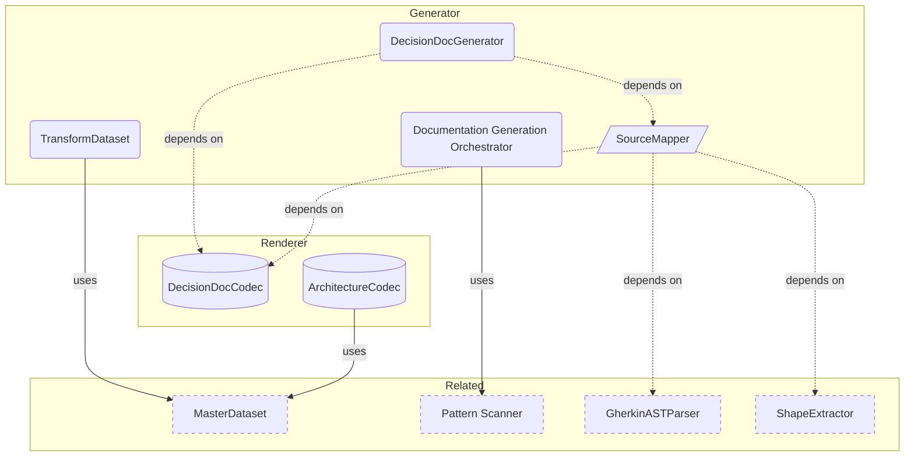

# Generation Overview

**Purpose:** Generation product area overview
**Detail Level:** Full reference

---

**How does code become docs?** The generation pipeline transforms annotated source code into markdown documents. It follows a four-stage architecture: Scanner → Extractor → Transformer → Codec. Codecs are pure functions — given a MasterDataset, they produce a RenderableDocument without side effects. CompositeCodec composes multiple codecs into a single document.

## Key Invariants

- Codec purity: Every codec is a pure function (dataset in, document out). No side effects, no filesystem access. Same input always produces same output
- Config-driven generation: A single `ReferenceDocConfig` produces a complete document. Content sources compose in fixed order: conventions, diagrams, shapes, behaviors
- RenderableDocument IR: Codecs express intent ("this is a table"), the renderer handles syntax ("pipe-delimited markdown"). Switching output format requires only a new renderer

---

## Generation Components

Scoped architecture diagram showing component relationships:



---

## API Types

### RuntimeMasterDataset (interface)

```typescript
/**
 * Runtime MasterDataset with optional workflow
 *
 * Extends the Zod-compatible MasterDataset with workflow reference.
 * LoadedWorkflow contains Maps which aren't JSON-serializable,
 * so it's kept separate from the Zod schema.
 */
```

```typescript
interface RuntimeMasterDataset extends MasterDataset {
  /** Optional workflow configuration (not serializable) */
  readonly workflow?: LoadedWorkflow;
}
```

| Property | Description                                        |
| -------- | -------------------------------------------------- |
| workflow | Optional workflow configuration (not serializable) |

### RawDataset (interface)

```typescript
/**
 * Raw input data for transformation
 */
```

```typescript
interface RawDataset {
  /** Extracted patterns from TypeScript and/or Gherkin sources */
  readonly patterns: readonly ExtractedPattern[];

  /** Tag registry for category lookups */
  readonly tagRegistry: TagRegistry;

  /** Optional workflow configuration for phase names (can be undefined) */
  readonly workflow?: LoadedWorkflow | undefined;

  /** Optional rules for inferring bounded context from file paths */
  readonly contextInferenceRules?: readonly ContextInferenceRule[] | undefined;
}
```

| Property              | Description                                                        |
| --------------------- | ------------------------------------------------------------------ |
| patterns              | Extracted patterns from TypeScript and/or Gherkin sources          |
| tagRegistry           | Tag registry for category lookups                                  |
| workflow              | Optional workflow configuration for phase names (can be undefined) |
| contextInferenceRules | Optional rules for inferring bounded context from file paths       |

### RenderableDocument (type)

```typescript
type RenderableDocument = {
  title: string;
  purpose?: string;
  detailLevel?: string;
  sections: SectionBlock[];
  additionalFiles?: Record<string, RenderableDocument>;
};
```

### SectionBlock (type)

```typescript
type SectionBlock =
  | HeadingBlock
  | ParagraphBlock
  | SeparatorBlock
  | TableBlock
  | ListBlock
  | CodeBlock
  | MermaidBlock
  | CollapsibleBlock
  | LinkOutBlock;
```

### HeadingBlock (type)

```typescript
type HeadingBlock = z.infer<typeof HeadingBlockSchema>;
```

### TableBlock (type)

```typescript
type TableBlock = z.infer<typeof TableBlockSchema>;
```

### ListBlock (type)

```typescript
type ListBlock = z.infer<typeof ListBlockSchema>;
```

### CodeBlock (type)

```typescript
type CodeBlock = z.infer<typeof CodeBlockSchema>;
```

### MermaidBlock (type)

```typescript
type MermaidBlock = z.infer<typeof MermaidBlockSchema>;
```

### CollapsibleBlock (type)

```typescript
type CollapsibleBlock = {
  type: 'collapsible';
  summary: string;
  content: SectionBlock[];
};
```

### transformToMasterDataset (function)

````typescript
/**
 * Transform raw extracted data into a MasterDataset with all pre-computed views.
 *
 * This is a ONE-PASS transformation that computes:
 * - Status-based groupings (completed/active/planned)
 * - Phase-based groupings with counts
 * - Quarter-based groupings for timeline views
 * - Category-based groupings for taxonomy
 * - Source-based views (TypeScript vs Gherkin, roadmap, PRD)
 * - Aggregate statistics (counts, phase count, category count)
 * - Optional relationship index
 *
 * For backward compatibility, this function returns just the dataset.
 * Use `transformToMasterDatasetWithValidation` to get validation summary.
 *
 * @param raw - Raw dataset with patterns, registry, and optional workflow
 * @returns MasterDataset with all pre-computed views
 *
 * @example
 * ```typescript
 * const masterDataset = transformToMasterDataset({
 *   patterns: mergedPatterns,
 *   tagRegistry: registry,
 *   workflow,
 * });
 *
 * // Access pre-computed views
 * const completed = masterDataset.byStatus.completed;
 * const phase3Patterns = masterDataset.byPhase.find(p => p.phaseNumber === 3);
 * const q42024 = masterDataset.byQuarter["Q4-2024"];
 * ```
 */
````

```typescript
function transformToMasterDataset(raw: RawDataset): RuntimeMasterDataset;
```

| Parameter | Type | Description                                                |
| --------- | ---- | ---------------------------------------------------------- |
| raw       |      | Raw dataset with patterns, registry, and optional workflow |

**Returns:** MasterDataset with all pre-computed views

---

## Behavior Specifications

### TableExtraction

[View TableExtraction source](tests/features/generators/table-extraction.feature)

Tables in business rule descriptions should appear exactly once in output.
The extractTables() function extracts tables for proper formatting, and
stripMarkdownTables() removes them from the raw text to prevent duplicates.

<details>
<summary>Tables in rule descriptions render exactly once (2 scenarios)</summary>

#### Tables in rule descriptions render exactly once

**Invariant:** Each markdown table in a rule description appears exactly once in the rendered output, with no residual pipe characters in surrounding text.

**Rationale:** Without deduplication, tables extracted for formatting would also remain in the raw description text, producing duplicate output.

**Verified by:**

- Single table renders once in detailed mode
- Table is extracted and properly formatted

</details>

<details>
<summary>Multiple tables in description each render exactly once (1 scenarios)</summary>

#### Multiple tables in description each render exactly once

**Invariant:** When a rule description contains multiple markdown tables, each table renders as a separate formatted table block with no merging or duplication.

**Verified by:**

- Two tables in description render as two separate tables

</details>

<details>
<summary>stripMarkdownTables removes table syntax from text (3 scenarios)</summary>

#### stripMarkdownTables removes table syntax from text

**Invariant:** stripMarkdownTables removes all pipe-delimited table syntax from input text while preserving all surrounding content unchanged.

**Verified by:**

- Strips single table from text
- Strips multiple tables from text
- Preserves text without tables

</details>

### GeneratorRegistryTesting

[View GeneratorRegistryTesting source](tests/features/generators/registry.feature)

Tests the GeneratorRegistry registration, lookup, and listing capabilities.
The registry manages document generators with name uniqueness constraints.

#### Registry manages generator registration and retrieval

**Invariant:** Each generator name is unique within the registry; duplicate registration is rejected and lookup of unknown names returns undefined.

**Verified by:**

- Register generator with unique name
- Duplicate registration throws error
- Get registered generator
- Get unknown generator returns undefined
- Available returns sorted list

### PrdImplementationSectionTesting

[View PrdImplementationSectionTesting source](tests/features/generators/prd-implementation-section.feature)

Tests the Implementations section rendering in pattern documents.
Verifies that code stubs with @libar-docs-implements tags appear in pattern docs
with working links to the source files.

<details>
<summary>Implementation files appear in pattern docs via @libar-docs-implements (2 scenarios)</summary>

#### Implementation files appear in pattern docs via @libar-docs-implements

**Invariant:** Any TypeScript file with a matching @libar-docs-implements tag must appear in the pattern document's Implementations section with a working file link.

**Rationale:** Implementation discovery relies on tag-based linking — missing entries break traceability between specs and code.

**Verified by:**

- Implementations section renders with file links
- Implementation includes description when available

</details>

<details>
<summary>Multiple implementations are listed alphabetically (1 scenarios)</summary>

#### Multiple implementations are listed alphabetically

**Invariant:** When multiple files implement the same pattern, they must be listed in ascending file path order.

**Rationale:** Deterministic ordering ensures stable document output across regeneration runs.

**Verified by:**

- Multiple implementations sorted by file path

</details>

<details>
<summary>Patterns without implementations omit the section (1 scenarios)</summary>

#### Patterns without implementations omit the section

**Invariant:** The Implementations heading must not appear in pattern documents when no implementing files exist.

**Verified by:**

- No implementations section when none exist

</details>

<details>
<summary>Implementation references use relative file links (1 scenarios)</summary>

#### Implementation references use relative file links

**Invariant:** Implementation file links must be relative paths starting from the patterns output directory.

**Rationale:** Absolute paths break when documentation is viewed from different locations; relative paths ensure portability.

**Verified by:**

- Links are relative from patterns directory

</details>

### PrChangesOptions

[View PrChangesOptions source](tests/features/generators/pr-changes-options.feature)

Tests the PrChangesCodec filtering capabilities for generating PR-scoped
documentation. The codec filters patterns by changed files and/or release
version, supporting combined OR logic when both filters are provided.

#### Orchestrator supports PR changes generation options

**Invariant:** PR changes output includes only patterns matching the changed files list, the release version filter, or both (OR logic when combined).

**Rationale:** PR-scoped documentation must reflect exactly what changed, avoiding noise from unrelated patterns.

**Verified by:**

- PR changes filters to explicit file list
- PR changes filters by release version
- Combined filters use OR logic

### DocumentationOrchestrator

[View DocumentationOrchestrator source](tests/features/generators/orchestrator.feature)

Tests the orchestrator's pattern merging, conflict detection, and generator
coordination capabilities. The orchestrator coordinates the full documentation
generation pipeline: Scanner -> Extractor -> Generators -> File Writer.

#### Orchestrator coordinates full documentation generation pipeline

**Invariant:** Non-overlapping patterns from TypeScript and Gherkin sources must merge into a unified dataset; overlapping pattern names must fail with conflict error.

**Rationale:** Silent merging of conflicting patterns would produce incorrect documentation — fail-fast ensures data integrity across the pipeline.

**Verified by:**

- Non-overlapping patterns merge successfully
- Orchestrator detects pattern name conflicts
- Orchestrator detects pattern name conflicts with status mismatch
- Unknown generator name fails gracefully
- Partial success when some generators are invalid

### CodecBasedGeneratorTesting

[View CodecBasedGeneratorTesting source](tests/features/generators/codec-based.feature)

Tests the CodecBasedGenerator which adapts the RenderableDocument Model (RDM)
codec system to the DocumentGenerator interface. This enables codec-based
document generation to work seamlessly with the existing orchestrator.

#### CodecBasedGenerator adapts codecs to generator interface

**Invariant:** CodecBasedGenerator delegates document generation to the underlying codec and surfaces codec errors through the generator interface.

**Rationale:** The adapter pattern enables codec-based rendering to integrate with the existing orchestrator without modifying either side.

**Verified by:**

- Generator delegates to codec
- Missing MasterDataset returns error
- Codec options are passed through

### BusinessRulesDocumentCodec

[View BusinessRulesDocumentCodec source](tests/features/generators/business-rules-codec.feature)

Tests the BusinessRulesCodec transformation from MasterDataset to RenderableDocument.
Verifies rule extraction, organization by domain/phase, and progressive disclosure.

<details>
<summary>Extracts Rule blocks with Invariant and Rationale (2 scenarios)</summary>

#### Extracts Rule blocks with Invariant and Rationale

**Verified by:**

- Extracts annotated Rule with Invariant and Rationale
- Extracts unannotated Rule without showing not specified

</details>

<details>
<summary>Organizes rules by product area and phase (2 scenarios)</summary>

#### Organizes rules by product area and phase

**Verified by:**

- Groups rules by product area and phase
- Orders rules by phase within domain

</details>

<details>
<summary>Summary mode generates compact output (2 scenarios)</summary>

#### Summary mode generates compact output

**Verified by:**

- Summary mode includes statistics line
- Summary mode excludes detailed sections

</details>

<details>
<summary>Preserves code examples and tables in detailed mode (2 scenarios)</summary>

#### Preserves code examples and tables in detailed mode

**Verified by:**

- Code examples included in detailed mode
- Code examples excluded in standard mode

</details>

<details>
<summary>Generates scenario traceability links (1 scenarios)</summary>

#### Generates scenario traceability links

**Verified by:**

- Verification links include file path

</details>

<details>
<summary>Progressive disclosure generates detail files per product area (3 scenarios)</summary>

#### Progressive disclosure generates detail files per product area

**Verified by:**

- Detail files are generated per product area
- Main document has product area index table with links
- Detail files have back-link to main document

</details>

<details>
<summary>Empty rules show placeholder instead of blank content (2 scenarios)</summary>

#### Empty rules show placeholder instead of blank content

**Verified by:**

- Rule without invariant or description or scenarios shows placeholder
- Rule without invariant but with scenarios shows verified-by instead

</details>

<details>
<summary>Rules always render flat for full visibility (1 scenarios)</summary>

#### Rules always render flat for full visibility

**Verified by:**

- Features with many rules render flat without collapsible blocks

</details>

<details>
<summary>Source file shown as filename text (1 scenarios)</summary>

#### Source file shown as filename text

**Verified by:**

- Source file rendered as plain text not link

</details>

<details>
<summary>Verified-by renders as checkbox list at standard level (2 scenarios)</summary>

#### Verified-by renders as checkbox list at standard level

**Verified by:**

- Rules with scenarios show verified-by checklist
- Duplicate scenario names are deduplicated

</details>

<details>
<summary>Feature names are humanized from camelCase pattern names (2 scenarios)</summary>

#### Feature names are humanized from camelCase pattern names

**Verified by:**

- CamelCase pattern name becomes spaced heading
- Testing suffix is stripped from feature names

</details>

### TestContentBlocks

[View TestContentBlocks source](tests/features/poc/test-content-blocks.feature)

This feature demonstrates what content blocks are captured and rendered
by the PRD generator. Use this as a reference for writing rich specs.

**Overview**

The delivery process supports **rich Markdown** in descriptions:

- Bullet points work
- _Italics_ and **bold** work
- `inline code` works

**Custom Section**

You can create any section you want using bold headers.
This content will appear in the PRD Description section.

#### Business rules appear as a separate section

Rule descriptions provide context for why this business rule exists.
You can include multiple paragraphs here.

    This is a second paragraph explaining edge cases or exceptions.

**Verified by:**

- Scenario with DocString for rich content
- Scenario with DataTable for structured data

#### Multiple rules create multiple Business Rule entries

Each Rule keyword creates a separate entry in the Business Rules section.
This helps organize complex features into logical business domains.

**Verified by:**

- Simple scenario under second rule
- Scenario with examples table

### RuleKeywordPoC

[View RuleKeywordPoC source](tests/features/poc/rule-keyword-poc.feature)

This feature tests whether vitest-cucumber supports the Rule keyword
for organizing scenarios under business rules.

#### Basic arithmetic operations work correctly

The calculator should perform standard math operations
with correct results.

**Verified by:**

- Addition of two positive numbers
- Subtraction of two numbers

#### Division has special constraints

Division by zero must be handled gracefully to prevent
system errors.

**Verified by:**

- Division of two numbers
- Division by zero is prevented

### WarningCollectorTesting

[View WarningCollectorTesting source](tests/features/doc-generation/warning-collector.feature)

The warning collector provides a unified system for capturing, categorizing,
and reporting non-fatal issues during document generation. It replaces
scattered console.warn calls with structured warning handling that integrates
with the Result pattern.

<details>
<summary>Warnings are captured with source context (3 scenarios)</summary>

#### Warnings are captured with source context

**Invariant:** Each captured warning must include the source file path, optional line number, and category for precise identification.

**Rationale:** Context-free warnings are impossible to act on — developers need to know which file and line produced the warning to fix the underlying issue.

**Verified by:**

- Warning includes source file
- Warning includes line number when available
- Warning includes category

</details>

<details>
<summary>Warnings are categorized for filtering and grouping (3 scenarios)</summary>

#### Warnings are categorized for filtering and grouping

**Invariant:** Warnings must support multiple categories and be filterable by both category and source file.

**Rationale:** Large codebases produce many warnings — filtering by category or file lets developers focus on one concern at a time instead of triaging an overwhelming flat list.

**Verified by:**

- Warning categories are supported
- Warnings can be filtered by category
- Warnings can be filtered by source file

</details>

<details>
<summary>Warnings are aggregated across the pipeline (3 scenarios)</summary>

#### Warnings are aggregated across the pipeline

**Invariant:** Warnings from multiple pipeline stages must be collected into a single aggregated view, groupable by source file and summarizable by category counts.

**Rationale:** Pipeline stages run independently — without aggregation, warnings would be scattered across stage outputs, making it impossible to see the full picture.

**Verified by:**

- Warnings from multiple stages are collected
- Warnings are grouped by source file
- Summary counts by category

</details>

<details>
<summary>Warnings integrate with the Result pattern (3 scenarios)</summary>

#### Warnings integrate with the Result pattern

**Invariant:** Warnings must propagate through the Result monad, being preserved in both successful and failed results and across pipeline stages.

**Rationale:** The Result pattern is the standard error-handling mechanism — warnings that don't propagate through Results would be silently lost when functions compose.

**Verified by:**

- Successful result includes warnings
- Failed result includes warnings collected before failure
- Warnings propagate through pipeline

</details>

<details>
<summary>Warnings can be formatted for different outputs (3 scenarios)</summary>

#### Warnings can be formatted for different outputs

**Invariant:** Warnings must be formattable as colored console output, machine-readable JSON, and markdown for documentation, each with appropriate structure.

**Rationale:** Different consumers need different formats — CI pipelines parse JSON, developers read console output, and generated docs embed markdown.

**Verified by:**

- Console format includes color and location
- JSON format is machine-readable
- Markdown format for documentation

</details>

<details>
<summary>Existing console.warn calls are migrated to collector (2 scenarios)</summary>

#### Existing console.warn calls are migrated to collector

**Invariant:** Pipeline components (source mapper, shape extractor) must use the warning collector instead of direct console.warn calls.

**Rationale:** Direct console.warn calls bypass aggregation and filtering — migrating to the collector ensures all warnings are captured, categorized, and available for programmatic consumption.

**Verified by:**

- Source mapper uses warning collector
- Shape extractor uses warning collector

</details>

### ValidationRulesCodecTesting

[View ValidationRulesCodecTesting source](tests/features/doc-generation/validation-rules-codec.feature)

Validates the Validation Rules Codec that transforms MasterDataset into a
RenderableDocument for Process Guard validation rules reference (VALIDATION-RULES.md).

<details>
<summary>Document metadata is correctly set (3 scenarios)</summary>

#### Document metadata is correctly set

**Invariant:** The validation rules document must have the title "Validation Rules", a purpose describing Process Guard, and a detail level reflecting the generateDetailFiles option.

**Rationale:** Accurate metadata ensures the validation rules document is correctly indexed in the generated documentation site.

**Verified by:**

- Document title is Validation Rules
- Document purpose describes Process Guard
- Detail level reflects generateDetailFiles option

</details>

<details>
<summary>All validation rules are documented in a table (2 scenarios)</summary>

#### All validation rules are documented in a table

**Invariant:** All 6 Process Guard validation rules must appear in the rules table with their correct severity levels (error or warning).

**Rationale:** The rules table is the primary reference for understanding what Process Guard enforces — missing rules would leave developers surprised by undocumented validation failures.

**Verified by:**

- All 6 rules appear in table
- Rules have correct severity levels

</details>

<details>
<summary>FSM state diagram is generated from transitions (3 scenarios)</summary>

#### FSM state diagram is generated from transitions

**Invariant:** When includeFSMDiagram is enabled, a Mermaid state diagram showing all 4 FSM states and their transitions must be generated; when disabled, the diagram section must be omitted.

**Rationale:** The state diagram is the most intuitive representation of allowed transitions — it answers "where can I go from here?" faster than a text table.

**Verified by:**

- Mermaid diagram generated when includeFSMDiagram enabled
- Diagram includes all 4 states
- FSM diagram excluded when includeFSMDiagram disabled

</details>

<details>
<summary>Protection level matrix shows status protections (2 scenarios)</summary>

#### Protection level matrix shows status protections

**Invariant:** When includeProtectionMatrix is enabled, a matrix showing all 4 statuses with their protection levels must be generated; when disabled, the section must be omitted.

**Rationale:** The protection matrix explains why certain edits are blocked — without it, developers encounter cryptic "scope-creep" or "completed-protection" errors without understanding the underlying model.

**Verified by:**

- Matrix shows all 4 statuses with protection levels
- Protection matrix excluded when includeProtectionMatrix disabled

</details>

<details>
<summary>CLI usage is documented with options and exit codes (4 scenarios)</summary>

#### CLI usage is documented with options and exit codes

**Invariant:** When includeCLIUsage is enabled, the document must include CLI example code, all 6 options, and exit code documentation; when disabled, the section must be omitted.

**Rationale:** CLI documentation in the validation rules doc provides a single reference for both the rules and how to run them — separate docs would fragment the developer experience.

**Verified by:**

- CLI example code block included
- All 6 CLI options documented
- Exit codes documented
- CLI section excluded when includeCLIUsage disabled

</details>

<details>
<summary>Escape hatches are documented for special cases (2 scenarios)</summary>

#### Escape hatches are documented for special cases

**Invariant:** When includeEscapeHatches is enabled, all 3 escape hatch mechanisms must be documented; when disabled, the section must be omitted.

**Rationale:** Escape hatches prevent the validation system from becoming a blocker — developers need to know how to safely bypass rules for legitimate exceptions.

**Verified by:**

- All 3 escape hatches documented
- Escape hatches section excluded when includeEscapeHatches disabled

</details>

### TaxonomyCodecTesting

[View TaxonomyCodecTesting source](tests/features/doc-generation/taxonomy-codec.feature)

Validates the Taxonomy Codec that transforms MasterDataset into a
RenderableDocument for tag taxonomy reference documentation (TAXONOMY.md).

<details>
<summary>Document metadata is correctly set (3 scenarios)</summary>

#### Document metadata is correctly set

**Invariant:** The taxonomy document must have the title "Taxonomy Reference", a descriptive purpose string, and a detail level reflecting the generateDetailFiles option.

**Rationale:** Document metadata drives the table of contents and navigation in generated doc sites — incorrect metadata produces broken links and misleading titles.

**Verified by:**

- Document title is Taxonomy Reference
- Document purpose describes tag taxonomy
- Detail level reflects generateDetailFiles option

</details>

<details>
<summary>Categories section is generated from TagRegistry (3 scenarios)</summary>

#### Categories section is generated from TagRegistry

**Invariant:** The categories section must render all categories from the configured TagRegistry as a table, with optional linkOut to detail files when progressive disclosure is enabled.

**Rationale:** Categories are the primary navigation structure in the taxonomy — missing categories leave developers unable to find the correct annotation tags.

**Verified by:**

- Categories section is included in output
- Category table has correct columns
- LinkOut to detail file when generateDetailFiles enabled

</details>

<details>
<summary>Metadata tags can be grouped by domain (2 scenarios)</summary>

#### Metadata tags can be grouped by domain

**Invariant:** When groupByDomain is enabled, metadata tags must be organized into domain-specific subsections; when disabled, a single flat table must be rendered.

**Rationale:** Domain grouping improves scannability for large tag sets (21 categories in ddd-es-cqrs) while flat mode is simpler for small presets (3 categories in generic).

**Verified by:**

- With groupByDomain enabled tags are grouped into subsections
- With groupByDomain disabled single table rendered

</details>

<details>
<summary>Tags are classified into domains by hardcoded mapping (5 scenarios)</summary>

#### Tags are classified into domains by hardcoded mapping

**Invariant:** Tags must be classified into domains (Core, Relationship, Timeline, etc.) using a hardcoded mapping, with unrecognized tags placed in an "Other Tags" group.

**Rationale:** Domain classification is stable across releases — hardcoding prevents miscategorization from user config errors while the "Other" fallback handles future tag additions gracefully.

**Verified by:**

- Core tags correctly classified
- Relationship tags correctly classified
- Timeline tags correctly classified
- ADR prefix matching works
- Unknown tags go to Other Tags group

</details>

<details>
<summary>Optional sections can be disabled via codec options (3 scenarios)</summary>

#### Optional sections can be disabled via codec options

**Invariant:** Format Types, Presets, and Architecture sections must each be independently disableable via their respective codec option flags.

**Rationale:** Not all projects need all sections — disabling irrelevant sections reduces generated document size and prevents confusion from inapplicable content.

**Verified by:**

- includeFormatTypes disabled excludes Format Types section
- includePresets disabled excludes Presets section
- includeArchDiagram disabled excludes Architecture section

</details>

<details>
<summary>Detail files are generated for progressive disclosure (3 scenarios)</summary>

#### Detail files are generated for progressive disclosure

**Invariant:** When generateDetailFiles is enabled, the codec must produce additional detail files (one per domain group) alongside the main taxonomy document; when disabled, no additional files are created.

**Rationale:** Progressive disclosure keeps the main document scannable while providing deep-dive content in linked pages — monolithic documents become unwieldy for large tag sets.

**Verified by:**

- generateDetailFiles creates 3 additional files
- Detail files have correct paths
- generateDetailFiles disabled creates no additional files

</details>

<details>
<summary>Format types are documented with descriptions and examples (1 scenarios)</summary>

#### Format types are documented with descriptions and examples

**Invariant:** All 6 format types must be documented with descriptions and usage examples in the generated taxonomy.

**Rationale:** Format types control how tag values are parsed — undocumented formats force developers to guess the correct syntax, leading to annotation errors.

**Verified by:**

- All 6 format types are documented

</details>

### SourceMappingValidatorTesting

[View SourceMappingValidatorTesting source](tests/features/doc-generation/source-mapping-validator.feature)

**Context:** Source mappings reference files that may not exist, use invalid
extraction methods, or have incompatible method-file combinations. Without
pre-flight validation, extraction fails late with confusing errors.

**Approach:** Validate file existence, extraction method validity, and format
correctness before extraction begins. Collect all errors rather than stopping
at the first one, enabling users to fix all issues in a single iteration.

<details>
<summary>Source files must exist and be readable (5 scenarios)</summary>

#### Source files must exist and be readable

**Invariant:** All source file paths in mappings must resolve to existing, readable files.

**Rationale:** Prevents extraction failures and provides clear error messages upfront.

**Verified by:**

- Existing file passes validation
- Missing file produces error with path
- Directory instead of file produces error
- THIS DECISION skips file validation
- THIS DECISION with rule reference skips file validation
- @acceptance-criteria scenarios below.

</details>

<details>
<summary>Extraction methods must be valid and supported (4 scenarios)</summary>

#### Extraction methods must be valid and supported

**Invariant:** Extraction methods must match a known method from the supported set.

**Rationale:** Invalid methods cannot extract content; suggest valid alternatives.

**Verified by:**

- Valid extraction methods pass validation
- Unknown method produces error with suggestions
- Empty method produces error
- Method aliases are normalized
- @acceptance-criteria scenarios below.

</details>

<details>
<summary>Extraction methods must be compatible with file types (4 scenarios)</summary>

#### Extraction methods must be compatible with file types

**Invariant:** Method-file combinations must be compatible (e.g., TypeScript methods for .ts files).

**Rationale:** Incompatible combinations fail at extraction; catch early with clear guidance.

**Verified by:**

- TypeScript method on feature file produces error
- Gherkin method on TypeScript file produces error
- Compatible method-file combination passes
- Self-reference method on actual file produces error
- @acceptance-criteria scenarios below.

</details>

<details>
<summary>Source mapping tables must have required columns (3 scenarios)</summary>

#### Source mapping tables must have required columns

**Invariant:** Tables must contain Section, Source File, and Extraction Method columns.

**Rationale:** Missing columns prevent extraction; alternative column names are mapped.

**Verified by:**

- Missing Section column produces error
- Missing Source File column produces error
- Alternative column names are accepted
- @acceptance-criteria scenarios below.

</details>

<details>
<summary>All validation errors are collected and returned together (2 scenarios)</summary>

#### All validation errors are collected and returned together

**Invariant:** Validation collects all errors before returning, not just the first.

**Rationale:** Enables users to fix all issues in a single iteration.

**Verified by:**

- Multiple errors are aggregated
- Warnings are collected alongside errors
- @acceptance-criteria scenarios below.

</details>

### SourceMapperTesting

[View SourceMapperTesting source](tests/features/doc-generation/source-mapper.feature)

The Source Mapper aggregates content from multiple source files based on
source mapping tables parsed from decision documents. It dispatches extraction
to appropriate handlers based on extraction method and preserves ordering.

<details>
<summary>Extraction methods dispatch to correct handlers (3 scenarios)</summary>

#### Extraction methods dispatch to correct handlers

**Invariant:** Each extraction method type (self-reference, TypeScript, Gherkin) must dispatch to the correct specialized handler based on the source file type or marker.

**Rationale:** Wrong dispatch would apply TypeScript extraction logic to Gherkin files (or vice versa), producing garbled or empty results.

**Verified by:**

- Dispatch to decision extraction for THIS DECISION
- Dispatch to TypeScript extractor for .ts files
- Dispatch to behavior spec extractor for .feature files

</details>

<details>
<summary>Self-references extract from current decision document (3 scenarios)</summary>

#### Self-references extract from current decision document

**Invariant:** THIS DECISION self-references must extract content from the current decision document using rule descriptions, DocStrings, or full document access.

**Rationale:** Self-references avoid circular file reads — the document content is already in memory, so extraction is a lookup operation rather than a file I/O operation.

**Verified by:**

- Extract from THIS DECISION using rule description
- Extract DocStrings from THIS DECISION
- Extract full document from THIS DECISION

</details>

<details>
<summary>Multiple sources are aggregated in mapping order (2 scenarios)</summary>

#### Multiple sources are aggregated in mapping order

**Invariant:** When multiple source mappings target the same section, their extracted content must be aggregated in the order defined by the mapping table.

**Rationale:** Mapping order is intentional — authors structure their source tables to produce a logical reading flow, and reordering would break the narrative.

**Verified by:**

- Aggregate from multiple sources
- Ordering is preserved from mapping table

</details>

<details>
<summary>Missing files produce warnings without failing (3 scenarios)</summary>

#### Missing files produce warnings without failing

**Invariant:** When a referenced source file does not exist, the mapper must produce a warning and continue processing remaining mappings rather than failing entirely.

**Rationale:** Partial extraction is more useful than total failure — a decision document with most sections populated and one warning is better than no document at all.

**Verified by:**

- Missing source file produces warning
- Partial extraction when some files missing
- Validation checks all files before extraction

</details>

<details>
<summary>Empty extraction results produce info warnings (2 scenarios)</summary>

#### Empty extraction results produce info warnings

**Invariant:** When extraction succeeds but produces empty results (no matching shapes, no matching rules), an informational warning must be generated.

**Rationale:** Empty results often indicate stale source mappings pointing to renamed or removed content — warnings surface these issues before they reach generated output.

**Verified by:**

- Empty shapes extraction produces info warning
- No matching rules produces info warning

</details>

<details>
<summary>Extraction methods are normalized for dispatch (2 scenarios)</summary>

#### Extraction methods are normalized for dispatch

**Invariant:** Extraction method strings must be normalized to canonical forms before dispatch, with unrecognized methods producing a warning.

**Rationale:** Users write extraction methods in natural language — normalization bridges the gap between human-readable table entries and programmatic dispatch keys.

**Verified by:**

- Normalize various extraction method formats
- Unknown extraction method produces warning

</details>

### RobustnessIntegration

[View RobustnessIntegration source](tests/features/doc-generation/robustness-integration.feature)

**Context:** Document generation pipeline needs validation, deduplication, and
warning collection to work together correctly for production use.

**Approach:** Integration tests verify the full pipeline with all robustness
features enabled, ensuring validation runs first, deduplication merges content,
and warnings are collected across stages.

<details>
<summary>Validation runs before extraction in the pipeline (3 scenarios)</summary>

#### Validation runs before extraction in the pipeline

**Invariant:** Validation must complete and pass before extraction begins.

**Rationale:** Prevents wasted extraction work and provides clear fail-fast behavior.

**Verified by:**

- Valid decision document generates successfully
- Invalid mapping halts pipeline before extraction
- Multiple validation errors are reported together
- @acceptance-criteria scenarios below.

  The validation layer must run first and halt the pipeline if errors
  are found

- preventing wasted extraction work.

</details>

<details>
<summary>Deduplication runs after extraction before assembly (2 scenarios)</summary>

#### Deduplication runs after extraction before assembly

**Invariant:** Deduplication processes all extracted content before document assembly.

**Rationale:** All sources must be extracted to identify cross-source duplicates.

**Verified by:**

- Duplicate content is removed from final output
- Non-duplicate sections are preserved
- @acceptance-criteria scenarios below.

  Content from all sources is extracted first

- then deduplicated
- then assembled into the final document.

</details>

<details>
<summary>Warnings from all stages are collected and reported (2 scenarios)</summary>

#### Warnings from all stages are collected and reported

**Invariant:** Warnings from all pipeline stages are aggregated in the result.

**Rationale:** Users need visibility into non-fatal issues without blocking generation.

**Verified by:**

- Warnings are collected across pipeline stages
- Warnings do not prevent successful generation
- @acceptance-criteria scenarios below.

  Non-fatal issues from validation

- extraction
- and deduplication are
  collected and included in the result.

</details>

<details>
<summary>Pipeline provides actionable error messages (3 scenarios)</summary>

#### Pipeline provides actionable error messages

**Invariant:** Error messages include context and fix suggestions.

**Rationale:** Users should fix issues in one iteration without guessing.

**Verified by:**

- File not found error includes fix suggestion
- Invalid method error includes valid alternatives
- Extraction error includes source context
- @acceptance-criteria scenarios below.

  Errors include enough context for users to understand and fix the issue.

</details>

<details>
<summary>Existing decision documents continue to work (2 scenarios)</summary>

#### Existing decision documents continue to work

**Invariant:** Valid existing decision documents generate without new errors.

**Rationale:** Robustness improvements must be backward compatible.

**Verified by:**

- PoC decision document still generates
- Process Guard decision document still generates
- @acceptance-criteria scenarios below.

  The robustness improvements must not break existing valid decision
  documents that worked with the PoC.

</details>

### PocIntegration

[View PocIntegration source](tests/features/doc-generation/poc-integration.feature)

End-to-end integration tests that exercise the full documentation generation
pipeline using the actual POC decision document and real source files.

This validates that all 11 source mappings from the POC decision document
work correctly with real project files.

<details>
<summary>POC decision document is parsed correctly (2 scenarios)</summary>

#### POC decision document is parsed correctly

**Invariant:** The real POC decision document (Process Guard) must be parseable by the codec, extracting all source mappings with their extraction types.

**Rationale:** Integration testing against the actual POC document validates that the codec works with real-world content, not just synthetic test data.

**Verified by:**

- Load actual POC decision document
- Source mappings include all extraction types

</details>

<details>
<summary>Self-references extract content from POC decision (3 scenarios)</summary>

#### Self-references extract content from POC decision

**Invariant:** THIS DECISION self-references in the POC document must successfully extract Context rules, Decision rules, and DocStrings from the document itself.

**Rationale:** Self-references are the most common extraction type in decision docs — they must work correctly for the POC to demonstrate the end-to-end pipeline.

**Verified by:**

- Extract Context rule from THIS DECISION
- Extract Decision rule from THIS DECISION
- Extract DocStrings from THIS DECISION

</details>

<details>
<summary>TypeScript shapes are extracted from real files (3 scenarios)</summary>

#### TypeScript shapes are extracted from real files

**Invariant:** The source mapper must successfully extract type shapes and patterns from real TypeScript source files referenced in the POC document.

**Rationale:** TypeScript extraction is the primary mechanism for pulling implementation details into decision docs — it must work with actual project files.

**Verified by:**

- Extract shapes from types.ts
- Extract shapes from decider.ts
- Extract createViolation patterns from decider.ts

</details>

<details>
<summary>Behavior spec content is extracted correctly (2 scenarios)</summary>

#### Behavior spec content is extracted correctly

**Invariant:** The source mapper must successfully extract Rule blocks and ScenarioOutline Examples from real Gherkin feature files referenced in the POC document.

**Rationale:** Behavior spec extraction bridges decision documents to executable specifications — incorrect extraction would misrepresent the verified behavior.

**Verified by:**

- Extract Rule blocks from process-guard.feature
- Extract Scenario Outline Examples from process-guard-linter.feature

</details>

<details>
<summary>JSDoc sections are extracted from CLI files (1 scenarios)</summary>

#### JSDoc sections are extracted from CLI files

**Invariant:** The source mapper must successfully extract JSDoc comment sections from real TypeScript CLI files referenced in the POC document.

**Rationale:** CLI documentation often lives in JSDoc comments — extracting them into decision docs avoids duplicating CLI usage information manually.

**Verified by:**

- Extract JSDoc from lint-process.ts

</details>

<details>
<summary>All source mappings execute successfully (1 scenarios)</summary>

#### All source mappings execute successfully

**Invariant:** All source mappings defined in the POC decision document must execute without errors, producing non-empty extraction results.

**Rationale:** End-to-end execution validates that all extraction types work with real files — a single failing mapping would produce incomplete decision documentation.

**Verified by:**

- Execute all 11 source mappings from POC

</details>

<details>
<summary>Compact output generates correctly (2 scenarios)</summary>

#### Compact output generates correctly

**Invariant:** The compact output for the POC document must generate successfully and contain all essential sections defined by the compact format.

**Rationale:** Compact output is the AI-facing artifact — verifying it against the real POC ensures the format serves its purpose of providing concise decision context.

**Verified by:**

- Generate compact output from POC
- Compact output contains essential sections

</details>

<details>
<summary>Detailed output generates correctly (2 scenarios)</summary>

#### Detailed output generates correctly

**Invariant:** The detailed output for the POC document must generate successfully and contain all sections including full content from source mappings.

**Rationale:** Detailed output is the human-facing artifact — verifying it against the real POC ensures no content is lost in the generation pipeline.

**Verified by:**

- Generate detailed output from POC
- Detailed output contains full content

</details>

<details>
<summary>Generated output matches quality expectations (2 scenarios)</summary>

#### Generated output matches quality expectations

**Invariant:** The generated output structure must match the expected target format, with complete validation rules and properly structured sections.

**Rationale:** Quality assertions catch regressions in output formatting — structural drift in generated documents would degrade their usefulness as references.

**Verified by:**

- Compact output matches target structure
- Validation rules are complete in output

</details>

### DecisionDocGeneratorTesting

[View DecisionDocGeneratorTesting source](tests/features/doc-generation/decision-doc-generator.feature)

The Decision Doc Generator orchestrates the full documentation generation
pipeline from decision documents (ADR/PDR in .feature format):

1. Decision parsing - Extract source mappings, rules, DocStrings
2. Source mapping - Aggregate content from TypeScript, Gherkin, decision sources
3. Content assembly - Build RenderableDocument from aggregated sections
4. Multi-level output - Generate compact and detailed versions

<details>
<summary>Output paths are determined from pattern metadata (3 scenarios)</summary>

#### Output paths are determined from pattern metadata

**Invariant:** Output file paths must be derived from pattern metadata using kebab-case conversion of the pattern name, with configurable section prefixes.

**Rationale:** Consistent path derivation ensures generated files are predictable and linkable — ad-hoc paths would break cross-document references.

**Verified by:**

- Default output paths for pattern
- Custom section for compact output
- CamelCase pattern converted to kebab-case

</details>

<details>
<summary>Compact output includes only essential content (3 scenarios)</summary>

#### Compact output includes only essential content

**Invariant:** Compact output mode must include only essential decision content (type shapes, key constraints) while excluding full descriptions and verbose sections.

**Rationale:** Compact output is designed for AI context windows where token budget is limited — including full descriptions would negate the space savings.

**Verified by:**

- Compact output excludes full descriptions
- Compact output includes type shapes
- Compact output handles empty content

</details>

<details>
<summary>Detailed output includes full content (3 scenarios)</summary>

#### Detailed output includes full content

**Invariant:** Detailed output mode must include all decision content including full descriptions, consequences, and DocStrings rendered as code blocks.

**Rationale:** Detailed output serves as the complete human reference — omitting any section would force readers to consult source files for the full picture.

**Verified by:**

- Detailed output includes all sections
- Detailed output includes consequences
- Detailed output includes DocStrings as code blocks

</details>

<details>
<summary>Multi-level generation produces both outputs (2 scenarios)</summary>

#### Multi-level generation produces both outputs

**Invariant:** The generator must produce both compact and detailed output files from a single generation run, using the pattern name or patternName tag as the identifier.

**Rationale:** Both output levels serve different audiences (AI vs human) — generating them together ensures consistency and eliminates the risk of one becoming stale.

**Verified by:**

- Generate both compact and detailed outputs
- Pattern name falls back to pattern.name

</details>

<details>
<summary>Generator is registered with the registry (3 scenarios)</summary>

#### Generator is registered with the registry

**Invariant:** The decision document generator must be registered with the generator registry under a canonical name and must filter input patterns to only those with source mappings.

**Rationale:** Registry registration enables discovery via --list-generators — filtering to source-mapped patterns prevents empty output for patterns without decision metadata.

**Verified by:**

- Generator is registered with correct name
- Generator filters patterns by source mapping presence
- Generator processes patterns with source mappings

</details>

<details>
<summary>Source mappings are executed during generation (2 scenarios)</summary>

#### Source mappings are executed during generation

**Invariant:** Source mapping tables must be executed during generation to extract content from referenced files, with missing files reported as validation errors.

**Rationale:** Source mappings are the bridge between decision specs and implementation — unexecuted mappings produce empty sections, while silent missing-file errors hide broken references.

**Verified by:**

- Source mappings are executed
- Missing source files are reported as validation errors

</details>

### DecisionDocCodecTesting

[View DecisionDocCodecTesting source](tests/features/doc-generation/decision-doc-codec.feature)

Validates the Decision Doc Codec that parses decision documents (ADR/PDR
in .feature format) and extracts content for documentation generation.

<details>
<summary>Rule blocks are partitioned by semantic prefix (2 scenarios)</summary>

#### Rule blocks are partitioned by semantic prefix

**Invariant:** Decision document rules must be partitioned into ADR sections based on their semantic prefix (e.g., "Decision:", "Context:", "Consequence:"), with non-standard rules placed in an "other" category.

**Rationale:** Semantic partitioning produces structured ADR output that follows the standard ADR format — unpartitioned rules would generate a flat, unnavigable document.

**Verified by:**

- Partition rules into ADR sections
- Non-standard rules go to other category

</details>

<details>
<summary>DocStrings are extracted with language tags (3 scenarios)</summary>

#### DocStrings are extracted with language tags

**Invariant:** DocStrings within rule descriptions must be extracted preserving their language tag (e.g., typescript, bash), defaulting to "text" when no language is specified.

**Rationale:** Language tags enable syntax highlighting in generated markdown code blocks — losing the tag produces unformatted code that is harder to read.

**Verified by:**

- Extract single DocString
- Extract multiple DocStrings
- DocString without language defaults to text

</details>

<details>
<summary>Source mapping tables are parsed from rule descriptions (2 scenarios)</summary>

#### Source mapping tables are parsed from rule descriptions

**Invariant:** Markdown tables in rule descriptions with source mapping columns must be parsed into structured data, returning empty arrays when no table is present.

**Rationale:** Source mapping tables drive the extraction pipeline — they define which files to read and what content to extract for each decision section.

**Verified by:**

- Parse basic source mapping table
- No source mapping returns empty

</details>

<details>
<summary>Self-reference markers are correctly detected (5 scenarios)</summary>

#### Self-reference markers are correctly detected

**Invariant:** The "THIS DECISION" marker must be recognized as a self-reference to the current decision document, with optional rule name qualifiers parsed correctly.

**Rationale:** Self-references enable decisions to extract content from their own rules — misdetecting them would trigger file-system lookups for a non-existent "THIS DECISION" file.

**Verified by:**

- Detect THIS DECISION marker
- Detect THIS DECISION with Rule
- Regular file path is not self-reference
- Parse self-reference types
- Parse self-reference with rule name

</details>

<details>
<summary>Extraction methods are normalized to known types (3 scenarios)</summary>

#### Extraction methods are normalized to known types

**Invariant:** Extraction method strings from source mapping tables must be normalized to canonical method names for dispatcher routing.

**Rationale:** Users may write extraction methods in various formats (e.g., "Decision rule description", "extract-shapes") — normalization ensures consistent dispatch regardless of formatting.

**Verified by:**

- Normalize Decision rule description
- Normalize extract-shapes
- Normalize unknown method

</details>

<details>
<summary>Complete decision documents are parsed with all content (1 scenarios)</summary>

#### Complete decision documents are parsed with all content

**Invariant:** A complete decision document must be parseable into its constituent parts including rules, DocStrings, source mappings, and self-references in a single parse operation.

**Rationale:** Complete parsing validates that all codec features compose correctly — partial parsing could miss interactions between features.

**Verified by:**

- Parse complete decision document

</details>

<details>
<summary>Rules can be found by name with partial matching (3 scenarios)</summary>

#### Rules can be found by name with partial matching

**Invariant:** Rules must be findable by exact name match or partial (substring) name match, returning undefined when no match exists.

**Rationale:** Partial matching supports flexible cross-references between decisions — requiring exact matches would make references brittle to minor naming changes.

**Verified by:**

- Find rule by exact name
- Find rule by partial name
- Rule not found returns undefined

</details>

### ContentDeduplication

[View ContentDeduplication source](tests/features/doc-generation/content-deduplication.feature)

**Context:** Multiple sources may extract identical content, leading to
duplicate sections in generated documentation.

**Approach:** Use SHA-256 fingerprinting to detect duplicates, merge based
on source priority, and preserve original section order after deduplication.

<details>
<summary>Duplicate detection uses content fingerprinting (4 scenarios)</summary>

#### Duplicate detection uses content fingerprinting

**Invariant:** Content with identical normalized text must produce identical fingerprints.

**Rationale:** Fingerprinting enables efficient duplicate detection without full text comparison.

**Verified by:**

- Identical content produces same fingerprint
- Whitespace differences are normalized
- Different content produces different fingerprints
- Similar headers with different content are preserved
- @acceptance-criteria scenarios below.

  Content fingerprints are computed from normalized text

- ignoring whitespace
  differences and minor formatting variations.

</details>

<details>
<summary>Duplicates are merged based on source priority (3 scenarios)</summary>

#### Duplicates are merged based on source priority

**Invariant:** Higher-priority sources take precedence when merging duplicate content.

**Rationale:** TypeScript sources have richer JSDoc; feature files provide behavioral context.

**Verified by:**

- TypeScript source takes priority over feature file
- Richer content takes priority when sources equal
- Source attribution is added to merged content
- @acceptance-criteria scenarios below.

  The merge strategy determines which content to keep based on source file
  priority and content richness once duplicates are detected.

</details>

<details>
<summary>Section order is preserved after deduplication (2 scenarios)</summary>

#### Section order is preserved after deduplication

**Invariant:** Section order matches the source mapping table order after deduplication.

**Rationale:** Predictable ordering ensures consistent documentation structure.

**Verified by:**

- Original order maintained after dedup
- Empty sections after dedup are removed
- @acceptance-criteria scenarios below.

  The order of sections in the source mapping table is preserved even
  after duplicates are removed.

</details>

<details>
<summary>Deduplicator integrates with source mapper pipeline (1 scenarios)</summary>

#### Deduplicator integrates with source mapper pipeline

**Invariant:** Deduplication runs after extraction and before document assembly.

**Rationale:** All content must be extracted before duplicates can be identified.

**Verified by:**

- Deduplication happens in pipeline
- @acceptance-criteria scenarios below.

  The deduplicator is called after all extractions complete but before
  the RenderableDocument is assembled.

</details>

### TransformDatasetTesting

[View TransformDatasetTesting source](tests/features/behavior/transform-dataset.feature)

The transformToMasterDataset function transforms raw extracted patterns
into a MasterDataset with all pre-computed views in a single pass.
This is the core of the unified transformation pipeline.

**Problem:**

- Generators need multiple views of the same pattern data
- Computing views lazily leads to O(n\*v) complexity
- Views must be consistent with each other

**Solution:**

- Single-pass transformation computes all views in O(n)
- All views are immutable and pre-computed
- MasterDataset is the source of truth for all generators

<details>
<summary>Empty dataset produces valid zero-state views (1 scenarios)</summary>

#### Empty dataset produces valid zero-state views

**Invariant:** An empty input produces a MasterDataset with all counts at zero and no groupings.

**Verified by:**

- Transform empty dataset

</details>

<details>
<summary>Status and phase grouping creates navigable views (6 scenarios)</summary>

#### Status and phase grouping creates navigable views

**Invariant:** Patterns are grouped by canonical status and sorted by phase number, with per-phase status counts computed.

**Rationale:** Generators need O(1) access to status-filtered and phase-ordered views without recomputing on each render pass.

**Verified by:**

- Group patterns by status
- Normalize status variants to canonical values
- Group patterns by phase
- Sort phases by phase number
- Compute per-phase status counts
- Patterns without phase are not in byPhase

</details>

<details>
<summary>Quarter and category grouping organizes by timeline and domain (3 scenarios)</summary>

#### Quarter and category grouping organizes by timeline and domain

**Invariant:** Patterns are grouped by quarter and category, with only patterns bearing the relevant metadata included in each view.

**Verified by:**

- Group patterns by quarter
- Patterns without quarter are not in byQuarter
- Group patterns by category

</details>

<details>
<summary>Source grouping separates TypeScript and Gherkin origins (2 scenarios)</summary>

#### Source grouping separates TypeScript and Gherkin origins

**Invariant:** Patterns are partitioned by source file type, and patterns with phase metadata appear in the roadmap view.

**Verified by:**

- Group patterns by source file type
- Patterns with phase are also in roadmap view

</details>

<details>
<summary>Relationship index builds bidirectional dependency graph (5 scenarios)</summary>

#### Relationship index builds bidirectional dependency graph

**Invariant:** The relationship index contains forward and reverse lookups, with reverse lookups merged and deduplicated against explicit annotations.

**Rationale:** Bidirectional navigation is required for dependency tree queries without O(n) scans per lookup.

**Verified by:**

- Build relationship index from patterns
- Build relationship index with all relationship types
- Reverse lookup computes enables from dependsOn
- Reverse lookup computes usedBy from uses
- Reverse lookup merges with explicit annotations without duplicates

</details>

<details>
<summary>Completion tracking computes project progress (2 scenarios)</summary>

#### Completion tracking computes project progress

**Invariant:** Completion percentage is rounded to the nearest integer, and fully-completed requires all patterns in completed status with a non-zero total.

**Verified by:**

- Calculate completion percentage
- Check if fully completed

</details>

<details>
<summary>Workflow integration conditionally includes delivery process data (2 scenarios)</summary>

#### Workflow integration conditionally includes delivery process data

**Invariant:** The workflow is included in the MasterDataset only when provided, and phase names are resolved from the workflow configuration.

**Verified by:**

- Include workflow in result when provided
- Result omits workflow when not provided

</details>

### RichContentHelpersTesting

[View RichContentHelpersTesting source](tests/features/behavior/rich-content-helpers.feature)

As a document codec author
I need helpers to render Gherkin rich content
So that DataTables, DocStrings, and scenarios render consistently across codecs

The helpers handle edge cases like:

- Unclosed DocStrings (fallback to plain paragraph)
- Windows CRLF line endings (normalized to LF)
- Empty inputs (graceful handling)
- Missing table cells (empty string fallback)

<details>
<summary>DocString parsing handles edge cases (6 scenarios)</summary>

#### DocString parsing handles edge cases

**Invariant:** DocString parsing must gracefully handle empty input, missing language hints, unclosed delimiters, and non-LF line endings without throwing errors.

**Verified by:**

- Empty description returns empty array
- Description with no DocStrings returns single paragraph
- Single DocString parses correctly
- DocString without language hint uses text
- Unclosed DocString returns plain paragraph fallback
- Windows CRLF line endings are normalized

</details>

<details>
<summary>DataTable rendering produces valid markdown (3 scenarios)</summary>

#### DataTable rendering produces valid markdown

**Invariant:** DataTable rendering must produce a well-formed table block for any number of rows, substituting empty strings for missing cell values.

**Verified by:**

- Single row DataTable renders correctly
- Multi-row DataTable renders correctly
- Missing cell values become empty strings

</details>

<details>
<summary>Scenario content rendering respects options (3 scenarios)</summary>

#### Scenario content rendering respects options

**Invariant:** Scenario rendering must honor the includeSteps option, producing step lists only when enabled, and must include embedded DataTables when present.

**Verified by:**

- Render scenario with steps
- Skip steps when includeSteps is false
- Render scenario with DataTable in step

</details>

<details>
<summary>Business rule rendering handles descriptions (3 scenarios)</summary>

#### Business rule rendering handles descriptions

**Invariant:** Business rule rendering must always include the rule name as a bold paragraph, and must parse descriptions for embedded DocStrings when present.

**Verified by:**

- Rule with simple description
- Rule with no description
- Rule with embedded DocString in description

</details>

<details>
<summary>DocString content is dedented when parsed (4 scenarios)</summary>

#### DocString content is dedented when parsed

**Invariant:** DocString code blocks must be dedented to remove common leading whitespace while preserving internal relative indentation, empty lines, and trimming trailing whitespace from each line.

**Verified by:**

- Code block preserves internal relative indentation
- Empty lines in code block are preserved
- Trailing whitespace is trimmed from each line
- Code with mixed indentation is preserved

</details>

### UniversalMarkdownRenderer

[View UniversalMarkdownRenderer source](tests/features/behavior/render.feature)

The universal renderer converts RenderableDocument to markdown.
It is a "dumb printer" with no domain knowledge - all logic lives in codecs.

### RemainingWorkSummaryAccuracy

[View RemainingWorkSummaryAccuracy source](tests/features/behavior/remaining-work-totals.feature)

Summary totals in REMAINING-WORK.md must match the sum of phase table rows.
The backlog calculation must correctly identify patterns without phases
using pattern.id (which is always defined) rather than patternName.

<details>
<summary>Summary totals equal sum of phase table rows (2 scenarios)</summary>

#### Summary totals equal sum of phase table rows

**Invariant:** The summary Active and Total Remaining counts must exactly equal the sum of the corresponding counts across all phase table rows.

**Rationale:** A mismatch between summary and phase-level totals indicates patterns are being double-counted or dropped.

**Verified by:**

- Summary matches phase table with all patterns having phases
- Summary includes completed patterns correctly

</details>

<details>
<summary>Patterns without phases appear in Backlog row (2 scenarios)</summary>

#### Patterns without phases appear in Backlog row

**Invariant:** Patterns that have no assigned phase must be grouped into a "Backlog" row in the phase table rather than being omitted.

**Rationale:** Unphased patterns are still remaining work; omitting them would undercount the total.

**Verified by:**

- Summary includes backlog patterns without phase
- All patterns in backlog when none have phases

</details>

<details>
<summary>Patterns without patternName are counted using id (2 scenarios)</summary>

#### Patterns without patternName are counted using id

**Invariant:** Pattern counting must use pattern.id as the identifier, never patternName, so that patterns with undefined names are neither double-counted nor omitted.

**Rationale:** patternName is optional; relying on it for counting would miss unnamed patterns entirely.

**Verified by:**

- Patterns with undefined patternName counted correctly
- Mixed patterns with and without patternName

</details>

<details>
<summary>All phases with incomplete patterns are shown (2 scenarios)</summary>

#### All phases with incomplete patterns are shown

**Invariant:** The phase table must include every phase that contains at least one incomplete pattern, and phases with only completed patterns must be excluded.

**Verified by:**

- Multiple phases shown in order
- Completed phases not shown in remaining work

</details>

### RemainingWorkEnhancement

[View RemainingWorkEnhancement source](tests/features/behavior/remaining-work-enhancement.feature)

Enhanced REMAINING-WORK.md generation with priority-based sorting,
quarter grouping, and progressive disclosure for better session planning.

**Problem:**

- Flat phase lists make it hard to identify what to work on next
- No visibility into relative urgency or importance of phases
- Large backlogs overwhelm planners with too much information at once
- Quarter-based planning requires manual grouping of phases
- Effort estimates are not factored into prioritization decisions

**Solution:**

- Priority-based sorting surfaces critical/high-priority work first
- Quarter grouping organizes planned work into time-based buckets
- Progressive disclosure shows summary with link to full backlog details
- Effort parsing enables sorting by estimated work duration
- Visual priority icons provide at-a-glance urgency indicators

### PrChangesGeneration

[View PrChangesGeneration source](tests/features/behavior/pr-changes-generation.feature)

The delivery process generates PR-CHANGES.md from active or completed phases,
formatted for PR descriptions, code reviews, and release notes.

**Problem:**

- PR descriptions are manually written, often incomplete or inconsistent
- Reviewers lack structured view of what changed and why
- Deliverable completion status scattered across feature files
- Dependency relationships between phases hidden from reviewers

**Solution:**

- Auto-generate PR-CHANGES.md with summary statistics and phase-grouped changes
- Include both active and completed phases (roadmap phases excluded)
- Filter by release version (releaseFilter) to show matching deliverables
- Surface deliverables inline with each pattern
- Include review checklist with standard code quality items
- Include dependency section showing what patterns enable or require

### PatternsCodecTesting

[View PatternsCodecTesting source](tests/features/behavior/patterns-codec.feature)

The PatternsDocumentCodec transforms MasterDataset into a RenderableDocument
for generating PATTERNS.md and category detail files.

**Problem:**

- Need to generate a comprehensive pattern registry from extracted patterns
- Output should include progress tracking, navigation, and categorization

**Solution:**

- Codec transforms MasterDataset → RenderableDocument in a single decode call
- Generates main document with optional category detail files

<details>
<summary>Document structure includes progress tracking and category navigation (3 scenarios)</summary>

#### Document structure includes progress tracking and category navigation

**Invariant:** Every decoded document must contain a title, purpose, Progress section with status counts, and category navigation regardless of dataset size.

**Rationale:** The PATTERNS.md is the primary entry point for understanding project scope; incomplete structure would leave consumers without context.

**Verified by:**

- Decode empty dataset
- Decode dataset with patterns - document structure
- Progress summary shows correct counts

</details>

<details>
<summary>Pattern table presents all patterns sorted by status then name (2 scenarios)</summary>

#### Pattern table presents all patterns sorted by status then name

**Invariant:** The pattern table must include every pattern in the dataset with columns for Pattern, Category, Status, and Description, sorted by status priority (completed first) then alphabetically by name.

**Rationale:** Consistent ordering allows quick scanning of project progress; completed patterns at top confirm done work, while roadmap items at bottom show remaining scope.

**Verified by:**

- Pattern table includes all patterns
- Pattern table is sorted by status then name

</details>

<details>
<summary>Category sections group patterns by domain (2 scenarios)</summary>

#### Category sections group patterns by domain

**Invariant:** Each category in the dataset must produce an H3 section listing its patterns, and the filterCategories option must restrict output to only the specified categories.

**Verified by:**

- Category sections with pattern lists
- Filter to specific categories

</details>

<details>
<summary>Dependency graph visualizes pattern relationships (3 scenarios)</summary>

#### Dependency graph visualizes pattern relationships

**Invariant:** A Mermaid dependency graph must be included when pattern relationships exist and the includeDependencyGraph option is not disabled; it must be omitted when no relationships exist or when explicitly disabled.

**Verified by:**

- Dependency graph included when relationships exist
- No dependency graph when no relationships
- Dependency graph disabled by option

</details>

<details>
<summary>Detail file generation creates per-pattern pages (3 scenarios)</summary>

#### Detail file generation creates per-pattern pages

**Invariant:** When generateDetailFiles is enabled, each pattern must produce an individual markdown file at patterns/{slug}.md containing an Overview section; when disabled, no additional files must be generated.

**Rationale:** Detail files enable deep-linking into specific patterns from the main registry while keeping the index document scannable.

**Verified by:**

- Generate individual pattern files when enabled
- No detail files when disabled
- Individual pattern file contains full details

</details>

### ImplementationLinkPathNormalization

[View ImplementationLinkPathNormalization source](tests/features/behavior/implementation-links.feature)

Links to implementation files in generated pattern documents should have
correct relative paths. Repository prefixes like "libar-platform/" must
be stripped to produce valid links from the output directory.

<details>
<summary>Repository prefixes are stripped from implementation paths (3 scenarios)</summary>

#### Repository prefixes are stripped from implementation paths

**Invariant:** Implementation file paths must not contain repository-level prefixes like "libar-platform/" or "monorepo/".

**Rationale:** Generated links are relative to the output directory; repository prefixes produce broken paths.

**Verified by:**

- Strip libar-platform prefix from implementation paths
- Strip monorepo prefix from implementation paths
- Preserve paths without repository prefix

</details>

<details>
<summary>All implementation links in a pattern are normalized (1 scenarios)</summary>

#### All implementation links in a pattern are normalized

**Invariant:** Every implementation link in a pattern document must have its path normalized, regardless of how many implementations exist.

**Verified by:**

- Multiple implementations with mixed prefixes

</details>

<details>
<summary>normalizeImplPath strips known prefixes (4 scenarios)</summary>

#### normalizeImplPath strips known prefixes

**Invariant:** normalizeImplPath removes only recognized repository prefixes from the start of a path and leaves all other path segments unchanged.

**Verified by:**

- Strips libar-platform/ prefix
- Strips monorepo/ prefix
- Returns unchanged path without known prefix
- Only strips prefix at start of path

</details>

### ExtractSummary

[View ExtractSummary source](tests/features/behavior/extract-summary.feature)

The extractSummary function transforms multi-line pattern descriptions into
concise, single-line summaries suitable for table display in generated docs.

**Key behaviors:**

- Combines multiple lines until finding a complete sentence
- Truncates at sentence boundaries when possible
- Adds "..." for incomplete text (no sentence ending)
- Skips tautological first lines (just the pattern name)
- Skips section header labels like "Problem:", "Solution:"

<details>
<summary>Single-line descriptions are returned as-is when complete (2 scenarios)</summary>

#### Single-line descriptions are returned as-is when complete

**Invariant:** A single-line description that ends with sentence-ending punctuation is returned verbatim; one without gets an appended ellipsis.

**Verified by:**

- Complete sentence on single line
- Single line without sentence ending gets ellipsis

</details>

<details>
<summary>Multi-line descriptions are combined until sentence ending (4 scenarios)</summary>

#### Multi-line descriptions are combined until sentence ending

**Invariant:** Lines are concatenated until a sentence-ending punctuation mark is found or the character limit is reached, whichever comes first.

**Verified by:**

- Two lines combine into complete sentence
- Combines lines up to sentence boundary within limit
- Long multi-line text truncates when exceeds limit
- Multi-line without sentence ending gets ellipsis

</details>

<details>
<summary>Long descriptions are truncated at sentence or word boundaries (2 scenarios)</summary>

#### Long descriptions are truncated at sentence or word boundaries

**Invariant:** Summaries exceeding the character limit are truncated at the nearest sentence boundary if possible, otherwise at a word boundary with an appended ellipsis.

**Rationale:** Sentence-boundary truncation preserves semantic completeness; word-boundary fallback avoids mid-word breaks.

**Verified by:**

- Long text truncates at sentence boundary within limit
- Long text without sentence boundary truncates at word with ellipsis

</details>

<details>
<summary>Tautological and header lines are skipped (3 scenarios)</summary>

#### Tautological and header lines are skipped

**Invariant:** Lines that merely repeat the pattern name or consist only of a section header label (e.g., "Problem:", "Solution:") are skipped; the summary begins with the first substantive line.

**Rationale:** Tautological opening lines waste the limited summary space without adding information.

**Verified by:**

- Skips pattern name as first line
- Skips section header labels
- Skips multiple header patterns

</details>

<details>
<summary>Edge cases are handled gracefully (5 scenarios)</summary>

#### Edge cases are handled gracefully

**Invariant:** Degenerate inputs (empty strings, markdown-only content, bold markers) produce valid output without errors: empty input yields empty string, formatting is stripped, and multiple sentence endings use the first.

**Verified by:**

- Empty description returns empty string
- Markdown headers are stripped
- Bold markdown is stripped
- Multiple sentence endings - takes first complete sentence
- Question mark as sentence ending

</details>

### DescriptionQualityFoundation

[View DescriptionQualityFoundation source](tests/features/behavior/description-quality-foundation.feature)

Enhanced documentation generation with human-readable names,
behavior file verification, and numbered acceptance criteria for PRD quality.

**Problem:**

- CamelCase pattern names (e.g., "RemainingWorkEnhancement") are hard to read
- File extensions like ".md" incorrectly trigger sentence-ending detection
- Business value tags with hyphens display as "enable-rich-prd" instead of readable text
- No way to verify behavior file traceability during extraction
- PRD acceptance criteria lack visual structure and numbering

**Solution:**

- Transform CamelCase to title case ("Remaining Work Enhancement")
- Skip file extension patterns when detecting sentence boundaries
- Convert hyphenated business values to readable phrases
- Verify behavior file existence during pattern extraction
- Number acceptance criteria and bold Given/When/Then keywords in PRD output

<details>
<summary>Behavior files are verified during pattern extraction (4 scenarios)</summary>

#### Behavior files are verified during pattern extraction

**Invariant:** Every timeline pattern must report whether its corresponding behavior file exists.

**Verified by:**

- Behavior file existence verified during extraction
- Missing behavior file sets verification to false
- Explicit behavior file tag skips verification
- Behavior file inferred from timeline naming convention

</details>

<details>
<summary>Traceability coverage reports verified and unverified behavior files (1 scenarios)</summary>

#### Traceability coverage reports verified and unverified behavior files

**Invariant:** Coverage reports must distinguish between patterns with verified behavior files and those without.

**Verified by:**

- Traceability shows covered phases with verified behavior files

</details>

<details>
<summary>Pattern names are transformed to human-readable display names (4 scenarios)</summary>

#### Pattern names are transformed to human-readable display names

**Invariant:** Display names must convert CamelCase to title case, handle consecutive capitals, and respect explicit title overrides.

**Verified by:**

- CamelCase pattern names transformed to title case
- PascalCase with consecutive caps handled correctly
- Falls back to name when no patternName
- Explicit title tag overrides CamelCase transformation

</details>

<details>
<summary>PRD acceptance criteria are formatted with numbering and bold keywords (3 scenarios)</summary>

#### PRD acceptance criteria are formatted with numbering and bold keywords

**Invariant:** PRD output must number acceptance criteria and bold Given/When/Then keywords when steps are enabled.

**Verified by:**

- PRD shows numbered acceptance criteria with bold keywords
- PRD respects includeScenarioSteps flag
- PRD shows full Feature description without truncation

</details>

<details>
<summary>Business values are formatted for human readability (3 scenarios)</summary>

#### Business values are formatted for human readability

**Invariant:** Hyphenated business value tags must be converted to space-separated readable text in all output contexts.

**Verified by:**

- Hyphenated business value converted to spaces
- Business value displayed in Next Actionable table
- File extensions not treated as sentence endings

</details>

### DescriptionHeaderNormalization

[View DescriptionHeaderNormalization source](tests/features/behavior/description-headers.feature)

Pattern descriptions should not create duplicate headers when rendered.
If directive descriptions start with markdown headers, those headers
should be stripped before rendering under the "Description" section.

<details>
<summary>Leading headers are stripped from pattern descriptions (3 scenarios)</summary>

#### Leading headers are stripped from pattern descriptions

**Invariant:** Markdown headers at the start of a pattern description are removed before rendering to prevent duplicate headings under the Description section.

**Rationale:** The codec already emits a "## Description" header; preserving the source header would create a redundant or conflicting heading hierarchy.

**Verified by:**

- Strip single leading markdown header
- Strip multiple leading headers
- Preserve description without leading header

</details>

<details>
<summary>Edge cases are handled correctly (3 scenarios)</summary>

#### Edge cases are handled correctly

**Invariant:** Header stripping handles degenerate inputs (header-only, whitespace-only, mid-description headers) without data loss or rendering errors.

**Verified by:**

- Empty description after stripping headers
- Description with only whitespace and headers
- Header in middle of description is preserved

</details>

<details>
<summary>stripLeadingHeaders removes only leading headers (6 scenarios)</summary>

#### stripLeadingHeaders removes only leading headers

**Invariant:** The helper function strips only headers that appear before any non-header content; headers occurring after body text are preserved.

**Verified by:**

- Strips h1 header
- Strips h2 through h6 headers
- Strips leading empty lines before header
- Preserves content starting with text
- Returns empty string for header-only input
- Handles null/undefined input

</details>

### ZodCodecMigration

[View ZodCodecMigration source](tests/features/behavior/codec-migration.feature)

All JSON parsing and serialization uses type-safe Zod codec pattern,
replacing raw JSON.parse/stringify with single-step validated operations.

**Problem:**

- Raw JSON.parse returns unknown/any types, losing type safety at runtime
- JSON.stringify doesn't validate output matches expected schema
- Error handling for malformed JSON scattered across codebase
- No structured validation errors with field-level details
- $schema fields from JSON Schema files cause Zod strict mode failures

**Solution:**

- Input codec (createJsonInputCodec) combines parsing + validation in one step
- Output codec (createJsonOutputCodec) validates before serialization
- Structured CodecError type with operation, source, and validation details
- $schema stripping before validation for JSON Schema compatibility
- formatCodecError utility for consistent human-readable error output

### MermaidRelationshipRendering

[View MermaidRelationshipRendering source](tests/features/behavior/pattern-relationships/mermaid-rendering.feature)

Tests for rendering all relationship types in Mermaid dependency graphs
with distinct visual styles per relationship semantics.

<details>
<summary>Each relationship type has a distinct arrow style (4 scenarios)</summary>

#### Each relationship type has a distinct arrow style

**Invariant:** Each relationship type (uses, depends-on, implements, extends) must render with a unique, visually distinguishable arrow style.

**Rationale:** Identical arrow styles would make relationship semantics indistinguishable in generated diagrams.

**Verified by:**

- Uses relationships render as solid arrows
- Depends-on relationships render as dashed arrows
- Implements relationships render as dotted arrows
- Extends relationships render as solid open arrows

</details>

<details>
<summary>Pattern names are sanitized for Mermaid node IDs (1 scenarios)</summary>

#### Pattern names are sanitized for Mermaid node IDs

**Invariant:** Pattern names must be transformed into valid Mermaid node IDs by replacing special characters (dots, hyphens, spaces) with underscores.

**Verified by:**

- Special characters are replaced

</details>

<details>
<summary>All relationship types appear in single graph (1 scenarios)</summary>

#### All relationship types appear in single graph

**Invariant:** The generated Mermaid graph must combine all relationship types (uses, depends-on, implements, extends) into a single top-down graph.

**Verified by:**

- Complete dependency graph with all relationship types

</details>

### TimelineCodecTesting

[View TimelineCodecTesting source](tests/features/behavior/codecs/timeline-codecs.feature)

The timeline codecs (RoadmapDocumentCodec, CompletedMilestonesCodec, CurrentWorkCodec)
transform MasterDataset into RenderableDocuments for different timeline views.

**Problem:**

- Need to generate roadmap, milestones, and current work documents from patterns
- Each view requires different filtering and grouping logic

**Solution:**

- Three specialized codecs for different timeline perspectives
- Shared phase grouping with status-specific filtering

<details>
<summary>RoadmapDocumentCodec groups patterns by phase with progress tracking (8 scenarios)</summary>

#### RoadmapDocumentCodec groups patterns by phase with progress tracking

**Invariant:** The roadmap must include overall progress with percentage, phase navigation table, and phase sections with pattern tables.

**Rationale:** The roadmap is the primary planning artifact — progress tracking at both project and phase level enables informed prioritization.

**Verified by:**

- Decode empty dataset produces minimal roadmap
- Decode dataset with multiple phases
- Progress section shows correct status counts
- Phase navigation table with progress
- Phase sections show pattern tables
- Generate phase detail files when enabled
- No detail files when disabled
- Quarterly timeline shown when quarters exist

</details>

<details>
<summary>CompletedMilestonesCodec shows only completed patterns grouped by quarter (6 scenarios)</summary>

#### CompletedMilestonesCodec shows only completed patterns grouped by quarter

**Invariant:** Only completed patterns appear, grouped by quarter with navigation, recent completions, and collapsible phase details.

**Rationale:** Milestone tracking provides a historical record of delivery — grouping by quarter aligns with typical reporting cadence.

**Verified by:**

- No completed patterns produces empty message
- Summary shows completed counts
- Quarterly navigation with completed patterns
- Completed phases shown in collapsible sections
- Recent completions section with limit
- Generate quarterly detail files when enabled

</details>

<details>
<summary>CurrentWorkCodec shows only active patterns with deliverables (6 scenarios)</summary>

#### CurrentWorkCodec shows only active patterns with deliverables

**Invariant:** Only active patterns appear with progress bars, deliverable tracking, and an all-active-patterns summary table.

**Rationale:** Current work focus eliminates noise from completed and planned items — teams need to see only what's in flight.

**Verified by:**

- No active work produces empty message
- Summary shows overall progress
- Active phases with progress bars
- Deliverables rendered when configured
- All active patterns table
- Generate current work detail files when enabled

</details>

### ShapeSelectorTesting

[View ShapeSelectorTesting source](tests/features/behavior/codecs/shape-selector.feature)

Tests the filterShapesBySelectors function that provides fine-grained
shape selection via structural discriminated union selectors.

#### Reference doc configs select shapes via shapeSelectors

**Invariant:** shapeSelectors provides three selection modes: by source path + specific names, by group tag, or by source path alone.

**Verified by:**

- Select specific shapes by source and names
- Select all shapes in a group
- Select all tagged shapes from a source file
- shapeSources without shapeSelectors returns all shapes
- Select by source and names
- Select by group
- Select by source alone
- shapeSources backward compatibility preserved

### ShapeMatcherTesting

[View ShapeMatcherTesting source](tests/features/behavior/codecs/shape-matcher.feature)

Matches file paths against glob patterns for TypeScript shape extraction.
Uses in-memory string matching (no filesystem access) per AD-6.

<details>
<summary>Exact paths match without wildcards (2 scenarios)</summary>

#### Exact paths match without wildcards

**Invariant:** A pattern without glob characters must match only the exact file path, character for character.

**Verified by:**

- Exact path matches identical path
- Exact path does not match different path

</details>

<details>
<summary>Single-level globs match one directory level (3 scenarios)</summary>

#### Single-level globs match one directory level

**Invariant:** A single `*` glob must match files only within the specified directory, never crossing directory boundaries.

**Verified by:**

- Single glob matches file in target directory
- Single glob does not match nested subdirectory
- Single glob does not match wrong extension

</details>

<details>
<summary>Recursive globs match any depth (4 scenarios)</summary>

#### Recursive globs match any depth

**Invariant:** A `**` glob must match files at any nesting depth below the specified prefix, while still respecting extension and prefix constraints.

**Verified by:**

- Recursive glob matches file at target depth
- Recursive glob matches file at deeper depth
- Recursive glob matches file at top level
- Recursive glob does not match wrong prefix

</details>

<details>
<summary>Dataset shape extraction deduplicates by name (3 scenarios)</summary>

#### Dataset shape extraction deduplicates by name

**Invariant:** When multiple patterns match a source glob, the returned shapes must be deduplicated by name so each shape appears at most once.

**Rationale:** Duplicate shape names in generated documentation confuse readers and inflate type registries.

**Verified by:**

- Shapes are extracted from matching patterns
- Duplicate shape names are deduplicated
- No shapes returned when glob does not match

</details>

### SessionCodecTesting

[View SessionCodecTesting source](tests/features/behavior/codecs/session-codecs.feature)

The session codecs (SessionContextCodec, RemainingWorkCodec)
transform MasterDataset into RenderableDocuments for AI session context
and incomplete work aggregation views.

**Problem:**

- Need to generate session context and remaining work documents from patterns
- Each view requires different filtering, grouping, and prioritization logic

**Solution:**

- Two specialized codecs for session planning perspectives
- SessionContextCodec focuses on current work and phase navigation
- RemainingWorkCodec aggregates incomplete work with priority sorting

#### SessionContextCodec provides working context for AI sessions

**Invariant:** Session context must include session status with active/completed/remaining counts, phase navigation for incomplete phases, and active work grouped by phase.

**Rationale:** AI agents need a compact, navigable view of current project state to make informed implementation decisions.

**Verified by:**

- Decode empty dataset produces minimal session context
- Decode dataset with timeline patterns
- Session status shows current focus
- Phase navigation for incomplete phases
- Active work grouped by phase
- Blocked items section with dependencies
- No blocked items section when disabled
- Recent completions collapsible
- Generate session phase detail files when enabled
- No detail files when disabled

#### RemainingWorkCodec aggregates incomplete work by phase

**Invariant:** Remaining work must show status counts, phase-grouped navigation, priority classification (in-progress/ready/blocked), and next actionable items.

**Rationale:** Remaining work visibility prevents scope blindness — knowing what's left, what's blocked, and what's ready drives efficient session planning.

**Verified by:**

- All work complete produces celebration message
- Summary shows remaining counts
- Phase navigation with remaining count
- By priority shows ready vs blocked
- Next actionable items section
- Next actionable respects maxNextActionable limit
- Sort by phase option
- Sort by priority option
- Generate remaining work detail files when enabled
- No detail files when disabled for remaining

### RequirementsAdrCodecTesting

[View RequirementsAdrCodecTesting source](tests/features/behavior/codecs/requirements-adr-codecs.feature)

The RequirementsDocumentCodec and AdrDocumentCodec transform MasterDataset
into RenderableDocuments for PRD-style and architecture decision documentation.

**Problem:**

- Need to generate product requirements documents with flexible groupings
- Need to document architecture decisions with status tracking and supersession

**Solution:**

- RequirementsDocumentCodec generates PRD-style docs grouped by product area, user role, or phase
- AdrDocumentCodec generates ADR documentation with category, phase, or date groupings

#### RequirementsDocumentCodec generates PRD-style documentation from patterns

**Invariant:** RequirementsDocumentCodec transforms MasterDataset patterns into a PRD-style document with flexible grouping (product area, user role, or phase), optional detail file generation, and business value rendering.

**Verified by:**

- No patterns with PRD metadata produces empty message
- Summary shows counts and groupings
- By product area section groups patterns correctly
- By user role section uses collapsible groups
- Group by phase option changes primary grouping
- Filter by status option limits patterns
- All features table shows complete list
- Business value rendering when enabled
- Generate individual requirement detail files when enabled
- Requirement detail file contains acceptance criteria from scenarios
- Requirement detail file contains business rules section
- Implementation links from relationshipIndex

#### AdrDocumentCodec documents architecture decisions

**Invariant:** AdrDocumentCodec transforms MasterDataset ADR patterns into an architecture decision record document with status tracking, category/phase/date grouping, supersession relationships, and optional detail file generation.

**Verified by:**

- No ADR patterns produces empty message
- Summary shows status counts and categories
- ADRs grouped by category
- ADRs grouped by phase option
- ADRs grouped by date (quarter) option
- ADR index table with all decisions
- ADR entries use clean text without emojis
- Context, Decision, Consequences sections from Rule keywords
- ADR supersedes rendering
- Generate individual ADR detail files when enabled
- ADR detail file contains full content
- Context
- Decision
- Consequences sections from Rule keywords

### ReportingCodecTesting

[View ReportingCodecTesting source](tests/features/behavior/codecs/reporting-codecs.feature)

The reporting codecs (ChangelogCodec, TraceabilityCodec, OverviewCodec)
transform MasterDataset into RenderableDocuments for reporting outputs.

**Problem:**

- Need to generate changelog, traceability, and overview documents
- Each view requires different filtering, grouping, and formatting logic

**Solution:**

- Three specialized codecs for different reporting perspectives
- Keep a Changelog format for ChangelogCodec
- Coverage statistics and gap reporting for TraceabilityCodec
- Architecture and summary views for OverviewCodec

<details>
<summary>ChangelogCodec follows Keep a Changelog format (8 scenarios)</summary>

#### ChangelogCodec follows Keep a Changelog format

**Invariant:** Releases must be sorted by semver descending, unreleased patterns grouped under "[Unreleased]", and change types follow the standard order (Added, Changed, Deprecated, Removed, Fixed, Security).

**Rationale:** Keep a Changelog is an industry standard format — following it ensures the output is immediately familiar to developers.

**Verified by:**

- Decode empty dataset produces changelog header only
- Unreleased section shows active and vNEXT patterns
- Release sections sorted by semver descending
- Quarter fallback for patterns without release
- Earlier section for undated patterns
- Category mapping to change types
- Exclude unreleased when option disabled
- Change type sections follow standard order

</details>

<details>
<summary>TraceabilityCodec maps timeline patterns to behavior tests (8 scenarios)</summary>

#### TraceabilityCodec maps timeline patterns to behavior tests

**Invariant:** Coverage statistics must show total timeline phases, those with behavior tests, those missing, and a percentage. Gaps must be surfaced prominently.

**Rationale:** Traceability ensures every planned pattern has executable verification — gaps represent unverified claims about system behavior.

**Verified by:**

- No timeline patterns produces empty message
- Coverage statistics show totals and percentage
- Coverage gaps table shows missing coverage
- Covered phases in collapsible section
- Exclude gaps when option disabled
- Exclude stats when option disabled
- Exclude covered when option disabled
- Verified behavior files indicated in output

</details>

<details>
<summary>OverviewCodec provides project architecture summary (8 scenarios)</summary>

#### OverviewCodec provides project architecture summary

**Invariant:** The overview must include architecture sections from overview-tagged patterns, pattern summary with progress percentage, and timeline summary with phase counts.

**Rationale:** The architecture overview is the primary entry point for understanding the project — it must provide a complete picture at a glance.

**Verified by:**

- Decode empty dataset produces minimal overview
- Architecture section from overview-tagged patterns
- Patterns summary with progress bar
- Timeline summary with phase counts
- Exclude architecture when option disabled
- Exclude patterns summary when option disabled
- Exclude timeline summary when option disabled
- Multiple overview patterns create multiple architecture subsections

</details>

### ReferenceGeneratorTesting

[View ReferenceGeneratorTesting source](tests/features/behavior/codecs/reference-generators.feature)

Registers reference document generators from project config. Configs with
`productArea` set are routed to a "product-area-docs" meta-generator;
configs without `productArea` go to "reference-docs". Each config also
produces TWO individual generators (detailed + summary).

<details>
<summary>Registration produces the correct number of generators (1 scenarios)</summary>

#### Registration produces the correct number of generators

**Invariant:** Each reference config produces exactly 2 generators (detailed + summary), plus meta-generators for product-area and non-product-area routing.

**Rationale:** The count is deterministic from config — any mismatch indicates a registration bug that would silently drop generated documents.

**Verified by:**

- Generators are registered from configs plus meta-generators

</details>

<details>
<summary>Product area configs produce a separate meta-generator (1 scenarios)</summary>

#### Product area configs produce a separate meta-generator

**Invariant:** Configs with productArea set route to "product-area-docs" meta-generator; configs without route to "reference-docs".

**Rationale:** Product area docs are rendered into per-area subdirectories while standalone references go to the root output.

**Verified by:**

- Product area meta-generator is registered

</details>

<details>
<summary>Generator naming follows kebab-case convention (2 scenarios)</summary>

#### Generator naming follows kebab-case convention

**Invariant:** Detailed generators end in "-reference" and summary generators end in "-reference-claude".

**Rationale:** Consistent naming enables programmatic discovery and distinguishes human-readable from AI-optimized outputs.

**Verified by:**

- Detailed generator has name ending in "-reference"
- Summary generator has name ending in "-reference-claude"

</details>

<details>
<summary>Generator execution produces markdown output (2 scenarios)</summary>

#### Generator execution produces markdown output

**Invariant:** Every registered generator must produce at least one non-empty output file when given matching data.

**Rationale:** A generator that produces empty output wastes a pipeline slot and creates confusion when expected docs are missing.

**Verified by:**

- Product area generator with matching data produces non-empty output
- Product area generator with no patterns still produces intro

</details>

### ReferenceCodecTesting

[View ReferenceCodecTesting source](tests/features/behavior/codecs/reference-codec.feature)

Parameterized codec factory that creates reference document codecs
from configuration objects. Each config replaces one recipe .feature file
and produces a RenderableDocument at configurable detail levels.

<details>
<summary>Empty datasets produce fallback content (1 scenarios)</summary>

#### Empty datasets produce fallback content

**Verified by:**

- Codec with no matching content produces fallback message

</details>

<details>
<summary>Convention content is rendered as sections (2 scenarios)</summary>

#### Convention content is rendered as sections

**Verified by:**

- Convention rules appear as H2 headings with content
- Convention tables are rendered in the document

</details>

<details>
<summary>Detail level controls output density (2 scenarios)</summary>

#### Detail level controls output density

**Verified by:**

- Summary level omits narrative and rationale
- Detailed level includes rationale and verified-by

</details>

<details>
<summary>Behavior sections are rendered from category-matching patterns (1 scenarios)</summary>

#### Behavior sections are rendered from category-matching patterns

**Verified by:**

- Behavior-tagged patterns appear in a Behavior Specifications section

</details>

<details>
<summary>Shape sources are extracted from matching patterns (3 scenarios)</summary>

#### Shape sources are extracted from matching patterns

**Verified by:**

- Shapes appear when source file matches shapeSources glob
- Summary level shows shapes as a compact table
- No shapes when source file does not match glob

</details>

<details>
<summary>Convention and behavior content compose in a single document (1 scenarios)</summary>

#### Convention and behavior content compose in a single document

**Verified by:**

- Both convention and behavior sections appear when data exists

</details>

<details>
<summary>Composition order follows AD-5: conventions then shapes then behaviors (1 scenarios)</summary>

#### Composition order follows AD-5: conventions then shapes then behaviors

**Verified by:**

- Convention headings appear before shapes before behaviors

</details>

<details>
<summary>Convention code examples render as mermaid blocks (2 scenarios)</summary>

#### Convention code examples render as mermaid blocks

**Verified by:**

- Convention with mermaid content produces mermaid block in output
- Summary level omits convention code examples

</details>

<details>
<summary>Scoped diagrams are generated from diagramScope config (10 scenarios)</summary>

#### Scoped diagrams are generated from diagramScope config

**Verified by:**

- Config with diagramScope produces mermaid block at detailed level
- Neighbor patterns appear in diagram with distinct style
- include filter selects patterns by include tag membership
- Self-contained scope produces no Related subgraph
- Multiple filter dimensions OR together
- Explicit pattern names filter selects named patterns
- Config without diagramScope produces no diagram section
- archLayer filter selects patterns by architectural layer
- archLayer and archContext compose via OR
- Summary level omits scoped diagram

</details>

<details>
<summary>Multiple diagram scopes produce multiple mermaid blocks (3 scenarios)</summary>

#### Multiple diagram scopes produce multiple mermaid blocks

**Verified by:**

- Config with diagramScopes array produces multiple diagrams
- Diagram direction is reflected in mermaid output
- Legacy diagramScope still works when diagramScopes is absent

</details>

<details>
<summary>Standard detail level includes narrative but omits rationale (1 scenarios)</summary>

#### Standard detail level includes narrative but omits rationale

**Verified by:**

- Standard level includes narrative but omits rationale

</details>

<details>
<summary>Deep behavior rendering with structured annotations (4 scenarios)</summary>

#### Deep behavior rendering with structured annotations

**Verified by:**

- Detailed level renders structured behavior rules
- Standard level renders behavior rules without rationale
- Summary level shows behavior rules as truncated table
- Scenario names and verifiedBy merge as deduplicated list

</details>

<details>
<summary>Shape JSDoc prose renders at standard and detailed levels (3 scenarios)</summary>

#### Shape JSDoc prose renders at standard and detailed levels

**Verified by:**

- Standard level includes JSDoc in code blocks
- Detailed level includes JSDoc in code block and property table
- Shapes without JSDoc render code blocks only

</details>

<details>
<summary>Shape sections render param returns and throws documentation (4 scenarios)</summary>

#### Shape sections render param returns and throws documentation

**Verified by:**

- Detailed level renders param table for function shapes
- Detailed level renders returns and throws documentation
- Standard level renders param table without throws
- Shapes without param docs skip param table

</details>

<details>
<summary>Diagram type controls Mermaid output format (9 scenarios)</summary>

#### Diagram type controls Mermaid output format

**Invariant:** The diagramType field on DiagramScope selects the Mermaid output format. Supported types are graph (flowchart, default), sequenceDiagram, and stateDiagram-v2. Each type produces syntactically valid Mermaid output with type-appropriate node and edge rendering.

**Rationale:** Flowcharts cannot naturally express event flows (sequence), FSM visualization (state), or temporal ordering. Multiple diagram types unlock richer architectural documentation from the same relationship data.

**Verified by:**

- Default diagramType produces flowchart
- Sequence diagram renders participant-message format
- State diagram renders state transitions
- Sequence diagram includes neighbor patterns as participants
- State diagram adds start and end pseudo-states
- C4 diagram renders system boundary format
- C4 diagram renders neighbor patterns as external systems
- Class diagram renders class members and relationships
- Class diagram renders archRole as stereotype

</details>

<details>
<summary>Edge labels and custom node shapes enrich diagram readability (4 scenarios)</summary>

#### Edge labels and custom node shapes enrich diagram readability

**Invariant:** Relationship edges display labels describing the relationship type (uses, depends on, implements, extends). Edge labels are enabled by default and can be disabled via showEdgeLabels false. Node shapes in flowchart diagrams vary by archRole value using Mermaid shape syntax.

**Rationale:** Unlabeled edges are ambiguous without consulting a legend. Custom node shapes make archRole visually distinguishable without color reliance, improving accessibility and scanability.

**Verified by:**

- Relationship edges display type labels by default
- Edge labels can be disabled for compact diagrams
- archRole controls Mermaid node shape
- Pattern without archRole uses default rectangle shape
- Edge labels appear by default
- Edge labels can be disabled
- archRole controls node shape
- Unknown archRole falls back to rectangle

</details>

<details>
<summary>Collapsible blocks wrap behavior rules for progressive disclosure (3 scenarios)</summary>

#### Collapsible blocks wrap behavior rules for progressive disclosure

**Invariant:** When a behavior pattern has 3 or more rules and detail level is not summary, each rule's content is wrapped in a collapsible block with the rule name and scenario count in the summary. Patterns with fewer than 3 rules render rules flat. Summary level never produces collapsible blocks.

**Rationale:** Behavior sections with many rules produce substantial content at detailed level. Collapsible blocks enable progressive disclosure so readers can expand only the rules they need.

**Verified by:**

- Behavior pattern with many rules uses collapsible blocks at detailed level
- Behavior pattern with few rules does not use collapsible blocks
- Summary level never produces collapsible blocks
- Many rules use collapsible at detailed level
- Few rules render flat
- Summary level suppresses collapsible

</details>

<details>
<summary>Link-out blocks provide source file cross-references (3 scenarios)</summary>

#### Link-out blocks provide source file cross-references

**Invariant:** At standard and detailed levels, each behavior pattern includes a link-out block referencing its source file path. At summary level, link-out blocks are omitted for compact output.

**Rationale:** Cross-reference links enable readers to navigate from generated documentation to the annotated source files, closing the loop between generated docs and the single source of truth.

**Verified by:**

- Behavior pattern includes source file link-out at detailed level
- Standard level includes source file link-out
- Summary level omits link-out blocks
- Detailed level includes source link-out
- Standard level includes source link-out
- Summary level omits link-out

</details>

<details>
<summary>Include tags route cross-cutting content into reference documents (3 scenarios)</summary>

#### Include tags route cross-cutting content into reference documents

**Invariant:** Patterns with matching include tags appear alongside category-selected patterns in the behavior section. The merging is additive (OR semantics).

**Verified by:**

- Include-tagged pattern appears in behavior section
- Include-tagged pattern is additive with category-selected patterns
- Pattern without matching include tag is excluded

</details>

### PrChangesCodecTesting

[View PrChangesCodecTesting source](tests/features/behavior/codecs/pr-changes-codec.feature)

The PrChangesCodec transforms MasterDataset into RenderableDocument for
PR-scoped documentation. It filters patterns by changed files and/or
release version tags, groups by phase or priority, and generates
review-focused output.

**Problem:**

- Need to generate PR-specific documentation from patterns
- Filters by changed files and release version tags
- Different grouping options (phase, priority, workflow)

**Solution:**

- PrChangesCodec with configurable filtering and grouping
- Generates review checklists and dependency sections
- OR logic for combined filters

<details>
<summary>PrChangesCodec handles empty results gracefully (3 scenarios)</summary>

#### PrChangesCodec handles empty results gracefully

**Invariant:** When no patterns match the applied filters, the codec must produce a valid document with a "No Changes" section describing which filters were active.

**Rationale:** Reviewers need to distinguish "nothing matched" from "codec error" and understand why no patterns appear.

**Verified by:**

- No changes when no patterns match changedFiles filter
- No changes when no patterns match releaseFilter
- No changes with combined filters when nothing matches

</details>

<details>
<summary>PrChangesCodec generates summary with filter information (3 scenarios)</summary>

#### PrChangesCodec generates summary with filter information

**Invariant:** Every PR changes document must contain a Summary section with pattern counts and active filter information.

**Verified by:**

- Summary section shows pattern counts
- Summary shows release tag when releaseFilter is set
- Summary shows files filter count when changedFiles is set

</details>

<details>
<summary>PrChangesCodec groups changes by phase when sortBy is "phase" (2 scenarios)</summary>

#### PrChangesCodec groups changes by phase when sortBy is "phase"

**Invariant:** When sortBy is "phase" (the default), patterns must be grouped under phase headings in ascending phase order.

**Verified by:**

- Changes grouped by phase with default sortBy
- Pattern details shown within phase groups

</details>

<details>
<summary>PrChangesCodec groups changes by priority when sortBy is "priority" (2 scenarios)</summary>

#### PrChangesCodec groups changes by priority when sortBy is "priority"

**Invariant:** When sortBy is "priority", patterns must be grouped under High/Medium/Low priority headings with correct pattern assignment.

**Verified by:**

- Changes grouped by priority
- Priority groups show correct patterns

</details>

<details>
<summary>PrChangesCodec shows flat list when sortBy is "workflow" (1 scenarios)</summary>

#### PrChangesCodec shows flat list when sortBy is "workflow"

**Invariant:** When sortBy is "workflow", patterns must be rendered as a flat list without phase or priority grouping.

**Rationale:** Workflow sorting presents patterns in review order without structural grouping, suited for quick PR reviews.

**Verified by:**

- Flat changes list with workflow sort

</details>

<details>
<summary>PrChangesCodec renders pattern details with metadata and description (3 scenarios)</summary>

#### PrChangesCodec renders pattern details with metadata and description

**Invariant:** Each pattern entry must include a metadata table (status, phase, business value when available) and description text.

**Verified by:**

- Pattern detail shows metadata table
- Pattern detail shows business value when available
- Pattern detail shows description

</details>

<details>
<summary>PrChangesCodec renders deliverables when includeDeliverables is enabled (3 scenarios)</summary>

#### PrChangesCodec renders deliverables when includeDeliverables is enabled

**Invariant:** Deliverables are only rendered when includeDeliverables is enabled, and when releaseFilter is set, only deliverables matching that release are shown.

**Verified by:**

- Deliverables shown when patterns have deliverables
- Deliverables filtered by release when releaseFilter is set
- No deliverables section when includeDeliverables is disabled

</details>

<details>
<summary>PrChangesCodec renders acceptance criteria from scenarios (2 scenarios)</summary>

#### PrChangesCodec renders acceptance criteria from scenarios

**Invariant:** When patterns have associated scenarios, the codec must render an "Acceptance Criteria" section containing scenario names and step lists.

**Verified by:**

- Acceptance criteria rendered when patterns have scenarios
- Acceptance criteria shows scenario steps

</details>

<details>
<summary>PrChangesCodec renders business rules from Gherkin Rule keyword (2 scenarios)</summary>

#### PrChangesCodec renders business rules from Gherkin Rule keyword

**Invariant:** When patterns have Gherkin Rule blocks, the codec must render a "Business Rules" section containing rule names and verification information.

**Verified by:**

- Business rules rendered when patterns have rules
- Business rules show rule names and verification info

</details>

<details>
<summary>PrChangesCodec generates review checklist when includeReviewChecklist is enabled (6 scenarios)</summary>

#### PrChangesCodec generates review checklist when includeReviewChecklist is enabled

**Invariant:** When includeReviewChecklist is enabled, the codec must generate a "Review Checklist" section with standard items and context-sensitive items based on pattern state (completed, active, dependencies, deliverables). When disabled, no checklist appears.

**Verified by:**

- Review checklist generated with standard items
- Review checklist includes completed patterns item when applicable
- Review checklist includes active work item when applicable
- Review checklist includes dependencies item when patterns have dependencies
- Review checklist includes deliverables item when patterns have deliverables
- No review checklist when includeReviewChecklist is disabled

</details>

<details>
<summary>PrChangesCodec generates dependencies section when includeDependencies is enabled (4 scenarios)</summary>

#### PrChangesCodec generates dependencies section when includeDependencies is enabled

**Invariant:** When includeDependencies is enabled and patterns have dependency relationships, the codec must render a "Dependencies" section with "Depends On" and "Enables" subsections. When no dependencies exist or the option is disabled, the section is omitted.

**Verified by:**

- Dependencies section shows depends on relationships
- Dependencies section shows enables relationships
- No dependencies section when patterns have no dependencies
- No dependencies section when includeDependencies is disabled

</details>

<details>
<summary>PrChangesCodec filters patterns by changedFiles (2 scenarios)</summary>

#### PrChangesCodec filters patterns by changedFiles

**Invariant:** When changedFiles filter is set, only patterns whose source files match (including partial directory path matches) are included in the output.

**Verified by:**

- Patterns filtered by changedFiles match
- changedFiles filter matches partial paths

</details>

<details>
<summary>PrChangesCodec filters patterns by releaseFilter (1 scenarios)</summary>

#### PrChangesCodec filters patterns by releaseFilter

**Invariant:** When releaseFilter is set, only patterns with deliverables matching the specified release version are included.

**Verified by:**

- Patterns filtered by release version

</details>

<details>
<summary>PrChangesCodec uses OR logic for combined filters (2 scenarios)</summary>

#### PrChangesCodec uses OR logic for combined filters

**Invariant:** When both changedFiles and releaseFilter are set, patterns matching either criterion are included (OR logic), and patterns matching both criteria appear only once (no duplicates).

**Rationale:** OR logic maximizes PR coverage — a change may affect files not yet assigned to a release, or a release may include patterns from unchanged files.

**Verified by:**

- Combined filters match patterns meeting either criterion
- Patterns matching both criteria are not duplicated

</details>

<details>
<summary>PrChangesCodec only includes active and completed patterns (2 scenarios)</summary>

#### PrChangesCodec only includes active and completed patterns

**Invariant:** The codec must exclude roadmap and deferred patterns, including only active and completed patterns in the PR changes output.

**Rationale:** PR changes reflect work that is in progress or done — roadmap and deferred patterns have no code changes to review.

**Verified by:**

- Roadmap patterns are excluded
- Deferred patterns are excluded

</details>

### PlanningCodecTesting

[View PlanningCodecTesting source](tests/features/behavior/codecs/planning-codecs.feature)

The planning codecs (PlanningChecklistCodec, SessionPlanCodec, SessionFindingsCodec)
transform MasterDataset into RenderableDocuments for planning and retrospective views.

**Problem:**

- Need to generate planning checklists, session plans, and findings documents from patterns
- Each view requires different filtering, grouping, and content rendering

**Solution:**

- Three specialized codecs for different planning perspectives
- PlanningChecklistCodec prepares for implementation sessions
- SessionPlanCodec generates structured implementation plans
- SessionFindingsCodec captures retrospective discoveries

<details>
<summary>PlanningChecklistCodec prepares for implementation sessions (9 scenarios)</summary>

#### PlanningChecklistCodec prepares for implementation sessions

**Invariant:** The checklist must include pre-planning questions, definition of done with deliverables, and dependency status for all actionable phases.

**Rationale:** Implementation sessions fail without upfront preparation — the checklist surfaces blockers before work begins.

**Verified by:**

- No actionable phases produces empty message
- Summary shows phases to plan count
- Pre-planning questions section
- Definition of Done with deliverables
- Acceptance criteria from scenarios
- Risk assessment section
- Dependency status shows met vs unmet
- forActivePhases option
- forNextActionable option

</details>

<details>
<summary>SessionPlanCodec generates implementation plans (8 scenarios)</summary>

#### SessionPlanCodec generates implementation plans

**Invariant:** The plan must include status summary, implementation approach from use cases, deliverables with status, and acceptance criteria from scenarios.

**Rationale:** A structured implementation plan ensures all deliverables and acceptance criteria are visible before coding starts.

**Verified by:**

- No phases to plan produces empty message
- Summary shows status counts
- Implementation approach from useCases
- Deliverables rendering
- Acceptance criteria with steps
- Business rules section
- statusFilter option for active only
- statusFilter option for planned only

</details>

<details>
<summary>SessionFindingsCodec captures retrospective discoveries (11 scenarios)</summary>

#### SessionFindingsCodec captures retrospective discoveries

**Invariant:** Findings must be categorized into gaps, improvements, risks, and learnings with per-type counts in the summary.

**Rationale:** Retrospective findings drive continuous improvement — categorization enables prioritized follow-up across sessions.

**Verified by:**

- No findings produces empty message
- Summary shows finding type counts
- Gaps section
- Improvements section
- Risks section includes risk field
- Learnings section
- groupBy category option
- groupBy phase option
- groupBy type option
- showSourcePhase option enabled
- showSourcePhase option disabled

</details>

### DedentHelper

[View DedentHelper source](tests/features/behavior/codecs/dedent.feature)

The dedent helper function normalizes indentation in code blocks extracted
from DocStrings. It handles various whitespace patterns including tabs,
mixed indentation, and edge cases.

**Problem:**

- DocStrings in Gherkin files have consistent indentation for alignment
- Tab characters vs spaces create inconsistent indentation calculation
- Edge cases like empty lines, all-empty input, single lines need handling

**Solution:**

- Normalize tabs to spaces before calculating minimum indentation
- Handle edge cases gracefully without throwing errors
- Preserve relative indentation after removing common prefix

<details>
<summary>Tabs are normalized to spaces before dedent (2 scenarios)</summary>

#### Tabs are normalized to spaces before dedent

**Invariant:** Tab characters must be converted to spaces before calculating the minimum indentation level.

**Rationale:** Mixing tabs and spaces produces incorrect indentation calculations — normalizing first ensures consistent dedent depth.

**Verified by:**

- Tab-indented code is properly dedented
- Mixed tabs and spaces are normalized

</details>

<details>
<summary>Empty lines are handled correctly (2 scenarios)</summary>

#### Empty lines are handled correctly

**Invariant:** Empty lines (including lines with only whitespace) must not affect the minimum indentation calculation and must be preserved in output.

**Verified by:**

- Empty lines with trailing spaces are preserved
- All empty lines returns original text

</details>

<details>
<summary>Single line input is handled (2 scenarios)</summary>

#### Single line input is handled

**Invariant:** Single-line input must have its leading whitespace removed without errors or unexpected transformations.

**Verified by:**

- Single line with indentation is dedented
- Single line without indentation is unchanged

</details>

<details>
<summary>Unicode whitespace is handled (1 scenarios)</summary>

#### Unicode whitespace is handled

**Invariant:** Non-breaking spaces and other Unicode whitespace characters must be treated as content, not as indentation to be removed.

**Verified by:**

- Non-breaking space is treated as content

</details>

<details>
<summary>Relative indentation is preserved (2 scenarios)</summary>

#### Relative indentation is preserved

**Invariant:** After removing the common leading whitespace, the relative indentation between lines must remain unchanged.

**Verified by:**

- Nested code blocks preserve relative indentation
- Mixed indentation levels are preserved relatively

</details>

### ConventionExtractorTesting

[View ConventionExtractorTesting source](tests/features/behavior/codecs/convention-extractor.feature)

Extracts convention content from MasterDataset decision records
tagged with @libar-docs-convention. Produces structured ConventionBundles
with rule content, tables, and invariant/rationale metadata.

<details>
<summary>Empty and missing inputs produce empty results (2 scenarios)</summary>

#### Empty and missing inputs produce empty results

**Verified by:**

- Empty convention tags returns empty array
- No matching patterns returns empty array

</details>

<details>
<summary>Convention bundles are extracted from matching patterns (3 scenarios)</summary>

#### Convention bundles are extracted from matching patterns

**Verified by:**

- Single pattern with one convention tag produces one bundle
- Pattern with CSV conventions contributes to multiple bundles
- Multiple patterns with same convention merge into one bundle

</details>

<details>
<summary>Structured content is extracted from rule descriptions (2 scenarios)</summary>

#### Structured content is extracted from rule descriptions

**Verified by:**

- Invariant and rationale are extracted from rule description
- Tables in rule descriptions are extracted as structured data

</details>

<details>
<summary>Code examples in rule descriptions are preserved (2 scenarios)</summary>

#### Code examples in rule descriptions are preserved

**Verified by:**

- Mermaid diagram in rule description is extracted as code example
- Rule description without code examples has no code examples field

</details>

<details>
<summary>TypeScript JSDoc conventions are extracted alongside Gherkin (6 scenarios)</summary>

#### TypeScript JSDoc conventions are extracted alongside Gherkin

**Verified by:**

- TypeScript pattern with heading sections produces multiple rules
- TypeScript pattern without headings becomes single rule
- TypeScript and Gherkin conventions merge in same bundle
- TypeScript pattern with convention but empty description
- TypeScript description with tables is extracted correctly
- TypeScript description with code examples

</details>

### CompositeCodecTesting

[View CompositeCodecTesting source](tests/features/behavior/codecs/composite-codec.feature)

Assembles reference documents from multiple codec outputs by
concatenating RenderableDocument sections. Enables building
documents composed from any combination of existing codecs.

<details>
<summary>CompositeCodec concatenates sections in codec array order (2 scenarios)</summary>

#### CompositeCodec concatenates sections in codec array order

**Invariant:** Sections from child codecs appear in the composite output in the same order as the codecs array.

**Verified by:**

- Sections from two codecs appear in order
- Three codecs produce sections in array order

</details>

<details>
<summary>Separators between codec outputs are configurable (2 scenarios)</summary>

#### Separators between codec outputs are configurable

**Invariant:** By default, a separator block is inserted between each child codec's sections. When separateSections is false, no separators are added.

**Verified by:**

- Default separator between sections
- No separator when disabled

</details>

<details>
<summary>additionalFiles merge with last-wins semantics (2 scenarios)</summary>

#### additionalFiles merge with last-wins semantics

**Invariant:** additionalFiles from all children are merged into a single record. When keys collide, the later codec's value wins.

**Verified by:**

- Non-overlapping files merged
- Colliding keys use last-wins

</details>

<details>
<summary>composeDocuments works at document level without codecs (1 scenarios)</summary>

#### composeDocuments works at document level without codecs

**Invariant:** composeDocuments accepts RenderableDocument array and produces a composed RenderableDocument without requiring codecs.

**Verified by:**

- Direct document composition

</details>

<details>
<summary>Empty codec outputs are handled gracefully (1 scenarios)</summary>

#### Empty codec outputs are handled gracefully

**Invariant:** Codecs producing empty sections arrays contribute nothing to the output. No separator is emitted for empty outputs.

**Verified by:**

- Empty codec skipped without separator

</details>

### LayeredDiagramGeneration

[View LayeredDiagramGeneration source](tests/features/behavior/architecture-diagrams/layered-diagram.feature)

As a documentation generator
I want to generate layered architecture diagrams from metadata
So that system architecture is visualized by layer hierarchy

<details>
<summary>Layered diagrams group patterns by arch-layer (1 scenarios)</summary>

#### Layered diagrams group patterns by arch-layer

**Invariant:** Each distinct arch-layer value must produce exactly one Mermaid subgraph containing all patterns with that layer.

**Verified by:**

- Generate subgraphs for each layer
- Generate subgraphs for each layer

  Patterns with arch-layer are grouped into Mermaid subgraphs.
  Each layer becomes a visual container.

</details>

<details>
<summary>Layer order is domain to infrastructure (top to bottom) (1 scenarios)</summary>

#### Layer order is domain to infrastructure (top to bottom)

**Invariant:** Layer subgraphs must be rendered in Clean Architecture order: domain first, then application, then infrastructure.

**Rationale:** The visual order reflects the dependency rule where outer layers depend on inner layers; reversing it would misrepresent the architecture.

**Verified by:**

- Layers render in correct order
- Layers render in correct order

  The layer subgraphs are rendered in Clean Architecture order:
  domain at top

- then application
- then infrastructure at bottom.
  This reflects the dependency rule: outer layers depend on inner layers.

</details>

<details>
<summary>Context labels included in layered diagram nodes (1 scenarios)</summary>

#### Context labels included in layered diagram nodes

**Invariant:** Each node in a layered diagram must include its bounded context name as a label, since context is not conveyed by subgraph grouping.

**Rationale:** Layered diagrams group by layer, not context, so the context label is the only way to identify which bounded context a node belongs to.

**Verified by:**

- Nodes include context labels
- Nodes include context labels

  Unlike component diagrams which group by context

- layered diagrams
  include the context as a label in each node name.

</details>

<details>
<summary>Patterns without layer go to Other subgraph (1 scenarios)</summary>

#### Patterns without layer go to Other subgraph

**Invariant:** Patterns that have arch-role or arch-context but no arch-layer must be placed in an "Other" subgraph, never omitted from the diagram.

**Rationale:** Omitting unlayered patterns would silently hide architectural components; the "Other" group makes their missing classification visible.

**Verified by:**

- Unlayered patterns in Other subgraph
- Unlayered patterns in Other subgraph

  Patterns that have arch-role or arch-context but no arch-layer
  are grouped into an "Other" subgraph.

</details>

<details>
<summary>Layered diagram includes summary section (1 scenarios)</summary>

#### Layered diagram includes summary section

**Invariant:** The generated layered diagram document must include an Overview section with annotated source file count.

**Verified by:**

- Summary section for layered view
- Summary section for layered view

  The generated document starts with an overview section
  specific to layered architecture visualization.

</details>

### ArchGeneratorRegistration

[View ArchGeneratorRegistration source](tests/features/behavior/architecture-diagrams/generator-registration.feature)

As a CLI user
I want an architecture generator registered in the generator registry
So that I can run pnpm docs:architecture to generate diagrams

<details>
<summary>Architecture generator is registered in the registry (1 scenarios)</summary>

#### Architecture generator is registered in the registry

**Invariant:** The generator registry must contain an "architecture" generator entry available for CLI invocation.

**Verified by:**

- Generator is available in registry
- Generator is available in registry

  The architecture generator must be registered like other built-in
  generators so it can be invoked via CLI.

</details>

<details>
<summary>Architecture generator produces component diagram by default (1 scenarios)</summary>

#### Architecture generator produces component diagram by default

**Invariant:** Running the architecture generator without diagram type options must produce a component diagram with bounded context subgraphs.

**Verified by:**

- Default generation produces component diagram
- Default generation produces component diagram

  Running the architecture generator without options produces
  a component diagram (bounded context view).

</details>

<details>
<summary>Architecture generator supports diagram type options (1 scenarios)</summary>

#### Architecture generator supports diagram type options

**Invariant:** The architecture generator must accept a diagram type option that selects between component and layered diagram output.

**Verified by:**

- Generate layered diagram with options
- Generate layered diagram with options

  The generator accepts options to specify diagram type
  (component or layered).

</details>

<details>
<summary>Architecture generator supports context filtering (1 scenarios)</summary>

#### Architecture generator supports context filtering

**Invariant:** When context filtering is applied, the generated diagram must include only patterns from the specified bounded contexts and exclude all others.

**Verified by:**

- Filter to specific contexts
- Filter to specific contexts

  The generator can filter to specific bounded contexts
  for focused diagram output.

</details>

### ComponentDiagramGeneration

[View ComponentDiagramGeneration source](tests/features/behavior/architecture-diagrams/component-diagram.feature)

As a documentation generator
I want to generate component diagrams from architecture metadata
So that system architecture is automatically visualized with bounded context subgraphs

<details>
<summary>Component diagrams group patterns by bounded context (1 scenarios)</summary>

#### Component diagrams group patterns by bounded context

**Invariant:** Each distinct arch-context value must produce exactly one Mermaid subgraph containing all patterns with that context.

**Verified by:**

- Generate subgraphs for bounded contexts
- Generate subgraphs for bounded contexts

  Patterns with arch-context are grouped into Mermaid subgraphs.
  Each bounded context becomes a visual container.

</details>

<details>
<summary>Context-less patterns go to Shared Infrastructure (1 scenarios)</summary>

#### Context-less patterns go to Shared Infrastructure

**Invariant:** Patterns without an arch-context value must be placed in a "Shared Infrastructure" subgraph, never omitted from the diagram.

**Rationale:** Cross-cutting infrastructure components (event bus, logger) belong to no bounded context but must still appear in the diagram.

**Verified by:**

- Shared infrastructure subgraph for context-less patterns
- Shared infrastructure subgraph for context-less patterns

  Patterns without arch-context are grouped into a
  "Shared Infrastructure" subgraph.

</details>

<details>
<summary>Relationship types render with distinct arrow styles (1 scenarios)</summary>

#### Relationship types render with distinct arrow styles

**Invariant:** Each relationship type must render with its designated Mermaid arrow style: uses (-->), depends-on (-.->), implements (..->), extends (-->>).

**Rationale:** Distinct arrow styles convey dependency semantics visually; conflating them loses architectural information.

**Verified by:**

- Arrow styles for relationship types
- Arrow styles for relationship types

  Arrow styles follow UML conventions:
  - uses: solid arrow (-->)
  - depends-on: dashed arrow (-.->)
  - implements: dotted arrow (..->)
  - extends: open arrow (-->>)

</details>

<details>
<summary>Arrows only connect annotated components (1 scenarios)</summary>

#### Arrows only connect annotated components

**Invariant:** Relationship arrows must only be rendered when both source and target patterns exist in the architecture index.

**Rationale:** Rendering an arrow to a non-existent node would produce invalid Mermaid syntax or dangling references.

**Verified by:**

- Skip arrows to non-annotated targets
- Skip arrows to non-annotated targets

  Relationships pointing to non-annotated patterns
  are not rendered (target would not exist in diagram).

</details>

<details>
<summary>Component diagram includes summary section (1 scenarios)</summary>

#### Component diagram includes summary section

**Invariant:** The generated component diagram document must include an Overview section with component count and bounded context count.

**Verified by:**

- Summary section with counts
- Summary section with counts

  The generated document starts with an overview section
  showing component counts and bounded context statistics.

</details>

<details>
<summary>Component diagram includes legend when enabled (1 scenarios)</summary>

#### Component diagram includes legend when enabled

**Invariant:** When the legend is enabled, the document must include a Legend section explaining relationship arrow styles.

**Verified by:**

- Legend section with arrow explanations
- Legend section with arrow explanations

  The legend explains arrow style meanings for readers.

</details>

<details>
<summary>Component diagram includes inventory table when enabled (1 scenarios)</summary>

#### Component diagram includes inventory table when enabled

**Invariant:** When the inventory is enabled, the document must include a Component Inventory table with Component, Context, Role, and Layer columns.

**Verified by:**

- Inventory table with component details
- Inventory table with component details

  The inventory lists all components with their metadata.

</details>

<details>
<summary>Empty architecture data shows guidance message (1 scenarios)</summary>

#### Empty architecture data shows guidance message

**Invariant:** When no patterns have architecture annotations, the document must display a guidance message explaining how to add arch tags.

**Rationale:** An empty diagram with no explanation would be confusing; guidance helps users onboard to the annotation system.

**Verified by:**

- No architecture data message
- No architecture data message

  If no patterns have architecture annotations

- the document explains how to add them.

</details>

### ArchTagExtraction

[View ArchTagExtraction source](tests/features/behavior/architecture-diagrams/arch-tag-extraction.feature)

As a documentation generator
I want architecture tags extracted from source code
So that I can generate accurate architecture diagrams

<details>
<summary>arch-role tag is defined in the registry (2 scenarios)</summary>

#### arch-role tag is defined in the registry

**Invariant:** The tag registry must contain an arch-role tag with enum format and all valid architectural role values.

**Rationale:** Without a registry-defined arch-role tag, the extractor cannot validate role values and diagrams may render invalid roles.

**Verified by:**

- arch-role tag exists with enum format
- arch-role has required enum values
- arch-role has required enum values

  Architecture roles classify components for diagram rendering.
  Valid roles: command-handler

- projection
- saga
- process-manager
- infrastructure
- repository
- decider
- read-model
- bounded-context.

</details>

<details>
<summary>arch-context tag is defined in the registry (1 scenarios)</summary>

#### arch-context tag is defined in the registry

**Invariant:** The tag registry must contain an arch-context tag with value format for free-form bounded context names.

**Verified by:**

- arch-context tag exists with value format
- arch-context tag exists with value format

  Context tags group components into bounded context subgraphs.
  Format is "value" (free-form string like "orders"

- "inventory").

</details>

<details>
<summary>arch-layer tag is defined in the registry (2 scenarios)</summary>

#### arch-layer tag is defined in the registry

**Invariant:** The tag registry must contain an arch-layer tag with enum format and exactly three values: domain, application, infrastructure.

**Verified by:**

- arch-layer tag exists with enum format
- arch-layer has exactly three values
- arch-layer has exactly three values

  Layer tags enable layered architecture diagrams.
  Valid layers: domain

- application
- infrastructure.

</details>

<details>
<summary>AST parser extracts arch-role from TypeScript annotations (2 scenarios)</summary>

#### AST parser extracts arch-role from TypeScript annotations

**Invariant:** The AST parser must extract the arch-role value from JSDoc annotations and populate the directive's archRole field.

**Verified by:**

- Extract arch-role projection
- Extract arch-role command-handler
- Extract arch-role command-handler

  The AST parser must extract arch-role alongside other pattern metadata.

</details>

<details>
<summary>AST parser extracts arch-context from TypeScript annotations (2 scenarios)</summary>

#### AST parser extracts arch-context from TypeScript annotations

**Invariant:** The AST parser must extract the arch-context value from JSDoc annotations and populate the directive's archContext field.

**Verified by:**

- Extract arch-context orders
- Extract arch-context inventory
- Extract arch-context inventory

  Context values are free-form strings naming the bounded context.

</details>

<details>
<summary>AST parser extracts arch-layer from TypeScript annotations (2 scenarios)</summary>

#### AST parser extracts arch-layer from TypeScript annotations

**Invariant:** The AST parser must extract the arch-layer value from JSDoc annotations and populate the directive's archLayer field.

**Verified by:**

- Extract arch-layer application
- Extract arch-layer infrastructure
- Extract arch-layer infrastructure

  Layer tags classify components by architectural layer.

</details>

<details>
<summary>AST parser handles multiple arch tags together (1 scenarios)</summary>

#### AST parser handles multiple arch tags together

**Invariant:** When a JSDoc block contains arch-role, arch-context, and arch-layer tags, all three must be extracted into the directive.

**Verified by:**

- Extract all three arch tags
- Extract all three arch tags

  Components often have role + context + layer together.

</details>

<details>
<summary>Missing arch tags yield undefined values (1 scenarios)</summary>

#### Missing arch tags yield undefined values

**Invariant:** Arch tag fields absent from a JSDoc block must be undefined in the extracted directive, not null or empty string.

**Rationale:** Downstream consumers distinguish between "not annotated" (undefined) and "annotated with empty value" to avoid rendering ghost nodes.

**Verified by:**

- Missing arch tags are undefined
- Missing arch tags are undefined

  Components without arch tags should have undefined (not null or empty).

</details>

### ArchIndexDataset

[View ArchIndexDataset source](tests/features/behavior/architecture-diagrams/arch-index.feature)

As a documentation generator
I want an archIndex built during dataset transformation
So that I can efficiently look up patterns by role, context, and layer

<details>
<summary>archIndex groups patterns by arch-role (1 scenarios)</summary>

#### archIndex groups patterns by arch-role

**Invariant:** Every pattern with an arch-role tag must appear in the archIndex.byRole map under its role key.

**Rationale:** Diagram generators need O(1) lookup of patterns by role to render role-based groupings efficiently.

**Verified by:**

- Group patterns by role
- Group patterns by role

  The archIndex.byRole map groups patterns by their architectural role
  (command-handler

- projection
- saga
- etc.) for efficient lookup.

</details>

<details>
<summary>archIndex groups patterns by arch-context (1 scenarios)</summary>

#### archIndex groups patterns by arch-context

**Invariant:** Every pattern with an arch-context tag must appear in the archIndex.byContext map under its context key.

**Rationale:** Component diagrams render bounded context subgraphs and need patterns grouped by context.

**Verified by:**

- Group patterns by context
- Group patterns by context

  The archIndex.byContext map groups patterns by bounded context
  for subgraph rendering in component diagrams.

</details>

<details>
<summary>archIndex groups patterns by arch-layer (1 scenarios)</summary>

#### archIndex groups patterns by arch-layer

**Invariant:** Every pattern with an arch-layer tag must appear in the archIndex.byLayer map under its layer key.

**Rationale:** Layered diagrams render layer subgraphs and need patterns grouped by architectural layer.

**Verified by:**

- Group patterns by layer
- Group patterns by layer

  The archIndex.byLayer map groups patterns by architectural layer
  (domain

- application
- infrastructure) for layered diagram rendering.

</details>

<details>
<summary>archIndex.all contains all patterns with any arch tag (1 scenarios)</summary>

#### archIndex.all contains all patterns with any arch tag

**Invariant:** archIndex.all must contain exactly the set of patterns that have at least one arch tag (role, context, or layer).

**Verified by:**

- archIndex.all includes all annotated patterns
- archIndex.all includes all annotated patterns

  The archIndex.all array contains all patterns that have at least
  one arch tag (role

- context
- or layer). Patterns without any arch
  tags are excluded.

</details>

<details>
<summary>Patterns without arch tags are excluded from archIndex (1 scenarios)</summary>

#### Patterns without arch tags are excluded from archIndex

**Invariant:** Patterns lacking all three arch tags (role, context, layer) must not appear in any archIndex view.

**Rationale:** Including non-architectural patterns would pollute diagrams with irrelevant components.

**Verified by:**

- Non-annotated patterns excluded
- Non-annotated patterns excluded

  Patterns that have no arch-role

- arch-context
- or arch-layer are
  not included in the archIndex at all.

</details>

---
