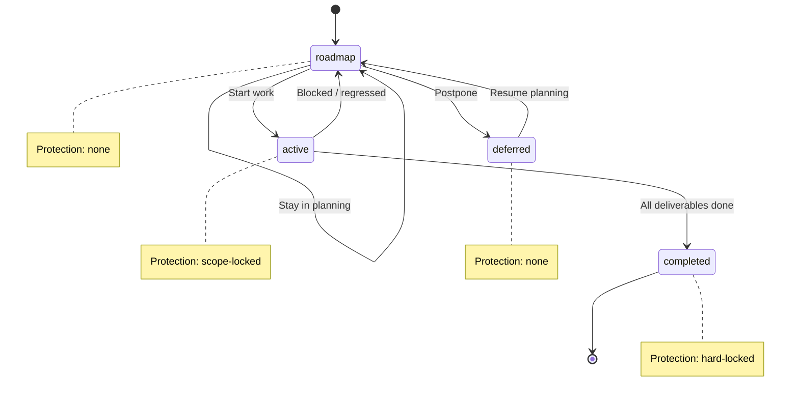
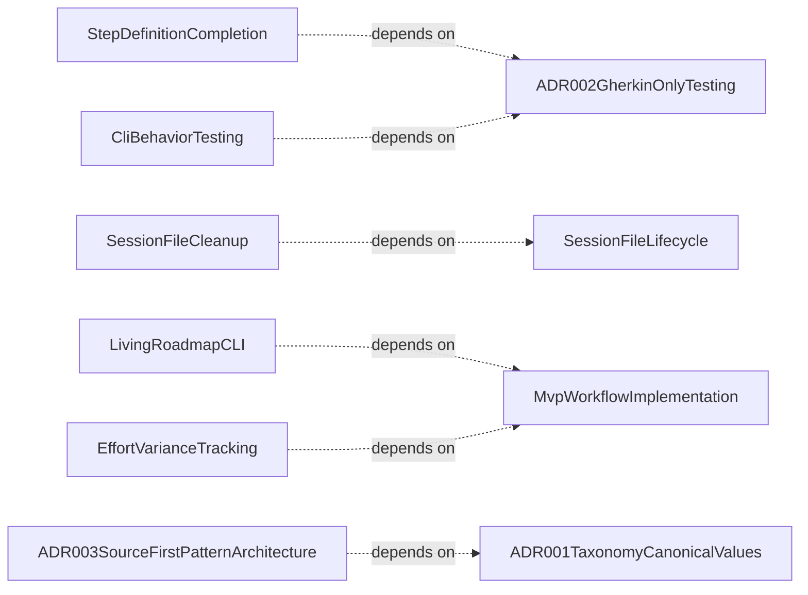

# Process Overview

**Purpose:** Process product area overview
**Detail Level:** Full reference

---

**How does the session workflow work?** Process defines the USDP-inspired session workflow that governs how work moves through the delivery lifecycle. Three session types (planning, design, implementation) have fixed input/output contracts: planning creates roadmap specs from pattern briefs, design produces code stubs and decision records, and implementation writes code against scope-locked specs. Git is the event store — documentation artifacts are projections of annotated source code, not hand-maintained files. The FSM enforces state transitions (roadmap → active → completed) with escalating protection levels, while handoff templates preserve context across LLM session boundaries. ADR-003 established that TypeScript source owns pattern identity; tier 1 specs are ephemeral planning documents that lose value after completion.

## Key Invariants

- TypeScript source owns pattern identity: `@libar-docs-pattern` in TypeScript defines the pattern. Tier 1 specs are ephemeral working documents
- 7 canonical product-area values: Annotation, Configuration, Generation, Validation, DataAPI, CoreTypes, Process — reader-facing sections, not source modules
- Two distinct status domains: Pattern FSM status (4 values) vs. deliverable status (6 values). Never cross domains
- Session types define capabilities: planning creates specs, design creates stubs, implementation writes code. Each session type has a fixed input/output contract enforced by convention

---

## Product area canonical values

**Invariant:** The product-area tag uses one of 7 canonical values. Each value represents a reader-facing documentation section, not a source module.

| Value         | Reader Question                     | Covers                                          |
| ------------- | ----------------------------------- | ----------------------------------------------- |
| Annotation    | How do I annotate code?             | Scanning, extraction, tag parsing, dual-source  |
| Configuration | How do I configure the tool?        | Config loading, presets, resolution             |
| Generation    | How does code become docs?          | Codecs, generators, rendering, diagrams         |
| Validation    | How is the workflow enforced?       | FSM, DoD, anti-patterns, process guard, lint    |
| DataAPI       | How do I query process state?       | Process state API, stubs, context assembly, CLI |
| CoreTypes     | What foundational types exist?      | Result monad, error factories, string utils     |
| Process       | How does the session workflow work? | Session lifecycle, handoffs, conventions        |

---

## ADR category canonical values

**Invariant:** The adr-category tag uses one of 4 values.

| Value         | Purpose                                       |
| ------------- | --------------------------------------------- |
| architecture  | System structure, component design, data flow |
| process       | Workflow, conventions, annotation rules       |
| testing       | Test strategy, verification approach          |
| documentation | Documentation generation, content structure   |

---

## FSM status values and protection levels

**Invariant:** Pattern status uses exactly 4 values with defined protection levels. These are enforced by Process Guard at commit time.

| Status    | Protection   | Can Add Deliverables | Allowed Actions                 |
| --------- | ------------ | -------------------- | ------------------------------- |
| roadmap   | None         | Yes                  | Full editing                    |
| active    | Scope-locked | No                   | Edit existing deliverables only |
| completed | Hard-locked  | No                   | Requires unlock-reason tag      |
| deferred  | None         | Yes                  | Full editing                    |

---

## Valid FSM transitions

**Invariant:** Only these transitions are valid. All others are rejected by Process Guard. Completed is a terminal state. Modifications require `@libar-docs-unlock-reason` escape hatch.

| From     | To        | Trigger               |
| -------- | --------- | --------------------- |
| roadmap  | active    | Start work            |
| roadmap  | deferred  | Postpone              |
| active   | completed | All deliverables done |
| active   | roadmap   | Blocked/regressed     |
| deferred | roadmap   | Resume planning       |

---

## Tag format types

**Invariant:** Every tag has one of 6 format types that determines how its value is parsed.

| Format       | Parsing                        | Example                        |
| ------------ | ------------------------------ | ------------------------------ |
| flag         | Boolean presence, no value     | @libar-docs-core               |
| value        | Simple string                  | @libar-docs-pattern MyPattern  |
| enum         | Constrained to predefined list | @libar-docs-status completed   |
| csv          | Comma-separated values         | @libar-docs-uses A, B, C       |
| number       | Numeric value                  | @libar-docs-phase 15           |
| quoted-value | Preserves spaces               | @libar-docs-brief:'Multi word' |

---

## Source ownership

**Invariant:** Relationship tags have defined ownership by source type. Anti-pattern detection enforces these boundaries.

| Tag        | Correct Source | Wrong Source  | Rationale                          |
| ---------- | -------------- | ------------- | ---------------------------------- |
| uses       | TypeScript     | Feature files | TS owns runtime dependencies       |
| depends-on | Feature files  | TypeScript    | Gherkin owns planning dependencies |
| quarter    | Feature files  | TypeScript    | Gherkin owns timeline metadata     |
| team       | Feature files  | TypeScript    | Gherkin owns ownership metadata    |

---

## Quarter format convention

**Invariant:** The quarter tag uses `YYYY-QN` format (e.g., `2026-Q1`). ISO-year-first sorting works lexicographically.

---

## Deliverable status canonical values

**Invariant:** Deliverable status (distinct from pattern FSM status) uses exactly 6 values, enforced by Zod schema at parse time.

| Value       | Meaning              |
| ----------- | -------------------- |
| complete    | Work is done         |
| in-progress | Work is ongoing      |
| pending     | Work has not started |
| deferred    | Work postponed       |
| superseded  | Replaced by another  |
| n/a         | Not applicable       |

---

## Delivery Lifecycle FSM

FSM lifecycle showing valid state transitions and protection levels:



---

## Process Pattern Relationships

Scoped architecture diagram showing component relationships:



---

## Behavior Specifications

### StepDefinitionCompletion

[View StepDefinitionCompletion source](delivery-process/specs/step-definition-completion.feature)

**Problem:**
7 feature files in tests/features/behavior/ have complete Gherkin specs
but NO step definitions. These specs describe expected behavior but are
NOT executable - they're documentation without tests.

**Solution:**
Create step definitions for each existing feature file:

- pr-changes-generation.feature (12 scenarios)
- remaining-work-enhancement.feature (7 scenarios)
- remaining-work-totals.feature (6 scenarios)
- session-handoffs.feature (9 scenarios)
- description-headers.feature (6 scenarios)
- description-quality-foundation.feature (10 scenarios)
- implementation-links.feature (5 scenarios)

Additionally, 3 feature files in other directories need step definitions:

- tests/features/generators/table-extraction.feature
- tests/features/scanner/docstring-mediatype.feature
- tests/features/generators/business-rules-codec.feature

**Business Value:**
| Benefit | How |
| Executable Tests | Specs become regression tests |
| CI Integration | Tests run on every commit |
| Refactoring Safety | Changes verified against specs |

<details>
<summary>Generator-related specs need step definitions for output validation (3 scenarios)</summary>

#### Generator-related specs need step definitions for output validation

**Invariant:** Step definitions test actual codec output against expected structure. Factory functions from tests/fixtures/ should be used for test data.

**Existing Specs:** - `tests/features/behavior/pr-changes-generation.feature` - 12 scenarios - `tests/features/behavior/remaining-work-enhancement.feature` - 7 scenarios - `tests/features/behavior/remaining-work-totals.feature` - 6 scenarios - `tests/features/behavior/session-handoffs.feature` - 9 scenarios

    **Implementation Notes:**
    - Use createExtractedPattern() from tests/fixtures/pattern-factories.ts
    - Use createMasterDataset() from tests/fixtures/dataset-factories.ts
    - Import codecs from src/renderable/codecs/
    - Assert on RenderableDocument structure, not markdown output

**Verified by:**

- pr-changes-generation.steps.ts implements all 12 scenarios
- remaining-work-enhancement.steps.ts implements priority sorting
- session-handoffs.steps.ts implements handoff context
- PR changes step defs
- Remaining work step defs
- Session handoffs step defs

</details>

<details>
<summary>Renderable helper specs need step definitions for utility functions (2 scenarios)</summary>

#### Renderable helper specs need step definitions for utility functions

**Invariant:** Helper functions are pure and easy to unit test. Step definitions should test edge cases identified in specs.

**Existing Specs:** - `tests/features/behavior/description-headers.feature` - 6 scenarios - `tests/features/behavior/description-quality-foundation.feature` - 10 scenarios - `tests/features/behavior/implementation-links.feature` - 5 scenarios

    **Implementation Notes:**
    - Import helpers from src/renderable/utils.ts or src/generators/sections/helpers.ts
    - Use simple string inputs/outputs
    - Test stripLeadingHeaders(), camelCaseToTitleCase(), normalizeImplPath()

**Verified by:**

- description-headers.steps.ts tests header stripping
- description-quality-foundation.steps.ts tests title case conversion
- Description header step defs
- Quality foundation step defs
- Implementation links step defs

</details>

<details>
<summary>Remaining specs in other directories need step definitions (2 scenarios)</summary>

#### Remaining specs in other directories need step definitions

**Existing Specs:** - `tests/features/generators/table-extraction.feature` - `tests/features/scanner/docstring-mediatype.feature`

**Verified by:**

- table-extraction.steps.ts tests stripMarkdownTables
- docstring-mediatype.steps.ts tests mediaType preservation
- Table extraction step defs
- DocString mediatype step defs

</details>

<details>
<summary>Step definition implementation follows project patterns</summary>

#### Step definition implementation follows project patterns

**Pattern:** All step definitions should follow the established patterns in
existing .steps.ts files for consistency.

    **Template:**


    **File Locations:**
    - Behavior steps: tests/steps/behavior/{feature-name}.steps.ts
    - Generator steps: tests/steps/generators/{feature-name}.steps.ts
    - Scanner steps: tests/steps/scanner/{feature-name}.steps.ts

```typescript
import { Given, When, Then, Before } from '@cucumber/cucumber';
import { expect } from 'vitest';
import { createExtractedPattern } from '../../fixtures/pattern-factories.js';

interface TestState {
  input: unknown;
  result: unknown;
  error: Error | null;
}

let state: TestState;

Before(() => {
  state = { input: null, result: null, error: null };
});

Given('...', function (arg: string) {
  // Setup test state
});

When('...', function () {
  // Execute action under test
});

Then('...', function (expected: string) {
  expect(state.result).toBe(expected);
});
```

</details>

### SessionFileCleanup

[View SessionFileCleanup source](delivery-process/specs/session-file-cleanup.feature)

**Problem:**
Session files (docs-living/sessions/phase-\*.md) are ephemeral working
documents for active phases. When phases complete or are paused, orphaned
session files should be cleaned up. The cleanup behavior is documented
but not specified with acceptance criteria.

**Solution:**
Formalize cleanup behavior with specifications covering:

- When cleanup triggers
- What files are deleted vs preserved
- Error handling
- Logging/notification of cleanup actions

<details>
<summary>Cleanup triggers during session-context generation (1 scenarios)</summary>

#### Cleanup triggers during session-context generation

**Verified by:**

- Cleanup runs after generating session files

</details>

<details>
<summary>Only phase-*.md files are candidates for cleanup (1 scenarios)</summary>

#### Only phase-\*.md files are candidates for cleanup

**Verified by:**

- Non-session files are preserved

</details>

<details>
<summary>Cleanup failures are non-fatal (2 scenarios)</summary>

#### Cleanup failures are non-fatal

**Verified by:**

- Permission error during cleanup
- Missing sessions directory

</details>

### MvpWorkflowImplementation

[View MvpWorkflowImplementation source](delivery-process/specs/mvp-workflow-implementation.feature)

**Problem:**
PDR-005 defines a 4-state workflow FSM (`roadmap, active, completed, deferred`)
but the delivery-process package validation schemas and generators may still
reference legacy status values. Need to ensure alignment.

**Solution:**
Implement PDR-005 status values via taxonomy module refactor:

1. Create taxonomy module as single source of truth (src/taxonomy/status-values.ts)
2. Update validation schemas to import from taxonomy module
3. Update generators to use normalizeStatus() for display bucket mapping

#### PDR-005 status values are recognized

**Verified by:**

- Scanner extracts new status values
- All four status values are valid

#### Generators map statuses to documents

**Verified by:**

- Roadmap and deferred appear in ROADMAP.md
- Active appears in CURRENT-WORK.md
- Completed appears in CHANGELOG

### LivingRoadmapCLI

[View LivingRoadmapCLI source](delivery-process/specs/living-roadmap-cli.feature)

**Problem:**
Roadmap is a static document that requires regeneration.
No interactive way to answer "what's next?" or "what's blocked?"
Critical path analysis requires manual inspection.

**Solution:**
Add interactive CLI commands for roadmap queries:

- `pnpm roadmap:next` - Show next actionable phase
- `pnpm roadmap:blocked` - Show phases waiting on dependencies
- `pnpm roadmap:path-to --phase N` - Show critical path to target
- `pnpm roadmap:status` - Quick summary (completed/active/roadmap counts)

This is the capstone for Setup A (Framework Roadmap OS).
Transforms roadmap from "document to maintain" to "queries over reality".

Implements Convergence Opportunity 8: Living Roadmap That Compiles.

### EffortVarianceTracking

[View EffortVarianceTracking source](delivery-process/specs/effort-variance-tracking.feature)

**Problem:**
No systematic way to track planned vs actual effort.
Cannot learn from estimation accuracy patterns.
No visibility into "where time goes" across workflows.

**Solution:**
Generate EFFORT-ANALYSIS.md report showing:

- Phase burndown (planned vs actual per phase)
- Estimation accuracy trends over time
- Time distribution by workflow type (design, implementation, testing, docs)

Uses effort and effort-actual metadata from TypeScript phase files.
Uses workflow metadata for time distribution analysis.

Implements Convergence Opportunity 3: Earned-Value Tracking (lightweight).

### CliBehaviorTesting

[View CliBehaviorTesting source](delivery-process/specs/cli-behavior-testing.feature)

**Problem:**
All 5 CLI commands (generate-docs, lint-patterns, lint-process, validate-patterns,
generate-tag-taxonomy) have zero behavior specs. These are user-facing interfaces
that need comprehensive testing for argument parsing, error handling, and output formats.

**Solution:**
Create behavior specs for each CLI command covering:

- Argument parsing (all flags and combinations)
- Error handling (missing/invalid input)
- Output format validation (JSON, pretty)
- Exit code behavior

**Business Value:**
| Benefit | How |
| Reliability | CLI commands work correctly in all scenarios |
| User Experience | Clear error messages for invalid usage |
| CI/CD Integration | Predictable exit codes for automation |

<details>
<summary>generate-docs handles all argument combinations correctly (4 scenarios)</summary>

#### generate-docs handles all argument combinations correctly

**Invariant:** Invalid arguments produce clear error messages with usage hints. Valid arguments produce expected output files.

**Verified by:**

- Generate specific document type
- Generate multiple document types
- Unknown generator name fails with helpful error
- Missing required input fails with usage hint
- Argument parsing
- Generator selection
- Output file creation

</details>

<details>
<summary>lint-patterns validates annotation quality with configurable strictness (4 scenarios)</summary>

#### lint-patterns validates annotation quality with configurable strictness

**Invariant:** Lint violations are reported with file, line, and severity. Exit codes reflect violation presence based on strictness setting.

**Verified by:**

- Lint passes for valid annotations
- Lint fails for missing pattern name
- JSON output format
- Strict mode treats warnings as errors
- Lint execution
- Strict mode
- Output formats

</details>

<details>
<summary>validate-patterns performs cross-source validation with DoD checks (3 scenarios)</summary>

#### validate-patterns performs cross-source validation with DoD checks

**Invariant:** DoD and anti-pattern violations are reported per phase. Exit codes reflect validation state.

**Verified by:**

- DoD validation for specific phase
- Anti-pattern detection
- Combined validation modes
- DoD validation
- Phase filtering

</details>

<details>
<summary>All CLIs handle errors consistently with DocError pattern (2 scenarios)</summary>

#### All CLIs handle errors consistently with DocError pattern

**Invariant:** Errors include type, file, line (when applicable), and reason. Unknown errors are caught and formatted safely.

**Verified by:**

- File not found error includes path
- Parse error includes line number
- Error formatting
- Unknown error handling

</details>

### ADR003SourceFirstPatternArchitecture

[View ADR003SourceFirstPatternArchitecture source](delivery-process/decisions/adr-003-source-first-pattern-architecture.feature)

**Context:**
The original annotation architecture assumed pattern definitions live
in tier 1 feature specs, with TypeScript code limited to `@libar-docs-implements`.
At scale this creates three problems: tier 1 specs become stale after implementation
(only 39% of 44 specs have traceability to executable specs), retroactive annotation
of existing code triggers merge conflicts, and duplicated Rules/Scenarios in tier 1
specs average 200-400 lines that exist in better form in executable specs.

**Decision:**
Invert the ownership model: TypeScript source code is the canonical pattern
definition. Tier 1 specs become ephemeral planning documents. The three durable
artifacts are annotated source code, executable specs, and decision specs.

**Consequences:**
| Type | Impact |
| Positive | Pattern identity travels with code from stub through production |
| Positive | Eliminates stale tier 1 spec maintenance burden |
| Positive | Executable specs become the living specification (richer, verified) |
| Positive | Retroactive annotation works without merge conflicts |
| Negative | Migration effort for existing tier 1 specs |
| Negative | Requires updating CLAUDE.md annotation ownership guidance |

<details>
<summary>TypeScript source owns pattern identity</summary>

#### TypeScript source owns pattern identity

**Invariant:** A pattern is defined by `@libar-docs-pattern` in a TypeScript file — either a stub (pre-implementation) or source code (post-implementation).

**Pattern Definition Lifecycle:**

    Exception: Patterns with no TypeScript implementation (pure process or
    workflow concerns) may be defined in decision specs. The constraint is:
    one definition per pattern, regardless of source type.

| Phase          | Location                               | Status    |
| -------------- | -------------------------------------- | --------- |
| Design         | `delivery-process/stubs/pattern-name/` | roadmap   |
| Implementation | `src/path/to/module.ts`                | active    |
| Completed      | `src/path/to/module.ts`                | completed |

</details>

<details>
<summary>Tier 1 specs are ephemeral working documents</summary>

#### Tier 1 specs are ephemeral working documents

**Invariant:** Tier 1 roadmap specs serve planning and delivery tracking. They are not the source of truth for pattern identity, invariants, or acceptance criteria. After completion, they may be archived.

**Value by lifecycle phase:**

| Phase     | Planning Value                | Documentation Value                |
| --------- | ----------------------------- | ---------------------------------- |
| roadmap   | High                          | None (not yet built)               |
| active    | Medium (deliverable tracking) | Low (stale snapshot)               |
| completed | None                          | None (executable specs are better) |

</details>

<details>
<summary>Three durable artifact types</summary>

#### Three durable artifact types

**Invariant:** The delivery process produces three artifact types with long-term value. All other artifacts are projections or ephemeral.

| Artifact                 | Purpose                              | Owns                                  |
| ------------------------ | ------------------------------------ | ------------------------------------- |
| Annotated TypeScript     | Pattern identity, architecture graph | Name, status, uses, categories        |
| Executable specs         | Behavior verification, invariants    | Rules, rationale, acceptance criteria |
| Decision specs (ADR/PDR) | Architectural choices, rationale     | Why decisions were made               |

</details>

<details>
<summary>Implements is UML Realization (many-to-one)</summary>

#### Implements is UML Realization (many-to-one)

**Invariant:** `@libar-docs-implements` declares a realization relationship. Multiple files can implement the same pattern. One file can implement multiple patterns (CSV format).

| Relationship | Tag                      | Cardinality             |
| ------------ | ------------------------ | ----------------------- |
| Definition   | `@libar-docs-pattern`    | Exactly one per pattern |
| Realization  | `@libar-docs-implements` | Many-to-one             |

</details>

<details>
<summary>Single-definition constraint</summary>

#### Single-definition constraint

**Invariant:** `@libar-docs-pattern:X` may appear in exactly one file across the entire codebase. The `mergePatterns()` conflict check in `orchestrator.ts` correctly enforces this.

**Migration path for existing conflicts:**

| Current State                   | Resolution                                      |
| ------------------------------- | ----------------------------------------------- |
| Pattern in both TS and feature  | Keep TS definition, feature uses `@implements`  |
| Pattern only in tier 1 spec     | Move definition to TS stub, archive tier 1 spec |
| Pattern only in TS              | Already correct                                 |
| Pattern only in executable spec | Valid if no TS implementation exists            |

</details>

<details>
<summary>Reverse links preferred over forward links (1 scenarios)</summary>

#### Reverse links preferred over forward links

**Invariant:** `@libar-docs-implements` (reverse: "I verify this pattern") is the primary traceability mechanism. `@libar-docs-executable-specs` (forward: "my tests live here") is retained but not required.

| Mechanism                     | Usage             | Reliability                      |
| ----------------------------- | ----------------- | -------------------------------- |
| `@implements` (reverse)       | 14 patterns (32%) | Self-maintaining, lives in test  |
| `@executable-specs` (forward) | 9 patterns (20%)  | Requires tier 1 spec maintenance |

**Verified by:**

- TypeScript source is canonical pattern definition

</details>

### ADR002GherkinOnlyTesting

[View ADR002GherkinOnlyTesting source](delivery-process/decisions/adr-002-gherkin-only-testing.feature)

**Context:**
A package that generates documentation from `.feature` files had dual
test approaches: 97 legacy `.test.ts` files alongside Gherkin features.
This undermined the core thesis that Gherkin IS sufficient for all testing.

**Decision:**
Enforce strict Gherkin-only testing for the delivery-process package:

- All tests must be `.feature` files with step definitions
- No new `.test.ts` files
- Edge cases use Scenario Outline with Examples tables

**Consequences:**
| Type | Impact |
| Positive | Single source of truth for tests AND documentation |
| Positive | Demonstrates Gherkin sufficiency -- the package practices what it preaches |
| Positive | Living documentation always matches test coverage |
| Positive | Forces better scenario design with Examples tables |
| Negative | Scenario Outline syntax more verbose than parameterized tests |

#### Source-driven process benefit

**Invariant:** Feature files serve as both executable specs and documentation source. This dual purpose is the primary benefit of Gherkin-only testing for this package.

| Artifact            | Without Gherkin-Only        | With Gherkin-Only                  |
| ------------------- | --------------------------- | ---------------------------------- |
| Tests               | .test.ts (hidden from docs) | .feature (visible in docs)         |
| Business rules      | Manually maintained         | Extracted from Rule blocks         |
| Acceptance criteria | Implicit in test code       | Explicit @acceptance-criteria tags |
| Traceability        | Manual cross-referencing    | @libar-docs-implements links       |

**Verified by:**

- Gherkin-only policy enforced

### ADR001TaxonomyCanonicalValues

[View ADR001TaxonomyCanonicalValues source](delivery-process/decisions/adr-001-taxonomy-canonical-values.feature)

**Context:**
The annotation system requires well-defined canonical values for taxonomy
tags, FSM status lifecycle, and source ownership rules. Without canonical
values, organic growth produces drift (Generator vs Generators, Process
vs DeliveryProcess) and inconsistent grouping in generated documentation.

**Decision:**
Define canonical values for all taxonomy enums, FSM states with protection
levels, valid transitions, tag format types, and source ownership rules.
These are the durable constants of the delivery process.

**Consequences:**
| Type | Impact |
| Positive | Generated docs group into coherent sections |
| Positive | FSM enforcement has clear, auditable state definitions |
| Positive | Source ownership prevents cross-domain tag confusion |
| Negative | Migration effort for existing specs with non-canonical values |

<details>
<summary>Product area canonical values</summary>

#### Product area canonical values

**Invariant:** The product-area tag uses one of 7 canonical values. Each value represents a reader-facing documentation section, not a source module.

| Value         | Reader Question                     | Covers                                          |
| ------------- | ----------------------------------- | ----------------------------------------------- |
| Annotation    | How do I annotate code?             | Scanning, extraction, tag parsing, dual-source  |
| Configuration | How do I configure the tool?        | Config loading, presets, resolution             |
| Generation    | How does code become docs?          | Codecs, generators, rendering, diagrams         |
| Validation    | How is the workflow enforced?       | FSM, DoD, anti-patterns, process guard, lint    |
| DataAPI       | How do I query process state?       | Process state API, stubs, context assembly, CLI |
| CoreTypes     | What foundational types exist?      | Result monad, error factories, string utils     |
| Process       | How does the session workflow work? | Session lifecycle, handoffs, conventions        |

</details>

<details>
<summary>ADR category canonical values</summary>

#### ADR category canonical values

**Invariant:** The adr-category tag uses one of 4 values.

| Value         | Purpose                                       |
| ------------- | --------------------------------------------- |
| architecture  | System structure, component design, data flow |
| process       | Workflow, conventions, annotation rules       |
| testing       | Test strategy, verification approach          |
| documentation | Documentation generation, content structure   |

</details>

<details>
<summary>FSM status values and protection levels</summary>

#### FSM status values and protection levels

**Invariant:** Pattern status uses exactly 4 values with defined protection levels. These are enforced by Process Guard at commit time.

| Status    | Protection   | Can Add Deliverables | Allowed Actions                 |
| --------- | ------------ | -------------------- | ------------------------------- |
| roadmap   | None         | Yes                  | Full editing                    |
| active    | Scope-locked | No                   | Edit existing deliverables only |
| completed | Hard-locked  | No                   | Requires unlock-reason tag      |
| deferred  | None         | Yes                  | Full editing                    |

</details>

<details>
<summary>Valid FSM transitions</summary>

#### Valid FSM transitions

**Invariant:** Only these transitions are valid. All others are rejected by Process Guard. Completed is a terminal state. Modifications require `@libar-docs-unlock-reason` escape hatch.

| From     | To        | Trigger               |
| -------- | --------- | --------------------- |
| roadmap  | active    | Start work            |
| roadmap  | deferred  | Postpone              |
| active   | completed | All deliverables done |
| active   | roadmap   | Blocked/regressed     |
| deferred | roadmap   | Resume planning       |

</details>

<details>
<summary>Tag format types</summary>

#### Tag format types

**Invariant:** Every tag has one of 6 format types that determines how its value is parsed.

| Format       | Parsing                        | Example                        |
| ------------ | ------------------------------ | ------------------------------ |
| flag         | Boolean presence, no value     | @libar-docs-core               |
| value        | Simple string                  | @libar-docs-pattern MyPattern  |
| enum         | Constrained to predefined list | @libar-docs-status completed   |
| csv          | Comma-separated values         | @libar-docs-uses A, B, C       |
| number       | Numeric value                  | @libar-docs-phase 15           |
| quoted-value | Preserves spaces               | @libar-docs-brief:'Multi word' |

</details>

<details>
<summary>Source ownership</summary>

#### Source ownership

**Invariant:** Relationship tags have defined ownership by source type. Anti-pattern detection enforces these boundaries.

| Tag        | Correct Source | Wrong Source  | Rationale                          |
| ---------- | -------------- | ------------- | ---------------------------------- |
| uses       | TypeScript     | Feature files | TS owns runtime dependencies       |
| depends-on | Feature files  | TypeScript    | Gherkin owns planning dependencies |
| quarter    | Feature files  | TypeScript    | Gherkin owns timeline metadata     |
| team       | Feature files  | TypeScript    | Gherkin owns ownership metadata    |

</details>

<details>
<summary>Quarter format convention</summary>

#### Quarter format convention

**Invariant:** The quarter tag uses `YYYY-QN` format (e.g., `2026-Q1`). ISO-year-first sorting works lexicographically.

</details>

<details>
<summary>Deliverable status canonical values (1 scenarios)</summary>

#### Deliverable status canonical values

**Invariant:** Deliverable status (distinct from pattern FSM status) uses exactly 6 values, enforced by Zod schema at parse time.

| Value       | Meaning              |
| ----------- | -------------------- |
| complete    | Work is done         |
| in-progress | Work is ongoing      |
| pending     | Work has not started |
| deferred    | Work postponed       |
| superseded  | Replaced by another  |
| n/a         | Not applicable       |

**Verified by:**

- Canonical values are enforced

</details>

### SessionHandoffs

[View SessionHandoffs source](tests/features/behavior/session-handoffs.feature)

The delivery process supports mid-phase handoffs between sessions and
coordination across multiple developers through structured templates,
checklists, and generated documentation.

**Problem:**

- Context is lost when work pauses mid-phase (LLM sessions have no memory)
- Discoveries made during sessions are not captured for roadmap refinement
- Multiple developers working on same phase can create conflicts
- Resuming work requires re-reading scattered feature files

**Solution:**

- Discovery tags (@libar-process-discovered-\*) capture learnings inline
- SESSION-CONTEXT.md provides complete phase context for LLM planning
- Handoff template standardizes state capture at session boundaries
- Retrospective checklist ensures discoveries flow to findings generator
- PROCESS_SETUP.md documents coordination patterns for parallel work

<details>
<summary>Handoff context generation captures session state (3 scenarios)</summary>

#### Handoff context generation captures session state

**Invariant:** Active phases with handoff context enabled must include session handoff sections with template and checklist links.

**Verified by:**

- SESSION-CONTEXT.md includes handoff section for active phases
- Discovery tags appear in handoff context section
- Paused phase shows status indicator

</details>

<details>
<summary>Handoff templates and checklists contain required sections (2 scenarios)</summary>

#### Handoff templates and checklists contain required sections

**Invariant:** Session handoff template and retrospective checklist must exist and contain all required sections for structured knowledge transfer.

**Verified by:**

- Handoff template exists and contains required sections
- Retrospective checklist exists and contains required sections

</details>

<details>
<summary>PROCESS_SETUP.md documents handoff and coordination protocols (2 scenarios)</summary>

#### PROCESS_SETUP.md documents handoff and coordination protocols

**Invariant:** PROCESS_SETUP.md must document both session handoff protocol and multi-developer coordination patterns.

**Verified by:**

- PROCESS_SETUP.md documents handoff protocol
- PROCESS_SETUP.md documents multi-developer coordination

</details>

<details>
<summary>Edge cases and acceptance criteria ensure robustness (5 scenarios)</summary>

#### Edge cases and acceptance criteria ensure robustness

**Invariant:** Handoff context must degrade gracefully when no discoveries exist and must be disableable. Mid-phase handoffs, multi-developer coordination, and retrospective capture must all preserve context.

**Verified by:**

- Fresh phase shows no previous context message
- Handoff context can be disabled
- Mid-phase handoff preserves context
- Multiple developers can coordinate
- Session retrospective captures learnings

</details>

### SessionFileLifecycle

[View SessionFileLifecycle source](tests/features/behavior/session-file-lifecycle.feature)

Orphaned session files are automatically cleaned up during generation,
maintaining a clean docs-living/sessions/ directory.

**Problem:**

- Session files for completed phases become orphaned and show stale data
- Manual cleanup is error-prone and easily forgotten
- Stale session files mislead LLMs reading docs-living/ for context
- No tracking of which files were cleaned up during generation
- Accumulating orphaned files clutter the sessions directory over time

**Solution:**

- DELETE strategy removes orphaned files during session-context generation
- Only active phase session files are preserved and regenerated
- COMPLETED-MILESTONES.md serves as authoritative history (no session files needed)
- Generator output tracks deleted files for transparency and debugging
- Cleanup is idempotent and handles edge cases (missing dirs, empty state)

---
