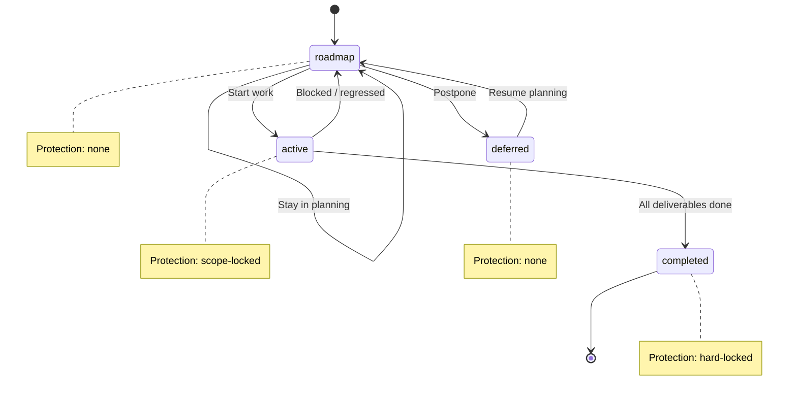
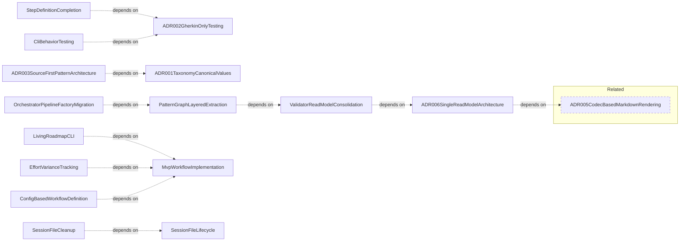

# Process Overview

**Purpose:** Process product area overview
**Detail Level:** Full reference

---

**How does the session workflow work?** Process defines the USDP-inspired session workflow that governs how work moves through the delivery lifecycle. Three session types (planning, design, implementation) have fixed input/output contracts: planning creates roadmap specs from pattern briefs, design produces code stubs and decision records, and implementation writes code against scope-locked specs. Git is the event store — documentation artifacts are projections of annotated source code, not hand-maintained files. The FSM enforces state transitions (roadmap → active → completed) with escalating protection levels, while handoff templates preserve context across LLM session boundaries. ADR-003 established that TypeScript source owns pattern identity; tier 1 specs are ephemeral planning documents that lose value after completion.

## Key Invariants

- TypeScript source owns pattern identity: `@architect-pattern` in TypeScript defines the pattern. Tier 1 specs are ephemeral working documents
- 7 canonical product-area values: Annotation, Configuration, Generation, Validation, DataAPI, CoreTypes, Process — reader-facing sections, not source modules
- Two distinct status domains: Pattern FSM status (4 values) vs. deliverable status (6 values). Never cross domains
- Session types define capabilities: planning creates specs, design creates stubs, implementation writes code. Each session type has a fixed input/output contract enforced by convention

---

## Contents

- [Key Invariants](#key-invariants)
- [Product area canonical values](#product-area-canonical-values)
- [ADR category canonical values](#adr-category-canonical-values)
- [FSM status values and protection levels](#fsm-status-values-and-protection-levels)
- [Valid FSM transitions](#valid-fsm-transitions)
- [Tag format types](#tag-format-types)
- [Source ownership](#source-ownership)
- [Quarter format convention](#quarter-format-convention)
- [Canonical phase definitions (6-phase USDP standard)](#canonical-phase-definitions-6-phase-usdp-standard)
- [Deliverable status canonical values](#deliverable-status-canonical-values)
- [Delivery Lifecycle FSM](#delivery-lifecycle-fsm)
- [Process Pattern Relationships](#process-pattern-relationships)
- [Business Rules](#business-rules)

---

## Product area canonical values

**Invariant:** The product-area tag uses one of 7 canonical values. Each value represents a reader-facing documentation section, not a source module.

**Rationale:** Without canonical values, organic drift (e.g., Generator vs Generators) produces inconsistent grouping in generated documentation and fragmented product area pages.

| Value         | Reader Question                     | Covers                                          |
| ------------- | ----------------------------------- | ----------------------------------------------- |
| Annotation    | How do I annotate code?             | Scanning, extraction, tag parsing, dual-source  |
| Configuration | How do I configure the tool?        | Config loading, presets, resolution             |
| Generation    | How does code become docs?          | Codecs, generators, rendering, diagrams         |
| Validation    | How is the workflow enforced?       | FSM, DoD, anti-patterns, process guard, lint    |
| DataAPI       | How do I query process state?       | Process state API, stubs, context assembly, CLI |
| CoreTypes     | What foundational types exist?      | Result monad, error factories, string utils     |
| Process       | How does the session workflow work? | Session lifecycle, handoffs, conventions        |

**Verified by:** Canonical values are enforced

---

## ADR category canonical values

**Invariant:** The adr-category tag uses one of 4 values.

**Rationale:** Unbounded category values prevent meaningful grouping of architecture decisions and make cross-cutting queries unreliable.

| Value         | Purpose                                       |
| ------------- | --------------------------------------------- |
| architecture  | System structure, component design, data flow |
| process       | Workflow, conventions, annotation rules       |
| testing       | Test strategy, verification approach          |
| documentation | Documentation generation, content structure   |

**Verified by:** Canonical values are enforced

---

## FSM status values and protection levels

**Invariant:** Pattern status uses exactly 4 values with defined protection levels. These are enforced by Process Guard at commit time.

**Rationale:** Without protection levels, active specs accumulate scope creep and completed specs get silently modified, undermining delivery process integrity.

| Status    | Protection   | Can Add Deliverables | Allowed Actions                 |
| --------- | ------------ | -------------------- | ------------------------------- |
| roadmap   | None         | Yes                  | Full editing                    |
| active    | Scope-locked | No                   | Edit existing deliverables only |
| completed | Hard-locked  | No                   | Requires unlock-reason tag      |
| deferred  | None         | Yes                  | Full editing                    |

**Verified by:** Canonical values are enforced

---

## Valid FSM transitions

**Invariant:** Only these transitions are valid. All others are rejected by Process Guard.

**Rationale:** Allowing arbitrary transitions (e.g., roadmap to completed) bypasses the active phase where scope-lock and deliverable tracking provide quality assurance.

| From     | To        | Trigger               |
| -------- | --------- | --------------------- |
| roadmap  | active    | Start work            |
| roadmap  | deferred  | Postpone              |
| active   | completed | All deliverables done |
| active   | roadmap   | Blocked/regressed     |
| deferred | roadmap   | Resume planning       |

**Verified by:** Canonical values are enforced

    Completed is a terminal state. Modifications require
    `@architect-unlock-reason` escape hatch.

---

## Tag format types

**Invariant:** Every tag has one of 6 format types that determines how its value is parsed.

**Rationale:** Without explicit format types, parsers must guess value structure, leading to silent data corruption when CSV values are treated as single strings or numbers are treated as text.

| Format       | Parsing                        | Example                       |
| ------------ | ------------------------------ | ----------------------------- |
| flag         | Boolean presence, no value     | @architect-core               |
| value        | Simple string                  | @architect-pattern MyPattern  |
| enum         | Constrained to predefined list | @architect-status completed   |
| csv          | Comma-separated values         | @architect-uses A, B, C       |
| number       | Numeric value                  | @architect-phase 15           |
| quoted-value | Preserves spaces               | @architect-brief:'Multi word' |

**Verified by:** Canonical values are enforced

---

## Source ownership

**Invariant:** Relationship tags have defined ownership by source type. Anti-pattern detection enforces these boundaries.

**Rationale:** Cross-domain tag placement (e.g., runtime dependencies in Gherkin) creates conflicting sources of truth and breaks the dual-source architecture ownership model.

| Tag        | Correct Source | Wrong Source  | Rationale                          |
| ---------- | -------------- | ------------- | ---------------------------------- |
| uses       | TypeScript     | Feature files | TS owns runtime dependencies       |
| depends-on | Feature files  | TypeScript    | Gherkin owns planning dependencies |
| quarter    | Feature files  | TypeScript    | Gherkin owns timeline metadata     |
| team       | Feature files  | TypeScript    | Gherkin owns ownership metadata    |

**Verified by:** Canonical values are enforced

---

## Quarter format convention

**Invariant:** The quarter tag uses `YYYY-QN` format (e.g., `2026-Q1`). ISO-year-first sorting works lexicographically.

**Rationale:** Non-standard formats (e.g., Q1-2026) break lexicographic sorting, which roadmap generation and timeline queries depend on for correct ordering.

**Verified by:** Canonical values are enforced

---

## Canonical phase definitions (6-phase USDP standard)

**Invariant:** The default workflow defines exactly 6 phases in fixed order. These are the canonical phase names and ordinals used by all generated documentation.

**Rationale:** Ad-hoc phase names and ordering produce inconsistent roadmap grouping across packages and make cross-package progress tracking impossible.

| Order | Phase         | Purpose                                        |
| ----- | ------------- | ---------------------------------------------- |
| 1     | Inception     | Problem framing, scope definition              |
| 2     | Elaboration   | Design decisions, architecture exploration     |
| 3     | Session       | Planning and design session work               |
| 4     | Construction  | Implementation, testing, integration           |
| 5     | Validation    | Verification, acceptance criteria confirmation |
| 6     | Retrospective | Review, lessons learned, documentation         |

**Verified by:** Canonical values are enforced

---

## Deliverable status canonical values

**Invariant:** Deliverable status (distinct from pattern FSM status) uses exactly 6 values, enforced by Zod schema at parse time.

**Rationale:** Freeform status strings bypass Zod validation and break DoD checks, which rely on terminal status classification to determine pattern completeness.

| Value       | Meaning              |
| ----------- | -------------------- |
| complete    | Work is done         |
| in-progress | Work is ongoing      |
| pending     | Work has not started |
| deferred    | Work postponed       |
| superseded  | Replaced by another  |
| n/a         | Not applicable       |

**Verified by:** Canonical values are enforced

---

## Delivery Lifecycle FSM

FSM lifecycle showing valid state transitions and protection levels:

---

## Process Pattern Relationships

Scoped architecture diagram showing component relationships:

---

## Business Rules

9 patterns, 36 rules with invariants (36 total)

### ADR 001 Taxonomy Canonical Values

| Rule                                                | Invariant                                                                                                                                           | Rationale                                                                                                                                                                          |
| --------------------------------------------------- | --------------------------------------------------------------------------------------------------------------------------------------------------- | ---------------------------------------------------------------------------------------------------------------------------------------------------------------------------------- |
| Product area canonical values                       | The product-area tag uses one of 7 canonical values. Each value represents a reader-facing documentation section, not a source module.              | Without canonical values, organic drift (e.g., Generator vs Generators) produces inconsistent grouping in generated documentation and fragmented product area pages.               |
| ADR category canonical values                       | The adr-category tag uses one of 4 values.                                                                                                          | Unbounded category values prevent meaningful grouping of architecture decisions and make cross-cutting queries unreliable.                                                         |
| FSM status values and protection levels             | Pattern status uses exactly 4 values with defined protection levels. These are enforced by Process Guard at commit time.                            | Without protection levels, active specs accumulate scope creep and completed specs get silently modified, undermining delivery process integrity.                                  |
| Valid FSM transitions                               | Only these transitions are valid. All others are rejected by Process Guard.                                                                         | Allowing arbitrary transitions (e.g., roadmap to completed) bypasses the active phase where scope-lock and deliverable tracking provide quality assurance.                         |
| Tag format types                                    | Every tag has one of 6 format types that determines how its value is parsed.                                                                        | Without explicit format types, parsers must guess value structure, leading to silent data corruption when CSV values are treated as single strings or numbers are treated as text. |
| Source ownership                                    | Relationship tags have defined ownership by source type. Anti-pattern detection enforces these boundaries.                                          | Cross-domain tag placement (e.g., runtime dependencies in Gherkin) creates conflicting sources of truth and breaks the dual-source architecture ownership model.                   |
| Quarter format convention                           | The quarter tag uses `YYYY-QN` format (e.g., `2026-Q1`). ISO-year-first sorting works lexicographically.                                            | Non-standard formats (e.g., Q1-2026) break lexicographic sorting, which roadmap generation and timeline queries depend on for correct ordering.                                    |
| Canonical phase definitions (6-phase USDP standard) | The default workflow defines exactly 6 phases in fixed order. These are the canonical phase names and ordinals used by all generated documentation. | Ad-hoc phase names and ordering produce inconsistent roadmap grouping across packages and make cross-package progress tracking impossible.                                         |
| Deliverable status canonical values                 | Deliverable status (distinct from pattern FSM status) uses exactly 6 values, enforced by Zod schema at parse time.                                  | Freeform status strings bypass Zod validation and break DoD checks, which rely on terminal status classification to determine pattern completeness.                                |

### ADR 002 Gherkin Only Testing

| Rule                          | Invariant                                                                                                                                                 | Rationale                                                                                                                                                             |
| ----------------------------- | --------------------------------------------------------------------------------------------------------------------------------------------------------- | --------------------------------------------------------------------------------------------------------------------------------------------------------------------- |
| Source-driven process benefit | Feature files serve as both executable specs and documentation source. This dual purpose is the primary benefit of Gherkin-only testing for this package. | Parallel `.test.ts` files create a hidden test layer invisible to the documentation pipeline, undermining the single source of truth principle this package enforces. |

### ADR 003 Source First Pattern Architecture

| Rule                                         | Invariant                                                                                                                                                                                     | Rationale                                                                                                                                                                      |
| -------------------------------------------- | --------------------------------------------------------------------------------------------------------------------------------------------------------------------------------------------- | ------------------------------------------------------------------------------------------------------------------------------------------------------------------------------ |
| TypeScript source owns pattern identity      | A pattern is defined by `@architect-pattern` in a TypeScript file — either a stub (pre-implementation) or source code (post-implementation).                                                  | If pattern identity lives in tier 1 specs, it becomes stale after implementation and diverges from the code that actually realizes the pattern.                                |
| Tier 1 specs are ephemeral working documents | Tier 1 roadmap specs serve planning and delivery tracking. They are not the source of truth for pattern identity, invariants, or acceptance criteria. After completion, they may be archived. | Treating tier 1 specs as durable creates a maintenance burden — at scale only 39% maintain traceability, and duplicated Rules/Scenarios average 200-400 stale lines.           |
| Three durable artifact types                 | The delivery process produces three artifact types with long-term value. All other artifacts are projections or ephemeral.                                                                    | Without a clear boundary between durable and ephemeral artifacts, teams maintain redundant documents that inevitably drift from the source of truth.                           |
| Implements is UML Realization (many-to-one)  | `@architect-implements` declares a realization relationship. Multiple files can implement the same pattern. One file can implement multiple patterns (CSV format).                            | Without many-to-one realization, cross-cutting patterns that span multiple files cannot be traced back to a single canonical definition.                                       |
| Single-definition constraint                 | `@architect-pattern:X` may appear in exactly one file across the entire codebase. The `mergePatterns()` conflict check in `orchestrator.ts` correctly enforces this.                          | Duplicate pattern definitions cause merge conflicts in the PatternGraph and produce ambiguous ownership in generated documentation.                                            |
| Reverse links preferred over forward links   | `@architect-implements` (reverse: "I verify this pattern") is the primary traceability mechanism. `@architect-executable-specs` (forward: "my tests live here") is retained but not required. | Forward links in tier 1 specs go stale when specs are archived, while reverse links in test files are self-maintaining because the test cannot run without the implementation. |

### Cli Behavior Testing

| Rule                                                                    | Invariant                                                                                                                      | Rationale                                                                                                                                                                       |
| ----------------------------------------------------------------------- | ------------------------------------------------------------------------------------------------------------------------------ | ------------------------------------------------------------------------------------------------------------------------------------------------------------------------------- |
| generate-docs handles all argument combinations correctly               | Invalid arguments produce clear error messages with usage hints. Valid arguments produce expected output files.                | CLI commands are the primary user-facing interface; unclear errors cause developers to bypass the tool and maintain docs manually, defeating the code-first approach.           |
| lint-patterns validates annotation quality with configurable strictness | Lint violations are reported with file, line, and severity. Exit codes reflect violation presence based on strictness setting. | Without structured violation output, CI pipelines cannot distinguish lint failures from crashes, and developers cannot locate the offending annotation to fix it.               |
| validate-patterns performs cross-source validation with DoD checks      | DoD and anti-pattern violations are reported per phase. Exit codes reflect validation state.                                   | Phase-level reporting is required because cross-source validation spans multiple files; a single pass/fail gives no actionable information about which phase needs attention.   |
| All CLIs handle errors consistently with DocError pattern               | Errors include type, file, line (when applicable), and reason. Unknown errors are caught and formatted safely.                 | Inconsistent error formats force consumers to write per-CLI parsing logic; a uniform DocError shape enables a single error handler across all CLI commands and CI integrations. |

### Mvp Workflow Implementation

| Rule                                 | Invariant                                                                                                                                                    | Rationale                                                                                                                                                     |
| ------------------------------------ | ------------------------------------------------------------------------------------------------------------------------------------------------------------ | ------------------------------------------------------------------------------------------------------------------------------------------------------------- |
| PDR-005 status values are recognized | The scanner and validation schemas must accept exactly the four PDR-005 status values: roadmap, active, completed, deferred.                                 | Unrecognized status values silently drop patterns from generated documents, causing missing documentation across the entire monorepo.                         |
| Generators map statuses to documents | Each status value must route to exactly one target document: roadmap/deferred to ROADMAP.md, active to CURRENT-WORK.md, completed to CHANGELOG-GENERATED.md. | Incorrect status-to-document mapping causes patterns to appear in the wrong document or be omitted entirely, breaking the project overview for all consumers. |

### Session File Cleanup

| Rule                                               | Invariant                                                                                     | Rationale                                                                                                                                                              |
| -------------------------------------------------- | --------------------------------------------------------------------------------------------- | ---------------------------------------------------------------------------------------------------------------------------------------------------------------------- |
| Cleanup triggers during session-context generation | Orphaned session files for inactive phases must be removed during session-context generation. | Stale session files mislead developers into thinking a phase is still active, causing wasted effort on completed or paused work.                                       |
| Only phase-\*.md files are candidates for cleanup  | Cleanup must only target files matching the `phase-*.md` naming convention.                   | Deleting non-session files (infrastructure files, manual notes) would destroy user content that cannot be regenerated.                                                 |
| Cleanup failures are non-fatal                     | A cleanup failure must never prevent session-context generation from completing successfully. | Cleanup is a housekeeping side-effect; blocking the primary generation workflow on a file-system error would break the developer's session for a non-critical concern. |

### Session File Lifecycle

| Rule                                                 | Invariant                                                                                                                                 | Rationale                                                                                                                                             |
| ---------------------------------------------------- | ----------------------------------------------------------------------------------------------------------------------------------------- | ----------------------------------------------------------------------------------------------------------------------------------------------------- |
| Orphaned session files are removed during generation | Only session files for active phases are preserved; all other phase files must be deleted during cleanup and replaced with fresh content. | Stale session files for completed or deferred phases mislead LLMs that read the sessions directory for context, causing incorrect planning decisions. |
| Cleanup handles edge cases without errors            | Cleanup must be idempotent, tolerate missing directories, and produce empty results when no phases are active.                            | Generator runs are not guarded by precondition checks for directory existence. Cleanup must never crash regardless of filesystem state.               |
| Deleted files are tracked in cleanup results         | The cleanup result must include the relative paths of all deleted session files for transparency and debugging.                           | Without deletion tracking, operators cannot audit what the generator removed, making it impossible to diagnose missing file issues after a run.       |

### Session Handoffs

| Rule                                                          | Invariant                                                                                                                                                                                         | Rationale                                                                                                                                            |
| ------------------------------------------------------------- | ------------------------------------------------------------------------------------------------------------------------------------------------------------------------------------------------- | ---------------------------------------------------------------------------------------------------------------------------------------------------- |
| Handoff context generation captures session state             | Active phases with handoff context enabled must include session handoff sections with template and checklist links.                                                                               | Without structured handoff sections, LLM sessions lose context between runs and developers waste time re-discovering phase state.                    |
| Handoff templates and checklists contain required sections    | Session handoff template and retrospective checklist must exist and contain all required sections for structured knowledge transfer.                                                              | Missing template sections cause incomplete handoffs, leading to lost context and repeated work when a new session resumes.                           |
| PROCESS_SETUP.md documents handoff and coordination protocols | PROCESS_SETUP.md must document both session handoff protocol and multi-developer coordination patterns.                                                                                           | Without a single authoritative coordination reference, parallel developers follow ad-hoc processes that cause merge conflicts and duplicated effort. |
| Edge cases and acceptance criteria ensure robustness          | Handoff context must degrade gracefully when no discoveries exist and must be disableable. Mid-phase handoffs, multi-developer coordination, and retrospective capture must all preserve context. | If handoff generation crashes on empty state or cannot be disabled, it blocks unrelated generation workflows and erodes trust in the automation.     |

### Step Definition Completion

| Rule                                                                | Invariant                                                                                                                 | Rationale                                                                                                                                                                                                           |
| ------------------------------------------------------------------- | ------------------------------------------------------------------------------------------------------------------------- | ------------------------------------------------------------------------------------------------------------------------------------------------------------------------------------------------------------------- |
| Generator-related specs need step definitions for output validation | Step definitions test actual codec output against expected structure.                                                     | Testing rendered markdown strings instead of structured codec output makes tests brittle to formatting changes that do not affect correctness. Factory functions from tests/fixtures/ should be used for test data. |
| Renderable helper specs need step definitions for utility functions | Helper functions are pure and easy to unit test.                                                                          | Renderable helpers are reused across multiple codecs; untested edge cases silently corrupt generated documentation in every consumer. Step definitions should test edge cases identified in specs.                  |
| Remaining specs in other directories need step definitions          | Every feature file in tests/features/ must have a corresponding step definition file.                                     | Feature files without step definitions are inert documentation that silently fall out of sync with the code they describe.                                                                                          |
| Step definition implementation follows project patterns             | All step definition files must follow the established state-management and import patterns from existing .steps.ts files. | Inconsistent step definition structure makes tests harder to review, debug, and maintain across the 10+ feature files in this deliverable.                                                                          |

---
