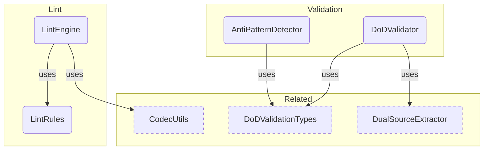

# Validation Overview

**Purpose:** Validation product area overview
**Detail Level:** Full reference

---

**How is the workflow enforced?** Validation enforces delivery workflow rules at commit time using a Decider pattern. Process Guard derives state from annotations (no separate state store), validates proposed changes against FSM rules, and blocks invalid transitions. Protection levels escalate with status: roadmap allows free editing, active locks scope, completed requires explicit unlock.

## Key Invariants

- Protection levels: `roadmap`/`deferred` = none (fully editable), `active` = scope-locked (no new deliverables), `completed` = hard-locked (requires `@libar-docs-unlock-reason`)
- Valid FSM transitions: Only roadmap→active, roadmap→deferred, active→completed, active→roadmap, deferred→roadmap. Completed is terminal
- Decider pattern: All validation is (state, changes, options) → result. State is derived from annotations, not maintained separately

---

## Validation Components

Scoped architecture diagram showing component relationships:



---

## API Types

### AntiPatternDetectionOptions (interface)

```typescript
/**
 * Configuration options for anti-pattern detection
 */
```

```typescript
interface AntiPatternDetectionOptions extends WithTagRegistry {
  /** Thresholds for warning triggers */
  readonly thresholds?: Partial<AntiPatternThresholds>;
}
```

| Property   | Description                     |
| ---------- | ------------------------------- |
| thresholds | Thresholds for warning triggers |

### LintRule (interface)

```typescript
/**
 * A lint rule that checks a parsed directive
 */
```

```typescript
interface LintRule {
  /** Unique rule ID */
  readonly id: string;
  /** Default severity level */
  readonly severity: LintSeverity;
  /** Human-readable rule description */
  readonly description: string;
  /**
   * Check function that returns violation(s) or null if rule passes
   *
   * @param directive - Parsed directive to check
   * @param file - Source file path
   * @param line - Line number in source
   * @param context - Optional context with pattern registry for relationship validation
   * @returns Violation(s) if rule fails, null if passes. Array for rules that can detect multiple issues.
   */
  check: (
    directive: DocDirective,
    file: string,
    line: number,
    context?: LintContext
  ) => LintViolation | LintViolation[] | null;
}
```

| Property    | Description                                                     |
| ----------- | --------------------------------------------------------------- |
| id          | Unique rule ID                                                  |
| severity    | Default severity level                                          |
| description | Human-readable rule description                                 |
| check       | Check function that returns violation(s) or null if rule passes |

### LintContext (interface)

```typescript
/**
 * Context for lint rules that need access to the full pattern registry.
 * Used for "strict mode" validation where relationships are checked
 * against known patterns.
 */
```

```typescript
interface LintContext {
  /** Set of known pattern names for relationship validation */
  readonly knownPatterns: ReadonlySet<string>;
  /** Tag registry for prefix-aware error messages (optional) */
  readonly registry?: TagRegistry;
}
```

| Property      | Description                                             |
| ------------- | ------------------------------------------------------- |
| knownPatterns | Set of known pattern names for relationship validation  |
| registry      | Tag registry for prefix-aware error messages (optional) |

### ProtectionLevel (type)

```typescript
/**
 * Protection level types for FSM states
 *
 * - `none`: Fully editable, no restrictions
 * - `scope`: Scope-locked, prevents adding new deliverables
 * - `hard`: Hard-locked, requires explicit unlock-reason annotation
 */
```

```typescript
type ProtectionLevel = 'none' | 'scope' | 'hard';
```

### isDeliverableComplete (function)

```typescript
/**
 * Check if a deliverable status indicates completion
 *
 * Uses canonical deliverable status taxonomy. Status must be 'complete'.
 *
 * @param deliverable - The deliverable to check
 * @returns True if the deliverable is complete
 */
```

```typescript
function isDeliverableComplete(deliverable: Deliverable): boolean;
```

| Parameter   | Type | Description              |
| ----------- | ---- | ------------------------ |
| deliverable |      | The deliverable to check |

**Returns:** True if the deliverable is complete

### hasAcceptanceCriteria (function)

```typescript
/**
 * Check if a feature has @acceptance-criteria scenarios
 *
 * Scans scenarios for the @acceptance-criteria tag, which indicates
 * BDD-driven acceptance tests.
 *
 * @param feature - The scanned feature file to check
 * @returns True if at least one @acceptance-criteria scenario exists
 */
```

```typescript
function hasAcceptanceCriteria(feature: ScannedGherkinFile): boolean;
```

| Parameter | Type | Description                       |
| --------- | ---- | --------------------------------- |
| feature   |      | The scanned feature file to check |

**Returns:** True if at least one @acceptance-criteria scenario exists

### extractAcceptanceCriteriaScenarios (function)

```typescript
/**
 * Extract acceptance criteria scenario names from a feature
 *
 * @param feature - The scanned feature file
 * @returns Array of scenario names with @acceptance-criteria tag
 */
```

```typescript
function extractAcceptanceCriteriaScenarios(feature: ScannedGherkinFile): readonly string[];
```

| Parameter | Type | Description              |
| --------- | ---- | ------------------------ |
| feature   |      | The scanned feature file |

**Returns:** Array of scenario names with @acceptance-criteria tag

### validateDoDForPhase (function)

```typescript
/**
 * Validate DoD for a single phase/pattern
 *
 * Checks:
 * 1. All deliverables have "complete" status
 * 2. At least one @acceptance-criteria scenario exists
 *
 * @param patternName - Name of the pattern being validated
 * @param phase - Phase number being validated
 * @param feature - The scanned feature file with deliverables and scenarios
 * @returns DoD validation result
 */
```

```typescript
function validateDoDForPhase(
  patternName: string,
  phase: number,
  feature: ScannedGherkinFile
): DoDValidationResult;
```

| Parameter   | Type | Description                                              |
| ----------- | ---- | -------------------------------------------------------- |
| patternName |      | Name of the pattern being validated                      |
| phase       |      | Phase number being validated                             |
| feature     |      | The scanned feature file with deliverables and scenarios |

**Returns:** DoD validation result

### validateDoD (function)

````typescript
/**
 * Validate DoD across multiple phases
 *
 * Filters to completed phases and validates each against DoD criteria.
 * Optionally filter to specific phases using phaseFilter.
 *
 * @param features - Array of scanned feature files
 * @param phaseFilter - Optional array of phase numbers to validate (validates all if empty)
 * @returns Aggregate DoD validation summary
 *
 * @example
 * ```typescript
 * // Validate all completed phases
 * const summary = validateDoD(features);
 *
 * // Validate specific phase
 * const summary = validateDoD(features, [14]);
 * ```
 */
````

```typescript
function validateDoD(
  features: readonly ScannedGherkinFile[],
  phaseFilter: readonly number[] = []
): DoDValidationSummary;
```

| Parameter   | Type | Description                                                          |
| ----------- | ---- | -------------------------------------------------------------------- |
| features    |      | Array of scanned feature files                                       |
| phaseFilter |      | Optional array of phase numbers to validate (validates all if empty) |

**Returns:** Aggregate DoD validation summary

### formatDoDSummary (function)

```typescript
/**
 * Format DoD validation summary for console output
 *
 * @param summary - DoD validation summary to format
 * @returns Multi-line string for pretty printing
 */
```

```typescript
function formatDoDSummary(summary: DoDValidationSummary): string;
```

| Parameter | Type | Description                      |
| --------- | ---- | -------------------------------- |
| summary   |      | DoD validation summary to format |

**Returns:** Multi-line string for pretty printing

### detectAntiPatterns (function)

````typescript
/**
 * Detect all anti-patterns
 *
 * Runs all anti-pattern detectors and returns combined violations.
 *
 * @param scannedFiles - Array of scanned TypeScript files
 * @param features - Array of scanned feature files
 * @param options - Optional configuration (registry for prefix, thresholds)
 * @returns Array of all detected anti-pattern violations
 *
 * @example
 * ```typescript
 * // With default prefix (@libar-docs-)
 * const violations = detectAntiPatterns(tsFiles, featureFiles);
 *
 * // With custom prefix
 * const registry = createDefaultTagRegistry();
 * registry.tagPrefix = "@docs-";
 * const customViolations = detectAntiPatterns(tsFiles, featureFiles, { registry });
 *
 * for (const v of violations) {
 *   console.log(`[${v.severity.toUpperCase()}] ${v.id}: ${v.message}`);
 * }
 * ```
 */
````

```typescript
function detectAntiPatterns(
  scannedFiles: readonly ScannedFile[],
  features: readonly ScannedGherkinFile[],
  options: AntiPatternDetectionOptions = {}
): AntiPatternViolation[];
```

| Parameter    | Type | Description                                              |
| ------------ | ---- | -------------------------------------------------------- |
| scannedFiles |      | Array of scanned TypeScript files                        |
| features     |      | Array of scanned feature files                           |
| options      |      | Optional configuration (registry for prefix, thresholds) |

**Returns:** Array of all detected anti-pattern violations

### detectProcessInCode (function)

```typescript
/**
 * Detect process metadata in code anti-pattern
 *
 * Finds process tracking annotations (e.g., @docs-quarter, @docs-team, etc.)
 * in TypeScript files. Process metadata belongs in feature files.
 *
 * @param scannedFiles - Array of scanned TypeScript files
 * @param registry - Optional tag registry for prefix-aware detection (defaults to @libar-docs-)
 * @returns Array of anti-pattern violations
 */
```

```typescript
function detectProcessInCode(
  scannedFiles: readonly ScannedFile[],
  registry?: TagRegistry
): AntiPatternViolation[];
```

| Parameter    | Type | Description                                                                 |
| ------------ | ---- | --------------------------------------------------------------------------- |
| scannedFiles |      | Array of scanned TypeScript files                                           |
| registry     |      | Optional tag registry for prefix-aware detection (defaults to @libar-docs-) |

**Returns:** Array of anti-pattern violations

### detectMagicComments (function)

```typescript
/**
 * Detect magic comments anti-pattern
 *
 * Finds generator hints like "# GENERATOR:", "# PARSER:" in feature files.
 * These create tight coupling between features and generators.
 *
 * @param features - Array of scanned feature files
 * @param threshold - Maximum magic comments before warning (default: 5)
 * @returns Array of anti-pattern violations
 */
```

```typescript
function detectMagicComments(
  features: readonly ScannedGherkinFile[],
  threshold: number = DEFAULT_THRESHOLDS.magicCommentThreshold
): AntiPatternViolation[];
```

| Parameter | Type | Description                                        |
| --------- | ---- | -------------------------------------------------- |
| features  |      | Array of scanned feature files                     |
| threshold |      | Maximum magic comments before warning (default: 5) |

**Returns:** Array of anti-pattern violations

### detectScenarioBloat (function)

```typescript
/**
 * Detect scenario bloat anti-pattern
 *
 * Finds feature files with too many scenarios, which indicates poor
 * organization and slows test suites.
 *
 * @param features - Array of scanned feature files
 * @param threshold - Maximum scenarios before warning (default: 20)
 * @returns Array of anti-pattern violations
 */
```

```typescript
function detectScenarioBloat(
  features: readonly ScannedGherkinFile[],
  threshold: number = DEFAULT_THRESHOLDS.scenarioBloatThreshold
): AntiPatternViolation[];
```

| Parameter | Type | Description                                    |
| --------- | ---- | ---------------------------------------------- |
| features  |      | Array of scanned feature files                 |
| threshold |      | Maximum scenarios before warning (default: 20) |

**Returns:** Array of anti-pattern violations

### detectMegaFeature (function)

```typescript
/**
 * Detect mega-feature anti-pattern
 *
 * Finds feature files that are too large, which makes them hard to
 * maintain and review.
 *
 * @param features - Array of scanned feature files
 * @param threshold - Maximum lines before warning (default: 500)
 * @returns Array of anti-pattern violations
 */
```

```typescript
function detectMegaFeature(
  features: readonly ScannedGherkinFile[],
  threshold: number = DEFAULT_THRESHOLDS.megaFeatureLineThreshold
): AntiPatternViolation[];
```

| Parameter | Type | Description                                 |
| --------- | ---- | ------------------------------------------- |
| features  |      | Array of scanned feature files              |
| threshold |      | Maximum lines before warning (default: 500) |

**Returns:** Array of anti-pattern violations

### formatAntiPatternReport (function)

```typescript
/**
 * Format anti-pattern violations for console output
 *
 * @param violations - Array of violations to format
 * @returns Multi-line string for pretty printing
 */
```

```typescript
function formatAntiPatternReport(violations: AntiPatternViolation[]): string;
```

| Parameter  | Type | Description                   |
| ---------- | ---- | ----------------------------- |
| violations |      | Array of violations to format |

**Returns:** Multi-line string for pretty printing

### toValidationIssues (function)

```typescript
/**
 * Convert anti-pattern violations to ValidationIssue format
 *
 * For integration with the existing validate-patterns CLI.
 */
```

```typescript
function toValidationIssues(violations: readonly AntiPatternViolation[]): Array<{
  severity: 'error' | 'warning' | 'info';
  message: string;
  source: 'typescript' | 'gherkin' | 'cross-source';
  pattern?: string;
  file?: string;
}>;
```

### filterRulesBySeverity (function)

```typescript
/**
 * Get rules filtered by minimum severity
 *
 * @param rules - Rules to filter
 * @param minSeverity - Minimum severity to include
 * @returns Filtered rules
 */
```

```typescript
function filterRulesBySeverity(rules: readonly LintRule[], minSeverity: LintSeverity): LintRule[];
```

| Parameter   | Type | Description                 |
| ----------- | ---- | --------------------------- |
| rules       |      | Rules to filter             |
| minSeverity |      | Minimum severity to include |

**Returns:** Filtered rules

### isValidTransition (function)

````typescript
/**
 * Check if a transition between two states is valid
 *
 * @param from - Current status
 * @param to - Target status
 * @returns true if the transition is allowed
 *
 * @example
 * ```typescript
 * isValidTransition("roadmap", "active"); // → true
 * isValidTransition("roadmap", "completed"); // → false (must go through active)
 * isValidTransition("completed", "active"); // → false (terminal state)
 * ```
 */
````

```typescript
function isValidTransition(from: ProcessStatusValue, to: ProcessStatusValue): boolean;
```

| Parameter | Type | Description    |
| --------- | ---- | -------------- |
| from      |      | Current status |
| to        |      | Target status  |

**Returns:** true if the transition is allowed

### getValidTransitionsFrom (function)

````typescript
/**
 * Get all valid transitions from a given state
 *
 * @param status - Current status
 * @returns Array of valid target states (empty for terminal states)
 *
 * @example
 * ```typescript
 * getValidTransitionsFrom("roadmap"); // → ["active", "deferred", "roadmap"]
 * getValidTransitionsFrom("completed"); // → []
 * ```
 */
````

```typescript
function getValidTransitionsFrom(status: ProcessStatusValue): readonly ProcessStatusValue[];
```

| Parameter | Type | Description    |
| --------- | ---- | -------------- |
| status    |      | Current status |

**Returns:** Array of valid target states (empty for terminal states)

### getTransitionErrorMessage (function)

````typescript
/**
 * Get a human-readable description of why a transition is invalid
 *
 * @param from - Current status
 * @param to - Attempted target status
 * @param options - Optional message options with registry for prefix
 * @returns Error message describing the violation
 *
 * @example
 * ```typescript
 * getTransitionErrorMessage("roadmap", "completed");
 * // → "Cannot transition from 'roadmap' to 'completed'. Must go through 'active' first."
 *
 * getTransitionErrorMessage("completed", "active");
 * // → "Cannot transition from 'completed' (terminal state). Use unlock-reason tag to modify."
 * ```
 */
````

```typescript
function getTransitionErrorMessage(
  from: ProcessStatusValue,
  to: ProcessStatusValue,
  options?: TransitionMessageOptions
): string;
```

| Parameter | Type | Description                                       |
| --------- | ---- | ------------------------------------------------- |
| from      |      | Current status                                    |
| to        |      | Attempted target status                           |
| options   |      | Optional message options with registry for prefix |

**Returns:** Error message describing the violation

### getProtectionLevel (function)

````typescript
/**
 * Get the protection level for a status
 *
 * @param status - Process status value
 * @returns Protection level for the status
 *
 * @example
 * ```typescript
 * getProtectionLevel("active"); // → "scope"
 * getProtectionLevel("completed"); // → "hard"
 * ```
 */
````

```typescript
function getProtectionLevel(status: ProcessStatusValue): ProtectionLevel;
```

| Parameter | Type | Description          |
| --------- | ---- | -------------------- |
| status    |      | Process status value |

**Returns:** Protection level for the status

### isTerminalState (function)

````typescript
/**
 * Check if a status is a terminal state (cannot transition out)
 *
 * Terminal states require explicit unlock to modify.
 *
 * @param status - Process status value
 * @returns true if the status is terminal
 *
 * @example
 * ```typescript
 * isTerminalState("completed"); // → true
 * isTerminalState("active"); // → false
 * ```
 */
````

```typescript
function isTerminalState(status: ProcessStatusValue): boolean;
```

| Parameter | Type | Description          |
| --------- | ---- | -------------------- |
| status    |      | Process status value |

**Returns:** true if the status is terminal

### isFullyEditable (function)

```typescript
/**
 * Check if a status is fully editable (no protection)
 *
 * @param status - Process status value
 * @returns true if the status has no protection
 */
```

```typescript
function isFullyEditable(status: ProcessStatusValue): boolean;
```

| Parameter | Type | Description          |
| --------- | ---- | -------------------- |
| status    |      | Process status value |

**Returns:** true if the status has no protection

### isScopeLocked (function)

```typescript
/**
 * Check if a status is scope-locked
 *
 * @param status - Process status value
 * @returns true if the status prevents scope changes
 */
```

```typescript
function isScopeLocked(status: ProcessStatusValue): boolean;
```

| Parameter | Type | Description          |
| --------- | ---- | -------------------- |
| status    |      | Process status value |

**Returns:** true if the status prevents scope changes

### validateChanges (function)

````typescript
/**
 * Validate changes against process rules.
 *
 * Pure function following the Decider pattern:
 * - Takes all inputs explicitly (no hidden state)
 * - Returns result without side effects
 * - Emits events for observability
 *
 * @param input - Complete input including state, changes, and options
 * @returns DeciderOutput with validation result and events
 *
 * @example
 * ```typescript
 * const output = validateChanges({
 *   state: processState,
 *   changes: changeDetection,
 *   options: { strict: false, ignoreSession: false },
 * });
 *
 * if (!output.result.valid) {
 *   console.log('Violations:', output.result.violations);
 * }
 * ```
 */
````

```typescript
function validateChanges(input: DeciderInput): DeciderOutput;
```

| Parameter | Type | Description                                          |
| --------- | ---- | ---------------------------------------------------- |
| input     |      | Complete input including state, changes, and options |

**Returns:** DeciderOutput with validation result and events

### defaultRules (const)

```typescript
/**
 * All default lint rules
 *
 * Order matters for output - errors first, then warnings, then info.
 */
```

```typescript
const defaultRules: readonly LintRule[];
```

### severityOrder (const)

```typescript
/**
 * Severity ordering for sorting and filtering
 * Exported for use by lint engine to avoid duplication
 */
```

```typescript
const severityOrder: Record<LintSeverity, number>;
```

### missingPatternName (const)

```typescript
/**
 * Rule: missing-pattern-name
 *
 * Patterns must have an explicit name via the pattern tag.
 * Without a name, the pattern can't be referenced in relationships
 * or indexed properly.
 */
```

```typescript
const missingPatternName: LintRule;
```

### missingStatus (const)

```typescript
/**
 * Rule: missing-status
 *
 * Patterns should have an explicit status (completed, active, roadmap).
 * This helps readers understand if the pattern is ready for use.
 */
```

```typescript
const missingStatus: LintRule;
```

---

## Behavior Specifications

### StatusTransitionDetectionTesting

[View StatusTransitionDetectionTesting source](tests/features/validation/status-transition-detection.feature)

Tests for the detectStatusTransitions function that parses git diff output.
Verifies that status tags inside docstrings are ignored and only file-level
tags are used for FSM transition validation.

<details>
<summary>Status transitions are detected from file-level tags (3 scenarios)</summary>

#### Status transitions are detected from file-level tags

**Invariant:** Status transitions must be detected by comparing @libar-docs-status tags at the file level between the old and new versions of a file.

**Rationale:** File-level tags are the canonical source of pattern status — detecting transitions from tags ensures consistency with the FSM validator.

**Verified by:**

- New file with status tag is detected as transition from roadmap
- Modified file with status change is detected
- No transition when status unchanged

</details>

<details>
<summary>Status tags inside docstrings are ignored (3 scenarios)</summary>

#### Status tags inside docstrings are ignored

**Invariant:** Status tags appearing inside Gherkin docstring blocks (between triple-quote delimiters) must not be treated as real status declarations.

**Rationale:** Docstrings often contain example code or documentation showing status tags — parsing these as real would cause phantom status transitions.

**Verified by:**

- Status tag inside docstring is not used for transition
- Multiple docstring status tags are all ignored
- Only docstring status tags results in no transition

</details>

<details>
<summary>First valid status tag outside docstrings is used (1 scenarios)</summary>

#### First valid status tag outside docstrings is used

**Invariant:** When multiple status tags appear outside docstrings, only the first one determines the file's status.

**Rationale:** A single canonical status per file prevents ambiguity — using the first tag matches Gherkin convention where file-level tags appear at the top.

**Verified by:**

- First file-level tag wins over subsequent tags

</details>

<details>
<summary>Line numbers are tracked from hunk headers (1 scenarios)</summary>

#### Line numbers are tracked from hunk headers

**Invariant:** Detected status transitions must include the line number where the status tag appears, derived from git diff hunk headers.

**Rationale:** Line numbers enable precise error reporting — developers need to know exactly where in the file the transition was detected.

**Verified by:**

- Transition location includes correct line number

</details>

<details>
<summary>Generated documentation directories are excluded (2 scenarios)</summary>

#### Generated documentation directories are excluded

**Invariant:** Files in generated documentation directories (docs-generated/, docs-living/) must be excluded from status transition detection.

**Rationale:** Generated files are projections of source files — detecting transitions in them would produce duplicate violations and false positives.

**Verified by:**

- Status in docs-generated directory is ignored
- Status in docs-living directory is ignored

</details>

### ProcessGuardTesting

[View ProcessGuardTesting source](tests/features/validation/process-guard.feature)

Pure validation functions for enforcing delivery process rules per PDR-005.
All validation follows the Decider pattern: (state, changes, options) => result.

**Problem:**

- Completed specs modified without explicit unlock reason
- Invalid status transitions bypass FSM rules
- Active specs expand scope unexpectedly with new deliverables
- Changes occur outside session boundaries

**Solution:**

- checkProtectionLevel() enforces unlock-reason for completed (hard) files
- checkStatusTransitions() validates transitions against FSM matrix
- checkScopeCreep() prevents deliverable addition to active (scope) specs
- checkSessionScope() warns about files outside session scope
- checkSessionExcluded() errors on explicitly excluded files

<details>
<summary>Completed files require unlock-reason to modify (4 scenarios)</summary>

#### Completed files require unlock-reason to modify

**Invariant:** A completed spec file cannot be modified unless it carries an @libar-docs-unlock-reason tag.

**Rationale:** Completed work represents validated, shipped functionality — accidental modification risks regression.

**Verified by:**

- Completed file with unlock-reason passes validation
- Completed file without unlock-reason fails validation
- Protection levels and unlock requirement
- File transitioning to completed does not require unlock-reason

</details>

<details>
<summary>Status transitions must follow PDR-005 FSM (2 scenarios)</summary>

#### Status transitions must follow PDR-005 FSM

**Invariant:** Status changes must follow the directed graph: roadmap->active->completed, roadmap<->deferred, active->roadmap.

**Rationale:** The FSM prevents skipping required stages (e.g., roadmap->completed bypasses implementation).

**Verified by:**

- Valid transitions pass validation
- Invalid transitions fail validation

</details>

<details>
<summary>Active specs cannot add new deliverables (6 scenarios)</summary>

#### Active specs cannot add new deliverables

**Invariant:** A spec in active status cannot have deliverables added that were not present when it entered active.

**Rationale:** Scope-locking active work prevents mid-sprint scope creep that derails delivery commitments.

**Verified by:**

- Active spec with no deliverable changes passes
- Active spec adding deliverable fails validation
- Roadmap spec can add deliverables freely
- Removing deliverable produces warning
- Deliverable status change does not trigger scope-creep
- Multiple deliverable status changes pass validation

</details>

<details>
<summary>Files outside active session scope trigger warnings (4 scenarios)</summary>

#### Files outside active session scope trigger warnings

**Invariant:** Files modified outside the active session's declared scope produce a session-scope warning.

**Rationale:** Session scoping keeps focus on planned work and makes accidental cross-cutting changes visible.

**Verified by:**

- File in session scope passes validation
- File outside session scope triggers warning
- No active session means all files in scope
- ignoreSession flag suppresses session warnings

</details>

<details>
<summary>Explicitly excluded files trigger errors (3 scenarios)</summary>

#### Explicitly excluded files trigger errors

**Invariant:** Files explicitly excluded from a session cannot be modified, producing a session-excluded error.

**Rationale:** Exclusion is stronger than scope — it marks files that must NOT be touched during this session.

**Verified by:**

- Excluded file triggers error
- Non-excluded file passes validation
- ignoreSession flag suppresses excluded errors

</details>

<details>
<summary>Multiple rules validate independently (3 scenarios)</summary>

#### Multiple rules validate independently

**Invariant:** Each validation rule evaluates independently — a single file can produce violations from multiple rules.

**Rationale:** Independent evaluation ensures no rule masks another, giving complete diagnostic output.

**Verified by:**

- Multiple violations from different rules
- Strict mode promotes warnings to errors
- Clean change produces empty violations

</details>

### FSMValidatorTesting

[View FSMValidatorTesting source](tests/features/validation/fsm-validator.feature)

Pure validation functions for the 4-state FSM defined in PDR-005.
All validation follows the Decider pattern: no I/O, no side effects.

**Problem:**

- Status values must conform to PDR-005 FSM states
- Status transitions must follow valid paths in the state machine
- Completed patterns should have proper metadata (date, effort)

**Solution:**

- validateStatus() checks status values against allowed enum
- validateTransition() validates transitions against FSM matrix
- validateCompletionMetadata() warns about missing completion info

<details>
<summary>Status values must be valid PDR-005 FSM states (3 scenarios)</summary>

#### Status values must be valid PDR-005 FSM states

**Invariant:** Every pattern status value must be one of the states defined in the PDR-005 finite state machine (roadmap, active, completed, deferred).

**Rationale:** Invalid status values bypass FSM transition validation and produce undefined behavior in process guard enforcement.

**Verified by:**

- Valid status values are accepted
- Invalid status values are rejected
- Terminal state returns warning

</details>

<details>
<summary>Status transitions must follow FSM rules (5 scenarios)</summary>

#### Status transitions must follow FSM rules

**Invariant:** Every status change must follow a valid edge in the PDR-005 state machine graph — no skipping states or invalid paths.

**Rationale:** The FSM encodes the delivery workflow contract — invalid transitions indicate process violations that could corrupt delivery tracking.

**Verified by:**

- Valid transitions are accepted
- Invalid transitions are rejected with alternatives
- Terminal state has no valid transitions
- Invalid source status in transition
- Invalid target status in transition

</details>

<details>
<summary>Completed patterns should have proper metadata (4 scenarios)</summary>

#### Completed patterns should have proper metadata

**Invariant:** Patterns in completed status must carry completion date and actual effort metadata to pass validation without warnings.

**Rationale:** Completion metadata enables retrospective analysis and effort estimation — missing metadata degrades project planning accuracy over time.

**Verified by:**

- Completed pattern with full metadata has no warnings
- Completed pattern without date shows warning
- Completed pattern with planned but no actual effort shows warning
- Non-completed pattern skips metadata validation

</details>

<details>
<summary>Protection levels match FSM state definitions (4 scenarios)</summary>

#### Protection levels match FSM state definitions

**Invariant:** Each FSM state must map to exactly one protection level (none, scope-locked, or hard-locked) as defined in PDR-005.

**Rationale:** Protection levels enforce edit constraints per state — mismatched protection would allow prohibited modifications to active or completed specs.

**Verified by:**

- Roadmap status has no protection
- Active status has scope protection
- Completed status has hard protection
- Deferred status has no protection

</details>

<details>
<summary>Combined validation provides complete results (1 scenarios)</summary>

#### Combined validation provides complete results

**Invariant:** The FSM validator must return a combined result including status validity, transition validity, metadata warnings, and protection level in a single call.

**Rationale:** Callers need a complete validation picture — requiring multiple separate calls risks partial validation and inconsistent error reporting.

**Verified by:**

- Valid completed pattern returns combined results

</details>

### DoDValidatorTesting

[View DoDValidatorTesting source](tests/features/validation/dod-validator.feature)

Validates that completed phases meet Definition of Done criteria:

1. All deliverables must have "complete" status
2. At least one @acceptance-criteria scenario must exist

**Problem:**

- Phases marked "completed" without all deliverables done
- Missing acceptance criteria means no BDD tests
- Manual review burden without automated validation

**Solution:**

- isDeliverableComplete() detects completion via status patterns
- hasAcceptanceCriteria() checks for AC scenarios
- validateDoDForPhase() validates single phase
- validateDoD() validates across multiple phases
- formatDoDSummary() renders console-friendly output

<details>
<summary>Deliverable completion uses canonical status taxonomy (2 scenarios)</summary>

#### Deliverable completion uses canonical status taxonomy

**Invariant:** Deliverable completion status must be determined exclusively using the 6 canonical values from the deliverable status taxonomy.

**Rationale:** Freeform status strings bypass schema validation and produce inconsistent completion tracking across the monorepo.

**Verified by:**

- Complete status is detected as complete
- Non-complete canonical statuses are correctly identified

</details>

<details>
<summary>Acceptance criteria must be tagged with @acceptance-criteria (3 scenarios)</summary>

#### Acceptance criteria must be tagged with @acceptance-criteria

**Invariant:** Every completed pattern must have at least one scenario tagged with @acceptance-criteria in its feature file.

**Rationale:** Without explicit acceptance criteria tags, there is no machine-verifiable proof that the delivered work meets its requirements.

**Verified by:**

- Feature with @acceptance-criteria scenario passes
- Feature without @acceptance-criteria fails
- Tag matching is case-insensitive

</details>

<details>
<summary>Acceptance criteria scenarios can be extracted by name (2 scenarios)</summary>

#### Acceptance criteria scenarios can be extracted by name

**Invariant:** The validator must be able to extract scenario names from @acceptance-criteria-tagged scenarios for reporting.

**Rationale:** Extracted names appear in traceability reports and DoD summaries, providing an audit trail from requirement to verification.

**Verified by:**

- Extract multiple AC scenario names
- No AC scenarios returns empty list

</details>

<details>
<summary>DoD requires all deliverables complete and AC present (4 scenarios)</summary>

#### DoD requires all deliverables complete and AC present

**Invariant:** A pattern passes Definition of Done only when ALL deliverables have complete status AND at least one @acceptance-criteria scenario exists.

**Rationale:** Partial completion or missing acceptance criteria means the pattern is not verified — marking it complete would bypass quality gates.

**Verified by:**

- Phase with all deliverables complete and AC passes
- Phase with incomplete deliverables fails
- Phase without acceptance criteria fails
- Phase without deliverables fails

</details>

<details>
<summary>DoD can be validated across multiple completed phases (4 scenarios)</summary>

#### DoD can be validated across multiple completed phases

**Invariant:** DoD validation must evaluate all completed phases independently and report per-phase pass/fail results.

**Rationale:** Multi-phase patterns need granular validation — a single aggregate result would hide which specific phase failed its Definition of Done.

**Verified by:**

- All completed phases passing DoD
- Mixed pass/fail results
- Only completed phases are validated by default
- Filter to specific phases

</details>

<details>
<summary>Summary can be formatted for console output (3 scenarios)</summary>

#### Summary can be formatted for console output

**Invariant:** DoD validation results must be renderable as structured console output showing phase-level pass/fail details.

**Rationale:** Developers need immediate, actionable feedback during pre-commit validation — raw data structures are not human-readable.

**Verified by:**

- Empty summary shows no completed phases message
- Summary with passed phases shows details
- Summary with failed phases shows details

</details>

### DetectChangesTesting

[View DetectChangesTesting source](tests/features/validation/detect-changes.feature)

Tests for the detectDeliverableChanges function that parses git diff output.
Verifies that status changes are correctly identified as modifications,
not as additions or removals.

<details>
<summary>Status changes are detected as modifications not additions (2 scenarios)</summary>

#### Status changes are detected as modifications not additions

**Invariant:** When a deliverable's status value changes between versions, the change detector must classify it as a modification, not an addition or removal.

**Rationale:** Correct change classification drives scope-creep detection — misclassifying a status change as an addition would trigger false scope-creep violations on active specs.

**Verified by:**

- Single deliverable status change is detected as modification
- Multiple deliverable status changes are all modifications

</details>

<details>
<summary>New deliverables are detected as additions (1 scenarios)</summary>

#### New deliverables are detected as additions

**Invariant:** Deliverables present in the new version but absent in the old version must be classified as additions.

**Rationale:** Addition detection powers the scope-creep rule — new deliverables added to active specs must be flagged as violations.

**Verified by:**

- New deliverable is detected as addition

</details>

<details>
<summary>Removed deliverables are detected as removals (1 scenarios)</summary>

#### Removed deliverables are detected as removals

**Invariant:** Deliverables present in the old version but absent in the new version must be classified as removals.

**Rationale:** Removal detection enables the deliverable-removed warning — silently dropping deliverables could hide incomplete work.

**Verified by:**

- Removed deliverable is detected as removal

</details>

<details>
<summary>Mixed changes are correctly categorized (1 scenarios)</summary>

#### Mixed changes are correctly categorized

**Invariant:** When a single diff contains additions, removals, and modifications simultaneously, each change must be independently categorized.

**Rationale:** Real-world commits often contain mixed changes — incorrect categorization of any single change cascades into wrong validation decisions.

**Verified by:**

- Mixed additions, removals, and modifications are handled correctly
- Mixed additions
- removals
- and modifications are handled correctly

</details>

<details>
<summary>Non-deliverable tables are ignored (1 scenarios)</summary>

#### Non-deliverable tables are ignored

**Invariant:** Changes to non-deliverable tables (e.g., ScenarioOutline Examples tables) must not be detected as deliverable changes.

**Rationale:** Feature files contain many table structures — only the Background deliverables table is semantically relevant to process guard validation.

**Verified by:**

- Changes in Examples tables are not detected as deliverable changes

</details>

### ConfigSchemaValidation

[View ConfigSchemaValidation source](tests/features/validation/config-schemas.feature)

Configuration schemas validate scanner and generator inputs with security
constraints to prevent path traversal attacks and ensure safe file operations.

**Security focus:**

- Parent directory traversal (..) is blocked in glob patterns
- Output directories must be within project bounds
- Registry files must be .json format
- Symlink bypass attempts are prevented

<details>
<summary>ScannerConfigSchema validates scanner configuration (7 scenarios)</summary>

#### ScannerConfigSchema validates scanner configuration

**Invariant:** Scanner configuration must contain at least one valid glob pattern with no parent directory traversal, and baseDir must resolve to an absolute path.

**Rationale:** Malformed or malicious glob patterns could scan outside project boundaries, exposing sensitive files.

**Verified by:**

- ScannerConfigSchema validates correct configuration
- ScannerConfigSchema accepts multiple patterns
- ScannerConfigSchema rejects empty patterns array
- ScannerConfigSchema rejects parent traversal in patterns
- ScannerConfigSchema rejects hidden parent traversal
- ScannerConfigSchema normalizes baseDir to absolute path
- ScannerConfigSchema accepts optional exclude patterns

</details>

<details>
<summary>GeneratorConfigSchema validates generator configuration (6 scenarios)</summary>

#### GeneratorConfigSchema validates generator configuration

**Invariant:** Generator configuration must use a .json registry file and an output directory that does not escape the project root via parent traversal.

**Rationale:** Non-JSON registry files could introduce parsing vulnerabilities, and unrestricted output paths could overwrite files outside the project.

**Verified by:**

- GeneratorConfigSchema validates correct configuration
- GeneratorConfigSchema requires .json registry file
- GeneratorConfigSchema rejects outputDir with parent traversal
- GeneratorConfigSchema accepts relative output directory
- GeneratorConfigSchema defaults overwrite to false
- GeneratorConfigSchema defaults readmeOnly to false

</details>

<details>
<summary>isScannerConfig type guard narrows unknown values (4 scenarios)</summary>

#### isScannerConfig type guard narrows unknown values

**Invariant:** isScannerConfig returns true only for objects that have a non-empty patterns array and a string baseDir.

**Verified by:**

- isScannerConfig returns true for valid config
- isScannerConfig returns false for invalid config
- isScannerConfig returns false for null
- isScannerConfig returns false for non-object

</details>

<details>
<summary>isGeneratorConfig type guard narrows unknown values (3 scenarios)</summary>

#### isGeneratorConfig type guard narrows unknown values

**Invariant:** isGeneratorConfig returns true only for objects that have a string outputDir and a .json registryPath.

**Verified by:**

- isGeneratorConfig returns true for valid config
- isGeneratorConfig returns false for invalid config
- isGeneratorConfig returns false for non-json registry

</details>

### AntiPatternDetectorTesting

[View AntiPatternDetectorTesting source](tests/features/validation/anti-patterns.feature)

Detects violations of the dual-source documentation architecture and
process hygiene issues that lead to documentation drift.

**Problem:**

- Dependencies in features (should be code-only) cause drift
- Process metadata in code (should be features-only) violates separation
- Generator hints in features create tight coupling
- Large feature files are hard to maintain

**Solution:**

- detectProcessInCode() finds feature-only tags in code
- detectMagicComments() finds generator hints in features
- detectScenarioBloat() warns about too many scenarios
- detectMegaFeature() warns about large feature files

<details>
<summary>Process metadata should not appear in TypeScript code (2 scenarios)</summary>

#### Process metadata should not appear in TypeScript code

**Invariant:** Process metadata tags (@libar-docs-status, @libar-docs-phase, etc.) must only appear in Gherkin feature files, never in TypeScript source code.

**Rationale:** TypeScript owns runtime behavior while Gherkin owns delivery process metadata — mixing them creates dual-source conflicts and validation ambiguity.

**Verified by:**

- Code without process tags passes
- Feature-only process tags in code are flagged

</details>

<details>
<summary>Generator hints should not appear in feature files (3 scenarios)</summary>

#### Generator hints should not appear in feature files

**Invariant:** Feature files must not contain generator magic comments beyond a configurable threshold.

**Rationale:** Generator hints are implementation details that belong in TypeScript — excessive magic comments in specs indicate leaking implementation concerns into business requirements.

**Verified by:**

- Feature without magic comments passes
- Features with excessive magic comments are flagged
- Magic comments within threshold pass

</details>

<details>
<summary>Feature files should not have excessive scenarios (2 scenarios)</summary>

#### Feature files should not have excessive scenarios

**Invariant:** A single feature file must not exceed the configured maximum scenario count.

**Rationale:** Oversized feature files indicate missing decomposition — they become hard to maintain and slow to execute.

**Verified by:**

- Feature with few scenarios passes
- Feature exceeding scenario threshold is flagged

</details>

<details>
<summary>Feature files should not exceed size thresholds (2 scenarios)</summary>

#### Feature files should not exceed size thresholds

**Invariant:** A single feature file must not exceed the configured maximum line count.

**Rationale:** Excessively large files indicate a feature that should be split into focused, independently testable specifications.

**Verified by:**

- Normal-sized feature passes
- Oversized feature is flagged

</details>

<details>
<summary>All anti-patterns can be detected in one pass (1 scenarios)</summary>

#### All anti-patterns can be detected in one pass

**Invariant:** The anti-pattern detector must evaluate all registered rules in a single scan pass over the source files.

**Rationale:** Single-pass detection ensures consistent results and avoids O(n\*m) performance degradation with multiple file traversals.

**Verified by:**

- Combined detection finds process-in-code issues

</details>

<details>
<summary>Violations can be formatted for console output (2 scenarios)</summary>

#### Violations can be formatted for console output

**Invariant:** Anti-pattern violations must be renderable as grouped, human-readable console output.

**Rationale:** Developers need actionable feedback at commit time — ungrouped or unformatted violations are hard to triage and fix.

**Verified by:**

- Empty violations produce clean report
- Violations are grouped by severity

</details>

### LintRulesTesting

[View LintRulesTesting source](tests/features/lint/lint-rules.feature)

The lint system validates @libar-docs-\* documentation annotations for quality.

Rules check parsed directives for completeness and quality, enabling
CI enforcement of documentation standards.

Each rule has a severity level:

- error: Must fix before merge
- warning: Should fix for quality
- info: Suggestions for improvement

### LintEngineTesting

[View LintEngineTesting source](tests/features/lint/lint-engine.feature)

The lint engine orchestrates rule execution, aggregates violations,
and formats output for human and machine consumption.

The engine provides:

- Single directive linting
- Multi-file batch linting
- Failure detection (with strict mode)
- Violation sorting
- Pretty and JSON output formats

### LinterValidationTesting

[View LinterValidationTesting source](tests/features/behavior/pattern-relationships/linter-validation.feature)

Tests for lint rules that validate relationship integrity, detect conflicts,
and ensure bidirectional traceability consistency.

<details>
<summary>Pattern cannot implement itself (circular reference) (2 scenarios)</summary>

#### Pattern cannot implement itself (circular reference)

**Invariant:** A pattern's implements tag must reference a different pattern than its own pattern tag.

**Rationale:** Self-implementing patterns create circular references that break the sub-pattern hierarchy.

**Verified by:**

- Pattern tag with implements tag causes error
- Implements without pattern tag is valid
- Implements without pattern tag is valid

  A file cannot define a pattern that implements itself. This creates a
  circular reference. Different patterns are allowed (sub-pattern hierarchy).

</details>

<details>
<summary>Relationship targets should exist (strict mode) (3 scenarios)</summary>

#### Relationship targets should exist (strict mode)

**Invariant:** Every relationship target must reference a pattern that exists in the known pattern registry when strict mode is enabled.

**Rationale:** Dangling references to non-existent patterns produce broken dependency graphs and misleading documentation.

**Verified by:**

- Uses referencing non-existent pattern warns
- Implements referencing non-existent pattern warns
- Valid relationship target passes
- Valid relationship target passes

  In strict mode

- all relationship targets are validated against known patterns.

</details>

<details>
<summary>Bidirectional traceability links should be consistent (2 scenarios)</summary>

#### Bidirectional traceability links should be consistent

**Invariant:** Every forward traceability link (executable-specs, roadmap-spec) must have a corresponding back-link in the target file.

**Rationale:** Asymmetric links mean one side of the traceability chain is invisible, defeating the purpose of bidirectional tracing.

**Verified by:**

- Missing back-link detected
- Orphan executable spec detected

</details>

<details>
<summary>Parent references must be valid (2 scenarios)</summary>

#### Parent references must be valid

**Invariant:** A pattern's parent reference must point to an existing epic pattern in the registry.

**Verified by:**

- Invalid parent reference detected
- Valid parent reference passes

</details>

---
