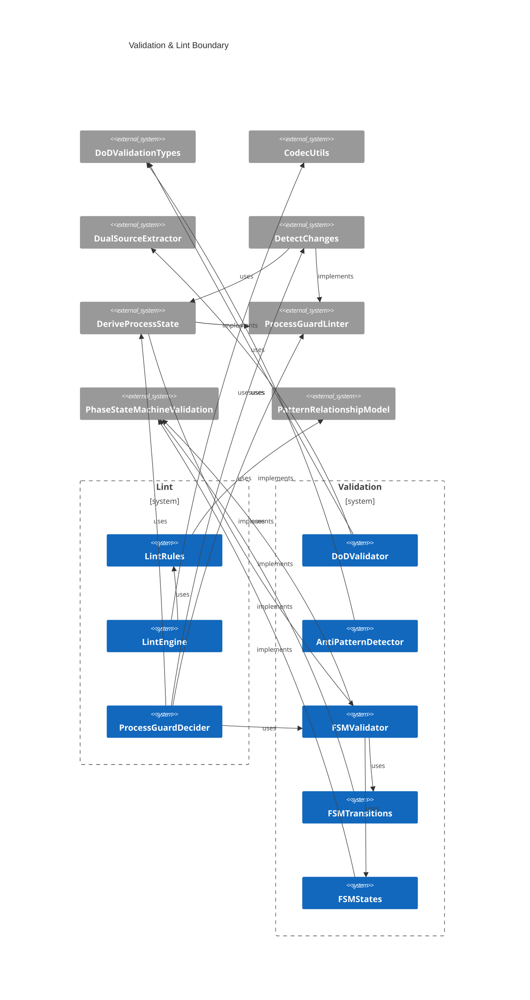
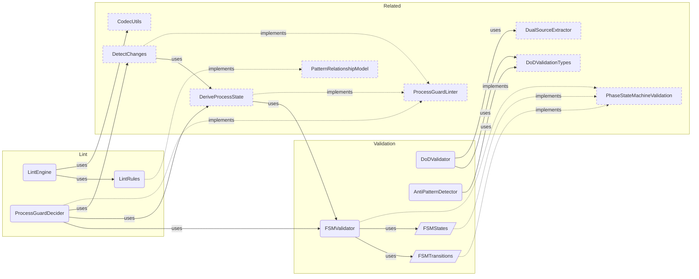

# Validation Overview

**Purpose:** Validation product area overview
**Detail Level:** Full reference

---

**How is the workflow enforced?** Validation is the enforcement boundary — it ensures that every change to annotated source files respects the delivery lifecycle rules defined by the FSM, protection levels, and scope constraints. The system operates in three layers: the FSM validator checks status transitions against a 4-state directed graph, the Process Guard orchestrates commit-time validation using a Decider pattern (state derived from annotations, not stored separately), and the lint engine provides pluggable rule execution with pretty and JSON output. Anti-pattern detection enforces dual-source ownership boundaries — `@architect-uses` belongs on TypeScript, `@architect-depends-on` belongs on Gherkin — preventing cross-domain tag confusion that causes documentation drift. Definition of Done validation ensures completed patterns have all deliverables marked done and at least one acceptance-criteria scenario.

## Key Invariants

- Protection levels: `roadmap`/`deferred` = none (fully editable), `active` = scope-locked (no new deliverables), `completed` = hard-locked (requires `@architect-unlock-reason`)
- Valid FSM transitions: Only roadmap→active, roadmap→deferred, active→completed, active→roadmap, deferred→roadmap. Completed is terminal
- Decider pattern: All validation is (state, changes, options) → result. State is derived from annotations, not maintained separately
- Dual-source ownership: Anti-pattern detection enforces tag boundaries — `uses` on TypeScript (runtime deps), `depends-on`/`quarter`/`team` on Gherkin (planning metadata). Violations are flagged before they cause documentation drift

---

## Contents

- [Key Invariants](#key-invariants)
- [Validation & Lint Boundary](#validation-lint-boundary)
- [Enforcement Pipeline](#enforcement-pipeline)
- [API Types](#api-types)
- [Business Rules](#business-rules)

---

## Validation & Lint Boundary

Scoped architecture diagram showing component relationships:



---

## Enforcement Pipeline

Scoped architecture diagram showing component relationships:



---

## API Types

### AntiPatternDetectionOptions (interface)

```typescript
/**
 * Configuration options for anti-pattern detection
 */
```

```typescript
interface AntiPatternDetectionOptions extends WithTagRegistry {
  /** Thresholds for warning triggers */
  readonly thresholds?: Partial<AntiPatternThresholds>;
}
```

| Property   | Description                     |
| ---------- | ------------------------------- |
| thresholds | Thresholds for warning triggers |

### LintRule (interface)

```typescript
/**
 * A lint rule that checks a parsed directive
 */
```

```typescript
interface LintRule {
  /** Unique rule ID */
  readonly id: string;
  /** Default severity level */
  readonly severity: LintSeverity;
  /** Human-readable rule description */
  readonly description: string;
  /**
   * Check function that returns violation(s) or null if rule passes
   *
   * @param directive - Parsed directive to check
   * @param file - Source file path
   * @param line - Line number in source
   * @param context - Optional context with pattern registry for relationship validation
   * @returns Violation(s) if rule fails, null if passes. Array for rules that can detect multiple issues.
   */
  check: (
    directive: DocDirective,
    file: string,
    line: number,
    context?: LintContext
  ) => LintViolation | LintViolation[] | null;
}
```

| Property    | Description                                                     |
| ----------- | --------------------------------------------------------------- |
| id          | Unique rule ID                                                  |
| severity    | Default severity level                                          |
| description | Human-readable rule description                                 |
| check       | Check function that returns violation(s) or null if rule passes |

### LintContext (interface)

```typescript
/**
 * Context for lint rules that need access to the full pattern registry.
 * Used for "strict mode" validation where relationships are checked
 * against known patterns.
 */
```

```typescript
interface LintContext {
  /** Set of known pattern names for relationship validation */
  readonly knownPatterns: ReadonlySet<string>;
  /** Tag registry for prefix-aware error messages (optional) */
  readonly registry?: TagRegistry;
}
```

| Property      | Description                                             |
| ------------- | ------------------------------------------------------- |
| knownPatterns | Set of known pattern names for relationship validation  |
| registry      | Tag registry for prefix-aware error messages (optional) |

### ProtectionLevel (type)

```typescript
/**
 * Protection level types for FSM states
 *
 * - `none`: Fully editable, no restrictions
 * - `scope`: Scope-locked, prevents adding new deliverables
 * - `hard`: Hard-locked, requires explicit unlock-reason annotation
 */
```

```typescript
type ProtectionLevel = 'none' | 'scope' | 'hard';
```

### isDeliverableComplete (function)

```typescript
/**
 * Check if a deliverable has "complete" status.
 *
 * This checks for the literal 'complete' status value only.
 * For DoD validation (which also accepts 'n/a' and 'superseded'),
 * see isDeliverableStatusTerminal().
 *
 * @param deliverable - The deliverable to check
 * @returns True if the deliverable status is 'complete'
 */
```

```typescript
function isDeliverableComplete(deliverable: Deliverable): boolean;
```

| Parameter   | Type | Description              |
| ----------- | ---- | ------------------------ |
| deliverable |      | The deliverable to check |

**Returns:** True if the deliverable status is 'complete'

### hasAcceptanceCriteria (function)

```typescript
/**
 * Check if a feature has @acceptance-criteria scenarios
 *
 * Scans scenarios for the @acceptance-criteria tag, which indicates
 * BDD-driven acceptance tests.
 *
 * @param feature - The scanned feature file to check
 * @returns True if at least one @acceptance-criteria scenario exists
 */
```

```typescript
function hasAcceptanceCriteria(feature: ScannedGherkinFile): boolean;
```

| Parameter | Type | Description                       |
| --------- | ---- | --------------------------------- |
| feature   |      | The scanned feature file to check |

**Returns:** True if at least one @acceptance-criteria scenario exists

### extractAcceptanceCriteriaScenarios (function)

```typescript
/**
 * Extract acceptance criteria scenario names from a feature
 *
 * @param feature - The scanned feature file
 * @returns Array of scenario names with @acceptance-criteria tag
 */
```

```typescript
function extractAcceptanceCriteriaScenarios(feature: ScannedGherkinFile): readonly string[];
```

| Parameter | Type | Description              |
| --------- | ---- | ------------------------ |
| feature   |      | The scanned feature file |

**Returns:** Array of scenario names with @acceptance-criteria tag

### validateDoDForPhase (function)

```typescript
/**
 * Validate DoD for a single phase/pattern
 *
 * Checks:
 * 1. All deliverables must be in a terminal state (complete, n/a, superseded)
 * 2. At least one @acceptance-criteria scenario exists
 *
 * @param patternName - Name of the pattern being validated
 * @param phase - Phase number being validated
 * @param feature - The scanned feature file with deliverables and scenarios
 * @returns DoD validation result
 */
```

```typescript
function validateDoDForPhase(
  patternName: string,
  phase: number,
  feature: ScannedGherkinFile
): DoDValidationResult;
```

| Parameter   | Type | Description                                              |
| ----------- | ---- | -------------------------------------------------------- |
| patternName |      | Name of the pattern being validated                      |
| phase       |      | Phase number being validated                             |
| feature     |      | The scanned feature file with deliverables and scenarios |

**Returns:** DoD validation result

### validateDoD (function)

````typescript
/**
 * Validate DoD across multiple phases
 *
 * Filters to completed phases and validates each against DoD criteria.
 * Optionally filter to specific phases using phaseFilter.
 *
 * @param features - Array of scanned feature files
 * @param phaseFilter - Optional array of phase numbers to validate (validates all if empty)
 * @returns Aggregate DoD validation summary
 *
 * @example
 * ```typescript
 * // Validate all completed phases
 * const summary = validateDoD(features);
 *
 * // Validate specific phase
 * const summary = validateDoD(features, [14]);
 * ```
 */
````

```typescript
function validateDoD(
  features: readonly ScannedGherkinFile[],
  phaseFilter: readonly number[] = []
): DoDValidationSummary;
```

| Parameter   | Type | Description                                                          |
| ----------- | ---- | -------------------------------------------------------------------- |
| features    |      | Array of scanned feature files                                       |
| phaseFilter |      | Optional array of phase numbers to validate (validates all if empty) |

**Returns:** Aggregate DoD validation summary

### formatDoDSummary (function)

```typescript
/**
 * Format DoD validation summary for console output
 *
 * @param summary - DoD validation summary to format
 * @returns Multi-line string for pretty printing
 */
```

```typescript
function formatDoDSummary(summary: DoDValidationSummary): string;
```

| Parameter | Type | Description                      |
| --------- | ---- | -------------------------------- |
| summary   |      | DoD validation summary to format |

**Returns:** Multi-line string for pretty printing

### detectAntiPatterns (function)

````typescript
/**
 * Detect all anti-patterns
 *
 * Runs all anti-pattern detectors and returns combined violations.
 *
 * @param scannedFiles - Array of scanned TypeScript files
 * @param features - Array of scanned feature files
 * @param options - Optional configuration (registry for prefix, thresholds)
 * @returns Array of all detected anti-pattern violations
 *
 * @example
 * ```typescript
 * // With default prefix (@architect-)
 * const violations = detectAntiPatterns(tsFiles, featureFiles);
 *
 * // With custom prefix
 * const registry = createDefaultTagRegistry();
 * registry.tagPrefix = "@architect-";
 * const customViolations = detectAntiPatterns(tsFiles, featureFiles, { registry });
 *
 * for (const v of violations) {
 *   console.log(`[${v.severity.toUpperCase()}] ${v.id}: ${v.message}`);
 * }
 * ```
 */
````

```typescript
function detectAntiPatterns(
  scannedFiles: readonly ScannedFile[],
  features: readonly ScannedGherkinFile[],
  options: AntiPatternDetectionOptions = {}
): AntiPatternViolation[];
```

| Parameter    | Type | Description                                              |
| ------------ | ---- | -------------------------------------------------------- |
| scannedFiles |      | Array of scanned TypeScript files                        |
| features     |      | Array of scanned feature files                           |
| options      |      | Optional configuration (registry for prefix, thresholds) |

**Returns:** Array of all detected anti-pattern violations

### detectProcessInCode (function)

```typescript
/**
 * Detect process metadata in code anti-pattern
 *
 * Finds process tracking annotations (e.g., @architect-quarter, @architect-team, etc.)
 * in TypeScript files. Process metadata belongs in feature files.
 *
 * @param scannedFiles - Array of scanned TypeScript files
 * @param registry - Optional tag registry for prefix-aware detection (defaults to @architect-)
 * @returns Array of anti-pattern violations
 */
```

```typescript
function detectProcessInCode(
  scannedFiles: readonly ScannedFile[],
  registry?: TagRegistry
): AntiPatternViolation[];
```

| Parameter    | Type | Description                                                                |
| ------------ | ---- | -------------------------------------------------------------------------- |
| scannedFiles |      | Array of scanned TypeScript files                                          |
| registry     |      | Optional tag registry for prefix-aware detection (defaults to @architect-) |

**Returns:** Array of anti-pattern violations

### detectRemovedTags (function)

```typescript
/**
 * Detect removed tags in feature files
 *
 * Finds tags that were removed from the registry but still appear in source files.
 * These tags are silently discarded by the scanner, causing data loss without
 * any diagnostic. This detector makes the failure explicit.
 *
 * @param features - Array of scanned feature files
 * @param registry - Optional tag registry for prefix-aware detection (defaults to @architect-)
 * @returns Array of anti-pattern violations
 */
```

```typescript
function detectRemovedTags(
  features: readonly ScannedGherkinFile[],
  registry?: TagRegistry
): AntiPatternViolation[];
```

| Parameter | Type | Description                                                                |
| --------- | ---- | -------------------------------------------------------------------------- |
| features  |      | Array of scanned feature files                                             |
| registry  |      | Optional tag registry for prefix-aware detection (defaults to @architect-) |

**Returns:** Array of anti-pattern violations

### detectMagicComments (function)

```typescript
/**
 * Detect magic comments anti-pattern
 *
 * Finds generator hints like "# GENERATOR:", "# PARSER:" in feature files.
 * These create tight coupling between features and generators.
 *
 * @param features - Array of scanned feature files
 * @param threshold - Maximum magic comments before warning (default: 5)
 * @returns Array of anti-pattern violations
 */
```

```typescript
function detectMagicComments(
  features: readonly ScannedGherkinFile[],
  threshold: number = DEFAULT_THRESHOLDS.magicCommentThreshold
): AntiPatternViolation[];
```

| Parameter | Type | Description                                        |
| --------- | ---- | -------------------------------------------------- |
| features  |      | Array of scanned feature files                     |
| threshold |      | Maximum magic comments before warning (default: 5) |

**Returns:** Array of anti-pattern violations

### detectScenarioBloat (function)

```typescript
/**
 * Detect scenario bloat anti-pattern
 *
 * Finds feature files with too many scenarios, which indicates poor
 * organization and slows test suites.
 *
 * @param features - Array of scanned feature files
 * @param threshold - Maximum scenarios before warning (default: 20)
 * @returns Array of anti-pattern violations
 */
```

```typescript
function detectScenarioBloat(
  features: readonly ScannedGherkinFile[],
  threshold: number = DEFAULT_THRESHOLDS.scenarioBloatThreshold
): AntiPatternViolation[];
```

| Parameter | Type | Description                                    |
| --------- | ---- | ---------------------------------------------- |
| features  |      | Array of scanned feature files                 |
| threshold |      | Maximum scenarios before warning (default: 20) |

**Returns:** Array of anti-pattern violations

### detectMegaFeature (function)

```typescript
/**
 * Detect mega-feature anti-pattern
 *
 * Finds feature files that are too large, which makes them hard to
 * maintain and review.
 *
 * @param features - Array of scanned feature files
 * @param threshold - Maximum lines before warning (default: 500)
 * @returns Array of anti-pattern violations
 */
```

```typescript
function detectMegaFeature(
  features: readonly ScannedGherkinFile[],
  threshold: number = DEFAULT_THRESHOLDS.megaFeatureLineThreshold
): AntiPatternViolation[];
```

| Parameter | Type | Description                                 |
| --------- | ---- | ------------------------------------------- |
| features  |      | Array of scanned feature files              |
| threshold |      | Maximum lines before warning (default: 500) |

**Returns:** Array of anti-pattern violations

### formatAntiPatternReport (function)

```typescript
/**
 * Format anti-pattern violations for console output
 *
 * @param violations - Array of violations to format
 * @returns Multi-line string for pretty printing
 */
```

```typescript
function formatAntiPatternReport(violations: AntiPatternViolation[]): string;
```

| Parameter  | Type | Description                   |
| ---------- | ---- | ----------------------------- |
| violations |      | Array of violations to format |

**Returns:** Multi-line string for pretty printing

### toValidationIssues (function)

```typescript
/**
 * Convert anti-pattern violations to ValidationIssue format
 *
 * For integration with the existing validate-patterns CLI.
 */
```

```typescript
function toValidationIssues(violations: readonly AntiPatternViolation[]): Array<{
  severity: 'error' | 'warning' | 'info';
  message: string;
  source: 'typescript' | 'gherkin' | 'cross-source';
  pattern?: string;
  file?: string;
}>;
```

### filterRulesBySeverity (function)

```typescript
/**
 * Get rules filtered by minimum severity
 *
 * @param rules - Rules to filter
 * @param minSeverity - Minimum severity to include
 * @returns Filtered rules
 */
```

```typescript
function filterRulesBySeverity(rules: readonly LintRule[], minSeverity: LintSeverity): LintRule[];
```

| Parameter   | Type | Description                 |
| ----------- | ---- | --------------------------- |
| rules       |      | Rules to filter             |
| minSeverity |      | Minimum severity to include |

**Returns:** Filtered rules

### isValidTransition (function)

````typescript
/**
 * Check if a transition between two states is valid
 *
 * @param from - Current status
 * @param to - Target status
 * @returns true if the transition is allowed
 *
 * @example
 * ```typescript
 * isValidTransition("roadmap", "active"); // → true
 * isValidTransition("roadmap", "completed"); // → false (must go through active)
 * isValidTransition("completed", "active"); // → false (terminal state)
 * ```
 */
````

```typescript
function isValidTransition(from: ProcessStatusValue, to: ProcessStatusValue): boolean;
```

| Parameter | Type | Description    |
| --------- | ---- | -------------- |
| from      |      | Current status |
| to        |      | Target status  |

**Returns:** true if the transition is allowed

### getValidTransitionsFrom (function)

````typescript
/**
 * Get all valid transitions from a given state
 *
 * @param status - Current status
 * @returns Array of valid target states (empty for terminal states)
 *
 * @example
 * ```typescript
 * getValidTransitionsFrom("roadmap"); // → ["active", "deferred", "roadmap"]
 * getValidTransitionsFrom("completed"); // → []
 * ```
 */
````

```typescript
function getValidTransitionsFrom(status: ProcessStatusValue): readonly ProcessStatusValue[];
```

| Parameter | Type | Description    |
| --------- | ---- | -------------- |
| status    |      | Current status |

**Returns:** Array of valid target states (empty for terminal states)

### getTransitionErrorMessage (function)

````typescript
/**
 * Get a human-readable description of why a transition is invalid
 *
 * @param from - Current status
 * @param to - Attempted target status
 * @param options - Optional message options with registry for prefix
 * @returns Error message describing the violation
 *
 * @example
 * ```typescript
 * getTransitionErrorMessage("roadmap", "completed");
 * // → "Cannot transition from 'roadmap' to 'completed'. Must go through 'active' first."
 *
 * getTransitionErrorMessage("completed", "active");
 * // → "Cannot transition from 'completed' (terminal state). Use unlock-reason tag to modify."
 * ```
 */
````

```typescript
function getTransitionErrorMessage(
  from: ProcessStatusValue,
  to: ProcessStatusValue,
  options?: TransitionMessageOptions
): string;
```

| Parameter | Type | Description                                       |
| --------- | ---- | ------------------------------------------------- |
| from      |      | Current status                                    |
| to        |      | Attempted target status                           |
| options   |      | Optional message options with registry for prefix |

**Returns:** Error message describing the violation

### getProtectionLevel (function)

````typescript
/**
 * Get the protection level for a status
 *
 * @param status - Process status value
 * @returns Protection level for the status
 *
 * @example
 * ```typescript
 * getProtectionLevel("active"); // → "scope"
 * getProtectionLevel("completed"); // → "hard"
 * ```
 */
````

```typescript
function getProtectionLevel(status: ProcessStatusValue): ProtectionLevel;
```

| Parameter | Type | Description          |
| --------- | ---- | -------------------- |
| status    |      | Process status value |

**Returns:** Protection level for the status

### isTerminalState (function)

````typescript
/**
 * Check if a status is a terminal state (cannot transition out)
 *
 * Terminal states require explicit unlock to modify.
 *
 * @param status - Process status value
 * @returns true if the status is terminal
 *
 * @example
 * ```typescript
 * isTerminalState("completed"); // → true
 * isTerminalState("active"); // → false
 * ```
 */
````

```typescript
function isTerminalState(status: ProcessStatusValue): boolean;
```

| Parameter | Type | Description          |
| --------- | ---- | -------------------- |
| status    |      | Process status value |

**Returns:** true if the status is terminal

### isFullyEditable (function)

```typescript
/**
 * Check if a status is fully editable (no protection)
 *
 * @param status - Process status value
 * @returns true if the status has no protection
 */
```

```typescript
function isFullyEditable(status: ProcessStatusValue): boolean;
```

| Parameter | Type | Description          |
| --------- | ---- | -------------------- |
| status    |      | Process status value |

**Returns:** true if the status has no protection

### isScopeLocked (function)

```typescript
/**
 * Check if a status is scope-locked
 *
 * @param status - Process status value
 * @returns true if the status prevents scope changes
 */
```

```typescript
function isScopeLocked(status: ProcessStatusValue): boolean;
```

| Parameter | Type | Description          |
| --------- | ---- | -------------------- |
| status    |      | Process status value |

**Returns:** true if the status prevents scope changes

### validateChanges (function)

````typescript
/**
 * Validate changes against process rules.
 *
 * Pure function following the Decider pattern:
 * - Takes all inputs explicitly (no hidden state)
 * - Returns result without side effects
 * - Emits events for observability
 *
 * @param input - Complete input including state, changes, and options
 * @returns DeciderOutput with validation result and events
 *
 * @example
 * ```typescript
 * const output = validateChanges({
 *   state: processState,
 *   changes: changeDetection,
 *   options: { strict: false, ignoreSession: false },
 * });
 *
 * if (!output.result.valid) {
 *   console.log('Violations:', output.result.violations);
 * }
 * ```
 */
````

```typescript
function validateChanges(input: DeciderInput): DeciderOutput;
```

| Parameter | Type | Description                                          |
| --------- | ---- | ---------------------------------------------------- |
| input     |      | Complete input including state, changes, and options |

**Returns:** DeciderOutput with validation result and events

### defaultRules (const)

```typescript
/**
 * All default lint rules
 *
 * Order matters for output - errors first, then warnings, then info.
 */
```

```typescript
const defaultRules: readonly LintRule[];
```

### severityOrder (const)

```typescript
/**
 * Severity ordering for sorting and filtering
 * Exported for use by lint engine to avoid duplication
 */
```

```typescript
const severityOrder: Record<LintSeverity, number>;
```

### missingPatternName (const)

```typescript
/**
 * Rule: missing-pattern-name
 *
 * Patterns must have an explicit name via the pattern tag.
 * Without a name, the pattern can't be referenced in relationships
 * or indexed properly.
 */
```

```typescript
const missingPatternName: LintRule;
```

---

## Business Rules

23 patterns, 103 rules with invariants (103 total)

### Anti Pattern Detector Testing

| Rule                                                  | Invariant                                                                                                                                     | Rationale                                                                                                                                                                     |
| ----------------------------------------------------- | --------------------------------------------------------------------------------------------------------------------------------------------- | ----------------------------------------------------------------------------------------------------------------------------------------------------------------------------- |
| Process metadata should not appear in TypeScript code | Process metadata tags (@architect-status, @architect-phase, etc.) must only appear in Gherkin feature files, never in TypeScript source code. | TypeScript owns runtime behavior while Gherkin owns delivery process metadata — mixing them creates dual-source conflicts and validation ambiguity.                           |
| Generator hints should not appear in feature files    | Feature files must not contain generator magic comments beyond a configurable threshold.                                                      | Generator hints are implementation details that belong in TypeScript — excessive magic comments in specs indicate leaking implementation concerns into business requirements. |
| Feature files should not have excessive scenarios     | A single feature file must not exceed the configured maximum scenario count.                                                                  | Oversized feature files indicate missing decomposition — they become hard to maintain and slow to execute.                                                                    |
| Feature files should not exceed size thresholds       | A single feature file must not exceed the configured maximum line count.                                                                      | Excessively large files indicate a feature that should be split into focused, independently testable specifications.                                                          |
| All anti-patterns can be detected in one pass         | The anti-pattern detector must evaluate all registered rules in a single scan pass over the source files.                                     | Single-pass detection ensures consistent results and avoids O(n\*m) performance degradation with multiple file traversals.                                                    |
| Violations can be formatted for console output        | Anti-pattern violations must be renderable as grouped, human-readable console output.                                                         | Developers need actionable feedback at commit time — ungrouped or unformatted violations are hard to triage and fix.                                                          |

### Codec Utils Validation

| Rule                                                   | Invariant                                                                                                                                                                   | Rationale                                                                                                                                                         |
| ------------------------------------------------------ | --------------------------------------------------------------------------------------------------------------------------------------------------------------------------- | ----------------------------------------------------------------------------------------------------------------------------------------------------------------- |
| createJsonInputCodec parses and validates JSON strings | createJsonInputCodec returns an ok Result when the input is valid JSON that conforms to the provided Zod schema, and an err Result with a descriptive CodecError otherwise. | Combining JSON parsing and schema validation into a single operation eliminates the class of bugs where parsed-but-invalid data leaks into the application.       |
| formatCodecError formats errors for display            | formatCodecError always returns a non-empty string that includes the operation type and message, and appends validation errors when present.                                | Consistent error formatting across all codec consumers avoids duplicated formatting logic and ensures error messages always contain enough context for debugging. |

### Config Schema Validation

| Rule                                                    | Invariant                                                                                                                                            | Rationale                                                                                                                                                      |
| ------------------------------------------------------- | ---------------------------------------------------------------------------------------------------------------------------------------------------- | -------------------------------------------------------------------------------------------------------------------------------------------------------------- |
| ScannerConfigSchema validates scanner configuration     | Scanner configuration must contain at least one valid glob pattern with no parent directory traversal, and baseDir must resolve to an absolute path. | Malformed or malicious glob patterns could scan outside project boundaries, exposing sensitive files.                                                          |
| GeneratorConfigSchema validates generator configuration | Generator configuration must use a .json registry file and an output directory that does not escape the project root via parent traversal.           | Non-JSON registry files could introduce parsing vulnerabilities, and unrestricted output paths could overwrite files outside the project.                      |
| isScannerConfig type guard narrows unknown values       | isScannerConfig returns true only for objects that have a non-empty patterns array and a string baseDir.                                             | Without a reliable type guard, callers cannot safely narrow unknown config objects and risk accessing properties on incompatible types at runtime.             |
| isGeneratorConfig type guard narrows unknown values     | isGeneratorConfig returns true only for objects that have a string outputDir and a .json registryPath.                                               | Without a reliable type guard, callers cannot safely narrow unknown config objects and risk passing malformed generator configs that bypass schema validation. |

### Detect Changes Testing

| Rule                                                       | Invariant                                                                                                                                       | Rationale                                                                                                                                                              |
| ---------------------------------------------------------- | ----------------------------------------------------------------------------------------------------------------------------------------------- | ---------------------------------------------------------------------------------------------------------------------------------------------------------------------- |
| Status changes are detected as modifications not additions | When a deliverable's status value changes between versions, the change detector must classify it as a modification, not an addition or removal. | Correct change classification drives scope-creep detection — misclassifying a status change as an addition would trigger false scope-creep violations on active specs. |
| New deliverables are detected as additions                 | Deliverables present in the new version but absent in the old version must be classified as additions.                                          | Addition detection powers the scope-creep rule — new deliverables added to active specs must be flagged as violations.                                                 |
| Removed deliverables are detected as removals              | Deliverables present in the old version but absent in the new version must be classified as removals.                                           | Removal detection enables the deliverable-removed warning — silently dropping deliverables could hide incomplete work.                                                 |
| Mixed changes are correctly categorized                    | When a single diff contains additions, removals, and modifications simultaneously, each change must be independently categorized.               | Real-world commits often contain mixed changes — incorrect categorization of any single change cascades into wrong validation decisions.                               |
| Non-deliverable tables are ignored                         | Changes to non-deliverable tables (e.g., ScenarioOutline Examples tables) must not be detected as deliverable changes.                          | Feature files contain many table structures — only the Background deliverables table is semantically relevant to process guard validation.                             |

### DoD Validator Testing

| Rule                                                         | Invariant                                                                                                                                  | Rationale                                                                                                                                |
| ------------------------------------------------------------ | ------------------------------------------------------------------------------------------------------------------------------------------ | ---------------------------------------------------------------------------------------------------------------------------------------- |
| Deliverable completion uses canonical status taxonomy        | Deliverable completion status must be determined exclusively using the 6 canonical values from the deliverable status taxonomy.            | Freeform status strings bypass schema validation and produce inconsistent completion tracking across the monorepo.                       |
| Acceptance criteria must be tagged with @acceptance-criteria | Every completed pattern must have at least one scenario tagged with @acceptance-criteria in its feature file.                              | Without explicit acceptance criteria tags, there is no machine-verifiable proof that the delivered work meets its requirements.          |
| Acceptance criteria scenarios can be extracted by name       | The validator must be able to extract scenario names from @acceptance-criteria-tagged scenarios for reporting.                             | Extracted names appear in traceability reports and DoD summaries, providing an audit trail from requirement to verification.             |
| DoD requires all deliverables complete and AC present        | A pattern passes Definition of Done only when ALL deliverables have complete status AND at least one @acceptance-criteria scenario exists. | Partial completion or missing acceptance criteria means the pattern is not verified — marking it complete would bypass quality gates.    |
| DoD can be validated across multiple completed phases        | DoD validation must evaluate all completed phases independently and report per-phase pass/fail results.                                    | Multi-phase patterns need granular validation — a single aggregate result would hide which specific phase failed its Definition of Done. |
| Summary can be formatted for console output                  | DoD validation results must be renderable as structured console output showing phase-level pass/fail details.                              | Developers need immediate, actionable feedback during pre-commit validation — raw data structures are not human-readable.                |

### FSM Validator Testing

| Rule                                           | Invariant                                                                                                                                                 | Rationale                                                                                                                                       |
| ---------------------------------------------- | --------------------------------------------------------------------------------------------------------------------------------------------------------- | ----------------------------------------------------------------------------------------------------------------------------------------------- |
| Status values must be valid PDR-005 FSM states | Every pattern status value must be one of the states defined in the PDR-005 finite state machine (roadmap, active, completed, deferred).                  | Invalid status values bypass FSM transition validation and produce undefined behavior in process guard enforcement.                             |
| Status transitions must follow FSM rules       | Every status change must follow a valid edge in the PDR-005 state machine graph — no skipping states or invalid paths.                                    | The FSM encodes the delivery workflow contract — invalid transitions indicate process violations that could corrupt delivery tracking.          |
| Completed patterns should have proper metadata | Patterns in completed status must carry completion date and actual effort metadata to pass validation without warnings.                                   | Completion metadata enables retrospective analysis and effort estimation — missing metadata degrades project planning accuracy over time.       |
| Protection levels match FSM state definitions  | Each FSM state must map to exactly one protection level (none, scope-locked, or hard-locked) as defined in PDR-005.                                       | Protection levels enforce edit constraints per state — mismatched protection would allow prohibited modifications to active or completed specs. |
| Combined validation provides complete results  | The FSM validator must return a combined result including status validity, transition validity, metadata warnings, and protection level in a single call. | Callers need a complete validation picture — requiring multiple separate calls risks partial validation and inconsistent error reporting.       |

### Lint Engine Testing

| Rule                                                                  | Invariant                                                                                                                                                       | Rationale                                                                                                                                                                           |
| --------------------------------------------------------------------- | --------------------------------------------------------------------------------------------------------------------------------------------------------------- | ----------------------------------------------------------------------------------------------------------------------------------------------------------------------------------- |
| Single directive linting validates annotations against rules          | Every directive is checked against all provided rules and violations include source location.                                                                   | Skipping rules or omitting source locations makes violations unactionable, as developers cannot locate or understand the issue.                                                     |
| Multi-file batch linting aggregates results across files              | All files and directives are scanned, violations are collected per file, and severity counts are accurate.                                                      | Missing files or inaccurate severity counts cause silent rule violations in CI and undermine trust in the linting pipeline.                                                         |
| Failure detection respects strict mode for severity escalation        | Errors always indicate failure. Warnings only indicate failure in strict mode. Info never indicates failure.                                                    | Without correct severity-to-exit-code mapping, CI pipelines either miss real errors or block on informational messages, eroding developer trust in the linter.                      |
| Violation sorting orders by severity then by line number              | Sorted output places errors first, then warnings, then info, with stable line-number ordering within each severity. Sorting does not mutate the original array. | Unsorted output forces developers to manually scan for critical errors among lower-severity noise, and mutating the original array would break callers that hold a reference to it. |
| Pretty formatting produces human-readable output with severity counts | Pretty output includes file paths, line numbers, severity labels, rule IDs, and summary counts. Quiet mode suppresses non-error violations.                     | Incomplete formatting (missing file paths or line numbers) prevents developers from navigating directly to violations, and noisy output in quiet mode defeats its purpose.          |
| JSON formatting produces machine-readable output with full details    | JSON output is valid, includes all summary fields, and preserves violation details including file, line, severity, rule, and message.                           | Machine consumers (CI pipelines, IDE integrations) depend on valid JSON with complete fields; missing or malformed output breaks automated tooling downstream.                      |

### Linter Validation Testing

| Rule                                                  | Invariant                                                                                                                 | Rationale                                                                                                                                          |
| ----------------------------------------------------- | ------------------------------------------------------------------------------------------------------------------------- | -------------------------------------------------------------------------------------------------------------------------------------------------- |
| Pattern cannot implement itself (circular reference)  | A pattern's implements tag must reference a different pattern than its own pattern tag.                                   | Self-implementing patterns create circular references that break the sub-pattern hierarchy.                                                        |
| Relationship targets should exist (strict mode)       | Every relationship target must reference a pattern that exists in the known pattern registry when strict mode is enabled. | Dangling references to non-existent patterns produce broken dependency graphs and misleading documentation.                                        |
| Bidirectional traceability links should be consistent | Every forward traceability link (executable-specs, roadmap-spec) must have a corresponding back-link in the target file.  | Asymmetric links mean one side of the traceability chain is invisible, defeating the purpose of bidirectional tracing.                             |
| Parent references must be valid                       | A pattern's parent reference must point to an existing epic pattern in the registry.                                      | Dangling parent references break the epic-to-pattern hierarchy, causing patterns to appear orphaned in roadmap views and losing rollup visibility. |

### Lint Rule Advanced Testing

| Rule                                                  | Invariant                                                                                                        | Rationale                                                                                                        |
| ----------------------------------------------------- | ---------------------------------------------------------------------------------------------------------------- | ---------------------------------------------------------------------------------------------------------------- |
| Descriptions must not repeat the pattern name         | A description that merely echoes the pattern name adds no value and must be rejected.                            | Tautological descriptions waste reader attention and indicate missing documentation effort.                      |
| Default rules collection is complete and well-ordered | The default rules collection must contain all defined rules with unique IDs, ordered by severity (errors first). | A complete, ordered collection ensures no rule is silently dropped and severity-based filtering works correctly. |
| Rules can be filtered by minimum severity             | Filtering by severity must return only rules at or above the specified level.                                    | CI pipelines need to control which violations block merges vs. which are advisory.                               |

### Lint Rule Individual Testing

| Rule                                          | Invariant                                                                                                            | Rationale                                                                                               |
| --------------------------------------------- | -------------------------------------------------------------------------------------------------------------------- | ------------------------------------------------------------------------------------------------------- |
| Files must declare an explicit pattern name   | Every annotated file must have a non-empty patternName to be identifiable in the registry.                           | Without a pattern name, the file cannot be tracked, linked, or referenced in generated documentation.   |
| Files should declare a lifecycle status       | Every annotated file should have a status tag to track its position in the delivery lifecycle.                       | Missing status prevents FSM validation and roadmap tracking.                                            |
| Files must use canonical FSM status values    | Annotated files may use only the canonical PDR-005 FSM statuses: roadmap, active, completed, deferred.               | Legacy aliases hide process drift and break a single-source-of-truth workflow model.                    |
| Files should document when to use the pattern | Annotated files should include whenToUse guidance so consumers know when to apply the pattern.                       | Without usage guidance, patterns become undiscoverable despite being documented.                        |
| Files should declare relationship tags        | Annotated files should declare uses or usedBy relationships to enable dependency tracking and architecture diagrams. | Isolated patterns without relationships produce diagrams with no edges and prevent dependency analysis. |

### Phase Numbering Conventions

| Rule                                          | Invariant                                                                                   | Rationale                                                                                                                                          |
| --------------------------------------------- | ------------------------------------------------------------------------------------------- | -------------------------------------------------------------------------------------------------------------------------------------------------- |
| Phase numbers must be unique within a release | No two specs within the same release version may share the same phase number.               | Duplicate phase numbers create ambiguous ordering, causing unpredictable generation output and incorrect roadmap sequencing.                       |
| Phase number gaps are detected                | Large gaps in the phase number sequence must produce warnings during validation.            | Undetected gaps signal accidentally skipped or orphaned specs, leading to misleading roadmap progress and hidden incomplete work.                  |
| CLI suggests next available phase number      | The suggested phase number must not conflict with any existing phase in the target release. | Without automated suggestion, authors manually guess the next number, frequently picking duplicates that are only caught later at validation time. |

### Phase State Machine Validation

| Rule                                          | Invariant                                                                                       | Rationale                                                                                                                               |
| --------------------------------------------- | ----------------------------------------------------------------------------------------------- | --------------------------------------------------------------------------------------------------------------------------------------- |
| Valid status values are enforced              | Phase status must be one of the four canonical values: roadmap, active, completed, or deferred. | Freeform status strings bypass FSM transition enforcement and produce undefined behavior in downstream generators and validators.       |
| Status transitions follow state machine rules | Every status transition must follow a permitted edge in the FSM transition matrix.              | Skipping states (e.g., roadmap to completed) breaks scope-lock enforcement and allows incomplete deliverables to reach terminal status. |
| Terminal states require completion metadata   | Phases reaching completed status must carry a completion date and actual effort tag.            | Without completion metadata, effort variance tracking and timeline reporting produce gaps that undermine delivery process visibility.   |

### Process Guard Linter

| Rule                                                  | Invariant                                                                                                                                                            | Rationale                                                                                                                                             |
| ----------------------------------------------------- | -------------------------------------------------------------------------------------------------------------------------------------------------------------------- | ----------------------------------------------------------------------------------------------------------------------------------------------------- |
| Protection levels determine modification restrictions | Every file's modification restrictions are determined solely by its `@architect-status` tag, with `completed` requiring an explicit unlock reason for any change.    | Without status-derived protection, completed and approved work can be silently overwritten by bulk edits or accidental modifications.                 |
| Session definition files scope what can be modified   | When an active session exists, only specs explicitly listed in the session definition may be modified without warning, and excluded specs cannot be modified at all. | Without session scoping, bulk operations and context switches cause unintended modifications to specs outside the current work focus.                 |
| Status transitions follow PDR-005 FSM                 | Every status change must follow a valid edge in the PDR-005 finite state machine; no transition may skip intermediate states.                                        | Skipping states (e.g., `roadmap` directly to `completed`) bypasses scope-locking and review gates, allowing incomplete work to be marked as done.     |
| Active specs cannot add new deliverables              | The deliverables table of an `active` spec is immutable with respect to new rows; only existing deliverable statuses may change.                                     | Adding deliverables after work has begun constitutes scope creep, undermining effort estimates and blocking completion.                               |
| CLI provides flexible validation modes                | The CLI must support both pre-commit (staged-only) and CI (all-files) validation modes with deterministic exit codes reflecting violation severity.                  | Without flexible modes, teams cannot integrate process guard into both local developer workflows and CI pipelines with appropriate strictness levels. |
| Integrates with existing lint infrastructure          | Process guard output format and exit code semantics must be consistent with the existing `lint-patterns` tool.                                                       | Inconsistent output formats force consumers to maintain separate parsers, and inconsistent exit codes break combined lint pipelines.                  |
| New tags support process guard functionality          | Session and protection tags must be registered in the TypeScript taxonomy with defined formats before use in feature files.                                          | Unregistered tags bypass schema validation and are silently ignored by the scanner, causing process guard rules to fail without diagnostics.          |

### Process Guard Testing

| Rule                                                | Invariant                                                                                                       | Rationale                                                                                              |
| --------------------------------------------------- | --------------------------------------------------------------------------------------------------------------- | ------------------------------------------------------------------------------------------------------ |
| Completed files require unlock-reason to modify     | A completed spec file cannot be modified unless it carries an @architect-unlock-reason tag.                     | Completed work represents validated, shipped functionality — accidental modification risks regression. |
| Status transitions must follow PDR-005 FSM          | Status changes must follow the directed graph: roadmap->active->completed, roadmap<->deferred, active->roadmap. | The FSM prevents skipping required stages (e.g., roadmap->completed bypasses implementation).          |
| Active specs cannot add new deliverables            | A spec in active status cannot have deliverables added that were not present when it entered active.            | Scope-locking active work prevents mid-sprint scope creep that derails delivery commitments.           |
| Files outside active session scope trigger warnings | Files modified outside the active session's declared scope produce a session-scope warning.                     | Session scoping keeps focus on planned work and makes accidental cross-cutting changes visible.        |
| Explicitly excluded files trigger errors            | Files explicitly excluded from a session cannot be modified, producing a session-excluded error.                | Exclusion is stronger than scope — it marks files that must NOT be touched during this session.        |
| Multiple rules validate independently               | Each validation rule evaluates independently — a single file can produce violations from multiple rules.        | Independent evaluation ensures no rule masks another, giving complete diagnostic output.               |

### Release Association Rules

| Rule                                                  | Invariant                                                                                                         | Rationale                                                                                                                                            |
| ----------------------------------------------------- | ----------------------------------------------------------------------------------------------------------------- | ---------------------------------------------------------------------------------------------------------------------------------------------------- |
| Spec files must not contain release columns           | Spec file DataTables must never include a Release column; release metadata belongs exclusively in phase files.    | Mixing release metadata into specs couples planning artifacts to release timing, violating the separation defined by PDR-003.                        |
| TypeScript phase files must have required annotations | Every TypeScript phase file must include @architect-pattern, @architect-phase, and @architect-status annotations. | Missing required annotations cause phase files to be invisible to the scanner, producing incomplete roadmap projections and broken cross-references. |
| Release version follows semantic versioning           | All release version identifiers must conform to the `vX.Y.Z` semantic versioning format.                          | Non-semver version strings break downstream tooling that relies on version ordering and comparison for release planning.                             |

### Status Aware Eslint Suppression

| Rule                                              | Invariant                                                                                                                                                       | Rationale                                                                                                                                                                                                                                   |
| ------------------------------------------------- | --------------------------------------------------------------------------------------------------------------------------------------------------------------- | ------------------------------------------------------------------------------------------------------------------------------------------------------------------------------------------------------------------------------------------- |
| File status determines unused-vars enforcement    | Files with `@architect-status roadmap` or `deferred` have relaxed unused-vars rules. Files with `active`, `completed`, or no status have strict enforcement.    | Design artifacts (roadmap stubs) define API shapes that are intentionally unused until implementation. Relaxing rules for these files prevents false positives while ensuring implemented code (active/completed) remains strictly checked. |
| Reuses deriveProcessState for status extraction   | Status extraction logic must be shared with Process Guard Linter. No duplicate parsing or status-to-protection mapping.                                         | DRY principle - the Process Guard already has battle-tested status extraction from JSDoc comments. Duplicating this logic creates maintenance burden and potential inconsistencies between tools.                                           |
| ESLint Processor filters messages based on status | The processor uses ESLint's postprocess hook to filter or downgrade messages. Source code is never modified. No eslint-disable comments are injected.           | ESLint processors can inspect and filter linting messages after rules run. This approach: - Requires no source code modification - Works with any ESLint rule (not just no-unused-vars) - Can be extended to other status-based behaviors   |
| CLI can generate static ESLint ignore list        | Running `pnpm lint:process --eslint-ignores` outputs a list of files that should have relaxed linting, suitable for inclusion in eslint.config.js.              | For CI environments or users preferring static configuration, a generated list provides an alternative to runtime processing. The list can be regenerated whenever status annotations change.                                               |
| Replaces directory-based ESLint exclusions        | After implementation, the directory-based exclusions in eslint.config.js (lines 30-57) are removed. All suppression is driven by @architect-status annotations. | Directory-based exclusions are tech debt: - They don't account for file lifecycle (roadmap -> completed) - They require manual updates when new roadmap directories are added - They persist even after files are implemented               |
| Rule relaxation is configurable                   | The set of rules relaxed for roadmap/deferred files is configurable, defaulting to `@typescript-eslint/no-unused-vars`.                                         | Different projects may want to relax different rules for design artifacts. The default covers the common case (unused exports in API stubs).                                                                                                |

### Status Transition Detection Testing

| Rule                                                 | Invariant                                                                                                                                | Rationale                                                                                                                                       |
| ---------------------------------------------------- | ---------------------------------------------------------------------------------------------------------------------------------------- | ----------------------------------------------------------------------------------------------------------------------------------------------- |
| Status transitions are detected from file-level tags | Status transitions must be detected by comparing @architect-status tags at the file level between the old and new versions of a file.    | File-level tags are the canonical source of pattern status — detecting transitions from tags ensures consistency with the FSM validator.        |
| Status tags inside docstrings are ignored            | Status tags appearing inside Gherkin docstring blocks (between triple-quote delimiters) must not be treated as real status declarations. | Docstrings often contain example code or documentation showing status tags — parsing these as real would cause phantom status transitions.      |
| First valid status tag outside docstrings is used    | When multiple status tags appear outside docstrings, only the first one determines the file's status.                                    | A single canonical status per file prevents ambiguity — using the first tag matches Gherkin convention where file-level tags appear at the top. |
| Line numbers are tracked from hunk headers           | Detected status transitions must include the line number where the status tag appears, derived from git diff hunk headers.               | Line numbers enable precise error reporting — developers need to know exactly where in the file the transition was detected.                    |
| Generated documentation directories are excluded     | Files in generated documentation directories (docs-generated/, docs-living/) must be excluded from status transition detection.          | Generated files are projections of source files — detecting transitions in them would produce duplicate violations and false positives.         |

### Step Lint Extended Rules

| Rule                                                     | Invariant                                                                                                                                                                                                                                                                                                            | Rationale                                                                                                                                                                                                                                                       |
| -------------------------------------------------------- | -------------------------------------------------------------------------------------------------------------------------------------------------------------------------------------------------------------------------------------------------------------------------------------------------------------------- | --------------------------------------------------------------------------------------------------------------------------------------------------------------------------------------------------------------------------------------------------------------- |
| Hash in step text is detected                            | A hash character in the middle of a Gherkin step line can be interpreted as a comment by some parsers, silently truncating the step text. This differs from hash-in-description (which catches hash inside description pseudo-code-blocks).                                                                          | We encountered this exact trap while writing the lint-steps test suite. Step text like "Given a file with # inside" was silently truncated to "Given a file with".                                                                                              |
| Gherkin keywords in description text are detected        | A Feature or Rule description line that starts with Given, When, Then, And, or But breaks the Gherkin parser because it interprets the line as a step definition rather than description text.                                                                                                                       | This is documented in vitest-cucumber quirks but has no static detection. Authors writing natural language descriptions accidentally start sentences with these keywords.                                                                                       |
| Scenario Outline steps with quoted values are detected   | When a feature file has a Scenario Outline and its steps use quoted values instead of angle-bracket placeholders, this indicates the author may be using the Scenario pattern (function params) instead of the ScenarioOutline pattern (variables object). This is the feature-file side of the Two-Pattern Problem. | The existing scenario-outline-function-params rule catches the step-file side. This rule catches the feature-file side where quoted values in Scenario Outline steps suggest the author expects Cucumber expression matching rather than variable substitution. |
| Repeated step patterns in the same scenario are detected | Registering the same step pattern twice in one Scenario block causes vitest-cucumber to overwrite the first registration. Only the last callback runs, causing silent test failures where assertions appear to pass but the setup was wrong.                                                                         | This happens when authors copy-paste step definitions within a scenario and forget to change the pattern. The failure is silent — tests pass but with wrong assertions.                                                                                         |

### Step Lint Vitest Cucumber

| Rule                                                             | Invariant                                                                                                                                                                                                                                                     | Rationale                                                                                                                                                                                                                              |
| ---------------------------------------------------------------- | ------------------------------------------------------------------------------------------------------------------------------------------------------------------------------------------------------------------------------------------------------------- | -------------------------------------------------------------------------------------------------------------------------------------------------------------------------------------------------------------------------------------- |
| Hash comments inside description pseudo-code-blocks are detected | A # at the start of a line inside a """ block within a Feature or Rule description terminates the description context, because the Gherkin parser treats # as a comment even inside descriptions. The """ delimiters in descriptions are NOT real DocStrings. | This is the most confusing Gherkin parser trap. Authors embed code examples using """ and expect # comments to be protected. The resulting parse error gives no hint about the actual cause.                                           |
| Duplicate And steps in the same scenario are detected            | Multiple And steps with identical text in the same scenario cause vitest-cucumber step matching failures. The fix is to consolidate into a single step with a DataTable.                                                                                      | Duplicate step text silently overwrites step registrations, causing the second And to match the first handler and produce wrong or undefined behavior at runtime.                                                                      |
| Dollar sign in step text is detected                             | The $ character in step text causes matching issues in vitest-cucumber's expression parser.                                                                                                                                                                   | The dollar sign is interpreted as a special character in expression parsing, causing steps to silently fail to match and producing confusing StepAbleUnknowStepError messages.                                                         |
| Regex step patterns are detected                                 | vitest-cucumber only supports string patterns with {string} and {int}. Regex patterns throw StepAbleStepExpressionError.                                                                                                                                      | Regex patterns are a common Cucumber.js habit that compiles without error but throws at runtime in vitest-cucumber, wasting debugging time.                                                                                            |
| Unsupported phrase type is detected                              | vitest-cucumber does not support {phrase}. Use {string} with quoted values in the feature file.                                                                                                                                                               | The {phrase} type is valid in standard Cucumber but unsupported in vitest-cucumber, causing silent parameter capture failures that are difficult to trace.                                                                             |
| ScenarioOutline function params are detected                     | ScenarioOutline step callbacks must use the variables object, not function params. Using (\_ctx, value: string) means value will be undefined at runtime.                                                                                                     | This is the most common vitest-cucumber trap. Function params compile and even type-check, but the values are always undefined at runtime because ScenarioOutline injects data through the variables object, not positional arguments. |
| Missing And destructuring is detected                            | If a feature file has And steps, the step definition must destructure And from the scenario callback.                                                                                                                                                         | Without destructuring And, vitest-cucumber cannot bind And steps and throws StepAbleUnknowStepError at runtime with no indication that a missing destructure is the cause.                                                             |
| Missing Rule wrapper is detected                                 | If a feature file has Rule: blocks, the step definition must destructure Rule from describeFeature.                                                                                                                                                           | Without the Rule() wrapper, scenarios inside Rule: blocks are invisible to vitest-cucumber and silently never execute, giving a false green test suite.                                                                                |
| Feature-to-step pairing resolves both loadFeature patterns       | Step files use two loadFeature patterns: simple string paths and resolve(\_\_dirname, relative) paths. Both must be paired.                                                                                                                                   | Unpaired feature files cannot be cross-checked for compatibility issues, leaving ScenarioOutline param misuse and missing destructures undetected.                                                                                     |

### Streaming Git Diff

| Rule                                            | Invariant                                                                                                                                          | Rationale                                                                                                              |
| ----------------------------------------------- | -------------------------------------------------------------------------------------------------------------------------------------------------- | ---------------------------------------------------------------------------------------------------------------------- |
| Git commands stream output instead of buffering | Git diff output must be consumed as a stream with constant memory usage, never buffered entirely in memory.                                        | Buffering full diff output causes ENOBUFS crashes on large repositories where diff size exceeds Node.js buffer limits. |
| Diff content is parsed as it streams            | Status transitions and deliverable changes must be extracted incrementally as each file section completes, not after the entire diff is collected. | Batch-processing the full diff reintroduces the memory bottleneck that streaming is designed to eliminate.             |
| Streaming errors are handled gracefully         | Stream failures and malformed diff lines must return Result errors or be skipped without throwing exceptions.                                      | Unhandled stream errors crash the CLI process, preventing any validation output from reaching the user.                |

### Tag Registry Schemas Validation

| Rule                                                                    | Invariant                                                                                                                                                                                                                                                                                  | Rationale                                                                                                                                                         |
| ----------------------------------------------------------------------- | ------------------------------------------------------------------------------------------------------------------------------------------------------------------------------------------------------------------------------------------------------------------------------------------ | ----------------------------------------------------------------------------------------------------------------------------------------------------------------- |
| createDefaultTagRegistry produces a valid registry from taxonomy source | createDefaultTagRegistry always returns a TagRegistry that passes TagRegistrySchema validation, with non-empty categories, metadataTags, and aggregationTags arrays.                                                                                                                       | The default registry is the foundation for all pattern extraction. An invalid or empty default registry would silently break extraction for every consumer.       |
| mergeTagRegistries deep-merges registries by tag                        | mergeTagRegistries merges categories, metadataTags, and aggregationTags by their tag field, with override entries replacing base entries of the same tag and new entries being appended. Scalar fields (version, tagPrefix, fileOptInTag, formatOptions) are fully replaced when provided. | Consumers need to customize the taxonomy without losing default definitions. Tag-based merging prevents accidental duplication while allowing targeted overrides. |

### Validator Read Model Consolidation

| Rule                                                       | Invariant                                                                                                                                                                                        | Rationale                                                                                                                                                                                                                                                                                                                                                     |
| ---------------------------------------------------------- | ------------------------------------------------------------------------------------------------------------------------------------------------------------------------------------------------ | ------------------------------------------------------------------------------------------------------------------------------------------------------------------------------------------------------------------------------------------------------------------------------------------------------------------------------------------------------------- |
| Validator queries the read model for cross-source matching | Pattern identity resolution — including implements relationships in both directions — uses `PatternGraph.relationshipIndex` rather than ad-hoc name-equality maps built from raw scanner output. | The PatternGraph computes implementedBy reverse lookups in transform-dataset.ts (second pass, lines 488-546). The validator's current name-equality Map cannot resolve ShapeExtractor -> ShapeExtraction or DecisionDocGeneratorTesting -> DecisionDocGenerator because these are implements relationships, not name matches.                                 |
| No lossy local types in the validator                      | The validator operates on `ExtractedPattern` from the PatternGraph, not a consumer-local DTO that discards fields.                                                                               | GherkinPatternInfo keeps only name, phase, status, file, and deliverables — discarding uses, dependsOn, implementsPatterns, include, productArea, rules, and 20+ other fields. When the validator needs relationship data, it cannot access it through the lossy type.                                                                                        |
| Utility patterns without specs are not false positives     | Internal utility patterns that have a `@architect-phase` but will never have a Gherkin spec should not carry phase metadata. Phase tags signal roadmap participation.                            | Five utility patterns (ContentDeduplicator, FileCache, WarningCollector, SourceMappingValidator, SourceMapper) have phase tags from the phase when they were built. They are infrastructure, not roadmap features. The validator correctly reports missing Gherkin for patterns with phases — the fix is removing the phase tag, not suppressing the warning. |

### Workflow Config Schemas Validation

| Rule                                                   | Invariant                                                                                                                                                                                    | Rationale                                                                                                                                                                              |
| ------------------------------------------------------ | -------------------------------------------------------------------------------------------------------------------------------------------------------------------------------------------- | -------------------------------------------------------------------------------------------------------------------------------------------------------------------------------------- |
| WorkflowConfigSchema validates workflow configurations | WorkflowConfigSchema accepts objects with a name, semver version, at least one status, and at least one phase, and rejects objects missing any required field or with invalid semver format. | Workflow configurations drive FSM validation and phase-based document routing. Malformed configs would cause silent downstream failures in process guard and documentation generation. |
| createLoadedWorkflow builds efficient lookup maps      | createLoadedWorkflow produces a LoadedWorkflow whose statusMap and phaseMap contain all statuses and phases from the config, keyed by lowercase name for case-insensitive lookup.            | O(1) status and phase lookup eliminates repeated linear scans during validation and rendering, where each pattern may reference multiple statuses.                                     |
| isWorkflowConfig type guard validates at runtime       | isWorkflowConfig returns true only for values that conform to WorkflowConfigSchema and false for all other values including null, undefined, primitives, and partial objects.                | Runtime type guards enable safe narrowing in dynamic contexts (config loading, API responses) where TypeScript compile-time types are unavailable.                                     |

---
