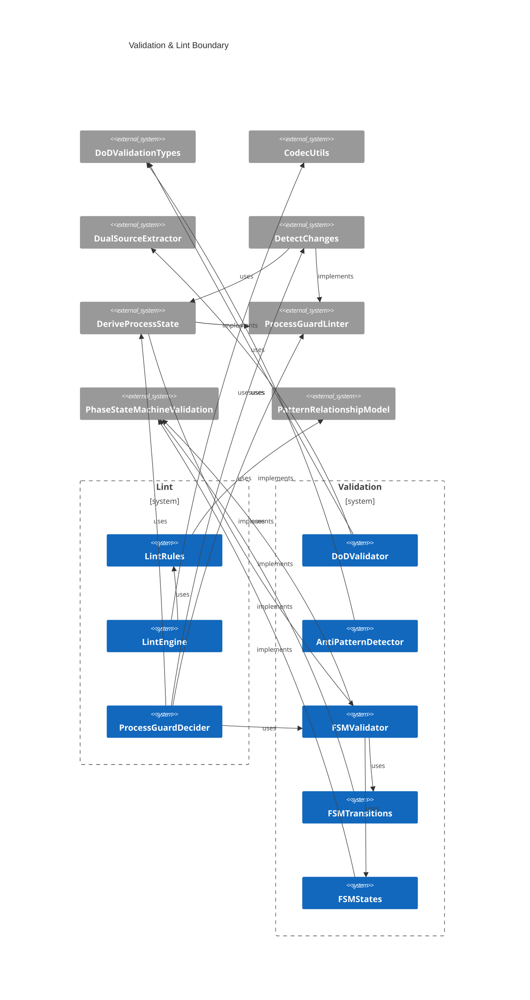
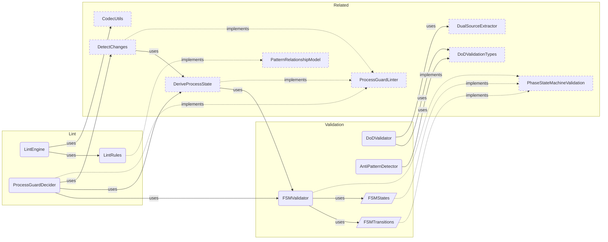

# Validation Overview

**Purpose:** Validation product area overview
**Detail Level:** Full reference

---

**How is the workflow enforced?** Validation is the enforcement boundary — it ensures that every change to annotated source files respects the delivery lifecycle rules defined by the FSM, protection levels, and scope constraints. The system operates in three layers: the FSM validator checks status transitions against a 4-state directed graph, the Process Guard orchestrates commit-time validation using a Decider pattern (state derived from annotations, not stored separately), and the lint engine provides pluggable rule execution with pretty and JSON output. Anti-pattern detection enforces dual-source ownership boundaries — `@libar-docs-uses` belongs on TypeScript, `@libar-docs-depends-on` belongs on Gherkin — preventing cross-domain tag confusion that causes documentation drift. Definition of Done validation ensures completed patterns have all deliverables marked done and at least one acceptance-criteria scenario.

## Key Invariants

- Protection levels: `roadmap`/`deferred` = none (fully editable), `active` = scope-locked (no new deliverables), `completed` = hard-locked (requires `@libar-docs-unlock-reason`)
- Valid FSM transitions: Only roadmap→active, roadmap→deferred, active→completed, active→roadmap, deferred→roadmap. Completed is terminal
- Decider pattern: All validation is (state, changes, options) → result. State is derived from annotations, not maintained separately
- Dual-source ownership: Anti-pattern detection enforces tag boundaries — `uses` on TypeScript (runtime deps), `depends-on`/`quarter`/`team` on Gherkin (planning metadata). Violations are flagged before they cause documentation drift

---

## Validation & Lint Boundary

Scoped architecture diagram showing component relationships:



---

## Enforcement Pipeline

Scoped architecture diagram showing component relationships:



---

## API Types

### AntiPatternDetectionOptions (interface)

```typescript
/**
 * Configuration options for anti-pattern detection
 */
```

```typescript
interface AntiPatternDetectionOptions extends WithTagRegistry {
  /** Thresholds for warning triggers */
  readonly thresholds?: Partial<AntiPatternThresholds>;
}
```

| Property   | Description                     |
| ---------- | ------------------------------- |
| thresholds | Thresholds for warning triggers |

### LintRule (interface)

```typescript
/**
 * A lint rule that checks a parsed directive
 */
```

```typescript
interface LintRule {
  /** Unique rule ID */
  readonly id: string;
  /** Default severity level */
  readonly severity: LintSeverity;
  /** Human-readable rule description */
  readonly description: string;
  /**
   * Check function that returns violation(s) or null if rule passes
   *
   * @param directive - Parsed directive to check
   * @param file - Source file path
   * @param line - Line number in source
   * @param context - Optional context with pattern registry for relationship validation
   * @returns Violation(s) if rule fails, null if passes. Array for rules that can detect multiple issues.
   */
  check: (
    directive: DocDirective,
    file: string,
    line: number,
    context?: LintContext
  ) => LintViolation | LintViolation[] | null;
}
```

| Property    | Description                                                     |
| ----------- | --------------------------------------------------------------- |
| id          | Unique rule ID                                                  |
| severity    | Default severity level                                          |
| description | Human-readable rule description                                 |
| check       | Check function that returns violation(s) or null if rule passes |

### LintContext (interface)

```typescript
/**
 * Context for lint rules that need access to the full pattern registry.
 * Used for "strict mode" validation where relationships are checked
 * against known patterns.
 */
```

```typescript
interface LintContext {
  /** Set of known pattern names for relationship validation */
  readonly knownPatterns: ReadonlySet<string>;
  /** Tag registry for prefix-aware error messages (optional) */
  readonly registry?: TagRegistry;
}
```

| Property      | Description                                             |
| ------------- | ------------------------------------------------------- |
| knownPatterns | Set of known pattern names for relationship validation  |
| registry      | Tag registry for prefix-aware error messages (optional) |

### ProtectionLevel (type)

```typescript
/**
 * Protection level types for FSM states
 *
 * - `none`: Fully editable, no restrictions
 * - `scope`: Scope-locked, prevents adding new deliverables
 * - `hard`: Hard-locked, requires explicit unlock-reason annotation
 */
```

```typescript
type ProtectionLevel = 'none' | 'scope' | 'hard';
```

### isDeliverableComplete (function)

```typescript
/**
 * Check if a deliverable has "complete" status.
 *
 * This checks for the literal 'complete' status value only.
 * For DoD validation (which also accepts 'n/a' and 'superseded'),
 * see isDeliverableStatusTerminal().
 *
 * @param deliverable - The deliverable to check
 * @returns True if the deliverable status is 'complete'
 */
```

```typescript
function isDeliverableComplete(deliverable: Deliverable): boolean;
```

| Parameter   | Type | Description              |
| ----------- | ---- | ------------------------ |
| deliverable |      | The deliverable to check |

**Returns:** True if the deliverable status is 'complete'

### hasAcceptanceCriteria (function)

```typescript
/**
 * Check if a feature has @acceptance-criteria scenarios
 *
 * Scans scenarios for the @acceptance-criteria tag, which indicates
 * BDD-driven acceptance tests.
 *
 * @param feature - The scanned feature file to check
 * @returns True if at least one @acceptance-criteria scenario exists
 */
```

```typescript
function hasAcceptanceCriteria(feature: ScannedGherkinFile): boolean;
```

| Parameter | Type | Description                       |
| --------- | ---- | --------------------------------- |
| feature   |      | The scanned feature file to check |

**Returns:** True if at least one @acceptance-criteria scenario exists

### extractAcceptanceCriteriaScenarios (function)

```typescript
/**
 * Extract acceptance criteria scenario names from a feature
 *
 * @param feature - The scanned feature file
 * @returns Array of scenario names with @acceptance-criteria tag
 */
```

```typescript
function extractAcceptanceCriteriaScenarios(feature: ScannedGherkinFile): readonly string[];
```

| Parameter | Type | Description              |
| --------- | ---- | ------------------------ |
| feature   |      | The scanned feature file |

**Returns:** Array of scenario names with @acceptance-criteria tag

### validateDoDForPhase (function)

```typescript
/**
 * Validate DoD for a single phase/pattern
 *
 * Checks:
 * 1. All deliverables must be in a terminal state (complete, n/a, superseded)
 * 2. At least one @acceptance-criteria scenario exists
 *
 * @param patternName - Name of the pattern being validated
 * @param phase - Phase number being validated
 * @param feature - The scanned feature file with deliverables and scenarios
 * @returns DoD validation result
 */
```

```typescript
function validateDoDForPhase(
  patternName: string,
  phase: number,
  feature: ScannedGherkinFile
): DoDValidationResult;
```

| Parameter   | Type | Description                                              |
| ----------- | ---- | -------------------------------------------------------- |
| patternName |      | Name of the pattern being validated                      |
| phase       |      | Phase number being validated                             |
| feature     |      | The scanned feature file with deliverables and scenarios |

**Returns:** DoD validation result

### validateDoD (function)

````typescript
/**
 * Validate DoD across multiple phases
 *
 * Filters to completed phases and validates each against DoD criteria.
 * Optionally filter to specific phases using phaseFilter.
 *
 * @param features - Array of scanned feature files
 * @param phaseFilter - Optional array of phase numbers to validate (validates all if empty)
 * @returns Aggregate DoD validation summary
 *
 * @example
 * ```typescript
 * // Validate all completed phases
 * const summary = validateDoD(features);
 *
 * // Validate specific phase
 * const summary = validateDoD(features, [14]);
 * ```
 */
````

```typescript
function validateDoD(
  features: readonly ScannedGherkinFile[],
  phaseFilter: readonly number[] = []
): DoDValidationSummary;
```

| Parameter   | Type | Description                                                          |
| ----------- | ---- | -------------------------------------------------------------------- |
| features    |      | Array of scanned feature files                                       |
| phaseFilter |      | Optional array of phase numbers to validate (validates all if empty) |

**Returns:** Aggregate DoD validation summary

### formatDoDSummary (function)

```typescript
/**
 * Format DoD validation summary for console output
 *
 * @param summary - DoD validation summary to format
 * @returns Multi-line string for pretty printing
 */
```

```typescript
function formatDoDSummary(summary: DoDValidationSummary): string;
```

| Parameter | Type | Description                      |
| --------- | ---- | -------------------------------- |
| summary   |      | DoD validation summary to format |

**Returns:** Multi-line string for pretty printing

### detectAntiPatterns (function)

````typescript
/**
 * Detect all anti-patterns
 *
 * Runs all anti-pattern detectors and returns combined violations.
 *
 * @param scannedFiles - Array of scanned TypeScript files
 * @param features - Array of scanned feature files
 * @param options - Optional configuration (registry for prefix, thresholds)
 * @returns Array of all detected anti-pattern violations
 *
 * @example
 * ```typescript
 * // With default prefix (@libar-docs-)
 * const violations = detectAntiPatterns(tsFiles, featureFiles);
 *
 * // With custom prefix
 * const registry = createDefaultTagRegistry();
 * registry.tagPrefix = "@docs-";
 * const customViolations = detectAntiPatterns(tsFiles, featureFiles, { registry });
 *
 * for (const v of violations) {
 *   console.log(`[${v.severity.toUpperCase()}] ${v.id}: ${v.message}`);
 * }
 * ```
 */
````

```typescript
function detectAntiPatterns(
  scannedFiles: readonly ScannedFile[],
  features: readonly ScannedGherkinFile[],
  options: AntiPatternDetectionOptions = {}
): AntiPatternViolation[];
```

| Parameter    | Type | Description                                              |
| ------------ | ---- | -------------------------------------------------------- |
| scannedFiles |      | Array of scanned TypeScript files                        |
| features     |      | Array of scanned feature files                           |
| options      |      | Optional configuration (registry for prefix, thresholds) |

**Returns:** Array of all detected anti-pattern violations

### detectProcessInCode (function)

```typescript
/**
 * Detect process metadata in code anti-pattern
 *
 * Finds process tracking annotations (e.g., @docs-quarter, @docs-team, etc.)
 * in TypeScript files. Process metadata belongs in feature files.
 *
 * @param scannedFiles - Array of scanned TypeScript files
 * @param registry - Optional tag registry for prefix-aware detection (defaults to @libar-docs-)
 * @returns Array of anti-pattern violations
 */
```

```typescript
function detectProcessInCode(
  scannedFiles: readonly ScannedFile[],
  registry?: TagRegistry
): AntiPatternViolation[];
```

| Parameter    | Type | Description                                                                 |
| ------------ | ---- | --------------------------------------------------------------------------- |
| scannedFiles |      | Array of scanned TypeScript files                                           |
| registry     |      | Optional tag registry for prefix-aware detection (defaults to @libar-docs-) |

**Returns:** Array of anti-pattern violations

### detectMagicComments (function)

```typescript
/**
 * Detect magic comments anti-pattern
 *
 * Finds generator hints like "# GENERATOR:", "# PARSER:" in feature files.
 * These create tight coupling between features and generators.
 *
 * @param features - Array of scanned feature files
 * @param threshold - Maximum magic comments before warning (default: 5)
 * @returns Array of anti-pattern violations
 */
```

```typescript
function detectMagicComments(
  features: readonly ScannedGherkinFile[],
  threshold: number = DEFAULT_THRESHOLDS.magicCommentThreshold
): AntiPatternViolation[];
```

| Parameter | Type | Description                                        |
| --------- | ---- | -------------------------------------------------- |
| features  |      | Array of scanned feature files                     |
| threshold |      | Maximum magic comments before warning (default: 5) |

**Returns:** Array of anti-pattern violations

### detectScenarioBloat (function)

```typescript
/**
 * Detect scenario bloat anti-pattern
 *
 * Finds feature files with too many scenarios, which indicates poor
 * organization and slows test suites.
 *
 * @param features - Array of scanned feature files
 * @param threshold - Maximum scenarios before warning (default: 20)
 * @returns Array of anti-pattern violations
 */
```

```typescript
function detectScenarioBloat(
  features: readonly ScannedGherkinFile[],
  threshold: number = DEFAULT_THRESHOLDS.scenarioBloatThreshold
): AntiPatternViolation[];
```

| Parameter | Type | Description                                    |
| --------- | ---- | ---------------------------------------------- |
| features  |      | Array of scanned feature files                 |
| threshold |      | Maximum scenarios before warning (default: 20) |

**Returns:** Array of anti-pattern violations

### detectMegaFeature (function)

```typescript
/**
 * Detect mega-feature anti-pattern
 *
 * Finds feature files that are too large, which makes them hard to
 * maintain and review.
 *
 * @param features - Array of scanned feature files
 * @param threshold - Maximum lines before warning (default: 500)
 * @returns Array of anti-pattern violations
 */
```

```typescript
function detectMegaFeature(
  features: readonly ScannedGherkinFile[],
  threshold: number = DEFAULT_THRESHOLDS.megaFeatureLineThreshold
): AntiPatternViolation[];
```

| Parameter | Type | Description                                 |
| --------- | ---- | ------------------------------------------- |
| features  |      | Array of scanned feature files              |
| threshold |      | Maximum lines before warning (default: 500) |

**Returns:** Array of anti-pattern violations

### formatAntiPatternReport (function)

```typescript
/**
 * Format anti-pattern violations for console output
 *
 * @param violations - Array of violations to format
 * @returns Multi-line string for pretty printing
 */
```

```typescript
function formatAntiPatternReport(violations: AntiPatternViolation[]): string;
```

| Parameter  | Type | Description                   |
| ---------- | ---- | ----------------------------- |
| violations |      | Array of violations to format |

**Returns:** Multi-line string for pretty printing

### toValidationIssues (function)

```typescript
/**
 * Convert anti-pattern violations to ValidationIssue format
 *
 * For integration with the existing validate-patterns CLI.
 */
```

```typescript
function toValidationIssues(violations: readonly AntiPatternViolation[]): Array<{
  severity: 'error' | 'warning' | 'info';
  message: string;
  source: 'typescript' | 'gherkin' | 'cross-source';
  pattern?: string;
  file?: string;
}>;
```

### filterRulesBySeverity (function)

```typescript
/**
 * Get rules filtered by minimum severity
 *
 * @param rules - Rules to filter
 * @param minSeverity - Minimum severity to include
 * @returns Filtered rules
 */
```

```typescript
function filterRulesBySeverity(rules: readonly LintRule[], minSeverity: LintSeverity): LintRule[];
```

| Parameter   | Type | Description                 |
| ----------- | ---- | --------------------------- |
| rules       |      | Rules to filter             |
| minSeverity |      | Minimum severity to include |

**Returns:** Filtered rules

### isValidTransition (function)

````typescript
/**
 * Check if a transition between two states is valid
 *
 * @param from - Current status
 * @param to - Target status
 * @returns true if the transition is allowed
 *
 * @example
 * ```typescript
 * isValidTransition("roadmap", "active"); // → true
 * isValidTransition("roadmap", "completed"); // → false (must go through active)
 * isValidTransition("completed", "active"); // → false (terminal state)
 * ```
 */
````

```typescript
function isValidTransition(from: ProcessStatusValue, to: ProcessStatusValue): boolean;
```

| Parameter | Type | Description    |
| --------- | ---- | -------------- |
| from      |      | Current status |
| to        |      | Target status  |

**Returns:** true if the transition is allowed

### getValidTransitionsFrom (function)

````typescript
/**
 * Get all valid transitions from a given state
 *
 * @param status - Current status
 * @returns Array of valid target states (empty for terminal states)
 *
 * @example
 * ```typescript
 * getValidTransitionsFrom("roadmap"); // → ["active", "deferred", "roadmap"]
 * getValidTransitionsFrom("completed"); // → []
 * ```
 */
````

```typescript
function getValidTransitionsFrom(status: ProcessStatusValue): readonly ProcessStatusValue[];
```

| Parameter | Type | Description    |
| --------- | ---- | -------------- |
| status    |      | Current status |

**Returns:** Array of valid target states (empty for terminal states)

### getTransitionErrorMessage (function)

````typescript
/**
 * Get a human-readable description of why a transition is invalid
 *
 * @param from - Current status
 * @param to - Attempted target status
 * @param options - Optional message options with registry for prefix
 * @returns Error message describing the violation
 *
 * @example
 * ```typescript
 * getTransitionErrorMessage("roadmap", "completed");
 * // → "Cannot transition from 'roadmap' to 'completed'. Must go through 'active' first."
 *
 * getTransitionErrorMessage("completed", "active");
 * // → "Cannot transition from 'completed' (terminal state). Use unlock-reason tag to modify."
 * ```
 */
````

```typescript
function getTransitionErrorMessage(
  from: ProcessStatusValue,
  to: ProcessStatusValue,
  options?: TransitionMessageOptions
): string;
```

| Parameter | Type | Description                                       |
| --------- | ---- | ------------------------------------------------- |
| from      |      | Current status                                    |
| to        |      | Attempted target status                           |
| options   |      | Optional message options with registry for prefix |

**Returns:** Error message describing the violation

### getProtectionLevel (function)

````typescript
/**
 * Get the protection level for a status
 *
 * @param status - Process status value
 * @returns Protection level for the status
 *
 * @example
 * ```typescript
 * getProtectionLevel("active"); // → "scope"
 * getProtectionLevel("completed"); // → "hard"
 * ```
 */
````

```typescript
function getProtectionLevel(status: ProcessStatusValue): ProtectionLevel;
```

| Parameter | Type | Description          |
| --------- | ---- | -------------------- |
| status    |      | Process status value |

**Returns:** Protection level for the status

### isTerminalState (function)

````typescript
/**
 * Check if a status is a terminal state (cannot transition out)
 *
 * Terminal states require explicit unlock to modify.
 *
 * @param status - Process status value
 * @returns true if the status is terminal
 *
 * @example
 * ```typescript
 * isTerminalState("completed"); // → true
 * isTerminalState("active"); // → false
 * ```
 */
````

```typescript
function isTerminalState(status: ProcessStatusValue): boolean;
```

| Parameter | Type | Description          |
| --------- | ---- | -------------------- |
| status    |      | Process status value |

**Returns:** true if the status is terminal

### isFullyEditable (function)

```typescript
/**
 * Check if a status is fully editable (no protection)
 *
 * @param status - Process status value
 * @returns true if the status has no protection
 */
```

```typescript
function isFullyEditable(status: ProcessStatusValue): boolean;
```

| Parameter | Type | Description          |
| --------- | ---- | -------------------- |
| status    |      | Process status value |

**Returns:** true if the status has no protection

### isScopeLocked (function)

```typescript
/**
 * Check if a status is scope-locked
 *
 * @param status - Process status value
 * @returns true if the status prevents scope changes
 */
```

```typescript
function isScopeLocked(status: ProcessStatusValue): boolean;
```

| Parameter | Type | Description          |
| --------- | ---- | -------------------- |
| status    |      | Process status value |

**Returns:** true if the status prevents scope changes

### validateChanges (function)

````typescript
/**
 * Validate changes against process rules.
 *
 * Pure function following the Decider pattern:
 * - Takes all inputs explicitly (no hidden state)
 * - Returns result without side effects
 * - Emits events for observability
 *
 * @param input - Complete input including state, changes, and options
 * @returns DeciderOutput with validation result and events
 *
 * @example
 * ```typescript
 * const output = validateChanges({
 *   state: processState,
 *   changes: changeDetection,
 *   options: { strict: false, ignoreSession: false },
 * });
 *
 * if (!output.result.valid) {
 *   console.log('Violations:', output.result.violations);
 * }
 * ```
 */
````

```typescript
function validateChanges(input: DeciderInput): DeciderOutput;
```

| Parameter | Type | Description                                          |
| --------- | ---- | ---------------------------------------------------- |
| input     |      | Complete input including state, changes, and options |

**Returns:** DeciderOutput with validation result and events

### defaultRules (const)

```typescript
/**
 * All default lint rules
 *
 * Order matters for output - errors first, then warnings, then info.
 */
```

```typescript
const defaultRules: readonly LintRule[];
```

### severityOrder (const)

```typescript
/**
 * Severity ordering for sorting and filtering
 * Exported for use by lint engine to avoid duplication
 */
```

```typescript
const severityOrder: Record<LintSeverity, number>;
```

### missingPatternName (const)

```typescript
/**
 * Rule: missing-pattern-name
 *
 * Patterns must have an explicit name via the pattern tag.
 * Without a name, the pattern can't be referenced in relationships
 * or indexed properly.
 */
```

```typescript
const missingPatternName: LintRule;
```

### missingStatus (const)

```typescript
/**
 * Rule: missing-status
 *
 * Patterns should have an explicit status (completed, active, roadmap).
 * This helps readers understand if the pattern is ready for use.
 */
```

```typescript
const missingStatus: LintRule;
```

---

## Behavior Specifications

### ValidatorReadModelConsolidation

[View ValidatorReadModelConsolidation source](delivery-process/specs/validator-read-model-consolidation.feature)

**Problem:**
`validate-patterns.ts` is the only feature consumer that bypasses the
MasterDataset. It wires its own mini-pipeline (scan + extract + ad-hoc
matching), creates a lossy local type (`GherkinPatternInfo`) that discards
relationship data, and then fails to resolve `@libar-docs-implements`
links — producing 7 false-positive warnings.

This is the Parallel Pipeline anti-pattern identified in ADR-006. The
validator re-derives pattern identity and cross-source matching from raw
scanner/extractor output, ignoring the relationship index that the
MasterDataset already computes with full forward and reverse edges.

**Current violations in validate-patterns.ts (lines refer to pre-refactor):**

| Anti-Pattern | Location | Evidence |
| Parallel Pipeline | Lines 32-35 | Imports scanPatterns, scanGherkinFiles, extractPatterns, extractProcessMetadata |
| Lossy Local Type | Lines 82-88 | GherkinPatternInfo keeps 5 of 30+ ExtractedPattern fields |
| Re-derived Relationship | Lines 373-384 | Builds Map by name-equality, cannot resolve implements links |

**Current 7 warnings decomposed:**

| Warning Pattern | Root Cause | Fix Category |
| ShapeExtractor | Has @libar-docs-implements ShapeExtraction — only resolvable via relationshipIndex | Relationship-blind |
| DecisionDocGenerator | Test feature DecisionDocGeneratorTesting has @libar-docs-implements:DecisionDocGenerator | Relationship-blind |
| ContentDeduplicator | Utility with @libar-docs-phase 28 but no Gherkin spec | Spurious phase tag |
| FileCache | Utility with @libar-docs-phase 27 but no Gherkin spec | Spurious phase tag |
| WarningCollector | Utility with @libar-docs-phase 28 but no Gherkin spec | Spurious phase tag |
| SourceMappingValidator | Utility with @libar-docs-phase 28 but no Gherkin spec | Spurious phase tag |
| SourceMapper | Utility with @libar-docs-phase 27 but no Gherkin spec | Spurious phase tag |

**Solution:**
Refactor `validate-patterns.ts` to consume the MasterDataset as its
data source for cross-source validation. The validator becomes a feature
consumer like codecs and the ProcessStateAPI — querying pre-computed
views and the relationship index instead of building its own maps from
raw data.

This eliminates:

- `GherkinPatternInfo` (Lossy Local Type)
- `extractGherkinPatternInfo()` (duplicate extractor)
- Ad-hoc name-matching maps that miss implements relationships
- The need for any `buildImplementsLookup()` helper

The validator retains its own validation logic (what to check, what
severity to assign). Only its data access changes — from raw state
to the read model.

**Design Decisions:**

DD-1: Reuse the same pipeline as process-api.ts — not a shared factory yet.
The validator will wire scan-extract-merge-transform inline, mirroring
how process-api.ts does it today (lines 490-558). Extracting a shared
pipeline factory is scoped to ProcessAPILayeredExtraction, not this spec.
This keeps the refactoring focused on data-access only.

DD-2: The validatePatterns() function signature changes from
(tsPatterns, gherkinPatterns) to (dataset: RuntimeMasterDataset).
All cross-source matching uses dataset.patterns + dataset.relationshipIndex.
The function remains exported for testability.

DD-3: Cross-source matching uses a two-phase approach:
Phase 1 — Build a name-based Map from dataset.patterns (same as today).
Phase 2 — For each TS pattern not matched by name, check if it appears
in any relationshipIndex entry's implementedBy array. This resolves
the ShapeExtractor and DecisionDocGenerator false positives.

DD-4: The validator will import transformToMasterDatasetWithValidation
from generators/pipeline/index.js, plus the merge and hierarchy helpers
already used by process-api.ts. This is a temporary parallel pipeline
(acknowledged) that will be replaced when the pipeline factory exists.

DD-5: Phase tag removal from utility patterns is a separate atomic step
done first — it reduces warnings from 7 to 2 and is independently
verifiable before touching any validator code.

**Implementation Order:**

| Step | What | Verification |
| 1 | Remove @libar-docs-phase from 5 utility files | pnpm build, warnings drop from 7 to 2 |
| 2 | Wire MasterDataset pipeline in main() | pnpm typecheck |
| 3 | Rewrite validatePatterns() to consume RuntimeMasterDataset | pnpm typecheck |
| 4 | Delete GherkinPatternInfo, extractGherkinPatternInfo | pnpm typecheck, pnpm test |
| 5 | Remove unused scanner/extractor imports | pnpm lint |
| 6 | Run pnpm validate:patterns — verify 0 errors, 0 warnings | Full verification |

**Files Modified:**

| File | Change | Lines Affected |
| src/cli/validate-patterns.ts | Major: rewrite pipeline + validatePatterns() | ~200 lines net reduction |
| src/generators/content-deduplicator.ts | Remove @libar-docs-phase 28 | Line 6 |
| src/cache/file-cache.ts | Remove @libar-docs-phase 27 | Line 5 |
| src/generators/warning-collector.ts | Remove @libar-docs-phase 28 | Line 6 |
| src/generators/source-mapping-validator.ts | Remove @libar-docs-phase 28 | Line 6 |
| src/generators/source-mapper.ts | Remove @libar-docs-phase 27 | Line 6 |

**What does NOT change:**

- ValidationIssue, ValidationSummary, ValidateCLIConfig interfaces (stable API)
- parseArgs(), printHelp(), formatPretty(), formatJson() (CLI shell — untouched)
- DoD validation (already consumes scanned Gherkin files directly — correct for its purpose)
- Anti-pattern detection (already consumes scanned files — correct for its purpose)
- Exit code logic (unchanged)

<details>
<summary>Validator queries the read model for cross-source matching (2 scenarios)</summary>

#### Validator queries the read model for cross-source matching

**Invariant:** Pattern identity resolution — including implements relationships in both directions — uses `MasterDataset.relationshipIndex` rather than ad-hoc name-equality maps built from raw scanner output.

**Rationale:** The MasterDataset computes implementedBy reverse lookups in transform-dataset.ts (second pass, lines 488-546). The validator's current name-equality Map cannot resolve ShapeExtractor -> ShapeExtraction or DecisionDocGeneratorTesting -> DecisionDocGenerator because these are implements relationships, not name matches.

**Verified by:**

- Implements relationships resolve in both directions
- TS pattern implementing a Gherkin spec resolves
- Implements resolve bidirectionally
- TS implementing Gherkin resolves

</details>

<details>
<summary>No lossy local types in the validator (1 scenarios)</summary>

#### No lossy local types in the validator

**Invariant:** The validator operates on `ExtractedPattern` from the MasterDataset, not a consumer-local DTO that discards fields.

**Rationale:** GherkinPatternInfo keeps only name, phase, status, file, and deliverables — discarding uses, dependsOn, implementsPatterns, include, productArea, rules, and 20+ other fields. When the validator needs relationship data, it cannot access it through the lossy type.

**Verified by:**

- GherkinPatternInfo type is eliminated

</details>

<details>
<summary>Utility patterns without specs are not false positives (2 scenarios)</summary>

#### Utility patterns without specs are not false positives

**Invariant:** Internal utility patterns that have a `@libar-docs-phase` but will never have a Gherkin spec should not carry phase metadata. Phase tags signal roadmap participation.

**Rationale:** Five utility patterns (ContentDeduplicator, FileCache, WarningCollector, SourceMappingValidator, SourceMapper) have phase tags from the phase when they were built. They are infrastructure, not roadmap features. The validator correctly reports missing Gherkin for patterns with phases — the fix is removing the phase tag, not suppressing the warning.

**Verified by:**

- Utility patterns do not trigger warnings
- Full validation suite passes with zero warnings

</details>

### StreamingGitDiff

[View StreamingGitDiff source](delivery-process/specs/streaming-git-diff.feature)

**Problem:**
The process guard (`lint-process --all`) fails with `ENOBUFS` error on large
repositories. The current implementation uses `execSync` which buffers the
entire `git diff` output in memory. When comparing against `main` in repos
with hundreds of changed files, the diff output can exceed Node.js buffer
limits (~1MB default), causing the pipe to overflow.

This prevents using `--all` mode in CI/CD pipelines for production repositories.

**Solution:**
Replace synchronous buffered git execution with streaming approach:

1. Use `spawn` instead of `execSync` for git diff commands
2. Process diff output line-by-line as it streams
3. Extract status transitions and deliverable changes incrementally
4. Never hold full diff content in memory

**Design Principles:**

- Constant memory usage regardless of diff size
- Same validation results as current implementation
- Backward compatible - no CLI changes required
- Async/await API for streaming operations

**Scope:**
Only `detect-changes.ts` requires modification. The `deriveProcessState`
and validation logic remain unchanged - they receive the same data structures.

<details>
<summary>Git commands stream output instead of buffering (2 scenarios)</summary>

#### Git commands stream output instead of buffering

**Verified by:**

- Large diff does not cause memory overflow
- Streaming produces same results as buffered

</details>

<details>
<summary>Diff content is parsed as it streams (2 scenarios)</summary>

#### Diff content is parsed as it streams

**Verified by:**

- Status transitions detected incrementally
- Deliverable changes detected incrementally

</details>

<details>
<summary>Streaming errors are handled gracefully (2 scenarios)</summary>

#### Streaming errors are handled gracefully

**Verified by:**

- Git command failure returns Result error
- Malformed diff lines are skipped

</details>

### StepLintVitestCucumber

[View StepLintVitestCucumber source](delivery-process/specs/step-lint-vitest-cucumber.feature)

**Problem:**
Hours are lost debugging vitest-cucumber-specific issues that only surface
at test runtime. These are semantic traps at the boundary between .feature
files and .steps.ts files: using {string} function params inside
ScenarioOutline (should use variables object), forgetting to destructure
the And keyword (causes StepAbleUnknowStepError), missing Rule() wrappers, and hash
comments inside description pseudo-code-blocks. All are statically
detectable but no existing linter catches them.

**Solution:**
A dedicated lint-steps CLI that statically analyzes .feature and .steps.ts
files for vitest-cucumber compatibility. Three check categories:

- Feature-only: hash-in-description, duplicate-and-step, dollar-in-step-text
- Step-only: regex-step-pattern, unsupported-phrase-type
- Cross-file: scenario-outline-function-params, missing-and-destructuring,
  missing-rule-wrapper

Reuses LintViolation/LintSummary from the existing lint engine for
consistent output formatting. Regex-based scanning (no TypeScript AST
needed). Feature-to-step pairing via loadFeature() path extraction.

<details>
<summary>Hash comments inside description pseudo-code-blocks are detected (3 scenarios)</summary>

#### Hash comments inside description pseudo-code-blocks are detected

**Invariant:** A # at the start of a line inside a """ block within a Feature or Rule description terminates the description context, because the Gherkin parser treats # as a comment even inside descriptions. The """ delimiters in descriptions are NOT real DocStrings.

**Rationale:** This is the most confusing Gherkin parser trap. Authors embed code examples using """ and expect # comments to be protected. The resulting parse error gives no hint about the actual cause.

**Verified by:**

- Hash inside description pseudo-code-block is flagged
- Hash in step DocString is not flagged
- Section separator comments are not flagged

</details>

<details>
<summary>Duplicate And steps in the same scenario are detected (2 scenarios)</summary>

#### Duplicate And steps in the same scenario are detected

**Invariant:** Multiple And steps with identical text in the same scenario cause vitest-cucumber step matching failures. The fix is to consolidate into a single step with a DataTable.

**Verified by:**

- Duplicate And step text is flagged
- Same And text in different scenarios is allowed

</details>

<details>
<summary>Dollar sign in step text is detected (1 scenarios)</summary>

#### Dollar sign in step text is detected

**Invariant:** The $ character in step text causes matching issues in vitest-cucumber's expression parser.

**Verified by:**

- Dollar in step text produces warning

</details>

<details>
<summary>Regex step patterns are detected (1 scenarios)</summary>

#### Regex step patterns are detected

**Invariant:** vitest-cucumber only supports string patterns with {string} and {int}. Regex patterns throw StepAbleStepExpressionError.

**Verified by:**

- Regex pattern in Given is flagged

</details>

<details>
<summary>Unsupported phrase type is detected (1 scenarios)</summary>

#### Unsupported phrase type is detected

**Invariant:** vitest-cucumber does not support {phrase}. Use {string} with quoted values in the feature file.

**Verified by:**

- Phrase type in step string is flagged

</details>

<details>
<summary>ScenarioOutline function params are detected (2 scenarios)</summary>

#### ScenarioOutline function params are detected

**Invariant:** ScenarioOutline step callbacks must use the variables object, not function params. Using (\_ctx, value: string) means value will be undefined at runtime.

**Verified by:**

- Function params in ScenarioOutline are flagged
- Function params in regular Scenario are not flagged

</details>

<details>
<summary>Missing And destructuring is detected (2 scenarios)</summary>

#### Missing And destructuring is detected

**Invariant:** If a feature file has And steps, the step definition must destructure And from the scenario callback.

**Verified by:**

- Missing And destructuring is flagged
- Present And destructuring passes

</details>

<details>
<summary>Missing Rule wrapper is detected (2 scenarios)</summary>

#### Missing Rule wrapper is detected

**Invariant:** If a feature file has Rule: blocks, the step definition must destructure Rule from describeFeature.

**Verified by:**

- Missing Rule wrapper is flagged
- Present Rule wrapper passes

</details>

<details>
<summary>Feature-to-step pairing resolves both loadFeature patterns (2 scenarios)</summary>

#### Feature-to-step pairing resolves both loadFeature patterns

**Invariant:** Step files use two loadFeature patterns: simple string paths and resolve(\_\_dirname, relative) paths. Both must be paired.

**Verified by:**

- Simple loadFeature path is paired
- Resolve-based loadFeature path is paired

</details>

### StepLintExtendedRules

[View StepLintExtendedRules source](delivery-process/specs/step-lint-extended-rules.feature)

**Problem:**
The initial lint-steps CLI catches 8 vitest-cucumber traps, but 4 documented
traps from \_claude-md/testing/vitest-cucumber.md remain uncovered:

- Hash in step text (mid-line) truncates the step at runtime
- Feature descriptions starting with Given/When/Then break the parser
- Scenario Outline steps using quoted values (the feature-file side of the
  Two-Pattern Problem — the step-file side is already caught)
- Repeated identical step patterns in the same scenario overwrite registrations

These cause cryptic runtime failures that are statically detectable.

**Solution:**
Extend lint-steps with 4 new rules using the same pure-function architecture.
Two are feature-only checks, one is a step-only check, and one is a
cross-file check. All reuse the existing LintViolation/LintSummary types
and integrate into the existing runner pipeline.

| New Rule | Category | Severity | Trap Caught |
| hash-in-step-text | feature-only | warning | Mid-line hash in step text interpreted as Gherkin comment |
| keyword-in-description | feature-only | error | Description line starting with Given/When/Then breaks parser |
| outline-quoted-values | cross-file | warning | Scenario Outline feature steps with quoted values suggest wrong pattern |
| repeated-step-pattern | step-only | error | Same step pattern registered twice in one scenario block |

<details>
<summary>Hash in step text is detected (2 scenarios)</summary>

#### Hash in step text is detected

**Invariant:** A hash character in the middle of a Gherkin step line can be interpreted as a comment by some parsers, silently truncating the step text. This differs from hash-in-description (which catches hash inside description pseudo-code-blocks).

**Rationale:** We encountered this exact trap while writing the lint-steps test suite. Step text like "Given a file with # inside" was silently truncated to "Given a file with".

**Verified by:**

- Hash in step text produces warning
- Hash at start of comment line is not flagged

</details>

<details>
<summary>Gherkin keywords in description text are detected (2 scenarios)</summary>

#### Gherkin keywords in description text are detected

**Invariant:** A Feature or Rule description line that starts with Given, When, Then, And, or But breaks the Gherkin parser because it interprets the line as a step definition rather than description text.

**Rationale:** This is documented in vitest-cucumber quirks but has no static detection. Authors writing natural language descriptions accidentally start sentences with these keywords.

**Verified by:**

- Description starting with Given is flagged
- Step lines with Given are not flagged

</details>

<details>
<summary>Scenario Outline steps with quoted values are detected (2 scenarios)</summary>

#### Scenario Outline steps with quoted values are detected

**Invariant:** When a feature file has a Scenario Outline and its steps use quoted values instead of angle-bracket placeholders, this indicates the author may be using the Scenario pattern (function params) instead of the ScenarioOutline pattern (variables object). This is the feature-file side of the Two-Pattern Problem.

**Rationale:** The existing scenario-outline-function-params rule catches the step-file side. This rule catches the feature-file side where quoted values in Scenario Outline steps suggest the author expects Cucumber expression matching rather than variable substitution.

**Verified by:**

- Outline step with quoted value produces warning
- Outline step with angle bracket is not flagged

</details>

<details>
<summary>Repeated step patterns in the same scenario are detected (2 scenarios)</summary>

#### Repeated step patterns in the same scenario are detected

**Invariant:** Registering the same step pattern twice in one Scenario block causes vitest-cucumber to overwrite the first registration. Only the last callback runs, causing silent test failures where assertions appear to pass but the setup was wrong.

**Rationale:** This happens when authors copy-paste step definitions within a scenario and forget to change the pattern. The failure is silent — tests pass but with wrong assertions.

**Verified by:**

- Duplicate Given pattern in one scenario is flagged
- Same pattern in different scenarios is not flagged

</details>

### StatusAwareEslintSuppression

[View StatusAwareEslintSuppression source](delivery-process/specs/status-aware-eslint-suppression.feature)

**Problem:**
Design artifacts (code stubs with `@libar-docs-status roadmap`) intentionally have unused
exports that define API shapes before implementation. Current workaround uses directory-based
ESLint exclusions which:

- Don't account for status transitions (roadmap -> active -> completed)
- Create tech debt when implementations land (exclusions persist)
- Require manual maintenance as files move between statuses

**Solution:**
Extend the Process Guard Linter infrastructure with an ESLint integration that:

1. Reads `@libar-docs-status` from file-level JSDoc comments
2. Maps status to protection level using existing `deriveProcessState()`
3. Generates dynamic ESLint configuration or filters messages at runtime
4. Removes the need for directory-based exclusions entirely

**Why It Matters:**
| Benefit | How |
| Automatic lifecycle handling | Files graduating from roadmap to completed automatically get strict linting |
| Zero maintenance | No manual exclusion updates when files change status |
| Consistency with Process Guard | Same status extraction logic, same protection level mapping |
| Tech debt elimination | Removes ~20 lines of directory-based exclusions from eslint.config.js |

<details>
<summary>File status determines unused-vars enforcement (3 scenarios)</summary>

#### File status determines unused-vars enforcement

**Invariant:** Files with `@libar-docs-status roadmap` or `deferred` have relaxed unused-vars rules. Files with `active`, `completed`, or no status have strict enforcement.

**Rationale:** Design artifacts (roadmap stubs) define API shapes that are intentionally unused until implementation. Relaxing rules for these files prevents false positives while ensuring implemented code (active/completed) remains strictly checked.

| Status      | Protection Level | unused-vars Behavior        |
| ----------- | ---------------- | --------------------------- |
| roadmap     | none             | Relaxed (warn, ignore args) |
| deferred    | none             | Relaxed (warn, ignore args) |
| active      | scope            | Strict (error)              |
| complete    | hard             | Strict (error)              |
| (no status) | N/A              | Strict (error)              |

**Verified by:**

- Roadmap file has relaxed unused-vars rules
- Completed file has strict unused-vars rules
- File without status tag has strict rules
- Roadmap file has relaxed rules
- Completed file has strict rules
- No status file has strict rules

</details>

<details>
<summary>Reuses deriveProcessState for status extraction (2 scenarios)</summary>

#### Reuses deriveProcessState for status extraction

**Invariant:** Status extraction logic must be shared with Process Guard Linter. No duplicate parsing or status-to-protection mapping.

**Rationale:** DRY principle - the Process Guard already has battle-tested status extraction from JSDoc comments. Duplicating this logic creates maintenance burden and potential inconsistencies between tools.

**Current State:**

    **Target State:**

```typescript
// Process Guard already has this:
import { deriveProcessState } from '../lint/process-guard/index.js';

const state = await deriveProcessState(ctx, files);
// state.files.get(path).protection -> "none" | "scope" | "hard"
```

```typescript
// ESLint integration reuses the same logic:
import { getFileProtectionLevel } from '../lint/process-guard/index.js';

const protection = getFileProtectionLevel(filePath);
// protection === "none" -> relax unused-vars
// protection === "scope" | "hard" -> strict unused-vars
```

**Verified by:**

- Protection level matches Process Guard derivation
- Status-to-protection mapping is consistent
- Protection level from Process Guard
- Consistent status mapping

</details>

<details>
<summary>ESLint Processor filters messages based on status (3 scenarios)</summary>

#### ESLint Processor filters messages based on status

**Invariant:** The processor uses ESLint's postprocess hook to filter or downgrade messages. Source code is never modified. No eslint-disable comments are injected.

**Rationale:** ESLint processors can inspect and filter linting messages after rules run. This approach: - Requires no source code modification - Works with any ESLint rule (not just no-unused-vars) - Can be extended to other status-based behaviors

**Verified by:**

- Processor filters messages in postprocess
- No source code modification occurs
- Non-relaxed rules pass through unchanged
- Processor filters in postprocess
- No source modification

</details>

<details>
<summary>CLI can generate static ESLint ignore list (2 scenarios)</summary>

#### CLI can generate static ESLint ignore list

**Invariant:** Running `pnpm lint:process --eslint-ignores` outputs a list of files that should have relaxed linting, suitable for inclusion in eslint.config.js.

**Rationale:** For CI environments or users preferring static configuration, a generated list provides an alternative to runtime processing. The list can be regenerated whenever status annotations change.

**Verified by:**

- CLI generates ESLint ignore file list
- JSON output mode for programmatic consumption
- CLI generates file list
- List includes only relaxed files

</details>

<details>
<summary>Replaces directory-based ESLint exclusions (2 scenarios)</summary>

#### Replaces directory-based ESLint exclusions

**Invariant:** After implementation, the directory-based exclusions in eslint.config.js (lines 30-57) are removed. All suppression is driven by @libar-docs-status annotations.

**Rationale:** Directory-based exclusions are tech debt: - They don't account for file lifecycle (roadmap -> completed) - They require manual updates when new roadmap directories are added - They persist even after files are implemented

**Current State (to be removed):**

    **Target State:**

```javascript
// eslint.config.js - directory-based exclusions pattern
    {
      files: [
        "**/delivery-process/stubs/**",
        // ... patterns for roadmap/deferred files
      ],
      rules: {
        "@typescript-eslint/no-unused-vars": ["warn", { args: "none" }],
      },
    }
```

```javascript
// eslint.config.js
    import { statusAwareProcessor } from "@libar-dev/delivery-process/eslint";

    {
      files: ["**/*.ts", "**/*.tsx"],
      processor: statusAwareProcessor,
      // OR use generated ignore list:
      // files: [...generatedRoadmapFiles],
    }
```

**Verified by:**

- Directory exclusions are removed after migration
- Existing roadmap files still pass lint
- Directory exclusions removed
- Processor integration added

</details>

<details>
<summary>Rule relaxation is configurable (2 scenarios)</summary>

#### Rule relaxation is configurable

**Invariant:** The set of rules relaxed for roadmap/deferred files is configurable, defaulting to `@typescript-eslint/no-unused-vars`.

**Rationale:** Different projects may want to relax different rules for design artifacts. The default covers the common case (unused exports in API stubs).

**Verified by:**

- Default configuration relaxes no-unused-vars
- Custom rules can be configured for relaxation
- Default rules are relaxed
- Custom rules can be configured

</details>

### ReleaseAssociationRules

[View ReleaseAssociationRules source](delivery-process/specs/release-association-rules.feature)

**Problem:**
PDR-002 and PDR-003 define conventions for separating specs from release
metadata, but there's no automated enforcement. Spec files may
inadvertently include release columns, and TypeScript phase files may
have incorrect structure.

**Solution:**
Implement validation rules for:

- Spec file compliance (no release columns in DataTables)
- TypeScript phase file structure
- Cross-reference validation (spec references exist)
- Release version format (semver pattern)

<details>
<summary>Spec files must not contain release columns (2 scenarios)</summary>

#### Spec files must not contain release columns

**Verified by:**

- Spec with release column is rejected
- Spec without release column passes

</details>

<details>
<summary>TypeScript phase files must have required annotations (2 scenarios)</summary>

#### TypeScript phase files must have required annotations

**Verified by:**

- Phase file with missing required annotations
- Phase file required annotations

</details>

<details>
<summary>Release version follows semantic versioning (1 scenarios)</summary>

#### Release version follows semantic versioning

**Verified by:**

- Valid release version formats

</details>

### ProgressiveGovernance

[View ProgressiveGovernance source](delivery-process/specs/progressive-governance.feature)

**Problem:**
Enterprise governance patterns applied everywhere create overhead.
Simple utility patterns don't need risk tables and stakeholder approvals.
No way to filter views by governance level.

**Solution:**
Enable governance as a lens, not a mandate:

- Default: Lightweight (no risk/compliance tags required)
- Opt-in: Rich governance for high-risk patterns only

Use risk metadata to:

- Filter roadmap views by risk level
- Require additional metadata only for high-risk patterns
- Generate risk-focused dashboards when requested

Implements Convergence Opportunity 6: Progressive Governance.

Note: This is lower priority because simple --filter "risk=high" on
existing generators achieves 80% of the value. This phase adds polish.

### ProcessGuardLinter

[View ProcessGuardLinter source](delivery-process/specs/process-guard-linter.feature)

**Problem:**
During planning and implementation sessions, accidental modifications occur:

- Specs outside the intended scope get modified in bulk
- Completed/approved work gets inadvertently changed
- No enforcement boundary between "planning what to do" and "doing it"

The delivery process has implicit states (planning, implementing) but no
programmatic guard preventing invalid state transitions or out-of-scope changes.

**Solution:**
Implement a Decider-based linter that:

1. Derives process state from existing file annotations (no separate state file)
2. Validates proposed changes (git diff) against derived state
3. Enforces file protection levels per PDR-005 state machine
4. Supports explicit session scoping via session definition files
5. Protects taxonomy from changes that would break protected specs

**Design Principles:**

- State is derived from annotations, not maintained separately
- Decider logic is pure (no I/O), enabling unit testing
- Integrates with existing lint infrastructure (`lint-process.ts`)
- Warnings for soft rules, errors for hard rules
- Escape hatch via `@libar-docs-unlock-reason` annotation

**Relationship to PDR-005:**
Uses the phase-state-machine FSM as protection levels:

- `roadmap`: Fully editable, no restrictions (planning phase)
- `active`: Scope-locked, errors on new deliverables (work in progress)
- `completed`: Hard-locked, requires explicit unlock to modify
- `deferred`: Fully editable, no restrictions (parked work)

<details>
<summary>Protection levels determine modification restrictions (4 scenarios)</summary>

#### Protection levels determine modification restrictions

Files inherit protection from their `@libar-docs-status` tag. Higher
protection levels require explicit unlock to modify.

**Verified by:**

- Protection level from status
- Completed file modification without unlock fails
- Completed file modification with unlock passes
- Active file modification is allowed but scope-locked

</details>

<details>
<summary>Session definition files scope what can be modified (4 scenarios)</summary>

#### Session definition files scope what can be modified

Optional session files (`delivery-process/sessions/*.feature`) explicitly
declare which specs are in-scope for modification during a work session.
If active, modifications outside scope trigger warnings or errors.

**Verified by:**

- Session file defines modification scope
- Modifying spec outside active session scope warns
- Modifying explicitly excluded spec fails
- No active session allows all modifications

</details>

<details>
<summary>Status transitions follow PDR-005 FSM (2 scenarios)</summary>

#### Status transitions follow PDR-005 FSM

Status changes in a file must follow a valid transition per PDR-005.
This extends phase-state-machine.feature to the linter context.

**Verified by:**

- Valid status transitions
- Invalid status transitions

</details>

<details>
<summary>Active specs cannot add new deliverables (3 scenarios)</summary>

#### Active specs cannot add new deliverables

Once a spec transitions to `active`, its deliverables table is
considered scope-locked. Adding new rows indicates scope creep.

**Verified by:**

- Adding deliverable to active spec fails
- Updating deliverable status in active spec passes
- Removing deliverable from active spec warns

</details>

<details>
<summary>CLI provides flexible validation modes (5 scenarios)</summary>

#### CLI provides flexible validation modes

**Verified by:**

- Validate staged changes (pre-commit default)
- Validate all tracked files
- Show derived state for debugging
- Strict mode treats warnings as errors
- Ignore session flag bypasses session rules

</details>

<details>
<summary>Integrates with existing lint infrastructure (2 scenarios)</summary>

#### Integrates with existing lint infrastructure

**Verified by:**

- Output format matches lint-patterns
- Can run alongside lint-patterns

</details>

<details>
<summary>New tags support process guard functionality (2 scenarios)</summary>

#### New tags support process guard functionality

The following tags are defined in the TypeScript taxonomy to support process guard:

**Verified by:**

- Session-related tags are recognized
- Protection-related tags are recognized

</details>

### PhaseStateMachineValidation

[View PhaseStateMachineValidation source](delivery-process/specs/phase-state-machine.feature)

**Problem:**
Phase lifecycle state transitions are not enforced programmatically despite being documented in PROCESS_SETUP.md.
Invalid transitions can occur silently, leading to inconsistent process state.

**Solution:**
Implement state machine validation that:

- Validates all status transitions
- Enforces required metadata for terminal states
- Provides clear error messages for invalid transitions
- Integrates with generators and linters

<details>
<summary>Valid status values are enforced (2 scenarios)</summary>

#### Valid status values are enforced

**Verified by:**

- Only valid status values are accepted
- Invalid status values are rejected

</details>

<details>
<summary>Status transitions follow state machine rules (2 scenarios)</summary>

#### Status transitions follow state machine rules

**Verified by:**

- Valid transitions are allowed
- Invalid transitions are rejected

</details>

<details>
<summary>Terminal states require completion metadata (2 scenarios)</summary>

#### Terminal states require completion metadata

**Verified by:**

- Completed status requires completion date
- Completed phases should have effort-actual

</details>

### PhaseNumberingConventions

[View PhaseNumberingConventions source](delivery-process/specs/phase-numbering-conventions.feature)

**Problem:**
Phase numbers are assigned manually without validation, leading to
potential conflicts (duplicate numbers), gaps that confuse ordering,
and inconsistent conventions across sources.

**Solution:**
Define and validate phase numbering conventions:

- Unique phase numbers per release version
- Gap detection and warnings
- Cross-source consistency validation
- Suggested next phase number

<details>
<summary>Phase numbers must be unique within a release (2 scenarios)</summary>

#### Phase numbers must be unique within a release

**Verified by:**

- Duplicate phase numbers are detected
- Same phase number in different releases is allowed

</details>

<details>
<summary>Phase number gaps are detected (2 scenarios)</summary>

#### Phase number gaps are detected

**Verified by:**

- Large gaps trigger warnings
- Small gaps are acceptable

</details>

<details>
<summary>CLI suggests next available phase number (1 scenarios)</summary>

#### CLI suggests next available phase number

**Verified by:**

- Suggest next phase number

</details>

### DoDValidation

[View DoDValidation source](delivery-process/specs/dod-validation.feature)

**Problem:**
Phase completion is currently subjective ("done when we feel it").
No objective criteria validation, easy to miss deliverables.
Cannot gate CI/releases on DoD compliance.

**Solution:**
Implement `pnpm validate:dod --phase N` CLI command that:

- Checks all deliverables have status "Complete"/"Done"
- Verifies at least one @acceptance-criteria scenario exists
- Warns if effort-actual is missing for completed phases
- Returns exit code for CI gating

Implements Convergence Opportunity 2: DoD as Machine-Checkable.

See: docs/ideation-convergence/01-delivery-process-opportunities.md

### StatusTransitionDetectionTesting

[View StatusTransitionDetectionTesting source](tests/features/validation/status-transition-detection.feature)

Tests for the detectStatusTransitions function that parses git diff output.
Verifies that status tags inside docstrings are ignored and only file-level
tags are used for FSM transition validation.

<details>
<summary>Status transitions are detected from file-level tags (3 scenarios)</summary>

#### Status transitions are detected from file-level tags

**Invariant:** Status transitions must be detected by comparing @libar-docs-status tags at the file level between the old and new versions of a file.

**Rationale:** File-level tags are the canonical source of pattern status — detecting transitions from tags ensures consistency with the FSM validator.

**Verified by:**

- New file with status tag is detected as transition from roadmap
- Modified file with status change is detected
- No transition when status unchanged

</details>

<details>
<summary>Status tags inside docstrings are ignored (3 scenarios)</summary>

#### Status tags inside docstrings are ignored

**Invariant:** Status tags appearing inside Gherkin docstring blocks (between triple-quote delimiters) must not be treated as real status declarations.

**Rationale:** Docstrings often contain example code or documentation showing status tags — parsing these as real would cause phantom status transitions.

**Verified by:**

- Status tag inside docstring is not used for transition
- Multiple docstring status tags are all ignored
- Only docstring status tags results in no transition

</details>

<details>
<summary>First valid status tag outside docstrings is used (1 scenarios)</summary>

#### First valid status tag outside docstrings is used

**Invariant:** When multiple status tags appear outside docstrings, only the first one determines the file's status.

**Rationale:** A single canonical status per file prevents ambiguity — using the first tag matches Gherkin convention where file-level tags appear at the top.

**Verified by:**

- First file-level tag wins over subsequent tags

</details>

<details>
<summary>Line numbers are tracked from hunk headers (1 scenarios)</summary>

#### Line numbers are tracked from hunk headers

**Invariant:** Detected status transitions must include the line number where the status tag appears, derived from git diff hunk headers.

**Rationale:** Line numbers enable precise error reporting — developers need to know exactly where in the file the transition was detected.

**Verified by:**

- Transition location includes correct line number

</details>

<details>
<summary>Generated documentation directories are excluded (2 scenarios)</summary>

#### Generated documentation directories are excluded

**Invariant:** Files in generated documentation directories (docs-generated/, docs-living/) must be excluded from status transition detection.

**Rationale:** Generated files are projections of source files — detecting transitions in them would produce duplicate violations and false positives.

**Verified by:**

- Status in docs-generated directory is ignored
- Status in docs-living directory is ignored

</details>

### ProcessGuardTesting

[View ProcessGuardTesting source](tests/features/validation/process-guard.feature)

Pure validation functions for enforcing delivery process rules per PDR-005.
All validation follows the Decider pattern: (state, changes, options) => result.

**Problem:**

- Completed specs modified without explicit unlock reason
- Invalid status transitions bypass FSM rules
- Active specs expand scope unexpectedly with new deliverables
- Changes occur outside session boundaries

**Solution:**

- checkProtectionLevel() enforces unlock-reason for completed (hard) files
- checkStatusTransitions() validates transitions against FSM matrix
- checkScopeCreep() prevents deliverable addition to active (scope) specs
- checkSessionScope() warns about files outside session scope
- checkSessionExcluded() errors on explicitly excluded files

<details>
<summary>Completed files require unlock-reason to modify (4 scenarios)</summary>

#### Completed files require unlock-reason to modify

**Invariant:** A completed spec file cannot be modified unless it carries an @libar-docs-unlock-reason tag.

**Rationale:** Completed work represents validated, shipped functionality — accidental modification risks regression.

**Verified by:**

- Completed file with unlock-reason passes validation
- Completed file without unlock-reason fails validation
- Protection levels and unlock requirement
- File transitioning to completed does not require unlock-reason

</details>

<details>
<summary>Status transitions must follow PDR-005 FSM (2 scenarios)</summary>

#### Status transitions must follow PDR-005 FSM

**Invariant:** Status changes must follow the directed graph: roadmap->active->completed, roadmap<->deferred, active->roadmap.

**Rationale:** The FSM prevents skipping required stages (e.g., roadmap->completed bypasses implementation).

**Verified by:**

- Valid transitions pass validation
- Invalid transitions fail validation

</details>

<details>
<summary>Active specs cannot add new deliverables (6 scenarios)</summary>

#### Active specs cannot add new deliverables

**Invariant:** A spec in active status cannot have deliverables added that were not present when it entered active.

**Rationale:** Scope-locking active work prevents mid-sprint scope creep that derails delivery commitments.

**Verified by:**

- Active spec with no deliverable changes passes
- Active spec adding deliverable fails validation
- Roadmap spec can add deliverables freely
- Removing deliverable produces warning
- Deliverable status change does not trigger scope-creep
- Multiple deliverable status changes pass validation

</details>

<details>
<summary>Files outside active session scope trigger warnings (4 scenarios)</summary>

#### Files outside active session scope trigger warnings

**Invariant:** Files modified outside the active session's declared scope produce a session-scope warning.

**Rationale:** Session scoping keeps focus on planned work and makes accidental cross-cutting changes visible.

**Verified by:**

- File in session scope passes validation
- File outside session scope triggers warning
- No active session means all files in scope
- ignoreSession flag suppresses session warnings

</details>

<details>
<summary>Explicitly excluded files trigger errors (3 scenarios)</summary>

#### Explicitly excluded files trigger errors

**Invariant:** Files explicitly excluded from a session cannot be modified, producing a session-excluded error.

**Rationale:** Exclusion is stronger than scope — it marks files that must NOT be touched during this session.

**Verified by:**

- Excluded file triggers error
- Non-excluded file passes validation
- ignoreSession flag suppresses excluded errors

</details>

<details>
<summary>Multiple rules validate independently (3 scenarios)</summary>

#### Multiple rules validate independently

**Invariant:** Each validation rule evaluates independently — a single file can produce violations from multiple rules.

**Rationale:** Independent evaluation ensures no rule masks another, giving complete diagnostic output.

**Verified by:**

- Multiple violations from different rules
- Strict mode promotes warnings to errors
- Clean change produces empty violations

</details>

### FSMValidatorTesting

[View FSMValidatorTesting source](tests/features/validation/fsm-validator.feature)

Pure validation functions for the 4-state FSM defined in PDR-005.
All validation follows the Decider pattern: no I/O, no side effects.

**Problem:**

- Status values must conform to PDR-005 FSM states
- Status transitions must follow valid paths in the state machine
- Completed patterns should have proper metadata (date, effort)

**Solution:**

- validateStatus() checks status values against allowed enum
- validateTransition() validates transitions against FSM matrix
- validateCompletionMetadata() warns about missing completion info

<details>
<summary>Status values must be valid PDR-005 FSM states (3 scenarios)</summary>

#### Status values must be valid PDR-005 FSM states

**Invariant:** Every pattern status value must be one of the states defined in the PDR-005 finite state machine (roadmap, active, completed, deferred).

**Rationale:** Invalid status values bypass FSM transition validation and produce undefined behavior in process guard enforcement.

**Verified by:**

- Valid status values are accepted
- Invalid status values are rejected
- Terminal state returns warning

</details>

<details>
<summary>Status transitions must follow FSM rules (5 scenarios)</summary>

#### Status transitions must follow FSM rules

**Invariant:** Every status change must follow a valid edge in the PDR-005 state machine graph — no skipping states or invalid paths.

**Rationale:** The FSM encodes the delivery workflow contract — invalid transitions indicate process violations that could corrupt delivery tracking.

**Verified by:**

- Valid transitions are accepted
- Invalid transitions are rejected with alternatives
- Terminal state has no valid transitions
- Invalid source status in transition
- Invalid target status in transition

</details>

<details>
<summary>Completed patterns should have proper metadata (4 scenarios)</summary>

#### Completed patterns should have proper metadata

**Invariant:** Patterns in completed status must carry completion date and actual effort metadata to pass validation without warnings.

**Rationale:** Completion metadata enables retrospective analysis and effort estimation — missing metadata degrades project planning accuracy over time.

**Verified by:**

- Completed pattern with full metadata has no warnings
- Completed pattern without date shows warning
- Completed pattern with planned but no actual effort shows warning
- Non-completed pattern skips metadata validation

</details>

<details>
<summary>Protection levels match FSM state definitions (4 scenarios)</summary>

#### Protection levels match FSM state definitions

**Invariant:** Each FSM state must map to exactly one protection level (none, scope-locked, or hard-locked) as defined in PDR-005.

**Rationale:** Protection levels enforce edit constraints per state — mismatched protection would allow prohibited modifications to active or completed specs.

**Verified by:**

- Roadmap status has no protection
- Active status has scope protection
- Completed status has hard protection
- Deferred status has no protection

</details>

<details>
<summary>Combined validation provides complete results (1 scenarios)</summary>

#### Combined validation provides complete results

**Invariant:** The FSM validator must return a combined result including status validity, transition validity, metadata warnings, and protection level in a single call.

**Rationale:** Callers need a complete validation picture — requiring multiple separate calls risks partial validation and inconsistent error reporting.

**Verified by:**

- Valid completed pattern returns combined results

</details>

### DoDValidatorTesting

[View DoDValidatorTesting source](tests/features/validation/dod-validator.feature)

Validates that completed phases meet Definition of Done criteria:

1. All deliverables must have "complete" status
2. At least one @acceptance-criteria scenario must exist

**Problem:**

- Phases marked "completed" without all deliverables done
- Missing acceptance criteria means no BDD tests
- Manual review burden without automated validation

**Solution:**

- isDeliverableComplete() detects completion via status patterns
- hasAcceptanceCriteria() checks for AC scenarios
- validateDoDForPhase() validates single phase
- validateDoD() validates across multiple phases
- formatDoDSummary() renders console-friendly output

<details>
<summary>Deliverable completion uses canonical status taxonomy (2 scenarios)</summary>

#### Deliverable completion uses canonical status taxonomy

**Invariant:** Deliverable completion status must be determined exclusively using the 6 canonical values from the deliverable status taxonomy.

**Rationale:** Freeform status strings bypass schema validation and produce inconsistent completion tracking across the monorepo.

**Verified by:**

- Complete status is detected as complete
- Non-complete canonical statuses are correctly identified

</details>

<details>
<summary>Acceptance criteria must be tagged with @acceptance-criteria (3 scenarios)</summary>

#### Acceptance criteria must be tagged with @acceptance-criteria

**Invariant:** Every completed pattern must have at least one scenario tagged with @acceptance-criteria in its feature file.

**Rationale:** Without explicit acceptance criteria tags, there is no machine-verifiable proof that the delivered work meets its requirements.

**Verified by:**

- Feature with @acceptance-criteria scenario passes
- Feature without @acceptance-criteria fails
- Tag matching is case-insensitive

</details>

<details>
<summary>Acceptance criteria scenarios can be extracted by name (2 scenarios)</summary>

#### Acceptance criteria scenarios can be extracted by name

**Invariant:** The validator must be able to extract scenario names from @acceptance-criteria-tagged scenarios for reporting.

**Rationale:** Extracted names appear in traceability reports and DoD summaries, providing an audit trail from requirement to verification.

**Verified by:**

- Extract multiple AC scenario names
- No AC scenarios returns empty list

</details>

<details>
<summary>DoD requires all deliverables complete and AC present (4 scenarios)</summary>

#### DoD requires all deliverables complete and AC present

**Invariant:** A pattern passes Definition of Done only when ALL deliverables have complete status AND at least one @acceptance-criteria scenario exists.

**Rationale:** Partial completion or missing acceptance criteria means the pattern is not verified — marking it complete would bypass quality gates.

**Verified by:**

- Phase with all deliverables complete and AC passes
- Phase with incomplete deliverables fails
- Phase without acceptance criteria fails
- Phase without deliverables fails

</details>

<details>
<summary>DoD can be validated across multiple completed phases (4 scenarios)</summary>

#### DoD can be validated across multiple completed phases

**Invariant:** DoD validation must evaluate all completed phases independently and report per-phase pass/fail results.

**Rationale:** Multi-phase patterns need granular validation — a single aggregate result would hide which specific phase failed its Definition of Done.

**Verified by:**

- All completed phases passing DoD
- Mixed pass/fail results
- Only completed phases are validated by default
- Filter to specific phases

</details>

<details>
<summary>Summary can be formatted for console output (3 scenarios)</summary>

#### Summary can be formatted for console output

**Invariant:** DoD validation results must be renderable as structured console output showing phase-level pass/fail details.

**Rationale:** Developers need immediate, actionable feedback during pre-commit validation — raw data structures are not human-readable.

**Verified by:**

- Empty summary shows no completed phases message
- Summary with passed phases shows details
- Summary with failed phases shows details

</details>

### DetectChangesTesting

[View DetectChangesTesting source](tests/features/validation/detect-changes.feature)

Tests for the detectDeliverableChanges function that parses git diff output.
Verifies that status changes are correctly identified as modifications,
not as additions or removals.

<details>
<summary>Status changes are detected as modifications not additions (2 scenarios)</summary>

#### Status changes are detected as modifications not additions

**Invariant:** When a deliverable's status value changes between versions, the change detector must classify it as a modification, not an addition or removal.

**Rationale:** Correct change classification drives scope-creep detection — misclassifying a status change as an addition would trigger false scope-creep violations on active specs.

**Verified by:**

- Single deliverable status change is detected as modification
- Multiple deliverable status changes are all modifications

</details>

<details>
<summary>New deliverables are detected as additions (1 scenarios)</summary>

#### New deliverables are detected as additions

**Invariant:** Deliverables present in the new version but absent in the old version must be classified as additions.

**Rationale:** Addition detection powers the scope-creep rule — new deliverables added to active specs must be flagged as violations.

**Verified by:**

- New deliverable is detected as addition

</details>

<details>
<summary>Removed deliverables are detected as removals (1 scenarios)</summary>

#### Removed deliverables are detected as removals

**Invariant:** Deliverables present in the old version but absent in the new version must be classified as removals.

**Rationale:** Removal detection enables the deliverable-removed warning — silently dropping deliverables could hide incomplete work.

**Verified by:**

- Removed deliverable is detected as removal

</details>

<details>
<summary>Mixed changes are correctly categorized (1 scenarios)</summary>

#### Mixed changes are correctly categorized

**Invariant:** When a single diff contains additions, removals, and modifications simultaneously, each change must be independently categorized.

**Rationale:** Real-world commits often contain mixed changes — incorrect categorization of any single change cascades into wrong validation decisions.

**Verified by:**

- Mixed additions, removals, and modifications are handled correctly
- Mixed additions
- removals
- and modifications are handled correctly

</details>

<details>
<summary>Non-deliverable tables are ignored (1 scenarios)</summary>

#### Non-deliverable tables are ignored

**Invariant:** Changes to non-deliverable tables (e.g., ScenarioOutline Examples tables) must not be detected as deliverable changes.

**Rationale:** Feature files contain many table structures — only the Background deliverables table is semantically relevant to process guard validation.

**Verified by:**

- Changes in Examples tables are not detected as deliverable changes

</details>

### ConfigSchemaValidation

[View ConfigSchemaValidation source](tests/features/validation/config-schemas.feature)

Configuration schemas validate scanner and generator inputs with security
constraints to prevent path traversal attacks and ensure safe file operations.

**Security focus:**

- Parent directory traversal (..) is blocked in glob patterns
- Output directories must be within project bounds
- Registry files must be .json format
- Symlink bypass attempts are prevented

<details>
<summary>ScannerConfigSchema validates scanner configuration (7 scenarios)</summary>

#### ScannerConfigSchema validates scanner configuration

**Invariant:** Scanner configuration must contain at least one valid glob pattern with no parent directory traversal, and baseDir must resolve to an absolute path.

**Rationale:** Malformed or malicious glob patterns could scan outside project boundaries, exposing sensitive files.

**Verified by:**

- ScannerConfigSchema validates correct configuration
- ScannerConfigSchema accepts multiple patterns
- ScannerConfigSchema rejects empty patterns array
- ScannerConfigSchema rejects parent traversal in patterns
- ScannerConfigSchema rejects hidden parent traversal
- ScannerConfigSchema normalizes baseDir to absolute path
- ScannerConfigSchema accepts optional exclude patterns

</details>

<details>
<summary>GeneratorConfigSchema validates generator configuration (6 scenarios)</summary>

#### GeneratorConfigSchema validates generator configuration

**Invariant:** Generator configuration must use a .json registry file and an output directory that does not escape the project root via parent traversal.

**Rationale:** Non-JSON registry files could introduce parsing vulnerabilities, and unrestricted output paths could overwrite files outside the project.

**Verified by:**

- GeneratorConfigSchema validates correct configuration
- GeneratorConfigSchema requires .json registry file
- GeneratorConfigSchema rejects outputDir with parent traversal
- GeneratorConfigSchema accepts relative output directory
- GeneratorConfigSchema defaults overwrite to false
- GeneratorConfigSchema defaults readmeOnly to false

</details>

<details>
<summary>isScannerConfig type guard narrows unknown values (4 scenarios)</summary>

#### isScannerConfig type guard narrows unknown values

**Invariant:** isScannerConfig returns true only for objects that have a non-empty patterns array and a string baseDir.

**Verified by:**

- isScannerConfig returns true for valid config
- isScannerConfig returns false for invalid config
- isScannerConfig returns false for null
- isScannerConfig returns false for non-object

</details>

<details>
<summary>isGeneratorConfig type guard narrows unknown values (3 scenarios)</summary>

#### isGeneratorConfig type guard narrows unknown values

**Invariant:** isGeneratorConfig returns true only for objects that have a string outputDir and a .json registryPath.

**Verified by:**

- isGeneratorConfig returns true for valid config
- isGeneratorConfig returns false for invalid config
- isGeneratorConfig returns false for non-json registry

</details>

### AntiPatternDetectorTesting

[View AntiPatternDetectorTesting source](tests/features/validation/anti-patterns.feature)

Detects violations of the dual-source documentation architecture and
process hygiene issues that lead to documentation drift.

**Problem:**

- Dependencies in features (should be code-only) cause drift
- Process metadata in code (should be features-only) violates separation
- Generator hints in features create tight coupling
- Large feature files are hard to maintain

**Solution:**

- detectProcessInCode() finds feature-only tags in code
- detectMagicComments() finds generator hints in features
- detectScenarioBloat() warns about too many scenarios
- detectMegaFeature() warns about large feature files

<details>
<summary>Process metadata should not appear in TypeScript code (2 scenarios)</summary>

#### Process metadata should not appear in TypeScript code

**Invariant:** Process metadata tags (@libar-docs-status, @libar-docs-phase, etc.) must only appear in Gherkin feature files, never in TypeScript source code.

**Rationale:** TypeScript owns runtime behavior while Gherkin owns delivery process metadata — mixing them creates dual-source conflicts and validation ambiguity.

**Verified by:**

- Code without process tags passes
- Feature-only process tags in code are flagged

</details>

<details>
<summary>Generator hints should not appear in feature files (3 scenarios)</summary>

#### Generator hints should not appear in feature files

**Invariant:** Feature files must not contain generator magic comments beyond a configurable threshold.

**Rationale:** Generator hints are implementation details that belong in TypeScript — excessive magic comments in specs indicate leaking implementation concerns into business requirements.

**Verified by:**

- Feature without magic comments passes
- Features with excessive magic comments are flagged
- Magic comments within threshold pass

</details>

<details>
<summary>Feature files should not have excessive scenarios (2 scenarios)</summary>

#### Feature files should not have excessive scenarios

**Invariant:** A single feature file must not exceed the configured maximum scenario count.

**Rationale:** Oversized feature files indicate missing decomposition — they become hard to maintain and slow to execute.

**Verified by:**

- Feature with few scenarios passes
- Feature exceeding scenario threshold is flagged

</details>

<details>
<summary>Feature files should not exceed size thresholds (2 scenarios)</summary>

#### Feature files should not exceed size thresholds

**Invariant:** A single feature file must not exceed the configured maximum line count.

**Rationale:** Excessively large files indicate a feature that should be split into focused, independently testable specifications.

**Verified by:**

- Normal-sized feature passes
- Oversized feature is flagged

</details>

<details>
<summary>All anti-patterns can be detected in one pass (1 scenarios)</summary>

#### All anti-patterns can be detected in one pass

**Invariant:** The anti-pattern detector must evaluate all registered rules in a single scan pass over the source files.

**Rationale:** Single-pass detection ensures consistent results and avoids O(n\*m) performance degradation with multiple file traversals.

**Verified by:**

- Combined detection finds process-in-code issues

</details>

<details>
<summary>Violations can be formatted for console output (2 scenarios)</summary>

#### Violations can be formatted for console output

**Invariant:** Anti-pattern violations must be renderable as grouped, human-readable console output.

**Rationale:** Developers need actionable feedback at commit time — ungrouped or unformatted violations are hard to triage and fix.

**Verified by:**

- Empty violations produce clean report
- Violations are grouped by severity

</details>

### LintRuleIndividualTesting

[View LintRuleIndividualTesting source](tests/features/lint/lint-rules-individual.feature)

Individual lint rules that check parsed directives for completeness.
Tests presence/absence checks: pattern name, status, whenToUse, and relationships.

<details>
<summary>Files must declare an explicit pattern name (5 scenarios)</summary>

#### Files must declare an explicit pattern name

**Invariant:** Every annotated file must have a non-empty patternName to be identifiable in the registry.

**Rationale:** Without a pattern name, the file cannot be tracked, linked, or referenced in generated documentation.

**Verified by:**

- Detect missing pattern name
- Detect empty string pattern name
- Detect whitespace-only pattern name
- Accept valid pattern name
- Include file and line in violation

</details>

<details>
<summary>Files should declare a lifecycle status (5 scenarios)</summary>

#### Files should declare a lifecycle status

**Invariant:** Every annotated file should have a status tag to track its position in the delivery lifecycle.

**Rationale:** Missing status prevents FSM validation and roadmap tracking.

**Verified by:**

- Detect missing status
- Accept completed status
- Accept active status
- Accept roadmap status
- Accept deferred status

</details>

<details>
<summary>Files should document when to use the pattern (3 scenarios)</summary>

#### Files should document when to use the pattern

**Invariant:** Annotated files should include whenToUse guidance so consumers know when to apply the pattern.

**Rationale:** Without usage guidance, patterns become undiscoverable despite being documented.

**Verified by:**

- Detect missing whenToUse
- Detect empty whenToUse array
- Accept whenToUse with content

</details>

<details>
<summary>Files should declare relationship tags (5 scenarios)</summary>

#### Files should declare relationship tags

**Invariant:** Annotated files should declare uses or usedBy relationships to enable dependency tracking and architecture diagrams.

**Rationale:** Isolated patterns without relationships produce diagrams with no edges and prevent dependency analysis.

**Verified by:**

- Detect missing relationship tags
- Detect empty uses array
- Accept uses with content
- Accept usedBy with content
- Accept both uses and usedBy

</details>

### LintRuleAdvancedTesting

[View LintRuleAdvancedTesting source](tests/features/lint/lint-rules-advanced.feature)

Complex lint rule logic and collection-level behavior.
Tests tautological description detection, default collection, and severity filtering.

<details>
<summary>Descriptions must not repeat the pattern name (9 scenarios)</summary>

#### Descriptions must not repeat the pattern name

**Invariant:** A description that merely echoes the pattern name adds no value and must be rejected.

**Rationale:** Tautological descriptions waste reader attention and indicate missing documentation effort.

**Verified by:**

- Detect description that equals pattern name
- Detect description that is pattern name with punctuation
- Detect short description starting with pattern name
- Accept description with substantial content after name
- Accept meaningfully different description
- Ignore empty descriptions
- Ignore missing pattern name
- Skip headings when finding first line
- Skip "When to use" sections when finding first line

</details>

<details>
<summary>Default rules collection is complete and well-ordered (4 scenarios)</summary>

#### Default rules collection is complete and well-ordered

**Invariant:** The default rules collection must contain all defined rules with unique IDs, ordered by severity (errors first).

**Rationale:** A complete, ordered collection ensures no rule is silently dropped and severity-based filtering works correctly.

**Verified by:**

- Default rules contains all 8 rules
- Default rules have unique IDs
- Default rules are ordered by severity
- Default rules include all named rules

</details>

<details>
<summary>Rules can be filtered by minimum severity (3 scenarios)</summary>

#### Rules can be filtered by minimum severity

**Invariant:** Filtering by severity must return only rules at or above the specified level.

**Rationale:** CI pipelines need to control which violations block merges vs. which are advisory.

**Verified by:**

- Filter returns all rules for info severity
- Filter excludes info rules for warning severity
- Filter returns only errors for error severity

</details>

### LintEngineTesting

[View LintEngineTesting source](tests/features/lint/lint-engine.feature)

The lint engine orchestrates rule execution, aggregates violations,
and formats output for human and machine consumption.

The engine provides:

- Single directive linting
- Multi-file batch linting
- Failure detection (with strict mode)
- Violation sorting
- Pretty and JSON output formats

<details>
<summary>Single directive linting validates annotations against rules (4 scenarios)</summary>

#### Single directive linting validates annotations against rules

**Invariant:** Every directive is checked against all provided rules and violations include source location.

**Verified by:**

- Return empty array when all rules pass
- Return violations for failing rules
- Run all provided rules
- Include correct file and line in violations

</details>

<details>
<summary>Multi-file batch linting aggregates results across files (4 scenarios)</summary>

#### Multi-file batch linting aggregates results across files

**Invariant:** All files and directives are scanned, violations are collected per file, and severity counts are accurate.

**Verified by:**

- Return empty results for clean files
- Collect violations by file
- Count violations by severity
- Handle multiple directives per file

</details>

<details>
<summary>Failure detection respects strict mode for severity escalation (5 scenarios)</summary>

#### Failure detection respects strict mode for severity escalation

**Invariant:** Errors always indicate failure. Warnings only indicate failure in strict mode. Info never indicates failure.

**Verified by:**

- Return true when there are errors
- Return false for warnings only in non-strict mode
- Return true for warnings in strict mode
- Return false for info only
- Return false when no violations

</details>

<details>
<summary>Violation sorting orders by severity then by line number (3 scenarios)</summary>

#### Violation sorting orders by severity then by line number

**Invariant:** Sorted output places errors first, then warnings, then info, with stable line-number ordering within each severity. Sorting does not mutate the original array.

**Verified by:**

- Sort errors first then warnings then info
- Sort by line number within same severity
- Not mutate original array

</details>

<details>
<summary>Pretty formatting produces human-readable output with severity counts (4 scenarios)</summary>

#### Pretty formatting produces human-readable output with severity counts

**Invariant:** Pretty output includes file paths, line numbers, severity labels, rule IDs, and summary counts. Quiet mode suppresses non-error violations.

**Verified by:**

- Show success message when no violations
- Format violations with file line severity and message
- Show summary line with counts
- Filter out warnings and info in quiet mode

</details>

<details>
<summary>JSON formatting produces machine-readable output with full details (3 scenarios)</summary>

#### JSON formatting produces machine-readable output with full details

**Invariant:** JSON output is valid, includes all summary fields, and preserves violation details including file, line, severity, rule, and message.

**Verified by:**

- Return valid JSON
- Include all summary fields
- Include violation details

</details>

### LinterValidationTesting

[View LinterValidationTesting source](tests/features/behavior/pattern-relationships/linter-validation.feature)

Tests for lint rules that validate relationship integrity, detect conflicts,
and ensure bidirectional traceability consistency.

<details>
<summary>Pattern cannot implement itself (circular reference) (2 scenarios)</summary>

#### Pattern cannot implement itself (circular reference)

**Invariant:** A pattern's implements tag must reference a different pattern than its own pattern tag.

**Rationale:** Self-implementing patterns create circular references that break the sub-pattern hierarchy.

**Verified by:**

- Pattern tag with implements tag causes error
- Implements without pattern tag is valid
- Implements without pattern tag is valid

  A file cannot define a pattern that implements itself. This creates a
  circular reference. Different patterns are allowed (sub-pattern hierarchy).

</details>

<details>
<summary>Relationship targets should exist (strict mode) (3 scenarios)</summary>

#### Relationship targets should exist (strict mode)

**Invariant:** Every relationship target must reference a pattern that exists in the known pattern registry when strict mode is enabled.

**Rationale:** Dangling references to non-existent patterns produce broken dependency graphs and misleading documentation.

**Verified by:**

- Uses referencing non-existent pattern warns
- Implements referencing non-existent pattern warns
- Valid relationship target passes
- Valid relationship target passes

  In strict mode

- all relationship targets are validated against known patterns.

</details>

<details>
<summary>Bidirectional traceability links should be consistent (2 scenarios)</summary>

#### Bidirectional traceability links should be consistent

**Invariant:** Every forward traceability link (executable-specs, roadmap-spec) must have a corresponding back-link in the target file.

**Rationale:** Asymmetric links mean one side of the traceability chain is invisible, defeating the purpose of bidirectional tracing.

**Verified by:**

- Missing back-link detected
- Orphan executable spec detected

</details>

<details>
<summary>Parent references must be valid (2 scenarios)</summary>

#### Parent references must be valid

**Invariant:** A pattern's parent reference must point to an existing epic pattern in the registry.

**Verified by:**

- Invalid parent reference detected
- Valid parent reference passes

</details>

---
