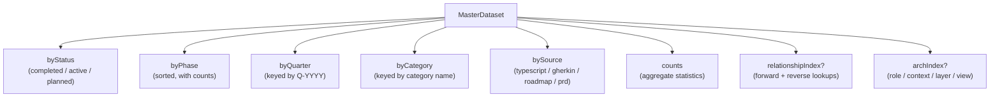

# Architecture Types Reference

**Purpose:** Reference document: Architecture Types Reference
**Detail Level:** Full reference

---

## API Types

### MasterDatasetSchema (const)

```typescript
/**
 * Master Dataset - Unified view of all extracted patterns
 *
 * Contains raw patterns plus pre-computed views and statistics.
 * This is the primary data structure passed to generators and sections.
 *
 */
```

```typescript
MasterDatasetSchema = z.object({
  // ─────────────────────────────────────────────────────────────────────────
  // Raw Data
  // ─────────────────────────────────────────────────────────────────────────

  /** All extracted patterns (both TypeScript and Gherkin) */
  patterns: z.array(ExtractedPatternSchema),

  /** Tag registry for category lookups */
  tagRegistry: TagRegistrySchema,

  // Note: workflow is not in the Zod schema because LoadedWorkflow contains Maps
  // (statusMap, phaseMap) which are not JSON-serializable. When workflow access
  // is needed, get it from SectionContext/GeneratorContext instead.

  // ─────────────────────────────────────────────────────────────────────────
  // Pre-computed Views
  // ─────────────────────────────────────────────────────────────────────────

  /** Patterns grouped by normalized status */
  byStatus: StatusGroupsSchema,

  /** Patterns grouped by phase number (sorted ascending) */
  byPhase: z.array(PhaseGroupSchema),

  /** Patterns grouped by quarter (e.g., "Q4-2024") */
  byQuarter: z.record(z.string(), z.array(ExtractedPatternSchema)),

  /** Patterns grouped by category */
  byCategory: z.record(z.string(), z.array(ExtractedPatternSchema)),

  /** Patterns grouped by source type */
  bySource: SourceViewsSchema,

  /** Patterns grouped by product area (for O(1) product area lookups) */
  byProductArea: z.record(z.string(), z.array(ExtractedPatternSchema)),

  // ─────────────────────────────────────────────────────────────────────────
  // Aggregate Statistics
  // ─────────────────────────────────────────────────────────────────────────

  /** Overall status counts */
  counts: StatusCountsSchema,

  /** Number of distinct phases */
  phaseCount: z.number().int().nonnegative(),

  /** Number of distinct categories */
  categoryCount: z.number().int().nonnegative(),

  // ─────────────────────────────────────────────────────────────────────────
  // Relationship Data (optional)
  // ─────────────────────────────────────────────────────────────────────────

  /** Optional relationship index for dependency graph */
  relationshipIndex: z.record(z.string(), RelationshipEntrySchema).optional(),

  // ─────────────────────────────────────────────────────────────────────────
  // Architecture Data (optional)
  // ─────────────────────────────────────────────────────────────────────────

  /** Optional architecture index for diagram generation */
  archIndex: ArchIndexSchema.optional(),

  // ─────────────────────────────────────────────────────────────────────────
  // Sequence Data (optional)
  // ─────────────────────────────────────────────────────────────────────────

  /** Optional sequence index for design review diagram generation */
  sequenceIndex: SequenceIndexSchema.optional(),
});
```

### StatusGroupsSchema (const)

```typescript
/**
 * Status-based grouping of patterns
 *
 * Patterns are normalized to three canonical states:
 * - completed: implemented, completed
 * - active: active, partial, in-progress
 * - planned: roadmap, planned, undefined
 *
 */
```

```typescript
StatusGroupsSchema = z.object({
  /** Patterns with status 'completed' or 'implemented' */
  completed: z.array(ExtractedPatternSchema),

  /** Patterns with status 'active', 'partial', or 'in-progress' */
  active: z.array(ExtractedPatternSchema),

  /** Patterns with status 'roadmap', 'planned', or undefined */
  planned: z.array(ExtractedPatternSchema),
});
```

### StatusCountsSchema (const)

```typescript
/**
 * Status counts for aggregate statistics
 *
 */
```

```typescript
StatusCountsSchema = z.object({
  /** Number of completed patterns */
  completed: z.number().int().nonnegative(),

  /** Number of active patterns */
  active: z.number().int().nonnegative(),

  /** Number of planned patterns */
  planned: z.number().int().nonnegative(),

  /** Total number of patterns */
  total: z.number().int().nonnegative(),
});
```

### PhaseGroupSchema (const)

```typescript
/**
 * Phase grouping with patterns and counts
 *
 * Groups patterns by their phase number, with pre-computed
 * status counts for each phase.
 *
 */
```

```typescript
PhaseGroupSchema = z.object({
  /** Phase number (e.g., 1, 2, 3, 14, 39) */
  phaseNumber: z.number().int(),

  /** Optional phase name from workflow config */
  phaseName: z.string().optional(),

  /** Patterns in this phase */
  patterns: z.array(ExtractedPatternSchema),

  /** Pre-computed status counts for this phase */
  counts: StatusCountsSchema,
});
```

### SourceViewsSchema (const)

```typescript
/**
 * Source-based views for different data origins
 *
 */
```

```typescript
SourceViewsSchema = z.object({
  /** Patterns from TypeScript files (.ts) */
  typescript: z.array(ExtractedPatternSchema),

  /** Patterns from Gherkin feature files (.feature) */
  gherkin: z.array(ExtractedPatternSchema),

  /** Patterns with phase metadata (roadmap items) */
  roadmap: z.array(ExtractedPatternSchema),

  /** Patterns with PRD metadata (productArea, userRole, businessValue) */
  prd: z.array(ExtractedPatternSchema),
});
```

### RelationshipEntrySchema (const)

```typescript
/**
 * Relationship index for dependency tracking
 *
 * Maps pattern names to their relationship metadata.
 *
 */
```

```typescript
RelationshipEntrySchema = z.object({
  /** Patterns this pattern uses (from @libar-docs-uses) */
  uses: z.array(z.string()),

  /** Patterns that use this pattern (from @libar-docs-used-by) */
  usedBy: z.array(z.string()),

  /** Patterns this pattern depends on (from @libar-docs-depends-on) */
  dependsOn: z.array(z.string()),

  /** Patterns this pattern enables (from @libar-docs-enables) */
  enables: z.array(z.string()),

  // UML-inspired relationship fields (PatternRelationshipModel)
  /** Patterns this item implements (realization relationship) */
  implementsPatterns: z.array(z.string()),

  /** Files/patterns that implement this pattern (computed inverse with file paths) */
  implementedBy: z.array(ImplementationRefSchema),

  /** Pattern this extends (generalization relationship) */
  extendsPattern: z.string().optional(),

  /** Patterns that extend this pattern (computed inverse) */
  extendedBy: z.array(z.string()),

  /** Related patterns for cross-reference without dependency (from @libar-docs-see-also tag) */
  seeAlso: z.array(z.string()),

  /** File paths to implementation APIs (from @libar-docs-api-ref tag) */
  apiRef: z.array(z.string()),
});
```

### RuntimeMasterDataset (interface)

```typescript
/**
 * Runtime MasterDataset with optional workflow
 *
 * Extends the Zod-compatible MasterDataset with workflow reference.
 * LoadedWorkflow contains Maps which aren't JSON-serializable,
 * so it's kept separate from the Zod schema.
 *
 */
```

```typescript
interface RuntimeMasterDataset extends MasterDataset {
  /** Optional workflow configuration (not serializable) */
  readonly workflow?: LoadedWorkflow;
}
```

| Property | Description                                        |
| -------- | -------------------------------------------------- |
| workflow | Optional workflow configuration (not serializable) |

### RawDataset (interface)

```typescript
/**
 * Raw input data for transformation
 *
 */
```

```typescript
interface RawDataset {
  /** Extracted patterns from TypeScript and/or Gherkin sources */
  readonly patterns: readonly ExtractedPattern[];

  /** Tag registry for category lookups */
  readonly tagRegistry: TagRegistry;

  /** Optional workflow configuration for phase names (can be undefined) */
  readonly workflow?: LoadedWorkflow | undefined;

  /** Optional rules for inferring bounded context from file paths */
  readonly contextInferenceRules?: readonly ContextInferenceRule[] | undefined;
}
```

| Property              | Description                                                        |
| --------------------- | ------------------------------------------------------------------ |
| patterns              | Extracted patterns from TypeScript and/or Gherkin sources          |
| tagRegistry           | Tag registry for category lookups                                  |
| workflow              | Optional workflow configuration for phase names (can be undefined) |
| contextInferenceRules | Optional rules for inferring bounded context from file paths       |

### PipelineOptions (interface)

```typescript
/**
 * Options for building a MasterDataset via the shared pipeline.
 *
 * DD-1: Factory lives at src/generators/pipeline/build-pipeline.ts.
 * DD-2: mergeConflictStrategy controls per-consumer conflict handling.
 * DD-3: exclude, contextInferenceRules support future orchestrator
 *        migration without breaking changes.
 *
 */
```

```typescript
interface PipelineOptions {
  readonly input: readonly string[];
  readonly features: readonly string[];
  readonly baseDir: string;
  readonly mergeConflictStrategy: 'fatal' | 'concatenate';
  readonly exclude?: readonly string[];
  readonly workflowPath?: string;
  readonly contextInferenceRules?: readonly ContextInferenceRule[];
  /** DD-3: When false, skip validation pass (default true). */
  readonly includeValidation?: boolean;
  /** DD-5: When true, return error on individual scan failures (default false). */
  readonly failOnScanErrors?: boolean;
}
```

| Property          | Description                                                                |
| ----------------- | -------------------------------------------------------------------------- |
| includeValidation | DD-3: When false, skip validation pass (default true).                     |
| failOnScanErrors  | DD-5: When true, return error on individual scan failures (default false). |

### PipelineResult (interface)

```typescript
/**
 * Successful pipeline result containing the dataset and validation summary.
 *
 */
```

```typescript
interface PipelineResult {
  readonly dataset: RuntimeMasterDataset;
  readonly validation: ValidationSummary;
  readonly warnings: readonly PipelineWarning[];
  readonly scanMetadata: ScanMetadata;
}
```

---

## Orchestrator Pipeline Responsibilities

**Invariant:** The orchestrator is the integration boundary for full docs generation: it delegates dataset construction to the shared pipeline, then executes codecs and writes files.

**Rationale:** Splitting orchestration into dataset construction (shared) and output execution (orchestrator-owned) keeps Data API and validation consumers aligned on one read-model path while preserving generator-specific output handling.

---

## Steps 1-8 via buildMasterDataset()

Steps 1-8 (config load, TypeScript/Gherkin scan + extraction, merge, hierarchy
derivation, workflow load, and `transformToMasterDataset`) are delegated to
`buildMasterDataset()`.

---

## Steps 9-10: Codec Execution and File Writing

After dataset creation, the orchestrator owns Step 9 (codec execution per generator,
output rendering, additional file fan-out) and Step 10 (path validation, overwrite
policy, and persisted file writes).

### When to Use

- Running complete documentation generation programmatically
- Integrating doc generation into build scripts
- Testing the full pipeline without CLI overhead

---

## Shared Pipeline Factory Responsibilities

**Invariant:** `buildMasterDataset()` is the shared factory for Steps 1-8 of the architecture pipeline and returns `Result<PipelineResult, PipelineError>` without process-level side effects.

**Rationale:** Centralizing scan/extract/merge/transform flow prevents divergence between CLI consumers and preserves a single ADR-006 read-model path.

---

## 8-Step Dataset Build Flow

The factory owns: configuration load, TypeScript scan + extraction, Gherkin scan +
extraction, merge conflict handling, hierarchy child derivation, workflow load,
and `transformToMasterDataset` with validation summary.

---

## Consumer Architecture and PipelineOptions Differentiation

Three consumers share this factory: `process-api`, `validate-patterns`, and the
generation orchestrator. `PipelineOptions` differentiates behavior by
`mergeConflictStrategy` (`fatal` vs `concatenate`), `includeValidation` toggles,
and `failOnScanErrors` policy without forking pipeline logic.

### When to Use

- Any consumer needs a MasterDataset without rewriting scan/extract/merge flow
- CLI consumers require differentiated conflict strategy and validation behavior
- Orchestrator needs a shared steps 1-8 implementation before codec/file execution

---

## MasterDataset View Fan-out

Pre-computed view fan-out from MasterDataset (single-pass transform):



---
