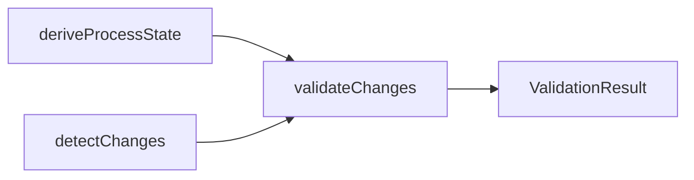

# Process Guard Reference

**Purpose:** Reference document: Process Guard Reference
**Detail Level:** Full reference

---

## Pre-commit Setup

Configure Process Guard as a pre-commit hook using Husky.

```bash
#!/usr/bin/env sh
. "$(dirname -- "$0")/_/husky.sh"

npx lint-process --staged
```

### package.json Scripts

```json
{
  "scripts": {
    "lint:process": "lint-process --staged",
    "lint:process:ci": "lint-process --all --strict"
  }
}
```

## Programmatic API

Use Process Guard programmatically for custom validation workflows.

```typescript
import {
  deriveProcessState,
  detectStagedChanges,
  validateChanges,
  hasErrors,
  summarizeResult,
} from '@libar-dev/delivery-process/lint';

// 1. Derive state from annotations
const state = (await deriveProcessState({ baseDir: '.' })).value;

// 2. Detect changes
const changes = detectStagedChanges('.').value;

// 3. Validate
const { result } = validateChanges({
  state,
  changes,
  options: { strict: false, ignoreSession: false },
});

// 4. Handle results
if (hasErrors(result)) {
  console.log(summarizeResult(result));
  process.exit(1);
}
```

### API Functions

| Category | Function                 | Description                       |
| -------- | ------------------------ | --------------------------------- |
| State    | deriveProcessState(cfg)  | Build state from file annotations |
| Changes  | detectStagedChanges(dir) | Parse staged git diff             |
| Changes  | detectBranchChanges(dir) | Parse all changes vs main         |
| Validate | validateChanges(input)   | Run all validation rules          |
| Results  | hasErrors(result)        | Check for blocking errors         |
| Results  | summarizeResult(result)  | Human-readable summary            |

## Architecture

Process Guard uses the Decider pattern: pure functions with no I/O.



---

## ProcessGuardDecider - Pure Validation Logic

Pure function that validates changes against process rules.
Follows the Decider pattern from platform-core: no I/O, no side effects.

### When to Use

- When validating proposed changes against delivery process rules
- When implementing custom validation rules for the process guard
- When building pre-commit hooks that enforce FSM transitions

### Design Principles

- **Pure Function**: (state, changes, options) => result
- **No I/O**: All data passed in, no file reads
- **Composable Rules**: Rules are separate functions combined in decider
- **Testable**: Easy to unit test with mock data

### Rules Implemented

1. **Protection Level** - Completed files require unlock-reason
2. **Status Transition** - Transitions must follow PDR-005 FSM
3. **Scope Creep** - Active specs cannot add new deliverables
4. **Session Scope** - Modifications outside session scope warn

### Error Guide Content (convention: process-guard-errors)

---

## completed-protection

**Invariant:** Completed specs are immutable without an explicit unlock reason. The unlock reason must be at least 10 characters and cannot be a placeholder.

**Rationale:** The `completed` status represents verified, accepted work. Allowing silent modification undermines the terminal-state guarantee. Requiring an unlock reason creates an audit trail and forces the developer to justify why completed work needs revisiting.

| Situation                  | Solution                           | Example                                             |
| -------------------------- | ---------------------------------- | --------------------------------------------------- |
| Fix typo in completed spec | Add unlock reason tag              | `@libar-docs-unlock-reason:Fix-typo-in-FSM-diagram` |
| Spec needs rework          | Create new spec instead            | New feature file with `roadmap` status              |
| Legacy import              | Multiple transitions in one commit | Set `roadmap` then `completed`                      |

---

## invalid-status-transition

**Invariant:** Status transitions must follow the PDR-005 FSM path. The only valid paths are: roadmap to active, roadmap to deferred, active to completed, active to roadmap, deferred to roadmap.

**Rationale:** The FSM enforces a deliberate progression through planning, implementation, and completion. Skipping states (e.g., roadmap to completed) means work was never tracked as active, breaking session scoping and deliverable validation.

| Attempted             | Why Invalid                  | Valid Path                                 |
| --------------------- | ---------------------------- | ------------------------------------------ |
| roadmap to completed  | Must go through active       | roadmap to active to completed             |
| deferred to active    | Must return to roadmap first | deferred to roadmap to active              |
| deferred to completed | Cannot skip two states       | deferred to roadmap to active to completed |

---

## scope-creep

**Invariant:** Active specs cannot add new deliverables. Scope is locked when status transitions to `active`.

**Rationale:** Prevents scope creep during implementation. Plan fully before starting; implement what was planned. Adding deliverables mid- implementation signals inadequate planning and risks incomplete work.

| Situation                             | Solution                | Example                                                        |
| ------------------------------------- | ----------------------- | -------------------------------------------------------------- |
| Need new deliverable                  | Revert to roadmap first | Change status to roadmap, add deliverable, then back to active |
| Discovered work during implementation | Create new spec         | New feature file for the discovered work                       |

---

## session-scope

**Invariant:** Files outside the active session scope trigger warnings to prevent accidental cross-session modifications.

**Rationale:** Session scoping ensures focused work. Modifying files outside the session scope often indicates scope creep or working on the wrong task. The warning is informational (not blocking) to allow intentional cross-scope changes with `--ignore-session`.

---

## session-excluded

**Invariant:** Files explicitly excluded from a session cannot be modified in that session. This is a hard error, not a warning.

**Rationale:** Explicit exclusion is a deliberate decision to protect certain files from modification during a session. Unlike session-scope (warning), exclusion represents a conscious boundary that should not be violated without changing the session configuration.

---

## deliverable-removed

**Invariant:** Removing a deliverable from an active spec triggers a warning to ensure the removal is intentional and documented.

**Rationale:** Deliverable removal during active implementation may indicate descoping or completion elsewhere. The warning ensures visibility -- the commit message should document why the deliverable was removed.

---
