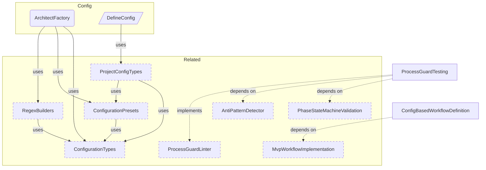
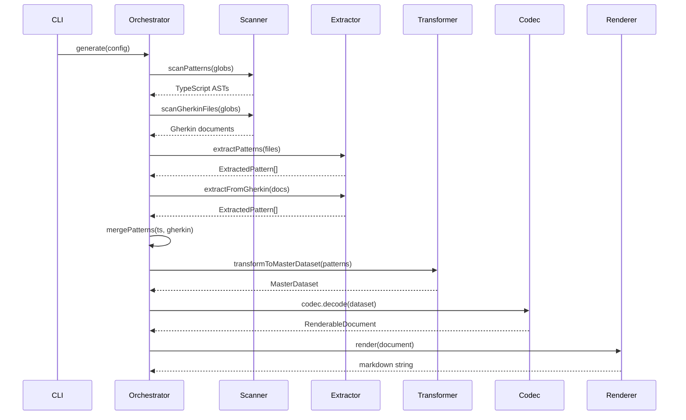
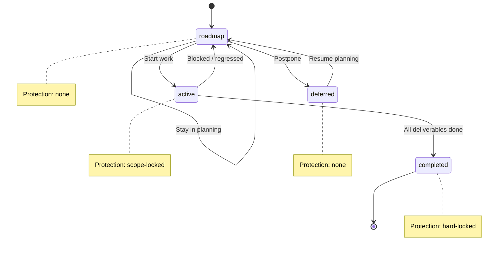
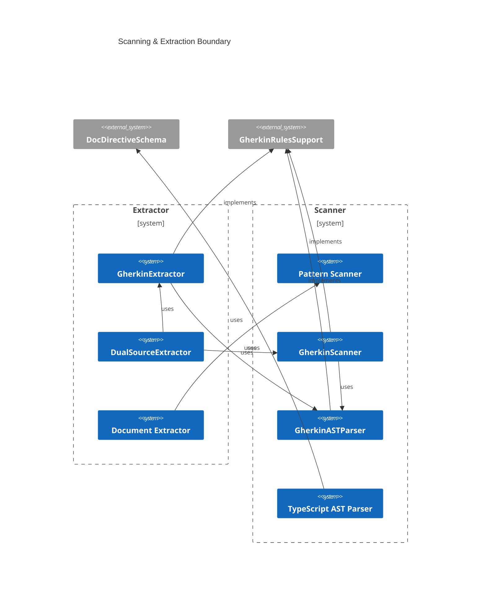
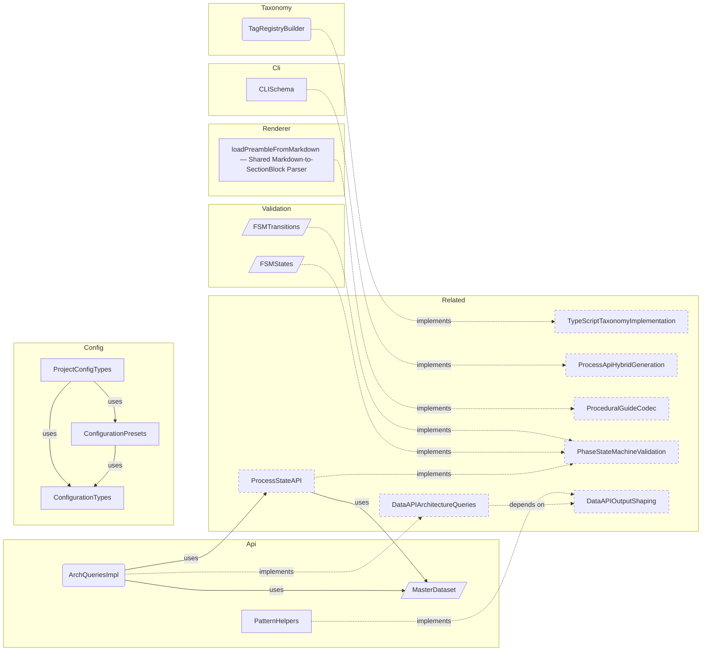

```mermaid
classDiagram
    class GitModule {
        +getChangedFilesList const
    }
    class GitHelpers {
    }
    class GitBranchDiff {
    }
    class SourceMapper {
        <<infrastructure>>
    }
    class Documentation_Generation_Orchestrator {
        <<service>>
    }
    class TransformTypes {
    }
    class TransformDataset {
        <<service>>
    }
    class SequenceTransformUtils {
        <<service>>
    }
    class RelationshipResolver {
        <<service>>
    }
    class ContextInferenceImpl {
        +ContextInferenceRule interface
    }
    class ProcessApiReferenceGenerator {
    }
    class DesignReviewGenerator {
        <<service>>
    }
    class DecisionDocGenerator {
        <<service>>
    }
    class CliRecipeGenerator {
    }
    class MasterDataset
    class Pattern_Scanner
    class GherkinASTParser
    class ShapeExtractor
    class PatternHelpers
    class DesignReviewCodec
    class DecisionDocCodec
    class ProcessApiHybridGeneration
    class PatternRelationshipModel
    class DesignReviewGeneration
    class CliRecipeCodec
    class ContextInference
    GitModule ..> GitBranchDiff : uses
    GitModule ..> GitHelpers : uses
    SourceMapper ..> DecisionDocCodec : depends on
    SourceMapper ..> ShapeExtractor : depends on
    SourceMapper ..> GherkinASTParser : depends on
    Documentation_Generation_Orchestrator ..> Pattern_Scanner : uses
    TransformTypes ..> MasterDataset : uses
    TransformDataset ..> MasterDataset : uses
    TransformDataset ..|> PatternRelationshipModel : implements
    SequenceTransformUtils ..> MasterDataset : uses
    SequenceTransformUtils ..|> DesignReviewGeneration : implements
    RelationshipResolver ..> PatternHelpers : uses
    ContextInferenceImpl ..|> ContextInference : implements
    ProcessApiReferenceGenerator ..|> ProcessApiHybridGeneration : implements
    DesignReviewGenerator ..> DesignReviewCodec : uses
    DesignReviewGenerator ..> MasterDataset : uses
    DesignReviewGenerator ..|> DesignReviewGeneration : implements
    DecisionDocGenerator ..> DecisionDocCodec : depends on
    DecisionDocGenerator ..> SourceMapper : depends on
    CliRecipeGenerator ..|> CliRecipeCodec : implements
    DesignReviewCodec ..> MasterDataset : uses
    DesignReviewCodec ..|> DesignReviewGeneration : implements
    CliRecipeCodec ..> ProcessApiHybridGeneration : depends on
```

# Reference Generation Sample

**Purpose:** Reference document: Reference Generation Sample
**Detail Level:** Full reference

---

## Product area canonical values

**Invariant:** The product-area tag uses one of 7 canonical values. Each value represents a reader-facing documentation section, not a source module.

**Rationale:** Without canonical values, organic drift (e.g., Generator vs Generators) produces inconsistent grouping in generated documentation and fragmented product area pages.

| Value         | Reader Question                     | Covers                                          |
| ------------- | ----------------------------------- | ----------------------------------------------- |
| Annotation    | How do I annotate code?             | Scanning, extraction, tag parsing, dual-source  |
| Configuration | How do I configure the tool?        | Config loading, presets, resolution             |
| Generation    | How does code become docs?          | Codecs, generators, rendering, diagrams         |
| Validation    | How is the workflow enforced?       | FSM, DoD, anti-patterns, process guard, lint    |
| DataAPI       | How do I query process state?       | Process state API, stubs, context assembly, CLI |
| CoreTypes     | What foundational types exist?      | Result monad, error factories, string utils     |
| Process       | How does the session workflow work? | Session lifecycle, handoffs, conventions        |

**Verified by:** Canonical values are enforced

---

## ADR category canonical values

**Invariant:** The adr-category tag uses one of 4 values.

**Rationale:** Unbounded category values prevent meaningful grouping of architecture decisions and make cross-cutting queries unreliable.

| Value         | Purpose                                       |
| ------------- | --------------------------------------------- |
| architecture  | System structure, component design, data flow |
| process       | Workflow, conventions, annotation rules       |
| testing       | Test strategy, verification approach          |
| documentation | Documentation generation, content structure   |

**Verified by:** Canonical values are enforced

---

## FSM status values and protection levels

**Invariant:** Pattern status uses exactly 4 values with defined protection levels. These are enforced by Process Guard at commit time.

**Rationale:** Without protection levels, active specs accumulate scope creep and completed specs get silently modified, undermining delivery process integrity.

| Status    | Protection   | Can Add Deliverables | Allowed Actions                 |
| --------- | ------------ | -------------------- | ------------------------------- |
| roadmap   | None         | Yes                  | Full editing                    |
| active    | Scope-locked | No                   | Edit existing deliverables only |
| completed | Hard-locked  | No                   | Requires unlock-reason tag      |
| deferred  | None         | Yes                  | Full editing                    |

**Verified by:** Canonical values are enforced

---

## Valid FSM transitions

**Invariant:** Only these transitions are valid. All others are rejected by Process Guard.

**Rationale:** Allowing arbitrary transitions (e.g., roadmap to completed) bypasses the active phase where scope-lock and deliverable tracking provide quality assurance.

| From     | To        | Trigger               |
| -------- | --------- | --------------------- |
| roadmap  | active    | Start work            |
| roadmap  | deferred  | Postpone              |
| active   | completed | All deliverables done |
| active   | roadmap   | Blocked/regressed     |
| deferred | roadmap   | Resume planning       |

**Verified by:** Canonical values are enforced

    Completed is a terminal state. Modifications require
    `@architect-unlock-reason` escape hatch.

---

## Tag format types

**Invariant:** Every tag has one of 6 format types that determines how its value is parsed.

**Rationale:** Without explicit format types, parsers must guess value structure, leading to silent data corruption when CSV values are treated as single strings or numbers are treated as text.

| Format       | Parsing                        | Example                       |
| ------------ | ------------------------------ | ----------------------------- |
| flag         | Boolean presence, no value     | @architect-core               |
| value        | Simple string                  | @architect-pattern MyPattern  |
| enum         | Constrained to predefined list | @architect-status completed   |
| csv          | Comma-separated values         | @architect-uses A, B, C       |
| number       | Numeric value                  | @architect-phase 15           |
| quoted-value | Preserves spaces               | @architect-brief:'Multi word' |

**Verified by:** Canonical values are enforced

---

## Source ownership

**Invariant:** Relationship tags have defined ownership by source type. Anti-pattern detection enforces these boundaries.

**Rationale:** Cross-domain tag placement (e.g., runtime dependencies in Gherkin) creates conflicting sources of truth and breaks the dual-source architecture ownership model.

| Tag        | Correct Source | Wrong Source  | Rationale                          |
| ---------- | -------------- | ------------- | ---------------------------------- |
| uses       | TypeScript     | Feature files | TS owns runtime dependencies       |
| depends-on | Feature files  | TypeScript    | Gherkin owns planning dependencies |
| quarter    | Feature files  | TypeScript    | Gherkin owns timeline metadata     |
| team       | Feature files  | TypeScript    | Gherkin owns ownership metadata    |

**Verified by:** Canonical values are enforced

---

## Quarter format convention

**Invariant:** The quarter tag uses `YYYY-QN` format (e.g., `2026-Q1`). ISO-year-first sorting works lexicographically.

**Rationale:** Non-standard formats (e.g., Q1-2026) break lexicographic sorting, which roadmap generation and timeline queries depend on for correct ordering.

**Verified by:** Canonical values are enforced

---

## Canonical phase definitions (6-phase USDP standard)

**Invariant:** The default workflow defines exactly 6 phases in fixed order. These are the canonical phase names and ordinals used by all generated documentation.

**Rationale:** Ad-hoc phase names and ordering produce inconsistent roadmap grouping across packages and make cross-package progress tracking impossible.

| Order | Phase         | Purpose                                        |
| ----- | ------------- | ---------------------------------------------- |
| 1     | Inception     | Problem framing, scope definition              |
| 2     | Elaboration   | Design decisions, architecture exploration     |
| 3     | Session       | Planning and design session work               |
| 4     | Construction  | Implementation, testing, integration           |
| 5     | Validation    | Verification, acceptance criteria confirmation |
| 6     | Retrospective | Review, lessons learned, documentation         |

**Verified by:** Canonical values are enforced

---

## Deliverable status canonical values

**Invariant:** Deliverable status (distinct from pattern FSM status) uses exactly 6 values, enforced by Zod schema at parse time.

**Rationale:** Freeform status strings bypass Zod validation and break DoD checks, which rely on terminal status classification to determine pattern completeness.

| Value       | Meaning              |
| ----------- | -------------------- |
| complete    | Work is done         |
| in-progress | Work is ongoing      |
| pending     | Work has not started |
| deferred    | Work postponed       |
| superseded  | Replaced by another  |
| n/a         | Not applicable       |

**Verified by:** Canonical values are enforced

---

## Configuration Components

Scoped architecture diagram showing component relationships:



---

## Generation Pipeline

Temporal flow of the documentation generation pipeline:



---

## Generator Class Model

Scoped architecture diagram showing component relationships:



---

## Delivery Lifecycle FSM

FSM lifecycle showing valid state transitions and protection levels:



---

## Scanning & Extraction Boundary

Scoped architecture diagram showing component relationships:



---

## Domain Layer Overview

Scoped architecture diagram showing component relationships:



---

## API Types

### SectionBlock (type)

```typescript
type SectionBlock =
  | HeadingBlock
  | ParagraphBlock
  | SeparatorBlock
  | TableBlock
  | ListBlock
  | CodeBlock
  | MermaidBlock
  | CollapsibleBlock
  | LinkOutBlock;
```

### normalizeStatus (function)

````typescript
/**
 * Normalize any status string to a display bucket
 *
 * Maps status values to three canonical display states:
 * - "completed": completed
 * - "active": active
 * - "planned": roadmap, deferred, planned, or any unknown value
 *
 * Per PDR-005: deferred items are treated as planned (not actively worked on)
 *
 * @param status - Raw status from pattern (case-insensitive)
 * @returns "completed" | "active" | "planned"
 *
 * @example
 * ```typescript
 * normalizeStatus("completed")   // → "completed"
 * normalizeStatus("active")      // → "active"
 * normalizeStatus("roadmap")     // → "planned"
 * normalizeStatus("deferred")    // → "planned"
 * normalizeStatus(undefined)     // → "planned"
 * ```
 */
````

```typescript
function normalizeStatus(status: string | undefined): NormalizedStatus;
```

| Parameter | Type | Description                                |
| --------- | ---- | ------------------------------------------ |
| status    |      | Raw status from pattern (case-insensitive) |

**Returns:** "completed" | "active" | "planned"

### DELIVERABLE_STATUS_VALUES (const)

```typescript
/**
 * Canonical deliverable status values
 *
 * These are the ONLY accepted values for the Status column in
 * Gherkin Background deliverable tables. Values are lowercased
 * at extraction time before schema validation.
 *
 * - complete: Work is done
 * - in-progress: Work is ongoing
 * - pending: Work hasn't started
 * - deferred: Work postponed
 * - superseded: Replaced by another deliverable
 * - n/a: Not applicable
 *
 */
```

```typescript
DELIVERABLE_STATUS_VALUES = [
  'complete',
  'in-progress',
  'pending',
  'deferred',
  'superseded',
  'n/a',
] as const;
```

### CategoryDefinition (interface)

```typescript
interface CategoryDefinition {
  /** Category tag name without prefix (e.g., "core", "api", "ddd", "saga") */
  readonly tag: string;
  /** Human-readable domain name for display (e.g., "Strategic DDD", "Event Sourcing") */
  readonly domain: string;
  /** Display order priority - lower values appear first in sorted output */
  readonly priority: number;
  /** Brief description of the category's purpose and typical patterns */
  readonly description: string;
  /** Alternative tag names that map to this category (e.g., "es" for "event-sourcing") */
  readonly aliases: readonly string[];
}
```

| Property    | Description                                                                       |
| ----------- | --------------------------------------------------------------------------------- |
| tag         | Category tag name without prefix (e.g., "core", "api", "ddd", "saga")             |
| domain      | Human-readable domain name for display (e.g., "Strategic DDD", "Event Sourcing")  |
| priority    | Display order priority - lower values appear first in sorted output               |
| description | Brief description of the category's purpose and typical patterns                  |
| aliases     | Alternative tag names that map to this category (e.g., "es" for "event-sourcing") |

---

## Behavior Specifications

### ArchitectFactory

[View ArchitectFactory source](src/config/factory.ts)

## Delivery Process Factory

Main factory function for creating configured delivery process instances.
Supports presets, custom configuration, and configuration overrides.

### When to Use

- At application startup to create a configured instance
- When switching between different tag prefixes
- When customizing the taxonomy for a specific project

### DefineConfig

[View DefineConfig source](src/config/define-config.ts)

## Define Config

Identity function for type-safe project configuration.
Follows the Vite/Vitest `defineConfig()` convention:
returns the input unchanged, providing only TypeScript type checking.

Validation happens later at load time via Zod schema in `loadProjectConfig()`.

### When to Use

- In `architect.config.ts` at project root to get type-safe configuration with autocompletion.

### ADR005CodecBasedMarkdownRendering

[View ADR005CodecBasedMarkdownRendering source](architect/decisions/adr-005-codec-based-markdown-rendering.feature)

**Context:**
The documentation generator needs to transform structured pattern data
(MasterDataset) into markdown files. The initial approach used direct
string concatenation in generator functions, mixing data selection,
formatting logic, and output assembly in a single pass. This made
generators hard to test, difficult to compose, and impossible to
render the same data in different formats (e.g., full docs vs compact
AI context).

**Decision:**
Adopt a codec architecture inspired by serialization codecs (encode/decode).
Each document type has a codec that decodes a MasterDataset into a
RenderableDocument — an intermediate representation of sections, headings,
tables, paragraphs, and code blocks. A separate renderer transforms the
RenderableDocument into markdown. This separates data selection (what to
include) from formatting (how it looks) from serialization (markdown syntax).

**Consequences:**
| Type | Impact |
| Positive | Codecs are pure functions: dataset in, document out -- trivially testable |
| Positive | RenderableDocument is an inspectable IR -- tests assert on structure, not strings |
| Positive | Composable via CompositeCodec -- reference docs assemble from child codecs |
| Positive | Same dataset can produce different outputs (full doc, compact doc, AI context) |
| Negative | Extra abstraction layer between data and output |
| Negative | RenderableDocument vocabulary must cover all needed output patterns |

**Benefits:**
| Benefit | Before (String Concat) | After (Codec) |
| Testability | Assert on markdown strings | Assert on typed section blocks |
| Composability | Copy-paste between generators | CompositeCodec assembles children |
| Format variants | Duplicate generator logic | Same codec, different renderer |
| Progressive disclosure | Manual heading management | Heading depth auto-calculated |

<details>
<summary>Codecs implement a decode-only contract (2 scenarios)</summary>

#### Codecs implement a decode-only contract

**Invariant:** Every codec is a pure function that accepts a MasterDataset and returns a RenderableDocument. Codecs do not perform side effects, do not write files, and do not access the filesystem. The codec contract is decode-only because the transformation is one-directional: structured data becomes a document, never the reverse.

**Rationale:** Pure functions are deterministic and trivially testable. For the same MasterDataset, a codec always produces the same RenderableDocument. This makes snapshot testing reliable and enables codec output comparison across versions.

**Codec call signature:**

```typescript
interface DocumentCodec {
  decode(dataset: MasterDataset): RenderableDocument;
}
```

**Verified by:**

- Codec produces deterministic output
- Codec has no side effects

</details>

<details>
<summary>RenderableDocument is a typed intermediate representation (2 scenarios)</summary>

#### RenderableDocument is a typed intermediate representation

**Invariant:** RenderableDocument contains a title, an ordered array of SectionBlock elements, and an optional record of additional files. Each SectionBlock is a discriminated union: heading, paragraph, table, code, list, separator, or metaRow. The renderer consumes this IR without needing to know which codec produced it.

**Rationale:** A typed IR decouples codecs from rendering. Codecs express intent ("this is a table with these rows") and the renderer handles syntax ("pipe-delimited markdown with separator row"). This means switching output format (e.g., HTML instead of markdown) requires only a new renderer, not changes to every codec.

**Section block types:**

**Verified by:**

- All block types render to markdown
- Unknown block type is rejected

</details>

<details>
<summary>CompositeCodec assembles documents from child codecs (2 scenarios)</summary>

#### CompositeCodec assembles documents from child codecs

**Invariant:** CompositeCodec accepts an array of child codecs and produces a single RenderableDocument by concatenating their sections. Child codec order determines section order in the output. Separators are inserted between children by default.

**Rationale:** Reference documents combine content from multiple domains (patterns, conventions, shapes, diagrams). Rather than building a monolithic codec that knows about all content types, CompositeCodec lets each domain own its codec and composes them declaratively.

**Composition example:**

```typescript
const referenceDoc = CompositeCodec.create({
  title: 'Architecture Reference',
  codecs: [
    behaviorCodec, // patterns with rules
    conventionCodec, // decision records
    shapeCodec, // type definitions
    diagramCodec, // mermaid diagrams
  ],
});
```

**Verified by:**

- Child sections appear in codec array order
- Empty children are skipped without separators

</details>

<details>
<summary>ADR content comes from both Feature description and Rule prefixes (3 scenarios)</summary>

#### ADR content comes from both Feature description and Rule prefixes

**Invariant:** ADR structured content (Context, Decision, Consequences) can appear in two locations within a feature file. Both sources must be rendered. Silently dropping either source causes content loss.

**Rationale:** Early ADRs used name prefixes like "Context - ..." and "Decision - ..." on Rule blocks to structure content. Later ADRs placed Context, Decision, and Consequences as bold-annotated prose in the Feature description, reserving Rule: blocks for invariants and design rules. Both conventions are valid. The ADR codec must handle both because the codebase contains ADRs authored in each style. The Feature description lives in pattern.directive.description. If the codec only renders Rules (via partitionRulesByPrefix), then Feature description content is silently dropped -- no error, no warning. This caused confusion across two repos where ADR content appeared in the feature file but was missing from generated docs. The fix renders pattern.directive.description in buildSingleAdrDocument between the Overview metadata table and the partitioned Rules section, using renderFeatureDescription() which walks content linearly and handles prose, tables, and DocStrings with correct interleaving.

**Verified by:**

- Feature description content is rendered
- Rule prefix content is rendered
- Both sources combine in single ADR

</details>

<details>
<summary>The markdown renderer is codec-agnostic (2 scenarios)</summary>

#### The markdown renderer is codec-agnostic

**Invariant:** The renderer accepts any RenderableDocument regardless of which codec produced it. Rendering depends only on block types, not on document origin. This enables testing codecs and renderers independently.

**Rationale:** If the renderer knew about specific codecs, adding a new codec would require renderer changes. By operating purely on the SectionBlock discriminated union, the renderer is closed for modification but open for extension via new block types.

**Verified by:**

- Same renderer handles different codec outputs
- Renderer and codec are tested independently

</details>

### ADR001TaxonomyCanonicalValues

[View ADR001TaxonomyCanonicalValues source](architect/decisions/adr-001-taxonomy-canonical-values.feature)

**Context:**
The annotation system requires well-defined canonical values for taxonomy
tags, FSM status lifecycle, and source ownership rules. Without canonical
values, organic growth produces drift (Generator vs Generators, Process
vs DeliveryProcess) and inconsistent grouping in generated documentation.

**Decision:**
Define canonical values for all taxonomy enums, FSM states with protection
levels, valid transitions, tag format types, and source ownership rules.
These are the durable constants of the delivery process.

**Consequences:**
| Type | Impact |
| Positive | Generated docs group into coherent sections |
| Positive | FSM enforcement has clear, auditable state definitions |
| Positive | Source ownership prevents cross-domain tag confusion |
| Negative | Migration effort for existing specs with non-canonical values |

<details>
<summary>Product area canonical values</summary>

#### Product area canonical values

**Invariant:** The product-area tag uses one of 7 canonical values. Each value represents a reader-facing documentation section, not a source module.

**Rationale:** Without canonical values, organic drift (e.g., Generator vs Generators) produces inconsistent grouping in generated documentation and fragmented product area pages.

**Verified by:**

- Canonical values are enforced

</details>

<details>
<summary>ADR category canonical values</summary>

#### ADR category canonical values

**Invariant:** The adr-category tag uses one of 4 values.

**Rationale:** Unbounded category values prevent meaningful grouping of architecture decisions and make cross-cutting queries unreliable.

**Verified by:**

- Canonical values are enforced

</details>

<details>
<summary>FSM status values and protection levels</summary>

#### FSM status values and protection levels

**Invariant:** Pattern status uses exactly 4 values with defined protection levels. These are enforced by Process Guard at commit time.

**Rationale:** Without protection levels, active specs accumulate scope creep and completed specs get silently modified, undermining delivery process integrity.

**Verified by:**

- Canonical values are enforced

</details>

<details>
<summary>Valid FSM transitions</summary>

#### Valid FSM transitions

**Invariant:** Only these transitions are valid. All others are rejected by Process Guard.

**Rationale:** Allowing arbitrary transitions (e.g., roadmap to completed) bypasses the active phase where scope-lock and deliverable tracking provide quality assurance.

**Verified by:**

- Canonical values are enforced

  Completed is a terminal state. Modifications require
  `@architect-unlock-reason` escape hatch.

</details>

<details>
<summary>Tag format types</summary>

#### Tag format types

**Invariant:** Every tag has one of 6 format types that determines how its value is parsed.

**Rationale:** Without explicit format types, parsers must guess value structure, leading to silent data corruption when CSV values are treated as single strings or numbers are treated as text.

**Verified by:**

- Canonical values are enforced

</details>

<details>
<summary>Source ownership</summary>

#### Source ownership

**Invariant:** Relationship tags have defined ownership by source type. Anti-pattern detection enforces these boundaries.

**Rationale:** Cross-domain tag placement (e.g., runtime dependencies in Gherkin) creates conflicting sources of truth and breaks the dual-source architecture ownership model.

**Verified by:**

- Canonical values are enforced

</details>

<details>
<summary>Quarter format convention</summary>

#### Quarter format convention

**Invariant:** The quarter tag uses `YYYY-QN` format (e.g., `2026-Q1`). ISO-year-first sorting works lexicographically.

**Rationale:** Non-standard formats (e.g., Q1-2026) break lexicographic sorting, which roadmap generation and timeline queries depend on for correct ordering.

**Verified by:**

- Canonical values are enforced

</details>

<details>
<summary>Canonical phase definitions (6-phase USDP standard)</summary>

#### Canonical phase definitions (6-phase USDP standard)

**Invariant:** The default workflow defines exactly 6 phases in fixed order. These are the canonical phase names and ordinals used by all generated documentation.

**Rationale:** Ad-hoc phase names and ordering produce inconsistent roadmap grouping across packages and make cross-package progress tracking impossible.

**Verified by:**

- Canonical values are enforced

</details>

<details>
<summary>Deliverable status canonical values (1 scenarios)</summary>

#### Deliverable status canonical values

**Invariant:** Deliverable status (distinct from pattern FSM status) uses exactly 6 values, enforced by Zod schema at parse time.

**Rationale:** Freeform status strings bypass Zod validation and break DoD checks, which rely on terminal status classification to determine pattern completeness.

**Verified by:**

- Canonical values are enforced

</details>

### ConfigBasedWorkflowDefinition

[View ConfigBasedWorkflowDefinition source](architect/specs/config-based-workflow-definition.feature)

**Problem:**
Every `pnpm architect:query` and `pnpm docs:*` invocation prints:
`Failed to load default workflow (6-phase-standard): Workflow file not found`

The `loadDefaultWorkflow()` function resolves to `catalogue/workflows/`
which does not exist. The directory was deleted during monorepo extraction.
The system already degrades gracefully (workflow = undefined), but the
warning is noise for both human CLI use and future hook consumers (HUD).

The old `6-phase-standard.json` conflated three concerns:

- Taxonomy vocabulary (status names) — already in `src/taxonomy/`
- FSM behavior (transitions) — already in `src/validation/fsm/`
- Workflow structure (phases) — orphaned, no proper home

**Solution:**
Inline the default workflow as a constant in `workflow-loader.ts`, built
from canonical taxonomy values. Make `loadDefaultWorkflow()` synchronous.
Preserve `loadWorkflowFromPath()` for custom `--workflow <file>` overrides.

The workflow definition uses only the 4 canonical statuses from ADR-001
(roadmap, active, completed, deferred) — not the stale 5-status set from
the deleted JSON (which included non-canonical `implemented` and `partial`).

Phase definitions (Inception, Elaboration, Session, Construction,
Validation, Retrospective) move from a missing JSON file to an inline
constant, making the default workflow always available without file I/O.

Design Decisions (DS-1, 2026-02-15):

| ID | Decision | Rationale |
| DD-1 | Inline constant in workflow-loader.ts, not preset integration | Minimal correct fix, zero type regression risk. Preset integration deferred. |
| DD-2 | Constant satisfies existing WorkflowConfig type | Reuse createLoadedWorkflow() from workflow-config.ts. No new types needed. |
| DD-3 | Remove dead code: getCatalogueWorkflowsPath, loadWorkflowConfig, DEFAULT_WORKFLOW_NAME | Dead since monorepo extraction. Public API break is safe (function always threw). |
| DD-4 | loadDefaultWorkflow() returns LoadedWorkflow synchronously | Infallible constant needs no async or error handling. |
| DD-5 | Amend ADR-001 with canonical phase definitions | Phase names are canonical values; fits existing governance in ADR-001. |

<details>
<summary>Default workflow is built from an inline constant (2 scenarios)</summary>

#### Default workflow is built from an inline constant

**Invariant:** `loadDefaultWorkflow()` returns a `LoadedWorkflow` without file system access. It cannot fail. The default workflow constant uses only canonical status values from `src/taxonomy/status-values.ts`.

**Rationale:** The file-based loading path (`catalogue/workflows/`) has been dead code since monorepo extraction. Both callers (orchestrator, process-api) already handle the failure gracefully, proving the system works without it. Making the function synchronous and infallible removes the try-catch ceremony and the warning noise.

**Verified by:**

- Default workflow loads without warning
- Workflow constant uses canonical statuses only
- Workflow constant uses canonical statuses only

  Implementation approach:

</details>

<details>
<summary>Custom workflow files still work via --workflow flag (1 scenarios)</summary>

#### Custom workflow files still work via --workflow flag

**Invariant:** `loadWorkflowFromPath()` remains available for projects that need custom workflow definitions. The `--workflow <file>` CLI flag and `workflowPath` config field continue to work.

**Rationale:** The inline default replaces file-based _default_ loading, not file-based _custom_ loading. Projects may define custom phases or additional statuses via JSON files.

**Verified by:**

- Custom workflow file overrides default

</details>

<details>
<summary>FSM validation and Process Guard are not affected</summary>

#### FSM validation and Process Guard are not affected

**Invariant:** The FSM transition matrix, protection levels, and Process Guard rules remain hardcoded in `src/validation/fsm/` and `src/lint/process-guard/`. They do not read from `LoadedWorkflow`.

**Rationale:** FSM and workflow are separate concerns. FSM enforces status transitions (4-state model from PDR-005). Workflow defines phase structure (6-phase USDP). The workflow JSON declared `transitionsTo` on its statuses, but no code ever read those values — the FSM uses its own `VALID_TRANSITIONS` constant. This separation is correct and intentional. Blast radius analysis confirmed zero workflow imports in: - src/validation/fsm/ (4 files) - src/lint/process-guard/ (5 files) - src/taxonomy/ (all files)

</details>

<details>
<summary>Workflow as a configurable preset field is deferred</summary>

#### Workflow as a configurable preset field is deferred

**Invariant:** The inline default workflow constant is the only workflow source until preset integration is implemented. No preset or project config field exposes workflow customization.

**Rationale:** Coupling workflow into the preset/config system before the inline fix ships would widen the blast radius and risk type regressions across all config consumers.

**Verified by:**

- N/A - deferred until preset integration

  Adding `workflow` as a field on `ArchitectConfig` (presets) and
  `ArchitectProjectConfig` (project config) is a natural next step
  but NOT required for the MVP fix.

  The inline constant in `workflow-loader.ts` resolves the warning. Moving
  workflow into the preset/config system enables:
  - Different presets with different default phases (e.g.

- 3-phase generic)
  - Per-project phase customization in architect.config.ts
  - Phase definitions appearing in generated documentation

  See ideation artifact for design options:
  architect/ideations/2026-02-15-workflow-config-and-fsm-extensibility.feature

</details>

### ProcessGuardTesting

[View ProcessGuardTesting source](tests/features/validation/process-guard.feature)

Pure validation functions for enforcing delivery process rules per PDR-005.
All validation follows the Decider pattern: (state, changes, options) => result.

**Problem:**

- Completed specs modified without explicit unlock reason
- Invalid status transitions bypass FSM rules
- Active specs expand scope unexpectedly with new deliverables
- Changes occur outside session boundaries

**Solution:**

- checkProtectionLevel() enforces unlock-reason for completed (hard) files
- checkStatusTransitions() validates transitions against FSM matrix
- checkScopeCreep() prevents deliverable addition to active (scope) specs
- checkSessionScope() warns about files outside session scope
- checkSessionExcluded() errors on explicitly excluded files

<details>
<summary>Completed files require unlock-reason to modify (4 scenarios)</summary>

#### Completed files require unlock-reason to modify

**Invariant:** A completed spec file cannot be modified unless it carries an @architect-unlock-reason tag.

**Rationale:** Completed work represents validated, shipped functionality — accidental modification risks regression.

**Verified by:**

- Completed file with unlock-reason passes validation
- Completed file without unlock-reason fails validation
- Protection levels and unlock requirement
- File transitioning to completed does not require unlock-reason

</details>

<details>
<summary>Status transitions must follow PDR-005 FSM (3 scenarios)</summary>

#### Status transitions must follow PDR-005 FSM

**Invariant:** Status changes must follow the directed graph: roadmap->active->completed, roadmap<->deferred, active->roadmap.

**Rationale:** The FSM prevents skipping required stages (e.g., roadmap->completed bypasses implementation).

**Verified by:**

- Valid transitions pass validation
- Invalid transitions fail validation
- Existing file with unlock-reason bypasses FSM check

</details>

<details>
<summary>Active specs cannot add new deliverables (6 scenarios)</summary>

#### Active specs cannot add new deliverables

**Invariant:** A spec in active status cannot have deliverables added that were not present when it entered active.

**Rationale:** Scope-locking active work prevents mid-sprint scope creep that derails delivery commitments.

**Verified by:**

- Active spec with no deliverable changes passes
- Active spec adding deliverable fails validation
- Roadmap spec can add deliverables freely
- Removing deliverable produces warning
- Deliverable status change does not trigger scope-creep
- Multiple deliverable status changes pass validation

</details>

<details>
<summary>Files outside active session scope trigger warnings (4 scenarios)</summary>

#### Files outside active session scope trigger warnings

**Invariant:** Files modified outside the active session's declared scope produce a session-scope warning.

**Rationale:** Session scoping keeps focus on planned work and makes accidental cross-cutting changes visible.

**Verified by:**

- File in session scope passes validation
- File outside session scope triggers warning
- No active session means all files in scope
- ignoreSession flag suppresses session warnings

</details>

<details>
<summary>Explicitly excluded files trigger errors (3 scenarios)</summary>

#### Explicitly excluded files trigger errors

**Invariant:** Files explicitly excluded from a session cannot be modified, producing a session-excluded error.

**Rationale:** Exclusion is stronger than scope — it marks files that must NOT be touched during this session.

**Verified by:**

- Excluded file triggers error
- Non-excluded file passes validation
- ignoreSession flag suppresses excluded errors

</details>

<details>
<summary>Multiple rules validate independently (3 scenarios)</summary>

#### Multiple rules validate independently

**Invariant:** Each validation rule evaluates independently — a single file can produce violations from multiple rules.

**Rationale:** Independent evaluation ensures no rule masks another, giving complete diagnostic output.

**Verified by:**

- Multiple violations from different rules
- Strict mode promotes warnings to errors
- Clean change produces empty violations

</details>

---
