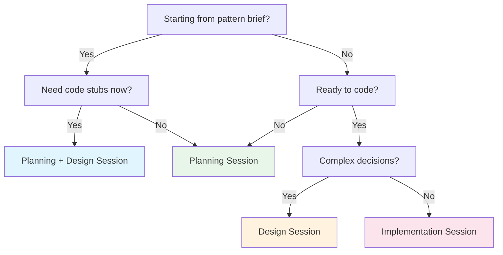

# Session Workflow Guide

**Purpose:** Reference document: Session Workflow Guide
**Detail Level:** Full reference

---

## Session Decision Tree

Use this flowchart to determine which session type to run.



## Session Type Contracts

| Session           | Input               | Output                      | FSM Change                           |
| ----------------- | ------------------- | --------------------------- | ------------------------------------ |
| Planning          | Pattern brief       | Roadmap spec (`.feature`)   | Creates `roadmap`                    |
| Design            | Complex requirement | Decision specs + code stubs | None                                 |
| Implementation    | Roadmap spec        | Code + tests                | `roadmap` -> `active` -> `completed` |
| Planning + Design | Pattern brief       | Spec + stubs                | Creates `roadmap`                    |

---

## Implementation Execution Order

Implementation sessions MUST follow this strict 5-step sequence. Skipping steps causes Process Guard rejection at commit time.

1. **Transition to `active` FIRST** (before any code changes)
2. **Create executable spec stubs** (if `@architect-executable-specs` present)
3. **For each deliverable:** implement, test, update status to `complete`
4. **Transition to `completed`** (only when ALL deliverables done)
5. **Regenerate docs:** `pnpm docs:all`

### Implementation Do NOT

| Do NOT                              | Why                                     |
| ----------------------------------- | --------------------------------------- |
| Add new deliverables to active spec | Scope-locked state prevents scope creep |
| Mark completed with incomplete work | Hard-locked state cannot be undone      |
| Skip FSM transitions                | Process Guard will reject               |
| Edit generated docs directly        | Regenerate from source                  |

---

## Planning Session

**Goal:** Create a roadmap spec. Do not write implementation code.

### Context Gathering

```bash
pnpm architect:query -- overview                                # Project health
pnpm architect:query -- list --status roadmap --names-only      # Available patterns
```

### Planning Checklist

- [ ] **Extract metadata** from pattern brief: phase, dependencies, status
- [ ] **Create spec file** at `{specs-directory}/{product-area}/{pattern}.feature`
- [ ] **Structure the feature** with Problem/Solution, tags, deliverables table
- [ ] **Convert constraints to Rule: blocks** with Invariant/Rationale
- [ ] **Add scenarios** per Rule: 1 happy-path + 1 validation minimum
- [ ] **Set executable specs location** via `@architect-executable-specs` tag

### Planning Do NOT

- Create `.ts` implementation files
- Transition to `active`
- Ask "Ready to implement?"

---

## Design Session

**Goal:** Make architectural decisions. Create code stubs with interfaces. Do not implement.

### Context Gathering

```bash
pnpm architect:query -- context <PatternName> --session design  # Full context bundle
pnpm architect:query -- dep-tree <PatternName>                  # Dependency chain
pnpm architect:query -- stubs <PatternName>                     # Existing design stubs
```

### When to Use Design Sessions

| Use Design Session         | Skip Design Session |
| -------------------------- | ------------------- |
| Multiple valid approaches  | Single obvious path |
| New patterns/capabilities  | Bug fix             |
| Cross-context coordination | Clear requirements  |

### Design Checklist

- [ ] **Record decisions** as PDR `.feature` files in `architect/decisions/`
- [ ] **Document options** with at least 2-3 approaches and pros/cons
- [ ] **Get approval** from user on recommended approach
- [ ] **Create code stubs** in `architect/stubs/{pattern-name}/`
- [ ] **Verify stub identifier spelling** before committing
- [ ] **List canonical helpers** in `@architect-uses` tags

### Design Do NOT

- Create markdown design documents (use decision specs instead)
- Create implementation plans
- Transition spec to `active`
- Write full implementations (stubs only)

---

## Planning + Design Session

**Goal:** Create spec AND code stubs in one session. For immediate implementation handoff.

### When to Use

| Use Planning + Design               | Use Planning Only            |
| ----------------------------------- | ---------------------------- |
| Need stubs for implementation       | Only enhancing spec          |
| Preparing for immediate handoff     | Still exploring requirements |
| Want complete two-tier architecture | Don't need Tier 2 yet        |

---

## Handoff Documentation

For multi-session work, capture state at session boundaries using the Process Data API.

```bash
pnpm architect:query -- handoff --pattern <PatternName>
pnpm architect:query -- handoff --pattern <PatternName> --git   # include recent commits
```

---

## Quick Reference: FSM Protection

| State       | Protection   | Can Add Deliverables | Needs Unlock |
| ----------- | ------------ | -------------------- | ------------ |
| `roadmap`   | None         | Yes                  | No           |
| `active`    | Scope-locked | No                   | No           |
| `completed` | Hard-locked  | No                   | Yes          |
| `deferred`  | None         | Yes                  | No           |

---

## Behavior Specifications

### SessionGuidesModuleSource

[View SessionGuidesModuleSource source](architect/specs/session-guides-module-source.feature)

**Problem:**
CLAUDE.md contains a "Session Workflows" section (~160 lines) that is hand-maintained
with no link to any annotated source. Three hand-written files in `_claude-md/workflow/`
(session-workflows.md, session-details.md, fsm-handoff.md) are equally opaque: no
machine-readable origin, no regeneration from source annotations.

The prior plan proposed tagging ADR-001, ADR-003, and PDR-001 with `@architect-claude-module`
to make them the source for generated workflow modules. Design analysis revealed this is
fundamentally flawed: `claude-module` is a file-level tag that pulls ALL Rules from a file,
but most Rules in those decision specs are irrelevant to session workflows (ADR-001 has 9
Rules, only 2-3 are workflow-relevant; PDR-001 has 7 Rules about CLI implementation
decisions, not workflow guidance).

**Solution:**
This spec file itself becomes the annotated source for session workflow content.
Session workflow invariants are captured as Rule: blocks here, covering session type
contracts, FSM protection, execution order, error recovery, and handoff patterns.

Once ClaudeModuleGeneration (Phase 25) ships, adding `@architect-claude-module` and
`@architect-claude-section:workflow` tags to this spec will cause the codec to produce
`_claude-md/workflow/` modules automatically. The hand-written files are then deleted
and the CLAUDE.md section becomes a generated include.

Retain `docs/SESSION-GUIDES.md` (389 lines) as the authoritative public human reference
deployed to libar.dev. It serves developers with comprehensive checklists and full CLI
examples — content that cannot be expressed as compact invariants.

Three-layer architecture after Phase 39:

| Layer | Location | Content | Maintenance |
| Public human reference | docs/SESSION-GUIDES.md | Full checklists, CLI examples, decision trees | Manual (editorial) |
| Compact AI context | \_claude-md/workflow/ | Invariants, session contracts, FSM reference | Generated from this spec |
| Machine-queryable source | Process Data API | Rules from this spec via `rules` command | Derived from annotations |

**Why It Matters:**
| Benefit | How |
| No CLAUDE.md drift | Session workflow section generated, not hand-authored |
| Single annotated source | This spec owns all session workflow invariants |
| Correct audience alignment | Public guide stays in docs/, AI context in \_claude-md/ |
| Process API coverage | Session workflow content queryable via `pnpm process:query -- rules` |
| Immediately useful | Rule: blocks are queryable today, generation follows when Phase 25 ships |

**Design Session Findings (2026-03-05):**
| Finding | Impact |
| claude-module is file-level, not Rule-level | Cannot selectively tag individual Rules in ADR/PDR files |
| ADR-001 has 9 Rules, only 2-3 workflow-relevant | Tagging ADR-001 would create noisy, diluted context |
| PDR-001 Rules are CLI implementation decisions | Not session workflow guidance, wrong audience |
| Phase 25 claude-section enum lacks workflow value | Must add workflow to enum before annotation |
| Self-referential spec is correct source | This spec captures invariants, SESSION-GUIDES.md has editorial content |

<details>
<summary>SESSION-GUIDES.md is the authoritative public human reference (2 scenarios)</summary>

#### SESSION-GUIDES.md is the authoritative public human reference

**Invariant:** `docs/SESSION-GUIDES.md` exists and is not deleted, shortened, or replaced with a redirect. Its comprehensive checklists, CLI command examples, and session decision trees serve developers on libar.dev.

**Rationale:** Session workflow guidance requires two formats for two audiences. Public developers need comprehensive checklists with full examples. AI sessions need compact invariants they can apply without reading 389 lines.

**Verified by:**

- SESSION-GUIDES.md exists after Phase 39 completes
- No broken links after Phase 39
- SESSION-GUIDES.md exists after Phase 39

</details>

<details>
<summary>CLAUDE.md session workflow content is derived, not hand-authored (1 scenarios)</summary>

#### CLAUDE.md session workflow content is derived, not hand-authored

**Invariant:** After Phase 39 generation deliverables complete, the "Session Workflows" section in CLAUDE.md contains no manually-authored content. It is composed from generated `_claude-md/workflow/` modules.

**Rationale:** A hand-maintained CLAUDE.md session section creates two copies of session workflow guidance with no synchronization mechanism. Regeneration from annotated source eliminates drift.

**Verified by:**

- CLAUDE.md session section is a generated module reference

</details>

<details>
<summary>Session type determines artifacts and FSM changes (1 scenarios)</summary>

#### Session type determines artifacts and FSM changes

**Invariant:** Four session types exist, each with defined input, output, and FSM impact. Mixing outputs across session types (e.g., writing code in a planning session) violates session discipline.

**Rationale:** Session type confusion causes wasted work — a design mistake discovered mid-implementation wastes the entire session. Clear contracts prevent scope bleeding between session types.

**Verified by:**

- Session type contracts are enforced

</details>

<details>
<summary>Planning sessions produce roadmap specs only (1 scenarios)</summary>

#### Planning sessions produce roadmap specs only

**Invariant:** A planning session creates a roadmap spec with metadata, deliverables table, Rule: blocks with invariants, and scenarios. It must not produce implementation code, transition to active, or prompt for implementation readiness.

**Rationale:** Planning is the cheapest session type — it produces .feature file edits, no compilation needed. Mixing implementation into planning defeats the cost advantage and introduces untested code without a locked scope.

**Verified by:**

- Planning session output constraints

</details>

<details>
<summary>Design sessions produce decisions and stubs only (1 scenarios)</summary>

#### Design sessions produce decisions and stubs only

**Invariant:** A design session makes architectural decisions and creates code stubs with interfaces. It must not produce implementation code. Context gathering via the Process Data API must precede any explore agent usage.

**Rationale:** Design sessions resolve ambiguity before implementation begins. Code stubs in architect/stubs/ live outside src/ to avoid TypeScript compilation and ESLint issues, making them zero-risk artifacts.

**Verified by:**

- Design session output constraints

</details>

<details>
<summary>Implementation sessions follow FSM-enforced execution order (1 scenarios)</summary>

#### Implementation sessions follow FSM-enforced execution order

**Invariant:** Implementation sessions must follow a strict 5-step execution order. Transition to active must happen before any code changes. Transition to completed must happen only when ALL deliverables are done. Skipping steps causes Process Guard rejection at commit time.

**Rationale:** The execution order ensures FSM state accurately reflects work state at every point. Writing code before transitioning to active means Process Guard sees changes to a roadmap spec (no scope protection). Marking completed with incomplete work creates a hard-locked state that requires unlock-reason to fix.

**Verified by:**

- Implementation execution order is enforced
- Implementation execution order is enforced

  Execution order:
  1. Transition to active FIRST (before any code changes)
  2. Create executable spec stubs (if @architect-executable-specs present)
  3. For each deliverable: implement

- test
- update status to complete 4. Transition to completed (only when ALL deliverables done) 5. Regenerate docs: pnpm docs:all

</details>

<details>
<summary>FSM errors have documented fixes (1 scenarios)</summary>

#### FSM errors have documented fixes

**Invariant:** Every Process Guard error code has a defined cause and fix. The error codes, causes, and fixes form a closed set — no undocumented error states exist.

**Rationale:** Undocumented FSM errors cause session-blocking confusion. A lookup table from error code to fix eliminates guesswork and prevents workarounds that bypass process integrity.

**Verified by:**

- All FSM errors have documented recovery paths
- All FSM errors have documented recovery paths

  Escape hatches for exceptional situations:

</details>

<details>
<summary>Handoff captures session-end state for continuity (1 scenarios)</summary>

#### Handoff captures session-end state for continuity

**Invariant:** Multi-session work requires handoff documentation generated from the Process Data API. Handoff output always reflects actual annotation state, not manual notes.

**Rationale:** Manual session notes drift from actual deliverable state. The handoff command derives state from annotations, ensuring the next session starts from ground truth rather than stale notes.

**Verified by:**

- Handoff output reflects annotation state
- Handoff output reflects annotation state

  Generate handoff via: pnpm process:query -- handoff --pattern PatternName
  Options: --git (include recent commits)

- --session (session identifier)

  Output includes: deliverable statuses

- blockers
- modification date
- and next
  steps — all derived from current annotation state.

</details>

<details>
<summary>ClaudeModuleGeneration is the generation mechanism (1 scenarios)</summary>

#### ClaudeModuleGeneration is the generation mechanism

**Invariant:** Phase 39 depends on ClaudeModuleGeneration (Phase 25). Adding `@architect-claude-module` and `@architect-claude-section:workflow` tags to this spec will cause ClaudeModuleGeneration to produce `_claude-md/workflow/` output files. The hand-written `_claude-md/workflow/` files are deleted after successful verified generation.

**Rationale:** The annotation work (Rule blocks in this spec) is immediately useful — queryable via `pnpm process:query -- rules`. Generation deliverables cannot complete until Phase 25 ships the ClaudeModuleCodec. This sequencing is intentional: the annotation investment has standalone value regardless of whether the codec exists yet.

**Prerequisite:** Phase 25 must add `workflow` to the `claude-section` enum
values (currently: core, process, testing, infrastructure).

**Verified by:**

- Generated modules replace hand-written workflow files

</details>

---
