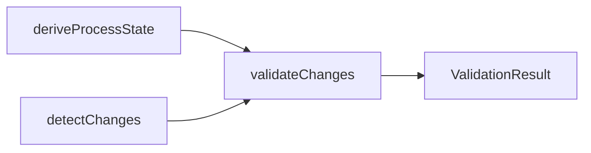

## Quick Reference

### Protection Levels

| Status      | Level | Allowed                    | Blocked                               |
| ----------- | ----- | -------------------------- | ------------------------------------- |
| `roadmap`   | none  | Full editing               | -                                     |
| `deferred`  | none  | Full editing               | -                                     |
| `active`    | scope | Edit existing deliverables | Adding new deliverables               |
| `completed` | hard  | Nothing                    | Any change without `@*-unlock-reason` |

### Valid Transitions

| From        | To                     | Notes                            |
| ----------- | ---------------------- | -------------------------------- |
| `roadmap`   | `active`, `deferred`   | Start work or postpone           |
| `active`    | `completed`, `roadmap` | Finish or regress if blocked     |
| `deferred`  | `roadmap`              | Resume planning                  |
| `completed` | _(none)_               | Terminal -- use unlock to modify |

### Escape Hatches

| Situation                     | Solution                           | Example                                       |
| ----------------------------- | ---------------------------------- | --------------------------------------------- |
| Fix bug in completed spec     | Add `@*-unlock-reason:'reason'`    | `@architect-unlock-reason:'Fix typo'`         |
| Modify outside session scope  | `--ignore-session` flag            | `architect-guard --staged --ignore-session`   |
| CI treats warnings as errors  | `--strict` flag                    | `architect-guard --all --strict`              |
| Skip workflow (legacy import) | Multiple transitions in one commit | Set `roadmap` then `completed` in same commit |

---

## CLI Usage

```bash
architect-guard [options]
```

### Modes

| Flag       | Description                       | Use Case           |
| ---------- | --------------------------------- | ------------------ |
| `--staged` | Validate staged changes (default) | Pre-commit hooks   |
| `--all`    | Validate all changes vs main      | CI/CD pipelines    |
| `--files`  | Validate specific files           | Development checks |

### Options

| Flag                | Description                            |
| ------------------- | -------------------------------------- |
| `--strict`          | Treat warnings as errors (exit 1)      |
| `--ignore-session`  | Skip session scope rules               |
| `--show-state`      | Debug: show derived process state      |
| `--format json`     | Machine-readable output                |
| `-f, --file <path>` | Specific file to validate (repeatable) |
| `-b, --base-dir`    | Base directory for file resolution     |

### Exit Codes

| Code | Meaning                                      |
| ---- | -------------------------------------------- |
| `0`  | No errors (warnings allowed unless --strict) |
| `1`  | Errors found                                 |

### Examples

```bash
architect-guard --staged                        # Pre-commit hook (recommended)
architect-guard --all --strict                  # CI pipeline with strict mode
architect-guard --file specs/my-feature.feature # Validate specific file
architect-guard --staged --show-state           # Debug: see derived state
architect-guard --staged --ignore-session       # Override session scope
```

---

## Pre-commit Setup

Configure Process Guard as a pre-commit hook using Husky.

```bash
#!/usr/bin/env sh
. "$(dirname -- "$0")/_/husky.sh"

npx architect-guard --staged
```

### package.json Scripts

```json
{
  "scripts": {
    "lint:process": "architect-guard --staged",
    "lint:process:ci": "architect-guard --all --strict"
  }
}
```

---

## Programmatic API

Use Process Guard programmatically for custom validation workflows.

```typescript
import {
  deriveProcessState,
  detectStagedChanges,
  validateChanges,
  hasErrors,
  summarizeResult,
} from '@libar-dev/architect/lint';

// 1. Derive state from annotations
const state = (await deriveProcessState({ baseDir: '.' })).value;

// 2. Detect changes
const changes = detectStagedChanges('.').value;

// 3. Validate
const { result } = validateChanges({
  state,
  changes,
  options: { strict: false, ignoreSession: false },
});

// 4. Handle results
if (hasErrors(result)) {
  console.log(summarizeResult(result));
  process.exit(1);
}
```

### API Functions

| Category | Function                 | Description                       |
| -------- | ------------------------ | --------------------------------- |
| State    | deriveProcessState(cfg)  | Build state from file annotations |
| Changes  | detectStagedChanges(dir) | Parse staged git diff             |
| Changes  | detectBranchChanges(dir) | Parse all changes vs main         |
| Validate | validateChanges(input)   | Run all validation rules          |
| Results  | hasErrors(result)        | Check for blocking errors         |
| Results  | summarizeResult(result)  | Human-readable summary            |

---

## Architecture

Process Guard uses the Decider pattern: pure functions with no I/O.


