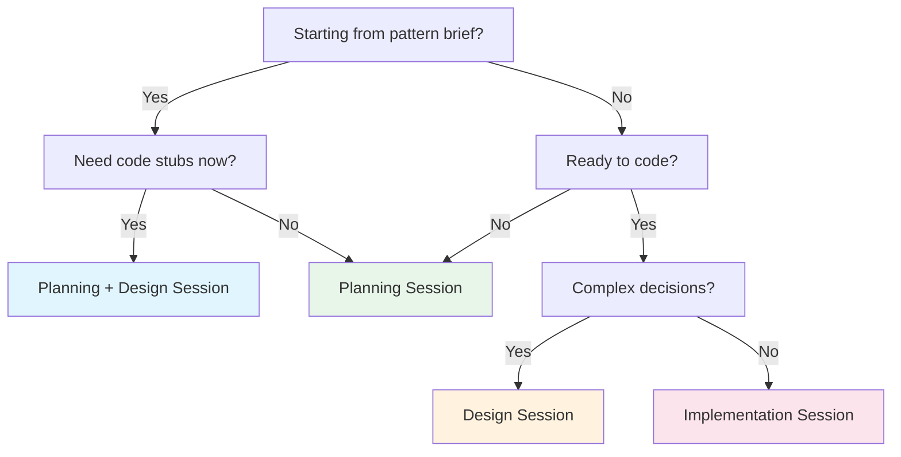

## Session Decision Tree

Use this flowchart to determine which session type to run.



## Session Type Contracts

| Session           | Input               | Output                      | FSM Change                           |
| ----------------- | ------------------- | --------------------------- | ------------------------------------ |
| Planning          | Pattern brief       | Roadmap spec (`.feature`)   | Creates `roadmap`                    |
| Design            | Complex requirement | Decision specs + code stubs | None                                 |
| Implementation    | Roadmap spec        | Code + tests                | `roadmap` -> `active` -> `completed` |
| Planning + Design | Pattern brief       | Spec + stubs                | Creates `roadmap`                    |

---

## Implementation Execution Order

Implementation sessions MUST follow this strict 5-step sequence. Skipping steps causes Process Guard rejection at commit time.

1. **Transition to `active` FIRST** (before any code changes)
2. **Create executable spec stubs** (if `@architect-executable-specs` present)
3. **For each deliverable:** implement, test, update status to `complete`
4. **Transition to `completed`** (only when ALL deliverables done)
5. **Regenerate docs:** `pnpm docs:all`

### Implementation Do NOT

| Do NOT                              | Why                                     |
| ----------------------------------- | --------------------------------------- |
| Add new deliverables to active spec | Scope-locked state prevents scope creep |
| Mark completed with incomplete work | Hard-locked state cannot be undone      |
| Skip FSM transitions                | Process Guard will reject               |
| Edit generated docs directly        | Regenerate from source                  |

---

## Planning Session

**Goal:** Create a roadmap spec. Do not write implementation code.

### Context Gathering

```bash
pnpm architect:query -- overview                                # Project health
pnpm architect:query -- list --status roadmap --names-only      # Available patterns
```

### Planning Checklist

- [ ] **Extract metadata** from pattern brief: phase, dependencies, status
- [ ] **Create spec file** at `{specs-directory}/{product-area}/{pattern}.feature`
- [ ] **Structure the feature** with Problem/Solution, tags, deliverables table
- [ ] **Convert constraints to Rule: blocks** with Invariant/Rationale
- [ ] **Add scenarios** per Rule: 1 happy-path + 1 validation minimum
- [ ] **Set executable specs location** via `@architect-executable-specs` tag

### Planning Do NOT

- Create `.ts` implementation files
- Transition to `active`
- Ask "Ready to implement?"

---

## Design Session

**Goal:** Make architectural decisions. Create code stubs with interfaces. Do not implement.

### Context Gathering

```bash
pnpm architect:query -- context <PatternName> --session design  # Full context bundle
pnpm architect:query -- dep-tree <PatternName>                  # Dependency chain
pnpm architect:query -- stubs <PatternName>                     # Existing design stubs
```

### When to Use Design Sessions

| Use Design Session         | Skip Design Session |
| -------------------------- | ------------------- |
| Multiple valid approaches  | Single obvious path |
| New patterns/capabilities  | Bug fix             |
| Cross-context coordination | Clear requirements  |

### Design Checklist

- [ ] **Record decisions** as PDR `.feature` files in `architect/decisions/`
- [ ] **Document options** with at least 2-3 approaches and pros/cons
- [ ] **Get approval** from user on recommended approach
- [ ] **Create code stubs** in `architect/stubs/{pattern-name}/`
- [ ] **Verify stub identifier spelling** before committing
- [ ] **List canonical helpers** in `@architect-uses` tags

### Design Do NOT

- Create markdown design documents (use decision specs instead)
- Create implementation plans
- Transition spec to `active`
- Write full implementations (stubs only)

---

## Planning + Design Session

**Goal:** Create spec AND code stubs in one session. For immediate implementation handoff.

### When to Use

| Use Planning + Design               | Use Planning Only            |
| ----------------------------------- | ---------------------------- |
| Need stubs for implementation       | Only enhancing spec          |
| Preparing for immediate handoff     | Still exploring requirements |
| Want complete two-tier architecture | Don't need Tier 2 yet        |

---

## Handoff Documentation

For multi-session work, capture state at session boundaries using the Process Data API.

```bash
pnpm architect:query -- handoff --pattern <PatternName>
pnpm architect:query -- handoff --pattern <PatternName> --git   # include recent commits
```

---

## Quick Reference: FSM Protection

| State       | Protection   | Can Add Deliverables | Needs Unlock |
| ----------- | ------------ | -------------------- | ------------ |
| `roadmap`   | None         | Yes                  | No           |
| `active`    | Scope-locked | No                   | No           |
| `completed` | Hard-locked  | No                   | Yes          |
| `deferred`  | None         | Yes                  | No           |
