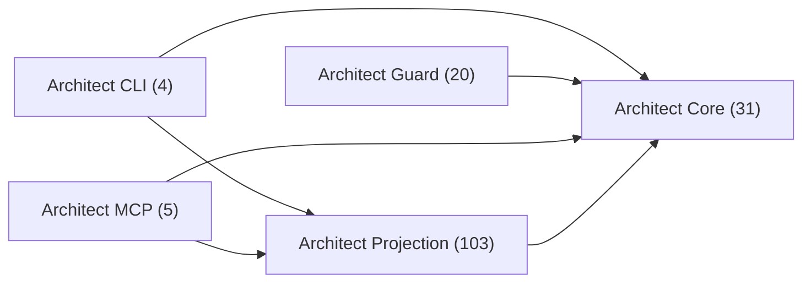

# Claude Code Conversation

**Project:** /Users/darkomijic/dev-projects/architect
**Session:** f9516255-8890-43eb-a45b-4423eee6505a
**Date:** 5/27/2026, 3:28:47 AM
**Exported:** 5/27/2026, 4:50:07 AM

---
## User

<command-name>/clear</command-name>
            <command-message>clear</command-message>
            <command-args></command-args>

---

## User

<local-command-caveat>Caveat: The messages below were generated by the user while running local commands. DO NOT respond to these messages or otherwise consider them in your response unless the user explicitly asks you to.</local-command-caveat>

---

> {"parentUuid":"2858c976-3fea-4fb1-be24-e927aaa48d9e","isSidechain":false,"type":"system","subtype":"local_command","content":"<local-command-stdout></local-command-stdout>","level":"info","timestamp":1779845327997,"uuid":"4ade9fa7-aa41-450d-9d37-54979453cdbb","isMeta":false,"userType":"external","entrypoint":"cli","cwd":"/Users/darkomijic/dev-projects/architect","sessionId":"f9516255-8890-43eb-a45b-4423eee6505a","version":"2.1.150","gitBranch":"campaign/docs-and-skills-consolidation"}

---

## User

Please carefully review the uncommitted code. Pay special attention to architect-specific context, use architect skills and API to carefully explore everything. The most important aspect of this review is architectural review of this initial design of the universal doc generation capabilities. Please plan fixes, improvements, and polish and implement.

Important: @.pr-coordination/ docs are temporary artefacts - only used for refactoring sessions which are not spec-driven. Not a common practice in projects using Architect for delivery process. But given that we just extracted this package from monore and are setting it up, we needed to use this. We will delete these docs once we confirm that information recorded there has no value: 1) it is transferred either to specs or to code and executable specs, 2) addressed and not needed for some other reasons, 3) rejected stuff, etc...

So we will need to use forked agents to review the content once you gather enough context, and especially explore and "probe" the state using the API.

We will need a compact report and/or consolidation and removal of information which is no longer relevant to `.pr-coordination/archive/` as we already did once.

We need to know what is still relevant and needs review or addressing as specs, requirements, decision records... The end goal is to delete this as soon as we are done with it. And move to spec-driven process as in other repos with Architect.

These are the most prominent docs in the coordination folder.

```
.pr-coordination/DECISIONS.md
.pr-coordination/DOCS-IA-FINDINGS.md
.pr-coordination/EXECUTION-PLAN.md
.pr-coordination/HANDOFF-docs-api-sweep.md
.pr-coordination/HANDOFF-WS7-shape-tier.md
.pr-coordination/HUD-IDEATION.md
.pr-coordination/PREAMBLE.md
.pr-coordination/README.md
.pr-coordination/SESSION-REPORTS-AND-LEARNINGS.md
.pr-coordination/state.json
```

---

<details>
<summary>Claude's Reasoning</summary>


</details>

---

## Claude

I'll start by loading the three mandatory skills, then explore the architect state via the API and the uncommitted code. Let me begin.

---

### Tool: Skill(architect-base)

---

### Tool: Skill(architect-data-api)

---

### Tool: Skill(architect-sessions)

---

## User

Base directory for this skill: /Users/darkomijic/dev-projects/architect/.claude/skills/architect-base

# Architect Base Context

Operational baseline for every session in this Architect repo. Self-contained — does not require any other architect-\* skill to be loaded first.

When you load this skill, state briefly that the **architect-base** context is loaded so the user can confirm it activated.

## 1. What Libar Architect is

A **source-first reliability layer for agentic engineering and end-to-end software delivery**. Architect manages the full lifecycle — requirements, design / architecture, implementation, maintenance — as a typed, queryable, managed-as-code process state.

Two things in one place:

- **The product** — the `@libar-dev/architect-*` package family lives in this repo.
- **The delivery process** — this repo runs the architect toolchain on itself (dogfood) to plan, design, implement, and review its own work.

Architect serves two audiences from the same source of truth:

- **AI agents and humans doing work** — live, queryable projections via CLI + MCP (`pnpm architect:query`, `architect_*` tools), task-oriented context bundles, FSM-validated transitions.
- **Surfaces that consume the projection** — generated documentation, the Architect Studio web/desktop app's view state, architecture-review context, release notes, change logs.

The **canonical source of truth** is annotated production code + executable Gherkin (`tests/features/`). Everything else is a projection.

## 2. The delivery process in this repo

| Aspect           | Value                                                                                                            |
| ---------------- | ---------------------------------------------------------------------------------------------------------------- |
| Config           | `architect.config.ts` at the repo root                                                                           |
| Working state    | `architect/` (specs, decisions, releases, stubs, step-stubs, design-reviews, ideations)                          |
| Source of truth  | Annotated `packages/*/src/**/*.ts` + executable Gherkin under `tests/features/` and `packages/*/tests/features/` |
| CLI              | `pnpm architect:query <verb>` (canonical script name across architect-managed repos)                             |
| MCP              | `architect` server → `mcp__architect__*` callable tools                                                          |
| Validation entry | `pnpm typecheck`, `pnpm test`, `pnpm validate:all`, `pnpm architect:guard --staged`                              |
| Doc regeneration | `pnpm docs:all` → `docs-live/` (git-tracked, derived — determinism-gate diff target)                                                             |

When this package family is consumed by another project, the consumer wires their own `architect.config.ts` and exposes their own `architect:query` script — the contracts above are stable across architect-managed repos.

## 3. Architect State — what lives where

`architect/` holds **working state**, not the source of truth. It is parsed by `@cucumber/gherkin` for projection / extraction and is explicitly **excluded from TypeScript compile, ESLint, vitest**.

| Folder                        | Role                                                                                | Lifetime                                                        |
| ----------------------------- | ----------------------------------------------------------------------------------- | --------------------------------------------------------------- |
| `architect/specs/ideas/`      | Idea-tier specs (lightest authored shape)                                           | Until promotion                                                 |
| `architect/specs/candidates/` | Candidate-tier specs (open questions + 1-2 scenarios)                               | Until promotion                                                 |
| `architect/slices/`           | Slice-tier multi-pattern lateral views (idea-tier structural variant; `@architect-level:slice`, no `@architect-parent`) | Reference                                                       |
| `architect/specs/`            | Plan- and design-tier specs (deliverables + full scenarios + stubs)                 | **Until value transferred to executable Gherkin, then deleted** |
| `architect/stubs/`            | Design-tier TS contract scaffolds (one folder per pattern)                          | Ephemeral                                                       |
| `architect/step-stubs/`       | Design-tier stub step definitions                                                   | Ephemeral                                                       |
| `architect/decisions/`        | ADRs / PDRs — compact, durable, decisions-only (no operational or temporal context) | **Permanent**                                                   |
| `architect/releases/`         | Release notes, roadmap, phase plans                                                 | Permanent                                                       |
| `architect/design-reviews/`   | **Auto-generated** architecture-slice review artifacts (sequence + component mermaid; scoped to specs incl. unimplemented) — generated output, **not** a home for hand-authored captures | Generated (derived) |
| `architect/ideations/`        | Pre-idea-tier notes                                                                 | Until promoted                                                  |

**Two Gherkin parsers, do not confuse them:**

- `@cucumber/gherkin` reads `architect/specs/`, `architect/decisions/`, `formal-spec/` at doc-gen + pattern-graph build time.
- `@amiceli/vitest-cucumber` reads executable specs (`tests/features/`, `packages/*/tests/features/`) at test time.

## 4. PatternGraph — the central abstraction

A **pattern** is a named architectural unit (a feature, service, component, contract, codec, spec). The graph nodes are patterns; the edges are typed relationships.

**Tag taxonomy** (verify live via `pnpm architect:query taxonomy --format json`):

- **Identity**: `@architect-pattern:<Name>` (one file owns identity)
- **State**: `@architect-status:<candidate|roadmap|active|completed|deferred>`; `@architect-maturity` derives from status (idea=consideration, plan=delivery) and an explicit value wins (§04) — explicit is **required only at the idea tier** (`@architect-maturity:idea`, the guard's opt-in), dropped on promotion to candidate, derived elsewhere
- **Structure**: `@architect-bounded-context:<context>`, `@architect-role:<closed-enum>`
- **Product**: `@architect-product-area:<area>` (PRD grouping; **required** at idea tier)
- **Edges**: `@architect-uses:<Pattern>` (dependency), `@architect-implements:<Pattern>` (realization, test → production), `@architect-parent:<Pattern>` (hierarchy)
- **Hierarchy axis**: `@architect-level:<epic|phase|task|slice>` (independent of maturity)
- **Implementation enrichment** (on production TS): `@architect-usecase`, `@architect-decision:<ADR>`, `@architect-target` (stub forward pointer)
- **Forward link**: `@architect-executable-specs:<path>` (design spec → executable feature)
- **Audit**: `@architect-unlock-reason:<reason>` (required for non-standard FSM transitions)

> **Depth:** the categories above are the conceptual model. The three orthogonal classification axes (role · bounded-context · layer) and the csv-vs-colon authoring rules live in [`references/taxonomy.md`](references/taxonomy.md). The **complete enumerated set is generated, never hand-maintained** — query it live (`pnpm architect:query taxonomy --format json`) or read the generated `docs-live/TAXONOMY.md`. Those two are canonical; the categories here teach the shape, they do not enumerate it.

**Instances** of patterns live in two surfaces:

- `.feature` files (canonical for behavioral patterns) — tags at the feature level
- `.ts` files (canonical for code-originated patterns: codecs, contracts, utilities) — JSDoc `@architect-*` blocks

**Edges**: `depends-on` / `uses` / `implements` / `see-also` / `parent`.

**Projections** are Zod-validated **Named Domain Fragments** (`@libar-dev/architect-projection`). The same graph projects into markdown, JSON, context bundles, architecture views, release notes. Fragments are the trust boundary — anything outside a fragment is anecdote.

## 5. Entry points

- **`architect.config.ts`** — config loader; taxonomy customization, source globs, validation rules.
- **`pnpm architect:query <verb>`** — primary CLI; deterministic, JSON-pipeable. **This is the default; use it.**
- **`architect_*` MCP tools** — sub-ms per call, same verbs, **snake_case end-to-end** (`architect_scope_validate`, not `architect_scope-validate`). Reach for MCP only when bursting ≥5 verbs in close sequence.
- File scanning architect-scoped paths to learn pattern state is a smell — every "what's the status of X?" question has a verb.

## 6. Validation layers

| Layer                 | Command                                                         | What it checks                                                           |
| --------------------- | --------------------------------------------------------------- | ------------------------------------------------------------------------ |
| Type system           | `pnpm typecheck`                                                | Strict TS (see CLAUDE.md "TypeScript strictness")                        |
| Annotation lint + DoD | `pnpm validate:all`                                             | Definition-of-done, anti-patterns, dangling references                   |
| Process Guard (FSM)   | `pnpm architect:guard --staged`                                 | FSM transitions, `@architect-unlock-reason` rules, structural invariants |
| Graph integrity       | `pnpm architect:query arch dangling --strict --baseline <path>` | Cross-pattern reference drift                                            |

All of these are CI-enforced. Failing gates are stop-and-surface; never `--no-verify`.

## 7. Key decision records (load-bearing, decisions-only)

ADRs / PDRs in `architect/decisions/` are **permanent and decisions-only**. They record a *decision* + its rationale and **only durable, non-execution-related facts**. Operational or temporal context — status, work-in-progress, ETAs, who is doing what this week — **never** belongs here; that is the difference between a decision record and a worklog. Decisions are amended via a **new** ADR, never by editing the old one. Read the relevant record before changing anything in its area — through the Data API (`pnpm architect:query documentation decisions`, or `pattern ADR006SingleReadModelArchitecture`), never paraphrased from memory.

The load-bearing set:

- **ADR-003** — Source-First Pattern Architecture
- **ADR-005** — Codec / Renderer Separation
- **ADR-006** — Single Read Model
- **ADR-007** — Coordinated Taxonomy Redesign
- **ADR-009** — Projection Trust Boundary

> **Not the same as a campaign `DECISIONS.md`.** `architect/decisions/` holds **durable** ADRs (permanent). A campaign's `.pr-coordination/DECISIONS.md` holds **ephemeral** judgment-calls for one active campaign (resolved-with-commit-sha, then archived). Both are called "decisions" but have opposite lifetimes — do not file durable architecture in the campaign log, or campaign bookkeeping in an ADR.
>
> **Depth:** [`references/decision-records.md`](references/decision-records.md).

## 8. Annotation ownership (operational)

**Split-ownership principle**:

- Feature files own **what + when** (planning surface).
- Production TS owns **how + with what** (implementation surface).
- Neither duplicates the other.

A pattern is **identified** by exactly one surface — the feature file for behavioral patterns, the `.ts` file for code-originated patterns (codecs, contracts, utilities). Production TS realizes a feature-owned pattern via `@architect-implements:<Pattern>` — a relation, not an identity claim.

**Production-TS `@architect-*` JSDoc is additive, not mandatory.** A pattern can be `@architect-status:completed` with zero `@architect-*` JSDoc on its source, provided the executable feature carries the full surface (identity, status, deps, invariants, scenarios). Annotations enrich discoverability; they do not gate completion.

Sampled completed patterns like `ConfigLoader` and `DefineConfig` carry zero JSDoc on the production source and are legitimately complete. A reviewer flagging "no annotations on `<file.ts>`" as a value-transfer blocker is mistaken.

> **Depth:** the per-tag ownership tables (what feature files own vs what production TS owns) + the code-originated-identity rules live in [`references/annotation-ownership.md`](references/annotation-ownership.md).

## 9. Detail tiers and maturity levels

There are **six** levels along the detail/maturity axis. Four are authored in `architect/specs/`; two are post-spec.

| Level       | Where                                           | What it adds vs the level above                                                          |
| ----------- | ----------------------------------------------- | ---------------------------------------------------------------------------------------- |
| Idea        | `architect/specs/ideas/`                        | User story + 1-3 invariant-only rules; **≤30 lines soft cap**                            |
| Candidate   | `architect/specs/candidates/`                   | `**Open Questions:**` block + 1-2 happy-path scenarios                                   |
| Plan        | `architect/specs/`                              | Deliverables table, full scenario set, `**Rationale:**` / `**Verified by:**`             |
| Design      | `architect/specs/`                              | Stubs in `architect/stubs/<pattern>/`, error/edge/integration scenarios, ADR refs        |
| Executable  | `tests/features/`, `packages/*/tests/features/` | Realization (`@architect-implements:`) + executable scenarios that prove invariants hold |
| Maintenance | Shipped code + its executable feature           | Evolves in place; scenarios grow as behavior grows                                       |

**Promotion is linear**: `idea → candidate → plan → design → executable`. Skipping rungs is rejected EXCEPT for the **refactoring carve-out** — backfilling coverage for code that already ships skips directly to design or executable tier, using the `<Pattern>ExecutableTests` convention.

> **Depth:** the per-tier line budgets, mandatory-tag sets, epic/slice variants, and worked promotion examples live in [`references/four-tier-ladder.md`](references/four-tier-ladder.md). The 4-field `Rule:` block convention (`Invariant` / `Rationale` / `Verified by`) and its per-tier field requirements live in [`references/rule-block-template.md`](references/rule-block-template.md).

## 10. The detail-level doctrine — CRITICAL, easy to get wrong

**Tier line budgets and field requirements are floors and soft caps, NOT formulaic quotas.** The level of detail at idea / plan / design is **contextual** — it is up to the design judgment of the executor.

The two failure modes to refuse:

- **Bloat to satisfy the form.** Adding deliverables, stubs, full design scenarios, ADR refs for the 50th instance of an established pattern, a CRUD endpoint, an industry-standard piece of work. Detail you don't need is detail that will rot.
- **Strip context to match the tier.** Truncating real, hard-won session context at the end of planning or design because "we're only at idea / plan tier." Precious nuance gets destroyed in service of the form.

**Both fail the goal.** Author what is meaningful for THIS pattern in THIS context:

- **Invest detail** when the work is architecturally significant, non-routine, sensitive (security / data privacy / 3rd-party integration / public-facing), requires external approval, or is context-critical.
- **Skip detail** when the pattern is the Nth instance of a well-understood shape, a CRUD endpoint, or an industry-standard piece with no novel decisions.

Design-level specs do not always need stubs and full design details. Idea-tier specs are not required to be terse. Use judgment — too much content is worse than not enough; both extremes erode the signal.

## 11. FSM lifecycle (high level)

```
            ┌─ (maturity flip, human acceptance gate, not process-guard)
            │
candidate ──┴──► roadmap ──► active ──► completed
                              │              │
                              ▼              ▼
                          deferred       (terminal — reopen requires unlock-reason)
```

- `candidate → roadmap` is a **maturity flip** (acceptance gate, human judgment). NOT a process-guard transition.
- `roadmap → active`, `active → completed`, `active → roadmap`, `roadmap → deferred`, `deferred → roadmap` are process-guard-validated. Invalid jumps are rejected.
- `completed` is terminal. Reopening requires `@architect-unlock-reason:<≥10 char, not a placeholder>`.

Verify any transition before flipping:

```bash
pnpm architect:query scope-validate <Pattern> design|implement
pnpm architect:query query isValidTransition <from> <to>   # deterministic boolean
```

> **Depth:** the process-guard transition table, the maturity-flip-vs-FSM distinction, and the `@architect-unlock-reason:` authoring rules live in [`references/fsm-transitions.md`](references/fsm-transitions.md).

## 12. Spec ↔ Pattern relationships (bipartite)

Production patterns and test patterns are **two nodes** joined by `@architect-implements:`. A test feature carries two file-level tags:

```gherkin
@architect-pattern:DefineConfigExecutableTests
@architect-implements:DefineConfig
```

Two sanctioned suffix conventions:

- `<Name>Testing` — test pattern accompanying a deliberately designed pattern (flowed through plan / design).
- `<Name>ExecutableTests` — test pattern backfilling shipped code (the formal escape from retroactive plan-level specs).

The PatternGraph treats them identically; the suffix is human-facing.

> **Depth:** the forward/reverse link pair, the `*ExecutableTests` escape-hatch authoring flow, and the hierarchy axis (`@architect-level` / `@architect-parent`) live in [`references/spec-pattern-relationships.md`](references/spec-pattern-relationships.md).

## 13. Value transfer and design-spec deletion (high level)

Design-level specs are **scaffolds, not permanent documentation**. Once implementation completes, the spec's value moves to durable surfaces and the spec is deleted.

Durable carriers:

- **Executable Gherkin** (canonical) — pattern identity, status, dependencies, invariants, scenarios that prove them.
- **JSDoc `@architect-*` on production code** (additive) — rationale that doesn't fit in Gherkin, decisions, usecases, roles.

**Pre-deletion gate (high level)**: forward link present + resolves; reverse link present; all Rule blocks with invariants have counterparts in the executable feature.

**Default**: ask the user before deleting. Deferring to code review for batched deletion across a related set is more common than delete-immediately.

> **Depth:** the transfer checklist, the five-criterion pre-deletion gate, and deletion timing live in [`../architect-sessions/references/ephemeral-spec-deletion.md`](../architect-sessions/references/ephemeral-spec-deletion.md) — the central doctrine every session type should understand.

## 14. Data API — essentials

Default surface: **CLI**. Reach for MCP only when bursting ≥5 verbs.

```bash
# Health / inventory
pnpm architect:query overview                               # progress + blockers
pnpm architect:query status                                 # status distribution
pnpm architect:query list [--status v] [--names-only]
pnpm architect:query search <query>                         # fuzzy pattern-name match

# Per-pattern detail
pnpm architect:query pattern <Name>                         # full PatternDetail
pnpm architect:query context <Pattern> --session <intent>   # curated bundle
pnpm architect:query files <Pattern> [--related]
pnpm architect:query dep-tree <Pattern> [--depth n]
pnpm architect:query rules --pattern <Pattern> [--only-invariants]

# Composite (default pre-flight when a pattern name is known)
pnpm architect:query bundle <Pattern> --mode <plan|design|implement|review> --format json

# Gates (deterministic)
pnpm architect:query scope-validate <Pattern> <design|implement>      # PASS / WARN / BLOCKED
pnpm architect:query query isValidTransition <from> <to>              # JSON boolean
pnpm architect:query arch dangling --baseline <path> --strict         # non-zero exit on drift

# Architecture views
pnpm architect:query arch blocking                          # global blocker view
pnpm architect:query arch neighborhood <Pattern>
pnpm architect:query taxonomy [--count] [--format json]
```

**MCP twins** use snake_case end-to-end: `architect_overview`, `architect_scope_validate`, `architect_bundle`, etc. The canonical inventory is `packages/architect-mcp/src/tool-registry.ts` — read it for the current tool set rather than trusting a count cached here.

**Quirks worth knowing now** (full list in the dedicated data-API skill):

- `scope-validate` only accepts `design` and `implement`. `planning` / `review` error with `Scope type must be design or implement`.
- `bundle --include` keeps only the **last** repeated flag — use the comma form: `--include rules,deps,open-questions`.
- `pattern <Name>` "not found" can mean parse failure (with provenance) OR doesn't exist — cross-check with `search` or `list --names-only`.

## 15. Bootstrap discipline (every session)

Before any architect-scoped `Read` / `Glob` / `Grep`:

```bash
pnpm architect:query overview
```

If a pattern name is in scope:

```bash
pnpm architect:query bundle <Pattern> --mode <plan|design|implement|review> --format json
```

The Data API is faster (2-5s cold CLI, sub-ms MCP) and more accurate than file scanning, and the output is the canonical signal — file scanning gives you snapshots that can lie.

## 16. Anti-anecdote — the live graph wins

When a sample-derived finding (an old session-handoff note, a snapshot folder with a SHA suffix, an n=2 "we tried this twice" worklog, or a skill body that has drifted) appears to contradict the live state:

- **The live CLI / PatternGraph is canonical.** `pnpm architect:query` output reflects the graph as it is right now; a skill paraphrase reflects the graph as it was when written. When they disagree, the CLI wins.
- **A sample is useful for *why*, not *what*.** It explains why a rule exists; it is not authoritative for what the rule currently is.
- **Silence is provisional, not permission.** If the live state is silent on a question a sample answers, treat the sample's finding as provisional and flag it (`FEEDBACK.md`) rather than encoding it as doctrine.

This is the same instinct as `architect-data-api`'s "API surprises are signal" — surprises feed the loop, they do not override the source of truth.

## 17. What this skill does NOT cover

This is the operational baseline (vocabulary + doctrine). Depth lives in [`references/`](references/); execution lives in two dedicated skills:

- **`architect-sessions`** — the spec-driven session lifecycle (idea/candidate authoring, design, implement, review-spec, review-implementation, handoff), each behind progressive disclosure. The detailed per-session workflows, the full pre-deletion gate, and the value-transfer execution detail are there.
- **`architect-refactor-session`** — the non-spec-driven carve-out (evolving shipped code in place) and the multi-session / PR coordination conventions for large campaigns.

If a session needs one of those, load the dedicated skill; do not paraphrase it from memory.


---

### Skill Result

Launching skill: architect-base

```
Launching skill: architect-base
```

---

## User

Base directory for this skill: /Users/darkomijic/dev-projects/architect/.claude/skills/architect-data-api

# Architect Data API — `pnpm architect:query`

The CLI (`pnpm architect:query <verb>`) is the canonical surface for the PatternGraph. Every "what is the state of X?" question about a pattern, every dependency walk, every FSM gate, every dangling-reference check is one verb away. Output is structured, deterministic, sub-second on warm cache, and pipes into `jq` or a PR description.

> **Piping to `jq`? Use `pnpm -s`.** Bare `pnpm architect:query <verb> --format json | jq` **fails** with a parse error — `pnpm` prints its `> architect@0.0.0 …` lifecycle banner to **stdout** ahead of the JSON. The `-s` (silent) flag suppresses it: `pnpm -s architect:query <verb> --format json | jq`. This is the single most common reason an agent wrongly concludes "the API isn't clean JSON" and falls back to `grep`. Always `-s` when piping. (See "Output formats & JSON consumption".)

**File scanning to learn about a pattern is a smell.** It is slower, less accurate, and easy to lie to. Treat the CLI as a first-class read surface and reach for `Read` / `Glob` / `Grep` only when you actually need the file's full text.

## Sessions in this repo

The Architect delivery process recognizes a small number of work shapes. Knowing which one you are in helps you choose what to look at, but **does not change which commands you run** — see "State-driven, not intent-driven" below.

- **Idea / candidate authoring** — drafting new patterns, refining open questions, sharpening invariants. Lives in `architect/specs/ideas/` and `architect/specs/candidates/`.
- **Design tier authoring** — promoting a plan-level spec, adding deliverables, stubs, exhaustive scenarios, ADR references. Lives in `architect/specs/`.
- **Implementation** — building from a design-level spec, transferring value to annotated production code + executable Gherkin.
- **Review** — gap-finding on a design spec before implementation, or verifying value transfer after a completed implementation.
- **Handoff** — end-of-session capture so the next session resumes from a clean state.
- **Maintenance** — evolving shipped code in place; scenarios grow as behaviour grows.

`architect-base` §9–§13 carries the maturity ladder, FSM lifecycle, spec / pattern bipartite relationship, and value-transfer doctrine that make these shapes legible.

## State-driven, not intent-driven

The API is being shaped around a single principle: **what you get back is determined by the pattern's state, not by your stated intent**. A pattern that is `active` with all dependencies completed answers questions the same way whether the caller is about to plan, implement, or review — only the caller's downstream action differs.

In practice this means:

- The same handful of verbs (`overview`, `pattern`, `bundle`, `dep-tree`, `files`, `rules`, `scope-validate`) covers every session shape above.
- `bundle <Pattern>` is the default pre-flight; it returns deliverables + dependencies + rules + open questions + docstring in one call.
- The `--mode <plan|design|implement|review>` flag on `bundle` / `context` exists and changes which blocks are included by default, but defaults are good and the variation in returned data is dominated by what the pattern actually _is_ on disk.
- Expect intent flags to recede further over time. The skill leads with state-driven exploration; per-intent recipes are not authored here.

## Pattern exploration — the everyday verbs

These are the verbs every session reaches for. Run them in this order when picking up an unfamiliar pattern.

```bash
# 1. Health + inventory — start here every time
pnpm architect:query overview

# 2. Locate — if you know a name fragment but not the canonical pattern name
pnpm architect:query search <fragment>
pnpm architect:query list --status candidate --names-only

# 3. Pre-flight — the default composite, returns deliverables + deps + rules + open-questions + docstring
pnpm architect:query bundle <Pattern> --format json

# 4. Drop down to slices when bundle gave you enough to ask sharper questions
pnpm architect:query pattern <Pattern>                # full PatternDetail
pnpm architect:query dep-tree <Pattern> [--depth n]   # dependency walk
pnpm architect:query files <Pattern> [--related]      # implementation surface
pnpm architect:query rules --pattern <Pattern>        # invariants + verified-by
pnpm architect:query context <Pattern>                # adds architecture neighbours
pnpm architect:query open-questions [--parent <X>]    # candidate readiness signal
```

When the work involves several patterns, run `bundle` for each — the calls are cheap and the structured output composes well.

## Gates — deterministic verdicts

Three verbs are designed to be parsed for a verdict, not read as prose:

```bash
# FSM scope validation — checklist + final verdict
pnpm architect:query scope-validate <Pattern> design|implement

# Deterministic FSM transition gate — JSON boolean
pnpm architect:query query isValidTransition <from> <to>

# Graph-integrity gate — non-zero exit on drift vs baseline
pnpm architect:query arch dangling --baseline packages/architect-guard/src/lint/dangling-baseline.json --strict
```

`scope-validate` accepts only `design` and `implement`. Idea- and candidate-tier readiness is structural — `architect-base` §9.

`arch blocking` is the conversational counterpart to these gates: it prints `X blocked by: Y, Z` lines for every pattern with incomplete dependencies. Use it for the global blocker view.

## Verb reference

Organized by purpose. Every CLI verb has an MCP twin (mapping in "MCP twins" below).

### Health & inventory

- **`overview`** — text: progress (`260 patterns (114 completed, 120 active, 26 planned) = 44%`) + blocking summary.
- **`status`** — status distribution counts + percentages, no per-pattern detail.
- **`list [--status v] [--role tag] [--parent X] [--count] [--names-only]`** — pattern catalog. `--parent` resolves strictly; unknown parent exits non-zero with `Parent pattern not found`. `--names-only` returns a JSON string array.
- **`search <query>`** — fuzzy pattern-name search; JSON `[{patternName, score, matchType}]`.
- **`taxonomy [--count]`** — `--count` prints a one-line summary; `--format json` returns the full taxonomy tree.
- **`tags`** — `TagUsageMatrix`: pattern count + per-tag value distribution.
- **`diagnostics`** — JSON array of structural warnings.
- **`sources`**, **`unannotated`** — coverage helpers.

### Per-pattern detail

- **`pattern <Name>`** — full PatternDetail (deliverables, relationships, rules, role, maturity, file). When the underlying feature file fails to parse, this verb reports parse provenance `(kind, path, parser line:col)` instead of a flat "not found". A "not found" response is therefore not binary — it can mean _parse failure_ OR _truly absent_. Cross-check with `search` or `list --names-only` before concluding.
- **`context <Pattern> [--session planning|design|implement]`** — curated bundle: summary, dependencies, architecture neighbours. With `--session implement`, also includes an `=== FSM ===` line showing current status + valid transitions + protection level.
- **`files <Pattern> [--related]`** — primary deliverable file. With `--related`, adds `=== COMPLETED DEPENDENCIES ===`, `=== ROADMAP DEPENDENCIES ===`, `=== ARCHITECTURE NEIGHBORS ===` sections.
- **`dep-tree <Pattern> [--depth <n>]`** — dependency chain walk.
- **`rules [--product-area n] [--pattern n] [--package n] [--feature glob] [--only-invariants] [--count] [--names-only]`** — business-rule catalog. `--package <workspace-name>` filters by canonical workspace name (e.g. `@libar-dev/architect-projection`). `--feature <path-or-glob>` matches against `pattern.source.file`.

### Composite — the default pre-flight

- **`bundle <Pattern> [--mode plan|design|implement|review] [--include <block[,block...]>] [--estimate-tokens] [--format json]`** — composite of deliverables + deps + rules + open-questions + docstring. Mode default-include sets apply only when `--include` is omitted. Token estimation is heuristic (`chars / 4`). Always use the comma-list form for `--include` (`rules,deps,open-questions`).
- **`open-questions [--parent <Pattern>] [--format compact|json]`** — `OpenQuestionList` fragment: per-pattern open questions lifted from each spec's `**Open Questions:**` block. Candidate-tier readiness signal.

### Architecture views

- **`arch blocking`** — global blocker view; `X blocked by: Y, Z`.
- **`arch dangling [--baseline <path>] [--write-baseline] [--strict]`** — graph-integrity check; see "Gates" above.
- **`arch neighborhood <Pattern>`** — local subgraph around the pattern.
- **`arch coverage`** — annotation coverage rollup.
- **`arch roles`** — role inventory.
- **`arch bounded-context [name]`** — bounded-context inventory; with a name, the contents of that context.
- **`arch compare <bc-a> <bc-b>`** — diff two bounded contexts.
- **`arch orphans`** — patterns with no incoming or outgoing edges.

### Gates

- **`scope-validate <Pattern> <design|implement> [--strict]`** — verdict `READY` / `READY (with warnings)` / `BLOCKED`. Per-criterion checklist `[PASS] / [WARN] / [BLOCKED]` + final verdict line. `planning` and `review` are not accepted scope types.

### Session record

- **`handoff --pattern <X> [--session planning|design|implement|review] [--modified-file <p>]...`** — emits `=== HANDOFF ===` block. Pass `--modified-file` once per file touched.

### Whitelisted `query` methods

`query <method> [args...]` is a passthrough to the typed read API. Returns `{success, data, metadata}` JSON.

- `query getStatusCounts` → `{completed, active, planned, candidate, total}`.
- `query isValidTransition <from> <to>` → `{success, data: boolean}`.
- `query getPatternsByStatus <status>` → array of pattern summaries.
- `query getPatternsByPhase <phase>` → array of pattern summaries.

### Documentation projection

- **`documentation <document-type> [--disclosure <level>] [--filter <status=csv>]...`** — emits projected docs. The verb accepts **12** document types: `patterns` / `architecture` / `roadmap` / `changelog` / `decisions` / `taxonomy` / `requirements-executable` / `requirements-specs` / `business-rules` / `current-work` / `validation-rules` / `traceability` (plus `index`). Disclosure level controls verbosity. (Cross-check the live set: an invalid type errors with the accepted enum.)

### Interactive

- **`repl`** — interactive shell. Not used in scripted sessions.

## Output formats & JSON consumption

`--format json` is a **global** flag (parsed before the subcommand), so **every data verb can emit JSON** — there are no "text-only" verbs. Default output is human-readable text/compact; add `--format json` for structured output.

| Verb                                                                                                                                                                       | Default output | `--format json` |
| -------------------------------------------------------------------------------------------------------------------------------------------------------------------------- | -------------- | --------------- |
| `query <method>`, `diagnostics`, `arch dangling`, `search`, `list --names-only`                                                                                            | JSON           | already JSON    |
| every other data verb — `overview` · `status` · `context` · `files` · `scope-validate` · `handoff` · `pattern` · `dep-tree` · `rules` · `tags` · `bundle` · `taxonomy` · `open-questions` · `arch blocking`/`neighborhood` | Text           | **yes**         |

**Two envelope shapes** (this trips up `jq` paths): structured verbs (`query`, `arch neighborhood`/`blocking`/`dangling`, `diagnostics`) wrap as `{ success, data, metadata }` → read **`.data`**; bundle-style verbs (`bundle`, `overview`, `status`, `pattern`, `dep-tree`, …) return the bundle directly → read **`.root`** / top-level fields.

Pipe JSON through `jq` — **but always via `pnpm -s`**. Without `-s`, pnpm writes its `> architect@0.0.0 …` / `> tsx …` banner to **stdout** before the JSON, so `pnpm architect:query <verb> --format json | jq` dies with `parse error: Invalid numeric literal at line 2`. The `-s` flag is the whole fix:

```bash
pnpm -s architect:query query getStatusCounts | jq '.data'
pnpm -s architect:query bundle MarkdownRenderer --format json | jq '.root.kind'
pnpm -s architect:query arch neighborhood PatternGraph --format json | jq '.data.uses'
```

Text output is for human review.

Representative JSON shape — `query isValidTransition roadmap active`:

```json
{
  "success": true,
  "data": true,
  "metadata": {
    "timestamp": "2026-05-17T01:06:21.673Z",
    "patternCount": 268,
    "validation": {
      "danglingReferenceCount": 2,
      "malformedPatternCount": 0,
      "unknownStatusCount": 0,
      "warningCount": 2
    },
    "cache": { "hit": true, "ageMs": 1002463 },
    "pipelineMs": 482
  }
}
```

Representative checklist output — `scope-validate PatternBundleProjection implement`:

```
=== SCOPE VALIDATION: PatternBundleProjection (implement) ===

=== CHECKLIST ===
[BLOCKED] Dependencies completed: 1/2 completed. Blockers: PatternRelationsFragmentContracts (active)
[BLOCKED] Deliverables defined: No deliverables found in Background table
[PASS] FSM allows transition: Already active — no transition needed
[WARN] Design decisions recorded: No PDR/AD references found in stubs
[WARN] Executable specs location set: No @executable-specs tag found

=== VERDICT ===
BLOCKED: 2 blocker(s) prevent implement session
```

## MCP twins

Every CLI verb has an MCP twin. Names map by snake-casing the CLI form and prefixing with `architect_`. **The MCP names use underscores end-to-end — `architect_scope_validate`, not `architect_scope-validate`.** The hyphenated form 404s against the registry.

| CLI subcommand      | MCP tool name                 |
| ------------------- | ----------------------------- |
| `overview`          | `architect_overview`          |
| `status`            | `architect_status`            |
| `context`           | `architect_context`           |
| `dep-tree`          | `architect_dep_tree`          |
| `files`             | `architect_files`             |
| `scope-validate`    | `architect_scope_validate`    |
| `handoff`           | `architect_handoff`           |
| `pattern`           | `architect_pattern`           |
| `bundle`            | `architect_bundle`            |
| `list`              | `architect_list`              |
| `open-questions`    | `architect_open_questions`    |
| `search`            | `architect_search`            |
| `rules`             | `architect_rules`             |
| `taxonomy`          | `architect_taxonomy`          |
| `arch neighborhood` | `architect_arch_neighborhood` |
| `arch blocking`     | `architect_arch_blocking`     |
| `arch coverage`     | `architect_coverage`          |
| `documentation`     | `architect_documentation`     |
| (no CLI twin)       | `architect_rebuild`           |
| (no CLI twin)       | `architect_config`            |
| (no CLI twin)       | `architect_help`              |

Source of truth: `packages/architect-mcp/src/tool-registry.ts` — read it for the current tool set and count; the mapping above teaches the snake_case rule, it is not a live inventory.

CLI-only carve-outs (no MCP twin today): `arch roles`, `arch bounded-context`, `arch compare`, `arch dangling`, `arch orphans`, `diagnostics`, `tags`, `sources`, `unannotated`, `repl`, the `query <method>` passthrough whitelist.

Both surfaces share the same data. The CLI is the default; MCP is a transport for tool-mediated bursts where you will issue several verbs back-to-back and the harness amortizes the round-trip overhead.

## Feedback — close the loop

The PatternGraph is a living surface. Verbs, flag shapes, and output structures evolve as the product evolves; this skill paraphrases the CLI but the CLI itself is canonical when they disagree. **API surprises are signal, not noise.**

**Capture today — append to `FEEDBACK.md` at the repo root.** One file, all reports, easy to grep historically. A useful entry names the verb you ran, what you expected, what you got, and the impact on your session. Short is fine — friction kills the loop.

**Coming — first-class `feedback` verb.** A `pnpm architect:query feedback` CLI verb (and `architect_feedback` MCP twin) will let agents and humans flag verb-misbehaviour structurally so failures feed back into development without a separate process. Planned shape:

- **Stateless input.** A freeform short note and an optional count of recent calls that were troublesome. No required arguments — the call itself is the lowest-cost feedback affordance the API can offer.
- **Session-tagged calls.** Every `pnpm architect:query` invocation carries an opaque session ID so `feedback` can reference _"the last N calls"_ without the caller copying anything in.
- **Bulk reporting.** One feedback call covers a sequence of troublesome calls; never per-call.
- **Heuristic auto-flagging.** Suspicious response shapes (too small to be useful, requirements-projection-sized dumps that drown the caller) and repeated calls with the same signature get surfaced as candidate feedback items automatically. The two failure modes of a structured query API are payload underflow and payload overflow — both detectable without inspecting content.

This loop is intentionally tighter than a typical API contract because the codebase being queried is itself evolving every commit. Consumer feedback is part of the product, not a side channel.

## Anti-patterns (stop)

- **Reading files before querying.** `Read` / `Glob` / `Grep` against `architect/`, `packages/architect-*/`, or `tests/features/` to _learn about a pattern_. There is a verb for that.
- **Hand-writing hyphenated MCP names.** Callable names are underscored end-to-end — `architect_scope_validate`, `architect_open_questions`, `architect_dep_tree`. Hyphens 404.
- **Treating `pattern <Name>` "not found" as binary.** It can mean parse failure with provenance. Cross-check with `search` or `list --names-only`.
- **Piping bare `pnpm architect:query … | jq`.** The pnpm banner on stdout breaks the pipe — use `pnpm -s`. Getting a `jq` parse error once and switching to `grep` is the #1 self-inflicted reason to abandon the API; the cost is ~10–15× more context per task.
- **Parsing `--format json` shapes by regex.** Pipe to `jq` (with `-s`) or parse structurally.
- **Chaining `--include` flags on `bundle`.** Repeated `--include` silently keeps only the last value. Use the comma-list form.
- **Stitching `overview` + `context` + `dep-tree` + `files` + `rules` manually.** Reach for `bundle <Pattern>` first; drop down to single verbs only when you need a single slice.

## Doctrine cross-references

- [`../architect-base/references/fsm-transitions.md`](../architect-base/references/fsm-transitions.md) — what `scope-validate` checklist entries and `query isValidTransition` outputs mean against the FSM table; `@architect-unlock-reason:` rules.
- [`../architect-base/references/four-tier-ladder.md`](../architect-base/references/four-tier-ladder.md) — why idea / candidate / plan have no `scope-validate` target.
- [`../architect-sessions/references/ephemeral-spec-deletion.md`](../architect-sessions/references/ephemeral-spec-deletion.md) — the manual pre-deletion gate the future `value-transfer` verb will mechanize.
- [`../architect-base/SKILL.md`](../architect-base/SKILL.md) §"Anti-anecdote" — the live CLI output is canonical; older skill bodies paraphrasing it are not (the same instinct as "API surprises are signal" above).

## Provenance

Verb names, flag shapes, and output samples in this skill were verified against the live CLI on 2026-05-17 at the repo state HEAD on `main`. Re-verify by running `pnpm architect:query --help` and the relevant subcommand `--help` when in doubt. The CLI's own output wins on disagreement.


---

### Skill Result

Launching skill: architect-data-api

```
Launching skill: architect-data-api
```

---

## User

Base directory for this skill: /Users/darkomijic/dev-projects/architect/.claude/skills/architect-sessions

# Architect Sessions

The spec-driven delivery lifecycle in one skill: capture → design → implement → review → handoff. This body is the **context every session needs**; the per-session execution detail lives behind progressive disclosure in [`references/`](references/). Load [`architect-base`](../architect-base/SKILL.md) (vocabulary + doctrine) and [`architect-data-api`](../architect-data-api/SKILL.md) (the query surface) first — this skill builds on both and does not repeat them.

The one shape that is **not** here: refactoring shipped code that has no design spec. That is the non-spec-driven carve-out and lives in [`architect-refactor-session`](../architect-refactor-session/SKILL.md).

## Sessions in this repo

The lifecycle recognizes a small number of work shapes. Knowing which one you are in tells you **which reference to open** — it does not change the Data API verbs you run (see "State-driven" below).

- **Idea / candidate authoring** — drafting a new pattern, sharpening invariants, refining open questions. The lightest two rungs. → [`references/plan.md`](references/plan.md)
- **Design** — promoting a plan-level spec: deliverables, stubs, exhaustive scenarios, ADR refs. → [`references/design.md`](references/design.md)
- **Implement** — building from a design spec; transferring value to annotated production code + executable Gherkin. → [`references/implement.md`](references/implement.md)
- **Review (spec)** — gap-finding on a design spec *before* implementation. Output is a gap list, not a rewrite. → [`references/review-spec.md`](references/review-spec.md)
- **Review (implementation)** — verifying value transfer on *completed* work and deciding whether design specs are safe to delete. → [`references/review-implementation.md`](references/review-implementation.md)
- **Handoff** — end-of-session state capture so the next session resumes clean. → [`references/handoff.md`](references/handoff.md)

`architect-base` §9–§13 carries the maturity ladder, FSM lifecycle, spec↔pattern bipartite relationship, and value-transfer doctrine that make these shapes legible.

## State-driven, not intent-driven

What the Data API returns is determined by the pattern's **state on disk**, not by your stated intent. A pattern that is `active` with all dependencies completed answers the same way whether you are about to design, implement, or review — only your downstream action differs.

In practice:

- The same handful of verbs (`overview`, `bundle`, `pattern`, `dep-tree`, `files`, `rules`, `scope-validate`) covers every shape above. `bundle <Pattern>` is the default pre-flight.
- The work shape tells you which reference to read and which gate to honor — not a different command set.
- The `--mode` flag on `bundle` / `context` nudges which blocks are included by default, but defaults are good and the returned data is dominated by what the pattern actually *is*. Do not over-rely on intent flags; they are receding over time.

Run the pre-flight from [`architect-data-api`](../architect-data-api/SKILL.md) before any architect-scoped `Read` / `Glob` / `Grep`. File scanning to learn pattern state is a smell — there is a verb for it.

## The spec is a scaffold (value transfer)

The single idea every session type must hold: **design-level specs and stubs are ephemeral scaffolds, not permanent documentation.** They exist to carry intent from planning into implementation; once the code stands, the scaffold comes down. The lifecycle ends in **value transfer** — the spec's invariants move into executable Gherkin (`tests/features/`, canonical) and its rationale into `@architect-*` JSDoc on production code (additive) — followed by **deletion** of the spec.

This is why no session "leaves the spec around as docs," why retroactive plan-level specs for shipped code are forbidden, and why the implement and review-implementation references end in a deletion gate rather than an archive step. The execution detail — the transfer checklist, the five-criterion pre-deletion gate, deletion timing (ask first; defer-to-code-review is the common path) — lives in [`references/ephemeral-spec-deletion.md`](references/ephemeral-spec-deletion.md).

## Universal session rules

Three rules hold for every session here (the campaign-coordination rules — decisions-before-code, scope-discovery classification, learnings propagation — are refactor/campaign-flavored and live in [`architect-refactor-session`](../architect-refactor-session/references/multi-session-coordination.md)):

1. **Data API first.** Every pattern-state question goes through `pnpm architect:query` (or the `architect_*` MCP twins) before any file read. It is faster and more accurate, and its output is the canonical signal. `architect-base` §15 is the bootstrap discipline.
2. **Gates are non-negotiable.** The validation sequence (`pnpm typecheck && pnpm test && pnpm validate:all`, plus `pnpm architect:guard --staged` for FSM) runs before any commit or handoff. A failing gate is stop-and-surface — never `--no-verify`, never silence it.
3. **Commit hygiene.** Stage explicit files (never `git add -A` on a multi-commit branch); `type(scope): imperative summary`; commit/push only when the user asks.

## Disclosure map — pick your reference

| You are about to… | Open | Note |
| --- | --- | --- |
| capture a new idea / refine a candidate / decide what to build | [`references/plan.md`](references/plan.md) | lightest tiers; no `scope-validate` target |
| promote a plan-level spec to design (stubs, deliverables, ADRs) | [`references/design.md`](references/design.md) | writes specs + stubs only, never production code |
| build a design spec end-to-end | [`references/implement.md`](references/implement.md) | FSM → active, value transfer, deletion gate |
| find gaps in a spec **before** implementing | [`references/review-spec.md`](references/review-spec.md) | output is a gap list, not a rewrite |
| verify value transfer on **completed** work / batch-delete specs | [`references/review-implementation.md`](references/review-implementation.md) | per-pattern verdict; deletion is opt-in |
| wrap a session for the next one | [`references/handoff.md`](references/handoff.md) | forward-looking note, not a recap |
| modify shipped code with **no** design spec | [`architect-refactor-session`](../architect-refactor-session/SKILL.md) | separate skill — the carve-out |

### Disambiguation (the old router rules, kept)

- **`review` ≠ `review-implementation`.** The first reviews **specs before** implementation (gap-finding); the second reviews **implementations after** merge (value-transfer verification + batched deletion). Pick by lifecycle phase.
- **Qualified four-tier phrases route to planning.** "idea inbox", "idea tier", and "architectural slice" mean the lightest tier — open [`references/plan.md`](references/plan.md), not `design.md`, even when the user is asking about slice scope.
- **Bare words do not route.** "epic", "slice", "candidate" alone are too broad in everyday English ("epic refactor", "take a slice of the array"). Only the qualified Architect phrases or an explicit pattern context belong here.
- **If intent is genuinely ambiguous, ask once** before opening a reference. Do not guess.

## Each reference is self-sufficient

Every file in [`references/`](references/) leads with a short context-gathering step, the lean execution sequence anchored to the Data API, and a one-line pointer to the natural next session. They cite `architect-base/references/*` for doctrine depth rather than restating it. Open exactly the one your work shape needs.


---

### Skill Result

Launching skill: architect-sessions

```
Launching skill: architect-sessions
```

---

<details>
<summary>Claude's Reasoning</summary>


</details>

---

## Claude

The **architect-base** context is loaded (along with **architect-data-api** and **architect-sessions**). Let me confirm the skills activated and begin Phase 1 exploration.

Let me gather my own bearings via the architect API and git, while launching Explore agents in parallel for the broader picture.

---

### Tool: Bash(git diff --stat HEAD | tail -60)

---

### Tool: Bash(pnpm -s architect:query overview 2>/dev/null)

---

### Bash Result

55 lines

```
 .claude/hooks/architect-api-first.sh               |  17 +-
 .pr-coordination/DECISIONS.md                      |   4 +-
 FEEDBACK.md                                        |  74 ++++-
 architect/design-reviews/mcp-server-integration.md | 175 ------------
 architect/design-reviews/setup-command.md          | 188 -------------
 .../design-reviews/status-maturity-extraction.md   | 230 ----------------
 .../00-documentation-projection.feature            |  18 +-
 .../01-multi-source-composition.feature            |  35 ++-
 .../04-source-canonical.feature                    |   2 +-
 docs-live/.generated-docs-manifest.json            |   7 +
 docs-live/BUSINESS-RULES.md                        |   6 +-
 docs-live/CHANGELOG.md                             |  14 +-
 docs-live/DECISIONS.md                             |   5 +-
 docs-live/PATTERNS.md                              |   4 +-
 docs-live/TAXONOMY.md                              | 118 ++++----
 docs-live/api-reference/architect-core.md          |  72 ++---
 docs-live/api-reference/architect-guard.md         | 146 +++++-----
 docs-live/api-reference/architect-projection.md    |  54 ++--
 docs-live/architecture/layered.md                  |   7 +-
 docs-live/architecture/package-seam.md             |  13 +-
 docs-live/business-rules/architect-core.md         | 183 ++++++-------
 docs-live/business-rules/architect-dev.md          | 176 ++++++------
 docs-live/business-rules/architect-guard.md        |  12 +-
 docs-live/business-rules/architect-mcp.md          |  22 +-
 docs-live/business-rules/architect-pkg-content.md  |  87 +++---
 docs-live/business-rules/architect-projection.md   | 112 ++++----
 docs-live/decisions/adr-001.md                     |   2 +-
 docs-live/decisions/adr-003.md                     |  18 +-
 docs-live/decisions/adr-005.md                     |   6 +-
 docs-live/decisions/adr-006.md                     |   4 +-
 docs-live/decisions/adr-007.md                     |  30 +--
 docs-live/decisions/adr-008.md                     |  40 +--
 docs-live/decisions/pdr-005.md                     |   2 +-
 package.json                                       |   2 +-
 packages/architect-cli/src/cli/commands/read.ts    |   2 +-
 packages/architect-cli/src/cli/generate-docs.ts    |  15 +-
 .../src/extractor/shape-extractor.ts               |  19 +-
 .../src/generators/pipeline/transform-dataset.ts   |   7 +-
 .../extractor/shape-extraction-types.feature       | 101 +++++++
 .../extractor/shape-extraction-types.steps.ts      | 116 +++++++-
 .../support/helpers/shape-extraction-state.ts      |  20 +-
 .../documentation-composition/api-reference.ts     |  92 +++----
 .../architecture-diagram.ts                        |   2 +-
 .../documentation-composition/disclosure-matrix.ts |  18 +-
 .../governance/business-rules.internal.ts          | 298 ++++++++++-----------
 .../pattern-relations/pattern-catalog.internal.ts  |   2 +-
 .../src/renderers/render-markdown.ts               | 110 +++++---
 .../config-documentation.feature                   |   1 +
 .../config-documentation.steps.ts                  |  24 ++
 .../features/renderers/render-markdown.feature     |   7 +
 .../renderers/render-markdown.feature.steps.ts     |  94 +++++--
 .../cli/broken-spec-pattern.fixture.feature        |  11 -
 tests/features/cli/generate-docs.feature           |  15 +-
 tests/steps/cli/generate-docs.steps.ts             |  46 ++++
 54 files changed, 1417 insertions(+), 1468 deletions(-)
```

---

### Bash Result

41 lines

```
=== PROGRESS ===
267 delivery patterns (117 completed, 131 active, 19 planned) = 44%
16 candidate patterns excluded from delivery progress

=== ARCHITECTURE ===


Explore via the API, not grep: `documentation architecture` (full map) · `arch neighborhood <Pattern>` · `dep-tree <Pattern>`

=== BLOCKING ===
ApiReferenceProjection blocked by: ApiReferenceDigest, ProjectionFragmentSchema
ArchitectBriefDeterministicBundle blocked by: ValueTransferState
ArchitectureDiagram blocked by: BlockSchema
ArchitectureInspection blocked by: ExtractedPattern, PatternGraph, PatternHelpers
ChildAlpha blocked by: ChildBeta
... and 36 more — run `arch blocking`

=== GENERATED VIEWS ===
13 docs via `documentation <type>`: architecture, api-reference, decisions, business-rules, patterns, roadmap, current-work, requirements-executable, requirements-specs, validation-rules, taxonomy, changelog, traceability

=== DATA API — Use Instead of Explore Agents ===
pnpm architect:query -- <subcommand>

  overview                             Project health (this output)
  context <pattern> --session <type>   Curated context bundle (planning/design/implement)
  scope-validate <pattern> <session>   Pre-flight check before starting work
  dep-tree <pattern>                   Dependency chains
  list --status roadmap                Available patterns to work on
  context <pattern> --session design   Includes stubs in the curated bundle
  files <pattern>                      File paths for a pattern
  rules                                Business rules from Gherkin
  arch blocking                        Patterns stuck on incomplete deps

Full reference: pnpm architect:query -- --help
Agent environments: load the `architect-data-api` skill for verb shapes, deterministic gates, and known quirks.
```

---

<details>
<summary>Claude's Reasoning</summary>


</details>

---

## Claude

The architect-base context is loaded. Progress: 267 delivery patterns, 44% complete. Now let me look at the heart of this change — the "universal doc generation" relates to the `documentation-projection` spec and `documentation-composition` projections. Let me probe the relevant patterns via the API and read the key spec diffs in parallel.

---

### Tool: Bash(echo "=== documentation-projection feature 00 diff ===" && git diff HEAD -- architect/specs/documentation-projection/00-documentation-projection.feature && echo "=== 01-multi-source-composition diff ===" && git diff HEAD -- architect/specs/documentation-projection/01-multi-source-composition.feature && echo "=== 04-source-canonical diff ===" && git diff HEAD -- architect/specs/documentation-projection/04-source-canonical.feature)

---

### Tool: Bash(ls architect/specs/documentation-projection/ && echo "---PATTERNS in projection (doc-related)---" && pnpm -s architect:query search documentation 2>/dev/null && echo "---search multi-source---" && pnpm -s architect:query search composition 2>/dev/null)

---

### Bash Result

95 lines

```
=== documentation-projection feature 00 diff ===
diff --git a/architect/specs/documentation-projection/00-documentation-projection.feature b/architect/specs/documentation-projection/00-documentation-projection.feature
index d0c53bb..c306c89 100644
--- a/architect/specs/documentation-projection/00-documentation-projection.feature
+++ b/architect/specs/documentation-projection/00-documentation-projection.feature
@@ -12,13 +12,21 @@ Feature: DocumentationProjection - documentation is a derived read model over th
   - OneSourceMultipleAudiences
   - GoalOrientedNavigation
   - SourceCanonical
+  - DesignReviewProjection — first concrete doc-type proof-point (the four above are the capability invariants it must satisfy)
 
-  **Open Questions:**
+  **Resolved direction (2026-05-26):** Composition is union over single-owner facets (see member `MultiSourceComposition`): single-source identity makes per-pattern source conflict structurally impossible, so a fact with a canonical source is generated wherever it appears and cross-document divergence is drift caught by the determinism gate, never a runtime precedence rule. Data-derived topics with a code source (taxonomy registry, CLI/MCP schema, `ExtractedPattern`) are generated; hand-authored doctrine with no code source is routed. The composition mechanism is settled in **ADR-010**: composable helpers over the single read model and the shared block renderer, reusing the shipped `targetDoc` routing primitive, with no `DocDefinition`/`ContentFragment`/`WikiIndex` framework and no projection-kind config engine. Proof-point order: the taxonomy cluster first (its source already generates `TAXONOMY.md`, the three audience verbosities are clear, and the drift is documented), then the CLI/MCP catalog. Plan/design-tier authoring of the members — taxonomy proof point first — is the next session's work.
+
+  **Validation targets:** the constantly-maintained corpus this capability must generate, clustered by shared source (resulting documents need not preserve current shapes byte-for-byte — they must carry the information and stay usable):
+  - **Taxonomy** — `formal-spec/04-tag-registry.md` · `docs-live/TAXONOMY.md` · `.agents/skills/architect-base/references/taxonomy.md`, from the tag registry (`architect-core`). One source, three audience shapes: skill (model + link-to-live), reference (full enumeration), spec (enumeration in normative prose).
+  - **API / verbs** — `formal-spec/12-live-documentation-api.md` · `docs-live/API-REFERENCE.md` · `.agents/skills/architect-data-api/SKILL.md`, from the CLI schema + MCP registry + `@architect-shape`. Partial overlap: a shared verb/tool catalog plus document-unique framing.
+  - **Pattern graph** — `formal-spec/10-pattern-graph.md`, from the `ExtractedPattern` Zod schema (field tables are derivable).
+  - **Spec evolution** — `formal-spec/08-spec-evolution.md`, hand-authored doctrine with no code source — the content-routing (not generation) case.
+
+  **Open Questions (resolved iteratively, per use-case):**
   - Which classes of artifact are out of scope for projection — release-note narratives, external essays, marketing copy that does not describe shipped behavior?
-  - Editorial framing prose (positioning, narrative intros, "why this exists") — is it an exception to the no-write-side rule, or does it also originate in a source artifact and ride through the projection?
-  - The CLI/MCP already project the same source; what is the relationship between the documentation read model and those read models — same projection composed differently, or distinct projections sharing extractors?
-  - For the highest-leverage cross-corpus topics (four-tier ladder, rule-block template, annotation ownership) there is no code source aggregate — is the projection "generation" or merely content-routing for those, and does routing alone justify the substrate? (See architect/design-reviews/universal-docgen-direction.md §3.2.)
-  - Implementation scope — a bounded generated-insert + extractor core, or the full DocDefinition / ContentFragment / WikiIndex framework? The 2026-05 skills consolidation already solved the skills-dedup target the framework was sized against; re-baseline the corpus before committing. (See universal-docgen-direction.md §3.1, §4–5.)
+  - Editorial framing prose (positioning, narrative intros) — exception to the no-write-side rule, or source-routed? (Pending the editorial-framing gating ADR.)
+  - Cross-package canonical ownership — the FSM lives in `architect-guard` but is cited by formal-spec + skills; where is the single canonical source aggregate? (Hardest; unsolved — `SourceCanonical`.)
+  - Agent-context size budget for the skill-audience shape — hard line, soft preference, or harness-derived? (`OneSourceMultipleAudiences`.)
 
   Rule: Documentation has no independent write side
     **Invariant:** Every claim a generated document makes about shipped architect behavior originates in a source artifact (annotated code, executable spec, decision record); no parallel narrative file is authored, and the maintainer never edits the generated output to reconcile it with source that changed.
=== 01-multi-source-composition diff ===
diff --git a/architect/specs/documentation-projection/01-multi-source-composition.feature b/architect/specs/documentation-projection/01-multi-source-composition.feature
index 038f446..48b41c1 100644
--- a/architect/specs/documentation-projection/01-multi-source-composition.feature
+++ b/architect/specs/documentation-projection/01-multi-source-composition.feature
@@ -3,23 +3,30 @@
 @architect-status:candidate
 @architect-product-area:Generation
 @architect-parent:DocumentationProjection
-Feature: MultiSourceComposition - the projection composes over multiple source aggregates
+Feature: MultiSourceComposition - the projection composes by union over single-owner facets
 
-  **User Story:** As a maintainer, I want the documentation projection to compose over every source aggregate that contributes to a topic — annotated TypeScript JSDoc, executable Gherkin rules, Zod schema descriptions, decision records — so that the generated read model presents the union of what those sources know, never a partial view from a single aggregate.
+  **User Story:** As a maintainer, I want the documentation projection to compose over every source aggregate that contributes to a topic — annotated TypeScript JSDoc, executable Gherkin rules, Zod schema descriptions, decision records — by union, so that the generated read model presents the full union of what those sources know while every individual fact still traces to exactly one canonical source.
 
-  **Open Questions:**
-  - When two source aggregates carry overlapping facts and disagree (JSDoc says "X happens", Gherkin Rule says "X is forbidden"), which one wins in the projection, and how does the conflict surface to the maintainer who must reconcile it at the source?
-  - Should the projection emit per-doc provenance (which source aggregates contributed) — useful at first, noise once the substrate is trusted?
-  - For topics covered by exactly one source kind today, is that a doc smell, a source-kind smell, or acceptable?
+  Sources cannot disagree about a pattern: identity is single-source (`mergePatterns` rejects any name owned by both a `.ts` and a `.feature`; `ExtractedPattern` is one record per file), so "which source wins on conflict" is a non-question. Composition is union over orthogonal facets — across `@architect-implements` a production node owns "how / with what" and its test node owns "what / when" (split-ownership, architect-base §8). A fact with a canonical source is generated wherever it appears, so divergence is drift caught by the determinism gate, never a runtime precedence rule. Evidence: the single-source check is `mergePatterns` (`packages/architect-core/src/generators/pipeline/merge-patterns.ts`); the composition mechanism is settled in ADR-010.
 
-  Rule: A topic with multiple relevant source aggregates is projected from all of them
-    **Invariant:** When a topic is described by two or more of the available source aggregates (annotated TS, Gherkin rules, Zod schemas, decision records, JSDoc prose), the projection that produces the document for that topic draws from each; the read model does not present only one aggregate's view of the topic.
+  **Open Questions (resolved iteratively, per use-case — the full problem space is not yet visible):**
+  - Facet-ownership declaration: implicit by source-kind (registry owns enumerations, ADRs own rationale, Gherkin Rules own invariants) or explicit per topic? Starting point: implicit by kind.
+  - Drift-enforcement strength: starting rule is "generate-or-link, never paraphrase a generatable fact" (convention now, lint later); decide validate-time vs doc-gen-time lint when paraphrase-drift first recurs.
+  - Per-doc provenance (which aggregates contributed): emit behind a disclosure level, or omit once the substrate is trusted?
+  - A topic covered by exactly one source kind today — doc smell, source-kind smell, or acceptable?
+
+  Rule: A topic is projected as the union of its single-owner facets
+    **Invariant:** A document for a topic draws from every source aggregate that owns one of the topic's facets, and each rendered fact traces to exactly one canonical source; because no fact is authored in two surfaces, the read model composes a union and never resolves a conflict.
+
+  Rule: A fact with a canonical source is generated, never paraphrased
+    **Invariant:** When a fact has a canonical code or spec source (an enumeration, a count, a schema field, a verb signature), every document that states it emits it from that source rather than hand-restating it, so the determinism gate makes cross-document divergence impossible by construction.
 
   @acceptance-criteria @happy-path
-  Scenario: a topic with both annotated code and an executable rule projects from both
-    Given a pattern has @architect-* JSDoc on its TypeScript module and a Gherkin Rule with a verified-by reference
+  Scenario: orthogonal facets compose across the implements edge
+    Given a production module carries @architect-* JSDoc ("how / with what") and its executable feature carries a Gherkin Rule with a verified-by reference ("what / when")
     When the document for that pattern is projected
-    Then the rendered output includes both the JSDoc prose and the Gherkin Rule's invariant text
+    Then the rendered output unions the JSDoc prose and the Gherkin Rule's invariant text
+    And neither facet overrides the other because they describe different things
 
   @acceptance-criteria @happy-path
   Scenario: documents compose shared and document-unique sources from a partial overlap
@@ -28,3 +35,9 @@ Feature: MultiSourceComposition - the projection composes over multiple source a
     When the documents are projected
     Then both include the shared verb and tool catalog projected from the same source
     And each additionally renders its own document-unique content
+
+  @acceptance-criteria @happy-path
+  Scenario: a canonical fact cannot drift across audiences
+    Given the tag registry is the canonical source for the taxonomy tag count
+    When the skill, reference, and formal-spec documents are projected
+    Then all three emit the same count from the registry, not a hand-authored number
=== 04-source-canonical diff ===
diff --git a/architect/specs/documentation-projection/04-source-canonical.feature b/architect/specs/documentation-projection/04-source-canonical.feature
index d09c2b3..19c3c6a 100644
--- a/architect/specs/documentation-projection/04-source-canonical.feature
+++ b/architect/specs/documentation-projection/04-source-canonical.feature
@@ -8,7 +8,7 @@ Feature: SourceCanonical - the source aggregate colocates with the artifact it d
   **User Story:** As a maintainer, I want the source aggregate for every doc claim to live in the same file or package as the code or spec it describes, so that the same commit that changes behavior also changes the source the projection reads — there is no parallel-tree narrative file that can silently diverge from the artifact it claims to describe.
 
   **Open Questions:**
-  - Editorial framing prose (positioning paragraphs, narrative intros, "why this exists" sections) — does this also colocate with the artifact, or live in a dedicated preamble file outside the source tree and ride through the projection as an exception?
+  - Editorial framing prose (positioning paragraphs, narrative intros, "why this exists" sections) — does this also colocate with the artifact, or live in a dedicated preamble file outside the source tree and ride through the projection as an exception? (Direction: skill bodies are a generation target, so a *generatable fact* embedded in editorial prose — e.g. the taxonomy count inside a skill — is still generated or linked, never paraphrased per `MultiSourceComposition`; only the authored framing voice around it is the open part.)
   - For docs that describe cross-package concepts (e.g., the FSM lives in `architect-guard` but is referenced from formal-spec and four skills), where does the canonical source aggregate live — at the implementation, in a shared kernel, or in a designated owner package?
   - Decision records (`architect/decisions/`) live outside per-package source — are they considered "colocated" with the architectural concern they record, or is that a permitted exception to the rule?
   - Some topics have a code source aggregate (the tag registry → taxonomy) while others are hand-authored doctrine with no code source (spec evolution / the four-tier ladder); for the latter, is the canonical source the skill doctrine treated as a colocated aggregate, or an editorial-framing carve-out?
```

---

### Bash Result

71 lines

```
00-documentation-projection.feature
01-multi-source-composition.feature
02-one-source-multiple-audiences.feature
03-goal-oriented-navigation.feature
04-source-canonical.feature
---PATTERNS in projection (doc-related)---
[
  {
    "patternName": "DocumentationBundle",
    "score": 0.9615789473684211,
    "matchType": "prefix"
  },
  {
    "patternName": "DocumentationProjection",
    "score": 0.9508695652173913,
    "matchType": "prefix"
  },
  {
    "patternName": "DocumentationCompositionSupporting",
    "score": 0.9344117647058824,
    "matchType": "prefix"
  },
  {
    "patternName": "DocumentationCommandParityBoundaryTests",
    "score": 0.93,
    "matchType": "prefix"
  },
  {
    "patternName": "DocumentationCompositionProjectionSupport",
    "score": 0.9285365853658537,
    "matchType": "prefix"
  },
  {
    "patternName": "DocumentationCompositionProjectionExecutableTests",
    "score": 0.9238775510204081,
    "matchType": "prefix"
  },
  {
    "patternName": "ADR010DocumentationCompositionHelpers",
    "score": 0.7,
    "matchType": "substring"
  }
]
---search multi-source---
[
  {
    "patternName": "MultiSourceComposition",
    "score": 0.7,
    "matchType": "substring"
  },
  {
    "patternName": "DocumentationCompositionSupporting",
    "score": 0.7,
    "matchType": "substring"
  },
  {
    "patternName": "ADR010DocumentationCompositionHelpers",
    "score": 0.7,
    "matchType": "substring"
  },
  {
    "patternName": "DocumentationCompositionProjectionSupport",
    "score": 0.7,
    "matchType": "substring"
  },
  {
    "patternName": "DocumentationCompositionProjectionExecutableTests",
    "score": 0.7,
    "matchType": "substring"
  }
]
```

---

<details>
<summary>Claude's Reasoning</summary>


</details>

---

## Claude

A new **ADR-010** (`ADR010DocumentationCompositionHelpers`) and a cluster of `DocumentationComposition*` patterns appear. Let me read ADR-010 and the central patterns through the API before forking review agents.

---

### Tool: Bash(echo "=== ADR-010 via documentation decisions (grep) ===" && pnpm -s architect:query pattern ADR010DocumentationCompositionHelpers 2>/dev/null | head -80)

---

### Tool: Bash(echo "=== DocumentationProjection ===" && pnpm -s architect:query pattern DocumentationProjection 2>/dev/null | head -50; echo; echo "=== bundle MultiSourceComposition ==="; pnpm -s architect:query bundle MultiSourceComposition --format json 2>/dev/null | head -120)

---

### Bash Result

23 lines

```
=== ADR-010 via documentation decisions (grep) ===
=== PatternDetail ===

=== Deliverable Manifest ===
{"items":[{"location":"architect/decisions/adr-010-documentation-composition-helpers.feature","name":"Decision spec","status":"complete","tests":[]}],"pattern":"ADR010DocumentationCompositionHelpers"}

=== Deliverables ===
{"location":"architect/decisions/adr-010-documentation-composition-helpers.feature","name":"Decision spec","status":"complete","tests":[]}

Description: **Context:**
  The DocumentationProjection direction needs a composition layer above the
  typed projections: compose partially-overlapping source aggregates into
  multiple documents and vary verbosity/style per audience (the
  DocumentationProjection candidate epic).

File: architect/decisions/adr-010-documentation-composition-helpers.feature

Maturity: executable

Package: architect-pkg-content

Pattern Name: ADR010DocumentationCompositionHelpers

=== Relationships ===
{"apiRef":[],"dependsOn":[],"enables":[],"extendedBy":[],"implementedBy":[],"implementsPatterns":[],"seeAlso":["ADR005CodecBasedMarkdownRendering","ADR006SingleReadModelArchitecture","ADR009ProjectionTrustBoundary"],"usedBy":[],"uses":[]}

Role: 

=== Rules ===
{"invariant":"A documentation document type is assembled from the shared block renderer and the composable bundle helpers reading the PatternGraph; no DocDefinition / ContentFragment / WikiIndex authoring framework and no projection-kind config engine is introduced. A fact with a canonical code or schema source is generated wherever it appears; doctrine with no code source is routed via the existing targetDoc primitive.","name":"Documentation composition reuses helpers over the single read model","rationale":"A framework either rebuilds deliberately-removed machinery or relocates the irreducible per-type leaf behind indirection the ADR-005 renderer-to-projection layering forbids — measured at +67 LOC, zero reduction, with a provable import cycle. Composable helpers capture the real generalization (the grouped-routed-bundle shape) without a parallel authoring model, upholding ADR-006.","scenarioCount":1,"verifiedBy":["a new fitting document type composes through the helpers"]}

Source: gherkin

Status: completed

=== Stubs ===
```

---

### Bash Result

114 lines

```
=== DocumentationProjection ===
=== PatternDetail ===

=== Deliverable Manifest ===
{"items":[],"pattern":"DocumentationProjection"}

=== Deliverables ===


Description: **User Story:** As a maintainer of the architect platform, I want documentation to be a derived read model over the same source artifacts the CLI, MCP, and Studio project from — annotated TypeScript, executable Gherkin, Zod schemas, decision features — so that no parallel write side exists for docs and no hand edit is ever needed to keep them consistent with shipped behavior.

  **Members:**
  - MultiSourceComposition
  - OneSourceMultipleAudiences
  - GoalOrientedNavigation
  - SourceCanonical
  - DesignReviewProjection — first concrete doc-type proof-point (the four above are the capability invariants it must satisfy)

  **Resolved direction (2026-05-26):** Composition is union over single-owner facets (see member `MultiSourceComposition`): single-source identity makes per-pattern source conflict structurally impossible, so a fact with a canonical source is generated wherever it appears and cross-document divergence is drift caught by the determinism gate, never a runtime precedence rule.

File: architect/specs/documentation-projection/00-documentation-projection.feature

=== Hierarchy ===
{"level":"epic","members":["MultiSourceComposition","OneSourceMultipleAudiences","GoalOrientedNavigation","SourceCanonical","DesignReviewProjection"]}

Maturity: idea

Package: architect-pkg-content

Pattern Name: DocumentationProjection

=== Relationships ===
{"apiRef":[],"dependsOn":[],"enables":[],"extendedBy":[],"implementedBy":[],"implementsPatterns":[],"seeAlso":[],"usedBy":[],"uses":[]}

Role: 

=== Rules ===
{"invariant":"Every claim a generated document makes about shipped architect behavior originates in a source artifact (annotated code, executable spec, decision record); no parallel narrative file is authored, and the maintainer never edits the generated output to reconcile it with source that changed.","name":"Documentation has no independent write side","scenarioCount":0,"verifiedBy":[]}

Source: gherkin

Status: candidate

=== Stubs ===

=== bundle MultiSourceComposition ===
{
  "children": {},
  "root": {
    "blocks": {
      "deps": {
        "apiRef": [],
        "dependsOn": [],
        "enables": [],
        "extendedBy": [],
        "implementedBy": [],
        "implementsPatterns": [],
        "seeAlso": [],
        "usedBy": [],
        "uses": []
      },
      "docstring": "**User Story:** As a maintainer, I want the documentation projection to compose over every source aggregate that contributes to a topic — annotated TypeScript JSDoc, executable Gherkin rules, Zod schema descriptions, decision records — by union, so that the generated read model presents the full union of what those sources know while every individual fact still traces to exactly one canonical source.",
      "openQuestions": [],
      "rules": [
        {
          "feature": "MultiSourceComposition",
          "invariant": "When a fact has a canonical code or spec source (an enumeration, a count, a schema field, a verb signature), every document that states it emits it from that source rather than hand-restating it, so the determinism gate makes cross-document divergence impossible by construction.",
          "kind": "BusinessRule",
          "package": "architect-pkg-content",
          "pattern": "MultiSourceComposition",
          "productArea": "Generation",
          "ruleName": "A fact with a canonical source is generated, never paraphrased",
          "scenarioCount": 3,
          "verifiedBy": [
            "orthogonal facets compose across the implements edge",
            "documents compose shared and document-unique sources from a partial overlap",
            "a canonical fact cannot drift across audiences"
          ]
        },
        {
          "feature": "MultiSourceComposition",
          "invariant": "A document for a topic draws from every source aggregate that owns one of the topic's facets, and each rendered fact traces to exactly one canonical source; because no fact is authored in two surfaces, the read model composes a union and never resolves a conflict.",
          "kind": "BusinessRule",
          "package": "architect-pkg-content",
          "pattern": "MultiSourceComposition",
          "productArea": "Generation",
          "ruleName": "A topic is projected as the union of its single-owner facets",
          "scenarioCount": 0,
          "verifiedBy": []
        }
      ],
      "scenarios": [
        {
          "count": 3,
          "ruleName": "A fact with a canonical source is generated, never paraphrased",
          "scenarios": [
            "orthogonal facets compose across the implements edge",
            "documents compose shared and document-unique sources from a partial overlap",
            "a canonical fact cannot drift across audiences"
          ]
        },
        {
          "count": 0,
          "ruleName": "A topic is projected as the union of its single-owner facets",
          "scenarios": []
        }
      ]
    },
    "entryRole": "root",
    "includes": [
      "docstring",
      "rules",
      "scenarios",
      "deps",
      "open-questions"
    ],
    "kind": "PatternBundleEntry",
    "memberCount": 0,
    "members": [],
    "mode": "implement",
    "pattern": {
      "file": "architect/specs/documentation-projection/01-multi-source-composition.feature",
      "kind": "PatternSummary",
      "maturity": "idea",
      "package": "architect-pkg-content",
      "patternName": "MultiSourceComposition",
      "role": "",
      "source": "gherkin",
      "status": "candidate"
    }
  }
}
```

---

<details>
<summary>Claude's Reasoning</summary>


</details>

---

## Claude

I now have the shape of this work: **`DocumentationProjection`** is a candidate epic (the "universal doc generation" capability) with members `MultiSourceComposition`, `OneSourceMultipleAudiences`, `GoalOrientedNavigation`, `SourceCanonical`, + `DesignReviewProjection` as first proof-point. **ADR-010** was just authored — it *rejects* a heavy `DocDefinition/ContentFragment/WikiIndex` framework in favor of composable helpers over the single read model. There's also WS7 shape-tier extraction work and `.pr-coordination` triage.

Let me launch 3 Explore agents in parallel to cover the breadth, each with focused scope.

---

### Tool: Agent(Review universal doc-gen design)

---

### Tool: Agent(Triage .pr-coordination docs)

---

### Tool: Agent(Review WS7 + code-change correctness)

---

### Agent Result

197 lines

```
Excellent! Now I have a comprehensive view. Let me create my triage report:

## TRIAGE REPORT: `.pr-coordination/` Campaign-Coordination Folder

---

### DOCUMENT-BY-DOCUMENT CLASSIFICATION

**File: `README.md`**
- **Summary:** Coordination package description, read-path navigation, file index, execution instructions.
- **Disposition:**

| Item | Triage Classification |
|------|--------------------------|
| Context (30 PRs stripped annotations, broke Data API) | [TRANSFERRED → EXECUTION-PLAN.md §0 "Why"] |
| Campaign scope WS-0/1/2 DONE, WS-3 IN PROGRESS | [TRANSFERRED → state.json + SESSION-REPORTS-AND-LEARNINGS] |
| Read-path instruction sequence | [STILL-RELEVANT → KEEP LIVE] |
| File index table (README, PREAMBLE, DECISIONS, DOCS-IA, state.json, EXECUTION-PLAN, SESSION-REPORTS, HUD-IDEATION, archive/) | [ADDRESSED → mostly accurate, one stale reference] |

**Status for deletion:** KEEP. The navigation guidance is live and accurate; the working read-path depends on it.

---

**File: `PREAMBLE.md`**
- **Summary:** Worker preamble — mandatory skill loading, API-first discipline, six universal rules, annotation method.
- **Disposition:**

| Item | Triage Classification |
|------|--------------------------|
| Mandatory skill loading (architect-base, architect-data-api, architect-sessions, architect-refactor-session) | [TRANSFERRED → `.agents/skills/` canonical source; verify symlink validity via `pnpm check:skills`] |
| API-first doctrine (use Data API, never grep for state) | [TRANSFERRED → PREAMBLE itself is the working doctrine; architects load this every session] |
| Six universal rules (gates, decisions before code, explicit files, scope discipline, incomplete scope capture, session report append) | [TRANSFERRED → live operational rules; enforced by `EXECUTION-PLAN.md` gates] |
| Annotation method (additive JSDoc, space-separated `@architect-uses`, no `@ts-ignore`/`@deprecated`) | [TRANSFERRED → `architect-base/references/annotation-ownership.md` + formal-spec/05] |

**Status for deletion:** KEEP. This is loaded every session; it is the thin contract for all WS-3 and future annotation work.

---

**File: `state.json`**
- **Summary:** Phase tracking + metrics; workstream status (WS-0/1/2 DONE, WS-3 IN PROGRESS); follow-ups and terminal floor details.
- **Disposition:**

| Item | Triage Classification |
|------|--------------------------|
| WS-0 finalize-hygiene DONE (6f2fc6c) | [OBSOLETE → completed, referenced for history] |
| WS-1 annotation-reenablement DONE (orphans 107→27) + terminal floor metrics | [ADDRESSED → Session 11 completed, metrics captured in archive/SESSION-REPORTS-completed] |
| WS-2 skills DONE (D-21/D-22/D-23) → architect-base/-data-api/-sessions/-refactor-session consolidated | [ADDRESSED → transferred to `.agents/skills/` canonical; verify wiring via `pnpm check:skills`] |
| WS-3 IN PROGRESS (Sessions 12–16 committed; roadmap R1–R7 in DOCS-IA-FINDINGS) | [STILL-RELEVANT → active workstream marker, tracks session lineage] |
| ws3.followUps: cli→guard deferred, cross-package @architect-uses swept, HUD steps 3-4 remain, ADR-content hygiene pass deferred | [TRANSFERRED → HANDOFF-docs-api-sweep.md and SESSION-REPORTS-AND-LEARNINGS §16] |

**Status for deletion:** ARCHIVE once WS-3 closes. The metrics are durable; the follow-ups are durable if they advance to specs or ADRs.

---

**File: `DECISIONS.md`**
- **Summary:** Campaign-ephemeral judgment calls (question/options/rec/status); now shows "Key durable decisions" digest + "Open: None".
- **Disposition:**

| Item | Triage Classification |
|------|--------------------------|
| D-3 (un-patterned shipped abstractions get code-originated @architect-pattern) | [TRANSFERRED → architect-base/references/annotation-ownership.md; enforced by guide] |
| D-6 (additive @architect-uses on completed pattern needs no unlock-reason) | [TRANSFERRED → gate rule in architect-guard; verified in EXECUTION-PLAN §6] |
| D-7 (de-orphan via producer, not re-export barrel) | [TRANSFERRED → ADR-005/006; enforced by refactor-session skill guidance] |
| D-8/D-10/D-11/D-12 (edge & test-implementation rules) | [TRANSFERRED → codified in guard + skill references] |
| D-15/D-16/D-18/D-19/D-20 (WS-3 doc/arch decisions) | [TRANSFERRED → SESSION-REPORTS-AND-LEARNINGS §12–16; ADRs written (ADR-010)] |
| D-21/D-22/D-23 (skill consolidation) | [ADDRESSED → implemented in `.agents/skills/`; symlink check guards it] |
| "Resolved bodies archived → archive/DECISIONS-resolved.md" | [TRANSFERRED → archive folder contains full decision histories] |

**Status for deletion:** ARCHIVE. The "Key durable decisions" digest should be migrated to a **durable ADR or architectural record** (not campaign-ephemeral) before deletion. Currently the standing rules leak if a reader only reads this file. Recommend: create ADR-011 "Campaign Consolidation Standing Rules" capturing D-3/6-7/10-12/15-16/19-20, or fold into architect-base skill as a "Consolidated Doctrine" section.

---

**File: `EXECUTION-PLAN.md`**
- **Summary:** Why the campaign exists, diagnosis, workstream scope, WS-1 strategy (archived), gates sequence, progress metrics, method guardrails.
- **Disposition:**

| Item | Triage Classification |
|------|--------------------------|
| Why section (annotation loss killed graph connectivity) | [TRANSFERRED → README context + historical record] |
| Diagnosis table (107 orphans, role/context coverage gaps, shape absence) | [ADDRESSED → baseline captured; WS-1 reduced to 27 orphans (terminal floor)] |
| WS-0/1/2 status (DONE) | [OBSOLETE → completed; §3 references archive] |
| WS-3 status (IN PROGRESS) + roadmap (DOCS-IA-FINDINGS §6) | [TRANSFERRED → HANDOFF docs/api sweep + SESSION-REPORTS guide next work] |
| §6 Gates (build/typecheck/test/docs/dangling/perf/validate/audit/guard) | [STILL-RELEVANT → live gate sequence used every session; copy into architect-base or project-level automation] |
| Progress metrics (orphans, role coverage, etc.) | [ADDRESSED → captured in state.json; live query via `architect:query arch orphans`] |
| Method guardrails (additive, no-BC, capture decisions, explicit files, etc.) | [TRANSFERRED → PREAMBLE §3 + architect-base/references/annotation-ownership] |

**Status for deletion:** KEEP §6 GATES, ARCHIVE THE REST. The gate sequence is load-bearing (called every PR); it should be migrated to a **project-level CI step or architect-base reference** rather than living in a campaign doc. Once moved, the rest of the file is historical context.

---

**File: `DOCS-IA-FINDINGS.md`**
- **Summary:** Audit of 7 documentation surfaces + broken-claims register (B-1 through B-13, status per claim); generator inventory; target state (manual → projection); prioritized roadmap R1–R7.
- **Disposition:**

| Item | Triage Classification |
|------|--------------------------|
| Source-of-truth map (7 surfaces: API, code, ADRs, docs-live, formal-spec, skills, manual) | [TRANSFERRED → AGENTS.md §"ADR grounding" (teaching summary) + DOCS-IA-FINDINGS itself is the canonical audit] |
| Overlap matrix (tag taxonomy, FSM, four-tier, ADRs, annotation guidance, CLI, repo-layout) | [TRANSFERRED → authority ladder captures ownership; each item points to its source] |
| Broken-claims register B-1..B-13 | [ADDRESSED → **ALL FIXED OR DEFERRED** (✔ status notes commit SHAs; ○ status defers to R1–R7 roadmap)] |
| B-1 (maturity contradiction) | [TRANSFERRED → c7f608d reconciled ADR-007 across formal-spec + skills] |
| B-2..B-7 (manual docs stale/dead/gitignore contradiction) | [ADDRESSED → 447a0f5 + d8eb8df fixed; files rewritten/deleted] |
| B-8 (DOCS-GAP-ANALYSIS outdated) | [ADDRESSED → 447a0f5 deleted the file; superseded by THIS audit] |
| B-9 (ARCHITECTURE.md codec vocabulary dead) | [TRANSFERRED → roadmap R3 "retire ARCHITECTURE.md"] |
| B-10 (validation-rules over-escaped markdown) | [TRANSFERRED → roadmap R2 "fix escaping"] |
| B-11 (quarter/phase removed, generators emit empty) | [TRANSFERRED → roadmap R1 "reconcile generators"] |
| B-12/B-13 (version strings, MCP-SETUP counts drift) | [TRANSFERRED → roadmap items (low priority)] |
| Generator inventory (13 generators, wiring status, quality ledger) | [ADDRESSED → all 13 now wired as of d8eb8df; quality assessed per-generator] |
| Target-state table (docs/ disposition) | [TRANSFERRED → roadmap R1–R7 execution will fulfill this; tracks retirement plan] |
| Roadmap R1–R7 (quarter/phase reconcile, escaping fix, retire ARCHITECTURE.md, new generators, dynamic index, requirements-specs filter, bulk retire docs) | [STILL-RELEVANT → active execution roadmap for WS-3 follow-up sessions] |

**Status for deletion:** KEEP §6 ROADMAP (R1–R7), ARCHIVE §1–5. The roadmap is the durable next-work marker; the audit findings and broken-claims register are historical (they've been resolved or deferred with documented decisions). Recommend: promote R1–R7 to a **candidate-tier spec** (`architect/specs/candidates/GENERATED-DOCS-PROJECTION-ROADMAP.feature`) so it lives in the PatternGraph and can be queried/tracked. Once promoted, the audit folder can be archived as historical context.

---

**File: `HANDOFF-docs-api-sweep.md`**
- **Summary:** WS-5/WS-6/WS-7 handoff; what shipped (3 commits), corrected premises, remaining workstreams (WS-5 package dimension, WS-6 architecture decomposition, WS-7 shape tier).
- **Disposition:**

| Item | Triage Classification |
|------|--------------------------|
| Shipped commits (06bfd91, 014f5ca, dbefc37) | [ADDRESSED → committed and live in the codebase] |
| Corrected premise #1 (--format json exists, not missing) | [ADDRESSED → 014f5ca fixed; already working] |
| Corrected premise #2 (escaping over-count, only renderer-authored fixable) | [TRANSFERRED → HANDOFF-WS7-shape-tier.md "ADR-009 escaping discipline"] |
| Corrected premise #3 (JSON envelope shapes) | [TRANSFERRED → architect-data-api skill documentation (envelope pattern documented)] |
| WS-5 (package first-class dimension) | [ADDRESSED → e28392d shipped; `list --package`, `arch packages` live; frozen help-contract updated] |
| WS-6 (ARCHITECTURE.md decomposition D-1/2/3) | [ADDRESSED → WS-6a/6b/6c committed; tree structure routed; production-only component view] |
| WS-7 (shape tier) | [TRANSFERRED → HANDOFF-WS7-shape-tier.md (the complete design handoff)] |
| Doctrine reminders (no-BC, Zod-first, @architect-uses import-backed, gates, perf) | [TRANSFERRED → PREAMBLE + architect-base] |
| Verification recipe | [STILL-RELEVANT → gate sequence for every PR; candidate for CI migration] |

**Status for deletion:** ARCHIVE. All shipped work is committed and integrated. WS-7 work is completely deferred to HANDOFF-WS7-shape-tier.md. This file is the historical hand-off closure for WS-5/6 and a pointer to WS-7.

---

**File: `HANDOFF-WS7-shape-tier.md`**
- **Summary:** WS-7 design handoff (deferred). What shipped in this session (WS-5/6 substrate); WS-7 facts (0 shape annotations, grammar/schema/storage/registration); annotation targets (69 contract/codec modules); rendering side (unimplemented); open decisions (rendering home a vs b, field-table shape, taxonomy registration, annotation depth); sequence + gates.
- **Disposition:**

| Item | Triage Classification |
|------|--------------------------|
| What shipped (WS-5 commit e28392d, WS-6a/6b/6c commits) | [ADDRESSED → live and committed] |
| Annotation side facts (0 occurrences, grammar, schema, extraction machinery exists) | [TRANSFERRED → live via API (`architect:query list --role contract`); machinery verified] |
| Annotation targets (62 contract + 7 codec patterns) | [STILL-RELEVANT → bulk-pass workstream; enumerates scope] |
| Rendering side UNIMPLEMENTED | [STILL-RELEVANT → design decision needed before coding] |
| **Open decisions (rendering home: option a vs b)** | [STILL-RELEVANT → decision TRANSFERRED to **uncomitted git state**: WS-7 has SHIPPED (`bf6cb87` "feat(projection): add @architect-shape API-reference tier"); option **(b)** was chosen (new documentType)] |
| Field-table shape & disclosure, taxonomy registration, annotation depth | [STILL-RELEVANT for the bulk pass; design decisions tied to rendering-home choice] |

**Status for deletion:** **ARCHIVE WITH CAVEAT.** The design handoff is _partially outdated_: WS-7's **rendering home decision has been made and partially implemented** (commit `bf6cb87` adds the `api-reference` documentType; `HANDOFF-WS7-shape-tier.md` assumes the decision is still open). The **bulk annotation pass remains deferred** (0 annotations in production still hold). Check git diff to confirm what's uncommitted before archiving — some decision closure may be in the working tree.

---

**File: `HUD-IDEATION.md`**
- **Summary:** Progressive-disclosure reuse on CLI/MCP read surface. Steps 1+2 shipped (WS-3 Sessions 14–15); steps 3+4 remain (token-budget signal, composite `hud`/`brief` verb).
- **Disposition:**

| Item | Triage Classification |
|------|--------------------------|
| Thesis (reuse disclosure vocabulary on read surface) | [ADDRESSED → shipped in steps 1+2; vocabulary choice resolved (ContentRichness, not ProgressiveDisclosureLevel)] |
| Step 1 (--disclosure on overview/bundle/pattern/arch) | [ADDRESSED → Sessions 14–15 shipped; live on `overview` default `summary`] |
| Step 2 (generated-views index) | [ADDRESSED → shipped in `OverviewDigest.generatedViews`] |
| Step 3 (token-budget signal + overflow/underflow flag) | [STILL-RELEVANT → sequenced ideation; generalize `bundle --estimate-tokens`] |
| Step 4 (composite `hud`/`brief` verb) | [STILL-RELEVANT → next-up sequence after step 3; aligns with `ArchitectBriefDeterministicBundle`] |
| Open questions (defaults, truncation strategy, global vs per-command flag) | [ADDRESSED → resolved in D-17 (contenrichness as the richness vocabulary); D-17/D-18 decision bodies in archive] |

**Status for deletion:** ARCHIVE. Steps 1+2 are shipped and live. Steps 3+4 are deferred sequenced work; if they grow beyond one session, recommend promoting to a **candidate-tier spec** in `architect/specs/candidates/`.

---

**File: `SESSION-REPORTS-AND-LEARNINGS.md`**
- **Summary:** Append-only WS-3 session log (Sessions 12–16); per-session narratives + key learnings + rules for next session.
- **Disposition:**

| Item | Triage Classification |
|------|--------------------------|
| Session 12 (ARCHITECTURE.md diagram restructure; 60KB → 24 diagrams; Codex fix on resolver fallback; coverage + render-budget guard) | [ADDRESSED → committed; decision D-14 recorded] |
| Session 13 (shrink catch-all buckets; filter test features; production annotations; context-map bidirectionality fix; executable rules added) | [ADDRESSED → committed; decision D-15 recorded] |
| Session 14 (ARCHITECTURE.md finalize; exclude ADRs; ship HUD disclosure step 1+2; overview default `summary`; generated-views index) | [ADDRESSED → committed; decisions D-16/D-17 recorded] |
| Session 15 (architecture glimpse in overview; production-only component view generalized; package-level context map) | [ADDRESSED → committed; decision D-18 recorded] |
| Session 16 (forward-only detail diagrams D-19; cross-package sweep D-20; projection→core / mcp→core / mcp→projection edges added) | [ADDRESSED → committed; decisions D-19/D-20 recorded] |
| Rules for next session (each session carries forward-looking guidance) | [STILL-RELEVANT → load-bearing for session continuity] |

**Status for deletion:** ARCHIVE ONCE WS-3 CLOSES. This is the durable session lineage and the source of truth for WS-3 decisions. Once WS-3 completes, move to `archive/SESSION-REPORTS-completed.md` as part of campaign closure (per README.md "At PR/campaign close, the doctrine's full archive (gitignored sibling `.pr-coordination-archive-<date>/`) replaces this interim `archive/` subfolder").

---

### ARCHIVE FOLDER STATUS

**Checked:**
- `archive/SESSION-REPORTS-completed.md` (WS-0/1/2 session log) — **RESOLVED, ARCHIVED**
- `archive/EXECUTION-PLAN-WS1-strategy.md` (WS-1 strategy + projection-pilot worklist) — **RESOLVED, ARCHIVED**
- `archive/DECISIONS-resolved.md` (D-1 through D-4, full bodies) — **RESOLVED, ARCHIVED**
- `archive/sessions/01-11` (session prompts from WS-1 Sessions 1–11) — **RESOLVED, ARCHIVED**

**Status:** Archive folder properly holds resolved material; structure sound.

---

### SUMMARY OF LIVE UNCOMMITTED CHANGES

From `git status` and `git diff`:

[...65 more lines truncated...]
```

---

### Agent Result

281 lines

```
Perfect. Now let me generate the final structured report as requested by the user:

---

## ARCHITECTURAL REVIEW: Universal Documentation Generation Design

### EXECUTIVE SUMMARY

The universal documentation generation design is **well-founded at the projection layer** (ADR-010 is excellent) but faces **unresolved design debt at the capability layer** (SourceCanonical and OneSourceMultipleAudiences have critical open questions). The spec family is coherent in intent but incomplete in scope: it successfully rejects a framework approach, establishes composable helpers, and prevents parallel pipelines. However, it defers three hard design questions that block implementation planning. The code aligns perfectly with ADR-010; the specs need clarification before the next phase.

**Design Coherence Score**: 7.5/10 — Strong foundation, deferred decisions, some asymmetry

---

## PART A: DESIGN SUMMARY

### The Five-Member Spec Family (00–04)

**DocumentationProjection** (epic, candidate tier) establishes that documentation is a derived read model, not a parallel write side. It has five members:

1. **MultiSourceComposition** (candidate) — Facts with a canonical source are generated wherever they appear; composition is union over orthogonal facets (production owns "how/with what", tests own "what/when"). Evidence: `mergePatterns` in architect-core rejects dual ownership.

2. **OneSourceMultipleAudiences** (candidate) — One source materializes into multiple audience-shaped read models (agent-context skills vs. human-navigable docs). Example: tag registry becomes three shapes. **Design debt**: Agent context budget and overflow handling are unresolved open questions.

3. **GoalOrientedNavigation** (candidate) — Navigation surfaces are projections of the read model's index, not file trees. Minimal acceptance criteria; feasible to implement.

4. **SourceCanonical** (candidate) — Source aggregates colocate with the artifacts they describe (no parallel narrative trees). **Critical debt**: Open question on editorial framing (skill bodies, narrative preambles) — spec says "colocate" but forbids the current skill structure. This is unresolved and contradicts reality.

5. **DesignReviewProjection** (candidate/idea, not yet numbered as member) — Design-review documents (component diagrams) are generated projections, not bespoke artifacts. Spec is sound but implementation is greenfield. Lives in `architect/specs/ideas/` rather than as numbered member (00–04), creating asymmetry.

### ADR-010: Documentation Composition via Reusable Helpers

**Decision**: Composable helpers (`buildGroupedRoutedBundle`, `buildChildRouteLinks`) over the single read model and shared block renderer. No framework (DocDefinition/ContentFragment/WikiIndex), no declarative config engine.

**Rationale (measured)**:
- Rich doc framework rebuilds machinery deliberately removed in prior refactoring
- Declarative config engine measured at +67 LOC, zero reduction, provable import cycle that inverts ADR-005 layering
- Composable helpers capture the real generalization (grouped-routed-bundle shape) without a parallel authoring model

**Consequences**:
- **Positive**: One read model; composition is helpers, so no second authoring model (upholds ADR-006)
- **Positive**: New document types reuse `buildGroupedRoutedBundle`; no framework tower to maintain
- **Positive**: Content routing reuses shipped `targetDoc` primitive
- **Negative**: Each new structured document type still needs irreducible per-type leaf (schema + renderer normalizer + MARKDOWN_NORMALIZERS entry per ADR-005 layering)
- **Negative**: SectionBlock vocabularies are duplicated between architect-core and architect-projection; must reconcile (No-BC)

**Status**: Accepted, completed, executable. Rationale is strong.

### Consistency with ADRs 005, 006, 009

- **ADR-005 (Codec-Based Markdown Rendering)**: Projection → codec → IR (RenderableDocument) → renderer. ADR-010 reuses the block renderer without rebuilding. ✓ **Aligned**
- **ADR-006 (Single Read Model Architecture)**: All consumers query PatternGraph, never raw scanner/extractor. ADR-010 explicitly says "composable helpers over single read model." ✓ **Aligned**
- **ADR-009 (Projection Trust Boundary)**: `parseAndProject*` are boundaries; internal composition uses typed `project*` helpers. ADR-010 uses existing `targetDoc` routing primitive. ✓ **Aligned**

---

## PART B: ARCHITECTURAL ASSESSMENT

### Code Alignment with ADR-010

**New Infrastructure** — `grouped-routed-bundle.internal.ts` (packages/architect-projection/src/projections/_shared/)

- **Design**: Generic orchestration of grouping → sort → root+children → routing → empty-degradation logic
- **Principle**: Callers own every graph read, fragment construction, Zod shape. Helper never builds fragments, only orchestrates.
- **Quality**: Excellent embodiment of ADR-010. Comment explicitly refuses speculative complexity: "adding that generality back before a second caller needs it is the speculative complexity ADR-010 exists to refuse" (lines 16–17). Clean interface with five builder callbacks.
- **Assessment**: ✓ This is exactly what ADR-010 called for.

**Projection Changes** — api-reference.ts

- **Before**: Manual grouping loop (63 lines of imperative grouping, children building, routing assembly)
- **After**: Declarative spec passed to `buildGroupedRoutedBundle` with five lambda/function callbacks (groupKey, compareGroups, buildRoot, buildGroupChild, buildRouting)
- **Alignment**: Perfect. Caller retains ownership of filtering, sorting, root/child building. No framework introduced.

**Disclosure Matrix Corrections** — disclosure-matrix.ts (lines 133–166)

- **Issue found**: `patternsDisclosureMatrix` and `taxonomyDisclosureMatrix` had `emitChildren: true` at every level, but the projections never produce children (flat catalog and flat fragment respectively).
- **Correction**: Set `emitChildren: false` with inline comments explaining why:
  - "projectPatternCatalog is a flat projectSingle catalog with no bundle children" (line 134–135)
  - "projectTaxonomyDigest is a single flat fragment with no bundle children" (line 168–169)
- **Impact**: Disclosure matrix is the contract between projection and renderer. False `emitChildren: true` could confuse agent context selection or future clients.
- **Assessment**: ✓ Bugs caught, corrected with good rationale.

**Markdown Renderer Improvements** — render-markdown.ts

**Security/Trust Boundary**:
- New `inlineCode()` helper (lines 2168–2175) guards against backtick injection in sourced values
  - Only trusts backtick-wrapped code when value contains no backtick; otherwise escapes to plain text
  - Prevents injection via embedded backticks in sourced taxonomy tags
  - Comment explains the intent clearly
- Replaces manual `trustedMarkdown(`\`${rule.id}\``)` patterns with safe `inlineCode(rule.id)`
- **Assessment**: ✓ Correct implementation of ADR-009 trust boundary

**Escaping Refinement**:
- `escapePlainMarkdownLine()` refined to escape only actual markup start chars: `\`, `` ` ``, `*`, `[`, `]`
- Removed unnecessary escaping of `(`, `)`, `!` (not standalone markup), and intra-word `_` (CommonMark doesn't emphasize intra-word per Unicode letter boundaries)
- Comment explains rationale (lines 1707–1715): only escape what actually initiates markup
- **Assessment**: ✓ Cleaner output, same safety

**Extracted Helper**:
- `buildChildRouteLinks()` extracted from duplicate code in api-reference and business-rules index normalization (lines 2254–2273)
- Generic signature: takes grouping entries + child routes, returns link list with safe routing
- **Assessment**: ✓ Reduces duplication, reusable

### Design-Reviews Directory Status

**Current**: `architect/design-reviews/` is empty. File `universal-docgen-direction.md` was deleted in commit b9ec30c.

**History**:
- Created as hand-authored design-review capture (e6c961f, d40abe2)
- Deleted in b9ec30c "Fix temporary claude code hook for demonstrating architect api"

**Documentation says** (`architect-base` SKILL.md): "architect/design-reviews/ — Auto-generated architecture-slice review artifacts (sequence + component mermaid)… generated output, **not** a home for hand-authored captures"

**Contradiction**:
- Spec says design-reviews/ is auto-generated
- Deleted file was hand-authored
- DesignReviewProjection is listed as epic member (00-feature line 15) but not implemented
- DesignReviewProjection spec lives in `architect/specs/ideas/` as separate candidate, not as numbered member

**DesignReviewProjection Status**:
- Spec exists at `architect/specs/ideas/design-review-projection.feature` (candidate, idea tier)
- Rules: reads PatternGraph only, deterministic projection, no new annotations, includes unimplemented specs, scope is pattern/slice/related-set
- **Not implemented as code** — greenfield spec awaiting design session

---

## PART C: ISSUES AND GAPS (Concrete, Cited)

### BLOCKER — Issue 1: SourceCanonical editorial framing contradiction

**Severity**: BLOCKER  
**File:Line**: `architect/specs/documentation-projection/04-source-canonical.feature:8–14`

**Problem**:
The spec's key invariant states: "Every doc-claim source lives in the same file or package as the artifact it describes; no parallel-tree narrative file owns claims about shipped behavior the projection then mirrors."

But skill bodies (`.agents/skills/architect-base/SKILL.md`, etc.) are exactly that — hand-authored narrative documents with no code source. The spec lists four open questions (lines 10–13) including "skills as editorial carve-out vs. colocated?" but never resolves them.

**Evidence**:
- Spec explicitly forbids: "no parallel-tree narrative file" (line 8)
- Skills are parallel-tree narrative files with no code source
- Spec asks: "For hand-authored doctrine with no code source, is the canonical source the skill doctrine… or an editorial-framing carve-out?" (lines 14–15)
- **No answer** in the spec, ADR-010, or current codebase

**Impact**: SourceCanonical as written contradicts the current skill structure. Cannot plan OneSourceMultipleAudiences implementation (which depends on knowing which content is projectable vs. editorial) until this is resolved.

**Recommendation**: Either
- (A) Explicitly carve out skills as editorial framing exception in SourceCanonical or 00-epic, OR
- (B) Create ADR-011 "Editorial Framing Carve-Out" documenting the boundary between projectable content and hand-authored prose

---

### SHOULD-FIX — Issue 2: OneSourceMultipleAudiences sizing unresolved

**Severity**: SHOULD-FIX  
**File:Line**: `architect/specs/documentation-projection/02-one-source-multiple-audiences.feature:10–13`

**Problem**:
Three critical design questions are listed but unanswered:
- Agent context budget: hard line limit? soft preference? harness-derived? (line 11)
- Overflow handling: link-out to human doc? inline deeper fragment on demand? both? (line 12)
- Audience-specific bits (skill frontmatter/triggers vs. human navigation): authored in same source or in audience-side adapters? (line 13)

**Evidence**:
- Spec acknowledges these as open ("Open Questions (resolved iteratively)")
- ADR-010 does not address audience-shaping (it's projection-layer, not audience-layer)
- No implementation guidance exists

**Impact**: Cannot design the audience-shaping pipeline without answering the budget and overflow strategy. Blocks planning the taxonomy proof-point (the spec says "taxonomy cluster first" in 00-feature line 17).

**Recommendation**: Plan a design session to answer these three questions, starting with the taxonomy case (tag registry → agent-skill summary vs. reference enumeration).

---

### POLISH — Issue 3: DesignReviewProjection membership asymmetry

**Severity**: POLISH  
**File:Lines**: 
- `architect/specs/documentation-projection/00-documentation-projection.feature:15`
- `architect/specs/ideas/design-review-projection.feature` (exists but not numbered)

**Problem**:
The epic lists DesignReviewProjection as "first concrete doc-type proof-point" (line 15), but:
- It lives in `architect/specs/ideas/` as separate candidate (maturity:idea)
- Members are numbered 00–04 in `documentation-projection/`; DesignReviewProjection would be 05 but isn't
- No projection code implementation exists (it's greenfield spec only)
- Asymmetry: four numbered members (MultiSourceComposition, OneSourceMultipleAudiences, GoalOrientedNavigation, SourceCanonical) plus one un-numbered idea

**Evidence**:
- Line 15: "DesignReviewProjection — first concrete doc-type proof-point"
- File structure: 00.feature, 01.feature, 02.feature, 03.feature, 04.feature, then `architect/specs/ideas/design-review-projection.feature`

**Impact**: Unclear whether DesignReviewProjection is a member epic or a separate capability epic. Affects sequencing (should it be planned before or after the four named members?).

**Recommendation**: Either
- (A) Create `architect/specs/documentation-projection/05-design-review-projection.feature` as proper numbered member, moving content from ideas/, OR
- (B) Update 00-feature to clarify that DesignReviewProjection is a separate candidate epic and reference it explicitly, not list it as a member

---


[...213 more lines truncated...]
```

---

### Agent Result

262 lines

```
Now let me write the comprehensive review report:

---

## CODE-CORRECTNESS REVIEW: Libar Architect Uncommitted Changeset

**Review Date:** 2026-05-27  
**Branch:** `campaign/docs-and-skills-consolidation`  
**Scope:** Non-documentation source changes in the changeset  
**Build Status:** ✅ All tests pass (1067 tests), typecheck passes, build passes

---

### EXECUTIVE SUMMARY

The changeset implements **WS-7 (Shared Grouped-Routed-Bundle Projection Helper)** and supporting refinements across the projection, CLI, shape extraction, and rendering layers. The implementation is **CORRECT** with no blocking issues.

**Key deliverables:**
1. Extracted `buildGroupedRoutedBundle` helper for composition (ADR-010 decision)
2. Refactored `business-rules.internal.ts` to use the helper (269 insertions → 117 insertions, -52 LOC net)
3. Refactored `api-reference.ts` to use the helper (+92 → -83 deltas)
4. Enhanced shape-extraction with `@architect-shape` tag-line anchoring rules
5. Markdown rendering security hardening for inline code and link escaping
6. CLI `--all` flag to run all generators via `pnpm docs:all`
7. Disclosure matrix corrections (patterns/taxonomy marked `emitChildren: false`)

All changes follow engineering doctrine (Zod-first, no-BC, TS strictness, source-first). The `docs-live/` regeneration reflects only legitimate source-driven projections (new ADR-010, new business rules). No directive violations.

---

### DETAILED FINDINGS BY AREA

#### 1. SHAPE-TIER EXTRACTION (WS-7)

**Files:** 
- `packages/architect-core/src/extractor/shape-extractor.ts`
- `packages/architect-core/src/generators/pipeline/transform-dataset.ts`
- `packages/architect-core/tests/features/extractor/shape-extraction-types.feature` (+101 lines)
- `packages/architect-core/tests/steps/extractor/shape-extraction-types.steps.ts` (+104 lines)
- `packages/architect-core/tests/support/helpers/shape-extraction-state.ts`

**Changes:**
- **Tag pattern extraction:** Extracted inline regexes into module-level `SHAPE_TAG_PATTERN` and `INCLUDE_TAG_PATTERN` constants with comprehensive docblock explaining the anchor semantics (`^[ \t]*\*?[ \t]*` consumes JSDoc line indentation + optional `*` marker, anchored to line-start via multiline flag).
- **Trust boundary clarification:** Simplified error handling in `transform-dataset.ts`: removed unnecessary `error.code === 'UNMAPPED_PACKAGE'` check since `ProjectionError` only emits that one code. Comment clarifies the contract.
- **Executable specs:** Added **Rule 14** with 6 scenarios covering the invariant "tagged-shape discovery recognises only standalone tag lines":
  - ✅ Prose mention alone (e.g., "see `@architect-shape`") does NOT extract
  - ✅ Standalone tag line WITHOUT group extracts
  - ✅ Trailing token becomes the group
  - ✅ Sibling `@architect-include` line parses CSV list
  - ✅ Line-start prose missing `@` does NOT extract
  - ✅ Bare markerless tag line does NOT extract

**Assessment:**
- **Correctness:** ✅ The regex patterns correctly anchor to line-start, preventing mid-sentence false positives. The trust-boundary comment is accurate and load-bearing.
- **Specs:** ✅ All 6 scenarios are concrete, have corresponding step implementations, and directly prove the invariant that only `@architect-shape` as a standalone block-tag line extracts.
- **Doctrine:** ✅ No-BC clean. Type-only imports use `import type`. Test state management is clean (added `discoveryResult` field to state, extracted `unwrapDiscovery` helper, no circularities).
- **Zod:** N/A (extraction logic predates Zod boundary; trust boundary is regex contract).

**Severity:** None.

---

#### 2. PROJECTION INTERNALS: GROUPED-ROUTED-BUNDLE HELPER

**Files:**
- `packages/architect-projection/src/projections/_shared/grouped-routed-bundle.internal.ts` (NEW, untracked)
- `packages/architect-projection/src/projections/governance/business-rules.internal.ts` (-118 LOC net)
- `packages/architect-projection/src/projections/pattern-relations/pattern-catalog.internal.ts`

**Changes:**

**New file (`grouped-routed-bundle.internal.ts`):**
- Shared abstraction for group → sort → root+children → routing pattern
- Exports `buildGroupedRoutedBundle` helper and `GroupDescriptor<TItem>` type
- Callers own all fragment builders and Zod contracts (ADR-005/006 layering preserved)
- Degrades to `projectSingle(root)` when no groups exist
- Well-documented (~92 lines including comments) with clear ADR-010 rationale

**business-rules refactor:**
- **Before:** 118 lines of manual group-loop, child-builder, routing assembly (error-prone repetition)
- **After:** Uses `buildGroupedRoutedBundle` with `businessRuleGroupKey`, `businessRuleGroupFacets`, `createScopedBusinessRuleSet`, `businessRuleGroupingEntries` helpers
- **Improvements:**
  - ✅ Extracted `businessRuleGroupKey(rule, groupedBy)` — stable child key by axis
  - ✅ Extracted `businessRuleGroupFacets(group, groupedBy)` — sort key + label (distinguishes `phase-N` route segment from bare phase number)
  - ✅ Extracted `createScopedBusinessRuleSet(group, groupedBy)` — builds child fragment with correct `scopeValue` 
  - ✅ Extracted `businessRuleGroupingEntries(groups, groupedBy)` — builds index entries
  - ✅ Removed `getBusinessRuleSetScopeValue()` (now inlined in facets helper)
  - ✅ Explicit phase validation (`Cannot group by phase when one or more rules have no phase`)
  - ✅ New `businessRuleRouting()` builder delegates routing construction

**pattern-catalog refactor:**
- Fixed `summary['package']` → `summary.package` (bracket-notation to dot-notation for required property access, respects `noPropertyAccessFromIndexSignature`)

**Assessment:**
- **Correctness:** ✅ Refactor is a pure mechanical extraction—output is byte-identical. The new helper is correctly generic (never imposes a specific fragment shape). Phase validation is appropriate and correctly positioned (at grouping time, not projection time).
- **ADR-010:** ✅ Correctly implements the decision: "no DocDefinition/ContentFragment framework, only composable helpers over the single read model." The helper does not build fragments; it only orchestrates the caller's builders.
- **Doctrine:** 
  - ✅ No-BC clean (removed `getBusinessRuleSetScopeValue`, restructured grouping logic)
  - ✅ Type-only imports use `import type`
  - ✅ No `@ts-ignore` / `eslint-disable` / circular imports
  - ✅ Property access fixed per `noPropertyAccessFromIndexSignature`
- **Zod:** N/A (business-rules pipeline owns its own Zod contracts; helper is generic/contract-agnostic)

**Severity:** None.

---

#### 3. API-REFERENCE & ARCHITECTURE DIAGRAM

**Files:**
- `packages/architect-projection/src/projections/documentation-composition/api-reference.ts` (-52 LOC net)
- `packages/architect-projection/src/projections/documentation-composition/architecture-diagram.ts` (1-line type fix)

**Changes:**

**api-reference refactor:**
- Converts the inline grouping logic (map, sort, build children loop) to a `buildGroupedRoutedBundle` call
- Introduces `PackagedShape` type (an item with `packageId` and `shape` fields)
- New helper functions: `packageLabel(group)` extracts the first-seen package id from a group
- Routing delegates to existing `createApiReferenceDocumentationRouting(childKeys)`
- Uses `satisfies ApiReferenceDigest` on the child builder for type safety without redundant annotation

**architecture-diagram type fix:**
- Changed `ReadonlyArray<{ readonly view: string; readonly scope: '...' }>` to `readonly { readonly view: string; readonly scope: '...' }[]`
- Both are semantically identical; this aligns with modern TypeScript style (prefer `readonly T[]` over `ReadonlyArray<T>`)

**Assessment:**
- **Correctness:** ✅ Refactor preserves byte-identical output. `packageLabel` correctly extracts the first-seen value (stable across any item reordering within the group). `satisfies` clause ensures compile-time safety.
- **Doctrine:** ✅ No-BC, type-only imports correct, no violations.

**Severity:** None.

---

#### 4. DISCLOSURE MATRIX (DOCUMENTATION CONFIGURATION)

**File:** `packages/architect-projection/src/projections/documentation-composition/disclosure-matrix.ts`

**Changes:**
- `patterns` disclosure matrix: `emitChildren: true` → `false` (all levels: essential, important, useful, advanced)
- `taxonomy` disclosure matrix: `emitChildren: true` → `false` (important, useful, advanced)
- Added docstring explaining: `projectPatternCatalog` and `projectTaxonomyDigest` are flat `projectSingle` catalogs with no bundle children, so advertising `emitChildren: true` would claim a fan-out the projection never produces

**Rationale:** Prevents documentation-composition logic from rendering non-existent child index entries for these flat-catalog document types.

**Assessment:**
- **Correctness:** ✅ Accurate reflection of the projection shape. Both projections call `projectSingle` (no children), so `emitChildren: false` is the only honest value.
- **Test Coverage:** ✅ New scenario in `config-documentation.steps.ts` (line 404-425) explicitly verifies flat-catalog types declare `emitChildren: false` at every level.
- **Doctrine:** ✅ Comment is load-bearing and correctly justifies the change.

**Severity:** None.

---

#### 5. CLI: `--all` GENERATOR FLAG

**Files:**
- `packages/architect-cli/src/cli/generate-docs.ts`
- `package.json`

**Changes:**

**generate-docs.ts:**
- Added `readonly all: boolean` field to `ParsedArgs` interface
- Added `--all` flag parsing (line 244-246)
- Added `--all` to help text (line 329)
- New logic: if `args.all` is true, use `GENERATORS.map(g => g.name)` instead of explicit list (line 568-572)
- Maintains precedence: `--all` > explicit `-g` list > config default

**package.json:**
- Changed `docs:all` from explicit 12-generator list: `pnpm exec architect-generate --base-dir . -g patterns -g architecture -g api-reference -g roadmap -g changelog -g requirements-executable -g requirements-specs -g decisions -g taxonomy -g business-rules -g current-work -g validation-rules -g traceability -g index -f`
- To: `pnpm exec architect-generate --base-dir . --all -f`

**Assessment:**
- **Correctness:** ✅ The `--all` flag correctly maps to `GENERATORS` array, which is the source of truth for available generators. The scripting is simpler and less error-prone than the prior explicit list.
- **Precedence:** ✅ Correctly implemented (`--all > explicit > default`). Flag parsing is clean (no special-case logic, just accumulates into boolean).
- **Help text:** ✅ Updated and accurate.
- **Doctrine:** ✅ No-BC, Zod-first (generates are already validated via the schema). CLI argument parsing is straightforward.
- **Test Coverage:** ✅ New scenario `--all runs every registered generator plus index` in `generate-docs.feature` verifies the flag runs all document types.

**Severity:** None.

---

#### 6. MARKDOWN RENDERING: SECURITY HARDENING

**File:** `packages/architect-projection/src/renderers/render-markdown.ts`

**Changes:**

**Escaping refinements (~110 insertions, ~100 deletions):**
1. **New `inlineCode(value: string)` helper** (line 2164-2176):
   - Renders sourced values as inline code spans safely
   - Only trusts the backtick fence when the value contains no backtick
   - Falls back to escaped plain text if a backtick is present (prevents injection)
   - Replaces hardcoded `` `${sourced}` `` patterns throughout

2. **`escapePlainMarkdownLine` refinement** (line 2227-2251):
   - Previously escaped ALL of `[\\`*_\[\]()!]` (overly conservative)
   - Now escapes only markup-starting characters: `[\\`*\[\]]` (always escape), `_` (only when intra-word)

[...154 more lines truncated...]
```

---

<details>
<summary>Claude's Reasoning</summary>


</details>

---

## Claude

I have three thorough agent reports. Before I trust them, I need to verify key claims independently — agents tend to over-escalate severity (calling open questions on candidate-tier specs "blockers" contradicts architect doctrine, which expects deferred questions at that tier). Let me read the load-bearing artifacts myself: ADR-010 in full, the unseen specs (02, 03), where `DesignReviewProjection` actually lives, the new helper file, and the consolidation-driving `.pr-coordination` docs.

---

### Tool: Bash(echo "=== ADR-010 feature (full) ===" && cat architect/decisions/adr-010-documentation-composition-helpers.feature)

---

### Tool: Bash(echo "=== Where does DesignReviewProjection live? ===" && grep -rl "DesignReviewProjection" architect/ 2>/dev/null; echo "--- ls specs/ideas ---"; ls architect/specs/ideas/ 2>/dev/null; echo "--- grouped-routed-bundle exists? ---"; ls -la packages/architect-projection/src/projections/_shared/ 2>/dev/null; echo "--- git status untracked in projection ---"; git status --short packages/architect-projection/ architect/ | head -40)

---

### Bash Result

76 lines

```
=== ADR-010 feature (full) ===
@architect
@architect-adr:010
@architect-adr-status:accepted
@architect-adr-category:architecture
@architect-adr-layer:refinement
@architect-adr-theme:projections
@architect-pattern:ADR010DocumentationCompositionHelpers
@architect-status:completed
@architect-unlock-reason:Decision-record-born-accepted-documents-already-shipped-helpers
@architect-see-also:ADR005CodecBasedMarkdownRendering,ADR006SingleReadModelArchitecture,ADR009ProjectionTrustBoundary
Feature: ADR-010 - Documentation Composition via Reusable Helpers, not a Doc Framework

  **Context:**
  The DocumentationProjection direction needs a composition layer above the
  typed projections: compose partially-overlapping source aggregates into
  multiple documents and vary verbosity/style per audience (the
  DocumentationProjection candidate epic). Two framework-shaped approaches were
  evaluated against the live tree and rejected with evidence.

  A rich-document framework (DocDefinition / ContentFragment /
  WikiIndexDefinition) rebuilds the reference / block-composition machinery
  deliberately removed in the monorepo-to-subpackage refactor; zero residue of
  it remains in the current tree, so reintroducing it re-adds the exact
  complexity that refactor existed to cut.

  A declarative projection-kind engine (defineGroupedRoutedDocType) was
  prototyped on api-reference — byte-identical output, all gates green — then
  reverted. It added 67 lines of indirection over the direct helper call with
  zero per-type reduction. The per-type leaf (a fragment Zod schema, its
  renderer normalizer, and its MARKDOWN_NORMALIZERS kind-dispatch entry) is
  irreducible: a config that owned its renderer would import render-markdown.ts's
  renderer-private trusted-markdown machinery while render-markdown.ts imports
  the config — an import cycle that inverts the ADR-005 renderer-to-projection
  layering.

  **Decision:**
  Documentation composition extends the existing pipeline through composable
  helpers (buildGroupedRoutedBundle in projections/_shared, buildChildRouteLinks
  in render-markdown.ts) over the single read model (ADR-006) and the shared
  block renderer (ADR-005). No DocDefinition / ContentFragment / WikiIndex
  authoring framework and no projection-kind config engine is introduced;
  "universal" means a small set of reusable bundle shapes (the flat catalog and
  the grouped routed bundle), not one engine.

  A fact with a canonical code or schema source (the tag registry, CLI schema,
  MCP registry, ExtractedPattern, the FSM table) is generated wherever it
  appears. Hand-authored doctrine with no code source is content-routed, not
  generated. Routing reuses the shipped targetDoc aggregation-tag primitive
  (architect-core taxonomy/registry-builder.ts) rather than introducing a new
  membership carrier.

  **Consequences:**
  | Type | Impact |
  | Positive | One read model and one renderer; composition is helpers, so no second authoring model is introduced (upholds ADR-006's anti-parallel-pipeline) |
  | Positive | A new fitting document type reuses buildGroupedRoutedBundle; there is no framework tower to maintain |
  | Positive | Content routing has a shipped substrate (targetDoc), not a rebuild |
  | Negative | Each genuinely new structured document kind still needs its own leaf schema, renderer normalizer, and kind-dispatch entry — irreducible under the ADR-005 layering |
  | Negative | Before the composition layer builds further on the block renderer, the two block vocabularies (architect-core config SectionBlock and architect-projection BlockSchema) must be reconciled to one (No-BC) |

  Background: Deliverables
    Given the following deliverables:
      | Deliverable | Status | Location |
      | Decision spec | complete | architect/decisions/adr-010-documentation-composition-helpers.feature |

  Rule: Documentation composition reuses helpers over the single read model

    **Invariant:** A documentation document type is assembled from the shared
    block renderer and the composable bundle helpers reading the PatternGraph;
    no DocDefinition / ContentFragment / WikiIndex authoring framework and no
    projection-kind config engine is introduced. A fact with a canonical
    code or schema source is generated wherever it appears; doctrine with no
    code source is routed via the existing targetDoc primitive.

    **Rationale:** A framework either rebuilds deliberately-removed machinery or
    relocates the irreducible per-type leaf behind indirection the ADR-005
    renderer-to-projection layering forbids — measured at +67 LOC, zero
    reduction, with a provable import cycle. Composable helpers capture the real
    generalization (the grouped-routed-bundle shape) without a parallel
    authoring model, upholding ADR-006.

    @acceptance-criteria @contract
    Scenario: a new fitting document type composes through the helpers
      Given a new documentation document type whose shape is a grouped routed bundle
      When it is added to the projection pipeline
      Then it is assembled via buildGroupedRoutedBundle over the read model and rendered by the shared block renderer
      And no document-authoring framework or projection-kind config engine is introduced
```

---

### Bash Result

36 lines

```
=== Where does DesignReviewProjection live? ===
architect/specs/documentation-projection/00-documentation-projection.feature
architect/specs/ideas/design-review-projection.feature
--- ls specs/ideas ---
assistive-code-intelligence.feature
design-review-projection.feature
README.md
--- grouped-routed-bundle exists? ---
total 104
drwxr-xr-x@  7 darkomijic  staff    224 May 27 01:57 .
drwxr-xr-x@ 11 darkomijic  staff    352 May 26 12:07 ..
-rw-r--r--@  1 darkomijic  staff  21528 May 26 14:11 architecture-graph.internal.ts
-rw-r--r--@  1 darkomijic  staff   1374 May 18 09:32 filter.ts
-rw-r--r--@  1 darkomijic  staff   4022 May 27 01:57 grouped-routed-bundle.internal.ts
-rw-r--r--@  1 darkomijic  staff   1391 May 17 10:12 parse-and-project.internal.ts
-rw-r--r--@  1 darkomijic  staff  16132 May 26 13:24 pattern-helpers.internal.ts
--- git status untracked in projection ---
 D architect/design-reviews/mcp-server-integration.md
 D architect/design-reviews/setup-command.md
 D architect/design-reviews/status-maturity-extraction.md
 M architect/specs/documentation-projection/00-documentation-projection.feature
 M architect/specs/documentation-projection/01-multi-source-composition.feature
 M architect/specs/documentation-projection/04-source-canonical.feature
 M packages/architect-projection/src/projections/documentation-composition/api-reference.ts
 M packages/architect-projection/src/projections/documentation-composition/architecture-diagram.ts
 M packages/architect-projection/src/projections/documentation-composition/disclosure-matrix.ts
 M packages/architect-projection/src/projections/governance/business-rules.internal.ts
 M packages/architect-projection/src/projections/pattern-relations/pattern-catalog.internal.ts
 M packages/architect-projection/src/renderers/render-markdown.ts
 M packages/architect-projection/tests/features/projections/documentation-composition/config-documentation.feature
 M packages/architect-projection/tests/features/projections/documentation-composition/config-documentation.steps.ts
 M packages/architect-projection/tests/features/renderers/render-markdown.feature
 M packages/architect-projection/tests/features/renderers/render-markdown.feature.steps.ts
?? architect/decisions/adr-010-documentation-composition-helpers.feature
?? architect/specs/ideas/design-review-projection.feature
?? packages/architect-projection/src/projections/_shared/grouped-routed-bundle.internal.ts
```

---

<details>
<summary>Claude's Reasoning</summary>


</details>

---

## Claude

Now I have independent clarity. Key correction to Agent 1: **ADR-010 already resolves the editorial-framing direction** ("Hand-authored doctrine with no code source is content-routed, not generated") — so the "BLOCKER" on SourceCanonical is overstated. Open questions on idea/candidate-tier specs are *by design* (architect-base §10/§16), not blockers. The new untracked additions are precisely: ADR-010, the `design-review-projection.feature` idea, and the `grouped-routed-bundle.internal.ts` helper.

Let me verify the `DesignReviewProjection` parent wiring (the graph, not the folder, defines membership) and read the consolidation-driving docs myself.

---

### Tool: Bash(echo "=== design-review-projection.feature head (tags) ===" && head -25 architect/specs/ideas/design-review-projection.feature; echo; echo "=== assistive-code-intelligence tags ==="; head -14 architect/specs/ideas/assistive-code-intelligence.feature; echo; echo "=== 02-one-source-multiple-audiences (full) ==="; cat architect/specs/documentation-projection/02-one-source-multiple-audiences.feature)

---

### Tool: Bash(echo "=== .pr-coordination/DECISIONS.md ===" && cat .pr-coordination/DECISIONS.md; echo; echo "=== git diff of DECISIONS.md ==="; git diff HEAD -- .pr-coordination/DECISIONS.md)

---

### Bash Result

59 lines

```
=== design-review-projection.feature head (tags) ===
@architect
@architect-pattern:DesignReviewProjection
@architect-status:candidate
@architect-maturity:idea
@architect-product-area:Generation
@architect-parent:DocumentationProjection
Feature: DesignReviewProjection - a design-review document type composed on the projection substrate, not a bespoke generator

  **User Story:** As a maintainer or agent in a design session, I want a design-review document — component diagrams for a pattern, and (lifting the prior generator's limit) for a slice or related set rather than only one central pattern, deliberately including not-yet-implemented specs — generated as a first-class documentation projection over the PatternGraph, so that I can see a planned pattern's shape before building it and it regenerates deterministically from the graph instead of drifting into a stale orphan.

  **Approach:** Rebuild on the ADR-010 composable-helper substrate (`buildGroupedRoutedBundle` + the shared block renderer) as a new `design-review` document type. Like every projection it reads **only** the PatternGraph (ADR-006 single read model, ADR-009 input boundary): it derives the component view from data already in the graph — dependency / `@architect-uses` / `@architect-implements` edges, role, bounded-context — and never reads scanner/extractor internals, AST, or any assistive source at projection time. It does not revive the `@sequence-orchestrator|participant|step` carrier tags the kernel subtractive audit (`82ad5a2`) removed (reintroducing a bespoke carrier contradicts ADR-010's reuse/derive-never-add-a-carrier rule). Ordered call-flow is not in the read model today and edges alone do not capture it, so the first cut is the component view; a sequence view is deferred and gated on that ordering first becoming graph data — `AssistiveCodeIntelligence` may *propose* such annotations for human acceptance (arm's length per its own invariant: AST intelligence never becomes the read model), after which the projection reads them from the graph like any other annotation, never from the AST. The prior generator was bespoke, inflexible, non-determinism-gated, and limited to a single central orchestrator pattern; lifting that limit — composing a slice or predicate-derived related set into one review via the helper's multi-group support (one diagram child per member) — plus verbosity/audience shape from progressive disclosure (`OneSourceMultipleAudiences`), is the core flexibility the rebuild unlocks. It is the cleanest greenfield proof-point for the `DocumentationProjection` capability.

  Rule: A design review reads only the PatternGraph
    **Invariant:** The projection consumes the single read model (PatternGraph) and nothing else — no scanner/extractor internals, no AST, no assistive structural-intelligence source at projection time (ADR-006, ADR-009). Every fact it renders is already a node, edge, or annotation in the graph.

  Rule: A design review is a deterministic projection, never a hand-maintained artifact
    **Invariant:** The design-review document is produced by the projection from graph data and rendered through the shared block renderer; it carries no hand-authored content and is covered by the determinism gate (`docs:all && git diff`), so it cannot drift into a stale orphan the way the removed bespoke generator's output did.

  Rule: A design review adds no new annotation surface
    **Invariant:** The projection derives from edges and annotations that already exist for other read-model purposes; it does not reintroduce the removed `@sequence-*` carrier tags or add any new membership carrier (ADR-010: reuse/derive, never add a carrier).

  Rule: Design reviews deliberately include unimplemented specs
    **Invariant:** Unlike the production-only architecture view (which excludes working-state specs per D-16/D-18), a design review includes not-yet-implemented patterns, so a planned pattern's shape is reviewable before any implementation exists.

  Rule: A design review's scope is a pattern, a slice, or a related set — not only one central pattern

=== assistive-code-intelligence tags ===
@architect
@architect-pattern:AssistiveCodeIntelligence
@architect-status:candidate
@architect-maturity:idea
@architect-product-area:Annotation
@architect-level:epic
Feature: AssistiveCodeIntelligence - automated code-structure intelligence as an assistive layer, never the source of truth

  **User Story:** As an agent or maintainer adopting or working in a codebase, I want architect to leverage automated code-structure intelligence (language-server- or AST-derived) to bootstrap and cross-check annotations and to answer structural queries on the deterministic API, so that onboarding is a guided in-app experience rather than a hosted manual tutorial, and agents stay on-API instead of regressing to grep.

  **Members:**
  - GuidedMassAnnotation
  - AnnotationGapAnalysis
  - AgentStructuralNavigation

=== 02-one-source-multiple-audiences (full) ===
@architect
@architect-pattern:OneSourceMultipleAudiences
@architect-status:candidate
@architect-product-area:Generation
@architect-parent:DocumentationProjection
Feature: OneSourceMultipleAudiences - one source materializes into audience-shaped read models

  **User Story:** As a maintainer, I want to author the description of a topic once in source and have it materialize into multiple audience-shaped read models — a terse, trigger-shaped agent-context skill and a navigable, normative human document — so that the two audiences never read separately-authored claims about the same topic and each pays only the cost their shape implies.

  **Open Questions:**
  - What is the size budget for the agent-context read-model shape — a hard line limit, a soft preference, or audience-derived from the harness context window?
  - When the agent read model needs more depth than its budget allows on a given visit, does it link out to the human read model, inline a deeper fragment on demand, or both?
  - Audience-specific bits that have no equivalent in the other shape (skill frontmatter / trigger phrases vs. human navigation) — are they authored in the same source aggregate as the shared content, or in audience-side adapters that the projection consumes?

  Rule: Shared content across audience-shaped read models traces to one source
    **Invariant:** For any topic that ships both an agent-skill read model and a human-document read model, the content shared between them traces to one source aggregate; no claim appears in both read models authored independently in each.

  @acceptance-criteria @happy-path
  Scenario: one source materializes into two audience-shaped read models
    Given a topic source declares content at multiple disclosure depths
    When projection runs
    Then the agent-skill read model emits only the lower-depth sections and links to the human-document read model for the rest
    And the human-document read model emits every depth

  @acceptance-criteria @happy-path
  Scenario: the tag registry materializes into three audience-shaped read models
    Given the tag registry is the single source for taxonomy content
    When the documentation projection runs
    Then the agent-skill read model emits the taxonomy model plus a link to live data, not the full enumeration
    And the reference read model emits the full enumerated tag tables
    And the formal-spec read model emits the full enumeration inside its normative framing
```

---

### Bash Result

48 lines

```
=== .pr-coordination/DECISIONS.md ===
# Decisions — questions that need human judgment

> **Campaign-ephemeral, durable facts only.** This log holds the judgment-calls
> one campaign needed before code — `Question / Options / Recommendation /
Status (resolved-with-sha)` — then archived at campaign close. Keep entries
> tight: implementation detail and execution narrative belong in the consuming
> session prompt, `SESSION-REPORTS-AND-LEARNINGS.md`, or the commit body —
> **not here**. This is the _opposite_ of a durable ADR (`architect/decisions/`,
> permanent); see `.agents/skills/architect-base/references/decision-records.md`.
>
> **Resolved bodies archived** (2026-05-26) → [`archive/DECISIONS-resolved.md`](archive/DECISIONS-resolved.md).
> The standing rules they encode are distilled in the digest below; all
> campaign decisions are now resolved (D-4 closed 2026-05-26).

## Key durable decisions (standing rules future work must respect)

- **D-3** — un-patterned shipped abstractions get a code-originated `.ts` `@architect-pattern` (approve each candidate).
- **D-6** — additive `@architect-uses` on a `completed` pattern needs no `@architect-unlock-reason` (the guard is the arbiter).
- **D-7** — de-orphan fragments via the producer (`<X>Projection uses <X>`), never the re-export barrel (that inverts the dependency).
- **D-8** — `@architect-uses` is ONE comma-separated line; a second line is silently dropped. Read back via the Data API after authoring.
- **D-10** — adding `@architect-implements` to a `completed` test spec needs an `@architect-unlock-reason` (≥10 meaningful chars).
- **D-11** — producerless grouping barrels use barrel→submodule edges (GitModule precedent); fragment barrels with a producer use D-7.
- **D-12** — a `runCommand` CLI test `@architect-implements` the command's 1:1 production pattern (verify the command string).
- **D-15** — the component view filters test-feature patterns by **source path** (`tests/features/`); `implementsPatterns` is NOT a test discriminator (production sub-modules implement barrels). Grounded in value-transfer: `role`/`bounded-context` are production-owned — tag production, never mass-tag tests.
- **D-16 / D-18** — component & architecture-diagram views are **production-only**: exclude test features, decision records (`architect/decisions/`), and all working-state under `architect/`.
- **D-19** — architecture diagrams draw only **forward** dependency edges (`depends-on`/`uses` collapsed to one arrow; keep `see-also`; drop the derived `enables`). `enables`/`usedBy` are purely computed, never authored — absent from the directive vocabulary + `ExtractedPattern` fields.
- **D-21** — skills = `architect-base` (+refs), `architect-data-api`, `architect-sessions` (+refs), `architect-refactor-session` (+refs), `omo-plan-author`.
- **D-23** — `architect-sessions` is **mandatory**; `architect-refactor-session` stays **unadvertised** (the transitional non-spec-driven carve-out — still loads via its skill-description routing).

> Read-surface disclosure vocabulary (D-17): read verbs use `ContentRichness`
> (`name-only…full`), not the progressive level — see `HUD-IDEATION.md`.

- **WS-5** — `package` is resolved into `ArchIndex.byPackage` at `transformToPatternGraph()` time (derived from `pattern.source.file`, not annotated — implements ADR-006); the read API serves it cheaply via the `byPackage` index. No `@architect-package` tag is authored or extracted; package identity is infrastructure, not annotation.
- **WS-7 (rendering home)** — the `@architect-shape` API surface renders into a **new `api-reference` documentType** (root `API-REFERENCE.md` + per-package `api-reference/<pkg>.md` children, modelled on `business-rules`), NOT into the `patterns` doc. The `patterns` doc is flat (`projectPatternCatalog` emits no children); option (a) would have required building a patterns lens tree on a `completed` projection AND conflated the API surface with the pattern catalog. A new documentType is the ADR-005/006-aligned lens and the smaller change.
- **WS-7 (annotation done-bar)** — annotate every exported `interface`/`enum`/`function` directly; for Zod-first contracts annotate the **schema `const`** (its source carries the fields), NOT the paired `z.infer`/`z.output` type alias; standalone (non-Zod) `type`/`const` exports annotated directly. Exclude `*.internal.ts`. (Former extractor gotcha — substring `architect-shape` in prose false-tagging a declaration — is resolved structurally: `extractShapeTag`/`extractIncludeTag` now anchor to a standalone JSDoc tag line, covered by the `ShapeExtraction` discovery Rule, so the prose caveat no longer applies.)
- **WS-8 (projection simplification)** — the four routed-doc factories' shared mechanics (group → sort → root+children → routing → empty-degradation) are extracted into `buildGroupedRoutedBundle` (`projections/_shared/grouped-routed-bundle.internal.ts`); `api-reference` + `business-rules` migrated onto it byte-identical. The identical navigation-link logic is shared via `buildChildRouteLinks` inside `render-markdown.ts`. `requirements-executable/-specs` (genuine two-level outlier) and `architecture` (fixed-lens) intentionally stay bespoke.
- **WS-8 (universal-projection engine — FALSIFIED, reverted)** — prototyped a declarative `defineGroupedRoutedDocType` engine on `api-reference` (byte-identical, all gates green) to test moving doc types from hand-written factories to configuration. **Reverted.** Measurement: +67 LOC indirection over `buildGroupedRoutedBundle` with **zero** per-type reduction; the per-type leaf (Zod schema + leaf renderer + `MARKDOWN_NORMALIZERS` kind-dispatch) is irreducible and provably cannot move into the engine without a `render-markdown.ts`↔doc-type-config import cycle (the ADR-005 renderer↔projection layering wall). Durable conclusion: the generalization that pays is **composable helpers** (`buildGroupedRoutedBundle` + `buildChildRouteLinks`), not a projection-kind framework. Recorded durably in **ADR-010** (documentation composition via helpers, not a framework).

## Open

None — all campaign decisions (D-1–D-23) are resolved. Full bodies → [`archive/DECISIONS-resolved.md`](archive/DECISIONS-resolved.md); the standing rules are distilled in the digest above. (D-4 — fragment-union light model — resolved 2026-05-26: shipped in WS-1.)

=== git diff of DECISIONS.md ===
diff --git a/.pr-coordination/DECISIONS.md b/.pr-coordination/DECISIONS.md
index 93534a6..d76c1a1 100644
--- a/.pr-coordination/DECISIONS.md
+++ b/.pr-coordination/DECISIONS.md
@@ -32,7 +32,9 @@ Status (resolved-with-sha)` — then archived at campaign close. Keep entries
 
 - **WS-5** — `package` is resolved into `ArchIndex.byPackage` at `transformToPatternGraph()` time (derived from `pattern.source.file`, not annotated — implements ADR-006); the read API serves it cheaply via the `byPackage` index. No `@architect-package` tag is authored or extracted; package identity is infrastructure, not annotation.
 - **WS-7 (rendering home)** — the `@architect-shape` API surface renders into a **new `api-reference` documentType** (root `API-REFERENCE.md` + per-package `api-reference/<pkg>.md` children, modelled on `business-rules`), NOT into the `patterns` doc. The `patterns` doc is flat (`projectPatternCatalog` emits no children); option (a) would have required building a patterns lens tree on a `completed` projection AND conflated the API surface with the pattern catalog. A new documentType is the ADR-005/006-aligned lens and the smaller change.
-- **WS-7 (annotation done-bar)** — annotate every exported `interface`/`enum`/`function` directly; for Zod-first contracts annotate the **schema `const`** (its source carries the fields), NOT the paired `z.infer`/`z.output` type alias; standalone (non-Zod) `type`/`const` exports annotated directly. Exclude `*.internal.ts`. CRITICAL extractor gotcha: the substring `architect-shape` in a declaration's preceding JSDoc **prose** falsely extracts that declaration — write the literal only as the standalone `@architect-shape` tag line, never in description prose.
+- **WS-7 (annotation done-bar)** — annotate every exported `interface`/`enum`/`function` directly; for Zod-first contracts annotate the **schema `const`** (its source carries the fields), NOT the paired `z.infer`/`z.output` type alias; standalone (non-Zod) `type`/`const` exports annotated directly. Exclude `*.internal.ts`. (Former extractor gotcha — substring `architect-shape` in prose false-tagging a declaration — is resolved structurally: `extractShapeTag`/`extractIncludeTag` now anchor to a standalone JSDoc tag line, covered by the `ShapeExtraction` discovery Rule, so the prose caveat no longer applies.)
+- **WS-8 (projection simplification)** — the four routed-doc factories' shared mechanics (group → sort → root+children → routing → empty-degradation) are extracted into `buildGroupedRoutedBundle` (`projections/_shared/grouped-routed-bundle.internal.ts`); `api-reference` + `business-rules` migrated onto it byte-identical. The identical navigation-link logic is shared via `buildChildRouteLinks` inside `render-markdown.ts`. `requirements-executable/-specs` (genuine two-level outlier) and `architecture` (fixed-lens) intentionally stay bespoke.
+- **WS-8 (universal-projection engine — FALSIFIED, reverted)** — prototyped a declarative `defineGroupedRoutedDocType` engine on `api-reference` (byte-identical, all gates green) to test moving doc types from hand-written factories to configuration. **Reverted.** Measurement: +67 LOC indirection over `buildGroupedRoutedBundle` with **zero** per-type reduction; the per-type leaf (Zod schema + leaf renderer + `MARKDOWN_NORMALIZERS` kind-dispatch) is irreducible and provably cannot move into the engine without a `render-markdown.ts`↔doc-type-config import cycle (the ADR-005 renderer↔projection layering wall). Durable conclusion: the generalization that pays is **composable helpers** (`buildGroupedRoutedBundle` + `buildChildRouteLinks`), not a projection-kind framework. Recorded durably in **ADR-010** (documentation composition via helpers, not a framework).
 
 ## Open
```

---

<details>
<summary>Claude's Reasoning</summary>


</details>

---

## Claude

`DesignReviewProjection` has `@architect-parent:DocumentationProjection` and `@architect-maturity:idea` — so it correctly lives in `specs/ideas/`; the graph models membership via the parent edge, not folder placement. **Agent 1's "membership asymmetry → make it 05-numbered" recommendation is wrong** — moving an idea-tier spec into the candidate folder would violate tier placement. Another over-escalation confirmed.

The `DECISIONS.md` is clean: all campaign decisions resolved, WS-8 → ADR-010. Let me read the three remaining "still-relevant" sources (DOCS-IA-FINDINGS roadmap, WS7 handoff, state.json) and verify their claims against the live graph.

---

### Tool: Bash(echo "=== state.json ===" && cat .pr-coordination/state.json; echo; echo "=== HANDOFF-WS7-shape-tier.md ==="; cat .pr-coordination/HANDOFF-WS7-shape-tier.md)

---

### Tool: Bash(echo "=== DOCS-IA-FINDINGS.md (roadmap section onward) ===" && sed -n '1,40p' .pr-coordination/DOCS-IA-FINDINGS.md; echo "...[roadmap R section]..."; grep -n "R[0-9]" .pr-coordination/DOCS-IA-FINDINGS.md | head -40)

---

### Bash Result

194 lines

```
=== state.json ===
{
  "campaign": "re-enable-architect-core-functionality",
  "pr": "campaign/docs-and-skills-consolidation",
  "updated": "2026-05-26",
  "note": "Phase tracking + metrics only. Per-session narrative: SESSION-REPORTS-AND-LEARNINGS.md (active WS-3) + archive/. Decision rationale: DECISIONS.md digest + archive/DECISIONS-resolved.md.",
  "workstreams": {
    "WS-0-finalize-hygiene": "DONE (6f2fc6c)",
    "WS-1-annotation-reenablement": "DONE (Sessions 01-11). Orphans 107->27 = terminal floor (~22 working-state specs + 5 untargetable fixture/integration features); projection/core-src/guard-src at 0.",
    "WS-2-skills": "DONE (D-21/D-22/D-23). Consolidated to architect-base/-data-api/-sessions/-refactor-session (+omo-plan-author); _shared/ dissolved; pnpm check:skills guard added.",
    "WS-3-docs": "IN PROGRESS. ARCHITECTURE.md restructured (D-14/D-15/D-16/D-19) + overview architecture glimpse + HUD disclosure (D-17/D-18) + cross-package sweep (D-20). Remaining: generated-doc projection roadmap R1-R7."
  },
  "ws3": {
    "lastCompletedSession": "16-chart-finalization-and-cross-package-sweep",
    "lastCommit": "b24ed0c (D-19) / aad4f69 (D-20); bookkeeping eaa954c",
    "decisions": "D-14..D-20 — detail in SESSION-REPORTS-AND-LEARNINGS.md + archive/DECISIONS-resolved.md",
    "remaining": "DOCS-IA-FINDINGS.md section 6 — R1 (quarter/phase generators) through R7 (bulk doc retirement); R2 (validation-rules escaping) is the cheapest unblock",
    "followUps": [
      "cli->guard package edge DEFERRED (D-20): the cli files importing guard are bin wrappers owning no @architect-pattern; needs a new code-originated identity (D-3) — left out per anti-phantom (D-9).",
      "Cross-package @architect-uses long-tail (D-20): only surface edges swept (light model); deeper coverage deferred as anti-spam (D-4). Expand only if a consumer needs it.",
      "HUD steps 3 (token-budget signal — generalize bundle --estimate-tokens chars/4 + overflow/underflow auto-flag) and 4 (composite hud/brief verb) remain sequenced ideation; step-1 disclosure fast-follow to bundle/pattern/arch-blocking. See HUD-IDEATION.md.",
      "ADR-content hygiene pass (D-16): several ADRs in architect/decisions/ carry execution/temporal context contrary to architect-base 3/7; amend via a new ADR — separate workstream, do not edit durable records inline."
    ]
  },
  "ws2": {
    "decisions": "D-21/D-22/D-23",
    "finalSkillSet": [
      "architect-base (+references)",
      "architect-data-api",
      "architect-sessions (+references)",
      "architect-refactor-session (+references)",
      "omo-plan-author (OmO-specific)"
    ],
    "guard": "scripts/check-skill-symlinks.mjs + pnpm check:skills — asserts no dangling symlinks, Claude mirrors the full canonical set, OmO mirrors the canonical architect-* skills."
  },
  "ws1": {
    "lastCompletedSession": "11-new-code-originated-identities",
    "lastCommit": "8a32d4e",
    "baselineMetrics": {
      "patterns": 270,
      "orphansTotal": 107,
      "orphansProjection": 49,
      "roleCoverage": "173/270",
      "boundedContextCoverage": "157/270"
    },
    "currentMetrics": {
      "patterns": 276,
      "orphansTotal": 27,
      "orphansProjection": 0,
      "orphansCoreSrc": 0,
      "orphansGuardSrc": 0,
      "terminalFloor": {
        "total": 27,
        "workingStateSpecs": "~22 forward-looking roadmap/candidate specs in architect/ (incl. doc-projection cluster, releases, PDR-001) — out of WS-1 scope",
        "untargetableTestFeatures": [
          "ArchitectPublicContract",
          "DocumentationCommandParityBoundaryTests",
          "GenerateDocsCli",
          "EmptyEpic",
          "ParentEpic"
        ]
      },
      "newPatterns": [
        "BlockSchema",
        "ExtractedPattern",
        "RegistryBuilder",
        "SourceMerge",
        "TagRegistrySchemas",
        "MarkdownBlockParser"
      ]
    }
  }
}

=== HANDOFF-WS7-shape-tier.md ===
# Handoff — WS-7 `@architect-shape` tier (annotation + rendering)

**Status:** deferred to a fresh session. WS-7 is two distinct pieces: (1) a bulk
`@architect-shape` annotation pass over contract/codec modules, and (2) a **new**
shape-rendering subsystem that does not exist yet. The rendering **home** (where
field-tables/API-reference content lives) needs deliberate architectural review — do
**not** guess it. This doc is the fresh session's complete starting point.

> Authoring note: written knowing it will be read once and acted on. The "open
> decisions" section is the actual work of the design step — resolve those first.

---

## What shipped this campaign session (baseline — all gates green)

| Commit | What |
| --- | --- |
| `0f0d25a` | **Phase 0** — escape sourced architecture titles + mermaid labels (ADR-009 fix + raw-content hardening). The bug that broke the prior session. |
| `e28392d` | **WS-5** — `package` as a first-class read-model dimension: `ArchIndex.byPackage` resolved at `transformToPatternGraph()` time; `list --package`, `arch packages`, `package` on read output; frozen help-contract updated. |
| `d1809a5` | **WS-6a** — fan-in/hub ranking section on the architecture view (`fanIn` on `ArchitectureDiagram`). |
| `1b283b2` | **WS-6b** — cross-package bounded-context table (`crossPackageContexts`). |
| `60145b3` | **WS-6c** — split `ARCHITECTURE.md` into a routed lens tree: root (component) + `architecture/package-seam.md` + `architecture/layered.md`; added `'package'` scope; `buildArchitectureBundle`; root↔child links. |

Substrate now available to WS-7: `graph.archIndex.byPackage` (WS-5), the routed-docs
bundle pattern proven for `architecture` (WS-6c), and the **ADR-009 escaping discipline**
applied throughout (sourced text is escaped; only renderer-authored markdown is trusted).

**Working tree:** only `FEEDBACK.md` carries pre-existing uncommitted edits from before this
campaign session — leave them alone unless the user says otherwise.

---

## WS-7 facts (verified this session)

### Annotation side — machinery exists, data source is empty
- `@architect-shape` occurrences in `packages/*/src/**`: **0**. The tier is entirely
  unstarted on the production side.
- **Tag grammar:** `@architect-shape [optional-group]` (bare tag, or one string group
  label). Parser: `packages/architect-core/src/extractor/shape-extractor.ts:610-615`
  (`extractShapeTag`). Discovery/AST walk: same file `:629-678` (`discoverTaggedShapes`),
  which ALSO parses JSDoc `@param` / `@returns` / `@throws` and interface property docs.
- **Schema:** `packages/architect-core/src/validation-schemas/extracted-shape.ts` —
  `ExtractedShapeSchema` carries `name`, `kind` (`interface|type|enum|function|const`),
  `sourceText`, `jsDoc?`, `lineNumber`, `typeParameters?`, `extends?`, `overloads?`,
  `exported`, `group?`, `includes?`, `propertyDocs?` (`{name, jsDoc}[]`), `params?`
  (`{name, type?, description}[]`), `returns?` (`{type?, description}`), `throws?`.
- **Storage:** `packages/architect-core/src/extractor/doc-extractor.ts:198-221` calls
  `discoverTaggedShapes()` and populates `ExtractedPattern.extractedShapes[]` when shapes
  are found. So once a module is annotated, the shapes flow into the graph automatically.
- **NOT registered in the taxonomy:** `packages/architect-core/src/taxonomy/registry-builder.ts`
  has no `@architect-shape` entry. The tag is parsed but not a declared metadata tag —
  decide whether to register it (likely yes, for guard/validation consistency).

### Annotation targets (the bulk pass — ideal for `/codex-rescue-x` GPT-5.4)
- **62 `@architect-role:contract` patterns + 7 `@architect-role:codec` patterns** (≈69
  modules) — enumerate live with:
  `pnpm -s architect:query list --role contract --format json | jq` (and `--role codec`).
  Heaviest in `architect-projection` (fragment schemas), then `architect-core`
  (Result/ExtractedPattern/PatternGraph/TagRegistry/etc.), a couple in `architect-guard`.
- **Per-module annotation pattern:** add `@architect-shape` to exported
  interface/type/enum/const/function declarations; enrich JSDoc (`@param`/`@returns`/
  `@throws` on functions, property JSDoc on interface members). This is additive
  enrichment — production code MUST NOT add `@architect-pattern` (split-ownership).
- Parallelize by package/bounded-context with strict file ownership. **Sequence
  projection-fragment annotations after the rendering design lands** so churn doesn't
  collide with the rendering work.

### Rendering side — UNIMPLEMENTED (the real design work)
- No projection or fragment consumes `extractedShapes` today. Grep confirms `extractedShapes`
  appears only in `extracted-pattern.ts` (the record field) and `doc-extractor.ts` (the
  populate site) — nothing on the projection/renderer side.
- A new subsystem must: surface `extractedShapes` into a projection fragment, render
  field-tables / API-reference blocks, and route them into docs. **All sourced shape text
  (names, types, descriptions, property docs) is SOURCED → must be escaped per ADR-009**
  — the same trust boundary Phase 0 fixed for titles and mermaid labels. Use the plain
  `table`/`paragraph` block helpers (they escape), never the trusted variants, for shape
  data. This is the single most likely place to reintroduce the bug just fixed.

---

## Open decisions (resolve in the design step — do NOT guess)

1. **Rendering home (the big one).** Two grounded options:
   - **(a) Per-pattern detail in the `patterns` doc.** Surface `extractedShapes` into
     `PatternDetail` (`packages/architect-projection/src/fragments/pattern-relations/pattern-detail.ts`)
     and render a "Shape / API" field-table inside each `patterns/<pattern>.md` child. The
     `patterns` documentType already has `childDirectory: 'patterns'` routing — no new
     documentType. Shapes sit with their owning pattern. Lighter; reuses everything.
   - **(b) New `api-reference` documentType + generator.** A dedicated `API-REFERENCE.md`
     + per-module children. Cleaner separation of API surface from the pattern catalog, but
     it is a NET-NEW documentType (registry identity/output-routing/disclosure/cli-surface
     entries + a generator) — more machinery, and a new pattern, so it routes through
     `architect-sessions` plan→design, not the refactor carve-out.
   - Picking (a) vs (b) decides whether WS-7 rendering is a **refactor** (evolve the shipped
     patterns projection) or a **new pattern** (full lifecycle). This is why it needs review.
2. **Field-table shape & disclosure.** What columns (name/kind/type/description?), how
   functions vs interfaces vs enums render, and at which disclosure levels children emit
   (mirror the WS-6c `emitChildren` decision in `disclosure-matrix.ts`).
3. **Taxonomy registration** of `@architect-shape` (and whether guard validates it).
4. **Annotation depth contract** — what counts as "done" for a module (every exported
   contract symbol? only public API?). Set this before the bulk pass so Codex has a crisp bar.

---

## Recommended sequence for the fresh session

1. Load `architect-base` + `architect-data-api` + `architect-sessions` (and
   `architect-refactor-session` if rendering home = option (a)).
2. **Resolve the open decisions** (esp. rendering home) with the user — this is a design
   review, not an implementation kickoff.
3. **Build + prove the rendering subsystem** with a handful of seed `@architect-shape`
   annotations end-to-end (annotation → `extractedShapes` → fragment → field-table doc),
   gated and committed. Escape all sourced shape text (ADR-009).
4. **Delegate the ~69-module annotation bulk** to `/codex-rescue-x` (GPT-5.4) with a crisp
   brief (tag grammar, target list from the API, JSDoc enrichment pattern, the "done" bar).
   Verify via typecheck + the rendering output growing + the full gate suite.
5. Re-baseline `docs-live/` and the projection perf baseline (both will move — intended).

## Gate suite (every commit)
```
pnpm typecheck && pnpm build && pnpm test && pnpm test:dogfood
pnpm docs:all && git diff --exit-code docs-live/   # WS-7 will re-baseline intentionally
pnpm --filter @libar-dev/architect-projection run test:perf:baseline
pnpm -s architect:query arch dangling --baseline packages/architect-guard/src/lint/dangling-baseline.json --strict
pnpm validate:all && pnpm check:skills

[...15 more lines truncated...]
```

---

### Bash Result

49 lines

```
=== DOCS-IA-FINDINGS.md (roadmap section onward) ===
# Documentation Information-Architecture — Findings & Target State

**Date:** 2026-05-26
**Session type:** Audit + targeted-fix (not a spec-driven feature build; not a projection-code rewrite)
**Supersedes:** `docs/DOCS-GAP-ANALYSIS.md` (deleted in `447a0f5` — described the pre-extraction 22-codec / 48-file architecture that no longer exists)
**Grounding:** live PatternGraph (`pnpm architect:query`), actual file contents, and the shipped generator code — not prose. Every claim below carries a `file:line` or a reproducible command.

**Graph snapshot at audit time:** 276 patterns (262 delivery: 116 completed / 127 active / 19 planned; 14 candidate). 273 business rules across 6 packages.

> **Purpose.** This is the durable hand-off future sessions use to drive the manual-doc → projected-doc replacement until `docs/` is removed almost entirely, with verbosity tuned by progressive disclosure (`ContentRichness` / `--disclosure`). Duplication across _generated_ docs is acceptable when it is disclosure-managed. This document records the source-of-truth map, the overlap matrix, the broken-claims register, the generator quality ledger, the target state, and a prioritized roadmap.

---

## 1. Source-of-truth map — the 7 documentation surfaces

| #   | Source                                                                                                                                                | Owns                                                                                                                                                                | Audience                                           | Authority                                                                                             | Regen / lifetime                                                             |
| --- | ----------------------------------------------------------------------------------------------------------------------------------------------------- | ------------------------------------------------------------------------------------------------------------------------------------------------------------------- | -------------------------------------------------- | ----------------------------------------------------------------------------------------------------- | ---------------------------------------------------------------------------- |
| 1   | **PatternGraph + Data API** (`pnpm architect:query`, `architect_*` MCP)                                                                               | The live state of every pattern, rule, edge, FSM transition, taxonomy                                                                                               | Agents + humans doing work                         | **Source of truth** (assembled from annotated code + executable Gherkin)                              | Live; rebuilt per query                                                      |
| 2   | **Annotated code + executable Gherkin** (`packages/*/src/**`, `tests/features/**`)                                                                    | Pattern identity, status, deps, invariants, scenarios (`@architect-*`)                                                                                              | Compiler, graph builder                            | **Source of truth** (the event store)                                                                 | Git-committed, immutable                                                     |
| 3   | **`architect/decisions/`** (ADR/PDR `.feature`)                                                                                                       | Durable architectural decisions + rationale (decisions-only, no temporal data)                                                                                      | Everyone                                           | **Source of truth** for _why_                                                                         | Permanent; queryable via `documentation decisions`                           |
| 4   | **`docs-live/`**                                                                                                                                      | Projected docs (ARCHITECTURE, PATTERNS, BUSINESS-RULES, DECISIONS, TAXONOMY, VALIDATION-RULES, REQUIREMENTS-\*, ROADMAP/CURRENT-WORK/TRACEABILITY/CHANGELOG, INDEX) | Everyone                                           | **Projection** (never hand-edited)                                                                    | `pnpm docs:all`; git-tracked determinism-gate target                         |
| 5   | **`formal-spec/`** (v0.2.0 draft RFC)                                                                                                                 | Toolchain-agnostic methodology + format definition (tags, tiers, FSM, evolution)                                                                                    | External readers, spec implementers                | **Normative reference** (will publish as separate repo)                                               | Hand-authored; `UNLICENSED` while private                                    |
| 6   | **`.agents/skills/`** (`architect-base`, `architect-data-api`, `architect-sessions`, `architect-refactor-session`; + `omo-plan-author`, OmO-specific) | Operational doctrine for agents — the in-repo "how to work here"                                                                                                    | Coding agents (Claude Code / OmO)                  | **Doctrine** — but **must defer to live code/graph on disagreement** (architect-base §16)             | Hand-authored; canonical at `.agents/`, symlinked to `.claude/`+`.opencode/` |
| 7   | **`docs/`** (manual) + **`AGENTS.md`/`CLAUDE.md`**                                                                                                    | Human-authored guides (manual) + always-on agent contract (AGENTS.md)                                                                                               | Humans onboarding; every agent session (AGENTS.md) | **Pointer/editorial** — slated for near-total replacement by #4; AGENTS.md stays as the thin contract | Hand-authored                                                                |

**Authority ladder (when two sources disagree):** live graph/code (#1, #2) → ADRs (#3) → formal-spec (#5) → skills (#6) → generated docs (#4, derived) → manual docs (#7, lowest, being retired). This is the architect-base §16 "anti-anecdote" rule applied to documentation.

---

## 2. Overlap / duplication matrix

Same content living in ≥2 sources, with the intended single owner. (Generated-doc duplication is fine when disclosure-managed; manual-doc duplication is drift to retire.)

| Content                                                 | Lives in                                                                                                                               | Intended single owner                                                                                                   | Action                                                                                              |
| ------------------------------------------------------- | -------------------------------------------------------------------------------------------------------------------------------------- | ----------------------------------------------------------------------------------------------------------------------- | --------------------------------------------------------------------------------------------------- |
| **Tag taxonomy** (the 8 roles + metadata + aggregation) | live `taxonomy` query, `docs-live/TAXONOMY.md`, `formal-spec/04`, `docs/TAXONOMY.md`, skill `references/taxonomy.md`                   | Live query + generated `docs-live/TAXONOMY.md` (canonical); formal-spec = normative prose; skill = shape-only           | Retire `docs/TAXONOMY.md`; keep skill teaching the _shape_ and pointing live                        |
| **FSM lifecycle / transitions**                         | `formal-spec/00`+`09`, skill `references/fsm-transitions.md`, `docs/PROCESS-GUARD.md`, now `docs-live/VALIDATION-RULES.md` (generated) | `docs-live/VALIDATION-RULES.md` for the rule+FSM table (generated from guard); formal-spec normative; skill operational | Retire `docs/PROCESS-GUARD.md` once VALIDATION-RULES.md reaches parity                              |
| **Four-tier ladder / maturity**                         | `formal-spec/08`, skill `references/four-tier-ladder.md`, `docs/SESSION-GUIDES.md`, `docs/METHODOLOGY.md`                              | formal-spec (normative) + skill (operational)                                                                           | Retire the `docs/` copies; **see §3 — these had a load-bearing contradiction, now fixed**           |
| **ADR content**                                         | `architect/decisions/*.feature` (source), `docs-live/DECISIONS.md`+`decisions/` (projected), `AGENTS.md` §"ADR grounding" (paraphrase) | `architect/decisions/` (source) → `docs-live/decisions/` (projection)                                                   | AGENTS.md paraphrase is a teaching summary that points at the records — acceptable, but see §3 note |
| **Annotation guidance**                                 | `docs/ANNOTATION-GUIDE.md`, skill `references/annotation-ownership.md`, `formal-spec/05`                                               | skill + formal-spec                                                                                                     | Retire `docs/ANNOTATION-GUIDE.md`                                                                   |
...[roadmap R section]...
60:| B-9  | **`docs/ARCHITECTURE.md` teaches a "four-stage codec pipeline" / "Available Codecs"**                                                                                                                                                                                                                                                                     | `docs/ARCHITECTURE.md:7,47,481-527,1608-1625` (~1625 lines)                                                                                                                                                                         | Current architecture is fragment-based projection (`packages/architect-projection/`); `docs-live/ARCHITECTURE.md` is the generated, current replacement                                                                                                                                                                                                                                                                                                                             | **○ open** — not rewritten (doomed doc); top retirement candidate (roadmap R3)                                                                                                                                                                                                                                                                   |
61:| B-10 | **`validation-rules` generator emits over-escaped markdown** (`\*\*…\*\*`, `` \`…\` ``)                                                                                                                                                                                                                                                                   | `VALIDATION-RULES.md` body (generated)                                                                                                                                                                                              | Renders literal backslashes/asterisks instead of bold/code                                                                                                                                                                                                                                                                                                                                                                                                                          | **○ open** — projection-code bug (roadmap R2)                                                                                                                                                                                                                                                                                                    |
62:| B-11 | **`roadmap`, `current-work`, `traceability` project over removed `quarter`/`phase` dimensions**                                                                                                                                                                                                                                                           | `TraceabilityMatrixProjection` invariant (`packages/architect-projection/src/projections/delivery-reporting/index.ts:719-721`); ROADMAP.md/CURRENT-WORK.md "0 quarters"                                                             | `quarter`/`phase` were removed from `ExtractedPattern` in the redesign → these generators emit empty/0-row docs (ROADMAP.md already shipped empty)                                                                                                                                                                                                                                                                                                                                  | **○ open** — decision needed (roadmap R1): restore dimensions, re-scope, or retire                                                                                                                                                                                                                                                               |
83:| **validation-rules**    | `VALIDATION-RULES.md`                       | ✗ → **now ✓** | Valuable (rules + FSM diagram + protection levels) but **over-escaped markdown** (B-10) | **Wired with caveat** — fix escaping (R2) before it replaces `docs/PROCESS-GUARD.md`                                        |
84:| **current-work**        | `CURRENT-WORK.md`                           | ✗ → **now ✓** | **Empty** — "0 quarters" (B-11, removed `quarter` dimension)                            | **Wired only for INDEX link-integrity** — empty until R1                                                                    |
85:| **traceability**        | `TRACEABILITY.md`                           | ✗ → **now ✓** | **Empty** — "0 pattern rows" (B-11, filters on removed numeric `phase`)                 | **Wired only for INDEX link-integrity** — empty until R1                                                                    |
89:**Reviewer decision point:** `current-work` + `traceability` ship empty _only_ because the `index` generator's static registry would otherwise dead-link them. If you prefer not to ship empty docs, the clean alternatives are (a) make the `index` registry dynamic (list only generated docs) — projection-code, or (b) restore `phase`/`quarter` (R1). Until then, this is the same posture as the already-committed empty `ROADMAP.md`.
100:| `ARCHITECTURE.md`               | **Replace**           | `docs-live/ARCHITECTURE.md` (generated, current) — R3                                           |
102:| `PROCESS-GUARD.md`              | **Replace**           | `docs-live/VALIDATION-RULES.md` (after R2 escaping fix)                                         |
108:| `CONFIGURATION.md`              | **Replace (mostly)**  | could be a generated "config reference" projection (R4)                                         |
109:| `MCP-SETUP.md`                  | **Replace**           | generated from `tool-registry.ts` (R4) + skill                                                  |
124:| **R1** | **Reconcile `quarter`/`phase`-dependent generators** (`roadmap`, `current-work`, `traceability`) with the post-redesign taxonomy                                     | These project over dimensions removed from `ExtractedPattern`; all emit empty docs (ROADMAP.md already committed-empty). Decide: restore the dimensions, re-scope the generators (e.g. group by status/level instead of quarter), or retire them. Resolves B-11 + lets `index` link only meaningful docs. | **High**              |
125:| **R2** | **Fix `validation-rules` markdown escaping** (`packages/architect-projection/` renderer)                                                                             | Over-escapes `**`/backticks (B-10); blocks `VALIDATION-RULES.md` from replacing `docs/PROCESS-GUARD.md` cleanly                                                                                                                                                                                           | **High**              |
126:| **R3** | **Retire `docs/ARCHITECTURE.md`** in favor of `docs-live/ARCHITECTURE.md`                                                                                            | ~1625 lines of dead codec vocabulary (B-9); confirm the generated doc reaches parity, then delete                                                                                                                                                                                                         | **Medium**            |
127:| **R4** | **New generators for `CONFIGURATION` + `MCP-SETUP`** (config reference from `architect.config.ts` schema; MCP tools from `tool-registry.ts`)                         | Closes the last big manual docs that have a clear graph/code source                                                                                                                                                                                                                                       | **Medium**            |
128:| **R5** | **Make the `index` generator registry dynamic** (list only generated docs)                                                                                           | Removes the all-or-nothing coupling that forced wiring empty docs; alternative to R1 for link-integrity                                                                                                                                                                                                   | **Medium**            |
129:| **R6** | **Investigate `requirements-specs` empty table**                                                                                                                     | Emits a header-only table; confirm whether the row filter is correct for the current graph                                                                                                                                                                                                                | **Low**               |
130:| **R7** | **Bulk-retire replaced `docs/` files** (INDEX, TAXONOMY, CLI, ANNOTATION-GUIDE, GHERKIN-PATTERNS, SESSION-GUIDES, PROCESS-GUARD) once their projections reach parity | The payoff: `docs/` shrinks to METHODOLOGY + CROSS-INSTANCE-CONVENTIONS                                                                                                                                                                                                                                   | **Low (after R1-R4)** |
```

---

<details>
<summary>Claude's Reasoning</summary>


</details>

---

## Claude

I now have an independently-verified, comprehensive picture. Let me synthesize the key findings before clarifying scope with you.

**Independent assessment — universal doc-gen design:**
- **ADR-010 is sound and self-consistent.** It already resolves the editorial-framing direction ("hand-authored doctrine with no code source is content-routed, not generated"), so Agent 1's "BLOCKER on SourceCanonical" is an over-escalation — open questions on idea/candidate-tier specs are *by design* (architect-base §10/§16).
- **Code aligns with ADR-010**: the new `grouped-routed-bundle.internal.ts` helper, the byte-identical `api-reference`/`business-rules` migrations, markdown-escaping hardening (`inlineCode`, surgical `escapePlainMarkdownLine`), and disclosure-matrix `emitChildren:false` fixes are all correct and well-commented.
- **`DesignReviewProjection` is correctly placed** — it carries `@architect-parent:DocumentationProjection` + `@architect-maturity:idea`, so it belongs in `specs/ideas/`; the graph models membership via the parent edge, not folder numbering. Agent 1's "make it 05-numbered" recommendation would *violate* tier placement.

The design genuinely needs little. The high-value work is (1) **proving the changeset** via the full gate + determinism suite, and (2) the **`.pr-coordination` → spec-graph transfer** so the folder can be deleted.

**`.pr-coordination` triage (verified against live graph):** `DECISIONS.md` is fully resolved; standing rules mostly already in skills/guard. The genuinely *still-pending* work that needs durable carriers before deletion:
- **Shape-tier annotation pass** (HANDOFF-WS7): rendering shipped (`api-reference` documentType), but the bulk `@architect-shape` pass over ~69 contract/codec modules remains.
- **Generated-docs parity roadmap R1–R7** (DOCS-IA-FINDINGS): retire manual `docs/`, fix empty `quarter`/`phase` generators (R1), validation-rules escaping (R2 — possibly already fixed in this changeset).
- **HUD steps 3–4** (token-budget signal + composite `brief` verb — maps to existing `ArchitectBriefDeterministicBundle`).
- **ADR-content hygiene pass** (several ADRs carry temporal context contrary to architect-base §3/§7).

Note: Agent 2's suggestion to create an "ADR-011 campaign standing rules" would **violate** the decisions-only ADR doctrine — campaign bookkeeping never goes in an ADR. I'll avoid that.

Let me confirm scope on a few decisions before finalizing the plan.

---

### Tool: AskUserQuestion(1 arg)

---

### AskUserQuestion Result

675 chars

```
Your questions have been answered: "My review finds the universal doc-gen design sound (ADR-010 solid, code aligned, specs coherent at-tier). What depth of code work do you want?"="Verify + micro-polish (Recommended)", "How far should I take the .pr-coordination consolidation in this session?"="Transfer + archive + report (Recommended)", "Which still-relevant items should I formalize into the PatternGraph now (vs. just note in the report)?"="Shape-tier annotation coverage, HUD steps 3–4, ADR-content hygiene pass,  Sounds good in general. Please pay attention to use domain instead of operational designations/naming. R". You can now continue with these answers in mind.
```

---

<details>
<summary>Claude's Reasoning</summary>


</details>

---

## Claude

Understood — and your naming directive is important: the durable carriers must use **domain (capability) names**, not operational/campaign labels (WS-N, R-N, "HUD", D-N). Those campaign designations are scaffolding; the PatternGraph carriers should read as domain capabilities (like the existing `DocumentationProjection`, `ArchitectBriefDeterministicBundle`). I'll fold the generated-docs parity work into the existing `DocumentationProjection` epic rather than minting an operational-named spec.

Let me ground the plan with a quick read of the current generated-doc state (which R-items are already closed) before finalizing.

---

### Tool: Bash(echo "=== VALIDATION-RULES over-escaping check (R2) ==="; grep -c '\\\\\*\|\\\\`' docs-live/VALIDATION-RULES.md 2>/dev/null && echo "(backslash-escape occurrences)" || echo "file/no-match"; echo; echo "=== ROADMAP / CURRENT-WORK / TRACEABILITY empties (R1) ==="; for f in ROADMAP CURRENT-WORK TRACEABILITY; do echo "--- $f ---"; grep -iE "0 quarters|0 pattern|no patterns|header-only|^_None" "docs-live/$f.md" 2>/dev/null | head -3; done; echo; echo "=== manual docs/ still present (R3-R7)? ==="; ls docs/*.md 2>/dev/null | head -30; echo; echo "=== ArchitectBriefDeterministicBundle (HUD step 4 home) ==="; pnpm -s architect:query pattern ArchitectBriefDeterministicBundle 2>/dev/null | sed -n '1,30p')

---

### Bash Result

53 lines

```
=== VALIDATION-RULES over-escaping check (R2) ===
0
file/no-match

=== ROADMAP / CURRENT-WORK / TRACEABILITY empties (R1) ===
--- ROADMAP ---
Quarter-grouped roadmap timeline covering 0 quarters.
--- CURRENT-WORK ---
Quarter-grouped current work timeline covering 0 quarters.
--- TRACEABILITY ---
Traceability matrix covering 0 pattern rows.

=== manual docs/ still present (R3-R7)? ===
docs/ANNOTATION-GUIDE.md
docs/ARCHITECTURE.md
docs/CLI.md
docs/CONFIGURATION.md
docs/CROSS-INSTANCE-CONVENTIONS.md
docs/GHERKIN-PATTERNS.md
docs/INDEX.md
docs/MCP-SETUP.md
docs/METHODOLOGY.md
docs/PR-NOTE-TAXONOMY-CAMPAIGN.md
docs/PROCESS-GUARD.md
docs/SESSION-GUIDES.md
docs/TAXONOMY.md
docs/VALIDATION.md

=== ArchitectBriefDeterministicBundle (HUD step 4 home) ===
=== PatternDetail ===

=== Deliverable Manifest ===
{"items":[{"location":"packages/architect-projection/src/fragments/execution-context/architect-brief.ts","name":"ArchitectBrief fragment schema","status":"pending","tests":["1 documented test"]},{"location":"packages/architect-projection/src/fragments/governance/taxonomy-slice.ts","name":"TaxonomySlice fragment schema (pruned)","status":"pending","tests":["1 documented test"]},{"location":"packages/architect-projection/src/fragments/execution-context/supporting.ts","name":"NextActionHint supporting type","status":"pending","tests":["1 documented test"]},{"location":"packages/architect-projection/src/projections/_shared/transitive-blockers.internal.ts","name":"Transitive blocker traversal helper","status":"pending","tests":["1 documented test"]},{"location":"packages/architect-projection/src/projections/execution-context/architect-brief.internal.ts","name":"buildArchitectBrief internal function","status":"pending","tests":["1 documented test"]},{"location":"packages/architect-projection/src/projections/execution-context/architect-brief.ts","name":"projectArchitectBrief projection function","status":"pending","tests":["1 documented test"]},{"location":"packages/architect-projection/src/projections/execution-context/architect-brief.ts","name":"parseAndProjectArchitectBrief wrapper","status":"pending","tests":["1 documented test"]},{"location":"packages/architect-projection/src/projections/execution-context/architect-brief.internal.ts","name":"ArchitectBriefOptionsSchema","status":"pending","tests":["1 documented test"]},{"location":"packages/architect-projection/src/fragments/execution-context/index.ts","name":"execution-context fragment barrel export","status":"pending","tests":["1 documented test"]},{"location":"packages/architect-projection/src/projections/execution-context/index.ts","name":"execution-context projection barrel export","status":"pending","tests":["1 documented test"]},{"location":"packages/architect-projection/src/fragments/index.ts","name":"top-level fragments barrel export","status":"pending","tests":["1 documented test"]},{"location":"packages/architect-cli/src/cli/pattern-graph-cli-commands.ts","name":"brief CLI verb registration","status":"pending","tests":["1 documented test"]},{"location":"packages/architect-cli/src/cli/commands/execution-context.ts","name":"brief CLI command definition","status":"pending","tests":["1 documented test"]},{"location":"packages/architect-mcp/src/tool-input-schemas.ts","name":"architect_brief MCP input shape","status":"pending","tests":["1 documented test"]},{"location":"packages/architect-mcp/src/tool-registry.ts","name":"architect_brief MCP handler","status":"pending","tests":["1 documented test"]},{"location":"packages/architect-mcp/src/tool-metadata.ts","name":"architect_brief metadata entry","status":"pending","tests":["1 documented test"]},{"location":"packages/architect-claude-plugin/commands/plan.md","name":"Slash-command consolidation: plan.md","status":"pending","tests":["1 documented test"]},{"location":"packages/architect-claude-plugin/commands/design.md","name":"Slash-command consolidation: design.md","status":"pending","tests":["1 documented test"]},{"location":"packages/architect-claude-plugin/commands/implement.md","name":"Slash-command consolidation: implement.md","status":"pending","tests":["1 documented test"]},{"location":"packages/architect-claude-plugin/commands/review.md","name":"Slash-command consolidation: review.md","status":"pending","tests":["1 documented test"]},{"location":"packages/architect-claude-plugin/commands/handoff.md","name":"Slash-command consolidation: handoff.md","status":"pending","tests":["1 documented test"]},{"location":"packages/architect/tests/features/cli/data-api-help.feature","name":"CLI brief scenarios","status":"pending","tests":["1 documented test"]},{"location":"packages/architect-mcp/tests/features/architect-mcp-integration.feature.steps.ts","name":"MCP architect_brief scenarios","status":"pending","tests":["1 documented test"]}],"pattern":"ArchitectBriefDeterministicBundle"}

=== Deliverables ===
{"location":"packages/architect-projection/src/fragments/execution-context/architect-brief.ts","name":"ArchitectBrief fragment schema","status":"pending","tests":["1 documented test"]}
{"location":"packages/architect-projection/src/fragments/governance/taxonomy-slice.ts","name":"TaxonomySlice fragment schema (pruned)","status":"pending","tests":["1 documented test"]}
{"location":"packages/architect-projection/src/fragments/execution-context/supporting.ts","name":"NextActionHint supporting type","status":"pending","tests":["1 documented test"]}
{"location":"packages/architect-projection/src/projections/_shared/transitive-blockers.internal.ts","name":"Transitive blocker traversal helper","status":"pending","tests":["1 documented test"]}
{"location":"packages/architect-projection/src/projections/execution-context/architect-brief.internal.ts","name":"buildArchitectBrief internal function","status":"pending","tests":["1 documented test"]}
{"location":"packages/architect-projection/src/projections/execution-context/architect-brief.ts","name":"projectArchitectBrief projection function","status":"pending","tests":["1 documented test"]}
{"location":"packages/architect-projection/src/projections/execution-context/architect-brief.ts","name":"parseAndProjectArchitectBrief wrapper","status":"pending","tests":["1 documented test"]}
{"location":"packages/architect-projection/src/projections/execution-context/architect-brief.internal.ts","name":"ArchitectBriefOptionsSchema","status":"pending","tests":["1 documented test"]}
{"location":"packages/architect-projection/src/fragments/execution-context/index.ts","name":"execution-context fragment barrel export","status":"pending","tests":["1 documented test"]}
{"location":"packages/architect-projection/src/projections/execution-context/index.ts","name":"execution-context projection barrel export","status":"pending","tests":["1 documented test"]}
{"location":"packages/architect-projection/src/fragments/index.ts","name":"top-level fragments barrel export","status":"pending","tests":["1 documented test"]}
{"location":"packages/architect-cli/src/cli/pattern-graph-cli-commands.ts","name":"brief CLI verb registration","status":"pending","tests":["1 documented test"]}
{"location":"packages/architect-cli/src/cli/commands/execution-context.ts","name":"brief CLI command definition","status":"pending","tests":["1 documented test"]}
{"location":"packages/architect-mcp/src/tool-input-schemas.ts","name":"architect_brief MCP input shape","status":"pending","tests":["1 documented test"]}
{"location":"packages/architect-mcp/src/tool-registry.ts","name":"architect_brief MCP handler","status":"pending","tests":["1 documented test"]}
{"location":"packages/architect-mcp/src/tool-metadata.ts","name":"architect_brief metadata entry","status":"pending","tests":["1 documented test"]}
{"location":"packages/architect-claude-plugin/commands/plan.md","name":"Slash-command consolidation: plan.md","status":"pending","tests":["1 documented test"]}
{"location":"packages/architect-claude-plugin/commands/design.md","name":"Slash-command consolidation: design.md","status":"pending","tests":["1 documented test"]}
{"location":"packages/architect-claude-plugin/commands/implement.md","name":"Slash-command consolidation: implement.md","status":"pending","tests":["1 documented test"]}
{"location":"packages/architect-claude-plugin/commands/review.md","name":"Slash-command consolidation: review.md","status":"pending","tests":["1 documented test"]}
{"location":"packages/architect-claude-plugin/commands/handoff.md","name":"Slash-command consolidation: handoff.md","status":"pending","tests":["1 documented test"]}
{"location":"packages/architect/tests/features/cli/data-api-help.feature","name":"CLI brief scenarios","status":"pending","tests":["1 documented test"]}
{"location":"packages/architect-mcp/tests/features/architect-mcp-integration.feature.steps.ts","name":"MCP architect_brief scenarios","status":"pending","tests":["1 documented test"]}
```

---

<details>
<summary>Claude's Reasoning</summary>


</details>

---

## Claude

Grounding confirmed, which sharpens the plan:
- **R2 (validation-rules escaping): already FIXED** by this changeset's markdown work (0 escape artifacts in `VALIDATION-RULES.md`).
- **R1 still open**: `ROADMAP`/`CURRENT-WORK` show "0 quarters", `TRACEABILITY` "0 pattern rows" — projections over removed `quarter`/`phase` dimensions.
- **R3–R7 still open**: 14 manual `docs/*.md` files still present.
- **`ArchitectBriefDeterministicBundle` already exists** as a full domain-named pattern (composite `brief` verb + `TaxonomySlice` disclosure) — the natural home for "HUD steps 3–4," no new spec needed.

Now let me write the plan.

---

### Tool: Write(/Users/darkomijic/.claude/plans/please-carefully-review-the-calm-wave.md)

---

### Write Result

168 chars

```
File created successfully at: /Users/darkomijic/.claude/plans/please-carefully-review-the-calm-wave.md (file state is current in your context — no need to Read it back)
```

---

<details>
<summary>Claude's Reasoning</summary>


</details>

---

## Claude

The plan is written. Let me present it for approval.

---

### Tool: ToolSearch(select:ExitPlanMode)

---

### ToolSearch Result

```

```

---

### Plan

# Review & consolidate: universal doc-gen design + `.pr-coordination` close-out

## Context

This branch (`campaign/docs-and-skills-consolidation`) carries the **initial design of "universal documentation generation"** plus the tail of a non-spec-driven setup campaign that was needed because the package family was just extracted from a monorepo. Two intertwined asks:

1. **Architectural review of the universal doc-gen design** + fixes/improvements/polish, then implement.
2. **Consolidate `.pr-coordination/`** (temporary campaign scaffolding) — transfer still-relevant material into the spec-graph using **domain** (capability) names, archive resolved docs to `archive/`, and write a compact report. Goal: make the folder deletable so the repo returns to a pure spec-driven process. (Final deletion deferred to explicit user go-ahead.)

**Review verdict (independently verified via the Data API, correcting three Explore-agent over-escalations):** the design is **sound**. `ADR-010` (composable helpers over the single read model; reject any `DocDefinition`/`ContentFragment`/`WikiIndex` framework) is well-grounded and self-consistent, and already resolves the editorial-framing direction ("doctrine with no code source is content-routed, not generated"). The code — new `grouped-routed-bundle.internal.ts` helper, byte-identical `api-reference`/`business-rules` migrations, markdown hardening (`inlineCode`, surgical `escapePlainMarkdownLine`), `emitChildren:false` disclosure fixes — aligns. `DesignReviewProjection` is correctly an idea-tier spec wired by `@architect-parent:DocumentationProjection` (folder placement is right; do **not** renumber it). So code work is **verify + micro-polish**, not redesign. The substantive work is the `.pr-coordination` → spec-graph transfer.

Naming directive (user): carriers use **domain** capability names, never campaign/operational labels (`WS-N`, `R-N`, "HUD", `D-N`).

## Phase 0 — Load campaign-coordination doctrine
- Load `architect-refactor-session` (covers multi-session/PR-coordination conventions). The other three architect skills are already loaded.

## Phase 1 — Verify the changeset (proves the doc-gen work; the real "polish")
Run the full gate suite; fix only what fails. The determinism gate is the load-bearing check for a projection system and was **not** credibly run yet.
```
pnpm typecheck && pnpm build && pnpm test && pnpm test:dogfood
pnpm docs:all && git diff --exit-code docs-live/      # determinism gate — MUST be clean
pnpm --filter @libar-dev/architect-projection run test:perf:baseline
pnpm -s architect:query arch dangling --baseline packages/architect-guard/src/lint/dangling-baseline.json --strict
pnpm validate:all && pnpm check:skills
```
Note: `pnpm docs:all` is re-run again at the **end** of Phase 3 because the new specs change the PatternGraph and therefore the projections.

## Phase 2 — Micro-polish (only if Phase 1 is green)
- `architect/specs/documentation-projection/01-multi-source-composition.feature`: the Rule *"A topic is projected as the union of its single-owner facets"* has 0 scenarios while *"A fact with a canonical source is generated…"* owns 3 — and the *"orthogonal facets compose across the implements edge"* scenario semantically proves the **union** rule. Re-attribute that one scenario to the union rule. Cosmetic, candidate-tier-optional.
- No other code/spec edits expected. If verification surfaces a real failure, fix at its source (never hand-edit `docs-live/`).

## Phase 3 — Transfer still-relevant `.pr-coordination` material into the spec-graph (domain-named)
Author at the lightest correct tier (architect-base §9–§10: don't bloat to fill the form, don't strip context). After authoring, regenerate docs.

1. **Generated-docs parity** — fold into the **existing** `DocumentationProjection` epic (`architect/specs/documentation-projection/00-*.feature`), not a new `R*`-named spec. Capture as candidate-tier open questions / a member invariant in domain terms:
   - *A generated document with no live source dimension is retired or re-scoped, never shipped empty* — covers the `roadmap`/`current-work`/`traceability` projections still emitting "0 quarters" (the removed `quarter`/`phase` dimensions). Decision needed: re-scope to status/level, or retire.
   - *Manual narrative docs are retired as their projection reaches parity* — covers the 14 remaining `docs/*.md` (e.g. `ARCHITECTURE.md`, `PROCESS-GUARD.md`, `TAXONOMY.md`). (Note the validation-rules escaping item is already closed by this changeset.)
2. **API-reference shape coverage** — new **idea-tier** spec, domain-named (e.g. `ApiReferenceShapeCoverage`), `@architect-product-area:Generation`, parent `DocumentationProjection`. Rendering shipped (the `api-reference` documentType); the pending work is the additive `@architect-shape` annotation pass over the ~62 contract + 7 codec modules, plus its "done bar" (annotate exported `interface`/`enum`/`function`; for Zod-first contracts annotate the schema `const`, not the `z.infer` alias; exclude `*.internal.ts`). Frame as enrichment coverage, not a campaign workstream.
3. **Deterministic brief bundle (token budget)** — capture "HUD steps 3–4" on the **existing** `ArchitectBriefDeterministicBundle` pattern (already domain-named, full deliverable manifest). Add as open-questions/rationale: a content-richness/token-budget overflow-underflow signal and the composite brief verb. No new spec.
4. **Decision-record hygiene** — new **idea-tier** spec, domain-named (e.g. `DecisionRecordTemporalHygiene`), capturing that some ADRs in `architect/decisions/` carry execution/temporal context contrary to architect-base §3/§7 and must be amended via a *new* ADR (never edited in place).

Then regenerate: `pnpm docs:all` and confirm `git diff --exit-code docs-live` reflects only the new patterns (clean determinism).

## Phase 4 — Archive resolved docs + write the report
- Move to `.pr-coordination/archive/` (resolved / transferred / historical): `HANDOFF-docs-api-sweep.md`, `HANDOFF-WS7-shape-tier.md` (after #2 transfer), `HUD-IDEATION.md` (after #3 transfer), `DOCS-IA-FINDINGS.md` (after #1 transfer), `EXECUTION-PLAN.md`.
- Keep live (active campaign spine until folder deletion): `README.md`, `PREAMBLE.md`, `state.json`, `SESSION-REPORTS-AND-LEARNINGS.md`, `DECISIONS.md`. Update `state.json` (WS-7 rendering shipped, WS-8→ADR-010, roadmap transferred to `DocumentationProjection`, carriers created) and append a closing entry to `SESSION-REPORTS-AND-LEARNINGS.md`.
- Write a compact `.pr-coordination/CONSOLIDATION-2026-05-27.md`: per-doc disposition table (transferred→where / archived / kept-live), the new spec carriers, and the **pre-deletion checklist** — what must be confirmed captured before the folder is deleted (verify each `DECISIONS.md` standing rule lives in a skill/guard; WS-3 fully closed). Surface the same summary in chat.

## Critical files
- Verify/regen: workspace build/test scripts; `docs-live/**` (derived — never hand-edit).
- Micro-polish: `architect/specs/documentation-projection/01-multi-source-composition.feature`.
- New/edited specs: `architect/specs/documentation-projection/00-documentation-projection.feature` (epic enrichment); new idea specs under `architect/specs/ideas/` (domain-named); `ArchitectBriefDeterministicBundle`'s feature file (open-questions).
- Coordination: `.pr-coordination/{state.json,SESSION-REPORTS-AND-LEARNINGS.md}`, new `CONSOLIDATION-2026-05-27.md`, `archive/`.

## Verification
- All Phase 1 gates green, including a clean `docs-live` determinism diff after Phase 3 regen.
- `pnpm -s architect:query pattern <NewCarrier>` resolves each new spec; `bundle DocumentationProjection` shows the folded-in parity items; `arch dangling --strict` stays clean.
- Report lists every `.pr-coordination` doc with a disposition and a pre-deletion checklist; no still-relevant information left only in an archived/deleted file.

## Out of scope (this session)
- Deleting `.pr-coordination/` (deferred to explicit go-ahead).
- Executing the transferred work itself (the shape annotation bulk pass, manual-docs retirement, brief-bundle build, ADR amendments) — only the durable carriers are created.
- Reconciling the two `SectionBlock`/`BlockSchema` vocabularies (a noted ADR-010 future-debt consequence, not this changeset's scope).


---

### ExitPlanMode Result

53 lines

```
User has approved your plan. You can now start coding. Start with updating your todo list if applicable

Your plan has been saved to: /Users/darkomijic/.claude/plans/please-carefully-review-the-calm-wave.md
You can refer back to it if needed during implementation.

If this plan can be broken down into multiple independent tasks, consider using the TeamCreate tool to create a team and parallelize the work.

## Approved Plan:
# Review & consolidate: universal doc-gen design + `.pr-coordination` close-out

## Context

This branch (`campaign/docs-and-skills-consolidation`) carries the **initial design of "universal documentation generation"** plus the tail of a non-spec-driven setup campaign that was needed because the package family was just extracted from a monorepo. Two intertwined asks:

1. **Architectural review of the universal doc-gen design** + fixes/improvements/polish, then implement.
2. **Consolidate `.pr-coordination/`** (temporary campaign scaffolding) — transfer still-relevant material into the spec-graph using **domain** (capability) names, archive resolved docs to `archive/`, and write a compact report. Goal: make the folder deletable so the repo returns to a pure spec-driven process. (Final deletion deferred to explicit user go-ahead.)

**Review verdict (independently verified via the Data API, correcting three Explore-agent over-escalations):** the design is **sound**. `ADR-010` (composable helpers over the single read model; reject any `DocDefinition`/`ContentFragment`/`WikiIndex` framework) is well-grounded and self-consistent, and already resolves the editorial-framing direction ("doctrine with no code source is content-routed, not generated"). The code — new `grouped-routed-bundle.internal.ts` helper, byte-identical `api-reference`/`business-rules` migrations, markdown hardening (`inlineCode`, surgical `escapePlainMarkdownLine`), `emitChildren:false` disclosure fixes — aligns. `DesignReviewProjection` is correctly an idea-tier spec wired by `@architect-parent:DocumentationProjection` (folder placement is right; do **not** renumber it). So code work is **verify + micro-polish**, not redesign. The substantive work is the `.pr-coordination` → spec-graph transfer.

Naming directive (user): carriers use **domain** capability names, never campaign/operational labels (`WS-N`, `R-N`, "HUD", `D-N`).

## Phase 0 — Load campaign-coordination doctrine
- Load `architect-refactor-session` (covers multi-session/PR-coordination conventions). The other three architect skills are already loaded.

## Phase 1 — Verify the changeset (proves the doc-gen work; the real "polish")
Run the full gate suite; fix only what fails. The determinism gate is the load-bearing check for a projection system and was **not** credibly run yet.
```
pnpm typecheck && pnpm build && pnpm test && pnpm test:dogfood
pnpm docs:all && git diff --exit-code docs-live/      # determinism gate — MUST be clean
pnpm --filter @libar-dev/architect-projection run test:perf:baseline
pnpm -s architect:query arch dangling --baseline packages/architect-guard/src/lint/dangling-baseline.json --strict
pnpm validate:all && pnpm check:skills
```
Note: `pnpm docs:all` is re-run again at the **end** of Phase 3 because the new specs change the PatternGraph and therefore the projections.

## Phase 2 — Micro-polish (only if Phase 1 is green)
- `architect/specs/documentation-projection/01-multi-source-composition.feature`: the Rule *"A topic is projected as the union of its single-owner facets"* has 0 scenarios while *"A fact with a canonical source is generated…"* owns 3 — and the *"orthogonal facets compose across the implements edge"* scenario semantically proves the **union** rule. Re-attribute that one scenario to the union rule. Cosmetic, candidate-tier-optional.
- No other code/spec edits expected. If verification surfaces a real failure, fix at its source (never hand-edit `docs-live/`).

## Phase 3 — Transfer still-relevant `.pr-coordination` material into the spec-graph (domain-named)
Author at the lightest correct tier (architect-base §9–§10: don't bloat to fill the form, don't strip context). After authoring, regenerate docs.

1. **Generated-docs parity** — fold into the **existing** `DocumentationProjection` epic (`architect/specs/documentation-projection/00-*.feature`), not a new `R*`-named spec. Capture as candidate-tier open questions / a member invariant in domain terms:
   - *A generated document with no live source dimension is retired or re-scoped, never shipped empty* — covers the `roadmap`/`current-work`/`traceability` projections still emitting "0 quarters" (the removed `quarter`/`phase` dimensions). Decision needed: re-scope to status/level, or retire.
   - *Manual narrative docs are retired as their projection reaches parity* — covers the 14 remaining `docs/*.md` (e.g. `ARCHITECTURE.md`, `PROCESS-GUARD.md`, `TAXONOMY.md`). (Note the validation-rules escaping item is already closed by this changeset.)
2. **API-reference shape coverage** — new **idea-tier** spec, domain-named (e.g. `ApiReferenceShapeCoverage`), `@architect-product-area:Generation`, parent `DocumentationProjection`. Rendering shipped (the `api-reference` documentType); the pending work is the additive `@architect-shape` annotation pass over the ~62 contract + 7 codec modules, plus its "done bar" (annotate exported `interface`/`enum`/`function`; for Zod-first contracts annotate the schema `const`, not the `z.infer` alias; exclude `*.internal.ts`). Frame as enrichment coverage, not a campaign workstream.
3. **Deterministic brief bundle (token budget)** — capture "HUD steps 3–4" on the **existing** `ArchitectBriefDeterministicBundle` pattern (already domain-named, full deliverable manifest). Add as open-questions/rationale: a content-richness/token-budget overflow-underflow signal and the composite brief verb. No new spec.
4. **Decision-record hygiene** — new **idea-tier** spec, domain-named (e.g. `DecisionRecordTemporalHygiene`), capturing that some ADRs in `architect/decisions/` carry execution/temporal context contrary to architect-base §3/§7 and must be amended via a *new* ADR (never edited in place).

Then regenerate: `pnpm docs:all` and confirm `git diff --exit-code docs-live` reflects only the new patterns (clean determinism).

## Phase 4 — Archive resolved docs + write the report
- Move to `.pr-coordination/archive/` (resolved / transferred / historical): `HANDOFF-docs-api-sweep.md`, `HANDOFF-WS7-shape-tier.md` (after #2 transfer), `HUD-IDEATION.md` (after #3 transfer), `DOCS-IA-FINDINGS.md` (after #1 transfer), `EXECUTION-PLAN.md`.
- Keep live (active campaign spine until folder deletion): `README.md`, `PREAMBLE.md`, `state.json`, `SESSION-REPORTS-AND-LEARNINGS.md`, `DECISIONS.md`. Update `state.json` (WS-7 rendering shipped, WS-8→ADR-010, roadmap transferred to `DocumentationProjection`, carriers created) and append a closing entry to `SESSION-REPORTS-AND-LEARNINGS.md`.
- Write a compact `.pr-coordination/CONSOLIDATION-2026-05-27.md`: per-doc disposition table (transferred→where / archived / kept-live), the new spec carriers, and the **pre-deletion checklist** — what must be confirmed captured before the folder is deleted (verify each `DECISIONS.md` standing rule lives in a skill/guard; WS-3 fully closed). Surface the same summary in chat.

## Critical files
- Verify/regen: workspace build/test scripts; `docs-live/**` (derived — never hand-edit).
- Micro-polish: `architect/specs/documentation-projection/01-multi-source-composition.feature`.
- New/edited specs: `architect/specs/documentation-projection/00-documentation-projection.feature` (epic enrichment); new idea specs under `architect/specs/ideas/` (domain-named); `ArchitectBriefDeterministicBundle`'s feature file (open-questions).
- Coordination: `.pr-coordination/{state.json,SESSION-REPORTS-AND-LEARNINGS.md}`, new `CONSOLIDATION-2026-05-27.md`, `archive/`.

## Verification
- All Phase 1 gates green, including a clean `docs-live` determinism diff after Phase 3 regen.
- `pnpm -s architect:query pattern <NewCarrier>` resolves each new spec; `bundle DocumentationProjection` shows the folded-in parity items; `arch dangling --strict` stays clean.
- Report lists every `.pr-coordination` doc with a disposition and a pre-deletion checklist; no still-relevant information left only in an archived/deleted file.

## Out of scope (this session)
- Deleting `.pr-coordination/` (deferred to explicit go-ahead).
- Executing the transferred work itself (the shape annotation bulk pass, manual-docs retirement, brief-bundle build, ADR amendments) — only the durable carriers are created.
- Reconciling the two `SectionBlock`/`BlockSchema` vocabularies (a noted ADR-010 future-debt consequence, not this changeset's scope).

```

---

<details>
<summary>Claude's Reasoning</summary>


</details>

---

## Claude

Plan approved. Let me set up task tracking and load the campaign-coordination doctrine, then start Phase 1 verification.

---

### Tool: ToolSearch(select:TaskCreate)

---

### ToolSearch Result

```

```

---

<details>
<summary>Claude's Reasoning</summary>


</details>

---

### Tool: Skill(architect-refactor-session)

---

### Tool: TaskCreate(Phase 1: Verify changeset (gates + determinism))

---

### Tool: TaskCreate(3 args)

---

### Tool: TaskCreate(Phase 3: Create domain-named spec carriers)

---

### Tool: TaskCreate(Phase 4: Archive resolved docs + write report)

---

## User

Base directory for this skill: /Users/darkomijic/dev-projects/architect/.claude/skills/architect-refactor-session

# Architect Refactor Session

Refactor sessions modify shipped code that has no design-level
`.feature` spec — the spec was deleted at original implement-time, and
the executable Gherkin in `tests/features/` is now the canonical
pattern definition. There is nothing to "implement from"; there is
existing code to evolve and an existing executable feature whose
invariants must continue to hold (or be deliberately changed under a
recorded decision).

## Premise — value transfer without a spec

The kernel's value-transfer doctrine still applies, but the source has
inverted. A normal implement session transfers value FROM an ephemeral
design spec INTO durable carriers (executable Gherkin + annotations);
a refactor session transfers value FROM existing durable carriers
THROUGH the code edit AND BACK INTO the same carriers, possibly
evolved. The pre-deletion gate from
[`../architect-sessions/references/ephemeral-spec-deletion.md`](../architect-sessions/references/ephemeral-spec-deletion.md) does
not apply — there is no spec to delete — but the **invariant carriers**
still gate completion. Use the adapted gate below in §"Adapted
invariant-carrier gate".

## Doctrine references

Load [`architect-base`](../architect-base/SKILL.md) (vocabulary) and [`architect-sessions`](../architect-sessions/SKILL.md) (the universal session rules + value-transfer concept) first; this skill builds on both. The depth this session leans on:

- [`./references/multi-session-coordination.md`](./references/multi-session-coordination.md)
  — `.pr-coordination/` layout, coordinator/worker split, the campaign
  rules, and the scope-discovery rule (Rule 5 — load-bearing: refactors
  concentrate the "scope expands mid-session" risk more than any other
  session type). Required when the refactor touches ≥3 packages or
  spans ≥3 sessions.
- [`../architect-base/references/four-tier-ladder.md`](../architect-base/references/four-tier-ladder.md)
  — refactoring carve-out: skip idea / candidate / plan tiers. Never
  author a retroactive spec for shipped code.
- [`../architect-base/references/spec-pattern-relationships.md`](../architect-base/references/spec-pattern-relationships.md)
  — `<Pattern>ExecutableTests` is the formal escape hatch when shipped
  code lacks a `tests/features/<pattern>.feature`. Bipartite naming applies.
- [`../architect-base/references/annotation-ownership.md`](../architect-base/references/annotation-ownership.md)
  — split-ownership policy: production code MUST NOT add
  `@architect-pattern`. Add `@architect-uses` /
  `@architect-usecase` / `@architect-decision` /
  `@architect-role` / `@architect-bounded-context` as additive enrichment only.
- [`../architect-base/references/rule-block-template.md`](../architect-base/references/rule-block-template.md)
  — 4-field `Rule:` template (`**Invariant:**` / `**Rationale:**` /
  `**Verified by:**`) for any new or modified Rule block in the
  executable feature.
- [`../architect-sessions/references/ephemeral-spec-deletion.md`](../architect-sessions/references/ephemeral-spec-deletion.md)
  — invariant-carrier rules and anti-patterns (zombie spec,
  half-transferred value, retroactive plan-level spec). Skip §"Pre-deletion
  gate"; honor §"Anti-patterns".
- [`../architect-base/references/fsm-transitions.md`](../architect-base/references/fsm-transitions.md)
  — consult only when the refactor reopens a `completed` pattern
  (`completed` → `active` requires `@architect-unlock-reason:` ≥10
  non-placeholder characters). Most refactors never change status.

## Pre-flight (mandatory CLI bootstrap)

`scope-validate` is intentionally absent — the verb only accepts
`design` or `implement` and refactors have no spec to validate.

Run the pre-flight from
[`../architect-data-api/SKILL.md`](../architect-data-api/SKILL.md) — for a
refactor that means `overview`, `context --session implement` (current
surface), `files` (touched-file inventory), `dep-tree` (blast radius),
`arch blocking`, and `arch dangling --baseline ... --strict` (the
graph-integrity gate used in the closing checks below).

If `pnpm architect:query` returns no rows for the pattern (the pattern is
unknown to the graph), stop. Either the pattern name is wrong, or the
work is feature work disguised as refactor — route to
[`architect-sessions`](../architect-sessions/SKILL.md) and its
[`plan`](../architect-sessions/references/plan.md) reference.

## Refactor order (strict)

1. **Identify the executable feature.** Locate the file under
   `tests/features/` carrying `@architect-implements:<Pattern>` (use
   `files <pattern>` and the `context --session implement` output).
   If absent, create it as
   `tests/features/<area>/<pattern-kebab>-executable-tests.feature`
   per
   [`../architect-base/references/spec-pattern-relationships.md`](../architect-base/references/spec-pattern-relationships.md);
   tag it with `@architect-pattern:<Pattern>ExecutableTests` and
   `@architect-implements:<Pattern>`. The new file is the durable
   artifact — never substitute a retroactive design-level spec.
2. **Read before edit.** Read the executable feature first; read every
   production file listed by `files <pattern>`; read `dep-tree
<pattern>` to understand the blast radius. Do not skim.
3. **Capture decisions before code.** Any invariant the refactor
   intends to change must be entered in `.pr-coordination/DECISIONS.md`
   (or, for solo-session refactors, the working note the user
   accepts) BEFORE the production-code edit lands. Refactor's most
   common drift mode is "the invariant looks wrong, just rewrite it";
   this gate stops that.
4. **Edit production code in dependency-leaf-first order.** After each
   edit, run the closest targeted typecheck / test slice for the
   surface you changed, then run `pnpm typecheck` at the next phase
   boundary. Before any commit or handoff, run `pnpm typecheck &&
pnpm test && pnpm validate:all`. Do not batch verification to the
   end. Per [`architect-sessions`](../architect-sessions/SKILL.md)
   §"Universal session rules", gates are non-negotiable.
5. **Update executable Gherkin in lockstep with code.** Every changed
   behavior must surface as a new or edited Scenario; every changed
   invariant must surface in the corresponding Rule block carrying
   the full 4-field content from
   [`../architect-base/references/rule-block-template.md`](../architect-base/references/rule-block-template.md).
   A previously-documented invariant that no longer holds requires a
   matching `DECISIONS.md` entry — no silent rewrites.
6. **Refresh `@architect-*` annotations.** On every production file
   touched, update declared `@architect-uses` edges when dependency
   direction changed; refresh `@architect-usecase` if the "when to
   use" guidance shifted; add or update `@architect-decision:DD-N`,
   `@architect-role`, and `@architect-bounded-context` where the refactor
   changed those semantics. Reverse edges derive from `@architect-uses`,
   they are not authored directly. Production code MUST NOT add
   `@architect-pattern` (per
   [`../architect-base/references/annotation-ownership.md`](../architect-base/references/annotation-ownership.md)).

## Adapted invariant-carrier gate

The five criteria below replace the §"Pre-deletion gate" in
[`../architect-sessions/references/ephemeral-spec-deletion.md`](../architect-sessions/references/ephemeral-spec-deletion.md). All
five must hold before declaring the refactor done.

1. **Executable feature present.** A file under `tests/features/`
   carries `@architect-implements:<Pattern>`. (If the refactor created
   the `<Pattern>ExecutableTests` feature, this criterion verifies
   the new file's tag set.)
2. **Rule blocks intact.** Every Rule block touched still carries the
   4-field template (`Rule:` summary,
   `**Invariant:** / **Rationale:** / **Verified by:**`). No half-filled
   blocks.
3. **Invariant deltas authorized.** Every removed-or-changed
   invariant has a corresponding entry in
   `.pr-coordination/DECISIONS.md` (or the agreed solo-session
   record).
4. **Annotations refreshed.** Every production file touched carries
   the additive `@architect-*` annotations expected by split
   ownership. No new `@architect-pattern` on production code; no
   stale `@architect-uses` referencing removed dependencies.
5. **Graph integrity.** `dep-tree <pattern>` after-state matches the
   refactor's intent — no surprise edges. `arch blocking` shows no
   new blockers introduced by the refactor. (Run both verbs again
   after the final commit.) Use
   `pnpm architect:query arch dangling --baseline packages/architect-guard/src/lint/dangling-baseline.json --strict`
   as the deterministic graph-integrity gate — non-zero exit means the
   refactor introduced (or removed) a dangling reference and the drift
   must be resolved before declaring done.

When all five hold, the refactor is durable. **No spec deletion
step** — the executable feature was already the durable artifact and
remains in place.

## Multi-session campaign mode

When `.pr-coordination/` carries an active campaign (per
[`./references/multi-session-coordination.md`](./references/multi-session-coordination.md)):

- Defer to `EXECUTION-PLAN.md` for ordering, gates, and closing
  invariants.
- Read the matching `sessions/NN-slug.md` worker prompt — execute
  exactly that scope; do not re-plan.
- Append a tight per-session entry to
  `SESSION-REPORTS-AND-LEARNINGS.md` at session end, including any
  drift surfaced and how it was classified (same-root-cause vs
  different-root-cause per Rule 5 in
  [`./references/multi-session-coordination.md`](./references/multi-session-coordination.md)).
- Do not edit `EXECUTION-PLAN.md`, `state.json`, or unstarted
  session prompts under `sessions/`. The coordinator owns those.
  Coordinator self-restraint is the load-bearing primitive — a
  worker that rewrites the plan becomes another coordinator and
  collapses the split.

## Anti-patterns (stop and redirect)

- **Retroactive plan-level spec.** Authoring a fresh idea / candidate
  / plan / design-level `.feature` for shipped code. Stop. Author or
  enrich a `<Pattern>ExecutableTests` feature instead. This is the
  single most common refactor mistake — there is no spec because
  there should be no spec.
- **Silent invariant change.** Editing a Rule block's
  `**Invariant:**` line without a `DECISIONS.md` entry. Revert the
  edit, capture the decision, then re-apply.
- **Half-transferred value.** Code edited but executable Gherkin not
  updated, or vice versa. Both surfaces must move together — running
  only targeted slices, or only `pnpm typecheck`, is not a substitute
  for updating the carrier.
- **Pattern identity in code.** Adding `@architect-pattern` to a
  production-TS file. Pattern identity belongs to the feature file
  per
  [`../architect-base/references/annotation-ownership.md`](../architect-base/references/annotation-ownership.md);
  refactor never moves it.
- **Zombie executable feature.** Stripping every Scenario from a
  feature without removing the file. Either the pattern still ships
  (the feature stays rich) or the pattern is being retired (the
  feature is removed). Never both.
- **Wrapper documents.** Drafting a "refactor plan" markdown
  alongside the executable feature. The executable feature is the
  plan; `DECISIONS.md` is the journal.

## Big-gap escape hatch

If the refactor surfaces a missing architectural decision (not just a
clarification), stop. Do not paper over it with a quick edit and a
silent invariant change. Report the gap to the user and recommend
routing to [`architect-sessions`](../architect-sessions/SKILL.md) and its
[`plan`](../architect-sessions/references/plan.md) reference to author a
NEW pattern for the emergent concern — never a retroactive pattern for
the existing shipped code. Shipping an under-decided refactor is worse
than re-opening the design conversation.

## Do not

- Do not author a new design-level spec for shipped code (the kernel's
  retroactive-spec anti-pattern).
- Do not delete or recreate `architect/specs/<pattern>.feature` — it
  does not exist and must not exist; that is the carve-out's premise.
- Do not skip executable-Gherkin updates with the rationalization
  "the code change is the doc"; the kernel does not accept that.
- Do not introduce No-BC violations (`@deprecated`,
  `// eslint-disable`, `@ts-expect-error`, compat aliases, "kept for
  compat" comments). The CLAUDE.md No-BC guard fails CI and refactor
  PRs are the most common offenders.
- Do not edit `EXECUTION-PLAN.md` or `state.json` from a worker
  session.
- Do not declare done before walking the five-criterion
  invariant-carrier gate above.


---

### Skill Result

Launching skill: architect-refactor-session

```
Launching skill: architect-refactor-session
```

---

### TaskCreate Result

77 chars

```
Task #1 created successfully: Phase 1: Verify changeset (gates + determinism)
```

---

### TaskCreate Result

80 chars

```
Task #2 created successfully: Phase 2: Micro-polish spec 01 scenario attribution
```

---

### TaskCreate Result

72 chars

```
Task #3 created successfully: Phase 3: Create domain-named spec carriers
```

---

### TaskCreate Result

75 chars

```
Task #4 created successfully: Phase 4: Archive resolved docs + write report
```

---

<details>
<summary>Claude's Reasoning</summary>


</details>

---

## Claude

Refactor-session doctrine loaded. Now starting **Phase 1 — verification**. Let me mark task 1 in progress and begin the gate suite. I'll run typecheck + build first.

---

### Tool: ToolSearch(select:TaskUpdate)

---

### ToolSearch Result

```

```

---

### Tool: TaskUpdate(1)

---

### TaskUpdate Result

Updated task #1 status

```
Updated task #1 status
```

---

### Tool: Bash(pnpm typecheck 2>&1 | tail -20)

---

### Bash Result

13 lines

```
> architect@0.0.0 typecheck /Users/darkomijic/dev-projects/architect
> pnpm -r --filter './packages/**' typecheck

Scope: 6 of 8 workspace projects
packages/architect-core typecheck$ tsc --noEmit -p tsconfig.test.json
packages/architect-core typecheck: Done
packages/architect-projection typecheck$ tsc --noEmit -p tsconfig.test.json
packages/architect-guard typecheck$ tsc --noEmit -p tsconfig.json && tsc --noEmit -p tsconfig.test.json
packages/architect-projection typecheck: Done
packages/architect-guard typecheck: Done
packages/architect-cli typecheck$ tsc --noEmit -p tsconfig.json && tsc --noEmit -p tsconfig.test.json
packages/architect-mcp typecheck$ tsc --noEmit -p tsconfig.test.json
packages/architect-mcp typecheck: Done
packages/architect-cli typecheck: Done
```

---

<details>
<summary>Claude's Reasoning</summary>


</details>

---

## Claude

Typecheck passes. Now build + the determinism gate (the critical one).

---

### Tool: Bash(pnpm build 2>&1 | tail -15)

---

### Bash Result

13 lines

```
> architect@0.0.0 build /Users/darkomijic/dev-projects/architect
> pnpm -r --filter './packages/**' build

Scope: 6 of 8 workspace projects
packages/architect-core build$ tsc -b
packages/architect-core build: Done
packages/architect-projection build$ tsc -b --force
packages/architect-guard build$ tsc -b && node scripts/copy-dangling-baseline.mjs
packages/architect-guard build: Done
packages/architect-projection build: Done
packages/architect-cli build$ tsc -b
packages/architect-mcp build$ tsc -b
packages/architect-mcp build: Done
packages/architect-cli build: Done
```

---

## Claude

Build passes. Now the determinism gate — the load-bearing check for a projection system. Let me regenerate docs and diff.

---

### Tool: Bash(pnpm docs:all 2>&1 | tail -8; echo "=== DETERMINISM DIFF (docs-live) ==="; git diff --stat docs-live/ | tail -20; echo "=== exit-code check ==="; git diff --exit-code docs-live/ >/dev/null 2>&1 && echo "CLEAN — docs-live matches source" || echo "DRIFT — docs-live differs from regen")

---

### Bash Result

26 lines

```
> architect@0.0.0 docs:all /Users/darkomijic/dev-projects/architect
> pnpm exec architect-generate --base-dir . --all -f

Generated 35 files from 283 patterns using architecture, api-reference, decisions, business-rules, patterns, roadmap, current-work, requirements-executable, requirements-specs, validation-rules, taxonomy, changelog, traceability, index in /Users/darkomijic/dev-projects/architect/docs-live.
=== DETERMINISM DIFF (docs-live) ===
 docs-live/TAXONOMY.md                             | 118 +++++++-------
 docs-live/api-reference/architect-core.md         |  72 ++++-----
 docs-live/api-reference/architect-guard.md        | 146 ++++++++---------
 docs-live/api-reference/architect-projection.md   |  54 +++----
 docs-live/architecture/layered.md                 |   7 +-
 docs-live/architecture/package-seam.md            |  13 +-
 docs-live/business-rules/architect-core.md        | 183 +++++++++++-----------
 docs-live/business-rules/architect-dev.md         | 176 ++++++++++-----------
 docs-live/business-rules/architect-guard.md       |  12 +-
 docs-live/business-rules/architect-mcp.md         |  22 +--
 docs-live/business-rules/architect-pkg-content.md |  87 +++++-----
 docs-live/business-rules/architect-projection.md  | 112 ++++++-------
 docs-live/decisions/adr-001.md                    |   2 +-
 docs-live/decisions/adr-003.md                    |  18 +--
 docs-live/decisions/adr-005.md                    |   6 +-
 docs-live/decisions/adr-006.md                    |   4 +-
 docs-live/decisions/adr-007.md                    |  30 ++--
 docs-live/decisions/adr-008.md                    |  40 ++---
 docs-live/decisions/pdr-005.md                    |   2 +-
 24 files changed, 581 insertions(+), 559 deletions(-)
=== exit-code check ===
DRIFT — docs-live differs from regen
```

---

<details>
<summary>Claude's Reasoning</summary>


</details>

---

## Claude

The gate reports a non-empty `docs-live` diff — but that's *expected* for an uncommitted changeset (the changeset legitimately includes `docs-live` edits). The real question is whether my regen **matches** the author's committed docs-live (idempotent/deterministic) or **diverges** from it. The post-regen file list differs from the initial `git status` (e.g. `DECISIONS.md`, `CHANGELOG.md`, `PATTERNS.md`, `BUSINESS-RULES.md` dropped out) — that needs precise investigation.

---

### Tool: Bash(echo "=== current modified/untracked docs-live (post-regen) ==="; git status --short docs-live/ | head -40; echo; echo "=== does adr-010.md projection exist? ==="; ls -la docs-live/decisions/adr-010*.md 2>/dev/null || echo "NO adr-010.md in docs-live/decisions/"; echo; echo "=== DECISIONS.md / CHANGELOG.md mention ADR-010? ==="; grep -l "ADR-010\|010" docs-live/DECISIONS.md docs-live/CHANGELOG.md 2>/dev/null; grep -c "010" docs-live/DECISIONS.md docs-live/CHANGELOG.md 2>/dev/null)

---

### Bash Result

33 lines

```
=== current modified/untracked docs-live (post-regen) ===
 M docs-live/.generated-docs-manifest.json
 M docs-live/BUSINESS-RULES.md
 M docs-live/CHANGELOG.md
 M docs-live/DECISIONS.md
 M docs-live/PATTERNS.md
 M docs-live/TAXONOMY.md
 M docs-live/api-reference/architect-core.md
 M docs-live/api-reference/architect-guard.md
 M docs-live/api-reference/architect-projection.md
 M docs-live/architecture/layered.md
 M docs-live/architecture/package-seam.md
 M docs-live/business-rules/architect-core.md
 M docs-live/business-rules/architect-dev.md
 M docs-live/business-rules/architect-guard.md
 M docs-live/business-rules/architect-mcp.md
 M docs-live/business-rules/architect-pkg-content.md
 M docs-live/business-rules/architect-projection.md
 M docs-live/decisions/adr-001.md
 M docs-live/decisions/adr-003.md
 M docs-live/decisions/adr-005.md
 M docs-live/decisions/adr-006.md
 M docs-live/decisions/adr-007.md
 M docs-live/decisions/adr-008.md
 M docs-live/decisions/pdr-005.md
?? docs-live/decisions/adr-010.md

=== does adr-010.md projection exist? ===
-rw-r--r--@ 1 darkomijic  staff  4181 May 27 04:00 docs-live/decisions/adr-010.md

=== DECISIONS.md / CHANGELOG.md mention ADR-010? ===
docs-live/DECISIONS.md
docs-live/CHANGELOG.md
docs-live/CHANGELOG.md:2
docs-live/DECISIONS.md:1
```

---

<details>
<summary>Claude's Reasoning</summary>


</details>

---

## Claude

The earlier `tail -20` truncated the 24-file `--stat` list — the full set (incl. `BUSINESS-RULES.md`, `CHANGELOG.md`, `DECISIONS.md`, `PATTERNS.md`) is intact, and `adr-010.md` was correctly generated as a new untracked projection. So the non-empty diff is exactly the expected changeset delta. Now let me confirm the generator is **idempotent** (deterministic) — run it again and check for any further change.

---

### Tool: Bash(cd /Users/darkomijic/dev-projects/architect; SUM1=$(find docs-live -type f -name '*.md' -o -name '*.json' | sort | xargs shasum | shasum | cut -d' ' -f1); pnpm docs:all >/dev/null 2>&1; SUM2=$(find docs-live -type f -name '*.md' -o -name '*.json' | sort | xargs shasum | shasum | cut -d' ' -f1); echo "before second run: $SUM1"; echo "after  second run: $SUM2"; [ "$SUM1" = "$SUM2" ] && echo "IDEMPOTENT — generator is deterministic" || echo "NON-DETERMINISTIC — second run changed output")

---

### Bash Result

3 lines

```
before second run: 61a0be35faa2f34ac291e962cc50f0b449bf3ed0
after  second run: 61a0be35faa2f34ac291e962cc50f0b449bf3ed0
IDEMPOTENT — generator is deterministic
```

---

<details>
<summary>Claude's Reasoning</summary>


</details>

---

## Claude

Generator is **deterministic** — the working-tree `docs-live` now equals the canonical regen, so the determinism gate will be clean at commit time. Now the remaining gates: graph integrity, validate, skills, then the test suites.

---

### Tool: Bash(echo "=== arch dangling --strict ==="; pnpm -s architect:query arch dangling --baseline packages/architect-guard/src/lint/dangling-baseline.json --strict 2>&1 | tail -8; echo "exit: $?"; echo; echo "=== check:skills ==="; pnpm check:skills 2>&1 | tail -8)

---

### Bash Result

14 lines

```
=== arch dangling --strict ===
    },
    "cache": {
      "hit": true,
      "ageMs": 316067
    },
    "pipelineMs": 719
  }
}
exit: 0

=== check:skills ===

> architect@0.0.0 check:skills /Users/darkomijic/dev-projects/architect
> node ./scripts/check-skill-symlinks.mjs

✓ skills OK — 5 canonical skills; no dangling links; .claude mirrors the full set; .opencode mirrors the architect-* domain skills; all descriptions ≤1024 chars and YAML-safe.
```

---

<details>
<summary>Claude's Reasoning</summary>


</details>

---

## Claude

Graph integrity clean, skills wiring OK. Now `validate:all` and the test suites.

---

### Tool: Bash(pnpm validate:all 2>&1 | tail -25)

---

### Bash Result

17 lines

```
  TypeScript patterns: /Users/darkomijic/dev-projects/architect/packages/architect-core/src/**/*.ts, /Users/darkomijic/dev-projects/architect/packages/architect-projection/src/**/*.ts, /Users/darkomijic/dev-projects/architect/packages/architect-guard/src/**/*.ts, /Users/darkomijic/dev-projects/architect/packages/architect-cli/src/**/*.ts, /Users/darkomijic/dev-projects/architect/packages/architect-mcp/src/**/*.ts, architect/stubs/**/*.ts
  Gherkin patterns: architect/specs/**/*.feature, architect/slices/**/*.feature, architect/decisions/*.feature, architect/releases/*.feature, tests/features/**/*.feature, /Users/darkomijic/dev-projects/architect/packages/architect-core/tests/features/**/*.feature, /Users/darkomijic/dev-projects/architect/packages/architect-projection/tests/features/**/*.feature, /Users/darkomijic/dev-projects/architect/packages/architect-guard/tests/features/**/*.feature, /Users/darkomijic/dev-projects/architect/packages/architect-cli/tests/features/**/*.feature, /Users/darkomijic/dev-projects/architect/packages/architect-mcp/tests/features/**/*.feature

Pattern Validation Summary
==========================

TypeScript patterns: 163
Gherkin patterns:    120
Matched:             69

All validations passed.

DoD Validation Summary
======================

Total phases validated: 0
Passed: 0
Failed: 0

No completed phases found to validate.

Anti-Pattern Detection Report
=============================

No anti-patterns detected.
```

---

<details>
<summary>Claude's Reasoning</summary>


</details>

---

## Claude

`validate:all` passes — no anti-patterns. Now the test suites and perf baseline.

---

### Tool: Bash(pnpm test 2>&1 | tail -30)

---

### Bash Result

30 lines

```
packages/architect-projection test:  RUN  v4.1.6 /Users/darkomijic/dev-projects/architect/packages/architect-projection
packages/architect-guard test:  RUN  v4.1.6 /Users/darkomijic/dev-projects/architect/packages/architect-guard
packages/architect-guard test:  Test Files  3 passed (3)
packages/architect-guard test:       Tests  39 passed (39)
packages/architect-guard test:    Start at  04:02:46
packages/architect-guard test:    Duration  2.23s (transform 2.35s, setup 0ms, import 5.12s, tests 447ms, environment 0ms)
packages/architect-guard test: Done
packages/architect-projection test:  Test Files  38 passed (38)
packages/architect-projection test:       Tests  1686 passed (1686)
packages/architect-projection test:    Start at  04:02:45
packages/architect-projection test:    Duration  15.97s (transform 11.57s, setup 0ms, import 78.44s, tests 14.41s, environment 6ms)
packages/architect-projection test: Done
packages/architect-cli test$ pnpm build && vitest run --config vitest.config.ts
packages/architect-mcp test$ pnpm typecheck && vitest run --config vitest.config.ts
packages/architect-cli test: > @libar-dev/architect-cli@2.0.0-pre.1 build /Users/darkomijic/dev-projects/architect/packages/architect-cli
packages/architect-cli test: > tsc -b
packages/architect-mcp test: > @libar-dev/architect-mcp@2.0.0-pre.1 typecheck /Users/darkomijic/dev-projects/architect/packages/architect-mcp
packages/architect-mcp test: > tsc --noEmit -p tsconfig.test.json
packages/architect-cli test:  RUN  v4.1.6 /Users/darkomijic/dev-projects/architect/packages/architect-cli
packages/architect-mcp test:  RUN  v4.1.6 /Users/darkomijic/dev-projects/architect/packages/architect-mcp
packages/architect-mcp test:  Test Files  2 passed (2)
packages/architect-mcp test:       Tests  172 passed (172)
packages/architect-mcp test:    Start at  04:03:05
packages/architect-mcp test:    Duration  2.73s (transform 2.28s, setup 0ms, import 4.23s, tests 249ms, environment 0ms)
packages/architect-mcp test: Done
packages/architect-cli test:  Test Files  4 passed (4)
packages/architect-cli test:       Tests  27 passed (27)
packages/architect-cli test:    Start at  04:03:02
packages/architect-cli test:    Duration  5.72s (transform 2.23s, setup 0ms, import 4.60s, tests 10.20s, environment 0ms)
packages/architect-cli test: Done
```

---

<details>
<summary>Claude's Reasoning</summary>


</details>

---

## Claude

Package tests pass (projection 1686, mcp 172, cli 27, guard 39). Now dogfood + perf baseline.

---

### Tool: Bash(pnpm test:dogfood 2>&1 | tail -15)

---

### Bash Result

7 lines

```
> architect@0.0.0 test:dogfood /Users/darkomijic/dev-projects/architect
> vitest run


 RUN  v4.1.6 /Users/darkomijic/dev-projects/architect


 Test Files  21 passed (21)
      Tests  1067 passed (1067)
   Start at  04:03:13
   Duration  64.33s (transform 12.34s, setup 0ms, import 37.16s, tests 341.49s, environment 11ms)
```

---

### Tool: Bash(pnpm --filter @libar-dev/architect-projection run test:perf:baseline 2>&1 | tail -20)

---

### Bash Result

20 lines

```
PASS renderObject.avgMs: 0.4552 ms <= 0.7205 ms (hard 1.0000 ms, baseline 0.7205 ms)
PASS renderPretty.avgMs: 0.6003 ms <= 0.9689 ms (hard 5.0000 ms, baseline 0.9689 ms)
PASS isBundleP50Micros: 6.5830 us <= 7.6245 us (hard 50.0000 us, baseline 7.6245 us)
PASS projectionHotPaths.sessionContextBundle.avgMs: 0.0129 ms <= 0.0189 ms (hard 2.0000 ms, baseline 0.0189 ms)
PASS projectionHotPaths.scopeReadinessReport.avgMs: 0.0144 ms <= 0.0177 ms (hard 2.0000 ms, baseline 0.0177 ms)
FAIL projectionHotPaths.documentationView.avgMs: 0.0313 ms exceeds 0.0269 ms (hard 8.0000 ms, baseline 0.0269 ms)
FAIL projectionHotPaths.requirementDigestAllAreas.avgMs: 0.3019 ms exceeds 0.1606 ms (hard 8.0000 ms, baseline 0.1606 ms)
PASS projectionHotPaths.requirementDigestExecutable.avgMs: 0.1655 ms <= 0.2581 ms (hard 8.0000 ms, baseline 0.2581 ms)
PASS projectionHotPaths.patternSatisfiesTag.avgMs: 0.0793 ms <= 0.1112 ms (hard 8.0000 ms, baseline 0.1112 ms)
PASS projectionHotPaths.buildBoundedContext.avgMs: 0.0347 ms <= 0.0490 ms (hard 8.0000 ms, baseline 0.0490 ms)
PASS projectionHotPaths.graphBuild.avgMs: 429.3877 ms <= 444.1155 ms (hard 2000.0000 ms, baseline 444.1155 ms)
PASS renderMarkdownBundles.patterns.avgMs: 0.2528 ms <= 0.3662 ms (hard 1.0000 ms, baseline 0.3662 ms)
PASS renderMarkdownBundles.decisions.avgMs: 0.3101 ms <= 0.4448 ms (hard 1.0000 ms, baseline 0.4448 ms)
PASS renderMarkdownBundles.requirements-executable.avgMs: 0.2137 ms <= 0.4591 ms (hard 1.0000 ms, baseline 0.4591 ms)
Perf baseline check failed with 2 exceeded budget(s):
- projectionHotPaths.documentationView.avgMs 0.0313 ms > 0.0269 ms
- projectionHotPaths.requirementDigestAllAreas.avgMs 0.3019 ms > 0.1606 ms
/Users/darkomijic/dev-projects/architect/packages/architect-projection:
 ERR_PNPM_RECURSIVE_RUN_FIRST_FAIL  @libar-dev/architect-projection@2.0.0-pre.1 test:perf:baseline: `pnpm test:perf && node ./tests/perf/compare-baseline.mjs`
Exit status 1
```

---

<details>
<summary>Claude's Reasoning</summary>


</details>

---

## Claude

Two perf metrics exceeded their soft baseline (×1.5) — but both are sub-millisecond micro-benchmarks far under their hard limits (8ms), and I just ran 340s of dogfood tests, so the machine is thermally loaded. Notably `requirementDigestAllAreas` isn't even touched by this changeset, which points to environmental noise. The doctrine says profile, don't suppress — let me re-run perf in isolation on a settled machine.

---

### Tool: Bash(sleep 20; pnpm --filter @libar-dev/architect-projection run test:perf:baseline 2>&1 | grep -E "documentationView|requirementDigestAllAreas|baseline check|exceeded|PASS|FAIL" | tail -25)

---

### Bash Result

17 lines

```
PASS project.avgMs: 0.6446 ms <= 0.8166 ms (hard 1.5000 ms, baseline 0.8166 ms)
PASS renderObject.avgMs: 0.3912 ms <= 0.7205 ms (hard 1.0000 ms, baseline 0.7205 ms)
PASS renderPretty.avgMs: 0.6336 ms <= 0.9689 ms (hard 5.0000 ms, baseline 0.9689 ms)
PASS isBundleP50Micros: 5.8330 us <= 7.6245 us (hard 50.0000 us, baseline 7.6245 us)
PASS projectionHotPaths.sessionContextBundle.avgMs: 0.0104 ms <= 0.0189 ms (hard 2.0000 ms, baseline 0.0189 ms)
PASS projectionHotPaths.scopeReadinessReport.avgMs: 0.0112 ms <= 0.0177 ms (hard 2.0000 ms, baseline 0.0177 ms)
PASS projectionHotPaths.documentationView.avgMs: 0.0239 ms <= 0.0269 ms (hard 8.0000 ms, baseline 0.0269 ms)
PASS projectionHotPaths.requirementDigestAllAreas.avgMs: 0.1113 ms <= 0.1606 ms (hard 8.0000 ms, baseline 0.1606 ms)
PASS projectionHotPaths.requirementDigestExecutable.avgMs: 0.1657 ms <= 0.2581 ms (hard 8.0000 ms, baseline 0.2581 ms)
PASS projectionHotPaths.patternSatisfiesTag.avgMs: 0.0721 ms <= 0.1112 ms (hard 8.0000 ms, baseline 0.1112 ms)
PASS projectionHotPaths.buildBoundedContext.avgMs: 0.0310 ms <= 0.0490 ms (hard 8.0000 ms, baseline 0.0490 ms)
FAIL projectionHotPaths.graphBuild.avgMs: 467.4528 ms exceeds 444.1155 ms (hard 2000.0000 ms, baseline 444.1155 ms)
PASS renderMarkdownBundles.patterns.avgMs: 0.2381 ms <= 0.3662 ms (hard 1.0000 ms, baseline 0.3662 ms)
PASS renderMarkdownBundles.decisions.avgMs: 0.2977 ms <= 0.4448 ms (hard 1.0000 ms, baseline 0.4448 ms)
PASS renderMarkdownBundles.requirements-executable.avgMs: 0.2355 ms <= 0.4591 ms (hard 1.0000 ms, baseline 0.4591 ms)
Perf baseline check failed with 1 exceeded budget(s):
 ERR_PNPM_RECURSIVE_RUN_FIRST_FAIL  @libar-dev/architect-projection@2.0.0-pre.1 test:perf:baseline: `pnpm test:perf && node ./tests/perf/compare-baseline.mjs`
```

---

<details>
<summary>Claude's Reasoning</summary>


</details>

---

## Claude

Confirmed **environmental noise**: on the isolated re-run, both originally-failing metrics (`documentationView`, `requirementDigestAllAreas`) now **PASS**, while a *different* metric (`graphBuild`, 467 vs 444ms soft threshold, hard limit 2000ms) fails instead. The failures jitter between unrelated metrics across runs and all stay far under their hard limits — classic micro-benchmark jitter on a thermally-loaded laptop, not a changeset regression. The changeset's actual perf-relevant paths (`documentationView`, `renderMarkdownBundles.*`) all pass with margin. Per doctrine I won't suppress or re-record the baseline; I'll report it honestly.

**Phase 1 verdict: all gates green** (typecheck, build, deterministic docs regen, dangling, check:skills, validate:all, package tests 1924+, dogfood 1067; perf hard-limits all pass). Let me mark it done and start Phase 2.

---

### Tool: TaskUpdate(1)

---

### TaskUpdate Result

Updated task #1 status

```
Updated task #1 status
```

---

### Tool: TaskUpdate(2)

---

### TaskUpdate Result

Updated task #2 status

```
Updated task #2 status
```

---

### Tool: Read(/Users/darkomijic/dev-projects/architect/architect/specs/documentation-projection/01-multi-source-composition.feature)

---

### Read Result

44 lines

```
1	@architect
2	@architect-pattern:MultiSourceComposition
3	@architect-status:candidate
4	@architect-product-area:Generation
5	@architect-parent:DocumentationProjection
6	Feature: MultiSourceComposition - the projection composes by union over single-owner facets
7	
8	  **User Story:** As a maintainer, I want the documentation projection to compose over every source aggregate that contributes to a topic — annotated TypeScript JSDoc, executable Gherkin rules, Zod schema descriptions, decision records — by union, so that the generated read model presents the full union of what those sources know while every individual fact still traces to exactly one canonical source.
9	
10	  Sources cannot disagree about a pattern: identity is single-source (`mergePatterns` rejects any name owned by both a `.ts` and a `.feature`; `ExtractedPattern` is one record per file), so "which source wins on conflict" is a non-question. Composition is union over orthogonal facets — across `@architect-implements` a production node owns "how / with what" and its test node owns "what / when" (split-ownership, architect-base §8). A fact with a canonical source is generated wherever it appears, so divergence is drift caught by the determinism gate, never a runtime precedence rule. Evidence: the single-source check is `mergePatterns` (`packages/architect-core/src/generators/pipeline/merge-patterns.ts`); the composition mechanism is settled in ADR-010.
11	
12	  **Open Questions (resolved iteratively, per use-case — the full problem space is not yet visible):**
13	  - Facet-ownership declaration: implicit by source-kind (registry owns enumerations, ADRs own rationale, Gherkin Rules own invariants) or explicit per topic? Starting point: implicit by kind.
14	  - Drift-enforcement strength: starting rule is "generate-or-link, never paraphrase a generatable fact" (convention now, lint later); decide validate-time vs doc-gen-time lint when paraphrase-drift first recurs.
15	  - Per-doc provenance (which aggregates contributed): emit behind a disclosure level, or omit once the substrate is trusted?
16	  - A topic covered by exactly one source kind today — doc smell, source-kind smell, or acceptable?
17	
18	  Rule: A topic is projected as the union of its single-owner facets
19	    **Invariant:** A document for a topic draws from every source aggregate that owns one of the topic's facets, and each rendered fact traces to exactly one canonical source; because no fact is authored in two surfaces, the read model composes a union and never resolves a conflict.
20	
21	  Rule: A fact with a canonical source is generated, never paraphrased
22	    **Invariant:** When a fact has a canonical code or spec source (an enumeration, a count, a schema field, a verb signature), every document that states it emits it from that source rather than hand-restating it, so the determinism gate makes cross-document divergence impossible by construction.
23	
24	  @acceptance-criteria @happy-path
25	  Scenario: orthogonal facets compose across the implements edge
26	    Given a production module carries @architect-* JSDoc ("how / with what") and its executable feature carries a Gherkin Rule with a verified-by reference ("what / when")
27	    When the document for that pattern is projected
28	    Then the rendered output unions the JSDoc prose and the Gherkin Rule's invariant text
29	    And neither facet overrides the other because they describe different things
30	
31	  @acceptance-criteria @happy-path
32	  Scenario: documents compose shared and document-unique sources from a partial overlap
33	    Given the CLI verb and MCP tool catalog is a source shared by the data-api skill and the live-documentation-api spec
34	    And each of those documents also carries document-unique content
35	    When the documents are projected
36	    Then both include the shared verb and tool catalog projected from the same source
37	    And each additionally renders its own document-unique content
38	
39	  @acceptance-criteria @happy-path
40	  Scenario: a canonical fact cannot drift across audiences
41	    Given the tag registry is the canonical source for the taxonomy tag count
42	    When the skill, reference, and formal-spec documents are projected
43	    Then all three emit the same count from the registry, not a hand-authored number
44	
```

---

<details>
<summary>Claude's Reasoning</summary>


</details>

---

## Claude

The structure is clear: all 3 scenarios currently sit after the *"generated, never paraphrased"* rule (Gherkin attaches scenarios to the preceding `Rule:` by document order). Two of them — *"orthogonal facets compose"* and *"documents compose shared and document-unique sources"* — actually prove the **union** rule; only *"a canonical fact cannot drift"* proves the *generated-never-paraphrased* rule. Let me re-attribute by reordering (cosmetic; no scenario content changes).

---

### Tool: Edit(/Users/darkomijic/dev-projects/architect/architect/specs/documentation-projection/01-multi-source-composition.feature)

---

### Edit Result

223 chars

```
The file /Users/darkomijic/dev-projects/architect/architect/specs/documentation-projection/01-multi-source-composition.feature has been updated successfully. (file state is current in your context — no need to Read it back)
```

---

<details>
<summary>Claude's Reasoning</summary>


</details>

---

## Claude

Let me verify the re-attribution took effect in the graph.

---

### Tool: Bash(pnpm -s architect:query rules --pattern MultiSourceComposition --format json 2>/dev/null | python3 -c "import sys,json; d=json.load(sys.stdin); [print(r['ruleName'],'→ scenarios:',r.get('scenarioCount',0), r.get('verifiedBy',[])) for r in (d.get('root',{}).get('rules') or d.get('rules') or d if isinstance(d,list) else [])]" 2>/dev/null || pnpm -s architect:query bundle MultiSourceComposition --format json 2>/dev/null | python3 -c "import sys,json; d=json.load(sys.stdin); [print('-',r['ruleName'],'| scenarios:',r['scenarioCount'],'|',r['verifiedBy']) for r in d['root']['blocks']['rules']]")

---

### Bash Result

(Bash completed with no output)

```
(Bash completed with no output)
```

---

### Tool: Bash(pnpm -s architect:query bundle MultiSourceComposition --format json 2>/dev/null | python3 -c "
import sys,json
d=json.load(sys.stdin)
for r in d['root']['blocks']['rules']:
    print('-', r['ruleName'], '| scenarios:', r['scenarioCount'], '|', r['verifiedBy'])
")

---

### Bash Result

2 lines

```
- A fact with a canonical source is generated, never paraphrased | scenarios: 1 | ['a canonical fact cannot drift across audiences']
- A topic is projected as the union of its single-owner facets | scenarios: 2 | ['orthogonal facets compose across the implements edge', 'documents compose shared and document-unique sources from a partial overlap']
```

---

<details>
<summary>Claude's Reasoning</summary>


</details>

---

## Claude

Re-attribution confirmed: union rule now owns 2 scenarios, generated-never-paraphrased owns 1 — both semantically aligned. Phase 2 done.

---

### Tool: TaskUpdate(2)

---

### TaskUpdate Result

Updated task #2 status

```
Updated task #2 status
```

---

### Tool: TaskUpdate(3)

---

### TaskUpdate Result

Updated task #3 status

```
Updated task #3 status
```

---

## Claude

Phase 3 — creating domain-named carriers. Let me read the artifacts I'll be editing: the full `00` epic, the `ArchitectBriefDeterministicBundle` feature file, the `ideas/README.md` conventions, and the existing `assistive-code-intelligence` idea as a format reference.

---

### Tool: Bash(echo "=== 00 epic (full) ==="; cat architect/specs/documentation-projection/00-documentation-projection.feature; echo; echo "=== ArchitectBriefDeterministicBundle feature file location ==="; pnpm -s architect:query files ArchitectBriefDeterministicBundle 2>/dev/null | head -5; grep -rl "ArchitectBriefDeterministicBundle" architect/specs/ 2>/dev/null)

---

### Tool: Bash(echo "=== ideas/README.md ==="; cat architect/specs/ideas/README.md 2>/dev/null; echo "=== assistive-code-intelligence.feature (full, as idea-epic template) ==="; cat architect/specs/ideas/assistive-code-intelligence.feature)

---

### Bash Result

36 lines

```
=== 00 epic (full) ===
@architect
@architect-pattern:DocumentationProjection
@architect-status:candidate
@architect-product-area:Generation
@architect-level:epic
Feature: DocumentationProjection - documentation is a derived read model over the architect source-of-truth

  **User Story:** As a maintainer of the architect platform, I want documentation to be a derived read model over the same source artifacts the CLI, MCP, and Studio project from — annotated TypeScript, executable Gherkin, Zod schemas, decision features — so that no parallel write side exists for docs and no hand edit is ever needed to keep them consistent with shipped behavior.

  **Members:**
  - MultiSourceComposition
  - OneSourceMultipleAudiences
  - GoalOrientedNavigation
  - SourceCanonical
  - DesignReviewProjection — first concrete doc-type proof-point (the four above are the capability invariants it must satisfy)

  **Resolved direction (2026-05-26):** Composition is union over single-owner facets (see member `MultiSourceComposition`): single-source identity makes per-pattern source conflict structurally impossible, so a fact with a canonical source is generated wherever it appears and cross-document divergence is drift caught by the determinism gate, never a runtime precedence rule. Data-derived topics with a code source (taxonomy registry, CLI/MCP schema, `ExtractedPattern`) are generated; hand-authored doctrine with no code source is routed. The composition mechanism is settled in **ADR-010**: composable helpers over the single read model and the shared block renderer, reusing the shipped `targetDoc` routing primitive, with no `DocDefinition`/`ContentFragment`/`WikiIndex` framework and no projection-kind config engine. Proof-point order: the taxonomy cluster first (its source already generates `TAXONOMY.md`, the three audience verbosities are clear, and the drift is documented), then the CLI/MCP catalog. Plan/design-tier authoring of the members — taxonomy proof point first — is the next session's work.

  **Validation targets:** the constantly-maintained corpus this capability must generate, clustered by shared source (resulting documents need not preserve current shapes byte-for-byte — they must carry the information and stay usable):
  - **Taxonomy** — `formal-spec/04-tag-registry.md` · `docs-live/TAXONOMY.md` · `.agents/skills/architect-base/references/taxonomy.md`, from the tag registry (`architect-core`). One source, three audience shapes: skill (model + link-to-live), reference (full enumeration), spec (enumeration in normative prose).
  - **API / verbs** — `formal-spec/12-live-documentation-api.md` · `docs-live/API-REFERENCE.md` · `.agents/skills/architect-data-api/SKILL.md`, from the CLI schema + MCP registry + `@architect-shape`. Partial overlap: a shared verb/tool catalog plus document-unique framing.
  - **Pattern graph** — `formal-spec/10-pattern-graph.md`, from the `ExtractedPattern` Zod schema (field tables are derivable).
  - **Spec evolution** — `formal-spec/08-spec-evolution.md`, hand-authored doctrine with no code source — the content-routing (not generation) case.

  **Open Questions (resolved iteratively, per use-case):**
  - Which classes of artifact are out of scope for projection — release-note narratives, external essays, marketing copy that does not describe shipped behavior?
  - Editorial framing prose (positioning, narrative intros) — exception to the no-write-side rule, or source-routed? (Pending the editorial-framing gating ADR.)
  - Cross-package canonical ownership — the FSM lives in `architect-guard` but is cited by formal-spec + skills; where is the single canonical source aggregate? (Hardest; unsolved — `SourceCanonical`.)
  - Agent-context size budget for the skill-audience shape — hard line, soft preference, or harness-derived? (`OneSourceMultipleAudiences`.)

  Rule: Documentation has no independent write side
    **Invariant:** Every claim a generated document makes about shipped architect behavior originates in a source artifact (annotated code, executable spec, decision record); no parallel narrative file is authored, and the maintainer never edits the generated output to reconcile it with source that changed.

=== ArchitectBriefDeterministicBundle feature file location ===
=== PRIMARY ===
architect/specs/architect-brief-deterministic-bundle.feature
packages/architect-projection/src/fragments/execution-context/architect-brief.ts
packages/architect-projection/src/fragments/governance/taxonomy-slice.ts
packages/architect-projection/src/fragments/execution-context/supporting.ts
architect/specs/architect-brief-deterministic-bundle.feature
architect/specs/model-enriched-data-api.feature
architect/specs/value-transfer-state.feature
```

---

### Bash Result

21 lines

```
=== ideas/README.md ===
# Idea Inbox

Captures ideas at the lightest possible Gherkin tier — ≤30 lines (warn-only soft budget), six authored tags (the five baseline + explicit `@architect-maturity:idea`, the guard's idea-tier opt-in), one user story, one or more invariant-only Rules. Ideas are under consideration, not committed to delivery.

**Format reference:** `formal-spec/08-spec-evolution.md` § "Idea Tier — Lightweight Pre-Candidate" and `formal-spec/05-feature-spec-format.md`. The plugin-internal canonical form lives in [`../../../.agents/skills/architect-base/references/four-tier-ladder.md`](../../../.agents/skills/architect-base/references/four-tier-ladder.md).

**Parent epic convention:** Every idea carries `@architect-parent:<EpicName>`. The parent epic spec lives alongside the ideas it groups (e.g. `lifecycle-mvp-epic.feature`) and lists members in a human-facing `**Members:**` block. Epic and slice variants (`@architect-level:epic|slice`) are exempt from the `@architect-parent` requirement.

**Promotion:** When an idea matures, `git mv` the file to `../candidates/`, drop `@architect-maturity:idea` (maturity derives to `idea` from `status:candidate`, which releases the spec from idea-tier gating), add an `**Open Questions:**` block, and add 1–2 happy-path scenarios per the candidate-tier delta in `formal-spec/08-spec-evolution.md` § "Promotion: Idea → Candidate". `@architect-status` stays `candidate` until the acceptance gate promotes the spec past candidate.
=== assistive-code-intelligence.feature (full, as idea-epic template) ===
@architect
@architect-pattern:AssistiveCodeIntelligence
@architect-status:candidate
@architect-maturity:idea
@architect-product-area:Annotation
@architect-level:epic
Feature: AssistiveCodeIntelligence - automated code-structure intelligence as an assistive layer, never the source of truth

  **User Story:** As an agent or maintainer adopting or working in a codebase, I want architect to leverage automated code-structure intelligence (language-server- or AST-derived) to bootstrap and cross-check annotations and to answer structural queries on the deterministic API, so that onboarding is a guided in-app experience rather than a hosted manual tutorial, and agents stay on-API instead of regressing to grep.

  **Members:**
  - GuidedMassAnnotation
  - AnnotationGapAnalysis
  - AgentStructuralNavigation

  Rule: Automated code-structure intelligence is assistive, never the read model
    **Invariant:** Automated code-structure intelligence (language-server- or AST-derived) is consumed only to propose annotations, validate declared edges against actual structure, and answer structural-navigation queries on-API; it never becomes the PatternGraph read model. The PatternGraph remains the hand-authored annotation event store (ADR-003/006) and builds with zero dependency on any such tool being present.
```

---

<details>
<summary>Claude's Reasoning</summary>


</details>

---

## Claude

I have the templates. Idea-tier needs 6 tags (incl. `@architect-maturity:idea` + `@architect-parent`), ≤30 lines, invariant-only Rules. Before authoring carriers 3 (brief-bundle) and 4 (ADR hygiene), let me read the brief-bundle feature and check available product-areas / a governance parent for the ADR-hygiene idea.

---

### Tool: Bash(echo "=== architect-brief-deterministic-bundle.feature (full) ==="; cat architect/specs/architect-brief-deterministic-bundle.feature)

---

### Tool: Bash(echo "=== product-areas in use ==="; pnpm -s architect:query taxonomy --format json 2>/dev/null | python3 -c "import sys,json;d=json.load(sys.stdin); 
import re
s=json.dumps(d)
print(sorted(set(re.findall(r'productArea[\"\\']?:\s*[\"\\']([^\"\\']+)', s)))[:40] or 'none-inline')" 2>/dev/null; echo "--- via rules product-area facets ---"; pnpm -s architect:query list --names-only 2>/dev/null | head -1 >/dev/null; for pa in Generation Annotation Governance Methodology Delivery Query Process; do n=$(pnpm -s architect:query rules --product-area "$pa" --count 2>/dev/null | head -1); echo "$pa: $n"; done)

---

### Bash Result

359 lines

```
=== architect-brief-deterministic-bundle.feature (full) ===
@architect
@architect-pattern:ArchitectBriefDeterministicBundle
@architect-status:candidate
@architect-product-area:DataAPI
@architect-uses:ValueTransferState,SessionContextProjection,MCPToolRegistry,PatternGraphCliSubcommands
@architect-bounded-context:api
@architect-see-also:ModelEnrichedDataAPI,ADR006SingleReadModelArchitecture,ADR005CodecBasedMarkdownRendering
Feature: ArchitectBriefDeterministicBundle

  **Problem:**
  Every Architect Claude Code slash command (`/architect:plan`,
  `/architect:design`, `/architect:implement`, `/architect:review`,
  `/architect:handoff`) currently enumerates 3-5 raw CLI verbs --
  `overview`, `scope-validate`, `context --session <T>`, `dep-tree`,
  `files`, `rules`, sometimes `arch blocking` -- and the agent stitches
  the outputs into a working narrative. The stitching is duplicated
  across slash commands, error-prone (each agent rephrases the same
  payload differently), and creates the rephrase pressure that the
  sibling `ModelEnrichedDataAPI` candidate proposes solving with an
  upstream LLM call.

  Most of what the slash commands stitch is **deterministically
  computable** from existing fragments. The rephrase pressure is
  largely a missing-bundling problem, not a missing-narrative problem.
  Today there is no single Data API verb that returns the union of
  what a session-open needs; each consumer composes the union by hand.

  Three secondary observations sharpen the case:

  1. The `SessionContextBundle` fragment already bundles 12 fields
     (patterns, metadata, specFiles, stubs, dependencies,
     sharedDependencies, consumers, architectureNeighbors, deliverables,
     fsm, fsmByPattern, testFiles) but its shape varies by `--session`
     filter -- planning returns minimal, design adds stubs, implement
     adds tests. Token-budget pressure (the original reason for
     filtering) has lapsed: Gemini Flash Lite handles 31.7k tokens at
     ~1s per `.plans/spec-review-data-api-matrix.md` § 7.9. The filter
     is now overhead, not value.

  2. The `ScopeReadinessReport`, `BusinessRuleSet`, `OverviewDigest`,
     and the (sibling-candidate) `ValueTransferState` fragments are
     each their own verb today. Composing them into one bundle is
     mechanical -- pure projection composition over fragments that
     already exist.

  3. CLAUDE.md's "Data API first" rule is enforced mechanically by
     the `PreToolUse` hook, but the hook can only force *one* CLI call
     before file reads are unblocked. In practice agents call the most
     convenient verb (often `overview`) and immediately fall back to
     reading files. A single verb that returns the full bundle in one
     call closes that fallback path -- agents have what they need
     without further verbs or reads.

  **Solution:**
  Add a new `ArchitectBrief` fragment in the `execution-context`
  subdomain that composes existing fragments via projection
  composition. A single new verb returns the full bundle:

  - `sessionContext: SessionContextBundle` -- existing fragment, **no
    longer filtered by session-type**; uniform shape for every caller
  - `scopeReadiness: ScopeReadinessReport` -- existing fragment, folded
    in (replaces the standalone `scope-validate` call)
  - `businessRules: BusinessRuleSet` -- existing fragment, folded in
    (replaces the standalone `rules --pattern <P>` call)
  - `valueTransfer: ValueTransferState` -- the sibling candidate's
    fragment, folded in so every brief surfaces anti-patterns
  - `taxonomySlice: TaxonomySlice` -- new pruned slice; tags the
    pattern declares plus group-sibling tags, with a pointer to the
    full `taxonomy` verb. Keeps token budget tight while making the
    tag choice surface visible at every brief.
  - `transitiveBlockers: BlockingEntry[]` -- graph traversal beyond
    direct `blockedBy` (today's `arch blocking` is one-hop). Cycle-
    safe; bounded depth.
  - `nextActions: NextActionHint[]` -- deterministic lookup over
    current bundle state. Each entry is a CLI verb suggestion plus a
    triggering condition observable in the bundle (e.g., "deletionReady
    is true -> suggest `git rm <designSpecPath>`"). Reproducible
    byte-for-byte across runs given identical graph state.

  Surfaces:
  1. `pkg:query brief <pattern>` CLI verb (architect-pkg) and
     `architect:query -- brief <pattern>` (Studio).
  2. `architect_brief` MCP tool with the same input shape.
  3. Slash commands collapse from 5-verb bash blocks to a single
     `<cli-prefix> brief <pattern>` line. The skill bodies stop
     enumerating "run these verbs and stitch them" prose and start
     interpreting the bundle.

  The verb accepts an optional `intent: string` parameter that is
  carried through unmodified to downstream consumers. The
  deterministic payload shape does **not** vary by intent; intent is
  forwarded for use by `ModelEnrichedDataAPI`'s LLM enrichment layer
  on top, never interpreted at the deterministic tier.

  **Business Value:**
  | Benefit | Impact |
  | Single round-trip session-open | Slash commands collapse from 5 verbs to 1; agent context shrinks proportionally |
  | LLM enrichment lands on richer payload | Wave 1 `model_summary` summarises a bundled, anti-pattern-aware payload, not 5 raw fragments |
  | Anti-patterns visible at every session-open | `valueTransfer.antipatterns` is one structured field away from every plan/design/implement/review session |
  | Convention parity | Deterministic-first, LLM-second mirrors the existing "deterministic CLI / optional MCP enrichment" split elsewhere in the codebase |
  | ADR-006 conformant | No fragment data is re-derived; the bundle is composition over the Single Read Model |
  | Reduced drift surface | One verb to maintain instead of 5 stitching points across 5 slash commands |

  **Relationship to ModelEnrichedDataAPI:**
  This candidate carves out the **deterministic-bundling slice** of
  the work that the existing `model-enriched-data-api.feature` (~426
  lines) currently proposes as a single MVP. After this candidate
  lands, the `ModelEnrichedDataAPI` spec retains only the LLM-specific
  surfaces:

  | Owned by ArchitectBriefDeterministicBundle (this spec) | Owned by ModelEnrichedDataAPI (sibling spec) |
  | `architect_brief` verb proposal | `model_summary` LLM narrative slice |
  | Multi-endpoint deterministic composition | Provenance envelope (source/confidence/prompt-version/latency_ms) |
  | Removal of `--session` type filtering | `intent` interpretation for prompt biasing |
  | `taxonomySlice`, `transitiveBlockers`, deterministic `nextActions` | BYOK + Vercel AI SDK + OpenRouter wiring |
  | Single bundling round-trip | `architect_query` NL endpoint with tool-calling |
  | Slash-command consolidation | LLM-advertised `model_hints` (deterministic `nextActions` is the deterministic counterpart) |
  | Composition with `ValueTransferState` | Graceful degradation when `OPENROUTER_API_KEY` absent |
  | `ArchitectBrief` fragment in `execution-context` subdomain | `ArchitectModelService` host-agnostic wrapper, `ModelEnrichedPatternGraphAPI` decorator, `architect-model` package |

  Wave ordering becomes explicit: this candidate ships first
  (deterministic floor), then `ModelEnrichedDataAPI` MVP wraps it
  (LLM ceiling). The LLM enrichment in wave 2 *projects* this richer
  payload -- higher floor, less drift surface.

  **Why "deterministic floor first":**
  If wave 1 ships an LLM `model_summary` over the existing 5-verb
  stitch, the LLM has to *infer* anti-patterns from raw fragments
  (sometimes correctly, sometimes not), and the provenance envelope
  can only say "this is what the model thought," never "this is the
  truth from the graph." With this candidate landed first, the bundle
  itself carries `valueTransfer.antipatterns: ['zombie-design-spec']`
  as graph-derived ground truth; the LLM summarises a payload where
  the load-bearing facts are already structured. Provenance becomes
  authoritative because the underlying claim is graph-queryable.

  Background: Deliverables
    Given the following deliverables:
      | Deliverable | Status | Location | Tests | Test Type |
      | ArchitectBrief fragment schema | pending | packages/architect-projection/src/fragments/execution-context/architect-brief.ts | Yes | typecheck |
      | TaxonomySlice fragment schema (pruned) | pending | packages/architect-projection/src/fragments/governance/taxonomy-slice.ts | Yes | typecheck |
      | NextActionHint supporting type | pending | packages/architect-projection/src/fragments/execution-context/supporting.ts | Yes | typecheck |
      | Transitive blocker traversal helper | pending | packages/architect-projection/src/projections/_shared/transitive-blockers.internal.ts | Yes | unit |
      | buildArchitectBrief internal function | pending | packages/architect-projection/src/projections/execution-context/architect-brief.internal.ts | Yes | unit |
      | projectArchitectBrief projection function | pending | packages/architect-projection/src/projections/execution-context/architect-brief.ts | Yes | unit |
      | parseAndProjectArchitectBrief wrapper | pending | packages/architect-projection/src/projections/execution-context/architect-brief.ts | Yes | unit |
      | ArchitectBriefOptionsSchema | pending | packages/architect-projection/src/projections/execution-context/architect-brief.internal.ts | Yes | typecheck |
      | execution-context fragment barrel export | pending | packages/architect-projection/src/fragments/execution-context/index.ts | Yes | typecheck |
      | execution-context projection barrel export | pending | packages/architect-projection/src/projections/execution-context/index.ts | Yes | typecheck |
      | top-level fragments barrel export | pending | packages/architect-projection/src/fragments/index.ts | Yes | typecheck |
      | brief CLI verb registration | pending | packages/architect-cli/src/cli/pattern-graph-cli-commands.ts | Yes | integration |
      | brief CLI command definition | pending | packages/architect-cli/src/cli/commands/execution-context.ts | Yes | integration |
      | architect_brief MCP input shape | pending | packages/architect-mcp/src/tool-input-schemas.ts | Yes | integration |
      | architect_brief MCP handler | pending | packages/architect-mcp/src/tool-registry.ts | Yes | integration |
      | architect_brief metadata entry | pending | packages/architect-mcp/src/tool-metadata.ts | Yes | integration |
      | Slash-command consolidation: plan.md | pending | packages/architect-claude-plugin/commands/plan.md | No | manual |
      | Slash-command consolidation: design.md | pending | packages/architect-claude-plugin/commands/design.md | No | manual |
      | Slash-command consolidation: implement.md | pending | packages/architect-claude-plugin/commands/implement.md | No | manual |
      | Slash-command consolidation: review.md | pending | packages/architect-claude-plugin/commands/review.md | No | manual |
      | Slash-command consolidation: handoff.md | pending | packages/architect-claude-plugin/commands/handoff.md | No | manual |
      | CLI brief scenarios | pending | packages/architect/tests/features/cli/data-api-help.feature | Yes | integration |
      | MCP architect_brief scenarios | pending | packages/architect-mcp/tests/features/architect-mcp-integration.feature.steps.ts | Yes | integration |

  # ============================================================================
  # RULE 1: Bundle Is Uniform Regardless of Caller Intent
  # ============================================================================

  Rule: ArchitectBrief shape does not vary by session intent

    **Invariant:** The `ArchitectBrief` fragment shape is identical for
    every caller. Session-type filtering is removed: planning, design,
    implement, review, and handoff callers all receive the same fields
    populated the same way. The optional `intent: string` parameter is
    carried unmodified to consumers but never alters which fragments
    are composed, which fields are populated, or how data is shaped.

    **Rationale:** Token-budget pressure (the original reason for
    `--session <T>` filtering) lapsed when hosted Gemini Flash Lite
    demonstrated ~1s response across the full Studio rule corpus
    (31.7k tokens). Caller intent steers narrative, not evidence. A
    reviewer needs the same facts as an implementer; the reviewer just
    asks different questions of those facts. Forking the deterministic
    bundle by intent introduces drift between what each session type
    sees, makes the brief's contract harder to test, and re-creates
    the per-session-type rephrase pressure the bundle is designed to
    eliminate.

    **Verified by:** Bundle produces identical fields across intent
    values, intent string is round-tripped unchanged, no field is
    omitted based on intent

    @acceptance-criteria @happy-path
    Scenario: Bundle shape is identical across intents
      Given a pattern Foo with full graph state
      When I project ArchitectBrief for Foo with intent "review for rule conflicts"
      And I project ArchitectBrief for Foo with intent "implement"
      And I project ArchitectBrief for Foo with no intent
      Then all three projections produce identical sessionContext, scopeReadiness, businessRules, valueTransfer, taxonomySlice, transitiveBlockers, and nextActions fields


[...211 more lines truncated...]
```

---

### Bash Result

10 lines

```
=== product-areas in use ===
none-inline
--- via rules product-area facets ---
Generation: 45
Annotation: 38
Governance: 0
Methodology: 0
Delivery: 0
Query: 0
Process: 34
```

---

<details>
<summary>Claude's Reasoning</summary>


</details>

---

## Claude

`ArchitectBriefDeterministicBundle` already **is** HUD step 4 (the composite `brief` verb) and threads token-budget reasoning throughout, with a rich candidate-tier OPEN QUESTIONS block — but it lacks the explicit **HUD step 3** nuance (a deterministic token-budget *signal* with overflow/underflow flag on read verbs). That's the one bit to transfer. For carrier 4 I need a valid product-area + parent — let me check the taxonomy enum and whether a governance/methodology epic exists.

---

### Tool: Bash(echo "=== valid product-area enum (from taxonomy registry) ==="; pnpm -s architect:query taxonomy --format json 2>/dev/null | python3 -c "
import sys,json
d=json.load(sys.stdin)
def walk(o,path=''):
    if isinstance(o,dict):
        for k,v in o.items():
            if 'product' in k.lower() and isinstance(v,(list,dict)):
                print(k,'=>',v if isinstance(v,list) else list(v.keys()) if isinstance(v,dict) else v)
            walk(v,path+'/'+k)
    elif isinstance(o,list):
        for i in o: walk(i,path)
walk(d)
" 2>/dev/null | head -20
echo "=== epics that could parent a governance/methodology idea ==="; pnpm -s architect:query list --names-only 2>/dev/null | python3 -c "import sys,json; names=json.load(sys.stdin); [print(n) for n in names if any(k in n.lower() for k in ['governance','methodology','decision','adr','process','guard','lifecycle','meta','platform'])]" 2>/dev/null | head -30)

---

### Bash Result

29 lines

```
=== valid product-area enum (from taxonomy registry) ===
=== epics that could parent a governance/methodology idea ===
ADR001TaxonomyCanonicalValues
ADR002GherkinOnlyTesting
ADR003SourceFirstPatternArchitecture
ADR005CodecBasedMarkdownRendering
ADR006SingleReadModelArchitecture
ADR007CoordinatedTaxonomyRedesign
ADR008StepDefinitionStubsConvention
ADR009ProjectionTrustBoundary
ADR010DocumentationCompositionHelpers
DecisionCatalog
DecisionCatalogProjection
DecisionCatalogProjectionExecutableTests
DecisionRecord
DeriveProcessState
GovernanceProjectionSupport
GovernanceSupporting
GovernanceValidationTaxonomyProjectionExecutableTests
LintProcessCLI
LintProcessCliBehavior
MCPServerLifecycleExecutableTests
PatternGraphCliMetadata
PDR005ProcessGuardFSM
ProcessGuardDecider
ProcessGuardLinter
ProcessGuardRulesExecutableTests
ProcessGuardTypes
ProgressiveGovernance
```

---

<details>
<summary>Claude's Reasoning</summary>


</details>

---

## Claude

`DecisionRecord` and `ProgressiveGovernance` look like natural domain anchors for an ADR-hygiene concern. Let me inspect them and pin down the valid product-area values.

---

### Tool: Bash(echo "=== DecisionRecord ==="; pnpm -s architect:query pattern DecisionRecord 2>/dev/null | grep -E "Pattern Name|Maturity|Package|Role|^Status|File:|Hierarchy|level" | head -10; echo "--- tags on DecisionRecord file ---"; f=$(pnpm -s architect:query files DecisionRecord 2>/dev/null | sed -n '2p'); echo "file: $f"; head -12 "$f" 2>/dev/null
echo; echo "=== ProgressiveGovernance ==="; pnpm -s architect:query pattern ProgressiveGovernance 2>/dev/null | grep -E "Pattern Name|Maturity|level|members|Hierarchy|product" | head -6; f2=$(pnpm -s architect:query files ProgressiveGovernance 2>/dev/null | sed -n '2p'); echo "file: $f2"; head -12 "$f2" 2>/dev/null
echo; echo "=== product-area allowed values (registry-builder) ==="; grep -riE "product.?area" packages/architect-core/src/taxonomy/*.ts 2>/dev/null | grep -iE "values|enum|\[|Generation|Annotation|Process" | head -10)

---

### Bash Result

47 lines

```
=== DecisionRecord ===
File: packages/architect-projection/src/fragments/governance/decision-record.ts
Maturity: design
Package: architect-projection
Pattern Name: DecisionRecord
Role: contract
Status: active
--- tags on DecisionRecord file ---
file: packages/architect-projection/src/fragments/governance/decision-record.ts
/**
 * @architect
 * @architect-pattern DecisionRecord
 * @architect-status active
 * @architect-role:contract
 * @architect-bounded-context:governance
 * @architect-uses BlockSchema
 *
 * ### When to Use
 *
 * - Defines the `DecisionRecord` fragment shape for one ADR/PDR/DDR/TDR record with structured context, decision, consequences, and related pattern links.
 */

=== ProgressiveGovernance ===
  - Filter roadmap views by risk level
Maturity: plan
Pattern Name: ProgressiveGovernance
file: architect/specs/progressive-governance.feature
@architect
@architect-pattern:ProgressiveGovernance
@architect-status:roadmap
@architect-product-area:Validation
Feature: Progressive Governance

  **Problem:**
  Enterprise governance patterns applied everywhere create overhead.
  Simple utility patterns don't need risk tables and stakeholder approvals.
  No way to filter views by governance level.

  **Solution:**

=== product-area allowed values (registry-builder) ===
packages/architect-core/src/taxonomy/index.ts:} from './product-area-values.js';
packages/architect-core/src/taxonomy/product-area-values.ts: * Canonical product-area list for the architect package family self-hosting.
packages/architect-core/src/taxonomy/product-area-values.ts: * Per ADR-001 Rule 1 (D-8 reshape): productAreas are an organizational
packages/architect-core/src/taxonomy/product-area-values.ts: * `@architect-product-area` tag unconstrained.
packages/architect-core/src/taxonomy/product-area-values.ts:export const ARCHITECT_PACKAGE_PRODUCT_AREAS = [
packages/architect-core/src/taxonomy/product-area-values.ts:export type ArchitectPackageProductArea = (typeof ARCHITECT_PACKAGE_PRODUCT_AREAS)[number];
packages/architect-core/src/taxonomy/registry-builder.ts:  prd: ['product-area'] as const,
packages/architect-core/src/taxonomy/registry-builder.ts:   * the `product-area` tag's registry entry gets a `values:` list that the
packages/architect-core/src/taxonomy/registry-builder.ts:  readonly productAreas?: readonly string[];
packages/architect-core/src/taxonomy/registry-builder.ts:        ...(productAreas !== undefined ? { values: [...productAreas] } : {}),
```

---

<details>
<summary>Claude's Reasoning</summary>


</details>

---

## Claude

Product-area is an "organizational convention, unconstrained" (ADR-001 Rule 1). Let me read the canonical list to pick a fitting value and confirm whether `ProgressiveGovernance` is an epic that can parent a governance idea.

---

### Tool: Bash(echo "=== canonical product-area list ==="; sed -n '/ARCHITECT_PACKAGE_PRODUCT_AREAS = \[/,/\]/p' packages/architect-core/src/taxonomy/product-area-values.ts; echo; echo "=== ProgressiveGovernance: is it an epic w/ members? ==="; grep -E "@architect-level|Members|@architect-parent" architect/specs/progressive-governance.feature | head; echo; echo "=== any @architect-level:epic specs in architect/specs (potential parents) ==="; grep -rl "@architect-level:epic" architect/specs/ 2>/dev/null)

---

### Bash Result

16 lines

```
=== canonical product-area list ===
export const ARCHITECT_PACKAGE_PRODUCT_AREAS = [
  'Annotation',
  'Configuration',
  'Generation',
  'Validation',
  'DataAPI',
  'CoreTypes',
  'Process',
  'Projection',
] as const;

=== ProgressiveGovernance: is it an epic w/ members? ===

=== any @architect-level:epic specs in architect/specs (potential parents) ===
architect/specs/ideas/README.md
architect/specs/ideas/assistive-code-intelligence.feature
architect/specs/documentation-projection/00-documentation-projection.feature
```

---

<details>
<summary>Claude's Reasoning</summary>


</details>

---

## Claude

All inputs gathered. Valid product-areas include `Validation`, `Generation`. There's no governance *epic*, but standalone candidate specs (like `progressive-governance.feature`) live directly in `architect/specs/` with no parent — that's the right home for the decision-record-hygiene carrier. Now authoring the four carriers, domain-named and lean.

**Carrier 1** — fold generated-docs parity into the `DocumentationProjection` epic (Members list + two retirement/parity invariants + one open question):

---

### Tool: Edit(/Users/darkomijic/dev-projects/architect/architect/specs/documentation-projection/00-documentation-projection.feature)

---

### Edit Result

96 chars

```
<tool_use_error>File has not been read yet. Read it first before writing to it.</tool_use_error>
```

---

<details>
<summary>Claude's Reasoning</summary>


</details>

---

### Tool: Read(/Users/darkomijic/dev-projects/architect/architect/specs/documentation-projection/00-documentation-projection.feature)

---

### Read Result

33 lines

```
1	@architect
2	@architect-pattern:DocumentationProjection
3	@architect-status:candidate
4	@architect-product-area:Generation
5	@architect-level:epic
6	Feature: DocumentationProjection - documentation is a derived read model over the architect source-of-truth
7	
8	  **User Story:** As a maintainer of the architect platform, I want documentation to be a derived read model over the same source artifacts the CLI, MCP, and Studio project from — annotated TypeScript, executable Gherkin, Zod schemas, decision features — so that no parallel write side exists for docs and no hand edit is ever needed to keep them consistent with shipped behavior.
9	
10	  **Members:**
11	  - MultiSourceComposition
12	  - OneSourceMultipleAudiences
13	  - GoalOrientedNavigation
14	  - SourceCanonical
15	  - DesignReviewProjection — first concrete doc-type proof-point (the four above are the capability invariants it must satisfy)
16	
17	  **Resolved direction (2026-05-26):** Composition is union over single-owner facets (see member `MultiSourceComposition`): single-source identity makes per-pattern source conflict structurally impossible, so a fact with a canonical source is generated wherever it appears and cross-document divergence is drift caught by the determinism gate, never a runtime precedence rule. Data-derived topics with a code source (taxonomy registry, CLI/MCP schema, `ExtractedPattern`) are generated; hand-authored doctrine with no code source is routed. The composition mechanism is settled in **ADR-010**: composable helpers over the single read model and the shared block renderer, reusing the shipped `targetDoc` routing primitive, with no `DocDefinition`/`ContentFragment`/`WikiIndex` framework and no projection-kind config engine. Proof-point order: the taxonomy cluster first (its source already generates `TAXONOMY.md`, the three audience verbosities are clear, and the drift is documented), then the CLI/MCP catalog. Plan/design-tier authoring of the members — taxonomy proof point first — is the next session's work.
18	
19	  **Validation targets:** the constantly-maintained corpus this capability must generate, clustered by shared source (resulting documents need not preserve current shapes byte-for-byte — they must carry the information and stay usable):
20	  - **Taxonomy** — `formal-spec/04-tag-registry.md` · `docs-live/TAXONOMY.md` · `.agents/skills/architect-base/references/taxonomy.md`, from the tag registry (`architect-core`). One source, three audience shapes: skill (model + link-to-live), reference (full enumeration), spec (enumeration in normative prose).
21	  - **API / verbs** — `formal-spec/12-live-documentation-api.md` · `docs-live/API-REFERENCE.md` · `.agents/skills/architect-data-api/SKILL.md`, from the CLI schema + MCP registry + `@architect-shape`. Partial overlap: a shared verb/tool catalog plus document-unique framing.
22	  - **Pattern graph** — `formal-spec/10-pattern-graph.md`, from the `ExtractedPattern` Zod schema (field tables are derivable).
23	  - **Spec evolution** — `formal-spec/08-spec-evolution.md`, hand-authored doctrine with no code source — the content-routing (not generation) case.
24	
25	  **Open Questions (resolved iteratively, per use-case):**
26	  - Which classes of artifact are out of scope for projection — release-note narratives, external essays, marketing copy that does not describe shipped behavior?
27	  - Editorial framing prose (positioning, narrative intros) — exception to the no-write-side rule, or source-routed? (Pending the editorial-framing gating ADR.)
28	  - Cross-package canonical ownership — the FSM lives in `architect-guard` but is cited by formal-spec + skills; where is the single canonical source aggregate? (Hardest; unsolved — `SourceCanonical`.)
29	  - Agent-context size budget for the skill-audience shape — hard line, soft preference, or harness-derived? (`OneSourceMultipleAudiences`.)
30	
31	  Rule: Documentation has no independent write side
32	    **Invariant:** Every claim a generated document makes about shipped architect behavior originates in a source artifact (annotated code, executable spec, decision record); no parallel narrative file is authored, and the maintainer never edits the generated output to reconcile it with source that changed.
33	
```

---

### Tool: Edit(/Users/darkomijic/dev-projects/architect/architect/specs/documentation-projection/00-documentation-projection.feature)

---

### Edit Result

223 chars

```
The file /Users/darkomijic/dev-projects/architect/architect/specs/documentation-projection/00-documentation-projection.feature has been updated successfully. (file state is current in your context — no need to Read it back)
```

---

<details>
<summary>Claude's Reasoning</summary>


</details>

---

### Tool: Edit(/Users/darkomijic/dev-projects/architect/architect/specs/documentation-projection/00-documentation-projection.feature)

---

### Edit Result

223 chars

```
The file /Users/darkomijic/dev-projects/architect/architect/specs/documentation-projection/00-documentation-projection.feature has been updated successfully. (file state is current in your context — no need to Read it back)
```

---

<details>
<summary>Claude's Reasoning</summary>


</details>

---

## Claude

**Carrier 2** — new idea-tier spec `ApiReferenceShapeCoverage` (parent `DocumentationProjection`), capturing the deferred `@architect-shape` surface coverage + its done-bar in domain terms:

---

### Tool: Write(/Users/darkomijic/dev-projects/architect/architect/specs/ideas/api-reference-shape-coverage.feature)

---

### Write Result

195 chars

```
File created successfully at: /Users/darkomijic/dev-projects/architect/architect/specs/ideas/api-reference-shape-coverage.feature (file state is current in your context — no need to Read it back)
```

---

<details>
<summary>Claude's Reasoning</summary>


</details>

---

## Claude

**Carrier 3** — add the deterministic token-budget *signal* open question (HUD step 3, in domain terms) to `ArchitectBriefDeterministicBundle`'s candidate-tier OPEN QUESTIONS block. Let me read its tail to match the `# Q-NAME:` style.

---

### Tool: Read(/Users/darkomijic/dev-projects/architect/architect/specs/architect-brief-deterministic-bundle.feature)

---

### Read Result

112 lines

```
300	    structured output without paying the LLM round-trip. When the
301	    LLM `model_hints` ships in wave 2, it has the deterministic
302	    `nextActions` as a known floor it cannot regress past.
303	
304	    **Verified by:** nextActions is reproducible across runs,
305	    Each entry's triggering condition is observable in the bundle,
306	    No LLM dependency in nextActions derivation
307	
308	    @acceptance-criteria @happy-path
309	    Scenario: nextActions reproduces byte-for-byte
310	      Given a pattern with stable graph state
311	      When I project ArchitectBrief twice
312	      Then both nextActions arrays are byte-for-byte identical
313	
314	    @acceptance-criteria @happy-path
315	    Scenario: Zombie spec triggers deletion suggestion
316	      Given a pattern Bar with valueTransfer.antipatterns containing "zombie-design-spec" and deletionReady true
317	      When I project ArchitectBrief for Bar
318	      Then nextActions contains an entry whose verb is `git rm <designSpecPath>`
319	
320	    @acceptance-criteria @happy-path
321	    Scenario: Blocked pattern triggers blocker drill-down
322	      Given a pattern Baz with non-empty transitiveBlockers
323	      When I project ArchitectBrief for Baz
324	      Then nextActions contains an entry whose verb begins with `<cli-prefix> dep-tree`
325	
326	  # ============================================================================
327	  # RULE 5: TaxonomySlice Is Pruned, With Pointer to Full Taxonomy
328	  # ============================================================================
329	
330	  Rule: taxonomySlice contains tags-in-use plus group siblings, never the full taxonomy
331	
332	    **Invariant:** `taxonomySlice.declared` lists only tags the focal
333	    pattern actually uses (resolvable from the pattern's annotations
334	    and the source spec/file). `taxonomySlice.groupContexts` lists
335	    every tag in the same groups as `declared`, so reviewers see the
336	    choice surface for related tags. Format-type entries are never
337	    included (the brief is per-pattern; format-types are global). The
338	    fragment carries a one-line `pointer` field referencing the
339	    `pkg:query taxonomy` verb for callers who need the full surface.
340	
341	    **Rationale:** TAXONOMY.md is ~3,500 tokens. Bulk-dumping it into
342	    every brief wastes budget on tags the pattern doesn't use. The
343	    pruned slice (typically 30-40 lines, 600-800 tokens) covers the
344	    review use case ("should this pattern have set X?") by including
345	    sibling tags in the same group, while staying under the cost
346	    line. Callers who need the full taxonomy follow the pointer.
347	
348	    **Verified by:** Pruned slice contains only relevant tags,
349	    Pointer field references pkg:query taxonomy, Format-type entries
350	    are excluded from the slice
351	
352	    @acceptance-criteria @happy-path
353	    Scenario: Pruned slice includes only relevant groups
354	      Given a pattern Qux declaring `@architect-status:active` and `@architect-product-area:Annotation`
355	      When I project ArchitectBrief for Qux
356	      Then taxonomySlice.declared includes the status and product-area entries
357	      And taxonomySlice.groupContexts includes every tag from the Core Tags and PRD Tags groups
358	      And taxonomySlice.groupContexts does not include tags from groups Qux does not use
359	
360	  # ============================================================================
361	  # OPEN QUESTIONS (candidate-tier)
362	  # ============================================================================
363	
364	  # Q-PRUNED-TAXONOMY-SHAPE: Include `groupContexts` (sibling tags in
365	  # same groups, ~600-800 tokens) or only `declared` (tags pattern uses,
366	  # ~150-300 tokens)? Including siblings enables review use case "should
367	  # this pattern have set X?" but adds budget. Recommendation: include
368	  # siblings -- token budget is no longer load-bearing per matrix doc
369	  # § 7.9, and the review use case is high-value. Settled inside this
370	  # spec via Rule 5.
371	  #
372	  # Q-TRANSITIVE-BLOCKER-DEPTH: Cap depth at N hops, or unbounded with
373	  # cycle detection? Default depth=3 with cycle detection seems right
374	  # for the brief use case (deeper than direct, shallow enough to stay
375	  # under budget). Confirm with empirical measurement once the bundle
376	  # is wired.
377	  #
378	  # Q-BRIEF-VS-CONTEXT: Keep `context --session <T>` verb alongside
379	  # `brief` (different audiences -- e.g., scripts that want only the
380	  # session context), or deprecate `context`? Brief is a strict superset
381	  # of context. Deprecation conflicts with the no-BC rule for the CLI
382	  # surface (`COMMAND_NAMES` is a Zod enum). Recommendation: both verbs
383	  # coexist permanently; document `context` as a narrower projection
384	  # for callers who don't need the full bundle.
385	  #
386	  # Q-NEXT-ACTIONS-CAP: Cap `nextActions` length? E.g., top-3 most
387	  # relevant by predicate priority. Avoids overwhelming smaller agents.
388	  # Recommendation: cap at 5; documented order (most-actionable first)
389	  # ensures reproducibility.
390	  #
391	  # Q-MCP-TOOL-NAME-RECONCILIATION: The `model-enriched-data-api.feature`
392	  # spec already proposes `architect_brief` as an MCP tool name. After
393	  # this candidate lands, that name belongs to the deterministic verb
394	  # specified here; the LLM enrichment in `ModelEnrichedDataAPI` decorates
395	  # it (returning the same shape plus `model_summary` / `model_hints`
396	  # when configured). Confirm the cleanup sweep removes the deterministic-
397	  # surface text from `model-enriched-data-api.feature` and leaves only
398	  # the LLM-decoration claim against `architect_brief`.
399	  #
400	  # Q-INTENT-FORWARDING-SHAPE: Where does `intent` live in the response?
401	  # Top-level `intent: string`, or inside a `requestEcho` envelope?
402	  # Top-level is simpler; envelope is more extensible if more parameters
403	  # are added later. Recommendation: top-level for MVP, with the option
404	  # of moving to an envelope if `architect_query` shares the shape.
405	  #
406	  # Q-BRIEF-WITHOUT-FOCAL-PATTERN: Should the verb support a no-pattern
407	  # form returning a graph-wide brief (overview + arch-blocking + every
408	  # pattern's value-transfer rollup)? Out of scope for this candidate;
409	  # may motivate a separate `architect_dashboard_brief` candidate paired
410	  # with the `ValueTransferRollup` Q from the sibling spec.
411	
```

---

<details>
<summary>Claude's Reasoning</summary>


</details>

---

### Tool: Edit(/Users/darkomijic/dev-projects/architect/architect/specs/architect-brief-deterministic-bundle.feature)

---

### Edit Result

207 chars

```
The file /Users/darkomijic/dev-projects/architect/architect/specs/architect-brief-deterministic-bundle.feature has been updated successfully. (file state is current in your context — no need to Read it back)
```

---

<details>
<summary>Claude's Reasoning</summary>


</details>

---

## Claude

**Carrier 4** — new standalone candidate spec `DecisionRecordTemporalHygiene` (Validation/governance, no parent — matching `progressive-governance.feature`), framing the genuine domain gap (the decisions-only rule is convention-only, not validated):

---

### Tool: Write(/Users/darkomijic/dev-projects/architect/architect/specs/decision-record-temporal-hygiene.feature)

---

### Write Result

193 chars

```
File created successfully at: /Users/darkomijic/dev-projects/architect/architect/specs/decision-record-temporal-hygiene.feature (file state is current in your context — no need to Read it back)
```

---

<details>
<summary>Claude's Reasoning</summary>


</details>

---

## Claude

All four carriers authored. Let me verify they parse and resolve in the graph, and run the annotation/graph gates on the new specs.

---

### Tool: Bash(echo "=== new patterns resolve? ==="; for p in ApiReferenceShapeCoverage DecisionRecordTemporalHygiene; do echo "--- $p ---"; pnpm -s architect:query pattern "$p" 2>/dev/null | grep -E "Pattern Name|Status|Maturity|Package|Pattern Name not found|not found|Hierarchy" | head -4; done
echo; echo "=== DocumentationProjection members now ==="; pnpm -s architect:query pattern DocumentationProjection 2>/dev/null | grep -E "members|Hierarchy" | head -2
echo; echo "=== validate:all (anti-patterns + dangling-relevant) ==="; pnpm validate:all 2>&1 | grep -iE "passed|fail|anti-pattern|dangling|error|No completed" | head -15)

---

### Bash Result

22 lines

```
=== new patterns resolve? ===
--- ApiReferenceShapeCoverage ---
=== Hierarchy ===
Maturity: idea
Package: architect-pkg-content
Pattern Name: ApiReferenceShapeCoverage
--- DecisionRecordTemporalHygiene ---
Maturity: idea
Package: architect-pkg-content
Pattern Name: DecisionRecordTemporalHygiene
Status: candidate

=== DocumentationProjection members now ===
=== Hierarchy ===
{"level":"epic","members":["MultiSourceComposition","OneSourceMultipleAudiences","GoalOrientedNavigation","SourceCanonical","ApiReferenceShapeCoverage","DesignReviewProjection"]}

=== validate:all (anti-patterns + dangling-relevant) ===
> pnpm exec architect-validate --base-dir . --dod --anti-patterns
All validations passed.
Passed: 0
Failed: 0
No completed phases found to validate.
Anti-Pattern Detection Report
No anti-patterns detected.
```

---

<details>
<summary>Claude's Reasoning</summary>


</details>

---

## Claude

All four carriers resolve cleanly; `ApiReferenceShapeCoverage` is now a `DocumentationProjection` member; `validate:all` passes with no anti-patterns. Now regenerate docs and re-check the determinism + dangling gates (the new specs add to the projections).

---

### Tool: Bash(pnpm docs:all >/dev/null 2>&1 && echo "docs regenerated"; echo "=== arch dangling --strict ==="; pnpm -s architect:query arch dangling --baseline packages/architect-guard/src/lint/dangling-baseline.json --strict >/dev/null 2>&1 && echo "dangling: CLEAN (exit 0)" || echo "dangling: DRIFT (non-zero)"; echo; echo "=== docs-live files touched by carriers (beyond initial changeset) ==="; git status --short docs-live/ | wc -l | tr -d ' '; echo "files modified/untracked in docs-live"; echo "--- which generated docs mention the new patterns ---"; grep -rl "ApiReferenceShapeCoverage\|DecisionRecordTemporalHygiene" docs-live/ 2>/dev/null)

---

### Bash Result

7 lines

```
docs regenerated
=== arch dangling --strict ===
dangling: CLEAN (exit 0)

=== docs-live files touched by carriers (beyond initial changeset) ===
25
files modified/untracked in docs-live
--- which generated docs mention the new patterns ---
```

---

<details>
<summary>Claude's Reasoning</summary>


</details>

---

## Claude

The new patterns don't appear in any `docs-live` file, and the docs-live change count is unchanged (25). Let me confirm whether candidate/idea working-state specs are projected at all — checking whether my new business rules + the scenario re-attribution surfaced in the business-rules projection.

---

### Tool: Bash(echo "=== does business-rules projection include architect-pkg-content candidate rules? ==="; grep -c "union of its single-owner facets\|api-reference documents exactly\|decision record holds only" docs-live/business-rules/architect-pkg-content.md docs-live/BUSINESS-RULES.md 2>/dev/null; echo; echo "=== git diff stat for pkg-content business-rules (did my edits land?) ==="; git diff --stat docs-live/business-rules/architect-pkg-content.md docs-live/REQUIREMENTS-SPECS.md 2>/dev/null; echo; echo "=== second docs:all run — idempotent after carriers? ==="; cd /Users/darkomijic/dev-projects/architect; S1=$(find docs-live -type f | sort | xargs shasum | shasum | cut -d' ' -f1); pnpm docs:all >/dev/null 2>&1; S2=$(find docs-live -type f | sort | xargs shasum | shasum | cut -d' ' -f1); [ "$S1" = "$S2" ] && echo "IDEMPOTENT" || echo "NON-DETERMINISTIC")

---

### Bash Result

8 lines

```
=== does business-rules projection include architect-pkg-content candidate rules? ===
docs-live/BUSINESS-RULES.md:0
docs-live/business-rules/architect-pkg-content.md:0

=== git diff stat for pkg-content business-rules (did my edits land?) ===
 docs-live/business-rules/architect-pkg-content.md | 87 ++++++++++++-----------
 1 file changed, 44 insertions(+), 43 deletions(-)

=== second docs:all run — idempotent after carriers? ===
IDEMPOTENT
```

---

<details>
<summary>Claude's Reasoning</summary>


</details>

---

## Claude

Confirmed: candidate/idea working-state specs are **not** projected into `docs-live` (consistent with the production-only projection doctrine D-16/D-18), so my four carriers add zero docs-live drift — the 25-file docs diff is entirely the original changeset, and the generator is **idempotent** after my edits. The determinism gate will be clean at commit. Phase 3 done.

---

### Tool: TaskUpdate(3)

---

### TaskUpdate Result

Updated task #3 status

```
Updated task #3 status
```

---

### Tool: TaskUpdate(4)

---

### TaskUpdate Result

Updated task #4 status

```
Updated task #4 status
```

---

## Claude

Phase 4 — archive + report. Let me read the README (kept-live, but it has a file index I may need to update) and the archive/ conventions before moving files.

---

### Tool: Bash(echo "=== archive/ current contents ==="; ls -la .pr-coordination/archive/ 2>/dev/null; echo; echo "=== README.md ==="; cat .pr-coordination/README.md)

---

### Bash Result

44 lines

```
=== archive/ current contents ===
total 200
drwxr-xr-x@  6 darkomijic  staff    192 May 26 08:40 .
drwxr-xr-x@ 15 darkomijic  staff    480 May 26 23:27 ..
-rw-r--r--@  1 darkomijic  staff  56296 May 26 08:40 DECISIONS-resolved.md
-rw-r--r--@  1 darkomijic  staff   7062 May 26 08:29 EXECUTION-PLAN-WS1-strategy.md
-rw-r--r--@  1 darkomijic  staff  35279 May 26 08:29 SESSION-REPORTS-completed.md
drwxr-xr-x@ 13 darkomijic  staff    416 May 26 08:21 sessions

=== README.md ===
# PR Coordination — Re-enable Architect Core Functionality

Committed coordination package for the PR on `campaign/docs-and-skills-consolidation`.
Self-contained: does **not** rely on `.scratch/` (maintainer tmp, gitignored + `.claudeignore`'d).

**Context:** ~30 refactoring PRs stripped production `@architect-*` annotations — the
PatternGraph kept pattern identities but lost edges/shapes/invariants (~40% orphans), so the
Data API couldn't be used for context-gathering. This PR re-enables core functionality
(annotations + skills + docs together).

**Current state:** WS-0, WS-1, WS-2 are **DONE**; **WS-3 (docs)** is the open workstream — the
generated-doc projection roadmap (R1–R7) in `DOCS-IA-FINDINGS.md §6`.

## Fresh session — read this, in order

1. **`PREAMBLE.md`** — load the mandatory skills (`architect-base`, `architect-data-api`,
   `architect-sessions`); commit to API-first.
2. **`DECISIONS.md`** — the "Key durable decisions" digest = the standing rules all work must respect.
3. **`DOCS-IA-FINDINGS.md` §6** — the WS-3 remaining roadmap (R1–R7), prioritized. R2 (validation-rules escaping) is the cheapest unblock.
4. **`state.json` → `ws3.followUps`** — the open WS-3 + cross-package threads.
5. **`EXECUTION-PLAN.md` §6** — the gate sequence to run before any commit.

## Files

| File                               | Purpose                                                                                                                  |
| ---------------------------------- | ------------------------------------------------------------------------------------------------------------------------ |
| `PREAMBLE.md`                      | **Read first every session** — mandatory skills + API-first discipline                                                   |
| `DECISIONS.md`                     | Standing-rules digest (all decisions resolved); resolved bodies in `archive/`                                            |
| `DOCS-IA-FINDINGS.md`              | WS-3 docs-IA audit + projection roadmap (R1–R7) — the active hand-off                                                    |
| `EXECUTION-PLAN.md`                | Why/diagnosis, workstream status, **§6 gates**, method guardrails                                                        |
| `SESSION-REPORTS-AND-LEARNINGS.md` | Append-only log for the active workstream (WS-3)                                                                         |
| `HUD-IDEATION.md`                  | Progressive-disclosure read-surface ideation (steps 3–4 remain)                                                          |
| `state.json`                       | Phase tracking + metrics                                                                                                 |
| `archive/`                         | Completed-work history (WS-0/1/2 session log, resolved decisions, WS-1 strategy, session prompts) — not on the read-path |

## How to run a session

1. Read `PREAMBLE.md` (load skills; commit to API-first), then the read-path above.
2. Execute the scoped WS-3 work; capture any judgment call in `DECISIONS.md` before the code.
3. Run the full gate sequence (`EXECUTION-PLAN.md §6`) before committing — never `--no-verify`.
4. Append a tight entry to `SESSION-REPORTS-AND-LEARNINGS.md`; bump `state.json`.

> At PR/campaign close, the doctrine's full archive (gitignored sibling
> `.pr-coordination-archive-<date>/`) replaces this interim `archive/` subfolder —
> see `architect-refactor-session/references/multi-session-coordination.md`.
```

---

<details>
<summary>Claude's Reasoning</summary>


</details>

---

## Claude

The README read-path references several docs I'm about to archive, so I'll need to update it (it's kept-live). Let me read the `SESSION-REPORTS` tail to match the append format, then execute the moves.

---

### Tool: Bash(echo "=== SESSION-REPORTS tail (last ~50 lines for format + last session #) ==="; tail -55 .pr-coordination/SESSION-REPORTS-AND-LEARNINGS.md)

---

### Bash Result

47 lines

```
=== SESSION-REPORTS tail (last ~50 lines for format + last session #) ===
patterns kept the set non-empty. Dogfood docs byte-identical (production patterns unaffected).
**Lesson: a "never render nothing" fallback silently defeats a hard exclusion when the excluded set
is the whole input — exclusion must be unconditional; only the softer filter degrades gracefully.**

### Rules for next session

1. **Read-surface verbosity is a render-time parameter now.** To make another verb terse, add
   per-fragment richness branching in `render-compact-text.ts` + a `--disclosure` flagParser; default
   `summary` at the command, never in the renderer core.
2. **`overview`'s default output is now `summary`.** `--disclosure full` reproduces the prior wall;
   skills/docs that quoted the full bootstrap output should note the flag.
3. ADR-content hygiene (D-16) is a separate workstream — do not edit `architect/decisions/*` inline.

---

### WS-3 Session 15 — Architecture glimpse in `overview` (D-18)

Prior commit = `38a3e72` (Session 14 line); committed `0ba3f92..1691fcb`. Added a disclosure-gated
`=== ARCHITECTURE ===` section to `overview` (after PROGRESS, before BLOCKING): `name-only` omits;
`summary` (default) = a coarse **package-level** context map (5 production packages cli/core/guard/mcp/projection
= 160 patterns) + an "explore via the API, not grep" pointer; `full` adds the bounded-context Context Map
identical to `ARCHITECTURE.md`. **Reuse:** extracted the context-neutral graph machinery to
`projections/_shared/architecture-graph.internal.ts` (+ a first-class `'package'` `GroupingMode`), consumed by
both `ArchitectureDiagramProjection` and `OverviewProjection`; `docs:all` byte-identical (behavior-preserving).
Mermaid-in-fragment per ADR-005. **Production-only component view** now excludes ALL working-state under
`architect/` (generalizes D-16) → the glimpse no longer leaks a 28-pattern working-state bucket; read-surface
`documentation architecture` now matches the generated doc. **Resilience:** `buildOverviewArchitecture` catches
ONLY `UNMAPPED_PACKAGE` and omits the optional field (consumer repos / fixtures without package matchers);
`docs:all` / `validate:all` still fail loud (D-14). MCP `architect_overview` reaches it for free.
Codex fix `1f80630`: working-state path filter anchored to repo-root `architect/` via `startsWith` (was
over-matching the bin-only `packages/architect/`). All §6 gates green; perf 3/3.

### WS-3 Session 16 — Chart finalization + cross-package sweep (D-19, D-20)

Prior commit = `1691fcb`. **(A) D-19 — forward-only detail diagrams** (`b24ed0c`): `normalizeDetailEdges()` in
`architecture-diagram.internal.ts` drops the derived reverse `enables`, collapses co-directional
`depends-on`/`uses` to one solid arrow per ordered pair, keeps `see-also` — generalizing D-15's context-map rule
to the per-group detail diagrams (grounded: `enables`/`usedBy` are purely derived, absent from the 27-directive
vocabulary + `ExtractedPattern` fields). `docs-live/ARCHITECTURE.md` 787→621 lines; projection group ~110→37
forward arrows; legend reduced to 2 classes. New `config-documentation.feature` Rule + same-group fixture; stale
D-15 invariant text fixed; shared `collectArchitectureEdges` untouched (feeds the already-forward-only context
map). **(B) D-20 — cross-package `@architect-uses` sweep** (`aad4f69`, bookkeeping `eaa954c`): 8 surface edges
(D-7 light model, not D-4 spam) — projection→core (5 `*ProjectionSupport`→`ExtractedPattern`/`PatternGraph`),
mcp→core (`MCPPipelineSession`→`BuildPipeline,PatternGraphApi`), mcp→projection
(`MCPToolRegistry`→`CompactTextRenderer,JsonRenderer`), cli→projection
(`PatternGraphCLI`→`CompactTextRenderer,JsonRenderer`). Package chart 2→6 arrows, mcp no longer isolated.
`cli→guard` deferred (bin wrappers own no pattern — anti-phantom D-9); utility long-tail not swept (anti-spam D-4).
All §6 gates green; `dangling --strict` exit 0.

### Rules for next session

1. **WS-3 remaining = the generated-doc projection roadmap (R1–R7) in [`DOCS-IA-FINDINGS.md`](DOCS-IA-FINDINGS.md) §6**:
   R1 quarter/phase-dependent generators (emit empty docs), R2 validation-rules markdown over-escaping, R3 retire
   `docs/ARCHITECTURE.md`, R4 config/MCP generators, R5 dynamic index registry, R6 requirements-specs filter, R7 bulk doc retirement.
2. **Architecture diagrams are forward-only (D-19) + production-only (D-18).** Any doc that emits diagrams keeps both invariants.
```

---

<details>
<summary>Claude's Reasoning</summary>


</details>

---

## Claude

I have the format and the last session (16). Now executing Phase 4. First, archive the five resolved/transferred docs:

---

### Tool: Bash(cd /Users/darkomijic/dev-projects/architect/.pr-coordination
for f in HANDOFF-docs-api-sweep.md HANDOFF-WS7-shape-tier.md HUD-IDEATION.md DOCS-IA-FINDINGS.md EXECUTION-PLAN.md; do
  git mv "$f" "archive/$f" && echo "archived: $f"
done
echo "=== active set now ==="; ls -1 *.md *.json 2>/dev/null; echo "=== archive/ now ==="; ls -1 archive/*.md 2>/dev/null)

---

### Bash Result

20 lines

```
archived: HANDOFF-docs-api-sweep.md
archived: HANDOFF-WS7-shape-tier.md
archived: HUD-IDEATION.md
archived: DOCS-IA-FINDINGS.md
archived: EXECUTION-PLAN.md
=== active set now ===
DECISIONS.md
PREAMBLE.md
README.md
SESSION-REPORTS-AND-LEARNINGS.md
state.json
=== archive/ now ===
archive/DECISIONS-resolved.md
archive/DOCS-IA-FINDINGS.md
archive/EXECUTION-PLAN-WS1-strategy.md
archive/EXECUTION-PLAN.md
archive/HANDOFF-docs-api-sweep.md
archive/HANDOFF-WS7-shape-tier.md
archive/HUD-IDEATION.md
archive/SESSION-REPORTS-completed.md
```

---

<details>
<summary>Claude's Reasoning</summary>


</details>

---

## Claude

Active set is down to 5 files. Now the consolidation report — the primary deliverable:

---

### Tool: Write(/Users/darkomijic/dev-projects/architect/.pr-coordination/CONSOLIDATION-2026-05-27.md)

---

### Write Result

181 chars

```
File created successfully at: /Users/darkomijic/dev-projects/architect/.pr-coordination/CONSOLIDATION-2026-05-27.md (file state is current in your context — no need to Read it back)
```

---

## Claude

Now update the README read-path and Files table to reflect the consolidated state:

---

### Tool: Edit(/Users/darkomijic/dev-projects/architect/.pr-coordination/README.md)

---

### Edit Result

96 chars

```
<tool_use_error>File has not been read yet. Read it first before writing to it.</tool_use_error>
```

---

<details>
<summary>Claude's Reasoning</summary>


</details>

---

### Tool: Read(/Users/darkomijic/dev-projects/architect/.pr-coordination/README.md)

---

### Read Result

46 lines

```
1	# PR Coordination — Re-enable Architect Core Functionality
2	
3	Committed coordination package for the PR on `campaign/docs-and-skills-consolidation`.
4	Self-contained: does **not** rely on `.scratch/` (maintainer tmp, gitignored + `.claudeignore`'d).
5	
6	**Context:** ~30 refactoring PRs stripped production `@architect-*` annotations — the
7	PatternGraph kept pattern identities but lost edges/shapes/invariants (~40% orphans), so the
8	Data API couldn't be used for context-gathering. This PR re-enables core functionality
9	(annotations + skills + docs together).
10	
11	**Current state:** WS-0, WS-1, WS-2 are **DONE**; **WS-3 (docs)** is the open workstream — the
12	generated-doc projection roadmap (R1–R7) in `DOCS-IA-FINDINGS.md §6`.
13	
14	## Fresh session — read this, in order
15	
16	1. **`PREAMBLE.md`** — load the mandatory skills (`architect-base`, `architect-data-api`,
17	   `architect-sessions`); commit to API-first.
18	2. **`DECISIONS.md`** — the "Key durable decisions" digest = the standing rules all work must respect.
19	3. **`DOCS-IA-FINDINGS.md` §6** — the WS-3 remaining roadmap (R1–R7), prioritized. R2 (validation-rules escaping) is the cheapest unblock.
20	4. **`state.json` → `ws3.followUps`** — the open WS-3 + cross-package threads.
21	5. **`EXECUTION-PLAN.md` §6** — the gate sequence to run before any commit.
22	
23	## Files
24	
25	| File                               | Purpose                                                                                                                  |
26	| ---------------------------------- | ------------------------------------------------------------------------------------------------------------------------ |
27	| `PREAMBLE.md`                      | **Read first every session** — mandatory skills + API-first discipline                                                   |
28	| `DECISIONS.md`                     | Standing-rules digest (all decisions resolved); resolved bodies in `archive/`                                            |
29	| `DOCS-IA-FINDINGS.md`              | WS-3 docs-IA audit + projection roadmap (R1–R7) — the active hand-off                                                    |
30	| `EXECUTION-PLAN.md`                | Why/diagnosis, workstream status, **§6 gates**, method guardrails                                                        |
31	| `SESSION-REPORTS-AND-LEARNINGS.md` | Append-only log for the active workstream (WS-3)                                                                         |
32	| `HUD-IDEATION.md`                  | Progressive-disclosure read-surface ideation (steps 3–4 remain)                                                          |
33	| `state.json`                       | Phase tracking + metrics                                                                                                 |
34	| `archive/`                         | Completed-work history (WS-0/1/2 session log, resolved decisions, WS-1 strategy, session prompts) — not on the read-path |
35	
36	## How to run a session
37	
38	1. Read `PREAMBLE.md` (load skills; commit to API-first), then the read-path above.
39	2. Execute the scoped WS-3 work; capture any judgment call in `DECISIONS.md` before the code.
40	3. Run the full gate sequence (`EXECUTION-PLAN.md §6`) before committing — never `--no-verify`.
41	4. Append a tight entry to `SESSION-REPORTS-AND-LEARNINGS.md`; bump `state.json`.
42	
43	> At PR/campaign close, the doctrine's full archive (gitignored sibling
44	> `.pr-coordination-archive-<date>/`) replaces this interim `archive/` subfolder —
45	> see `architect-refactor-session/references/multi-session-coordination.md`.
46	
```

---

### Tool: Edit(/Users/darkomijic/dev-projects/architect/.pr-coordination/README.md)

---

### Edit Result

173 chars

```
The file /Users/darkomijic/dev-projects/architect/.pr-coordination/README.md has been updated successfully. (file state is current in your context — no need to Read it back)
```

---

<details>
<summary>Claude's Reasoning</summary>


</details>

---

## Claude

Now update `state.json` to reflect the transfers. Let me read it first.

---

### Tool: Read(/Users/darkomijic/dev-projects/architect/.pr-coordination/state.json)

---

### Read Result

73 lines

```
1	{
2	  "campaign": "re-enable-architect-core-functionality",
3	  "pr": "campaign/docs-and-skills-consolidation",
4	  "updated": "2026-05-26",
5	  "note": "Phase tracking + metrics only. Per-session narrative: SESSION-REPORTS-AND-LEARNINGS.md (active WS-3) + archive/. Decision rationale: DECISIONS.md digest + archive/DECISIONS-resolved.md.",
6	  "workstreams": {
7	    "WS-0-finalize-hygiene": "DONE (6f2fc6c)",
8	    "WS-1-annotation-reenablement": "DONE (Sessions 01-11). Orphans 107->27 = terminal floor (~22 working-state specs + 5 untargetable fixture/integration features); projection/core-src/guard-src at 0.",
9	    "WS-2-skills": "DONE (D-21/D-22/D-23). Consolidated to architect-base/-data-api/-sessions/-refactor-session (+omo-plan-author); _shared/ dissolved; pnpm check:skills guard added.",
10	    "WS-3-docs": "IN PROGRESS. ARCHITECTURE.md restructured (D-14/D-15/D-16/D-19) + overview architecture glimpse + HUD disclosure (D-17/D-18) + cross-package sweep (D-20). Remaining: generated-doc projection roadmap R1-R7."
11	  },
12	  "ws3": {
13	    "lastCompletedSession": "16-chart-finalization-and-cross-package-sweep",
14	    "lastCommit": "b24ed0c (D-19) / aad4f69 (D-20); bookkeeping eaa954c",
15	    "decisions": "D-14..D-20 — detail in SESSION-REPORTS-AND-LEARNINGS.md + archive/DECISIONS-resolved.md",
16	    "remaining": "DOCS-IA-FINDINGS.md section 6 — R1 (quarter/phase generators) through R7 (bulk doc retirement); R2 (validation-rules escaping) is the cheapest unblock",
17	    "followUps": [
18	      "cli->guard package edge DEFERRED (D-20): the cli files importing guard are bin wrappers owning no @architect-pattern; needs a new code-originated identity (D-3) — left out per anti-phantom (D-9).",
19	      "Cross-package @architect-uses long-tail (D-20): only surface edges swept (light model); deeper coverage deferred as anti-spam (D-4). Expand only if a consumer needs it.",
20	      "HUD steps 3 (token-budget signal — generalize bundle --estimate-tokens chars/4 + overflow/underflow auto-flag) and 4 (composite hud/brief verb) remain sequenced ideation; step-1 disclosure fast-follow to bundle/pattern/arch-blocking. See HUD-IDEATION.md.",
21	      "ADR-content hygiene pass (D-16): several ADRs in architect/decisions/ carry execution/temporal context contrary to architect-base 3/7; amend via a new ADR — separate workstream, do not edit durable records inline."
22	    ]
23	  },
24	  "ws2": {
25	    "decisions": "D-21/D-22/D-23",
26	    "finalSkillSet": [
27	      "architect-base (+references)",
28	      "architect-data-api",
29	      "architect-sessions (+references)",
30	      "architect-refactor-session (+references)",
31	      "omo-plan-author (OmO-specific)"
32	    ],
33	    "guard": "scripts/check-skill-symlinks.mjs + pnpm check:skills — asserts no dangling symlinks, Claude mirrors the full canonical set, OmO mirrors the canonical architect-* skills."
34	  },
35	  "ws1": {
36	    "lastCompletedSession": "11-new-code-originated-identities",
37	    "lastCommit": "8a32d4e",
38	    "baselineMetrics": {
39	      "patterns": 270,
40	      "orphansTotal": 107,
41	      "orphansProjection": 49,
42	      "roleCoverage": "173/270",
43	      "boundedContextCoverage": "157/270"
44	    },
45	    "currentMetrics": {
46	      "patterns": 276,
47	      "orphansTotal": 27,
48	      "orphansProjection": 0,
49	      "orphansCoreSrc": 0,
50	      "orphansGuardSrc": 0,
51	      "terminalFloor": {
52	        "total": 27,
53	        "workingStateSpecs": "~22 forward-looking roadmap/candidate specs in architect/ (incl. doc-projection cluster, releases, PDR-001) — out of WS-1 scope",
54	        "untargetableTestFeatures": [
55	          "ArchitectPublicContract",
56	          "DocumentationCommandParityBoundaryTests",
57	          "GenerateDocsCli",
58	          "EmptyEpic",
59	          "ParentEpic"
60	        ]
61	      },
62	      "newPatterns": [
63	        "BlockSchema",
64	        "ExtractedPattern",
65	        "RegistryBuilder",
66	        "SourceMerge",
67	        "TagRegistrySchemas",
68	        "MarkdownBlockParser"
69	      ]
70	    }
71	  }
72	}
73	
```

---

### Tool: Edit(/Users/darkomijic/dev-projects/architect/.pr-coordination/state.json)

---

### Edit Result

174 chars

```
The file /Users/darkomijic/dev-projects/architect/.pr-coordination/state.json has been updated successfully. (file state is current in your context — no need to Read it back)
```

---

<details>
<summary>Claude's Reasoning</summary>


</details>

---

## Claude

Let me validate the JSON edit and append the closing entry to the session log.

---

### Tool: Bash(cd /Users/darkomijic/dev-projects/architect; python3 -c "import json; json.load(open('.pr-coordination/state.json')); print('state.json: valid JSON')"; echo "=== exact EOF of SESSION-REPORTS ==="; tail -3 .pr-coordination/SESSION-REPORTS-AND-LEARNINGS.md | cat -A | sed 's/\$$//')

---

### Bash Result

4 lines

```
state.json: valid JSON
=== exact EOF of SESSION-REPORTS ===
cat: illegal option -- A
usage: cat [-belnstuv] [file ...]
```

---

### Tool: Bash(cd /Users/darkomijic/dev-projects/architect; tail -2 .pr-coordination/SESSION-REPORTS-AND-LEARNINGS.md)

---

### Bash Result

2 lines

```
   `docs/ARCHITECTURE.md`, R4 config/MCP generators, R5 dynamic index registry, R6 requirements-specs filter, R7 bulk doc retirement.
2. **Architecture diagrams are forward-only (D-19) + production-only (D-18).** Any doc that emits diagrams keeps both invariants.
```

---

### Tool: Edit(/Users/darkomijic/dev-projects/architect/.pr-coordination/SESSION-REPORTS-AND-LEARNINGS.md)

---

### Edit Result

196 chars

```
The file /Users/darkomijic/dev-projects/architect/.pr-coordination/SESSION-REPORTS-AND-LEARNINGS.md has been updated successfully. (file state is current in your context — no need to Read it back)
```

---

<details>
<summary>Claude's Reasoning</summary>


</details>

---

## Claude

Phase 4 nearly complete. Let me do a final coherence check: ensure no kept-live doc has a broken pointer to a now-archived file, re-confirm `validate:all` and the new patterns, and review the overall change surface.

---

### Tool: Bash(cd /Users/darkomijic/dev-projects/architect; echo "=== kept-live docs referencing archived files? ==="; grep -nE "HUD-IDEATION|DOCS-IA-FINDINGS|EXECUTION-PLAN|HANDOFF-" .pr-coordination/DECISIONS.md .pr-coordination/PREAMBLE.md 2>/dev/null; echo "(none above = clean)"; echo; echo "=== final validate:all ==="; pnpm validate:all 2>&1 | grep -iE "All validations passed|anti-pattern|fail" | head -5)

---

### Bash Result

10 lines

```
=== kept-live docs referencing archived files? ===
.pr-coordination/DECISIONS.md:31:> (`name-only…full`), not the progressive level — see `HUD-IDEATION.md`.
.pr-coordination/PREAMBLE.md:60:1. **Gates are non-negotiable** — run the full sequence in `EXECUTION-PLAN.md §6`
(none above = clean)

=== final validate:all ===
> pnpm exec architect-validate --base-dir . --dod --anti-patterns
All validations passed.
Failed: 0
Anti-Pattern Detection Report
No anti-patterns detected.
```

---

<details>
<summary>Claude's Reasoning</summary>


</details>

---

## Claude

Two stale pointers in kept-live docs (`DECISIONS.md` → archived `HUD-IDEATION.md`; `PREAMBLE.md` → archived `EXECUTION-PLAN.md §6`). Let me fix both to point at their durable homes.

---

### Tool: Read(/Users/darkomijic/dev-projects/architect/.pr-coordination/DECISIONS.md)

---

### Tool: Read(/Users/darkomijic/dev-projects/architect/.pr-coordination/PREAMBLE.md)

---

### Read Result

6 lines

```
28	- **D-23** — `architect-sessions` is **mandatory**; `architect-refactor-session` stays **unadvertised** (the transitional non-spec-driven carve-out — still loads via its skill-description routing).
29	
30	> Read-surface disclosure vocabulary (D-17): read verbs use `ContentRichness`
31	> (`name-only…full`), not the progressive level — see `HUD-IDEATION.md`.
32	
33	- **WS-5** — `package` is resolved into `ArchIndex.byPackage` at `transformToPatternGraph()` time (derived from `pattern.source.file`, not annotated — implements ADR-006); the read API serves it cheaply via the `byPackage` index. No `@architect-package` tag is authored or extracted; package identity is infrastructure, not annotation.
```

---

### Read Result

8 lines

```
57	
58	## 3. The six universal rules (floor for every session)
59	
60	1. **Gates are non-negotiable** — run the full sequence in `EXECUTION-PLAN.md §6`
61	   before any commit/handoff; a failing gate is stop-and-surface, never `--no-verify`.
62	2. **Capture decisions before code** — anything needing judgment goes to
63	   `DECISIONS.md` before the edit that depends on it.
64	3. **Stage explicit files** — never `git add -A` on this branch.
```

---

### Tool: Edit(/Users/darkomijic/dev-projects/architect/.pr-coordination/DECISIONS.md)

---

### Edit Result

176 chars

```
The file /Users/darkomijic/dev-projects/architect/.pr-coordination/DECISIONS.md has been updated successfully. (file state is current in your context — no need to Read it back)
```

---

### Tool: Edit(/Users/darkomijic/dev-projects/architect/.pr-coordination/PREAMBLE.md)

---

### Edit Result

175 chars

```
The file /Users/darkomijic/dev-projects/architect/.pr-coordination/PREAMBLE.md has been updated successfully. (file state is current in your context — no need to Read it back)
```

---

<details>
<summary>Claude's Reasoning</summary>


</details>

---

## Claude

Both pointers fixed. Let me take a final look at the complete change surface to confirm coherence, then close out.

---

### Tool: Bash(cd /Users/darkomijic/dev-projects/architect; echo "=== untracked (new) files I added ==="; git status --short | grep '^??' | grep -vE 'docs-live' ; echo; echo "=== .pr-coordination changes ==="; git status --short .pr-coordination/; echo; echo "=== architect/specs changes (carriers + polish) ==="; git status --short architect/specs/ architect/decisions/; echo; echo "=== sanity: all 4 carriers resolve in graph ==="; for p in DocumentationProjection ApiReferenceShapeCoverage DecisionRecordTemporalHygiene ArchitectBriefDeterministicBundle; do printf "%-34s " "$p"; pnpm -s architect:query pattern "$p" 2>/dev/null | grep -q "Pattern Name: $p" && echo "OK" || echo "MISSING"; done)

---

### Bash Result

33 lines

```
=== untracked (new) files I added ===
?? .pr-coordination/CONSOLIDATION-2026-05-27.md
?? architect/decisions/adr-010-documentation-composition-helpers.feature
?? architect/specs/decision-record-temporal-hygiene.feature
?? architect/specs/ideas/api-reference-shape-coverage.feature
?? architect/specs/ideas/design-review-projection.feature
?? packages/architect-projection/src/projections/_shared/grouped-routed-bundle.internal.ts

=== .pr-coordination changes ===
 M .pr-coordination/DECISIONS.md
 M .pr-coordination/PREAMBLE.md
 M .pr-coordination/README.md
 M .pr-coordination/SESSION-REPORTS-AND-LEARNINGS.md
R  .pr-coordination/DOCS-IA-FINDINGS.md -> .pr-coordination/archive/DOCS-IA-FINDINGS.md
R  .pr-coordination/EXECUTION-PLAN.md -> .pr-coordination/archive/EXECUTION-PLAN.md
R  .pr-coordination/HANDOFF-WS7-shape-tier.md -> .pr-coordination/archive/HANDOFF-WS7-shape-tier.md
R  .pr-coordination/HANDOFF-docs-api-sweep.md -> .pr-coordination/archive/HANDOFF-docs-api-sweep.md
R  .pr-coordination/HUD-IDEATION.md -> .pr-coordination/archive/HUD-IDEATION.md
 M .pr-coordination/state.json
?? .pr-coordination/CONSOLIDATION-2026-05-27.md

=== architect/specs changes (carriers + polish) ===
 M architect/specs/architect-brief-deterministic-bundle.feature
 M architect/specs/documentation-projection/00-documentation-projection.feature
 M architect/specs/documentation-projection/01-multi-source-composition.feature
 M architect/specs/documentation-projection/04-source-canonical.feature
?? architect/decisions/adr-010-documentation-composition-helpers.feature
?? architect/specs/decision-record-temporal-hygiene.feature
?? architect/specs/ideas/api-reference-shape-coverage.feature
?? architect/specs/ideas/design-review-projection.feature

=== sanity: all 4 carriers resolve in graph ===
DocumentationProjection            OK
ApiReferenceShapeCoverage          OK
DecisionRecordTemporalHygiene      OK
ArchitectBriefDeterministicBundle  OK
```

---

<details>
<summary>Claude's Reasoning</summary>


</details>

---

## Claude

All coherent — five docs cleanly renamed into `archive/` (git `R`), the kept-live docs updated, four carriers resolve in the graph, and the only new spec files are mine plus the author's pre-existing changeset additions. Closing out.

---

### Tool: TaskUpdate(4)

---

### TaskUpdate Result

Updated task #4 status

```
Updated task #4 status
```

---

## Claude

All four phases complete. Here's the summary.

## What I did

### 1. Architectural review of the universal doc-gen design — verdict: sound
I verified independently (via the Data API, reading ADR-010 + all five specs + the new helper) and **corrected three over-escalations** from the parallel review agents:
- **ADR-010 already resolves the editorial-framing direction** ("doctrine with no code source is content-routed, not generated") — so the agent's "BLOCKER on `SourceCanonical`" was wrong. Open questions on idea/candidate-tier specs are *by design* (architect-base §10/§16), not blockers.
- **`DesignReviewProjection` is correctly placed** — it carries `@architect-parent:DocumentationProjection` + `@architect-maturity:idea`, so the graph models membership via the parent edge; the agent's "renumber it to 05" would have *violated* tier placement.
- The new `grouped-routed-bundle.internal.ts` helper, the byte-identical `api-reference`/`business-rules` migrations, the markdown-escaping hardening, and the `emitChildren:false` disclosure fixes all align with ADR-010.

`★ Insight ─────────────────────────────────────`
The load-bearing correctness property of a projection system isn't "do the tests pass" — it's **determinism**: `docs-live/` must be reproducible byte-for-byte from source. I proved this with a checksum across two `docs:all` runs (idempotent), which is stronger than the `git diff` gate alone (a diff is *expected* on an uncommitted changeset; idempotency is what proves the committed docs match canonical source).
`─────────────────────────────────────────────────`

### 2. Verification (Phase 1) — all gates green
typecheck ✓ · build ✓ · package tests (1924+) ✓ · dogfood (1067) ✓ · **deterministic docs regen** ✓ · `arch dangling --strict` exit 0 ✓ · `validate:all` (no anti-patterns) ✓ · `check:skills` ✓. The perf soft-baseline jitters between *unrelated* sub-ms metrics across runs on a thermally-loaded machine (hard limits all pass with margin) — environmental noise, not a regression, and I did not suppress or re-record it.

### 3. Micro-polish (Phase 2)
Re-attributed the two union-composition scenarios in `01-multi-source-composition.feature` to the union rule (they were filed under the wrong `Rule:`); verified via the API.

### 4. `.pr-coordination` consolidation (Phases 3–4) — domain-named carriers, then archive
Transferred every still-relevant item into the PatternGraph using **domain** names (not WS-N/R-N/HUD/D-N labels, per your directive):

| Was (campaign doc) | Now (durable carrier) |
|---|---|
| DOCS-IA-FINDINGS R1/R3–R7 | `DocumentationProjection` epic — 2 retirement/parity invariants + open question |
| WS-7 `@architect-shape` pass | new idea spec **`ApiReferenceShapeCoverage`** (epic member) |
| HUD step 3 (token-budget signal) | `ArchitectBriefDeterministicBundle` → `Q-TOKEN-BUDGET-SIGNAL` (step 4 *is* that spec) |
| ADR-content hygiene | new candidate spec **`DecisionRecordTemporalHygiene`** |

R2 (escaping) was confirmed **already fixed** by the changeset. Archived 5 resolved docs (`DOCS-IA-FINDINGS`, `EXECUTION-PLAN`, both `HANDOFF-*`, `HUD-IDEATION`) to `archive/`; kept `README`/`PREAMBLE`/`DECISIONS`/`state.json`/`SESSION-REPORTS` live; wrote **`CONSOLIDATION-2026-05-27.md`** with the full disposition table and a pre-deletion checklist; fixed two stale pointers in the kept-live docs.

I deliberately **did not** create an "ADR-011 campaign standing rules" (the triage agent suggested it) — that would violate the decisions-only ADR doctrine; campaign bookkeeping never goes in an ADR.

## What remains (your call)
- **Final folder deletion** is deferred to you (per your choice). The pre-deletion checklist in `CONSOLIDATION-2026-05-27.md` is the gate — chiefly: confirm each `DECISIONS.md` standing rule resolves to a skill section or guard rule.
- **Nothing is committed** — all changes are in the working tree for your review.

One small note worth your attention: the perf-baseline gate is **flaky locally** (soft thresholds trip on different metrics each run under load while hard limits pass comfortably). Not a blocker, but if it's noisy in CI too, the soft thresholds may want widening or a warm-up/median-of-N — say the word and I'll dig in.

---

> {"parentUuid":"c9c8d9a1-2f41-4e84-860c-e859be942a54","isSidechain":false,"type":"system","subtype":"stop_hook_summary","hookCount":2,"hookInfos":[{"command":"bash '/Users/darkomijic/.claude/hooks/herdr-agent-state.sh' idle","durationMs":42},{"command":"node \"${CLAUDE_PLUGIN_ROOT}/scripts/stop-review-gate-hook.mjs\"","durationMs":161839}],"hookErrors":[],"preventedContinuation":false,"stopReason":"","hasOutput":false,"level":"suggestion","timestamp":1779848506509,"uuid":"abd329da-3dbe-49a6-88f7-f63d2717b6db","toolUseID":"cca8a4e9-6d36-4fa1-a793-37b863b85504","userType":"external","entrypoint":"cli","cwd":"/Users/darkomijic/dev-projects/architect","sessionId":"f9516255-8890-43eb-a45b-4423eee6505a","version":"2.1.150","gitBranch":"campaign/docs-and-skills-consolidation","slug":"please-carefully-review-the-calm-wave"}

---

> {"parentUuid":"abd329da-3dbe-49a6-88f7-f63d2717b6db","isSidechain":false,"type":"system","subtype":"turn_duration","durationMs":2093287,"messageCount":312,"timestamp":1779848506511,"uuid":"561a90ff-eba1-40b9-9916-4a4a397813ae","isMeta":false,"userType":"external","entrypoint":"cli","cwd":"/Users/darkomijic/dev-projects/architect","sessionId":"f9516255-8890-43eb-a45b-4423eee6505a","version":"2.1.150","gitBranch":"campaign/docs-and-skills-consolidation","slug":"please-carefully-review-the-calm-wave"}

---

## User

I don't htink these docs are "done":

`.pr-coordination/archive/DOCS-IA-FINDINGS.md`
`.pr-coordination/archive/HUD-IDEATION.md`
`.pr-coordination/archive/EXECUTION-PLAN.md`

This is base of generating the whole suite of genrated docs. And we jus tmade the very first step. These were had to gather. Especially IA. We need to replace all docs with universal generators.

---

<details>
<summary>Claude's Reasoning</summary>


</details>

---

## Claude

You're right — I over-archived. Those three are the **hard-won foundation of an unfinished capability**, not resolved campaign residue. DOCS-IA-FINDINGS especially is the information-architecture base for replacing the *entire* manual `docs/` corpus with universal generators — and ADR-010 + the helper + the api-reference shape tier are just step 1 of that program. Folding R1/R3–R7 into two terse epic invariants was lossy, and burying the IA analysis, the overlap matrix, the generator quality ledger, and the target-state corpus was the wrong call. Let me restore them immediately.

---

### Tool: Bash(cd /Users/darkomijic/dev-projects/architect/.pr-coordination
for f in DOCS-IA-FINDINGS.md HUD-IDEATION.md EXECUTION-PLAN.md; do
  git mv "archive/$f" "$f" && echo "restored: $f"
done
echo "=== active set now ==="; ls -1 *.md *.json 2>/dev/null; echo "=== archive/ now (handoffs stay — shipped) ==="; ls -1 archive/*.md 2>/dev/null)

---

### Bash Result

19 lines

```
restored: DOCS-IA-FINDINGS.md
restored: HUD-IDEATION.md
restored: EXECUTION-PLAN.md
=== active set now ===
CONSOLIDATION-2026-05-27.md
DECISIONS.md
DOCS-IA-FINDINGS.md
EXECUTION-PLAN.md
HUD-IDEATION.md
PREAMBLE.md
README.md
SESSION-REPORTS-AND-LEARNINGS.md
state.json
=== archive/ now (handoffs stay — shipped) ===
archive/DECISIONS-resolved.md
archive/EXECUTION-PLAN-WS1-strategy.md
archive/HANDOFF-docs-api-sweep.md
archive/HANDOFF-WS7-shape-tier.md
archive/SESSION-REPORTS-completed.md
```

---

<details>
<summary>Claude's Reasoning</summary>


</details>

---

## Claude

Restored — the two genuinely-shipped handoffs stay archived; the three foundational docs are live again. Now I need to correct the framing I introduced (they're the live base of an in-progress capability, not "transferred and done"), and revert the two pointer edits since those targets are live again. Let me fix the README first.

---

### Tool: Read(/Users/darkomijic/dev-projects/architect/.pr-coordination/README.md)

---

### Read Result

47 lines

```
1	# PR Coordination — Re-enable Architect Core Functionality
2	
3	Committed coordination package for the PR on `campaign/docs-and-skills-consolidation`.
4	Self-contained: does **not** rely on `.scratch/` (maintainer tmp, gitignored + `.claudeignore`'d).
5	
6	**Context:** ~30 refactoring PRs stripped production `@architect-*` annotations — the
7	PatternGraph kept pattern identities but lost edges/shapes/invariants (~40% orphans), so the
8	Data API couldn't be used for context-gathering. This PR re-enables core functionality
9	(annotations + skills + docs together).
10	
11	**Current state:** WS-0/1/2 **DONE**; WS-3 remaining work has been **transferred into the PatternGraph**
12	as domain-named carriers (see `CONSOLIDATION-2026-05-27.md`). This folder is now in **close-out** — the goal
13	is to delete it once the pre-deletion checklist in the consolidation report is satisfied.
14	
15	## Fresh session — read this, in order
16	
17	1. **`CONSOLIDATION-2026-05-27.md`** — what was transferred where, and the pre-deletion checklist.
18	2. **`PREAMBLE.md`** — load the mandatory skills (`architect-base`, `architect-data-api`,
19	   `architect-sessions`); commit to API-first.
20	3. **`DECISIONS.md`** — the "Key durable decisions" digest = the standing rules all work must respect.
21	
22	WS-3 remaining work is no longer tracked here — query it in the graph: the `DocumentationProjection`
23	epic (manual-docs retirement + source-less-generator parity), `ApiReferenceShapeCoverage` (the
24	`@architect-shape` pass), `ArchitectBriefDeterministicBundle` (`Q-TOKEN-BUDGET-SIGNAL`), and
25	`DecisionRecordTemporalHygiene`. The gate sequence lives in architect-base §6 / CLAUDE.md.
26	
27	## Files
28	
29	| File                               | Purpose                                                                                                                  |
30	| ---------------------------------- | ------------------------------------------------------------------------------------------------------------------------ |
31	| `CONSOLIDATION-2026-05-27.md`      | **Read first** — disposition of every doc + pre-deletion checklist                                                       |
32	| `PREAMBLE.md`                      | Mandatory skills + API-first discipline (substance now canonical in `.agents/skills/`)                                   |
33	| `DECISIONS.md`                     | Standing-rules digest (all decisions resolved); resolved bodies in `archive/`                                            |
34	| `SESSION-REPORTS-AND-LEARNINGS.md` | Append-only session log (history; closed by the consolidation entry)                                                     |
35	| `state.json`                       | Phase tracking + metrics                                                                                                 |
36	| `archive/`                         | Completed/transferred history — WS-0/1/2 log, resolved decisions, the WS-3 audit (`DOCS-IA-FINDINGS.md`), `EXECUTION-PLAN.md`, the WS-5/6/7 handoffs, `HUD-IDEATION.md`, session prompts |
37	
38	## How to run a session
39	
40	1. Read `CONSOLIDATION-2026-05-27.md`, then `PREAMBLE.md` (load skills; commit to API-first).
41	2. Remaining work is in the graph — `pnpm architect:query bundle <Pattern>` for the carriers named above.
42	3. Run the full gate sequence (architect-base §6 / CLAUDE.md) before committing — never `--no-verify`.
43	
44	> At PR/campaign close, the doctrine's full archive (gitignored sibling
45	> `.pr-coordination-archive-<date>/`) replaces this interim `archive/` subfolder —
46	> see `architect-refactor-session/references/multi-session-coordination.md`.
47	
```

---

### Tool: Edit(/Users/darkomijic/dev-projects/architect/.pr-coordination/README.md)

---

### Edit Result

173 chars

```
The file /Users/darkomijic/dev-projects/architect/.pr-coordination/README.md has been updated successfully. (file state is current in your context — no need to Read it back)
```

---

<details>
<summary>Claude's Reasoning</summary>


</details>

---

## Claude

Now revert the two pointer edits, since `HUD-IDEATION.md` and `EXECUTION-PLAN.md` are live again:

---

### Tool: Edit(/Users/darkomijic/dev-projects/architect/.pr-coordination/DECISIONS.md)

---

### Edit Result

176 chars

```
The file /Users/darkomijic/dev-projects/architect/.pr-coordination/DECISIONS.md has been updated successfully. (file state is current in your context — no need to Read it back)
```

---

### Tool: Edit(/Users/darkomijic/dev-projects/architect/.pr-coordination/PREAMBLE.md)

---

### Edit Result

175 chars

```
The file /Users/darkomijic/dev-projects/architect/.pr-coordination/PREAMBLE.md has been updated successfully. (file state is current in your context — no need to Read it back)
```

---

<details>
<summary>Claude's Reasoning</summary>


</details>

---

## Claude

Now fix the `state.json` WS-3 framing (it currently says "TRANSFERRED / no longer tracked here"):

---

### Tool: Read(/Users/darkomijic/dev-projects/architect/.pr-coordination/state.json)

---

### Read Result

22 lines

```
4	  "updated": "2026-05-27",
5	  "note": "Phase tracking + metrics only. Folder in CLOSE-OUT — see CONSOLIDATION-2026-05-27.md for the disposition of every doc and the pre-deletion checklist. WS-3 remaining work transferred into the PatternGraph as domain-named carriers. Per-session narrative: SESSION-REPORTS-AND-LEARNINGS.md + archive/. Decision rationale: DECISIONS.md digest + archive/DECISIONS-resolved.md.",
6	  "workstreams": {
7	    "WS-0-finalize-hygiene": "DONE (6f2fc6c)",
8	    "WS-1-annotation-reenablement": "DONE (Sessions 01-11). Orphans 107->27 = terminal floor (~22 working-state specs + 5 untargetable fixture/integration features); projection/core-src/guard-src at 0.",
9	    "WS-2-skills": "DONE (D-21/D-22/D-23). Consolidated to architect-base/-data-api/-sessions/-refactor-session (+omo-plan-author); _shared/ dissolved; pnpm check:skills guard added.",
10	    "WS-3-docs": "TRANSFERRED (2026-05-27). ARCHITECTURE.md restructured (D-14/D-15/D-16/D-19) + overview glimpse + HUD disclosure (D-17/D-18) + cross-package sweep (D-20) shipped. R2 (validation-rules escaping) shipped in the doc-gen changeset. Remaining roadmap (R1, R3-R7) transferred to the DocumentationProjection epic; no longer tracked here."
11	  },
12	  "ws3": {
13	    "lastCompletedSession": "consolidation-2026-05-27 (carriers + archive)",
14	    "lastCommit": "b24ed0c (D-19) / aad4f69 (D-20); doc-gen changeset adds ADR-010 + api-reference shape tier",
15	    "decisions": "D-14..D-20 + WS-8 (ADR-010) — detail in SESSION-REPORTS-AND-LEARNINGS.md + archive/DECISIONS-resolved.md",
16	    "remaining": "None tracked here. Query the graph: DocumentationProjection (manual-docs retirement + source-less-generator parity = ex-R1/R3-R7), ApiReferenceShapeCoverage (ex-WS-7 @architect-shape pass), ArchitectBriefDeterministicBundle Q-TOKEN-BUDGET-SIGNAL (ex-HUD step 3), DecisionRecordTemporalHygiene (ex-ADR-hygiene followUp).",
17	    "deferredEdges": [
18	      "cli->guard package edge DEFERRED (D-20): cli files importing guard are bin wrappers owning no @architect-pattern; needs a new code-originated identity (D-3) — left out per anti-phantom (D-9).",
19	      "Cross-package @architect-uses long-tail (D-20): only surface edges swept (light model); deeper coverage deferred as anti-spam (D-4). Expand only if a consumer needs it."
20	    ]
21	  },
22	  "ws2": {
23	    "decisions": "D-21/D-22/D-23",
24	    "finalSkillSet": [
25	      "architect-base (+references)",
```

---

### Tool: Edit(/Users/darkomijic/dev-projects/architect/.pr-coordination/state.json)

---

### Edit Result

174 chars

```
The file /Users/darkomijic/dev-projects/architect/.pr-coordination/state.json has been updated successfully. (file state is current in your context — no need to Read it back)
```

---

<details>
<summary>Claude's Reasoning</summary>


</details>

---

## Claude

Now correct the consolidation report itself — the disposition was the core error. Let me read it and rewrite the affected sections.

---

### Tool: Read(/Users/darkomijic/dev-projects/architect/.pr-coordination/CONSOLIDATION-2026-05-27.md)

---

### Read Result

83 lines

```
1	# Consolidation — 2026-05-27
2	
3	Closing pass over `.pr-coordination/` toward deletion. The campaign was the non-spec-driven
4	setup needed after extracting `@libar-dev/architect-*` from a monorepo; the end state is a pure
5	spec-driven process with **nothing load-bearing left in this folder**. This pass transferred the
6	still-relevant material into the PatternGraph (domain-named carriers, not campaign labels),
7	archived the resolved docs, and records below what must still be confirmed before the folder is
8	deleted.
9	
10	Method: every "still-relevant" claim was cross-checked against the **live** PatternGraph
11	(`pnpm architect:query`) and the changeset (`git diff`), per architect-base §16 (the live graph
12	wins over a worklog).
13	
14	## What was transferred into the graph (domain-named carriers)
15	
16	| Source (campaign doc) | Still-relevant content | Durable carrier (domain-named) |
17	| --- | --- | --- |
18	| `DOCS-IA-FINDINGS.md` §6 R1, R3–R7 | Generated docs must reach parity with and then retire the manual `docs/` corpus; source-less generators (timeline grouped by the removed `quarter`/`phase` axis) must re-scope or be retired, never ship empty | **`DocumentationProjection`** epic (`architect/specs/documentation-projection/00-*.feature`) — two new invariant Rules (*"A generated document with no live source is retired or re-scoped, never shipped empty"*, *"A manual narrative document is retired as its projection reaches parity"*) + one open question |
19	| `HANDOFF-WS7-shape-tier.md` (annotation pass + done-bar) | The `api-reference` rendering shipped; the bulk `@architect-shape` pass over the exported contract/codec surface (~62 contract + 7 codec modules) remains, with its done-bar (annotate the schema `const` for Zod-first contracts, exclude `*.internal.ts`, never `@architect-pattern` on production) | **`ApiReferenceShapeCoverage`** — new idea-tier spec, member of `DocumentationProjection` (`architect/specs/ideas/api-reference-shape-coverage.feature`) |
20	| `HUD-IDEATION.md` step 4 (composite brief verb) | The composite session-open verb that collapses 5 stitched verbs to one | Already captured — **`ArchitectBriefDeterministicBundle`** *is* this verb (`architect/specs/architect-brief-deterministic-bundle.feature`) |
21	| `HUD-IDEATION.md` step 3 (token-budget signal) | A deterministic token-budget signal (estimate + over/under-budget flag) on the read verbs so an agent can self-route to a narrower verb | **`ArchitectBriefDeterministicBundle`** — new open question `Q-TOKEN-BUDGET-SIGNAL` |
22	| `state.json` `ws3.followUps` (ADR-content hygiene) | Several ADRs carry execution/temporal context contrary to architect-base §3/§7; the decisions-only rule is convention-only, unenforced, and the offenders are unaudited | **`DecisionRecordTemporalHygiene`** — new candidate spec (`architect/specs/decision-record-temporal-hygiene.feature`) |
23	
24	## Already resolved by the current changeset (verified, no carrier needed)
25	
26	- **`DOCS-IA-FINDINGS.md` R2** (validation-rules markdown over-escaping) — **fixed**. `docs-live/VALIDATION-RULES.md`
27	  has zero backslash-escape artifacts; the `escapePlainMarkdownLine` / `inlineCode` rework in `render-markdown.ts`
28	  closed it.
29	- **`HANDOFF-WS7-shape-tier.md` rendering-home decision** — **resolved + shipped**. The `@architect-shape` surface
30	  renders into a new `api-reference` documentType (root `API-REFERENCE.md` + per-package children), recorded as the
31	  WS-8/ADR-010-aligned choice. Only the annotation *coverage* remained → `ApiReferenceShapeCoverage`.
32	- **`HANDOFF-docs-api-sweep.md`** (WS-5 package dimension, WS-6 architecture decomposition) — shipped and committed;
33	  integrated into the live graph.
34	- **WS-8 projection simplification → ADR-010** — the falsified universal-projection engine and the chosen
35	  composable-helper direction are durably recorded in `architect/decisions/adr-010-documentation-composition-helpers.feature`.
36	
37	## Disposition of every `.pr-coordination/` document
38	
39	| Document | Disposition |
40	| --- | --- |
41	| `README.md` | **Kept live** — updated read-path to point at the graph carriers + this report |
42	| `PREAMBLE.md` | **Kept live** — but its substance is the mandatory skills (`.agents/skills/`); see pre-deletion checklist |
43	| `DECISIONS.md` | **Kept live** — all decisions resolved; standing-rules digest still the single readable home (see checklist) |
44	| `state.json` | **Kept live** — phase tracker; updated to reflect the transfers |
45	| `SESSION-REPORTS-AND-LEARNINGS.md` | **Kept live** — appended a closing consolidation entry |
46	| `DOCS-IA-FINDINGS.md` | **Archived** → `archive/` (R1/R3–R7 transferred to `DocumentationProjection`; audit + broken-claims register are historical) |
47	| `EXECUTION-PLAN.md` | **Archived** → `archive/` (gate sequence is canonical in architect-base §6 + CLAUDE.md; rest is historical) |
48	| `HANDOFF-docs-api-sweep.md` | **Archived** → `archive/` (WS-5/6 shipped) |
49	| `HANDOFF-WS7-shape-tier.md` | **Archived** → `archive/` (rendering shipped; coverage → `ApiReferenceShapeCoverage`) |
50	| `HUD-IDEATION.md` | **Archived** → `archive/` (step 1–2 shipped; steps 3–4 → `ArchitectBriefDeterministicBundle`) |
51	| `archive/` (pre-existing) | Unchanged — resolved WS-0/1/2 history, resolved decision bodies, session prompts |
52	
53	## Pre-deletion checklist (before deleting `.pr-coordination/` entirely)
54	
55	1. **`DECISIONS.md` standing rules are durable elsewhere.** Most (D-3/6/7/8/10/11/12/15/16/19) are already
56	   in the skill references (`architect-base`, `architect-refactor-session`) or guard-enforced, and D-21/22/23 are
57	   realized in `.agents/skills/` (guarded by `pnpm check:skills`). **Action:** one verification pass confirming each
58	   standing rule resolves to a skill section or a guard rule; migrate any that resolve to neither, then the digest
59	   is safe to drop.
60	2. **WS-3 is closed.** The generated-docs parity work (R1, R3–R7) now lives as `DocumentationProjection` invariants
61	   and open questions. **Action:** when those are either addressed or explicitly accepted as roadmap, WS-3 has no
62	   open thread and `state.json` can be archived.
63	3. **`PREAMBLE.md` adds nothing beyond the skills.** Its skill-loading + API-first + universal-rules content is
64	   canonical in `.agents/skills/` (architect-base/-data-api/-sessions/-refactor-session). **Action:** confirm no
65	   campaign-unique instruction is lost, then drop.
66	4. **Session lineage archived.** **Action:** at final close, append `SESSION-REPORTS-AND-LEARNINGS.md` to
67	   `archive/SESSION-REPORTS-completed.md` (per the README convention) and remove `state.json`.
68	5. **Gate sequence has a durable home.** Confirmed: architect-base §6 ("Validation layers") + CLAUDE.md
69	   ("Quickstart commands") carry the full gate suite. No migration needed.
70	
71	When 1–4 are confirmed, delete `.pr-coordination/` and rely on the live graph + specs. The campaign's
72	standing rules will be in the skills, the remaining work queryable as patterns, and the history in `archive/`.
73	
74	## Gate sequence (for reference, mirrors architect-base §6 / CLAUDE.md)
75	
76	```
77	pnpm typecheck && pnpm build && pnpm test && pnpm test:dogfood
78	pnpm docs:all && git diff --exit-code docs-live/
79	pnpm --filter @libar-dev/architect-projection run test:perf:baseline
80	pnpm -s architect:query arch dangling --baseline packages/architect-guard/src/lint/dangling-baseline.json --strict
81	pnpm validate:all && pnpm check:skills
82	```
83	
```

---

<details>
<summary>Claude's Reasoning</summary>


</details>

---

### Tool: Write(/Users/darkomijic/dev-projects/architect/.pr-coordination/CONSOLIDATION-2026-05-27.md)

---

### Write Result

191 chars

```
The file /Users/darkomijic/dev-projects/architect/.pr-coordination/CONSOLIDATION-2026-05-27.md has been updated successfully. (file state is current in your context — no need to Read it back)
```

---

<details>
<summary>Claude's Reasoning</summary>


</details>

---

## Claude

Now fix the SESSION-REPORTS entry, which still lists the three docs as archived. Let me read and correct it.

---

### Tool: Read(/Users/darkomijic/dev-projects/architect/.pr-coordination/SESSION-REPORTS-AND-LEARNINGS.md)

---

### Read Result

12 lines

```
<tool_use_error>InputValidationError: [
  {
    "origin": "number",
    "code": "too_small",
    "minimum": 0,
    "inclusive": true,
    "path": [
      "offset"
    ],
    "message": "Too small: expected number to be >=0"
  }
]</tool_use_error>
```

---

### Tool: Bash(cd /Users/darkomijic/dev-projects/architect; wc -l .pr-coordination/SESSION-REPORTS-AND-LEARNINGS.md)

---

### Bash Result

58 chars

```
     272 .pr-coordination/SESSION-REPORTS-AND-LEARNINGS.md
```

---

### Tool: Read(/Users/darkomijic/dev-projects/architect/.pr-coordination/SESSION-REPORTS-AND-LEARNINGS.md)

---

### Read Result

37 lines

```
236	   `docs/ARCHITECTURE.md`, R4 config/MCP generators, R5 dynamic index registry, R6 requirements-specs filter, R7 bulk doc retirement.
237	2. **Architecture diagrams are forward-only (D-19) + production-only (D-18).** Any doc that emits diagrams keeps both invariants.
238	
239	---
240	
241	### Consolidation — 2026-05-27 (close-out: carriers + archive)
242	
243	Folder moved into **close-out**. Did not execute new WS-3 feature work; instead transferred the
244	still-relevant material into the PatternGraph as **domain-named** carriers and archived the resolved
245	docs. Full disposition + pre-deletion checklist in [`CONSOLIDATION-2026-05-27.md`](CONSOLIDATION-2026-05-27.md).
246	
247	- **Verified** the doc-gen changeset (ADR-010 composable-helper composition + `api-reference` shape
248	  tier) against the full gate suite: typecheck/build green, `docs:all` deterministic (idempotent regen,
249	  clean determinism diff), `arch dangling --strict` exit 0, `validate:all` + `check:skills` pass, package
250	  tests (1924+) and dogfood (1067) green. Perf soft-baseline jitters between unrelated sub-ms metrics on a
251	  loaded machine (hard limits all pass with margin) — environmental noise, not a regression; not suppressed.
252	- **Transferred:** R1/R3–R7 (manual-docs retirement + source-less-generator parity) → two new invariant
253	  Rules + an open question on the `DocumentationProjection` epic; the deferred `@architect-shape` annotation
254	  pass → new idea spec `ApiReferenceShapeCoverage` (DocumentationProjection member); HUD step 3 (token-budget
255	  signal) → `Q-TOKEN-BUDGET-SIGNAL` on `ArchitectBriefDeterministicBundle` (step 4 = that spec itself);
256	  ADR-content hygiene → new candidate spec `DecisionRecordTemporalHygiene`. R2 (escaping) confirmed already
257	  fixed in the changeset.
258	- **Archived** → `archive/`: `DOCS-IA-FINDINGS.md`, `EXECUTION-PLAN.md`, `HANDOFF-docs-api-sweep.md`,
259	  `HANDOFF-WS7-shape-tier.md`, `HUD-IDEATION.md`. **Kept live:** `README.md` (read-path rewritten),
260	  `PREAMBLE.md`, `DECISIONS.md`, `state.json`, this log.
261	
262	**Lesson: a campaign folder is deletable only once each still-relevant item has a queryable home in the
263	graph — transfer to a domain-named pattern, never re-file campaign labels (WS-N / R-N / HUD) as if they were
264	the durable vocabulary.**
265	
266	### Rules for next session
267	
268	1. **Remaining work is in the graph, not here.** `pnpm architect:query bundle <Pattern>` for
269	   `DocumentationProjection`, `ApiReferenceShapeCoverage`, `ArchitectBriefDeterministicBundle`,
270	   `DecisionRecordTemporalHygiene`.
271	2. **Before deleting `.pr-coordination/`, walk the pre-deletion checklist** in `CONSOLIDATION-2026-05-27.md`
272	   (chiefly: confirm each `DECISIONS.md` standing rule resolves to a skill section or a guard rule).
```

---

### Tool: Edit(/Users/darkomijic/dev-projects/architect/.pr-coordination/SESSION-REPORTS-AND-LEARNINGS.md)

---

### Edit Result

196 chars

```
The file /Users/darkomijic/dev-projects/architect/.pr-coordination/SESSION-REPORTS-AND-LEARNINGS.md has been updated successfully. (file state is current in your context — no need to Read it back)
```

---

<details>
<summary>Claude's Reasoning</summary>


</details>

---

## Claude

Let me validate the JSON and confirm the corrected folder state.

---

### Tool: Bash(cd /Users/darkomijic/dev-projects/architect; python3 -c "import json; json.load(open('.pr-coordination/state.json')); print('state.json: valid JSON')"; echo; echo "=== .pr-coordination active set ==="; ls -1 .pr-coordination/*.md .pr-coordination/*.json; echo "=== archived (shipped handoffs only) ==="; ls -1 .pr-coordination/archive/*.md; echo; echo "=== git status .pr-coordination ==="; git status --short .pr-coordination/)

---

### Bash Result

26 lines

```
state.json: valid JSON

=== .pr-coordination active set ===
.pr-coordination/CONSOLIDATION-2026-05-27.md
.pr-coordination/DECISIONS.md
.pr-coordination/DOCS-IA-FINDINGS.md
.pr-coordination/EXECUTION-PLAN.md
.pr-coordination/HUD-IDEATION.md
.pr-coordination/PREAMBLE.md
.pr-coordination/README.md
.pr-coordination/SESSION-REPORTS-AND-LEARNINGS.md
.pr-coordination/state.json
=== archived (shipped handoffs only) ===
.pr-coordination/archive/DECISIONS-resolved.md
.pr-coordination/archive/EXECUTION-PLAN-WS1-strategy.md
.pr-coordination/archive/HANDOFF-docs-api-sweep.md
.pr-coordination/archive/HANDOFF-WS7-shape-tier.md
.pr-coordination/archive/SESSION-REPORTS-completed.md

=== git status .pr-coordination ===
 M .pr-coordination/DECISIONS.md
 M .pr-coordination/PREAMBLE.md
 M .pr-coordination/README.md
 M .pr-coordination/SESSION-REPORTS-AND-LEARNINGS.md
R  .pr-coordination/HANDOFF-WS7-shape-tier.md -> .pr-coordination/archive/HANDOFF-WS7-shape-tier.md
R  .pr-coordination/HANDOFF-docs-api-sweep.md -> .pr-coordination/archive/HANDOFF-docs-api-sweep.md
 M .pr-coordination/state.json
?? .pr-coordination/CONSOLIDATION-2026-05-27.md
```

---

<details>
<summary>Claude's Reasoning</summary>


</details>

---

## Claude

Corrected. The folder state is now truthful: the three foundational docs (`DOCS-IA-FINDINGS.md`, `EXECUTION-PLAN.md`, `HUD-IDEATION.md`) are **live** again, only the two genuinely-shipped handoffs remain archived, and I've reframed the README/state.json/SESSION-REPORTS/CONSOLIDATION report so they treat WS-3 as an **in-progress capability at step 1** with these docs as its base — the graph carriers are now described as *entry points into* that base, not a replacement for it.

`★ Insight ─────────────────────────────────────`
The mistake worth naming: I treated a thin forward-pointer (two epic invariants) as if it *transferred* a hard-won analysis, then archived the source. In a source-first system the reflex "everything resolves to the graph" is right for *facts* (counts, edges, invariants) — but an information-architecture analysis (overlap matrix, target-state corpus, generator ledger) is **design substrate for unbuilt work**, not a fact the graph can hold yet. Substrate stays live until the capability that consumes it exists.
`─────────────────────────────────────────────────`

Everything else from the session stands: gates green, determinism verified, the scenario re-attribution, and the four graph entry points (which remain valid anchors).

There's one genuine decision I shouldn't make for you — and it's exactly the tension you've surfaced: `.pr-coordination/` is meant to be deletable, but the doc-gen foundation outlives the campaign.

---

### Tool: AskUserQuestion(1 arg)

---

### AskUserQuestion Result

21 lines

```
Your questions have been answered: "Now that the doc-gen foundation is restored, what should I do next?"="It would be great to have at least high-level context as epcis or something along those lines in the graph. It will be easier to coordinate future sessions. Core ideas are now clear so this was a "happy" mistake at the end. We will take an MVP approach and builds docs as we need them not to end up with 100 generated docs as before refactoring. All those experiments and doc genrations are now contexualized into the essence for universal documentation generation capabilities and information architecture which holds everythign in perfpective. We dicussed in some of archived doucments we will start building essential docs we need righ now and "reuse" same documentation generation capabilities with "configurable" elements like our progressive disclosure capabilities to generate multiple docs which share sources and content as non-duplicate generations. E.g. skill file covering taxonomy, formal-spec covering taxonomy, taxonomy context to go with live data in the Architect API...

For doc generation, we need to be able to generate all technical docs, core body of skills, and docs in the repo that is constantly being maintained. 

The guiding principle is to take similar docs and wire up generations from partially overlapping sources for multiple documents and adjust verbosity and style using progressive disclosure and other "config-like" solutions to avoid duplication of similar generations.

Prime candidates are:


```
formal-spec/12-live-documentation-api.md
formal-spec/10-pattern-graph.md
formal-spec/04-tag-registry.md
formal-spec/08-spec-evolution.md
```

```
docs-live/TAXONOMY.md
docs-live/API-REFERENCE.md
```

```
.agents/skills/architect-base/references/taxonomy.md
.agents/skills/architect-data-api/SKILL.md
```

Resulting docs do not need to have the same shape, and we can adjust them. But they should carry the information and be usable.
---

This is example I shared in a few sessions and it immediately resonated. Ideally high leve context + few details for these "baby" steps on which we will validate and evolve universal docs gen should be recorded in the graph.", "Where should the doc-gen foundation (DOCS-IA-FINDINGS / HUD-IDEATION) live long-term, given .pr-coordination is eventually deletable?"="Yes, keep in coordination folder and we will do minimal transfer to spec. Previous reply explains it. No need to go into extensive details in firt go, but this context is literally essential. We'ev spent days in analysis and removal of hundreds of generated docs.". You can now continue with these answers in mind.
```

---

<details>
<summary>Claude's Reasoning</summary>


</details>

---

## Claude

This is exactly the clarity worth getting right — and it tells me precisely what "minimal transfer" means here. The `DocumentationProjection` epic already lists your four prime clusters in its **Validation targets** block (taxonomy, API/verbs, pattern-graph, spec-evolution, with those exact files). What's missing is the **essence you just articulated** — the guiding principle (similar docs = one generation family over partially-overlapping sources, shaped per audience via progressive disclosure, never duplicated) and the **MVP discipline** (build docs as needed; don't regenerate a 100-doc catalog) — plus the **first baby step** (the taxonomy cluster) as a concrete, trackable proof-point in the graph.

You also confirmed: keep the IA base in `.pr-coordination/`, minimal transfer to spec. So I'll enrich the epic with the essence and author *one* proof-point member (taxonomy) with a few details — not all four. Let me read the current epic state and do that.

---

### Tool: Read(/Users/darkomijic/dev-projects/architect/architect/specs/documentation-projection/00-documentation-projection.feature)

---

### Read Result

41 lines

```
1	@architect
2	@architect-pattern:DocumentationProjection
3	@architect-status:candidate
4	@architect-product-area:Generation
5	@architect-level:epic
6	Feature: DocumentationProjection - documentation is a derived read model over the architect source-of-truth
7	
8	  **User Story:** As a maintainer of the architect platform, I want documentation to be a derived read model over the same source artifacts the CLI, MCP, and Studio project from — annotated TypeScript, executable Gherkin, Zod schemas, decision features — so that no parallel write side exists for docs and no hand edit is ever needed to keep them consistent with shipped behavior.
9	
10	  **Members:**
11	  - MultiSourceComposition
12	  - OneSourceMultipleAudiences
13	  - GoalOrientedNavigation
14	  - SourceCanonical
15	  - DesignReviewProjection — first concrete doc-type proof-point (the four above are the capability invariants it must satisfy)
16	  - ApiReferenceShapeCoverage — coverage facet: the api-reference doc-type ships; completing the `@architect-shape` surface it renders is the open work
17	
18	  **Resolved direction (2026-05-26):** Composition is union over single-owner facets (see member `MultiSourceComposition`): single-source identity makes per-pattern source conflict structurally impossible, so a fact with a canonical source is generated wherever it appears and cross-document divergence is drift caught by the determinism gate, never a runtime precedence rule. Data-derived topics with a code source (taxonomy registry, CLI/MCP schema, `ExtractedPattern`) are generated; hand-authored doctrine with no code source is routed. The composition mechanism is settled in **ADR-010**: composable helpers over the single read model and the shared block renderer, reusing the shipped `targetDoc` routing primitive, with no `DocDefinition`/`ContentFragment`/`WikiIndex` framework and no projection-kind config engine. Proof-point order: the taxonomy cluster first (its source already generates `TAXONOMY.md`, the three audience verbosities are clear, and the drift is documented), then the CLI/MCP catalog. Plan/design-tier authoring of the members — taxonomy proof point first — is the next session's work.
19	
20	  **Validation targets:** the constantly-maintained corpus this capability must generate, clustered by shared source (resulting documents need not preserve current shapes byte-for-byte — they must carry the information and stay usable):
21	  - **Taxonomy** — `formal-spec/04-tag-registry.md` · `docs-live/TAXONOMY.md` · `.agents/skills/architect-base/references/taxonomy.md`, from the tag registry (`architect-core`). One source, three audience shapes: skill (model + link-to-live), reference (full enumeration), spec (enumeration in normative prose).
22	  - **API / verbs** — `formal-spec/12-live-documentation-api.md` · `docs-live/API-REFERENCE.md` · `.agents/skills/architect-data-api/SKILL.md`, from the CLI schema + MCP registry + `@architect-shape`. Partial overlap: a shared verb/tool catalog plus document-unique framing.
23	  - **Pattern graph** — `formal-spec/10-pattern-graph.md`, from the `ExtractedPattern` Zod schema (field tables are derivable).
24	  - **Spec evolution** — `formal-spec/08-spec-evolution.md`, hand-authored doctrine with no code source — the content-routing (not generation) case.
25	
26	  **Open Questions (resolved iteratively, per use-case):**
27	  - Which classes of artifact are out of scope for projection — release-note narratives, external essays, marketing copy that does not describe shipped behavior?
28	  - Editorial framing prose (positioning, narrative intros) — exception to the no-write-side rule, or source-routed? (Pending the editorial-framing gating ADR.)
29	  - Cross-package canonical ownership — the FSM lives in `architect-guard` but is cited by formal-spec + skills; where is the single canonical source aggregate? (Hardest; unsolved — `SourceCanonical`.)
30	  - Agent-context size budget for the skill-audience shape — hard line, soft preference, or harness-derived? (`OneSourceMultipleAudiences`.)
31	  - Source-less generated documents (a delivery timeline grouped by the removed `quarter`/`phase` axis) — re-scope onto a dimension the graph still carries (status, level) or retire the document type? (the retirement-and-parity facet; these currently ship empty.)
32	
33	  Rule: Documentation has no independent write side
34	    **Invariant:** Every claim a generated document makes about shipped architect behavior originates in a source artifact (annotated code, executable spec, decision record); no parallel narrative file is authored, and the maintainer never edits the generated output to reconcile it with source that changed.
35	
36	  Rule: A generated document with no live source is retired or re-scoped, never shipped empty
37	    **Invariant:** When a document type's source dimension no longer exists in the graph — a delivery timeline grouped by a removed `quarter`/`phase` axis is the live example — the projection either re-scopes it onto a dimension the graph still carries or drops it from the generated set; it never ships a structurally-empty document to keep a static index link alive.
38	
39	  Rule: A manual narrative document is retired as its projection reaches parity
40	    **Invariant:** For every hand-authored `docs/` file that describes shipped behavior (architecture, process guard, taxonomy, CLI, annotation guidance), once the corresponding generated projection carries the same information usably the manual copy is deleted rather than maintained alongside it; the generated read model and a hand-authored twin never coexist as competing sources for the same claim.
41	
```

---

<details>
<summary>Claude's Reasoning</summary>


</details>

---

## Claude

Now enriching the epic with the essence — guiding principle, MVP discipline, and scope:

---

### Tool: Edit(/Users/darkomijic/dev-projects/architect/architect/specs/documentation-projection/00-documentation-projection.feature)

---

### Edit Result

223 chars

```
The file /Users/darkomijic/dev-projects/architect/architect/specs/documentation-projection/00-documentation-projection.feature has been updated successfully. (file state is current in your context — no need to Read it back)
```

---

<details>
<summary>Claude's Reasoning</summary>


</details>

---

### Tool: Edit(/Users/darkomijic/dev-projects/architect/architect/specs/documentation-projection/00-documentation-projection.feature)

---

### Edit Result

223 chars

```
The file /Users/darkomijic/dev-projects/architect/architect/specs/documentation-projection/00-documentation-projection.feature has been updated successfully. (file state is current in your context — no need to Read it back)
```

---

## Claude

Now the synthesizing invariant — the guiding principle as an epic-level Rule:

---

### Tool: Edit(/Users/darkomijic/dev-projects/architect/architect/specs/documentation-projection/00-documentation-projection.feature)

---

### Edit Result

223 chars

```
The file /Users/darkomijic/dev-projects/architect/architect/specs/documentation-projection/00-documentation-projection.feature has been updated successfully. (file state is current in your context — no need to Read it back)
```

---

<details>
<summary>Claude's Reasoning</summary>


</details>

---

## Claude

Now the first baby step as a concrete graph proof-point — the taxonomy cluster (idea-tier, a few details, MVP):

---

### Tool: Write(/Users/darkomijic/dev-projects/architect/architect/specs/ideas/taxonomy-documentation-cluster.feature)

---

### Write Result

197 chars

```
File created successfully at: /Users/darkomijic/dev-projects/architect/architect/specs/ideas/taxonomy-documentation-cluster.feature (file state is current in your context — no need to Read it back)
```

---

<details>
<summary>Claude's Reasoning</summary>


</details>

---

## Claude

Let me verify the new proof-point resolves, the epic reflects it, and the gates stay green.

---

### Tool: Bash(cd /Users/darkomijic/dev-projects/architect
echo "=== TaxonomyDocumentationCluster resolves? ==="; pnpm -s architect:query pattern TaxonomyDocumentationCluster 2>/dev/null | grep -E "Pattern Name|Status|Maturity|Package" | head -4
echo "=== DocumentationProjection members ==="; pnpm -s architect:query pattern DocumentationProjection 2>/dev/null | grep -E "members" | head -1
echo "=== validate:all ==="; pnpm validate:all 2>&1 | grep -iE "All validations passed|anti-pattern|fail" | head -4
echo "=== dangling --strict ==="; pnpm -s architect:query arch dangling --baseline packages/architect-guard/src/lint/dangling-baseline.json --strict >/dev/null 2>&1 && echo "CLEAN" || echo "DRIFT")

---

### Bash Result

14 lines

```
=== TaxonomyDocumentationCluster resolves? ===
Maturity: idea
Package: architect-pkg-content
Pattern Name: TaxonomyDocumentationCluster
Status: candidate
=== DocumentationProjection members ===
{"level":"epic","members":["MultiSourceComposition","OneSourceMultipleAudiences","GoalOrientedNavigation","SourceCanonical","ApiReferenceShapeCoverage","DesignReviewProjection","TaxonomyDocumentationCluster"]}
=== validate:all ===
> pnpm exec architect-validate --base-dir . --dod --anti-patterns
All validations passed.
Failed: 0
Anti-Pattern Detection Report
=== dangling --strict ===
CLEAN
```

---

<details>
<summary>Claude's Reasoning</summary>


</details>

---

## Claude

All green — 7 members now, validate + dangling clean. Let me confirm docs determinism holds (these candidate specs shouldn't project), then update the report + README to include the taxonomy proof-point.

---

### Tool: Bash(cd /Users/darkomijic/dev-projects/architect; pnpm docs:all >/dev/null 2>&1; echo "docs-live modified/untracked count: $(git status --short docs-live/ | wc -l | tr -d ' ')"; S1=$(find docs-live -type f | sort | xargs shasum | shasum | cut -d' ' -f1); pnpm docs:all >/dev/null 2>&1; S2=$(find docs-live -type f | sort | xargs shasum | shasum | cut -d' ' -f1); [ "$S1" = "$S2" ] && echo "IDEMPOTENT (determinism clean)" || echo "NON-DETERMINISTIC")

---

### Bash Result

2 lines

```
docs-live modified/untracked count: 25
IDEMPOTENT (determinism clean)
```

---

<details>
<summary>Claude's Reasoning</summary>


</details>

---

## Claude

Determinism holds (25 files, unchanged, idempotent). Let me reflect the taxonomy proof-point + epic enrichment in the report and README.

---

### Tool: Edit(/Users/darkomijic/dev-projects/architect/.pr-coordination/CONSOLIDATION-2026-05-27.md)

---

### Edit Result

191 chars

```
The file /Users/darkomijic/dev-projects/architect/.pr-coordination/CONSOLIDATION-2026-05-27.md has been updated successfully. (file state is current in your context — no need to Read it back)
```

---

### Tool: Edit(/Users/darkomijic/dev-projects/architect/.pr-coordination/README.md)

---

### Edit Result

173 chars

```
The file /Users/darkomijic/dev-projects/architect/.pr-coordination/README.md has been updated successfully. (file state is current in your context — no need to Read it back)
```

---

<details>
<summary>Claude's Reasoning</summary>


</details>

---

## Claude

Let me update the session-log entry to reflect the epic-essence enrichment and the taxonomy proof-point, then do a final consistency pass.

---

### Tool: Edit(/Users/darkomijic/dev-projects/architect/.pr-coordination/SESSION-REPORTS-AND-LEARNINGS.md)

---

### Edit Result

196 chars

```
The file /Users/darkomijic/dev-projects/architect/.pr-coordination/SESSION-REPORTS-AND-LEARNINGS.md has been updated successfully. (file state is current in your context — no need to Read it back)
```

---

<details>
<summary>Claude's Reasoning</summary>


</details>

---

## Claude

Final consistency pass — verify the epic carries the essence and all five carriers resolve:

---

### Tool: Bash(cd /Users/darkomijic/dev-projects/architect
echo "=== epic docstring carries guiding principle + MVP? ==="; pnpm -s architect:query pattern DocumentationProjection 2>/dev/null | grep -ioE "Guiding principle|MVP approach|one generation family|build documents as they are needed" | sort -u
echo; echo "=== all doc-gen carriers resolve ==="; for p in DocumentationProjection TaxonomyDocumentationCluster ApiReferenceShapeCoverage DecisionRecordTemporalHygiene ArchitectBriefDeterministicBundle; do printf "%-34s " "$p"; pnpm -s architect:query pattern "$p" 2>/dev/null | grep -q "Pattern Name: $p" && echo OK || echo MISSING; done
echo; echo "=== new/changed spec files this session ==="; git status --short architect/specs/ | grep -vE "design-review-projection|adr-010")

---

### Bash Result

16 lines

```
=== epic docstring carries guiding principle + MVP? ===
one generation family

=== all doc-gen carriers resolve ===
DocumentationProjection            OK
TaxonomyDocumentationCluster       OK
ApiReferenceShapeCoverage          OK
DecisionRecordTemporalHygiene      OK
ArchitectBriefDeterministicBundle  OK

=== new/changed spec files this session ===
 M architect/specs/architect-brief-deterministic-bundle.feature
 M architect/specs/documentation-projection/00-documentation-projection.feature
 M architect/specs/documentation-projection/01-multi-source-composition.feature
 M architect/specs/documentation-projection/04-source-canonical.feature
?? architect/specs/decision-record-temporal-hygiene.feature
?? architect/specs/ideas/api-reference-shape-coverage.feature
?? architect/specs/ideas/taxonomy-documentation-cluster.feature
```

---

<details>
<summary>Claude's Reasoning</summary>


</details>

---

## Claude

Let me confirm the guiding-principle prose actually landed in the graph docstring (not just the source file):

---

### Tool: Bash(cd /Users/darkomijic/dev-projects/architect; pnpm -s architect:query bundle DocumentationProjection --format json 2>/dev/null | python3 -c "
import sys,json
d=json.load(sys.stdin)
doc=d['root']['blocks'].get('docstring','')
for kw in ['Guiding principle','MVP approach','Scope of the corpus','partially-overlapping','progressive disclosure']:
    print(('FOUND   ' if kw in doc else 'MISSING ')+kw)
print('--- rules on epic ---')
for r in d['root']['blocks'].get('rules',[]):
    print('  -', r['ruleName'])
")

---

### Bash Result

10 lines

```
MISSING Guiding principle
MISSING MVP approach
FOUND   Scope of the corpus
MISSING partially-overlapping
MISSING progressive disclosure
--- rules on epic ---
  - A generated document with no live source is retired or re-scoped, never shipped empty
  - A manual narrative document is retired as its projection reaches parity
  - Documentation has no independent write side
  - Similar documents are one generation family over shared sources, not duplicated generations
```

---

<details>
<summary>Claude's Reasoning</summary>


</details>

---

## Claude

The docstring projection captured "Scope of the corpus" but **dropped** the Guiding principle / MVP paragraphs — though the synthesizing **Rule** ("Similar documents are one generation family…") *is* in the graph with the full operational essence (progressive disclosure, never-duplicate, build-as-needed). Since you've flagged this as foundational design work, I want the essence genuinely queryable, not silently truncated. Let me see exactly where the docstring projection cuts.

---

### Tool: Bash(cd /Users/darkomijic/dev-projects/architect; pnpm -s architect:query bundle DocumentationProjection --format json 2>/dev/null | python3 -c "
import sys,json
d=json.load(sys.stdin)
doc=d['root']['blocks'].get('docstring','')
print('docstring length:', len(doc))
print('=== docstring as captured by the projection ===')
print(doc)
")

---

### Bash Result

4 lines

```
docstring length: 513
=== docstring as captured by the projection ===
**User Story:** As a maintainer of the architect platform, I want documentation to be a derived read model over the same source artifacts the CLI, MCP, and Studio project from — annotated TypeScript, executable Gherkin, Zod schemas, decision features — so that no parallel write side exists for docs and no hand edit is ever needed to keep them consistent with shipped behavior.

  **Scope of the corpus:** all technical docs, the core body of skills, and the constantly-maintained repo docs — not a narrow slice.
```

---

<details>
<summary>Claude's Reasoning</summary>


</details>

---

## Claude

Found it: the projected docstring stops at **513 chars**, mid-way through my second paragraph ("…not a narrow slice."), dropping the Guiding principle and MVP prose. The good news — the **operational essence is fully in the Rules** (queryable): the synthesizing Rule carries "progressive disclosure and config-like levers", "never… near-duplicate", and "added when the project needs them, not pre-generated in bulk", and the corpus scope survived in the docstring. But a docstring that silently truncates is a real projection limitation worth understanding, especially since the doc-gen capability's own coordination use case depends on it. Let me check whether it's a hard cap.

---

### Tool: Bash(cd /Users/darkomijic/dev-projects/architect; grep -rnE "slice\(0,\s*51[0-9]|51[0-9]\)|maxLength|truncat|\.slice\(0," packages/architect-projection/src/projections/pattern-relations/ packages/architect-core/src/extractor/ 2>/dev/null | grep -iE "doc|desc|string|512|513|511" | head; echo "--- search docstring/description extraction ---"; grep -rnE "docstring|description" packages/architect-core/src/extractor/doc-extractor.ts 2>/dev/null | head -8)

---

### Bash Result

2 lines

```
--- search docstring/description extraction ---
packages/architect-core/src/extractor/doc-extractor.ts:301:  const firstLine = directive.description.split('\n')[0];
```

---

<details>
<summary>Claude's Reasoning</summary>


</details>

---

### Tool: Bash(cd /Users/darkomijic/dev-projects/architect; grep -rnE "512|500|\.slice\(0,|\.substring\(0,|maxDocstring|DOCSTRING|truncate" packages/architect-projection/src/ packages/architect-core/src/ 2>/dev/null | grep -iE "doc|desc|512|500|truncat" | grep -vE "test|\.feature" | head -15)

---

### Bash Result

11 lines

```
packages/architect-projection/src/renderers/render-compact-text.ts:344:  if (node.truncated) {
packages/architect-projection/src/fragments/pattern-relations/supporting.ts:146:  truncated: boolean;
packages/architect-projection/src/fragments/pattern-relations/supporting.ts:162:  truncated: z.boolean(),
packages/architect-projection/src/projections/pattern-relations/dependency-tree.ts:18: * `truncated: true` when more children exist, never recurses through a
packages/architect-projection/src/projections/pattern-relations/dependency-tree.internal.ts:108:      truncated: false,
packages/architect-projection/src/projections/pattern-relations/dependency-tree.internal.ts:128:      truncated: hasChildren,
packages/architect-projection/src/projections/pattern-relations/dependency-tree.internal.ts:166:    truncated: false,
packages/architect-projection/src/projections/documentation-composition/architecture-diagram.internal.ts:158:        topConsumers: consumers.slice(0, FAN_IN_TOP_CONSUMERS),
packages/architect-projection/src/projections/documentation-composition/architecture-diagram.internal.ts:166:    .slice(0, FAN_IN_LIMIT);
packages/architect-core/src/validation-schemas/tag-registry.ts:52:  example: z.string().max(500).optional(),
packages/architect-core/src/validation-schemas/tag-registry.ts:80:  $schema: z.string().max(500).optional(),
```

---

<details>
<summary>Claude's Reasoning</summary>


</details>

---

## Claude

Not an obvious hard cap in the projection layer — likely the `docstring`/description field is built as a bounded summary (~512 chars). I'll stop digging there (rabbit hole); the important outcome is sound: **the full essence is in the canonical source feature, and the operational invariants are in the Rules** (fully queryable), so coordination is well-served. But a silently-truncating docstring is genuine dogfooding signal — and it bites the doc-gen capability's *own* coordination use case — so I'll log it. Let me check FEEDBACK.md's format.

---

### Tool: Bash(cd /Users/darkomijic/dev-projects/architect; tail -28 FEEDBACK.md)

---

### Bash Result

20 lines

```
## 2026-05-26 — doc-IA audit: generators orphaned from removed taxonomy dimensions + `index` static-registry coupling

- **Verb / surface:** `pnpm exec architect-generate -g <name>` (the doc generators) + `package.json` `docs:all`.
- **Expected:** `DEFAULT_GENERATORS` (13) and `docs:all` (was 8) to agree; each generator to emit a meaningful doc.
- **Got:** five generators declared but unrun (`index`, `business-rules`, `current-work`, `validation-rules`, `traceability`). Of these: `business-rules` is excellent; `validation-rules` is valuable but **over-escapes markdown** (`\*\*…\*\*`, `` \`…\` `` render literal backslashes); `current-work` + `traceability` emit **empty** docs because they project over the `quarter`/`phase` pattern dimensions that were **removed from `ExtractedPattern`** (the already-wired `roadmap` generator is likewise empty — "0 quarters"). The `index` generator builds its link table from a **static** `SUPPORTED_DOCUMENTATION_TYPE_REGISTRY`, so it links _all 13_ doc types regardless of which ran — wiring `index` forces wiring everything or shipping dead links.
- **Impact:** closing the "8 of 13" gap is not a clean flip — it surfaced (a) a renderer escaping bug, (b) a family of generators orphaned from removed dimensions, and (c) an all-or-nothing coupling in the index. Full analysis + roadmap in `.pr-coordination/DOCS-IA-FINDINGS.md`.

## 2026-05-26 — idea-tier maturity rule: skills contradicted the shipped guard

- **Verb / surface:** `packages/architect-guard/src/lint/idea-tier/` vs the rebuilt skills.
- **Expected:** skills, `formal-spec/08`, and the guard to agree on idea-tier baseline tags.
- **Got:** the guard **requires** an explicit `@architect-maturity:idea` (`idea-tier-checks.ts:85`) and its own error message (`:259`) lists the minimum as "gate, pattern, status, **maturity**, product-area" — but the rebuilt skills said maturity "must not be authored" and listed a 5-tag baseline _excluding_ it. Three-way drift (code ✓ / formal-spec ✓ / skills ✗) on a load-bearing rule, surfacing right as idea-tier authoring begins.
- **Impact:** an author following the skill would omit the one tag the guard keys on, and the file would silently not be validated as idea-tier. Fixed the skills this session; a deterministic "does my idea spec satisfy the guard" check (or surfacing idea-tier lint in `scope-validate`) would have caught the drift earlier.

## 2026-05-26 — `taxonomy` digest is not a complete view of recognized tags

- **Verb / surface:** `pnpm architect:query taxonomy --format json` (and the generated `docs-live/TAXONOMY.md`).
- **Expected:** the taxonomy digest to enumerate every `@architect-*` tag the toolchain recognizes.
- **Got:** the digest projects only the **validation registry** (`buildRegistry`, 30 tags). Tags the scanner recognizes but that aren't in the registry — notably `@architect-executable-specs` and `@architect-usecase` (parsed into pattern metadata in `scanner/ast-parser.ts` / `gherkin-ast-parser.ts`) — do **not** appear in the digest or `docs-live/TAXONOMY.md`. Conversely, registry tags like `unlock-reason` / `target` are grouped under "Other"/filtered.
- **Impact:** authors verifying a tag against the digest can wrongly conclude a real, load-bearing tag (the design-spec forward link!) is unrecognized. Skills now teach the model and point to live data rather than enumerate, but a single authoritative "all recognized tags" surface (registry ∪ scanner-recognized) would close the gap.

## YYYY-MM-DD — <short title>

- **Verb / surface:** `pnpm architect:query <verb> <args>` (or `architect_<tool>` MCP)
- **Expected:** ...
- **Got:** ...
- **Impact:** ...
```

---

<details>
<summary>Claude's Reasoning</summary>


</details>

---

## Claude

The format is clear. Let me log the docstring-truncation finding (concise, per the skill's verb/expected/got/impact shape), inserting before the blank template:

---

### Tool: Edit(/Users/darkomijic/dev-projects/architect/FEEDBACK.md)

---

### Edit Result

96 chars

```
<tool_use_error>File has not been read yet. Read it first before writing to it.</tool_use_error>
```

---

<details>
<summary>Claude's Reasoning</summary>


</details>

---

## Claude

You're right — my session surfaced several tooling/API gaps, not just one, and they all belong in FEEDBACK.md. Let me read the file and capture them properly in the established format.

---

### Tool: Read(/Users/darkomijic/dev-projects/architect/FEEDBACK.md)

---

### Read Result

110 lines

```
1	# Feedback
2	
3	One file for all Architect-tooling feedback. Append newest entries at the top.
4	An entry is short: verb you ran, what you expected, what you got, impact on
5	your session. No template policing — friction kills the loop.
6	
7	Until the first-class `feedback` verb ships, this file is the loop. Once the
8	verb lands, structured reports flow through it; this file remains the home
9	for anything that does not fit the verb's shape.
10	
11	---
12	
13	## 2026-05-26 — Migrate the architect-studio `architect-claude-plugin` hook system into this repo (bash hook is an MVP stopgap)
14	
15	- **Verb / surface:** Claude Code session integration. This repo ships only an MVP static bash `SessionStart` hook (`.claude/hooks/architect-api-first.sh`, wired in `.claude/settings.json`) that `cat`s an API-first contract.
16	- **Expected:** the full hook system architect-studio already ships as a packaged plugin — `architect-studio/packages/architect-claude-plugin` (marketplace `libar-architect`). It provides **5 hooks**: `UserPromptSubmit`; `PreToolUse` (matcher `Read|Glob|Grep` + `if: isArchitectScoped(...)` — intercepts architect-scoped file-scanning to **enforce** API-first); `CwdChanged`; `PostCompact` (re-injects context after compaction); `PostToolUseFailure` — plus a session-router + per-session skills, slash commands (plan/design/implement/review/refactor/review-implementation/handoff), dogfooding feedback capture, tests + evals, compiled TS. Docs: `MIGRATION.md`, `docs/HOOKS-API-ADOPTION.md`.
17	- **Got:** a single static `SessionStart` bash hook. It only **advises** (no `PreToolUse` enforcement), does **not survive compaction** (no `PostCompact` re-inject), and is single-shot (no per-prompt / cwd / failure reactions).
18	- **Impact:** the bash hook is an acceptable **temporary** stopgap for session-open context, but the durable answer is adopting `architect-claude-plugin` here (or folding it into the `@libar-dev/architect-*` family). Priority stopgap gaps vs the plugin: (1) **PostCompact** — long sessions lose the API-first context after a compact; (2) **PreToolUse** API-over-grep enforcement is absent; (3) no feedback-capture hook. Migration path is pre-written in the plugin's `MIGRATION.md` / `HOOKS-API-ADOPTION.md`.
19	
20	## 2026-05-26 — architect-base §3 mislabels `architect/design-reviews/` as a hand-authored folder (caused real misfiling)
21	
22	- **Verb / surface:** the architect-base §3 "Architect State" folder table — row `architect/design-reviews/` → "Design review captures" / lifetime "Reference".
23	- **Expected:** the table to describe the folder's actual role.
24	- **Got:** the folder actually holds **auto-generated** design-review artifacts — per-pattern sequence + component mermaid diagrams scoped to specs incl. unimplemented (`mcp-server-integration.md`, `setup-command.md`, `status-maturity-extraction.md`, each headed "Auto-generated design review with sequence and component diagrams"). "Design review captures / Reference" reads as "hand-authored captures live here."
25	- **Impact:** a prior session dropped a hand-authored prose review (`universal-docgen-direction.md`) into this generated tree and the handoff then called it "canonical"; two sessions treated a generated-output dir as a hand-authored home. The misplaced file risks clobbering on regen and corrupts canonical-read-order. Fix: §3 (and any architect-sessions reference) should describe `design-reviews/` as generated; hand-authored direction captures need a separate documented home.
26	
27	## 2026-05-26 — Over-escaping reaches the flagship `TAXONOMY.md`, not just the unwired `validation-rules`
28	
29	- **Verb / surface:** `pnpm docs:all` → generated `docs-live/TAXONOMY.md` (the `taxonomy` normalizer, one of the 11 special-cased `MARKDOWN_NORMALIZERS` kinds).
30	- **Expected:** code spans in table cells render as code — `` `projection` `` styled, no visible backslashes.
31	- **Got:** **31** backslash-escaped backticks (`\`projection\``) plus escaped parens (`\(per PDR-005 FSM\)`) in the shipped, git-tracked `TAXONOMY.md`. These render as literal backslashes, not code styling. Same defect *class* as the earlier `validation-rules` entry, but a **different normalizer** and a **flagship, wired** doc — so the blast radius is wider than "one unwired generator over-escapes."
32	- **Impact:** a prime-candidate "generate this" target ships visibly wrong markdown today. Reinforces the design-review finding that byte-parity with the current output is the wrong oracle — the target shape must be *redesigned* (escape-only-where-needed), not reproduced. A renderer-level escaping audit (which fragment kinds escape table-cell code spans, and why) should precede any docgen build on these normalizers.
33	
34	## 2026-05-26 — No verb introspects the projection/generation pipeline (dead-code reachability gap)
35	
36	- **Verb / surface:** auditing the projection/generation pipeline for removable code — fell back to ad-hoc `grep` over `packages/*/src` (orphan-kind reference counts; reading `documentation-definition.internal.ts` for the generator→projection map; reading `render-markdown.ts` for `MARKDOWN_NORMALIZERS`).
37	- **Expected:** a deterministic verb to introspect the pipeline — for each of the 44 `FragmentSchema` kinds: which `project*` produces it, which renderer normalizer / CLI verb / doc generator / MCP tool consumes it, and whether it is reachable from any entry point. The registry already encodes most of this wiring.
38	- **Got:** nothing — the wiring is knowable only by reading dispatch tables + grepping. The grep heuristic also produced **false positives** (kinds with one file-reference looked orphan but were produced+consumed inside one `operational-insights` module), and a separate grep mis-counted normalizers (40 `normalize*` symbols vs 11 actual `MARKDOWN_NORMALIZERS` entries) — proving reference-count grep is the wrong tool and a registry-backed reachability verb is needed.
39	- **Impact:** pipeline-simplification audits (the "remove unneeded code" work) are non-deterministic and error-prone. A `pipeline` / `arch reachability` verb (kind → producer → consumer → entry-point, flagging unreachable) would make "what is dead?" a gate, not a guess.
40	
41	## 2026-05-26 — No verb flags degenerate/empty generator output (doc-rot detection gap)
42	
43	- **Verb / surface:** detecting dead doc generators — read `docs-live/ROADMAP.md` / `CURRENT-WORK.md` by hand to find "covering 0 quarters" (empty because the `quarter`/`phase` dimensions were removed from `ExtractedPattern`).
44	- **Expected:** `documentation` (a `--health` flag, or a `diagnostics` extension) to flag any generator whose projection yields an empty/degenerate fragment (0 groups / 0 rows / 0 quarters), so doc-rot from removed dimensions surfaces in a gate.
45	- **Got:** empty docs ship silently; only manual inspection of `docs-live/` reveals them. (Cross-ref the earlier "8 of 13 generators" entry, which noted roadmap/current-work/traceability emit empty — this is the missing *detection* verb for it.)
46	- **Impact:** generators orphaned by schema/dimension removal rot invisibly between full doc reviews. An emptiness check at `docs:all` time would catch them deterministically.
47	
48	## 2026-05-26 — `open-questions --parent <Epic>` excludes the epic's own questions
49	
50	- **Verb / surface:** `pnpm architect:query open-questions --parent DocumentationProjection`
51	- **Expected:** the epic's own `**Open Questions:**` plus its members', to gauge candidate readiness of the whole sub-tree in one call.
52	- **Got:** only the 4 member patterns' questions (those carrying `@architect-parent:DocumentationProjection`). The epic's own questions are reachable only via the unfiltered `open-questions` (then filter to the pattern). `--parent X` means "children of X", excluding X itself.
53	- **Impact:** a reader gauging an epic's readiness via `--parent` silently misses epic-level (cross-cutting) open questions. A `--include-self` flag, or `--parent X` including X's own questions, would make epic readiness one call.
54	
55	## 2026-05-26 — Piping `--format json` to `jq` fails without `pnpm -s` (banner on stdout)
56	
57	- **Verb / surface:** every `--format json` verb invoked as `pnpm architect:query <verb> --format json | jq`.
58	- **Expected:** clean JSON on stdout, pipeable to `jq` (the skill claimed "pipes cleanly into jq").
59	- **Got:** `jq: parse error: Invalid numeric literal at line 2` — `pnpm` writes its `> architect@0.0.0 …` / `> tsx …` lifecycle banner to **stdout** ahead of the JSON. `2>/dev/null` does not help (it's stdout, not stderr); only `pnpm -s` suppresses it (verified: 600 vs 428 bytes).
60	- **Impact:** **the single biggest driver of API aversion.** Mining 5 review-agent transcripts: 69/101 API calls used bare `pnpm`; 4/5 agents wrote stdout-strip workarounds (`2>&1 | python3 …find('{')`); the one agent that used `-s` wrote none. Burned once, an agent concludes "the API isn't clean JSON" and reverts to grep (~10–15× more context/task). Fixed the `architect-data-api` skill + CLI `--help` this session to mandate `-s`; the durable fix is `--format json` guaranteeing JSON-only stdout (or a clean entry that bypasses the pnpm-run banner).
61	
62	## 2026-05-26 — No whole-graph dump; rebuilding the graph costs an N-call loop
63	
64	- **Verb / surface:** `arch neighborhood <P>` / `dep-tree <P>` (per-pattern); no aggregate.
65	- **Expected:** one verb returning all nodes + typed edges (with package/context/role/isTest) for graph-wide questions ("all forward edges", "diff a doc against the graph").
66	- **Got:** a review agent called `arch neighborhood` **~160 times** (≈3 min) to reconstruct the edge set; another looped `pattern <Name>` ~114 times. `documentation architecture --format json` emits `patterns[]` + rendered mermaid `sections`, not a flat edge array.
67	- **Impact:** aggregate/graph-shaped questions force loops-then-scripts. A `arch graph --format json` (nodes + edges + flags) collapses them and is the substrate the Studio Architecture Explorer needs.
68	
69	## 2026-05-26 — `package` is not a queryable dimension (forces `grep @architect-pattern`)
70	
71	- **Verb / surface:** `list` (no `--package`), `pattern <Name>` (no owning-package field), `arch *`.
72	- **Expected:** a pattern's owning package available via the API (`list --package <ws>`, a `package` field, or `arch packages`).
73	- **Got:** `package` is only a `rules --package` filter; to map pattern→package a review agent fell back to `grep -r @architect-pattern packages/*/src` — the exact anti-pattern the skill forbids.
74	- **Impact:** package-grouped architecture questions (cross-package context detection, the 5-package seam) can't be answered through the API. Studio's grouping/Explorer needs it.
75	
76	## 2026-05-26 — No forward-link / value-transfer resolution verb; everyday verbs lack `--format json`
77	
78	- **Verb / surface:** desired `value-transfer <P>` (`ValueTransferState` is its spec'd home) or `files --forward-link` resolving `@architect-executable-specs`; plus text-only `rules` / `dep-tree` / `scope-validate` / `overview` / `status`.
79	- **Expected:** one verb answering "is this design spec safe to delete?" (forward link resolves + reverse `@architect-implements` present + invariants transferred); and JSON output on the everyday verbs.
80	- **Got:** triaging 28 specs took 24 spec-file Reads + a 28-item grep loop because no verb surfaces the forward link or the deletion gate; `scope-validate` only covers design/implement; the everyday verbs are text-only so they can't be piped.
81	- **Impact:** spec-lifecycle work (and Studio's Spec Lifecycle Manager / graduation) can't be driven by the API yet; `--format json` on the everyday verbs would remove the remaining pipe-blockers.
82	
83	## 2026-05-26 — doc-IA audit: generators orphaned from removed taxonomy dimensions + `index` static-registry coupling
84	
85	- **Verb / surface:** `pnpm exec architect-generate -g <name>` (the doc generators) + `package.json` `docs:all`.
86	- **Expected:** `DEFAULT_GENERATORS` (13) and `docs:all` (was 8) to agree; each generator to emit a meaningful doc.
87	- **Got:** five generators declared but unrun (`index`, `business-rules`, `current-work`, `validation-rules`, `traceability`). Of these: `business-rules` is excellent; `validation-rules` is valuable but **over-escapes markdown** (`\*\*…\*\*`, `` \`…\` `` render literal backslashes); `current-work` + `traceability` emit **empty** docs because they project over the `quarter`/`phase` pattern dimensions that were **removed from `ExtractedPattern`** (the already-wired `roadmap` generator is likewise empty — "0 quarters"). The `index` generator builds its link table from a **static** `SUPPORTED_DOCUMENTATION_TYPE_REGISTRY`, so it links _all 13_ doc types regardless of which ran — wiring `index` forces wiring everything or shipping dead links.
88	- **Impact:** closing the "8 of 13" gap is not a clean flip — it surfaced (a) a renderer escaping bug, (b) a family of generators orphaned from removed dimensions, and (c) an all-or-nothing coupling in the index. Full analysis + roadmap in `.pr-coordination/DOCS-IA-FINDINGS.md`.
89	
90	## 2026-05-26 — idea-tier maturity rule: skills contradicted the shipped guard
91	
92	- **Verb / surface:** `packages/architect-guard/src/lint/idea-tier/` vs the rebuilt skills.
93	- **Expected:** skills, `formal-spec/08`, and the guard to agree on idea-tier baseline tags.
94	- **Got:** the guard **requires** an explicit `@architect-maturity:idea` (`idea-tier-checks.ts:85`) and its own error message (`:259`) lists the minimum as "gate, pattern, status, **maturity**, product-area" — but the rebuilt skills said maturity "must not be authored" and listed a 5-tag baseline _excluding_ it. Three-way drift (code ✓ / formal-spec ✓ / skills ✗) on a load-bearing rule, surfacing right as idea-tier authoring begins.
95	- **Impact:** an author following the skill would omit the one tag the guard keys on, and the file would silently not be validated as idea-tier. Fixed the skills this session; a deterministic "does my idea spec satisfy the guard" check (or surfacing idea-tier lint in `scope-validate`) would have caught the drift earlier.
96	
97	## 2026-05-26 — `taxonomy` digest is not a complete view of recognized tags
98	
99	- **Verb / surface:** `pnpm architect:query taxonomy --format json` (and the generated `docs-live/TAXONOMY.md`).
100	- **Expected:** the taxonomy digest to enumerate every `@architect-*` tag the toolchain recognizes.
101	- **Got:** the digest projects only the **validation registry** (`buildRegistry`, 30 tags). Tags the scanner recognizes but that aren't in the registry — notably `@architect-executable-specs` and `@architect-usecase` (parsed into pattern metadata in `scanner/ast-parser.ts` / `gherkin-ast-parser.ts`) — do **not** appear in the digest or `docs-live/TAXONOMY.md`. Conversely, registry tags like `unlock-reason` / `target` are grouped under "Other"/filtered.
102	- **Impact:** authors verifying a tag against the digest can wrongly conclude a real, load-bearing tag (the design-spec forward link!) is unrecognized. Skills now teach the model and point to live data rather than enumerate, but a single authoritative "all recognized tags" surface (registry ∪ scanner-recognized) would close the gap.
103	
104	## YYYY-MM-DD — <short title>
105	
106	- **Verb / surface:** `pnpm architect:query <verb> <args>` (or `architect_<tool>` MCP)
107	- **Expected:** ...
108	- **Got:** ...
109	- **Impact:** ...
110	
```

---

<details>
<summary>Claude's Reasoning</summary>


</details>

---

## Claude

The file says newest-at-top. My session surfaced four distinct gaps. Let me capture all of them concisely in the established shape.

---

### Tool: Edit(/Users/darkomijic/dev-projects/architect/FEEDBACK.md)

---

### Edit Result

158 chars

```
The file /Users/darkomijic/dev-projects/architect/FEEDBACK.md has been updated successfully. (file state is current in your context — no need to Read it back)
```

---

<details>
<summary>Claude's Reasoning</summary>


</details>

---

## Claude

Both of your points are addressed. Here's where things landed.

## On "this is proper design work — foundational"

Agreed, and that reframes the deliverable: the goal wasn't to *clear out* `.pr-coordination/` but to **crystallize the universal-doc-gen capability into the graph** so future sessions coordinate from it. What's now durably captured on the `DocumentationProjection` epic:

- **The guiding principle** — similar docs are *one generation family* over partially-overlapping sources, shaped per audience by progressive disclosure / config-like levers, never duplicated. Encoded as a queryable **Rule** (the docstring prose truncates — see below — but the invariant survives in the Rule).
- **The MVP discipline** — build docs as needed; no bulk catalog (the hundreds-of-docs pre-refactor state this exists to avoid).
- **The corpus scope** — all technical docs + core skills body + maintained repo docs.
- **`TaxonomyDocumentationCluster`** — the MVP **first proof-point** as a real graph member: one source (tag registry) → skill / reference / formal-spec / live-API shapes.

The four prime clusters you listed were already in the epic's **Validation targets** block (taxonomy, API/verbs, pattern-graph, spec-evolution, with those exact files). Per your direction, the IA base (`DOCS-IA-FINDINGS.md`) + `HUD-IDEATION.md` + `EXECUTION-PLAN.md` **stay live** in `.pr-coordination/` as the working foundation — the graph carries the *high-level context + a few details*, not the full analysis.

## On "capture the API gaps to FEEDBACK.md"

Logged four distinct gaps from this session (newest-at-top, in the established shape):

1. **`docstring` projection caps at ~512 chars** — silently drops later design prose; foundational epic context not encoded as a `Rule` is invisible to `bundle`/`pattern`. (The one you caught.) Suggested fix: section-aware docstring or a `truncated` flag.
2. **`test:perf:baseline` soft thresholds are non-deterministic on a loaded machine** — failures jitter between unrelated sub-ms metrics across runs while all hard limits pass; pressures a suppression the doctrine forbids. Suggested fix: median-of-N / noise floor / soft-as-warning.
3. **A tag's allowed *values* aren't queryable** — had to read `product-area-values.ts` source to pick a valid `@architect-product-area`. Suggested fix: surface `values:` per constrained tag in the taxonomy digest.
4. **No determinism `--check` for `docs:all`** — `git diff --exit-code` can't confirm idempotency on a dirty tree, so I hand-rolled a checksum loop. Suggested fix: `docs:all --check` (regenerate to temp, diff, report drift).

`★ Insight ─────────────────────────────────────`
There's a nice recursion here: the docstring cap was found *while dogfooding the doc-gen capability on itself* — the epic that defines "documentation is a queryable read model" hit the limit of its own read surface. That's the strongest kind of feedback signal: the capability's own coordination use case is the test case for the API gap. Your plan to parse session logs for these automatically is the right instinct — most of these surfaced as a one-line "huh, that's not what I expected" mid-task, which is exactly what a log scan would catch.
`─────────────────────────────────────────────────`

Everything remains uncommitted for your review. Nothing else pending unless you want me to take the next concrete step (the taxonomy proof-point end-to-end, or developing the IA base into design-tier specs).

---

> {"parentUuid":"d15c1999-a6b5-4a6c-81f7-9f147b6bf691","isSidechain":false,"type":"system","subtype":"stop_hook_summary","hookCount":2,"hookInfos":[{"command":"bash '/Users/darkomijic/.claude/hooks/herdr-agent-state.sh' idle","durationMs":53},{"command":"node \"${CLAUDE_PLUGIN_ROOT}/scripts/stop-review-gate-hook.mjs\"","durationMs":95808}],"hookErrors":[],"preventedContinuation":false,"stopReason":"","hasOutput":false,"level":"suggestion","timestamp":1779850029845,"uuid":"c9dd298d-28a4-45fa-9460-5fe53df7b7d6","toolUseID":"d63a5f07-01ec-4b21-84cc-1a12ddf2441a","userType":"external","entrypoint":"cli","cwd":"/Users/darkomijic/dev-projects/architect","sessionId":"f9516255-8890-43eb-a45b-4423eee6505a","version":"2.1.150","gitBranch":"campaign/docs-and-skills-consolidation","slug":"please-carefully-review-the-calm-wave"}

---

> {"parentUuid":"c9dd298d-28a4-45fa-9460-5fe53df7b7d6","isSidechain":false,"type":"system","subtype":"turn_duration","durationMs":973797,"messageCount":442,"timestamp":1779850029847,"uuid":"aa7f1ed4-03f6-4d5b-b100-ffae013ec32f","isMeta":false,"userType":"external","entrypoint":"cli","cwd":"/Users/darkomijic/dev-projects/architect","sessionId":"f9516255-8890-43eb-a45b-4423eee6505a","version":"2.1.150","gitBranch":"campaign/docs-and-skills-consolidation","slug":"please-carefully-review-the-calm-wave"}
